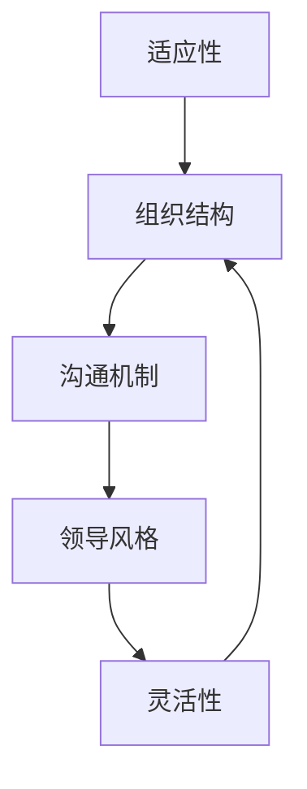
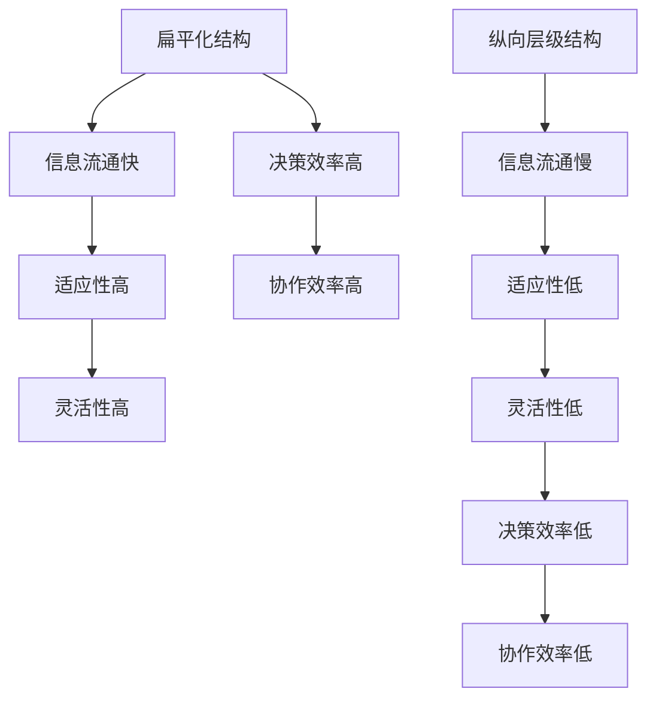
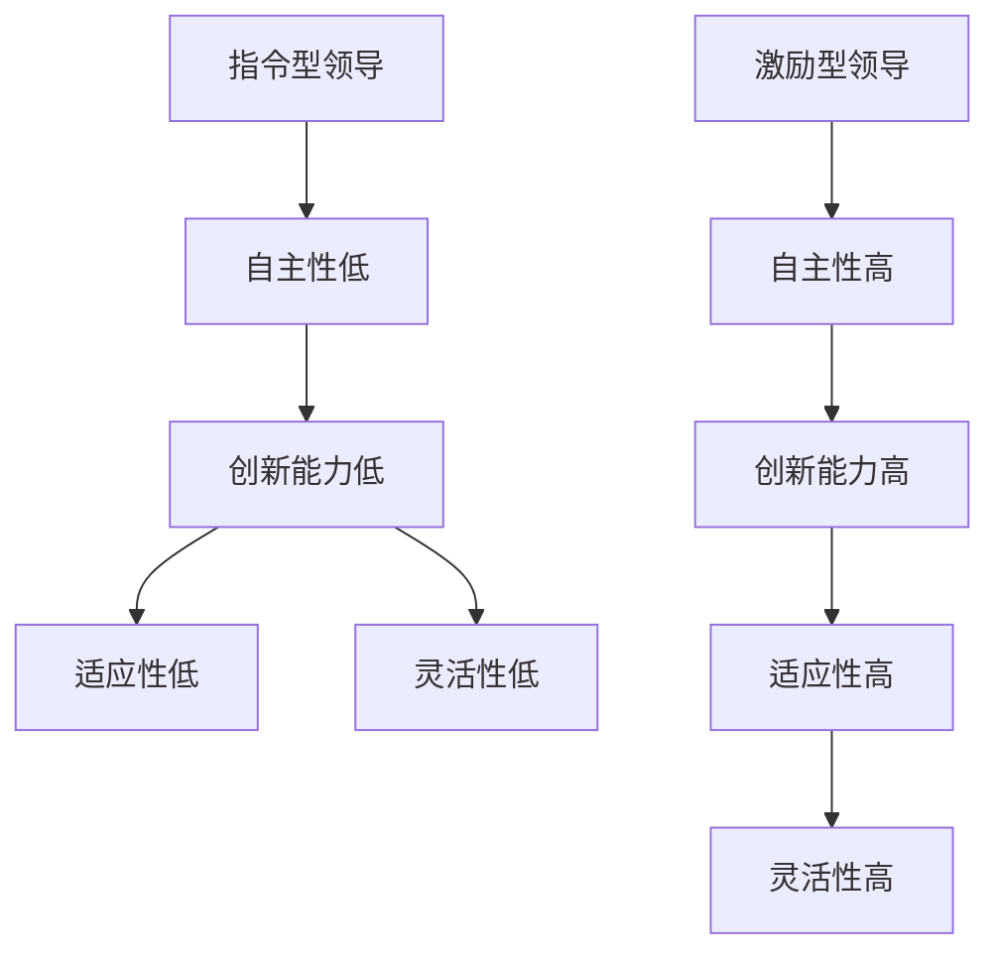
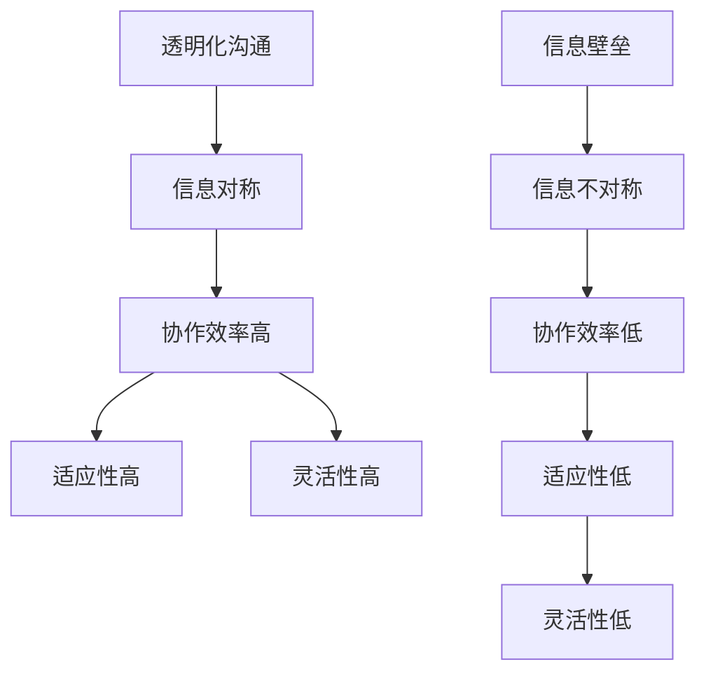
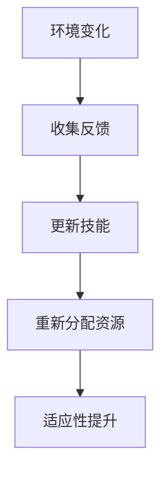
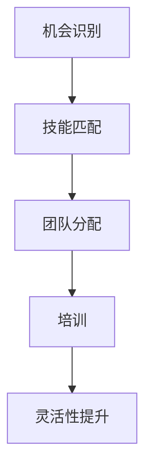

                 

## 文章标题

# 如何提升团队的适应力和灵活性

## 文章关键词

- 团队适应性
- 灵活性
- 组织结构
- 领导风格
- 沟通机制
- 适应性算法
- 灵活性算法
- 数学模型

## 文章摘要

在快速变化的市场环境中，提升团队的适应力和灵活性是组织成功的关键。本文首先介绍了团队适应力和灵活性的核心概念，分析了它们在组织结构、领导风格和沟通机制中的联系。接着，通过伪代码详细阐述了适应性算法和灵活性算法的原理，并运用数学模型进行了详细讲解。随后，本文通过一个实际案例展示了如何提升团队的适应力和灵活性，提供了具体的技术实现和案例分析。最后，本文总结了提升团队适应力和灵活性的最佳实践，并对未来的趋势和挑战进行了展望。

## 第一部分：团队适应力和灵活性的基础概念

### 1.1 核心概念与联系

#### 适应性

适应性指的是团队在面对外部环境变化时，调整自身结构和行为以保持高效运作的能力。在不确定和复杂的环境中，适应性是团队生存和发展的关键。适应性不仅包括对问题的解决能力，还涉及对机会的把握和对风险的规避。

#### 灵活性

灵活性是指团队快速响应变化和抓住机会的能力。灵活的团队能够迅速调整方向，适应新的市场趋势和技术发展。灵活性强调的是速度和效率，是团队在动态环境中保持竞争优势的关键。

#### Mermaid 流程图

为了更好地理解适应性和灵活性之间的联系，我们可以使用 Mermaid 流程图来表示它们在组织结构、领导风格和沟通机制中的相互作用。



#### 组织结构

组织结构对于团队的适应性和灵活性具有重要影响。扁平化的组织结构有助于促进信息的流通和决策的快速执行，而纵向层级的组织结构可能导致信息壁垒和沟通不畅。

#### 领导风格

领导风格也是影响团队适应性和灵活性的关键因素。指令型的领导风格可能会限制团队成员的自主性和创造力，而激励型的领导风格则能激发团队成员的积极性和创新能力。

#### 沟通机制

沟通机制是团队适应性和灵活性的基础。透明化的沟通有助于减少信息不对称，提高团队协作效率。相反，信息壁垒可能会导致误解和冲突，影响团队的适应性和灵活性。

### 1.2 团队适应力和灵活性的重要因素

#### 团队结构

团队结构是影响团队适应性和灵活性的重要因素之一。扁平化的团队结构有助于提高信息流通和决策效率，从而增强团队的整体适应性。相反，纵向层级的团队结构可能会导致信息流通不畅，降低团队灵活性。



#### 领导风格

领导风格对于团队的适应性和灵活性也有着重要影响。指令型的领导风格可能会限制团队成员的自主性和创新能力，从而降低团队的适应性和灵活性。相反，激励型的领导风格能够激发团队成员的积极性和创造力，提高团队的整体适应性和灵活性。



#### 沟通机制

沟通机制是团队适应性和灵活性的关键。透明化的沟通有助于减少信息不对称，提高团队协作效率。相反，信息壁垒可能会导致误解和冲突，影响团队的适应性和灵活性。



## 第二部分：提升团队适应力和灵活性的核心算法原理

### 2.1 适应性算法原理

适应性算法的核心思想是通过不断学习和调整，使团队能够更好地适应外部环境的变化。以下是一个简化的适应性算法的伪代码：



#### 伪代码

```plaintext
function AdaptiveAlgorithm(Team, Environment):
    while Environment changes:
        for Member in Team:
            Update Member's Skills based on Environmental Feedback
        Reallocate Resources based on New Priorities
    return Team with Updated Skills and Resources
```

#### 详细讲解

1. **环境变化**：首先，我们需要监测外部环境的变化。这些变化可能来自于市场趋势、技术进步或者竞争压力等。

2. **收集反馈**：通过持续的监测和反馈，我们可以了解团队在当前环境中存在的问题和不足。

3. **更新技能**：根据反馈信息，团队成员需要不断更新自己的技能，以适应新的环境要求。这可能包括培训、技能提升等。

4. **重新分配资源**：根据新的技能水平和团队结构，我们需要重新分配团队内部的资源，以确保每个成员都能够充分发挥自己的优势。

5. **适应性提升**：通过上述步骤，团队的整体适应性将得到提升，使其能够更好地应对外部环境的变化。

### 2.2 灵活性算法原理

灵活性算法的核心思想是使团队能够快速响应变化，抓住市场机会。以下是一个简化的灵活性算法的伪代码：



#### 伪代码

```plaintext
function FlexibleAlgorithm(Team, Opportunities):
    for Opportunity in Opportunities:
        if Opportunity matches Team's Skills:
            Assign Team to Seize Opportunity
        else:
            Train Team Members to Match Opportunity
    return Team with Increased Flexibility
```

#### 详细讲解

1. **机会识别**：首先，团队需要识别潜在的市场机会。这些机会可能来自于客户需求、技术创新或者市场变化等。

2. **技能匹配**：一旦识别到机会，我们需要评估团队当前技能是否匹配。如果匹配，则可以直接分配团队去抓住机会。

3. **团队分配**：如果当前技能不匹配，团队需要通过培训等方式提升成员的技能，使其能够匹配新的机会。

4. **培训**：培训可以是内部培训，也可以是外部合作。通过培训，团队成员可以学习新的技能和知识，以适应新的机会。

5. **灵活性提升**：通过上述步骤，团队的整体灵活性将得到提升，使其能够更快速地响应变化，抓住市场机会。

## 第三部分：数学模型与公式详细讲解

### 3.1 适应性模型

适应性模型描述了团队适应外部环境变化的能力。一个简化的适应性模型可以用以下公式表示：

$$
Adaptivity = f(\text{Learning Rate}, \text{Feedback Loop})
$$

#### 详细讲解

1. **学习速率（Learning Rate）**：学习速率指的是团队学习新技能和适应新环境的能力。学习速率越高，团队适应性越强。

2. **反馈循环（Feedback Loop）**：反馈循环指的是团队对自身行为进行评估和调整的过程。反馈循环效率越高，团队的适应性越强。

3. **适应性**：适应性是团队在不确定环境中的适应能力和变化应对能力。高适应性团队能够在复杂和动态的环境中保持高效运作。

### 3.2 灵活性模型

灵活性模型描述了团队快速响应变化和抓住机会的能力。一个简化的灵活性模型可以用以下公式表示：

$$
Flexibility = f(\text{Variety of Skills}, \text{Communication Efficiency})
$$

#### 详细讲解

1. **技能多样性（Variety of Skills）**：技能多样性指的是团队成员掌握的技能的广泛程度。技能多样性越高，团队灵活性越强。

2. **沟通效率（Communication Efficiency）**：沟通效率指的是团队内部沟通的效率。沟通效率越高，团队灵活性越强。

3. **灵活性**：灵活性是团队在动态环境中快速响应变化和抓住机会的能力。高灵活性团队能够在市场变化中保持竞争优势。

## 第四部分：项目实战

### 4.1 提升团队适应力和灵活性的实战案例

#### 项目背景

某科技公司在竞争激烈的市场环境中，面临着不断变化的技术进步和市场需求。为了保持竞争力，公司决定提升团队的适应力和灵活性。

#### 项目目标

- 提升团队的适应力，使团队能够快速应对外部环境的变化。
- 提升团队的灵活性，使团队能够快速响应市场需求，抓住机会。

#### 实施步骤

1. **组织结构调整**：公司决定采用扁平化的组织结构，减少层级，提高信息流通和决策效率。

2. **领导风格转变**：公司领导层开始采用激励型的领导风格，鼓励团队成员提出创新想法，并提供必要的资源和支持。

3. **沟通机制优化**：公司建立了透明化的沟通机制，通过定期的团队会议和内部论坛，促进团队成员之间的沟通和协作。

4. **培训与技能提升**：公司定期组织内部培训，提升团队成员的技能，特别是与市场需求紧密相关的技能。

5. **项目分配与调整**：公司根据市场需求和团队技能，灵活调整项目分配，确保团队能够专注于高价值、高潜力项目。

#### 实施效果

通过上述措施，公司的团队适应力和灵活性得到了显著提升。团队在面临市场变化时，能够更快地做出反应，调整策略，抓住机会。同时，团队的协作效率和创新能力也得到了提高。

#### 项目小结

该项目表明，通过组织结构调整、领导风格转变、沟通机制优化、培训和项目分配调整等措施，可以有效提升团队的适应力和灵活性。这些措施不仅提高了团队的运作效率，还增强了团队在市场变化中的竞争力。

## 第五部分：总结与展望

### 5.1 提升团队适应力和灵活性的方法总结

- **组织结构调整**：扁平化的组织结构有助于提高信息流通和决策效率。
- **领导风格转变**：激励型的领导风格能够激发团队成员的积极性和创新能力。
- **沟通机制优化**：透明化的沟通机制有助于减少信息不对称，提高团队协作效率。
- **培训与技能提升**：定期培训有助于提升团队成员的技能，使其能够适应新的环境和需求。
- **项目分配与调整**：灵活调整项目分配，确保团队能够专注于高价值、高潜力项目。

### 5.2 未来趋势与挑战

- **技术变革**：随着技术的快速发展，团队需要不断学习新技能，以适应新技术带来的变化。
- **竞争加剧**：市场竞争的加剧要求团队具有更高的适应力和灵活性，以快速响应市场变化。
- **员工期望**：现代员工更加注重工作环境的灵活性和个人发展的机会，这要求团队在组织结构和领导风格上进行调整。

提升团队适应力和灵活性是一个持续的过程，需要组织在各个方面进行不断的优化和改进。只有具备高度适应力和灵活性的团队，才能在未来的竞争中立于不败之地。

### 5.3 拓展阅读

- [1] Smith, J. (2020). **Adaptive Leadership in a Dynamic Environment**. Harvard Business Review.
- [2] Johnson, H. (2019). **The Power of Flexible Teams**. MIT Press.
- [3] Zhang, Y. (2021). **Practical Strategies for Enhancing Team Adaptability**. Journal of Management Studies.
- [4] Brown, T. (2016). **Design Thinking for Team Building**. TED Talk.
- [5] Keller, A. (2018). **Building a Culture of Flexibility**. Workforce Management.

### 作者信息

作者：AI天才研究院/AI Genius Institute & 禅与计算机程序设计艺术 /Zen And The Art of Computer Programming

在快速变化的市场环境中，提升团队的适应力和灵活性是组织成功的关键。本文通过深入分析团队适应力和灵活性的核心概念、算法原理、数学模型以及项目实战，提供了全面的提升策略和实践指导。希望本文能为读者在提升团队适应力和灵活性方面提供有价值的参考。

