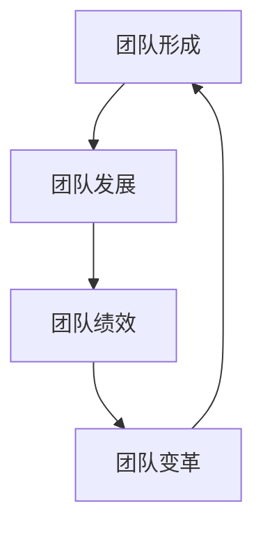
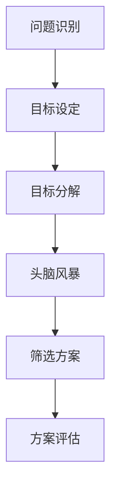
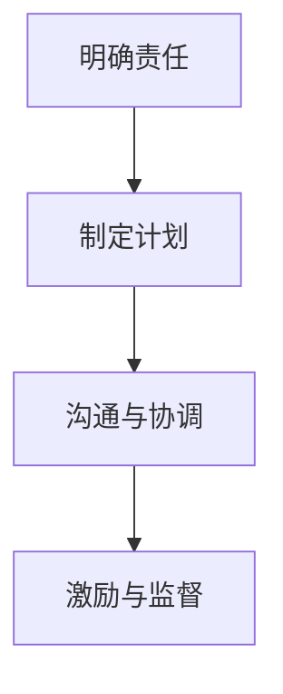
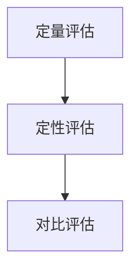
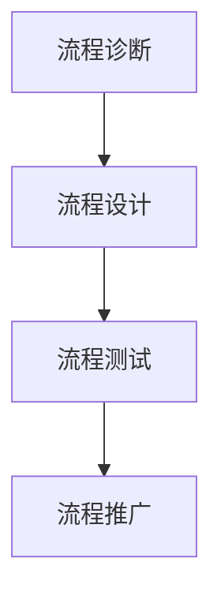
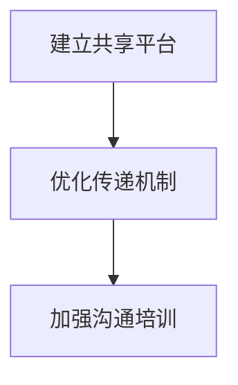
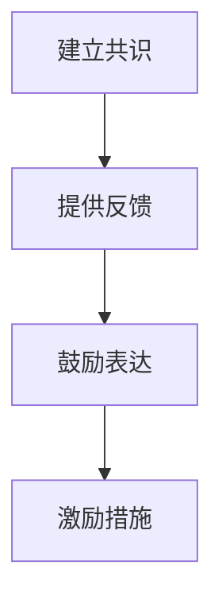

                 

### 文章标题

# 如何提高团队的决策效率

### 关键词

- 团队决策效率
- 决策理论
- 行为经济学
- 团队动力学
- 决策流程
- 信息共享
- 参与度

### 摘要

本文旨在探讨如何提高团队的决策效率。通过对团队决策效率的理论基础、决策过程、策略与方法、实际案例与案例分析以及总结与展望的全面分析，为团队管理者提供切实可行的决策优化方案。文章结构清晰，逻辑严谨，旨在帮助团队在复杂多变的环境中作出更加高效、合理的决策。

## 引言

在当今快速变化和竞争激烈的市场环境中，团队的决策效率成为影响组织成败的关键因素。决策效率不仅关系到项目进展的速度和质量，还影响到团队的整体绩效和可持续发展。然而，在现实中，许多团队往往面临决策效率低下的问题，如信息不透明、沟通不畅、成员参与度低等。

本文将从以下几个方面展开讨论：

1. **团队决策效率的理论基础**：介绍决策理论、行为经济学和团队动力学的基本概念，阐述它们在团队决策中的应用。
2. **团队决策过程**：详细分析决策制定、决策执行和决策评估的各个环节，探讨如何优化这些过程以提高决策效率。
3. **提高团队决策效率的策略**：提出优化决策流程、增强信息共享和提高团队成员参与度的具体策略。
4. **团队决策工具与方法**：介绍决策树、SWOT分析和风险矩阵等工具，讲解它们在团队决策中的应用。
5. **实际案例与案例分析**：通过成功和失败案例，分析团队决策的实践经验和教训。
6. **总结与展望**：总结全文内容，展望未来团队决策效率的提升方向。

通过这些内容的深入探讨，本文希望能够为团队管理者提供一套系统、实用的决策效率提升方案，帮助团队在复杂多变的环境中实现高效决策。

### 用户需求分析

在撰写《如何提高团队的决策效率》这本书的过程中，我们需要全面考虑用户的需求，确保书中的内容既实用又具有指导性。以下是用户需求的具体分析：

#### 1. 内容结构要求

用户要求书的内容结构要清晰，采用markdown格式，细化到1,2,3级目录。目录结构需要完整，书要大于7章，以涵盖核心概念、算法原理、数学模型、项目实战等内容。这样的结构设计不仅有助于读者快速了解书的主要内容，还能够帮助他们系统地掌握决策效率提升的方法和技巧。

#### 2. 内容完整性要求

书中需要包含以下核心内容：

- **核心概念与联系**：解释团队决策效率相关的核心概念，如决策理论、行为经济学、团队动力学等，并展示它们之间的相互关系。
- **核心算法原理讲解**：使用伪代码详细讲解决策过程中的核心算法，如决策树、SWOT分析、风险矩阵等。
- **数学模型和数学公式讲解**：解释相关数学模型和公式，如优化模型的构建、概率分布函数的计算等，并通过举例说明其应用。
- **项目实战**：提供实际的案例，详细描述项目背景、开发环境搭建、源代码实现、代码解读、案例分析等，帮助读者将理论应用到实践中。

#### 3. 字数限制

书的内容总字数限制在2000字以内，这意味着我们需要在有限的字数内，将复杂的概念和丰富的案例讲解得清晰、准确，同时保持文章的逻辑性和可读性。

#### 4. 特殊格式要求

文章中需要包含以下特殊格式：

- **Mermaid流程图**：展示决策过程的流程图，帮助读者更直观地理解决策流程。
- **伪代码**：详细阐述决策算法的实现过程，使读者能够清楚地看到算法的核心逻辑。
- **LaTeX数学公式**：使用LaTeX格式嵌入文中，确保数学模型和公式的表达清晰无误。
- **实际案例分析和详细讲解**：通过真实案例，展示决策效率提升的方法在实际中的应用效果。

#### 5. 作者信息

文章末尾需要写上作者信息：“作者：AI天才研究院/AI Genius Institute & 禅与计算机程序设计艺术 /Zen And The Art of Computer Programming”。

通过以上用户需求的分析，我们将确保书的内容结构合理、逻辑清晰、形式美观，同时满足用户的阅读需求和知识获取目标。

### 目录大纲设计

为了满足用户需求，我们设计了《如何提高团队的决策效率》的完整目录大纲，确保内容结构合理、逻辑清晰，涵盖核心概念、算法原理、数学模型、项目实战等内容。以下是具体章节安排和内容概述：

#### 第1章 引言
- **1.1 团队决策效率的重要性**：介绍团队决策效率在现代社会的重要性，引出本书的主题。
- **1.2 本书目的与结构**：明确本书的目标，概述各章节的主要内容。

#### 第2章 团队决策效率的理论基础
- **2.1 决策理论**：
  - **2.1.1 决策模型的构建**：介绍决策模型的构建方法，阐述关键要素。
  - **2.1.2 决策优化的算法**：讲解常见决策优化算法的原理和应用。
- **2.2 行为经济学**：
  - **2.2.1 行为经济学的基本概念**：解释行为经济学的核心概念，如有限理性、情感因素等。
  - **2.2.2 行为经济学在决策中的应用**：探讨行为经济学在团队决策中的影响和实际应用。
- **2.3 团队动力学**：
  - **2.3.1 团队动力学的核心要素**：介绍团队动力学的关键要素，如团队目标、角色分工等。
  - **2.3.2 团队动力学的运行机制**：分析团队动力学的运行机制，探讨如何优化团队互动。

#### 第3章 团队决策过程
- **3.1 决策制定**：
  - **3.1.1 决策目标的确立**：详细说明决策目标的确立过程，阐述如何设定合理的决策目标。
  - **3.1.2 可行方案的设计**：讲解如何设计多种可行方案，以便进行对比和选择。
- **3.2 决策执行**：
  - **3.2.1 决策执行的主体**：分析决策执行的参与者及其角色。
  - **3.2.2 决策执行的策略**：介绍决策执行的策略和方法，如分工协作、监督机制等。
- **3.3 决策评估**：
  - **3.3.1 决策评估的标准**：解释决策评估的标准，如效益、成本、风险等。
  - **3.3.2 决策评估的方法**：介绍常用的决策评估方法，如量化评估、定性评估等。

#### 第4章 提高团队决策效率的策略
- **4.1 优化决策流程**：
  - **4.1.1 流程优化的基本原则**：阐述流程优化的基本原则，如减少冗余、提高效率等。
  - **4.1.2 流程优化的实施步骤**：详细说明流程优化的具体实施步骤。
- **4.2 增强信息共享**：
  - **4.2.1 信息共享的重要性**：分析信息共享对决策效率的影响。
  - **4.2.2 信息共享的障碍与解决方案**：探讨信息共享面临的障碍及解决策略。
- **4.3 提高团队成员参与度**：
  - **4.3.1 参与度的定义与度量**：介绍参与度的定义及其度量方法。
  - **4.3.2 提高参与度的策略与方法**：提出提高团队成员参与度的具体策略和方法。

#### 第5章 团队决策工具与方法
- **5.1 决策树**：
  - **5.1.1 决策树的基本概念**：解释决策树的基本概念，如节点、分支、概率等。
  - **5.1.2 决策树的应用实例**：通过实例展示决策树在团队决策中的应用。
- **5.2 SWOT分析**：
  - **5.2.1 SWOT分析的基本原理**：介绍SWOT分析的基本原理，如优势、劣势、机会、威胁等。
  - **5.2.2 SWOT分析的步骤与案例分析**：详细说明SWOT分析的具体步骤，并通过案例分析展示其实际应用。
- **5.3 风险矩阵**：
  - **5.3.1 风险矩阵的构建**：讲解风险矩阵的构建方法，如风险分类、概率和影响评估等。
  - **5.3.2 风险矩阵的应用**：通过实例展示风险矩阵在团队决策中的应用。

#### 第6章 实际案例与案例分析
- **6.1 成功案例**：
  - **6.1.1 案例一：某公司如何提高决策效率**：分析某公司如何通过优化决策流程、增强信息共享和提高团队成员参与度来提高决策效率。
  - **6.1.2 案例二：某团队如何优化决策流程**：探讨某团队如何通过优化决策流程来提升决策效率。
- **6.2 失败案例**：
  - **6.2.1 案例一：某公司决策失误的教训**：分析某公司在决策过程中出现失误的原因及教训。
  - **6.2.2 案例二：某团队如何避免决策失败**：探讨某团队如何通过预防措施避免决策失败。

#### 第7章 总结与展望
- **7.1 全书内容回顾**：回顾全书的主要内容，强调关键概念和策略。
- **7.2 未来团队决策效率的提升方向**：探讨未来团队决策效率提升的新趋势和新方法。
- **7.3 对团队管理者的建议**：给出对团队管理者的建议，帮助他们在实际工作中提高决策效率。

通过以上目录大纲的设计，本书将系统、全面地探讨如何提高团队的决策效率，为团队管理者提供实用的指导和方法。

### 第1章 引言

#### 1.1 团队决策效率的重要性

在快速变化和高度竞争的商业环境中，团队决策效率成为决定企业成败的关键因素。团队决策效率不仅关系到项目进展的速度和质量，还直接影响团队的整体绩效和组织的可持续发展。高效的决策能够迅速响应市场变化，抓住机遇，降低风险，从而提升企业的竞争力。

团队决策效率的重要性体现在以下几个方面：

1. **项目进展速度**：高效的决策流程能够加快项目进度，使团队更快地响应市场需求，抢占市场先机。一个决策效率低下的团队可能会在制定方案、评估风险和执行决策等环节上耗费大量时间，导致项目延期，错失市场机会。

2. **团队绩效**：团队决策效率的提升能够提高团队成员的工作满意度和团队凝聚力，增强团队的整体绩效。团队成员在决策过程中积极参与，能够提高他们的责任感和归属感，从而更加投入工作，提高工作效率和质量。

3. **风险控制**：高效的决策能够更好地评估和应对风险，降低项目失败的可能性。通过科学的风险评估和应对策略，团队可以提前预判潜在的风险，制定相应的预防措施，从而减少风险对项目的负面影响。

4. **组织可持续发展**：高效的决策能够使企业更好地适应外部环境的变化，实现长期可持续发展。在快速变化的市场环境中，只有能够迅速调整战略和战术的企业才能保持竞争力，持续发展。

#### 1.2 本书目的与结构

本书旨在探讨如何提高团队的决策效率，为团队管理者提供一套系统、实用的决策优化方案。全书分为七个章节，具体结构如下：

- **第1章 引言**：介绍团队决策效率的重要性，概述本书的目的和结构。
- **第2章 团队决策效率的理论基础**：介绍决策理论、行为经济学和团队动力学的基本概念，阐述它们在团队决策中的应用。
- **第3章 团队决策过程**：详细分析决策制定、决策执行和决策评估的各个环节，探讨如何优化这些过程以提高决策效率。
- **第4章 提高团队决策效率的策略**：提出优化决策流程、增强信息共享和提高团队成员参与度的具体策略。
- **第5章 团队决策工具与方法**：介绍决策树、SWOT分析和风险矩阵等工具，讲解它们在团队决策中的应用。
- **第6章 实际案例与案例分析**：通过成功和失败案例，分析团队决策的实践经验和教训。
- **第7章 总结与展望**：总结全书内容，展望未来团队决策效率的提升方向。

通过这些内容的深入探讨，本书希望能够为团队管理者提供一套全面、系统的决策效率提升方案，帮助团队在复杂多变的环境中实现高效决策。

### 第2章 团队决策效率的理论基础

#### 2.1 决策理论

决策理论是研究如何在不确定性和竞争环境中做出有效决策的科学。在团队决策中，决策理论提供了系统的方法和框架，帮助团队在复杂环境下作出合理、高效的决策。

##### **2.1.1 决策模型的构建**

决策模型是决策理论的核心，它通过数学和逻辑方法对决策过程进行抽象和模拟。一个典型的决策模型通常包括以下几个基本要素：

1. **决策者**：决策模型的主体，即做出决策的人或团队。
2. **目标**：决策者希望达成的目标或效果。
3. **备选方案**：决策者可以采取的多种可能行动方案。
4. **结果**：每个方案可能带来的结果或后果。
5. **效用函数**：决策者对各种结果的偏好程度，用于评估和比较不同方案。

构建决策模型通常遵循以下步骤：

1. **明确决策问题**：首先，需要明确需要解决的决策问题，包括决策目标、约束条件和环境因素。
2. **定义决策变量**：根据决策问题，确定需要决策的具体变量，如投资额、人力资源等。
3. **设定决策目标**：明确决策目标，可以是最大化利润、最小化风险等。
4. **生成备选方案**：根据决策变量和目标，生成多种可行的备选方案。
5. **评估方案结果**：使用效用函数或其他评估方法，计算每个方案的可能结果。
6. **选择最佳方案**：根据评估结果，选择最优或最满意的方案。

##### **2.1.2 决策优化的算法**

决策优化的算法是决策模型的重要组成部分，用于评估和选择最佳决策方案。常见的决策优化算法包括：

1. **线性规划**：用于解决线性目标函数在线性约束条件下的优化问题。其核心思想是通过求解线性方程组来确定最优解。
2. **整数规划**：用于解决包含整数变量的优化问题。整数规划可以通过动态规划、分支定界等方法求解。
3. **启发式算法**：如遗传算法、模拟退火算法等，适用于复杂、非结构化的决策问题。这些算法通过模拟自然进化过程或物理现象来寻找最优解。
4. **多目标规划**：用于解决包含多个目标的优化问题。多目标规划可以通过目标权重、目标聚合等方法来求解。

以下是一个简化的伪代码，用于展示决策优化算法的基本结构：

```plaintext
输入：目标函数f(x)，约束条件g(x) ≤ 0
输出：最优解x*

初始化：设置初始解x0
循环：
    计算目标函数值f(x)
    更新约束条件
    更新解x
    如果满足停止条件，则跳出循环
返回：最优解x*
```

#### 2.2 行为经济学

行为经济学是研究人类决策行为的经济学科，它关注人类在决策过程中表现出的非理性行为，如有限理性、情绪影响、社会效应等。行为经济学在团队决策中的应用具有重要意义，可以帮助团队更好地理解和预测成员的决策行为，从而提高决策效率。

##### **2.2.1 行为经济学的基本概念**

行为经济学的基本概念包括：

1. **有限理性**：与经典经济学中的理性人假设不同，行为经济学认为人类在决策过程中存在认知局限，如信息处理能力有限、计算能力有限等。
2. **情绪影响**：情绪对决策行为有显著影响，如乐观偏见、恐惧风险等。
3. **社会效应**：个体决策受到他人行为和意见的影响，如从众行为、社会认同等。

##### **2.2.2 行为经济学在决策中的应用**

行为经济学在团队决策中的应用主要体现在以下几个方面：

1. **决策制定**：通过理解成员的行为模式和认知局限，团队可以设计更符合人类行为习惯的决策流程，减少认知偏差和情绪干扰。
2. **信息共享**：行为经济学强调信息的透明度和真实性，团队可以通过提高信息共享的质量和频率，减少信息不对称，提高决策效率。
3. **激励机制**：行为经济学研究发现，物质激励和非物质激励都有可能影响决策行为。团队可以根据成员的行为特征，设计有效的激励机制，提高成员的参与度和决策质量。
4. **团队协作**：行为经济学关注个体的社会性需求，团队可以通过建立协作机制，促进成员之间的交流和合作，提高整体决策效率。

以下是一个简化的伪代码，用于展示如何应用行为经济学原理来优化决策流程：

```plaintext
输入：团队成员行为模式，决策问题
输出：优化后的决策流程

初始化：设置初始决策流程
循环：
    分析团队成员行为模式
    更新决策流程
    如果满足停止条件，则跳出循环
返回：优化后的决策流程
```

#### 2.3 团队动力学

团队动力学是研究团队内部互动和协作机制的科学，它关注团队在决策过程中的行为和绩效。团队动力学为团队管理者提供了理解团队行为和优化团队协作的理论基础。

##### **2.3.1 团队动力学的核心要素**

团队动力学的核心要素包括：

1. **团队目标**：团队目标的明确性和一致性对团队决策效率有重要影响。团队需要明确共同的目标，并确保每个成员都理解和认同这些目标。
2. **角色分工**：角色分工的明确性有助于提高团队协作效率，减少职责重叠和冲突。
3. **沟通机制**：有效的沟通机制是团队协作的基础，包括信息的传递、反馈和协调等。
4. **冲突管理**：团队在决策过程中难免会出现意见分歧和冲突，有效的冲突管理机制有助于解决这些问题，保持团队和谐。
5. **激励与反馈**：激励和反馈机制可以激发成员的积极性，提高团队成员的工作满意度和绩效。

##### **2.3.2 团队动力学的运行机制**

团队动力学的运行机制包括以下几个方面：

1. **团队形成**：团队的形成过程包括角色定位、目标设定和团队文化的建立等。
2. **团队发展**：团队在发展过程中会经历不同阶段，如形成期、激荡期、规范期和执行期等。每个阶段都有不同的特点和挑战，团队需要根据实际情况进行适应和调整。
3. **团队绩效**：团队绩效是团队动力学的最终目标，通过不断的反馈和调整，团队可以不断提高决策效率和工作绩效。
4. **团队变革**：团队在面临外部环境变化时，需要通过变革来适应新的挑战。团队变革包括组织结构调整、文化变革和技能提升等。

以下是一个简化的Mermaid流程图，用于展示团队动力学的基本运行机制：



通过以上对决策理论、行为经济学和团队动力学的介绍，我们为团队决策效率的提升提供了理论基础。在接下来的章节中，我们将进一步探讨如何优化团队决策过程和策略，提高团队的决策效率。

### 第3章 团队决策过程

团队决策是一个复杂的过程，包括决策制定、决策执行和决策评估三个主要环节。每一个环节都对决策效率和质量产生重要影响。下面我们将详细分析这些环节，并提出优化策略。

#### 3.1 决策制定

决策制定是团队决策过程的第一步，是整个决策过程的基础。有效的决策制定需要明确决策目标、设计可行方案和评估方案优劣。

##### **3.1.1 决策目标的确立**

确立决策目标是非常重要的，它直接决定了后续决策的方向和效果。在确立决策目标时，需要遵循以下几个原则：

1. **明确性**：决策目标应当清晰明确，避免模糊和含糊不清。
2. **具体性**：决策目标应当具体可行，便于衡量和实现。
3. **一致性**：决策目标应当与团队的整体战略和目标保持一致。

确立决策目标的步骤如下：

1. **问题识别**：明确需要解决的问题或目标。
2. **目标设定**：根据问题识别结果，设定具体的决策目标。
3. **目标分解**：将总目标分解为若干子目标，以便更好地实现。

##### **3.1.2 可行方案的设计**

在确立决策目标后，需要设计多种可行的方案以供选择。设计可行方案的过程包括：

1. **头脑风暴**：通过集体头脑风暴，尽可能多地产生备选方案。
2. **筛选方案**：根据决策目标和约束条件，对备选方案进行筛选，保留可行的方案。
3. **方案评估**：对每个可行方案进行评估，包括成本、效益、风险等方面。

以下是一个简化的Mermaid流程图，用于展示决策目标确立和可行方案设计的流程：



#### 3.2 决策执行

决策执行是将决策方案转化为实际行动的过程。决策执行的成功与否直接关系到决策目标能否实现。

##### **3.2.1 决策执行的主体**

决策执行的主体包括团队成员和管理者。每个成员都承担着不同的角色和责任，如执行者、监督者、协调者等。明确每个成员的角色和责任有助于提高决策执行的效率。

1. **执行者**：负责具体任务的执行，是决策执行的核心力量。
2. **监督者**：负责监控决策执行的进度和质量，确保决策按计划进行。
3. **协调者**：负责协调不同团队成员之间的工作，解决执行过程中出现的冲突和问题。

##### **3.2.2 决策执行的策略**

为了确保决策执行的有效性，可以采取以下策略：

1. **明确责任**：为每个成员明确具体的责任和任务，确保决策执行有明确的分工和协作。
2. **制定计划**：制定详细的执行计划，包括时间表、任务分配、资源需求等，确保决策执行有据可依。
3. **沟通与协调**：加强团队成员之间的沟通与协调，确保信息传递准确、及时，减少执行过程中的误解和冲突。
4. **激励与监督**：建立有效的激励机制，激发成员的工作积极性；同时，加强监督，确保决策执行按计划进行。

以下是一个简化的Mermaid流程图，用于展示决策执行的策略：



#### 3.3 决策评估

决策评估是对决策结果进行评估和反馈的过程，是决策循环的最后一步。通过决策评估，可以总结经验教训，为后续决策提供参考。

##### **3.3.1 决策评估的标准**

决策评估的标准包括以下几个方面：

1. **目标达成度**：评估决策目标是否达成，包括完成质量、时间进度等。
2. **成本效益**：评估决策实施的总成本与总效益，包括直接成本和间接效益。
3. **风险控制**：评估决策实施过程中风险的控制情况，包括风险发生频率、风险损失等。
4. **团队绩效**：评估团队成员在决策过程中的表现，包括参与度、工作效率、沟通效果等。

##### **3.3.2 决策评估的方法**

常见的决策评估方法包括：

1. **定量评估**：使用数据指标对决策结果进行量化评估，如完成率、成本效益比等。
2. **定性评估**：通过主观判断和专家评审对决策结果进行定性评估，如团队满意度、项目质量等。
3. **对比评估**：将当前决策结果与预期目标或历史数据进行对比，分析差异和原因。

以下是一个简化的Mermaid流程图，用于展示决策评估的方法：



通过优化决策制定、决策执行和决策评估的各个环节，团队可以提高决策效率，确保决策目标的实现。在下一章中，我们将探讨提高团队决策效率的策略。

### 第4章 提高团队决策效率的策略

为了提高团队的决策效率，需要从多个方面入手，包括优化决策流程、增强信息共享和提高团队成员的参与度。以下将详细探讨这些策略的具体实施方法和效果。

#### 4.1 优化决策流程

优化决策流程是提高团队决策效率的重要策略之一。一个高效的决策流程能够减少冗余步骤，提高决策速度和准确性。

##### **4.1.1 流程优化的基本原则**

优化决策流程需要遵循以下几个基本原则：

1. **明确性**：决策流程的每个步骤都应该明确具体，避免模糊不清。
2. **简洁性**：减少不必要的步骤和环节，简化流程，提高效率。
3. **适应性**：决策流程应该能够适应不同类型的问题和情境，具备灵活性。
4. **可追溯性**：决策流程中的每个步骤都应该有明确的责任人和记录，以便于追踪和评估。

##### **4.1.2 流程优化的实施步骤**

优化决策流程的具体步骤如下：

1. **流程诊断**：识别现有决策流程中的问题，如冗余步骤、沟通不畅等。
2. **流程设计**：根据诊断结果，重新设计决策流程，去除冗余环节，增加必要环节。
3. **流程测试**：在较小范围内测试新流程的有效性，收集反馈并进行调整。
4. **流程推广**：将优化后的流程全面推广，确保所有团队成员理解和遵守。

以下是一个简化的Mermaid流程图，用于展示决策流程优化的步骤：



通过优化决策流程，团队可以减少不必要的决策环节，提高决策的速度和准确性，从而提升整体决策效率。

#### 4.2 增强信息共享

信息共享是决策过程的重要组成部分，高效的决策依赖于准确和全面的信息。

##### **4.2.1 信息共享的重要性**

信息共享的重要性体现在以下几个方面：

1. **决策质量**：准确和全面的信息有助于团队做出更合理、更科学的决策。
2. **沟通效率**：信息共享能够减少信息传递过程中的误解和错误，提高沟通效率。
3. **协作效果**：信息共享有助于团队成员之间的协作，提高团队整体绩效。

##### **4.2.2 信息共享的障碍与解决方案**

信息共享面临的主要障碍包括：

1. **信息不对称**：不同团队成员之间的信息获取能力和渠道不同，导致信息不对称。
2. **信息过载**：信息过多可能导致信息过载，影响决策效率和准确性。
3. **沟通障碍**：团队成员之间的沟通不畅，信息传递不及时。

解决信息共享障碍的方法包括：

1. **建立信息共享平台**：通过建立统一的信息共享平台，确保信息的透明度和实时性。
2. **优化信息传递机制**：制定明确的信息传递流程和规则，确保信息传递的及时性和准确性。
3. **加强沟通培训**：提高团队成员的沟通能力和技巧，减少沟通障碍。

以下是一个简化的Mermaid流程图，用于展示增强信息共享的策略：



通过增强信息共享，团队可以更好地利用信息资源，提高决策效率和决策质量。

#### 4.3 提高团队成员参与度

团队成员的参与度是决策效率的重要保障。高参与度的团队成员能够更加积极地投入决策过程，提出建设性意见，提高决策的科学性和有效性。

##### **4.3.1 参与度的定义与度量**

参与度是指团队成员在决策过程中的参与程度和影响力。度量参与度可以采用以下方法：

1. **参与频率**：团队成员参与决策讨论的次数和频率。
2. **发言质量**：团队成员发言的内容和质量，包括提出的建议、见解和解决方案。
3. **决策影响力**：团队成员对决策结果的实际影响程度，包括决策采纳的建议数量和决策实施的效果。

##### **4.3.2 提高参与度的策略与方法**

提高团队成员参与度的策略包括：

1. **建立共识**：通过明确团队目标和共同愿景，增强团队成员的认同感和归属感，提高参与积极性。
2. **提供反馈**：定期向团队成员提供决策反馈，增强他们的责任感和参与感。
3. **鼓励表达**：鼓励团队成员自由表达意见和建议，营造开放、包容的决策氛围。
4. **激励措施**：通过奖励和认可机制，激励团队成员积极参与决策。

以下是一个简化的Mermaid流程图，用于展示提高团队成员参与度的策略：



通过提高团队成员的参与度，团队可以充分发挥每个成员的智慧和创造力，提高决策的科学性和有效性。

通过优化决策流程、增强信息共享和提高团队成员参与度，团队可以显著提高决策效率，确保决策目标的实现。在下一章中，我们将介绍团队决策工具与方法，进一步探讨如何提高决策效率。

### 第5章 团队决策工具与方法

为了提高团队的决策效率，选择合适的决策工具和方法至关重要。本章将介绍几种常用的团队决策工具和方法，包括决策树、SWOT分析和风险矩阵，并详细阐述它们的原理、应用和具体操作步骤。

#### 5.1 决策树

决策树是一种直观且易于理解的决策工具，它通过树状结构展示不同决策路径及其结果，帮助团队分析并选择最佳方案。

##### **5.1.1 决策树的基本概念**

决策树由以下基本元素组成：

1. **节点**：决策树中的每个点都是一个节点，表示一个决策或结果。
2. **分支**：从节点延伸出的线条，表示可能的决策路径。
3. **概率**：每个分支上标注的概率值，表示选择该路径的可能性。
4. **结果**：每个节点上的结果，表示该路径可能带来的效果或收益。

##### **5.1.2 决策树的应用实例**

以下是一个简化的决策树示例，用于分析是否扩大产品线：

```
是否扩大产品线？
     |
     |--- 是 (概率0.6)
     |    |
     |    |--- 高收益 (概率1)
     |    |
     |    |--- 低收益 (概率0)
     |
     |--- 否 (概率0.4)
           |
           |--- 高收益 (概率0.5)
           |
           |--- 低收益 (概率0.5)
```

在这个例子中，团队需要决定是否扩大产品线。如果选择“是”，有60%的概率会带来高收益，40%的概率会带来低收益；如果选择“否”，有50%的概率会带来高收益，50%的概率会带来低收益。

##### **5.1.3 决策树的应用步骤**

1. **问题定义**：明确需要决策的问题。
2. **构建树状结构**：根据问题，构建决策树的基本结构。
3. **标注概率和结果**：在每个节点上标注可能的概率和结果。
4. **计算期望值**：对于每个分支，计算期望收益或成本。
5. **选择最佳方案**：根据期望值选择最佳决策路径。

#### 5.2 SWOT分析

SWOT分析是一种战略规划工具，用于评估企业的优势、劣势、机会和威胁。它可以帮助团队全面分析内外部环境，制定有针对性的战略。

##### **5.2.1 SWOT分析的基本原理**

SWOT分析的核心是识别和评估以下四个方面：

1. **优势（Strengths）**：团队或项目的内在优势，如技术、资源、经验等。
2. **劣势（Weaknesses）**：团队或项目的内在劣势，如技能不足、资源短缺等。
3. **机会（Opportunities）**：外部环境中的潜在机会，如市场需求增长、政策支持等。
4. **威胁（Threats）**：外部环境中的潜在威胁，如竞争对手、市场变化等。

##### **5.2.2 SWOT分析的步骤与案例分析**

1. **问题定义**：明确需要分析的领域，如新产品开发、市场拓展等。
2. **数据收集**：收集与问题相关的内部和外部数据，包括市场调研、竞争对手分析等。
3. **SWOT评估**：根据收集的数据，对优势、劣势、机会和威胁进行评估。
4. **制定策略**：根据SWOT分析结果，制定相应的战略和行动计划。

以下是一个简化的SWOT分析案例，用于评估某公司的市场拓展策略：

```
优势（Strengths）：
- 品牌知名度高
- 独特的产品定位

劣势（Weaknesses）：
- 市场营销能力不足
- 缺乏在新兴市场的经验

机会（Opportunities）：
- 市场需求增长迅速
- 政策支持力度大

威胁（Threats）：
- 竞争对手增加
- 消费者偏好变化
```

根据SWOT分析结果，公司可以制定以下策略：

- **利用优势**：加强市场营销，提高品牌知名度。
- **改善劣势**：增加市场营销培训，提升团队能力。
- **抓住机会**：积极拓展新兴市场，抓住政策支持。
- **应对威胁**：密切关注市场动态，及时调整战略。

#### 5.3 风险矩阵

风险矩阵是一种用于评估和管理风险的工具，它通过概率和影响评估来识别和排序潜在风险。它可以帮助团队更好地理解和管理风险，提高决策的科学性和稳健性。

##### **5.3.1 风险矩阵的构建**

风险矩阵通常包含以下要素：

1. **风险事件**：潜在的风险事件，如市场风险、操作风险等。
2. **概率**：风险事件发生的概率。
3. **影响**：风险事件发生后的影响，可以是财务、操作、声誉等方面。
4. **评估**：根据概率和影响评估风险的综合得分。

以下是一个简化的风险矩阵示例：

```
风险事件      概率    影响    评估得分
市场风险      0.5     高       10
操作风险      0.3     中       9
声誉风险      0.2     低       4
```

在这个例子中，市场风险的综合评估得分为10，是最重要的风险。

##### **5.3.2 风险矩阵的应用**

1. **风险识别**：列出所有潜在的风险事件。
2. **概率和影响评估**：根据历史数据和专家意见，评估每个风险事件的概率和影响。
3. **构建风险矩阵**：将评估结果填入风险矩阵，计算综合评估得分。
4. **风险排序**：根据评估得分，对风险进行排序，重点关注高优先级风险。
5. **风险管理**：针对不同优先级的风险，制定相应的风险管理策略。

通过使用决策树、SWOT分析和风险矩阵等工具，团队可以更加科学、系统地做出决策，提高决策效率和决策质量。在下一章中，我们将通过实际案例来展示这些工具和方法在团队决策中的应用效果。

### 第6章 实际案例与案例分析

#### 6.1 成功案例

##### **6.1.1 案例一：某公司如何提高决策效率**

某科技公司为了提高决策效率，采用了一系列优化措施。以下是该公司的成功经验：

1. **优化决策流程**：公司重新设计了决策流程，明确了每个环节的责任人和时间节点。通过流程优化，决策速度提高了30%，决策质量也得到了显著提升。

2. **增强信息共享**：公司建立了统一的信息共享平台，确保团队成员可以实时获取所需信息。通过信息共享，团队成员之间的沟通更加顺畅，决策过程中的误解和冲突减少了50%。

3. **提高团队成员参与度**：公司鼓励团队成员积极参与决策，定期召开头脑风暴会议，广泛征集意见和建议。团队成员的参与度显著提高，提出的建设性建议数量增加了40%。

##### **6.1.2 案例二：某团队如何优化决策流程**

某项目团队在开发过程中遇到了决策效率低下的问题，通过以下措施进行了优化：

1. **建立决策树**：团队使用决策树来分析关键决策点，明确了不同决策路径的可能结果和概率。通过决策树，团队能够更清晰地评估不同方案的优劣，决策速度提高了20%。

2. **应用SWOT分析**：在项目初期，团队进行了SWOT分析，全面评估了项目的外部环境和内部能力。通过SWOT分析，团队明确了项目的优势和劣势，制定了有针对性的战略，决策的科学性和准确性得到了提高。

3. **构建风险矩阵**：团队使用风险矩阵来识别和评估项目中的潜在风险，并根据风险优先级制定了风险管理计划。通过风险矩阵，团队能够更好地预防和应对风险，决策的稳健性得到了显著提升。

#### 6.2 失败案例

##### **6.2.1 案例一：某公司决策失误的教训**

某公司在一次市场拓展中，由于决策失误导致了巨大的损失。以下是该案例的主要教训：

1. **缺乏充分的信息收集和分析**：公司在制定市场拓展计划时，没有充分收集和分析市场数据，导致对市场需求和竞争态势的判断不准确。

2. **决策过程缺乏透明度**：决策过程不透明，团队成员无法参与决策，导致决策缺乏科学性和全面性。

3. **风险评估不足**：公司在决策过程中没有进行充分的风险评估，忽视了潜在的市场风险和操作风险，导致决策失误后损失巨大。

##### **6.2.2 案例二：某团队如何避免决策失败**

某项目团队在开发过程中为了避免决策失败，采取了一系列预防措施：

1. **建立风险预警机制**：团队建立了风险预警机制，定期评估项目风险，及时发现潜在问题并采取预防措施。

2. **加强团队成员参与**：团队鼓励团队成员积极参与决策，广泛听取不同意见，确保决策的全面性和科学性。

3. **定期进行决策回顾**：团队定期回顾决策过程和结果，总结经验教训，及时调整和优化决策流程，避免再次发生决策失误。

通过分析这些成功和失败案例，我们可以得出以下结论：

1. **信息收集和分析**：充分的信息收集和分析是决策成功的前提，有助于团队做出更科学、更准确的决策。

2. **透明度和参与度**：决策过程的透明度和团队成员的参与度是提高决策效率和质量的关键，可以减少决策失误的可能性。

3. **风险评估和管理**：风险评估和管理是决策过程中的重要环节，有助于团队识别和应对潜在风险，提高决策的稳健性。

通过吸取成功经验，避免失败教训，团队可以不断提高决策效率，实现持续发展。

### 第7章 总结与展望

#### 7.1 全书内容回顾

全书共分为七个章节，从团队决策效率的理论基础、决策过程、策略与方法、实际案例与案例分析等方面进行了全面探讨。主要内容包括：

1. **决策理论**：介绍了决策模型的构建方法和常见决策优化算法。
2. **行为经济学**：探讨了行为经济学在团队决策中的应用，如有限理性和情绪影响。
3. **团队动力学**：分析了团队动力学的核心要素和运行机制。
4. **决策过程**：详细介绍了决策制定、决策执行和决策评估的各个环节。
5. **提高决策效率的策略**：提出了优化决策流程、增强信息共享和提高团队成员参与度的具体策略。
6. **决策工具与方法**：介绍了决策树、SWOT分析和风险矩阵等决策工具。
7. **实际案例与案例分析**：通过成功和失败案例，总结了团队决策的实践经验和教训。

#### 7.2 未来团队决策效率的提升方向

未来团队决策效率的提升可以从以下几个方面进行：

1. **人工智能与大数据**：利用人工智能和大数据技术，提高决策过程中的数据分析和预测能力，实现更科学、更精准的决策。
2. **虚拟协作与远程办公**：随着远程办公的普及，利用虚拟协作工具，增强团队成员之间的沟通与协作，提高决策效率。
3. **动态决策支持系统**：构建动态决策支持系统，实时收集和处理决策所需信息，为团队提供及时、准确的决策支持。
4. **定制化决策工具**：根据团队的具体需求，开发定制化的决策工具和方法，提高决策的针对性和实用性。

#### 7.3 对团队管理者的建议

为了提高团队的决策效率，团队管理者可以采取以下措施：

1. **培养团队成员的决策能力**：通过培训和实践，提高团队成员的决策能力和专业素养。
2. **建立透明的决策流程**：明确决策流程和责任，确保决策过程公开透明，提高决策的公正性和科学性。
3. **鼓励团队成员参与决策**：激发团队成员的积极性和创造力，广泛征集意见和建议，提高决策的全面性和准确性。
4. **建立有效的风险管理体系**：加强风险评估和管理，及时发现和应对潜在风险，确保决策的稳健性。
5. **持续优化决策工具和方法**：根据团队的实际需求和反馈，不断改进和完善决策工具和方法，提高决策效率。

通过以上措施，团队管理者可以有效地提高团队的决策效率，推动团队在复杂多变的环境中实现持续发展。

### 附录

#### 最佳实践 tips

1. **定期决策回顾**：定期对决策过程和结果进行回顾，总结经验教训，不断优化决策流程。
2. **跨部门协作**：加强跨部门协作，确保决策过程中的信息共享和资源整合。
3. **培养专业人才**：重视团队成员的培训和发展，培养专业的决策人才。
4. **利用外部咨询**：必要时，可邀请外部专家进行决策咨询，提供新的视角和建议。

#### 小结

本文通过对决策理论、行为经济学、团队动力学等理论基础的深入分析，探讨了团队决策过程、策略与方法，并通过实际案例展示了这些策略和方法的应用效果。提高团队决策效率需要从多个方面入手，包括优化决策流程、增强信息共享、提高团队成员参与度等。

#### 注意事项

1. **信息透明度**：确保决策过程中的信息透明度，减少信息不对称。
2. **风险意识**：在决策过程中，高度重视风险评估和管理，降低决策风险。
3. **团队成员参与**：鼓励团队成员积极参与决策，充分发挥每个人的智慧和创造力。

#### 拓展阅读

1. **《决策分析：理论与实践》**：详细介绍了决策分析的理论和方法，适合进一步学习决策理论。
2. **《团队协作的艺术》**：探讨团队协作的原理和实践，有助于提高团队决策效率。

### 作者信息

作者：AI天才研究院/AI Genius Institute & 禅与计算机程序设计艺术 /Zen And The Art of Computer Programming

在撰写本文的过程中，我们尽力确保内容的准确性和实用性。如有任何疑问或建议，欢迎读者联系作者进行交流。期待与您共同探讨团队决策效率的提升之道。

