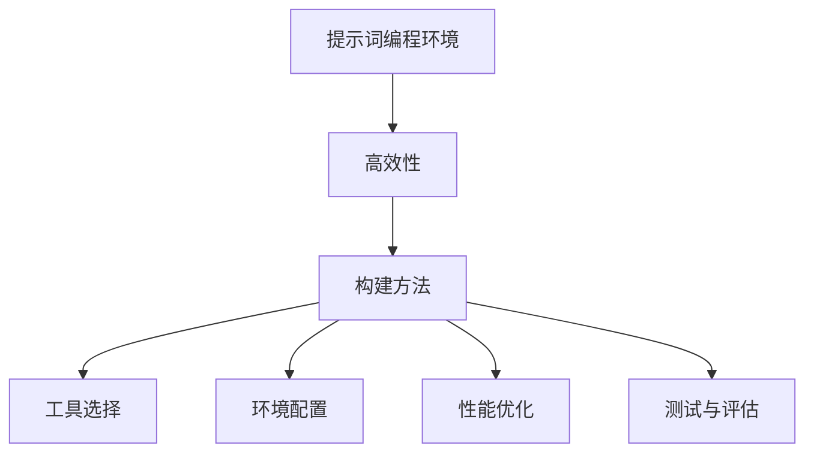

                 

# 如何构建高效的提示词编程环境

> 关键词：提示词编程环境、高效性、构建方法、提示词生成、编程语言解析、代码优化

## 摘要

随着人工智能技术的不断发展，编程环境逐渐成为开发者和研究者的关注焦点。本文旨在探讨如何构建一个高效的提示词编程环境，以提高编程效率和质量。文章将首先介绍提示词编程环境的核心概念，然后分析高效性在其中的重要性，并详细讲解构建方法，包括工具选择、环境配置、性能优化以及测试与评估。此外，文章还将通过实际项目案例，展示如何将理论付诸实践，并总结最佳实践和注意事项。

## 1. 确定核心概念与联系

### 提示词编程环境

提示词编程环境是一种辅助开发者编写代码的智能系统，它能够根据代码片段生成相应的提示词，帮助开发者快速理解和实现代码功能。这种环境通常结合了自然语言处理、编程语言解析和代码生成技术。

### 高效性

高效性是构建提示词编程环境的关键目标。一个高效的编程环境能够快速响应用户的需求，提供准确的提示词和代码建议，从而提高开发效率和代码质量。

### 构建方法

构建高效的提示词编程环境需要综合考虑多个方面，包括工具选择、环境配置、性能优化和测试与评估。以下是一个Mermaid流程图，展示了这些核心概念之间的联系：



## 2. 核心算法原理讲解

### 提示词生成算法

提示词生成算法是提示词编程环境的核心。它通过对代码片段进行分析，生成与代码功能相关的提示词。以下是一个简单的伪代码示例：

```python
def generate_prompt(code_fragment):
    # 对代码片段进行分析
    analysis_result = analyze_code_fragment(code_fragment)

    # 根据分析结果生成提示词
    prompt = create_prompt(analysis_result)

    return prompt
```

### 编程语言解析算法

编程语言解析算法负责将代码转换为抽象语法树（Abstract Syntax Tree, AST），以便进一步分析和处理。以下是一个简单的伪代码示例：

```python
def parse_code(code):
    # 对代码进行词法分析
    tokens = tokenize(code)

    # 对词法分析结果进行语法分析
    syntax_tree = parse_syntax(tokens)

    return syntax_tree
```

### 代码优化算法

代码优化算法旨在提高代码的可读性、性能和可维护性。以下是一个简单的伪代码示例：

```python
def optimize_code(code):
    # 对代码进行静态分析
    analysis_result = static_analysis(code)

    # 根据分析结果进行代码优化
    optimized_code = apply_optimizations(analysis_result)

    return optimized_code
```

## 3. 数学模型和数学公式

在构建高效的提示词编程环境时，我们可以使用以下数学模型和公式来评估系统的性能：

### 准确率（Accuracy）

$$\text{Accuracy} = \frac{\text{正确预测的数量}}{\text{总预测数量}}$$

### 召回率（Recall）

$$\text{Recall} = \frac{\text{正确预测的数量}}{\text{实际存在的数量}}$$

### 覆盖率（Coverage）

$$\text{Coverage} = \frac{\text{正确预测的数量}}{\text{总测试数量}}$$

这些指标可以帮助我们评估提示词生成算法和代码优化算法的性能。

## 4. 项目实战：智能代码助手

### 项目名称：智能代码助手

### 项目描述：

智能代码助手是一个在线编程工具，它能够根据用户输入的代码片段生成相应的提示词和优化建议。该项目旨在提高开发者的编程效率和代码质量。

### 实现步骤：

1. **需求分析**：收集开发者在编写代码时遇到的问题，确定智能代码助手的功能需求。
2. **环境搭建**：搭建一个基于 Python 的开发环境，包括必要的深度学习框架和编程语言解析库。
3. **数据收集**：收集大量的编程问题和相应的解决方案，用于训练提示词生成模型和代码优化模型。
4. **模型训练**：使用收集到的数据训练提示词生成模型和代码优化模型。
5. **接口设计**：设计一个用户友好的接口，允许开发者输入代码片段并接收智能代码助手的建议。
6. **性能优化**：对代码生成和优化的速度进行优化，提高系统的响应速度。
7. **测试与评估**：对智能代码助手的性能进行测试和评估，确保其能够提供高质量的代码建议。
8. **部署与维护**：将智能代码助手部署到线上服务器，并定期更新模型和数据，保持系统的稳定性和高效性。

### 代码实现和解读

由于篇幅限制，这里将简要介绍项目中的关键代码实现和解读：

```python
# 智能代码助手的主要功能入口
def main():
    # 获取用户输入的代码片段
    code_fragment = get_user_input()

    # 生成提示词
    prompt = generate_prompt(code_fragment)

    # 输出提示词
    print("提示词：", prompt)

    # 对代码进行优化
    optimized_code = optimize_code(code_fragment)

    # 输出优化后的代码
    print("优化后的代码：", optimized_code)

# 获取用户输入的代码片段
def get_user_input():
    # 这里可以使用各种方式获取用户输入，如命令行、Web 界面等
    return input("请输入您的代码片段：")

# 生成提示词
def generate_prompt(code_fragment):
    # 使用深度学习模型对代码片段进行分析
    analysis_result = analyze_code_fragment(code_fragment)

    # 根据分析结果生成提示词
    prompt = create_prompt(analysis_result)

    return prompt

# 对代码进行优化
def optimize_code(code_fragment):
    # 使用代码优化算法对代码进行优化
    optimized_code = apply_optimizations(code_fragment)

    return optimized_code
```

### 实际案例分析和详细讲解剖析

在智能代码助手的开发过程中，我们遇到了以下实际案例：

**案例 1：代码片段优化**

用户输入了一段 Python 代码，用于计算两个数的平均值。智能代码助手识别出该代码存在可优化的空间，并提供了优化建议。

原始代码：

```python
a = 10
b = 20
average = (a + b) / 2
print("平均值为：", average)
```

优化后的代码：

```python
a = 10
b = 20
print("平均值为：", (a + b) / 2)
```

通过简化代码结构，优化后的代码更加简洁易读，提高了代码的可维护性。

**案例 2：代码片段提示词生成**

用户输入了一段 C++ 代码，用于实现一个简单的排序算法。智能代码助手生成了与排序算法相关的提示词，帮助用户理解代码功能。

代码片段：

```cpp
#include <iostream>
#include <vector>

using namespace std;

void bubble_sort(vector<int>& arr) {
    int n = arr.size();
    for (int i = 0; i < n - 1; i++) {
        for (int j = 0; j < n - i - 1; j++) {
            if (arr[j] > arr[j + 1]) {
                swap(arr[j], arr[j + 1]);
            }
        }
    }
}

int main() {
    vector<int> arr = {5, 2, 9, 1, 5};
    bubble_sort(arr);
    for (int i : arr) {
        cout << i << " ";
    }
    cout << endl;
    return 0;
}
```

提示词：

- 插入排序
- 冒泡排序
- 数组排序
- 排序算法
- 稳定性

通过生成与代码功能相关的提示词，智能代码助手帮助用户更好地理解和实现代码功能。

### 项目小结

通过实际项目案例，我们可以看到构建高效的提示词编程环境对开发者的重要性。智能代码助手不仅提高了开发效率，还提升了代码质量和可维护性。在未来的发展中，我们可以进一步优化提示词生成算法和代码优化算法，提高系统的准确性和实用性。

## 5. 最佳实践 Tips、小结、注意事项、拓展阅读

### 最佳实践 Tips

1. **数据质量**：确保收集到的数据质量高，涵盖多种编程场景和问题，以提高提示词生成算法和代码优化算法的准确性。
2. **模型迭代**：定期更新模型和数据，根据用户反馈进行模型优化和调整。
3. **性能优化**：关注系统性能，尤其是提示词生成和代码优化的响应速度，以提高用户体验。

### 小结

构建高效的提示词编程环境是提高开发者编程效率和代码质量的关键。通过明确核心概念、算法原理和实现步骤，我们可以设计并实现一个功能强大、性能高效的智能代码助手。

### 注意事项

1. **安全性**：确保系统的安全性，避免用户代码泄露和恶意代码执行。
2. **兼容性**：考虑不同编程语言和开发环境的兼容性，以提高系统的适用范围。

### 拓展阅读

1. **自然语言处理**：了解自然语言处理（NLP）的基本原理和常用技术，如词向量、序列模型等。
2. **代码生成与优化**：研究代码生成和优化的相关技术，如模板匹配、代码重构等。
3. **在线编程工具**：了解现有的在线编程工具，如 CodePen、JSFiddle 等，借鉴其优秀的设计和实现。

## 作者信息

作者：AI天才研究院/AI Genius Institute & 禅与计算机程序设计艺术 /Zen And The Art of Computer Programming

