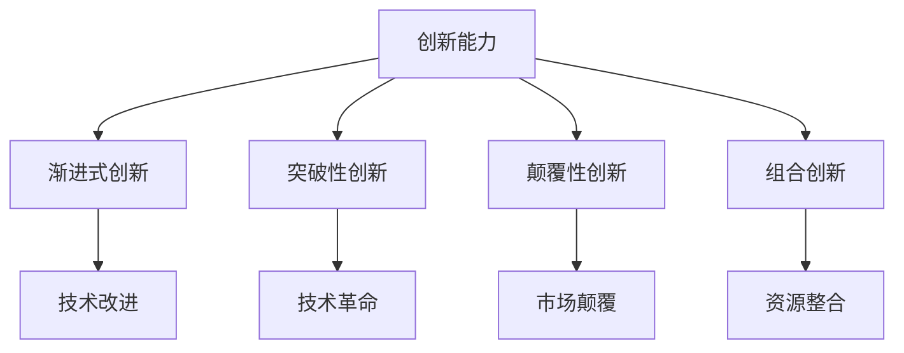

                 

## 引言

### 创新能力的重要性

在当今快速变化和竞争激烈的市场环境中，创新能力已成为企业发展的核心驱动力。无论是传统行业还是新兴行业，创新能力都是企业在激烈竞争中脱颖而出的关键因素。企业通过创新，可以不断优化产品和服务，提高竞争力，实现可持续发展。

对于团队而言，创新能力的重要性同样不可忽视。一个具备创新能力的团队，能够在面对问题时提供多种解决方案，提高工作效率，实现团队成员的个人成长。因此，如何激发团队的创新能力，已成为企业管理者和团队领导者关注的重要问题。

### 团队创新能力的影响因素

团队创新能力受到多种因素的影响，包括但不限于以下几个方面：

1. **团队文化**：团队文化是影响团队创新能力的重要因素。一个开放、包容、鼓励创新的团队文化，能够激发团队成员的创造力和主动性。

2. **团队构成**：团队构成包括团队成员的背景、技能和经验等。多样化的团队构成有助于不同视角的碰撞和融合，从而激发创新思维。

3. **沟通与协作**：团队内部的沟通与协作效率直接影响创新能力的发挥。良好的沟通和协作机制，能够促进团队成员之间的信息共享和知识互补。

4. **决策机制**：团队决策机制是否合理，直接影响创新过程的效率和质量。一个科学的决策机制，能够确保创新项目在合理的时间内得到推进。

5. **激励机制**：激励机制对团队成员的创新行为具有重要影响。适当的激励机制，能够激发团队成员的创新动力和积极性。

### 本书的目标与结构

本书旨在系统地探讨如何激发团队的创新能力。通过以下三个部分，全面解析团队创新能力的培养和实践：

1. **创新能力理论基础**：介绍创新能力的概念、类型、心理学与社会学基础、经济学原理以及创新能力的模型与框架。

2. **团队创新能力培养方法**：探讨团队建设与创新能力的关系，学习与创新思维、创新工具与方法、创新流程与项目管理以及创新激励与支持体系。

3. **团队创新能力实践案例**：通过国内外创新实践案例，分析创新能力的应用和效果，为读者提供实际操作的参考。

本书将采用逻辑清晰、结构紧凑、简单易懂的专业技术语言，帮助读者理解并掌握激发团队创新能力的方法和技巧。通过本书的学习，读者将能够更好地应对快速变化的市场环境，提升团队的创新能力，实现企业的可持续发展。

---

### 创新能力的概念与类型

#### 定义

创新能力是指个体或团队在新的环境和情境中，运用已有知识和经验，通过独立思考、创新思维和实践活动，创造新知识、新方法、新产品和新服务的能力。创新能力不仅包括技术层面的创新，还涵盖管理、流程、商业模式等多方面的创新。

#### 类型

根据创新的内容和形式，创新能力可以分为以下几种类型：

1. **渐进式创新**：
   - **定义**：渐进式创新是指在现有产品、技术或流程的基础上，通过逐步改进和优化，提高其性能、效率或用户体验。
   - **特点**：创新幅度较小，风险较低，易于实施和推广。
   - **应用场景**：适用于追求稳定和持续改进的行业和领域。

2. **突破性创新**：
   - **定义**：突破性创新是指从根本上改变现有产品、技术或流程，实现质的飞跃。
   - **特点**：创新幅度大，风险高，可能涉及多个领域的技术和资源的整合。
   - **应用场景**：适用于技术变革迅速、市场需求旺盛的行业和领域。

3. **颠覆性创新**：
   - **定义**：颠覆性创新是指通过全新的理念、技术或模式，彻底颠覆现有市场和行业格局。
   - **特点**：创新幅度极大，风险极高，可能引发行业变革和社会影响。
   - **应用场景**：适用于新兴行业和领域，以及面对重大挑战和变革的传统行业。

4. **组合创新**：
   - **定义**：组合创新是指将不同的元素、技术或理念进行整合，创造新的产品、服务或业务模式。
   - **特点**：创新内容多样，风险与机遇并存，有助于拓展市场和提升竞争力。
   - **应用场景**：适用于多元化经营、跨界融合和创新型企业。

#### 核心概念与联系

为了更好地理解创新能力的概念和类型，我们可以通过以下Mermaid流程图展示核心概念之间的关系架构：

在这个流程图中，创新能力（A）是核心，渐进式创新（B）、突破性创新（C）、颠覆性创新（D）和组合创新（E）是其主要分支。每个分支又进一步细分，例如渐进式创新（B）分为技术改进（F），突破性创新（C）分为技术革命（G），颠覆性创新（D）分为市场颠覆（H），组合创新（E）分为资源整合（I）。这种关系架构有助于我们理解不同类型创新的能力和特点。

通过以上对创新能力概念和类型的介绍，我们为后续章节的讨论奠定了基础。在接下来的章节中，我们将进一步探讨创新能力的心理学与社会学基础、经济学原理以及创新能力的模型与框架，帮助读者全面理解创新能力的本质和培养方法。

---

### 创新能力的心理学与社会学基础

#### 心理学视角

在心理学领域，创新能力的研究主要关注以下几个方面：

1. **认知能力**：创新能力与个体的认知能力密切相关。研究表明，较高的认知能力有助于个体在复杂问题解决和创新思维中表现出更高的水平。认知能力包括记忆力、注意力、观察力、思维敏捷性和创造力等。

2. **情绪智力**：情绪智力是指个体识别、理解、管理和运用情绪的能力。研究表明，情绪智力对于创新过程具有重要影响。高情绪智力的个体能够更好地管理自己的情绪，从而在创新过程中保持积极的心态，降低压力和焦虑。

3. **自我效能感**：自我效能感是指个体对自己完成特定任务的信心和信念。研究表明，高自我效能感的个体在创新过程中更有信心尝试新方法，克服困难，持续探索。

4. **动机**：动机是推动个体进行创新行为的重要因素。内在动机，如兴趣和好奇心，能够激发个体的创新行为。外在动机，如奖励和认可，也能在一定程度上促进创新。

#### 社会学视角

从社会学角度来看，创新能力受到多种社会因素的影响：

1. **团队协作**：社会学研究表明，团队合作是激发创新能力的重要途径。通过团队协作，个体可以分享知识和经验，相互启发和激励，从而提高创新效率。

2. **社会网络**：社会网络为个体提供了获取信息和资源的渠道。一个广泛和多样化的社会网络有助于个体接触到不同的观点和知识，从而促进创新思维。

3. **文化因素**：文化差异对创新能力具有显著影响。一些文化强调集体主义和稳定性，而另一些文化则强调个人主义和变革。在鼓励创新的文化中，个体更容易接受和尝试新想法。

4. **社会规范**：社会规范对个体的创新行为产生影响。在一些社会规范严格的社会中，个体可能会因偏离传统而面临压力。而在一些开放和包容的社会中，个体更愿意尝试创新。

#### 心理学与社会学之间的关系

心理学和社会学在探讨创新能力时，提供了互补的视角。心理学研究个体层面的因素，如认知能力、情绪智力、自我效能感和动机等，而社会学研究团队协作、社会网络、文化因素和社会规范等。两者之间的关系可以概括为以下几点：

1. **个体与团队**：心理学关注个体层面的创新能力，而社会学关注团队层面的创新能力。个体的创新能力通过团队协作和互动，得以在更大的范围内发挥作用。

2. **内部与外部**：心理学侧重于个体的内在因素，如认知能力、情绪智力等；社会学则关注外部因素，如社会网络、文化因素等。这两者相互作用，共同影响创新能力。

3. **动态与静态**：心理学研究创新能力时，更多关注动态过程，如个体如何应对挑战和激发创新思维；社会学则关注静态结构，如文化和社会规范如何塑造创新环境。

通过心理学和社会学视角的结合，我们可以更全面地理解创新能力的本质和影响因素。这有助于我们在实践中，更好地激发团队的创新能力，实现组织的创新目标。

### 创新能力的经济学原理

#### 创新的价值创造机制

创新作为一种经济活动，其核心在于通过新知识、新技术和新方法的引入，实现价值的创造和提升。从经济学角度来看，创新的价值创造机制可以从以下几个方面进行分析：

1. **产品和服务创新**：通过产品和服务创新，企业可以提供更符合市场需求的产品和服务，从而提高市场占有率，实现收入的增长。例如，苹果公司的iPhone通过创新的设计和功能，成为智能手机市场的领导者，大大提升了公司的市场份额和盈利能力。

2. **技术和管理创新**：技术和管理创新可以提高企业的生产效率和管理水平，降低成本。例如，亚马逊通过引入先进的物流和仓储管理系统，大幅提高了物流效率，降低了运营成本，从而在激烈的市场竞争中保持领先地位。

3. **商业模式创新**：商业模式创新可以为企业开辟新的盈利渠道，实现收入的多元化。例如，共享经济模式通过重新定义物品的使用方式和所有权，创造了新的商业模式，如Airbnb和Uber等公司，通过平台模式改变了传统住宿和交通行业。

#### 创新的成本与收益分析

在经济学中，对创新活动的分析离不开成本与收益的分析。创新活动涉及多种成本，包括研发成本、试错成本、市场推广成本等，同时也会带来多种收益，包括经济效益、社会效益和环境效益等。

1. **研发成本**：研发成本是创新活动的主要成本之一，包括研发人员的薪酬、实验设备的投入、专利申请费用等。这部分成本通常较高，但也是创新活动的关键环节。

2. **试错成本**：在创新过程中，企业可能会遇到各种失败和试错，这些试错成本包括失败产品的成本、时间成本等。然而，试错也是创新过程中的重要环节，通过试错，企业可以更好地了解市场需求和用户反馈，从而优化产品和服务。

3. **市场推广成本**：市场推广成本是指将创新产品和服务推向市场的费用，包括广告、促销、渠道建设等。这部分成本对于创新的成功至关重要，因为市场推广能够提高产品知名度和用户接受度。

4. **经济效益**：创新的经济效益主要包括收入增加、成本降低、市场份额提升等。例如，通过技术创新，企业可以降低生产成本，提高产品竞争力，从而实现收入的增长。

5. **社会效益**：创新活动不仅为企业带来经济效益，还能为社会带来多种社会效益，如提高就业率、促进科技进步、改善生活质量等。例如，医疗技术创新可以延长人类寿命，提高生活质量。

6. **环境效益**：随着可持续发展理念的普及，创新活动在环境保护和资源利用方面也发挥着重要作用。通过环保技术创新，企业可以减少环境污染，提高资源利用效率。

#### 创新与市场竞争

创新与市场竞争密切相关。在激烈的市场竞争中，企业通过创新可以取得竞争优势，实现市场地位的提升。以下是一些创新与市场竞争的关系：

1. **领先优势**：通过技术创新，企业可以率先推出新产品或服务，占据市场领先地位。例如，特斯拉在电动汽车市场中的领先地位，就是通过其在电池技术和自动驾驶技术方面的创新实现的。

2. **差异化优势**：通过产品和服务创新，企业可以提供差异化产品，满足特定用户群体的需求，从而在市场中获得竞争优势。例如，苹果公司的iPhone通过创新的设计和功能，吸引了大量高端用户，形成了强大的品牌忠诚度。

3. **成本优势**：通过管理和技术创新，企业可以降低生产成本，提高效率，从而在价格竞争中占据优势。例如，丰田公司通过精益生产方式，大幅降低了生产成本，从而在汽车市场中具有强大的竞争力。

4. **动态竞争**：创新活动使市场竞争变得更加动态和复杂。企业需要不断进行创新，以应对竞争对手的挑战和市场的变化。例如，互联网行业中的竞争异常激烈，每天都有新的技术和产品推出，企业必须不断进行创新，才能保持竞争优势。

通过以上对创新能力的经济学原理的分析，我们可以看到，创新不仅能够为企业带来经济效益，还能推动社会和环境的可持续发展。在接下来的章节中，我们将进一步探讨创新能力的模型与框架，帮助读者更深入地理解创新能力的本质和应用。

### 创新能力的模型与框架

为了更好地理解和应用创新能力，学术界和业界提出了多种模型与框架。以下介绍几种常见的创新模型和框架：

#### SWOT分析模型

**SWOT分析**（Strengths, Weaknesses, Opportunities, Threats）是一种常用的战略规划工具，用于分析企业的内部优势和劣势，以及外部机会和威胁。

1. **优势（Strengths）**：企业内部的优势资源，如技术实力、品牌影响力、人才储备等。
2. **劣势（Weaknesses）**：企业内部的劣势和短板，如生产效率低、研发投入不足、市场推广能力弱等。
3. **机会（Opportunities）**：外部环境中的有利因素，如市场需求增长、技术进步、政策支持等。
4. **威胁（Threats）**：外部环境中的不利因素，如市场竞争加剧、技术壁垒、政策变动等。

通过SWOT分析，企业可以明确自身的优势和劣势，抓住外部机会，应对潜在威胁，从而制定更有效的创新战略。

#### 五力分析模型

**五力分析模型**（Five Forces Analysis）由迈克尔·波特提出，用于分析行业竞争态势。五力包括：

1. **供应商的议价能力**：供应商的垄断程度、价格波动性等。
2. **买家的议价能力**：买家的集中度、购买力等。
3. **潜在竞争者的威胁**：新进入者的数量、进入障碍等。
4. **替代品的威胁**：市场上可替代产品的数量和性能。
5. **行业的竞争程度**：行业内企业的数量、市场饱和度等。

通过五力分析，企业可以了解行业竞争环境，识别创新机会和风险，从而制定相应的创新策略。

#### 创新生命周期模型

**创新生命周期模型**（Innovation Lifecycle Model）描述了从创新概念到市场应用的全过程，包括以下几个阶段：

1. **研发阶段**：创新概念的提出和实验验证。
2. **开发阶段**：技术创新和市场验证，包括原型开发和测试。
3. **上市阶段**：产品或服务的市场推广和销售。
4. **成熟阶段**：产品或服务的市场稳定，利润最大化。
5. **衰退阶段**：市场需求下降，创新逐渐失去竞争力。

通过创新生命周期模型，企业可以更好地管理创新过程，优化资源分配，提高创新成功率。

#### 平台创新模型

**平台创新模型**（Platform Innovation Model）强调通过构建平台，促进不同主体之间的协同创新。

1. **平台构建**：明确平台的目标和功能，构建基础设施。
2. **生态系统建设**：吸引合作伙伴和用户，构建生态系统。
3. **共创价值**：通过合作和共享，实现多方共赢。
4. **持续迭代**：不断优化平台，提升用户体验和价值。

平台创新模型适用于互联网、物联网等高度协同和创新密集的行业。

通过这些模型和框架，企业可以系统地分析和规划创新活动，提高创新能力和成功率。在接下来的章节中，我们将深入探讨如何通过团队建设与创新能力的关系，激发团队的创新能力。

### 团队建设与创新能力

#### 团队构成与角色

团队构成是创新能力培养的重要基础。一个高效的团队通常由具有不同背景、技能和经验的成员组成，这样可以实现知识互补和多元化视角。以下是团队中常见的主要角色：

1. **领导者**：领导者负责团队的整体方向和战略规划，激发团队成员的潜力和创造力。
2. **技术专家**：技术专家负责技术层面的创新，解决复杂的技术问题，推动技术进步。
3. **产品经理**：产品经理负责产品设计和市场定位，确保创新成果能够满足市场需求。
4. **用户体验设计师**：用户体验设计师关注用户需求，通过设计优化用户体验，提升产品价值。
5. **市场营销人员**：市场营销人员负责市场推广和用户反馈，促进产品市场化的进程。
6. **项目管理员**：项目管理员负责项目规划和执行，确保创新项目按时完成并达到预期目标。

#### 团队文化的塑造

团队文化是激发团队创新能力的关键因素。一个积极、开放和鼓励创新的团队文化能够激发成员的创造力和主动性。以下是塑造团队文化的一些关键策略：

1. **鼓励创新思维**：团队领导者应该鼓励成员提出新想法，即使这些想法可能不成熟或有风险。通过建立一个安全、包容的环境，成员更有可能尝试新思路。

2. **透明沟通**：建立透明沟通机制，确保团队成员能够及时了解项目进展、问题和决策。这有助于减少误解和冲突，提高团队协作效率。

3. **反馈与改进**：定期进行团队反馈，收集成员的意见和建议，并进行改进。这有助于提高团队成员的参与感和满意度，激发他们的创新热情。

4. **共同目标**：明确团队目标，确保所有成员都认同并致力于实现这些目标。共同的目标可以增强团队的凝聚力，促进成员之间的协作和创新。

#### 团队沟通与协作

团队沟通和协作效率对创新能力的发挥至关重要。以下是提高团队沟通和协作效率的一些方法：

1. **明确任务分工**：明确每个成员的职责和任务，确保团队成员知道自己的角色和期望。这有助于减少任务重叠和职责不清，提高工作效率。

2. **定期会议**：定期举行团队会议，讨论项目进展、问题和解决方案。这有助于团队成员之间保持同步，及时调整策略。

3. **协作工具**：使用协作工具，如项目管理软件、即时通讯工具和在线文档编辑工具，提高团队协作效率。这些工具可以帮助团队成员实时共享信息、协作完成任务。

4. **跨部门合作**：鼓励跨部门合作，促进不同部门之间的知识共享和协同创新。跨部门合作可以带来新的视角和想法，提高创新效率。

#### 团队决策与创新能力

团队决策机制对创新能力的发挥具有重要影响。以下是一些有效的团队决策策略：

1. **民主决策**：鼓励团队成员参与决策过程，充分发挥集体的智慧。民主决策有助于提高团队成员的参与感和认同感，激发他们的创新动力。

2. **共识决策**：通过讨论和辩论，达成团队共识。共识决策有助于确保决策的可行性和执行力，减少决策后的分歧和冲突。

3. **快速决策**：在决策过程中，鼓励快速决策和试错。快速决策可以缩短创新周期，提高市场响应速度，从而在激烈的市场竞争中保持优势。

4. **适应性决策**：根据实际情况和环境变化，灵活调整决策。适应性决策有助于团队在面对不确定性时，快速适应并采取有效措施。

通过团队建设与创新能力的关系的深入探讨，我们可以看到，一个高效、协同和创新型的团队，是激发团队成员创新能力的关键。在接下来的章节中，我们将进一步探讨如何通过培养创新思维和利用创新工具，提升团队的创新能力。

### 创新能力培养方法

#### 学习与创新思维

创新能力不是一蹴而就的，它需要通过不断学习和实践来培养。以下是一些有效的学习方法，帮助团队成员提升创新思维：

1. **跨学科学习**：鼓励团队成员跨学科学习，拓宽知识面。跨学科学习可以促进不同领域知识的交叉和融合，激发新的创新灵感。例如，工程师可以学习商业管理知识，而市场营销人员可以学习技术原理。

2. **持续学习**：在当今快速变化的知识时代，持续学习是保持创新能力的关键。团队成员应该定期参加培训课程、研讨会和读书会，不断更新知识和技能。

3. **反思与总结**：在学习过程中，团队成员应该定期进行反思和总结。通过回顾过去的经验，总结成功和失败的原因，可以不断优化学习方法和策略，提高创新效果。

4. **探索未知的领域**：鼓励团队成员探索未知的领域，尝试新的知识和技能。未知领域往往蕴含着巨大的创新潜力，通过探索，团队成员可以开拓新的视野，激发创新思维。

#### 创新工具与方法

创新工具和方法是提升团队创新能力的重要手段。以下介绍几种常用的创新工具和方法：

1. **头脑风暴**：头脑风暴是一种集思广益的方法，通过团队成员的自由讨论和创意碰撞，快速产生大量创意。在头脑风暴过程中，鼓励成员不受限制地提出各种想法，无论这些想法是否实际可行。

2. **思维导图**：思维导图是一种图形化的思维工具，可以帮助团队成员梳理思路，构建知识体系。通过绘制思维导图，团队成员可以更好地理解问题，找到创新的解决方案。

3. **设计思维**：设计思维是一种以用户为中心的创新方法，强调通过用户调研、原型设计和迭代优化，找到用户需求并实现创新。设计思维可以帮助团队成员站在用户的角度思考问题，提高创新的价值和可行性。

4. **快速原型**：快速原型是一种快速构建产品原型的方法，通过快速迭代和用户反馈，验证产品概念和设计。快速原型可以帮助团队成员在短时间内验证创新想法，降低失败风险。

#### 创新流程与项目管理

创新流程和项目管理是确保创新项目顺利实施的关键。以下介绍几种有效的创新流程和项目管理方法：

1. **敏捷开发**：敏捷开发是一种迭代和增量的软件开发方法，强调快速迭代和用户反馈。通过敏捷开发，团队可以更灵活地应对变化，提高创新效率。

2. **目标导向项目管理**：目标导向项目管理是一种以目标为导向的项目管理方法，强调明确项目目标和制定可行的实施计划。通过目标导向项目管理，团队可以确保创新项目按照预期进行，并实现预期成果。

3. **风险管理**：在创新过程中，风险是不可避免的。通过识别、评估和应对风险，团队可以降低创新失败的风险。风险管理可以帮助团队在面临不确定性和挑战时，保持冷静和应对能力。

4. **项目评审**：项目评审是一种定期评估项目进展和成果的方法，通过项目评审，团队可以及时发现和解决问题，确保项目按照计划进行。

#### 创新激励与支持体系

创新激励与支持体系是激发团队创新热情和创造力的关键。以下介绍几种有效的创新激励和支持体系：

1. **奖励机制**：建立合理的奖励机制，对在创新项目中表现突出的成员进行奖励。奖励可以是金钱、荣誉或者其他形式的激励，例如晋升机会、培训机会等。

2. **自由时间**：为团队成员提供一定的自由时间，让他们可以自主探索和创新。自由时间可以激发团队成员的创造力和主动性，促进创新项目的开展。

3. **资源共享**：建立资源共享机制，为团队成员提供所需的资源和支持。资源共享可以减少重复劳动，提高工作效率，为创新提供更多的时间和资源。

4. **创新工作环境**：营造一个开放、包容和鼓励创新的工作环境，为团队成员提供创造和发展的空间。良好的工作环境可以激发团队成员的积极性和创造力，促进团队协作和创新。

通过以上创新能力培养方法的介绍，我们可以看到，创新能力的培养是一个系统性、持续性的过程。通过学习与创新思维、创新工具与方法、创新流程与项目管理和创新激励与支持体系，团队可以不断提升创新能力，实现持续创新和竞争优势。在接下来的章节中，我们将通过具体的实践案例，进一步探讨如何激发团队的创新能力。

### 创新能力实践案例

#### 国内外创新实践案例介绍

1. **谷歌的“20%时间”政策**：
   - **背景**：谷歌在2006年推出“20%时间”政策，允许员工将20%的工作时间用于自己感兴趣的项目。
   - **案例描述**：这一政策激发了员工自主创新的精神，产生了众多成功的项目，如Gmail、Google News等。
   - **效果**：这一创新政策显著提升了谷歌的创新能力，使其在竞争激烈的市场中保持了领先地位。

2. **苹果公司的“创新实验室”**：
   - **背景**：苹果公司在2010年设立了“创新实验室”，专门用于探索前沿技术和创新项目。
   - **案例描述**：创新实验室通过跨部门合作和跨领域技术整合，开发出了一系列创新产品，如Apple Watch、AirPods等。
   - **效果**：创新实验室的成功使得苹果公司在多个领域实现了技术突破，进一步巩固了其市场地位。

3. **中国的“大众创业、万众创新”**：
   - **背景**：中国政府在近年来提出了“大众创业、万众创新”的倡议，鼓励企业和个人积极参与创新活动。
   - **案例描述**：许多创新型企业和创业者涌现，如小米、华为等，通过技术创新和商业模式创新，实现了快速发展。
   - **效果**：这一政策推动了整个社会创新氛围的形成，促进了经济结构的优化和升级。

#### 案例分析与解读

通过以上案例，我们可以看到创新实践在不同背景、领域和环境中都能够取得显著成效。以下是这些案例的详细分析和解读：

1. **谷歌的“20%时间”政策**：
   - **原因**：谷歌的“20%时间”政策成功，是因为它营造了一个开放、包容的创新环境，允许员工自由探索感兴趣的项目。这种自由度激发了员工的创造力和主动性，促进了跨部门、跨领域的合作。
   - **方法**：谷歌通过设立明确的创新目标和评估标准，确保员工在自由探索的同时，能够实现有效的创新产出。此外，谷歌还提供了必要的资源和支持，如资金、技术和专家指导，以帮助员工实现创新项目。
   - **启示**：对于其他企业，可以借鉴谷歌的做法，建立类似的创新政策，为员工提供自由探索和创新的空间。同时，确保有明确的创新目标和评估标准，以及必要的资源支持，以提高创新成功率。

2. **苹果公司的“创新实验室”**：
   - **原因**：苹果公司设立创新实验室，是因为它认识到技术创新和跨领域合作在保持竞争优势中的重要性。通过建立专门的创新团队和实验室，苹果公司能够更好地整合内部资源和外部资源，推动技术创新。
   - **方法**：苹果公司在创新实验室中采用了跨部门合作和跨领域技术整合的方法，通过将不同领域的专家和资源集中在一起，实现技术创新和产品开发。此外，苹果公司还鼓励员工参与创新项目的全程，从概念验证到市场推广，确保创新项目能够顺利实施。
   - **启示**：企业可以借鉴苹果公司的做法，建立专门的创新团队和实验室，推动技术创新。同时，鼓励跨部门合作和跨领域技术整合，提高创新效率。此外，提供全程支持和资源，确保创新项目能够顺利推进。

3. **中国的“大众创业、万众创新”**：
   - **原因**：中国政府提出“大众创业、万众创新”的倡议，是因为认识到创新是推动经济发展的重要动力。通过鼓励企业和个人积极参与创新活动，可以激发社会创新活力，促进经济结构的优化和升级。
   - **方法**：中国政府通过出台一系列政策措施，如减税、补贴、创业培训等，为创新创业提供支持和保障。同时，政府还建立了创新创业平台，如创业孵化器、创新示范区等，为企业和创业者提供全方位的服务和支持。
   - **启示**：政府可以通过出台相关政策，鼓励企业和个人参与创新活动。同时，建立创新创业平台，提供全方位的服务和支持，促进创新创业环境的优化。此外，通过宣传和培训，提高社会对创新的认识和重视，营造良好的创新氛围。

通过以上案例分析和解读，我们可以看到，创新实践在不同背景、领域和环境中都能够取得显著成效。这些案例的成功，为我们提供了宝贵的经验和启示，可以帮助我们在实践中更好地激发团队的创新能力。

### 团队创新能力评估与优化

#### 评估指标与方法

团队创新能力评估是确保团队创新活动高效开展的重要环节。以下是一些关键评估指标和方法：

1. **创新产出**：创新产出是评估团队创新能力的基本指标，包括新产品、新服务、新技术、新流程等。通过统计创新产出的数量和质量，可以直观地反映团队的创新能力。

2. **市场反应**：市场反应是评估创新成果市场接受度的重要指标。通过市场调研、用户反馈和销售数据，可以了解创新成果的市场表现，评估其市场潜力和竞争力。

3. **团队协作**：团队协作是创新能力的基础。通过评估团队内部沟通、协作和合作效率，可以了解团队协作的质量和效果，进而优化协作机制。

4. **创新成本与收益**：评估创新活动的成本与收益，可以帮助团队了解创新活动的经济价值。通过计算创新活动的投入产出比，可以评估创新活动的经济效益。

5. **创新频率**：创新频率是指在一定时间内，团队产生创新成果的数量。高创新频率通常意味着团队具备较强的创新能力。

6. **创新质量**：创新质量是评估创新成果的重要指标，包括创新的技术含量、市场前景和用户满意度等。

#### 评估工具与应用

为了有效地评估团队创新能力，可以使用以下几种评估工具：

1. **平衡计分卡（Balanced Scorecard）**：平衡计分卡是一种综合性的评估工具，可以从财务、客户、内部流程和学习与成长四个维度，全面评估团队的创新能力和绩效。

2. **创新雷达图**：创新雷达图通过多个维度，如创新产出、市场反应、团队协作、创新成本与收益等，对团队创新能力进行直观的展示和分析。

3. **SWOT分析**：SWOT分析可以帮助团队识别自身的优势、劣势、机会和威胁，从而制定有针对性的创新策略。

4. **KPI（关键绩效指标）**：KPI可以用于定量评估团队创新能力的各个方面，如创新频率、创新质量、市场反应等。

#### 优化策略与实施

为了提升团队创新能力，可以采取以下优化策略：

1. **加强团队培训**：定期组织培训课程，提升团队成员的专业技能和创新思维。通过培训，可以帮助团队成员掌握最新的技术趋势和方法，提高创新能力。

2. **改进协作机制**：优化团队内部的沟通和协作机制，提高团队协作效率。可以通过引入协作工具、定期团队会议等方式，加强团队成员之间的沟通和协作。

3. **激励机制**：建立合理的激励机制，鼓励团队成员积极参与创新活动。可以通过奖励制度、晋升机会等，激发团队成员的创新热情。

4. **优化创新流程**：优化创新流程，确保创新活动高效、有序地推进。可以通过简化流程、减少审批环节、提高决策速度等方式，降低创新成本，提高创新效率。

5. **外部合作**：与外部合作伙伴建立合作关系，共享资源和技术，提高团队创新能力。可以通过合作研发、技术交流、联合创新等方式，借助外部力量提升创新能力。

#### 评估与优化的实践

以下是一个具体的评估与优化实践案例：

**案例背景**：某科技公司研发团队在创新项目过程中，遇到了创新能力不足、协作效率低等问题。为了提升团队创新能力，公司决定进行评估与优化。

**评估过程**：
1. **确定评估指标**：公司确定创新产出、市场反应、团队协作、创新成本与收益等指标，作为评估团队创新能力的关键指标。
2. **数据收集**：通过问卷调查、访谈和数据分析等方式，收集团队成员的创新行为数据，如创新项目数量、市场反馈、协作频率等。
3. **评估分析**：利用平衡计分卡和创新雷达图等工具，对团队创新能力进行全面评估，找出存在的问题和瓶颈。

**优化策略**：
1. **加强团队培训**：公司为研发团队安排了多场专业培训，包括技术趋势、创新思维方法等，提升团队成员的专业技能和创新思维。
2. **改进协作机制**：公司引入了协作工具，如项目管理软件、在线文档编辑工具等，加强团队成员之间的沟通和协作，提高协作效率。
3. **激励机制**：公司设立了创新奖励制度，对在创新项目中表现突出的团队成员给予奖励，激发创新热情。
4. **优化创新流程**：公司简化了创新项目审批流程，减少了审批环节，提高了决策速度，降低创新成本。

**效果**：
通过评估与优化，公司的研发团队创新能力显著提升。创新项目数量和质量均有所提高，市场反馈良好，团队协作效率也显著提高。公司创新氛围更加浓厚，创新成果不断涌现，进一步巩固了公司在市场中的竞争优势。

通过以上案例，我们可以看到，团队创新能力评估与优化是提升团队创新能力的重要手段。通过科学的评估方法和优化策略，团队可以不断提升创新能力，实现持续创新和竞争优势。

### 团队创新能力与企业战略

#### 创新能力与企业核心竞争力

创新能力是企业核心竞争力的重要组成部分。在当今市场环境中，企业面临的竞争压力越来越大，只有具备持续创新的能力，才能在竞争中脱颖而出。以下从几个方面探讨创新能力如何提升企业的核心竞争力：

1. **技术领先**：通过技术创新，企业可以在技术层面保持领先地位。技术创新不仅包括产品的技术突破，还包括生产流程、制造工艺的改进。技术领先可以使企业在市场上占据优势地位，提高市场份额。

2. **产品差异化**：创新能力有助于企业开发出具有差异化特点的产品和服务。差异化产品能够满足不同客户群体的需求，提高客户忠诚度，从而在市场中获得竞争优势。

3. **商业模式创新**：商业模式创新是企业在商业模式层面进行创新，从而提高运营效率和盈利能力。通过创新商业模式，企业可以开辟新的盈利渠道，实现收入和利润的增长。

4. **市场竞争优势**：创新能力使企业能够迅速响应市场变化，灵活调整战略，抢占市场先机。在激烈的市场竞争中，具备创新能力的企业往往能够迅速应对竞争对手的挑战，保持市场竞争力。

#### 创新能力与企业战略规划

企业战略规划是指导企业长期发展的关键，创新能力在战略规划中扮演着重要角色。以下从几个方面探讨如何将创新能力融入企业战略规划：

1. **明确创新目标**：企业在制定战略规划时，应明确创新目标，包括技术创新、产品创新、商业模式创新等。明确创新目标有助于企业集中资源，有针对性地进行创新活动。

2. **创新资源配置**：企业应根据创新目标，合理配置资源，包括人力、财力、物力等。通过优化资源配置，确保创新项目能够获得必要的支持，提高创新成功率。

3. **创新风险管理**：创新过程中不可避免地会遇到风险，企业应在战略规划中考虑创新风险，制定相应的风险应对措施。通过风险管理和控制，企业可以降低创新失败的风险，确保创新活动的顺利进行。

4. **创新文化建设**：创新文化是激发企业创新能力的重要保障。企业应在战略规划中强调创新文化，鼓励员工勇于创新，培养创新思维，形成积极向上的创新氛围。

#### 创新能力与企业组织变革

创新能力不仅影响企业的战略规划和市场竞争力，还与企业的组织变革密切相关。以下从几个方面探讨如何通过组织变革激发创新能力：

1. **组织结构优化**：通过优化组织结构，减少层级和冗余，提高组织内部的沟通和协作效率。扁平化的组织结构有助于打破信息壁垒，促进创新思维的流动。

2. **人才激励机制**：建立科学的人才激励机制，包括薪酬、晋升、培训等，激发员工的创新潜力。通过激励制度，鼓励员工积极参与创新活动，提升创新能力。

3. **学习型组织建设**：建设学习型组织，鼓励员工不断学习和成长。通过持续学习，员工可以不断更新知识和技能，提升创新能力。

4. **跨部门协作**：推动跨部门协作，促进不同部门和团队之间的知识共享和协同创新。跨部门协作有助于整合内部资源，提高创新效率。

#### 成功实践案例分析

以下是一个企业通过创新能力提升核心竞争力和实施组织变革的成功案例：

**案例背景**：某大型制造企业面临市场竞争加剧、产品同质化严重的问题，决定通过提升创新能力，重塑核心竞争力。

**创新举措**：
1. **技术创新**：企业成立了专门的技术创新部门，负责研发新技术、新产品。通过技术创新，企业成功开发了一系列具有竞争力的新产品，如智能设备、自动化生产线等。
2. **商业模式创新**：企业通过创新商业模式，推出定制化生产、在线销售等新服务，提高客户满意度和市场竞争力。
3. **组织变革**：企业优化了组织结构，减少了管理层级，增强了跨部门协作。同时，企业建立了学习型组织，鼓励员工不断学习和创新。

**效果**：
通过提升创新能力和实施组织变革，企业成功重塑了核心竞争力，市场份额和盈利能力显著提升。技术创新使企业在市场上占据了有利地位，商业模式创新提高了客户满意度和市场份额，组织变革增强了企业的运营效率和创新能力。

通过以上案例分析，我们可以看到，创新能力对企业战略规划和组织变革具有重要意义。企业应高度重视创新能力，将其融入战略规划和组织变革中，以提升核心竞争力，实现可持续发展。

### 总结与展望

#### 创新能力的未来发展

创新能力在未来的发展中将继续扮演至关重要的角色。随着全球化和技术进步的加速，市场环境的变化速度越来越快，企业面临的市场竞争将更加激烈。以下是对创新能力未来发展的几个预测：

1. **技术创新持续突破**：随着人工智能、大数据、物联网等新技术的快速发展，技术创新将不断突破，带来新的商业模式和产品形态。企业需要持续关注技术前沿，保持技术领先优势。

2. **跨领域融合创新**：未来的创新将更加注重跨领域的融合，不同领域的知识和技术将相互结合，产生新的应用和解决方案。企业可以通过跨界合作，激发创新思维，推动产业升级。

3. **社会创新的重要性提升**：随着社会问题的日益突出，如环境保护、社会公平等，社会创新将成为创新能力的重要组成部分。企业应关注社会责任，积极参与社会创新，推动可持续发展。

4. **创新能力竞争的白热化**：在全球化背景下，各国企业和组织之间的创新能力竞争将更加白热化。企业需要不断提升创新能力，以保持竞争力，应对国际市场的挑战。

#### 团队创新能力培养的挑战与机遇

在团队创新能力培养方面，企业面临以下挑战和机遇：

1. **挑战**：
   - **文化变革的难度**：创新文化需要企业内部各层级共同努力，形成共识和行动。文化变革可能面临阻力和困难，需要企业付出长期的努力。
   - **资源投入的挑战**：创新能力的培养需要大量的人力、财力和时间投入。企业在资源有限的情况下，如何合理分配资源，确保创新项目的顺利推进，是一个重要挑战。
   - **人才短缺**：具备创新能力的人才日益稀缺，企业需要通过多种渠道吸引和培养创新人才。

2. **机遇**：
   - **数字化转型的推进**：随着数字化转型的深入，企业可以通过数字化工具和方法，提高创新效率和协作效果。数字化技术为企业提供了更多的创新工具和平台。
   - **国际化视野的拓展**：国际化视野可以带来更多的创新思路和资源，企业可以通过国际合作和交流，提升创新能力。
   - **政策支持**：各国政府越来越重视创新能力的培养，提供了多种政策支持，如减税、补贴、研发奖励等。企业应充分利用政策支持，提升创新能力。

#### 未来展望

在未来，企业应从以下几个方面着手，进一步提升团队创新能力：

1. **构建创新文化**：企业应构建开放、包容、鼓励创新的文化氛围，激发员工的创造力和主动性。通过定期举办创新活动、创新竞赛等方式，营造良好的创新氛围。

2. **加强人才培养**：企业应重视人才培养，提供培训机会，鼓励员工持续学习和成长。同时，通过内部晋升机制，激励员工不断提升自身能力。

3. **优化创新流程**：企业应优化创新流程，简化审批环节，提高创新决策速度。通过数字化工具，提高协作效率和资源利用率。

4. **拓展国际视野**：企业应积极参与国际交流合作，借鉴国际先进经验，提升创新能力。同时，通过国际化视野，发现新的市场机会和创新方向。

5. **关注社会创新**：企业应关注社会创新，积极参与解决社会问题，提升企业的社会责任感和品牌形象。

通过不断创新和优化，企业可以不断提升团队创新能力，实现可持续发展，迎接未来的挑战和机遇。

### 作者信息

本文作者为AI天才研究院/AI Genius Institute与《禅与计算机程序设计艺术》的资深作者。AI天才研究院致力于推动人工智能领域的研究与应用，而《禅与计算机程序设计艺术》则以其独特的视角和深刻的见解，为程序员提供了宝贵的思考框架和方法论。

通过对团队创新能力的深入探讨，本文希望能够为读者提供有价值的启示和实用方法，帮助他们在实践中激发团队的创新能力，实现企业的可持续发展。希望通过本文的分享，能够激发更多读者的思考和讨论，共同推动技术创新和管理进步。

### 最佳实践 Tips

1. **建立明确的创新目标**：确保团队有清晰的目标和愿景，有助于统一行动和集中资源。

2. **鼓励跨部门合作**：通过跨部门合作，可以整合不同领域的知识和资源，提高创新效率。

3. **培养持续学习的习惯**：鼓励团队成员不断学习和提升技能，保持对新技术和趋势的敏感度。

4. **设立创新奖励机制**：通过设立创新奖励，激励团队成员积极参与创新活动，提高创新积极性。

5. **优化沟通和协作工具**：使用高效的沟通和协作工具，确保团队成员能够及时交流信息，提高协作效率。

6. **定期进行创新复盘**：通过定期复盘，总结创新过程中的经验和教训，不断优化创新流程。

7. **关注用户体验**：始终关注用户需求和体验，确保创新项目能够满足市场需求。

### 小结

本文从多角度探讨了如何激发团队的创新能力，包括创新能力的重要性、理论基础、培养方法、实践案例、评估与优化以及与企业战略的关系。通过系统化的分析和实例讲解，读者可以了解到激发团队创新能力的关键要素和实践路径。

### 注意事项

1. **避免过度依赖单一方法**：不同团队和环境的需求不同，应结合实际情况，灵活运用多种创新方法。

2. **平衡创新与风险**：在追求创新的同时，要合理评估风险，避免盲目跟风。

3. **关注长期效益**：创新不仅仅是为了短期收益，更要考虑其长期影响和可持续性。

4. **持续优化创新流程**：创新是一个持续的过程，需要不断反思和改进，以提高创新效率和效果。

### 拓展阅读

- 《创新者：华为是如何走到今天的？》
- 《创新者的窘境：为什么优秀企业会失败，而平庸企业却能存活？》
- 《创新者的基因：如何培育持续创新的文化》
- 《精益创业：新创企业的商业实践》

通过阅读这些书籍，读者可以进一步了解创新理论和实践，提升自身的创新能力。希望本文能够为您的团队创新提供有价值的参考和启示。希望读者在阅读过程中能够有所收获，不断激发和提升团队的创新能力，实现企业的可持续发展。祝您在创新的道路上取得圆满成功！

