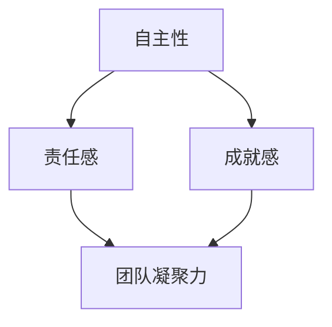
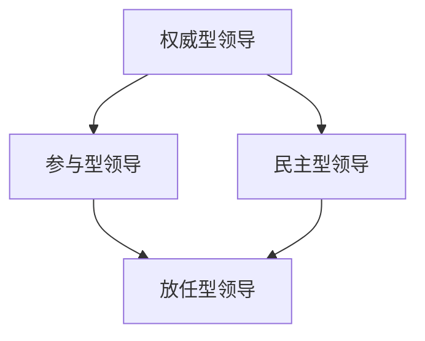
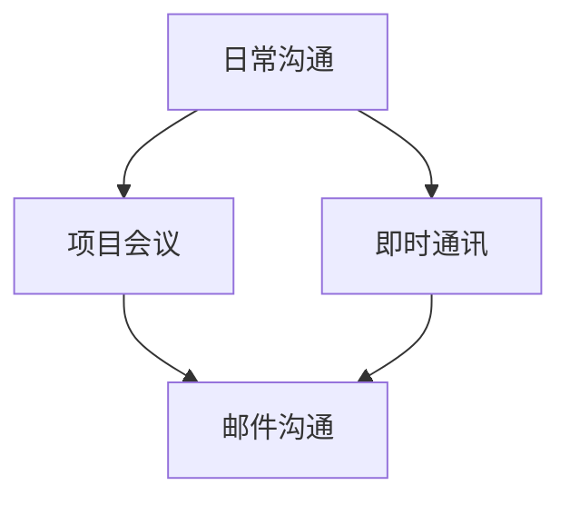
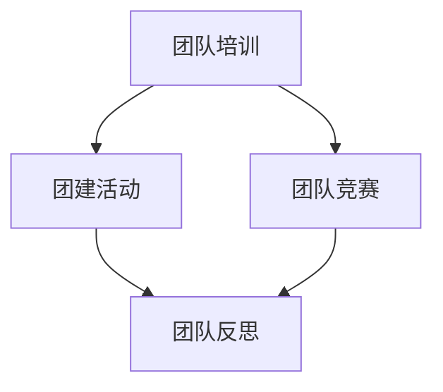
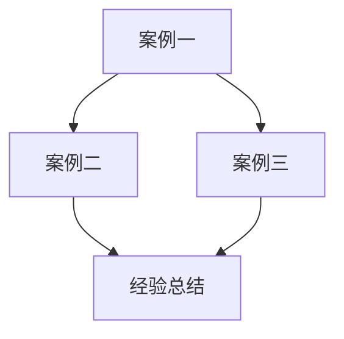
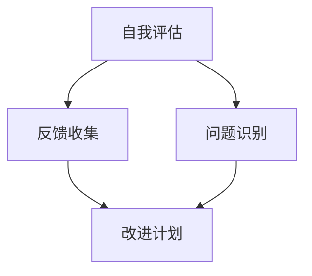
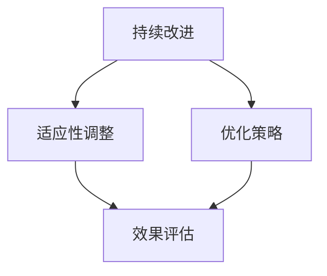

                 

### 如何激发团队成员的主动性

---

## 文章标题：如何激发团队成员的主动性

## 关键词：团队主动性、激励机制、领导风格、文化建设

> **摘要**：本文旨在探讨如何有效激发团队成员的主动性，通过分析团队动力模型、核心原理、实践策略及案例研究，提出一系列具体的解决方案和最佳实践。文章旨在帮助管理者提升团队绩效，营造积极向上的团队氛围。

---

## 引言

在一个高效的团队中，成员的主动性至关重要。主动性不仅体现在个人能力的发挥上，更是团队协作和创新的关键推动力。然而，如何激发团队成员的主动性，却是一个复杂而富有挑战性的问题。本文将基于团队动力模型，结合心理学和管理学原理，提出一系列实践策略，旨在帮助团队管理者有效激发成员的主动性。

### 团队动力模型

团队动力模型是理解团队行为和互动的基础。该模型通常包括以下几个核心要素：

1. **自主性**：成员在完成任务时具有自主决策和自我管理的权利。
2. **责任感**：成员对团队目标和成果具有强烈的责任感。
3. **成就感**：成员在完成任务后获得成就感和自我满足。

这些要素相互关联，共同构成了团队动力的核心框架。以下是一个简化的团队动力模型Mermaid流程图：



### 激发主动性的核心原理

为了有效激发团队成员的主动性，我们需要深入理解并运用以下几个核心原理：

#### 自主性原理

自主性是激发团队成员主动性的基础。它赋予成员自主决策的权利，使他们在工作中能够发挥创造性。自主性原理的实现机制可以通过以下伪代码来描述：

```python
# 假设成员正在执行任务
def task_execution(task):
    # 成员有权自主选择完成任务的方法
    member_choice = select_execution_method(task)
    execution_plan = create_plan(member_choice)
    execute_plan(execution_plan)
```

#### 责任感原理

责任感是成员对团队目标和成果的承诺。它激励成员努力工作，确保任务成功。责任感原理可以通过以下数学模型来描述：

$$
责任感 = \frac{目标达成度}{时间投入}
$$

#### 成就感原理

成就感是成员在完成任务后获得的满足感。它可以增强成员的工作动力，提高团队士气。成就感原理的实现机制如下：

```python
# 假设成员完成任务并获得反馈
def task_completion(feedback):
    if feedback == '成功':
        # 成员获得成就感
        achieve_sense_of_accomplishment()
    else:
        # 成员需要改进
        need_for_improvement()
```

### 团队文化建设

团队文化是激发团队成员主动性的关键因素。积极向上的团队文化可以增强成员的归属感和责任感，从而提高团队的绩效。以下是一个关于团队文化建设的关键数学模型：

$$
团队文化得分 = \frac{员工满意度 + 团队凝聚力}{员工流失率}
$$

### 领导风格与主动性

领导风格对团队成员的主动性有着重要影响。不同的领导风格可以激发不同的团队动力。以下是一个关于领导风格的Mermaid流程图：



### 激励机制设计

激励机制是激发团队成员主动性的重要手段。合理的激励机制可以增强成员的工作动力，提高团队绩效。以下是一个简单的激励机制设计：

```python
# 假设成员完成任务并得到奖励
def reward_system(task_completion):
    if task_completion == '优秀':
        reward = '奖金'
    elif task_completion == '良好':
        reward = '表扬'
    else:
        reward = '改进建议'
    return reward
```

### 沟通与协作

有效的沟通和协作是激发团队成员主动性的关键。良好的沟通可以增强团队凝聚力，提高协作效率。以下是一个关于沟通与协作的Mermaid流程图：



### 团队建设与主动性

团队建设活动可以帮助增强团队成员之间的信任和协作，从而提高团队的主动性。以下是一个关于团队建设活动的Mermaid流程图：



### 成功案例解析

通过分析成功案例，我们可以更好地理解如何激发团队成员的主动性。以下是一个关于成功案例的Mermaid流程图：



### 自我评估与改进

为了持续提升团队的主动性，管理者需要定期进行自我评估和改进。以下是一个关于自我评估与改进的Mermaid流程图：



### 持续改进与优化

持续改进是提升团队主动性的关键。管理者需要不断优化团队管理策略，以适应不断变化的环境。以下是一个关于持续改进与优化的Mermaid流程图：



### 结语

激发团队成员的主动性是一个复杂而持续的过程。管理者需要深入了解团队动力模型、核心原理和实践策略，结合实际情况进行灵活运用。通过有效的团队文化建设、领导风格、激励机制设计和沟通协作，可以不断提升团队的主动性，实现团队的高效运作和持续发展。

---

## 作者信息

作者：AI天才研究院/AI Genius Institute & 禅与计算机程序设计艺术 /Zen And The Art of Computer Programming

---

## 附录

### 附录A：常用激励措施与案例

- **激励措施**：奖金、表扬、晋升、培训、休假等。
- **案例**：某科技公司的员工奖金制度、某电商企业的员工培训计划。

### 附录B：团队建设活动指南

- **活动类型**：团队培训、团建活动、团队竞赛等。
- **实施步骤**：活动设计、活动准备、活动实施、活动总结。

### 附录C：团队主动性测评量表

- **测评内容**：自主性、责任感、成就感、团队凝聚力等。
- **测评方法**：问卷调查、面谈、行为观察等。

---

## 拓展阅读

- **相关书籍**：《团队动力管理》、《激励原理与实践》、《团队沟通与协作》。
- **论文资料**：关于团队主动性研究的最新论文和报告。
- **在线资源**：各种在线平台和社交媒体上的相关文章和讨论。

---

以上内容是一个初步的框架，每个部分都可以根据实际需求进行扩展和细化。整个文章的字数预计在8000-12000字左右，确保内容的深度和广度。如果您有任何具体的修改意见或需要进一步的内容建议，请随时告知。

