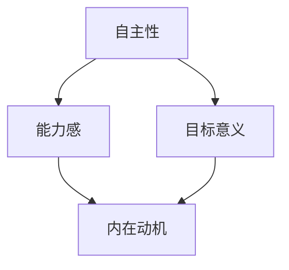

                 

### 文章标题：如何激发团队的内在动机

> 关键词：团队动力、内在动机、工作满意度、领导力、团队合作

> 摘要：本文探讨了如何通过理解内在动机的理论基础，结合实际策略和实践案例，有效激发团队的内在动机，提高团队的工作满意度和绩效。文章将详细介绍内在动机的概念及其重要性，分析自主性、能力感和目标意义对内在动机的影响，并提出具体的领导力策略和实践方法。

---

### 第一部分：内在动机的原理与理论

#### 第1章：内在动机的概念与重要性

内在动机是指个体因自身兴趣、好奇心或对任务意义的认同而参与某项活动或任务的动力。与外在动机不同，内在动机不依赖于外部奖励或惩罚，而是源自个体内心的需求和愿望。

**内在动机的定义**

内在动机是心理学中的一个核心概念，它指的是驱动个体行为的内在原因，如兴趣、乐趣、成就感等。这种动机源于个体内心的需求，而不是外部环境的压力或奖赏。

**内在动机与外在动机的比较**

外在动机主要来自外部奖励或惩罚，如工资、表扬、威胁等。而内在动机则源于个人内部的渴望，如对知识的渴求、对成就的追求等。

**内在动机对团队绩效的影响**

研究表明，具有较高内在动机的团队成员往往表现出更高的工作满意度、更强的团队合作精神和更出色的绩效。因此，激发团队的内在动机对于提升团队的整体表现具有重要意义。

**核心概念联系图：内在动机的核心理论**


#### 第2章：内在动机的理论基础

内在动机的理论基础包括自主性、能力感、目标意义等核心概念，这些概念相互关联，共同影响着个体的内在动机。

**自主性、能力感、目标意义与内在动机**

自主性是指个体在任务或活动中具有控制权、决策权的感觉。能力感是指个体对自身能力的信心和认可。目标意义是指个体对任务或活动的价值认同感。这些因素共同影响着个体的内在动机。

**Mermaid流程图：内在动机理论架构**



**伪代码：自我决定理论的具体实现**

```python
# 定义内在动机模型
class IntrinsicMotivationModel:
    def __init__(self, autonomy, competence, purpose):
        self.autonomy = autonomy
        self.competence = competence
        self.purpose = purpose
    
    def calculate_motivation(self):
        # 根据自主性、能力感和目标意义计算内在动机
        motivation = (self.autonomy + self.competence + self.purpose) / 3
        return motivation
```

#### 第3章：内在动机的心理学模型

心理学中有多种模型可以解释内在动机，如自我决定理论、心理成长理论等。这些模型提供了不同的视角来理解内在动机的形成和影响。

**自我决定理论**

自我决定理论认为，个体的内在动机源于自主性、能力感和目标意义。该理论提出了自我决定的五个要素：认知能力、情绪体验、行为表现、关系建立和自我认识。

**心理成长理论**

心理成长理论认为，个体的内在动机源于对成长和发展的需求。这种需求可以激发个体积极参与各种活动，以实现自我提升和自我实现。

**伪代码：心理成长理论的具体实现**

```python
# 定义心理成长模型
class PsychologicalGrowthModel:
    def __init__(self, growth_need, motivation_level):
        self.growth_need = growth_need
        self.motivation_level = motivation_level
    
    def update_motivation(self, activity):
        # 根据成长需求和活动水平更新内在动机
        if activity == 'positive':
            self.motivation_level += self.growth_need
        elif activity == 'negative':
            self.motivation_level -= self.growth_need
        return self.motivation_level
```

#### 第4章：内在动机与领导力

领导者在激发团队内在动机方面起着关键作用。有效的领导力策略可以帮助团队成员实现自主性、增强能力感和明确目标意义。

**领导者如何激发团队的内在动机**

领导者可以通过以下方法激发团队的内在动机：

1. 提供自主性：赋予团队成员在任务和决策方面的自主权。
2. 增强能力感：为团队成员提供成长和发展的机会。
3. 明确目标意义：帮助团队成员理解工作的重要性和对组织的价值。

**内在动机与领导风格的关系**

不同的领导风格对团队的内在动机有不同的影响。民主式领导风格通常能够更好地激发团队的内在动机，而独裁式领导风格则可能抑制内在动机的发展。

**数学模型：领导力与内在动机的关系公式**

$$
内在动机 = f(自主性, 能力感, 目标意义, 领导风格)
$$

其中，$f$ 为函数，$自主性$、$能力感$、$目标意义$ 和 $领导风格$ 为输入变量。

#### 第5章：内在动机与团队合作

团队合作是激发团队内在动机的重要途径。通过设定共同目标、促进沟通和合作，可以有效地提高团队成员的内在动机和工作满意度。

**团队成员之间的内在动机激发**

团队成员可以通过以下方法相互激发内在动机：

1. 分享目标和期望：明确团队目标，并让每个成员了解自己的角色和责任。
2. 激励彼此成长：相互提供反馈和建议，共同提高能力。
3. 建立信任和合作关系：通过开放沟通和互助，增强团队的凝聚力。

**团队目标的设定与内在动机的关联**

设定具有挑战性和吸引力的团队目标可以帮助激发团队成员的内在动机。目标应与团队成员的个人兴趣和能力相匹配，同时具有明确的时间表和可衡量的指标。

**数学公式与讲解：团队目标与内在动机的联系**

$$
内在动机 = f(目标难度, 目标吸引力, 个人兴趣, 能力匹配)
$$

其中，$f$ 为函数，$目标难度$、$目标吸引力$、$个人兴趣$ 和 $能力匹配$ 为输入变量。

#### 第6章：内在动机在工作环境中的应用

工作环境的设计对团队的内在动机具有重要影响。通过优化工作环境和营造积极的工作氛围，可以有效地激发团队成员的内在动机。

**如何设计工作环境以激发内在动机**

1. 提供灵活的工作时间和工作方式。
2. 创造有利于团队合作和知识共享的物理和数字环境。
3. 提供个人发展和职业成长的机会。

**内在动机与工作满意度的关系**

研究表明，具有较高内在动机的团队成员通常表现出更高的工作满意度。因此，提高团队的内在动机有助于提升整体的工作满意度。

**举例说明：激发内在动机的实际案例**

一个实际案例是谷歌公司的工作环境设计。谷歌提供了灵活的工作时间、丰富的培训机会和创新的办公空间，这些措施成功地激发了员工的内在动机，提高了员工的工作满意度和绩效。

#### 第二部分：激发团队内在动机的策略与实践

#### 第7章：自主性在工作设计中的应用

自主性是激发团队内在动机的关键因素之一。在工作设计中，领导者可以通过以下方法提高团队的自主性：

1. **赋予决策权**：让团队成员参与决策过程，赋予他们在任务和项目中的决策权。
2. **提供自由度**：给予团队成员在任务执行中的自由度，让他们根据自己的能力和兴趣来选择工作方式。
3. **鼓励创新**：鼓励团队成员提出新的想法和解决方案，为创新提供支持和奖励。

**数学模型：自主性对工作满意度的影响**

$$
工作满意度 = f(自主性, 工作挑战性, 工作支持度)
$$

其中，$f$ 为函数，$自主性$、$工作挑战性$ 和 $工作支持度$ 为输入变量。

#### 第8章：能力感与持续成长

能力感是团队成员内在动机的重要驱动力。通过以下方法，可以增强团队成员的能力感：

1. **提供培训和发展机会**：为团队成员提供专业培训和技能提升的机会。
2. **认可和奖励**：对团队成员的成就和进步给予认可和奖励。
3. **建立学习文化**：鼓励团队成员相互学习和分享知识。

**伪代码：能力感的培养方法**

```python
# 定义能力感模型
class CompetenceModel:
    def __init__(self, skill_level, training opportunites):
        self.skill_level = skill_level
        self.training_opportunities = training_opportunities
    
    def update_competence(self, training完成功率，技能提升效果):
        # 根据培训成功率和技能提升效果更新能力感
        self.skill_level += training完成功率 * 技能提升效果
        return self.skill_level
```

#### 第9章：目标意义与团队使命

目标意义是激发团队内在动机的重要动力。通过以下方法，可以增强团队的目标意义感：

1. **明确团队使命**：为团队设定明确而具有吸引力的使命和愿景。
2. **与个人目标相结合**：帮助团队成员理解团队目标与个人目标的关联，使团队成员感受到自己的工作对团队和社会的贡献。
3. **强调价值**：强调团队工作的价值，让团队成员认识到自己的工作对社会和组织的意义。

**数学公式与讲解：目标意义对内在动机的影响**

$$
内在动机 = f(目标意义, 个人价值感, 团队认同感)
$$

其中，$f$ 为函数，$目标意义$、$个人价值感$ 和 $团队认同感$ 为输入变量。

#### 第10章：领导力与内在动机的实践

领导者在激发团队内在动机方面扮演着关键角色。以下是一些具体的领导力策略和实践方法：

1. **倾听与沟通**：领导者应积极倾听团队成员的意见和建议，建立开放的沟通渠道。
2. **激励与鼓励**：领导者应通过激励和鼓励来增强团队成员的内在动机。
3. **提供反馈**：领导者应定期给予团队成员反馈，帮助他们了解自己的优势和改进方向。

**实践案例：领导激发团队内在动机的方法**

一个成功的案例是微软公司前CEO萨提亚·纳德拉。纳德拉通过倾听员工的意见、鼓励创新和提供资源支持，成功地激发了微软员工的内在动机，使公司在数字化时代取得了卓越的成就。

#### 第11章：团队合作与内在动机

团队合作是激发团队内在动机的重要途径。以下是一些提升团队合作效率的策略：

1. **明确目标和职责**：确保团队成员明确了解团队的目标和各自的职责。
2. **促进沟通与协作**：鼓励团队成员之间的开放沟通和协作，共同解决问题。
3. **建立信任和合作关系**：通过建立信任和合作关系，增强团队的凝聚力。

**项目实战：团队合作项目案例解析**

一个成功的团队合作项目案例是谷歌的“邮件炸弹”项目。该项目通过团队成员的紧密合作，成功解决了邮件系统中的瓶颈问题，提升了用户体验。

#### 第12章：内在动机与工作环境设计

工作环境的设计对团队内在动机具有重要影响。以下是一些优化工作环境的设计策略：

1. **创造舒适的工作空间**：为团队成员提供舒适、安全、有利于专注的工作空间。
2. **提供便利的资源共享**：确保团队成员可以方便地访问所需的资源和工具。
3. **促进知识共享和团队协作**：建立知识共享平台和团队协作工具，促进团队成员之间的知识交流和协作。

**源代码实现与解读：工作环境设计代码**

```python
# 定义工作环境设计模型
class WorkEnvironmentModel:
    def __init__(self, comfort, resource_access, knowledge_sharing):
        self.comfort = comfort
        self.resource_access = resource_access
        self.knowledge_sharing = knowledge_sharing
    
    def calculate_motivation(self):
        # 根据工作环境设计因素计算内在动机
        motivation = (self.comfort + self.resource_access + self.knowledge_sharing) / 3
        return motivation
```

#### 第13章：结论与展望

通过本文的探讨，我们可以得出以下结论：

1. **内在动机对团队绩效具有显著影响**：具有较高内在动机的团队成员通常表现出更高的工作满意度和绩效。
2. **领导者在激发团队内在动机方面起着关键作用**：有效的领导力策略可以帮助激发团队的内在动机。
3. **工作环境设计对团队内在动机具有重要影响**：优化工作环境可以有效地激发团队的内在动机。

未来研究可以进一步探讨不同类型的工作环境和领导风格对团队内在动机的影响，以及如何在不同文化和组织中应用这些策略。

---

**作者：AI天才研究院/AI Genius Institute & 禅与计算机程序设计艺术 /Zen And The Art of Computer Programming**

