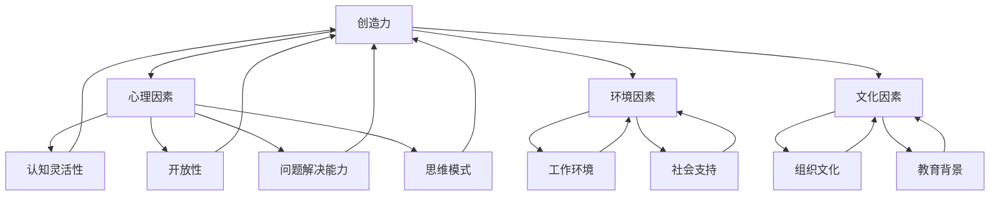

                 

### 文章标题：如何激发团队的创造力

#### 关键词：团队创造力、激发策略、领导力、团队协作、案例分析

> **摘要：**本文旨在深入探讨如何有效激发团队的创造力。通过分析创造力理论、提出实践策略、探讨团队协作与领导力关系，并结合案例分析，为读者提供一套系统化的方法论，以提升团队整体创造力，助力组织创新与持续发展。

### 引言

在当今快速变化的市场环境中，创新是企业保持竞争力的关键。而团队的创造力是驱动创新的核心要素。然而，如何有效地激发和提升团队的创造力，成为许多管理者面临的挑战。本文将从创造力基础理论、激发创造力的策略、团队协作与领导力关系以及案例分析四个方面，系统性地探讨如何激发团队的创造力。

#### 第一步：理解书名和目标受众

《如何激发团队的创造力》一书的目标是帮助读者理解并实践激发团队创造力的方法。读者群体可能包括管理者、团队领导以及组织内部的任何成员，他们希望通过学习书中的策略和方法，提高团队的创造力。因此，本文的目标是：

1. **概述创造力的重要性**：解释为什么创造力对于团队和组织来说是必不可少的。
2. **理论基础**：介绍与创造力相关的核心概念和理论。
3. **策略与实践**：提供具体的策略和实践方法，帮助读者在实际工作中激发团队的创造力。
4. **案例分析**：通过实际案例，展示如何将理论应用于实践，并从中吸取经验。
5. **总结与建议**：总结全文内容，并提供进一步提升团队创造力的建议。

#### 第二步：创造力基础理论

创造力是指个体或团队产生新颖且有价值的想法或解决方案的能力。在心理学中，创造力通常与认知灵活性、开放性、问题解决能力和思维模式相关联。创造力可以分为以下几种类型：

1. **流思维**：指在专注状态下，个体或团队能够高效、无障碍地解决问题。
2. **随机思维**：指在不确定性或混沌状态下，个体或团队能够产生新颖的想法。
3. **收敛思维**：指在限制性条件下，个体或团队能够找到最佳的解决方案。
4. **发散思维**：指在开放性条件下，个体或团队能够产生大量的创意和想法。

创造力不仅受个体心理因素的影响，还受到环境、文化和社会等因素的制约。例如，开放和支持性的工作环境、鼓励尝试和失败的文化，都能促进团队的创造力。

#### 核心概念与联系

为了更好地理解创造力，我们可以用以下Mermaid流程图展示核心概念之间的关系：



在这个流程图中，创造力被视为一个核心概念，它与心理因素、环境因素和文化因素密切相关。心理因素包括认知灵活性、开放性、问题解决能力和思维模式；环境因素包括工作环境和外部社会支持；文化因素包括组织文化和教育背景。

#### 核心算法原理讲解

在理解了创造力基础理论后，我们需要深入探讨激发创造力的核心算法原理。以下是一个简化的伪代码示例，用于描述如何通过一系列策略来激发团队的创造力：

```plaintext
function stimulateCreativity(team):
    if not hasSupportiveEnvironment(team):
        createSupportiveEnvironment(team)
    if not hasInnovationDrivenCulture(team):
        fosterInnovationDrivenCulture(team)
    if not hasEffectiveCollaboration(team):
        enhanceCollaboration(team)
    if not hasEffectiveLeadership(team):
        improveLeadership(team)
    return team
```

在这个伪代码中，我们定义了一个名为`stimulateCreativity`的函数，它接受一个团队作为参数，并返回经过一系列策略提升后的团队。函数内部包含四个主要步骤：

1. **检查是否有支持性环境**：如果团队没有支持性环境，则创建一个。
2. **检查是否有创新驱动的文化**：如果团队没有创新驱动的文化，则培养一个。
3. **检查团队协作是否有效**：如果团队协作不充分，则增强协作。
4. **检查领导力是否有效**：如果领导力不足，则提升领导力。

通过这些策略的实施，我们可以逐步激发团队的创造力。

#### 数学模型和公式

创造力激发过程中，可以使用以下数学模型来量化团队创造力：

$$
C = f(\text{E}, \text{C}, \text{L})
$$

其中，$C$代表团队的创造力，$E$代表环境因素，$C$代表文化因素，$L$代表领导力。

这个公式表明，团队的创造力是环境因素、文化因素和领导力的函数。我们可以使用以下参数来详细说明每个因素：

1. **环境因素**：$E = E_1 + E_2$，其中$E_1$代表工作环境的质量，$E_2$代表社会支持的程度。
2. **文化因素**：$C = C_1 + C_2$，其中$C_1$代表组织文化的创新驱动程度，$C_2$代表员工的教育背景。
3. **领导力**：$L = L_1 + L_2$，其中$L_1$代表领导风格，$L_2$代表领导提供资源和支持的能力。

通过调整这些参数，我们可以优化团队创造力。例如，提高工作环境质量（如提供创造性工具）、增强组织文化的创新驱动程度（如设立创新奖项）、改进领导风格（如鼓励创新思维）等，都可以提升团队的整体创造力。

#### 举例说明

为了更好地理解上述模型和公式，我们可以通过一个实际案例来说明如何激发团队的创造力。假设一个软件开发团队正在开发一款新的产品。根据创造力模型，我们可以采取以下步骤：

1. **环境因素**：为团队提供一个开放、无障碍的工作空间，配备先进的计算机设备和其他必要的资源。
2. **文化因素**：组织定期的头脑风暴会议，鼓励团队成员分享创意，并设立创新奖项以激励员工。
3. **领导力**：领导应扮演促进者角色，鼓励团队成员尝试新的方法和想法，并在项目过程中提供必要的支持。

通过这些措施，我们可以预计团队创造力会得到显著提升，从而推动新产品的成功开发。

#### 第三步：激发创造力的策略

在了解了创造力基础理论和核心算法原理后，接下来我们将讨论如何通过具体的策略来激发团队的创造力。以下是一些关键策略：

##### 1. 建立支持性环境

为了激发团队的创造力，首先需要建立一个支持性环境。这包括以下几个方面：

1. **提供资源和工具**：确保团队拥有完成项目所需的资源和工具，如先进的计算机设备、软件许可证、专业书籍等。
2. **优化工作空间**：创造一个开放、舒适的工作环境，鼓励团队成员自由交流和合作。
3. **允许失败**：建立一种包容失败的文化，鼓励团队成员在尝试新方法时不要害怕犯错。

##### 2. 培养创新驱动的文化

创新驱动的文化是激发团队创造力的关键。以下是一些具体措施：

1. **鼓励创意分享**：定期组织头脑风暴会议，让团队成员有机会分享他们的想法。
2. **设立创新奖项**：为那些提出创新想法或成功实施创新项目的团队成员设立奖项，以激励更多人参与创新。
3. **建立透明沟通机制**：鼓励团队成员之间的开放沟通，分享成功和失败的经验，以便从失败中学习并持续改进。

##### 3. 增强团队协作

协作是创造力的重要源泉。以下是一些增强团队协作的策略：

1. **明确角色和责任**：确保每个团队成员都清楚自己的角色和责任，以减少误解和冲突。
2. **促进知识共享**：鼓励团队成员分享他们的知识和经验，通过培训、研讨会和内部交流等方式实现。
3. **建立信任**：通过建立互信和团队合作精神，减少冲突，提高团队协作效率。

##### 4. 提升领导力

领导者在激发团队创造力中起着关键作用。以下是一些提升领导力的策略：

1. **提供支持和资源**：领导应确保团队在项目过程中获得必要的支持和资源，帮助他们克服困难。
2. **鼓励创新思维**：领导应以身作则，鼓励团队成员尝试新的方法和想法，营造一个鼓励创新的氛围。
3. **提供反馈和认可**：领导应及时给予团队成员反馈，认可他们的努力和成就，激励他们继续创新。

#### 第四步：团队协作与创造力

团队协作是激发创造力的关键因素。为了提高团队协作效率，以下是一些具体策略：

1. **明确目标和任务**：确保团队明确项目的目标和任务，以便每个成员都知道自己的职责和目标。
2. **促进沟通与反馈**：定期组织团队会议，促进成员之间的沟通和反馈，及时发现和解决问题。
3. **建立协作工具**：使用协作工具（如项目管理软件、在线协作平台等）来提高团队协作效率。

#### 第五步：案例分析与启示

以下是一些成功的案例，展示了如何通过实践策略激发团队的创造力，并从中获得启示：

##### 案例一：谷歌的“20%时间”政策

谷歌的“20%时间”政策允许员工在工作时间的20%内自由探索自己的项目。这一政策激发了员工的创造力，导致了众多成功的创新，如Google News、Gmail和AdSense。这一案例表明，提供自由时间和支持可以激发员工的创造力。

##### 案例二：3M的“15%项目”计划

3M公司允许员工将工作时间的15%用于自己的项目。这一计划促进了3M公司的多项创新，如透明胶带和记号笔。这个案例说明，鼓励员工自主探索和实验可以带来意想不到的创新成果。

##### 启示

从这些案例中，我们可以得出以下启示：

1. **提供自由和支持**：允许员工在规定时间内自由探索和创新，可以激发他们的创造力。
2. **鼓励失败和反思**：建立一种包容失败的文化，鼓励员工从失败中学习并持续改进。
3. **明确目标和角色**：确保团队明确项目的目标和任务，有助于提高协作效率。

#### 第六步：实践指南

为了激发团队的创造力，以下是一些建议和实践指南：

1. **建立支持性环境**：确保团队拥有完成项目所需的资源和工具，创造一个开放、舒适的工作环境。
2. **培养创新文化**：定期组织头脑风暴会议，鼓励创意分享，设立创新奖项，建立透明沟通机制。
3. **增强团队协作**：明确角色和责任，促进知识共享，建立信任，使用协作工具提高协作效率。
4. **提升领导力**：提供支持和资源，鼓励创新思维，提供反馈和认可。
5. **持续学习和反思**：鼓励团队成员不断学习新技能和知识，从失败和成功中吸取经验，持续改进。

#### 第七步：总结与展望

通过本文的探讨，我们了解到创造力对于团队和组织的重要性，并提出了激发团队创造力的系统化方法论。实践证明，通过建立支持性环境、培养创新文化、增强团队协作和提升领导力，可以有效激发团队的创造力。未来，我们可以继续探索更多创新的策略和方法，以推动团队和组织持续发展。

#### 附录：创造力激发工具与资源

为了帮助读者进一步激发团队的创造力，以下是一些有用的工具和资源：

1. **协作工具**：Trello、Asana、Slack等。
2. **头脑风暴工具**：MindMeister、MindManager等。
3. **创新项目管理**：创新管理软件、项目跟踪工具。
4. **教育资源**：在线课程、研讨会、专业书籍。
5. **创意工作坊**：组织创意工作坊，促进团队成员的交流和合作。

### 作者信息

作者：AI天才研究院/AI Genius Institute & 禅与计算机程序设计艺术 /Zen And The Art of Computer Programming

---

本文旨在通过逻辑清晰、结构紧凑、简单易懂的专业的技术语言，引导读者逐步分析和推理，深入探讨如何激发团队的创造力。从创造力基础理论、实践策略、团队协作与领导力关系，到案例分析，文章系统性地阐述了激发团队创造力的方法和实践。希望通过本文，读者能够获得有价值的见解和实用的指导，提升团队的创造力，推动组织创新与发展。

