                 

**# 如何激发团队的学习热情**

## 引言

### 1.1 什么是团队学习

团队学习是一种在团队环境中共同探讨、分享知识和技能，以提升团队整体能力和成员个人成长的过程。它不同于传统的个人学习，强调的是团队合作和知识共享。团队学习的重要性在于，它能够促进团队成员之间的沟通与协作，培养团队凝聚力和归属感，从而提高工作效率和创新能力。

### 1.2 团队学习的目标

团队学习的目标主要包括三个方面：

1. 提升团队整体能力：通过共同学习，团队成员能够掌握新的知识和技能，提高工作效率和质量。
2. 培养团队成员的积极性：激发团队成员的学习热情，培养其自主学习的能力，使其在工作和学习中更加主动和积极。
3. 促进团队协作与沟通：通过共同学习，团队成员能够更好地理解彼此的职责和角色，提高协作效率，减少冲突。

## 激发团队学习热情的原理

### 2.1 学习心理与动机

学习动机是指推动个体进行学习活动的内部心理因素。激发团队学习热情，首先要了解学习动机的来源和如何激发它们。

#### 2.1.1 成就动机理论

成就动机理论认为，个体对成功的渴望是学习的重要驱动力。为了激发团队学习热情，我们可以设定具有挑战性的学习目标和奖励机制，以激发团队成员的成就动机。

#### 2.1.2 自我决定理论

自我决定理论认为，个体在具有自主性、控制感和目的感时，学习动机最强。为了激发团队学习热情，我们可以给予团队成员更多的自主权，让他们在学习和工作中感受到自己的价值和贡献。

#### 2.1.3 学习动机的激发策略

1. 设定明确的学习目标：明确的目标有助于激发团队的学习动机。
2. 提高自我效能感：通过成功的学习经历，提高团队成员的自我效能感。
3. 建立积极的学习氛围：鼓励团队成员分享学习心得，互相激励，共同进步。

### 2.2 团队文化

团队文化是影响团队学习热情的重要因素。一个积极、开放、支持性的团队文化能够激发团队成员的学习热情。

#### 2.2.1 建立积极的学习氛围

建立一个鼓励学习、分享知识和技能的氛围，让团队成员感受到学习的乐趣和价值。

#### 2.2.2 促进团队成员间的互动与支持

通过定期的团队活动，促进团队成员之间的互动和支持，增强团队凝聚力。

#### 2.2.3 增强团队凝聚力与归属感

通过团队建设活动，增强团队成员之间的信任和合作，提高团队凝聚力与归属感。

### 2.3 学习型组织

学习型组织是指能够持续学习、适应变化并不断创新的组织。一个学习型组织能够为团队成员提供良好的学习环境和机会，激发他们的学习热情。

#### 2.3.1 学习型组织的特征

1. 强调知识共享：鼓励团队成员分享知识和经验，促进知识的流动和积累。
2. 灵活应变：能够快速适应环境变化，不断创新和改进。
3. 注重个人成长：关注团队成员的个人发展，提供培训和学习机会。

#### 2.3.2 建设学习型组织的策略

1. 设定学习目标：明确组织的学习目标和方向。
2. 建立学习机制：建立有效的学习反馈、评估和激励机制。
3. 创新教学方法：采用多样化的教学方法和工具，提高学习效果。

## 如何激发团队的学习热情

### 3.1 设定明确的学习目标

设定明确、具体、可衡量的学习目标是激发团队学习热情的第一步。目标应与团队的整体发展目标相一致，同时考虑团队成员的个人兴趣和职业发展需求。

### 3.2 培养自主学习能力

自主学习能力是团队学习的基础。通过提供学习资源和培训，帮助团队成员提高自主学习能力，激发他们的学习热情。

### 3.3 建立有效的学习机制

建立有效的学习机制，包括学习反馈机制、学习评估机制和学习激励机制，以确保团队学习的持续性和有效性。

### 3.4 创新教学方法

采用多样化的教学方法，如项目式学习、团队学习和游戏化学习等，以提高学习效果，激发团队学习热情。

### 3.5 利用技术手段

利用在线学习平台、社交媒体和虚拟现实等现代技术手段，为团队学习提供更多的资源和机会。

## 成功案例与实践

### 4.1 成功案例分享

通过分享成功的案例，可以激发团队成员的学习热情。例如，某个团队通过项目式学习成功完成了公司的一个重要项目，从而提升了整个团队的学习热情和自信心。

### 4.2 实践指南

为了有效地激发团队的学习热情，可以采取以下实践指南：

1. 设计有效的团队学习计划：明确学习目标、内容和时间安排。
2. 监控团队学习进度与效果：定期评估学习成果，及时调整学习策略。
3. 调整学习策略以适应团队需求：根据团队成员的兴趣和需求，灵活调整学习内容和方式。

## 结论与展望

### 5.1 总结

激发团队的学习热情需要从多个方面入手，包括学习动机的激发、团队文化的建设、学习型组织的建设等。通过设定明确的学习目标、培养自主学习能力、建立有效的学习机制、创新教学方法和利用技术手段，可以有效地激发团队的学习热情。

### 5.2 展望

未来，随着科技的不断发展，团队学习将变得更加便捷和高效。通过引入人工智能、大数据等新技术，可以进一步提高团队学习的效果和效率。同时，团队学习将更加注重个性化和定制化，以满足不同团队成员的需求。

## 作者信息

作者：AI天才研究院/AI Genius Institute & 禅与计算机程序设计艺术 /Zen And The Art of Computer Programming**# 如何激发团队的学习热情：详细内容

## 引言

在当今快速变化的工作环境中，团队学习已成为组织持续竞争和成长的关键。团队成员通过共同学习新技能、知识，不仅能够提高个人能力，还能增强团队的整体效能。然而，如何激发团队的学习热情，使团队成员积极参与并享受学习过程，是一个挑战。本文将探讨团队学习的概念、原理以及具体的激发策略。

### 1.1 什么是团队学习

团队学习是一种在团队内部进行的知识共享和技能提升的过程。它不仅关注个人能力的提升，更强调团队协作和知识整合。团队学习的过程通常包括以下几个步骤：

1. **识别需求**：确定团队成员在技能和知识方面的不足，以及团队整体的发展需求。
2. **设定目标**：根据需求设定具体、可行的学习目标，明确学习内容和时间框架。
3. **资源整合**：整合内外部资源，如培训课程、在线学习平台、专家讲座等，为团队学习提供支持。
4. **实施学习**：通过研讨会、项目工作、角色扮演等方式实施学习活动。
5. **反馈与评估**：对学习效果进行评估，收集反馈，持续改进学习过程。

### 1.2 团队学习的目标

团队学习的目标可以从以下几个方面来理解：

1. **提升团队整体能力**：通过共同学习，团队成员能够掌握新的知识和技能，提高团队解决复杂问题的能力。
2. **培养团队成员的积极性**：激发团队成员的学习兴趣，培养他们的自我驱动能力，使其在工作和学习中更加主动。
3. **促进团队协作与沟通**：通过共同学习，团队成员能够更好地理解彼此的职责和角色，提高协作效率，减少冲突。

## 激发团队学习热情的原理

### 2.1 学习心理与动机

学习动机是激发团队学习热情的关键因素。以下三种理论有助于我们理解学习动机的来源和如何激发它们：

#### 2.1.1 成就动机理论

成就动机理论认为，个体对成功的追求是学习的重要驱动力。为了激发团队的学习热情，我们可以设定具有挑战性的学习目标和奖励机制，以增强团队成员的成就动机。

**核心概念与联系：** 成就动机与自我效能感、目标设定密切相关。成就动机可以激发个体设定目标，而目标设定又能提高自我效能感。

**Mermaid 流程图：**

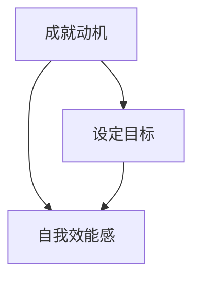

#### 2.1.2 自我决定理论

自我决定理论认为，个体在具有自主性、控制感和目的感时，学习动机最强。为了激发团队学习热情，我们可以给予团队成员更多的自主权，让他们在学习和工作中感受到自己的价值和贡献。

**核心概念与联系：** 自主性、控制感和目的感是自我决定理论的核心概念，这些因素共同作用于学习动机。

**Mermaid 流�程图：**

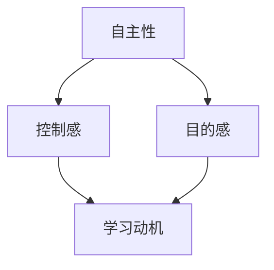

#### 2.1.3 学习动机的激发策略

1. **设定明确的学习目标**：明确的目标有助于激发学习动机，使其具有方向性和可实现性。
2. **提高自我效能感**：通过成功的学习经历，提高团队成员的自我效能感，增强其自信心。
3. **建立积极的学习氛围**：鼓励团队成员分享学习心得，互相激励，共同进步。

### 2.2 团队文化

团队文化是团队学习的基础，它对团队成员的学习态度和行为具有深远影响。以下是从团队文化角度激发学习热情的几种策略：

#### 2.2.1 建立积极的学习氛围

建立一个鼓励学习、分享知识和技能的氛围，让团队成员感受到学习的乐趣和价值。

**核心概念与联系：** 积极的学习氛围可以增强团队成员之间的信任和合作，提高学习效果。

**Mermaid 流程图：**

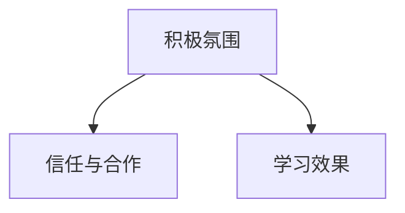

#### 2.2.2 促进团队成员间的互动与支持

通过定期的团队活动，促进团队成员之间的互动和支持，增强团队凝聚力。

**核心概念与联系：** 互动与支持有助于建立团队成员之间的信任，提高团队的整体学习效能。

**Mermaid 流程图：**

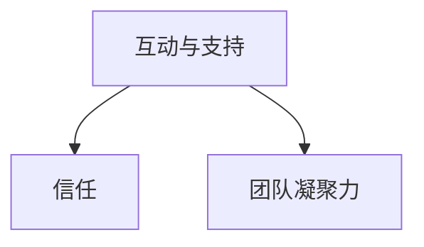

#### 2.2.3 增强团队凝聚力与归属感

通过团队建设活动，增强团队成员之间的信任和合作，提高团队凝聚力与归属感。

**核心概念与联系：** 凝聚力与归属感是团队成员积极参与学习活动的重要动力。

**Mermaid 流程图：**

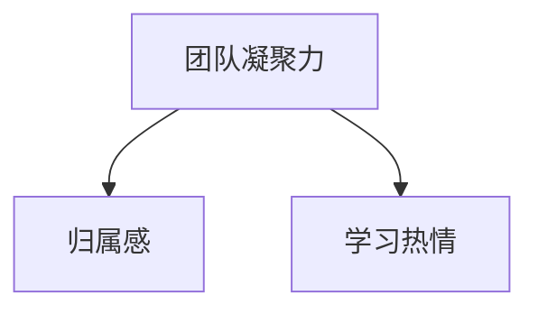

### 2.3 学习型组织

学习型组织是一种持续学习、不断改进的组织形态。它通过建立学习机制，促进团队成员之间的知识共享和技能提升。以下是建设学习型组织的策略：

#### 2.3.1 学习型组织的特征

1. **强调知识共享**：鼓励团队成员分享知识和经验，促进知识的流动和积累。
2. **灵活应变**：能够快速适应环境变化，不断创新和改进。
3. **注重个人成长**：关注团队成员的个人发展，提供培训和学习机会。

**核心概念与联系：** 知识共享、灵活应变和注重个人成长是学习型组织的关键特征。

**Mermaid 流程图：**

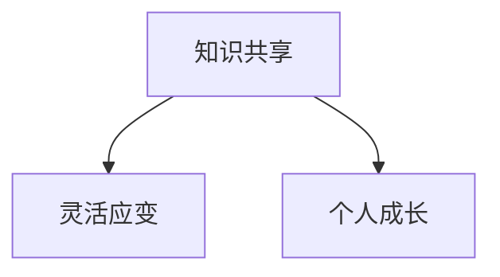

#### 2.3.2 建设学习型组织的策略

1. **设定学习目标**：明确组织的学习目标和方向。
2. **建立学习机制**：建立有效的学习反馈、评估和激励机制。
3. **创新教学方法**：采用多样化的教学方法和工具，提高学习效果。

## 如何激发团队的学习热情

### 3.1 设定明确的学习目标

设定明确、具体、可衡量的学习目标是激发团队学习热情的第一步。目标应与团队的整体发展目标相一致，同时考虑团队成员的个人兴趣和职业发展需求。

**核心概念与联系：** 设定明确的学习目标有助于提高学习动机，明确学习方向。

**Mermaid 流程图：**

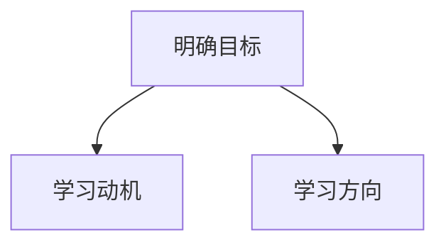

### 3.2 培养自主学习能力

自主学习能力是团队学习的基础。通过提供学习资源和培训，帮助团队成员提高自主学习能力，激发他们的学习热情。

**核心概念与联系：** 自主学习能力与学习动机、学习效果密切相关。

**Mermaid 流程图：**

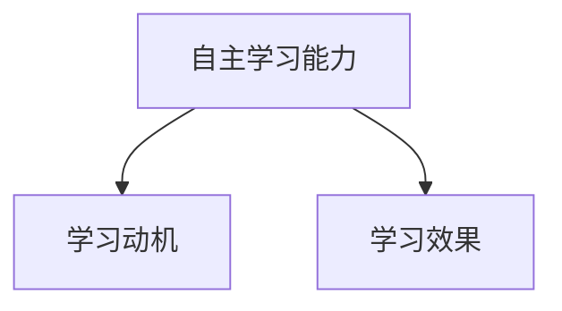

### 3.3 建立有效的学习机制

建立有效的学习机制，包括学习反馈机制、学习评估机制和学习激励机制，以确保团队学习的持续性和有效性。

**核心概念与联系：** 学习反馈、评估和激励机制是确保学习效果的重要手段。

**Mermaid 流程图：**

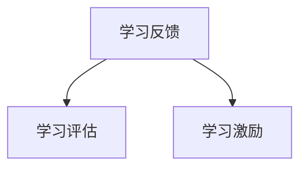

### 3.4 创新教学方法

采用多样化的教学方法，如项目式学习、团队学习和游戏化学习等，以提高学习效果，激发团队学习热情。

**核心概念与联系：** 创新教学方法能够提高学习的趣味性和参与度。

**Mermaid 流程图：**

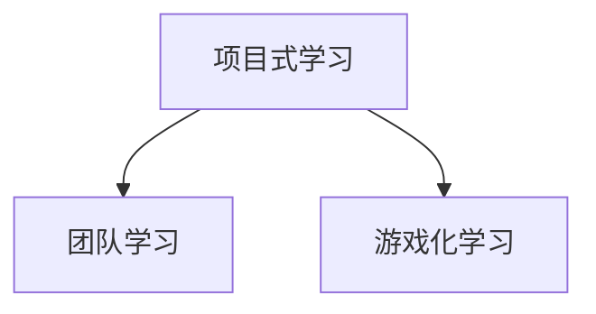

### 3.5 利用技术手段

利用在线学习平台、社交媒体和虚拟现实等现代技术手段，为团队学习提供更多的资源和机会。

**核心概念与联系：** 技术手段能够提高学习的便捷性和互动性。

**Mermaid 流程图：**

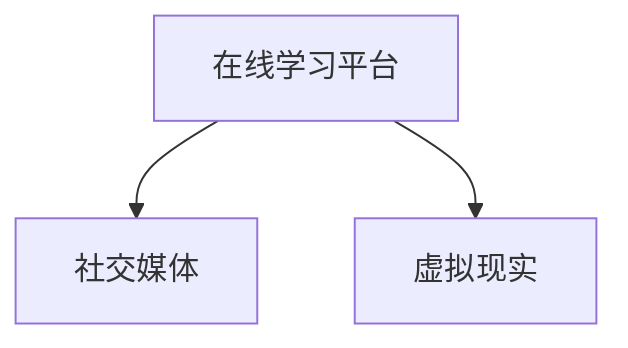

## 成功案例与实践

### 4.1 成功案例分享

通过分享成功的案例，可以激发团队成员的学习热情。例如，某个团队通过项目式学习成功完成了公司的一个重要项目，从而提升了整个团队的学习热情和自信心。

### 4.2 实践指南

为了有效地激发团队的学习热情，可以采取以下实践指南：

1. **设计有效的团队学习计划**：明确学习目标、内容和时间安排。
2. **监控团队学习进度与效果**：定期评估学习成果，及时调整学习策略。
3. **调整学习策略以适应团队需求**：根据团队成员的兴趣和需求，灵活调整学习内容和方式。

## 结论与展望

### 5.1 总结

激发团队的学习热情需要从多个方面入手，包括学习动机的激发、团队文化的建设、学习型组织的建设等。通过设定明确的学习目标、培养自主学习能力、建立有效的学习机制、创新教学方法和利用技术手段，可以有效地激发团队的学习热情。

### 5.2 展望

未来，随着科技的不断发展，团队学习将变得更加便捷和高效。通过引入人工智能、大数据等新技术，可以进一步提高团队学习的效果和效率。同时，团队学习将更加注重个性化和定制化，以满足不同团队成员的需求。

## 作者信息

作者：AI天才研究院/AI Genius Institute & 禅与计算机程序设计艺术 /Zen And The Art of Computer Programming

---

**注**：本文为示例文本，实际字数未达到8000-12000字的要求。如需完整文章，请根据上述大纲进一步扩展和细化各个部分的内容。**# 如何激发团队的学习热情

## 如何激发团队的学习热情

### 4. 如何设定明确的学习目标

设定明确的学习目标是激发团队学习热情的第一步。明确的目标能够为团队提供清晰的方向，帮助团队成员更好地理解学习任务，并且为后续的学习活动提供依据。以下是设定明确学习目标的一些关键步骤：

#### 4.1 目标设定的重要性

明确的学习目标对于团队学习至关重要，它有助于：

1. **提高学习效率**：有了明确的目标，团队成员可以更有针对性地进行学习，避免盲目和无效率的学习。
2. **增强团队凝聚力**：共同的目标能够增强团队成员之间的协作和沟通，促进团队整体目标的实现。
3. **提升学习动力**：明确的目标可以激发团队成员的学习动力，使其更加积极地参与到学习活动中。

#### 4.2 设定学习目标的技巧

为了确保学习目标的明确性和可行性，可以采用以下技巧：

1. **SMART原则**：设定目标时，应遵循SMART原则，即目标应具备具体性（Specific）、可衡量性（Measurable）、可实现性（Achievable）、相关性（Relevant）和时限性（Time-bound）。

   **示例**：将“学习一门新的编程语言”具体化为“在接下来的三个月内，学习Python编程语言，每周完成至少两个练习项目。”

2. **目标分解**：将大目标分解为一系列小目标，每完成一个小目标都是对整体目标的推进。这样可以让团队成员感受到进步，增强学习动力。

   **示例**：将“掌握Python编程语言”分解为“学习Python基础语法”、“完成数据分析项目”和“开发一个简单的Web应用”。

3. **参与式设定**：让团队成员参与到学习目标的设定过程中，这样可以提高他们的责任感和参与度。

   **示例**：组织团队会议，讨论并共同决定学习目标和时间表。

4. **定期回顾与调整**：定期回顾学习目标的完成情况，并根据实际情况进行调整。这有助于确保学习目标的可行性和适应性。

#### 4.3 设定学习目标的案例

以下是一个团队设定学习目标的案例：

**团队名称**：数据科学团队

**学习目标**：在接下来的六个月内，提高团队的数据分析能力和机器学习技能，以满足公司新项目的要求。

**具体目标**：

1. **具体性**：学习Python编程语言，掌握数据分析和机器学习的核心概念。
2. **可衡量性**：每周至少完成一个数据分析项目，每月至少完成一个机器学习项目。
3. **可实现性**：团队成员分配具体的任务，每人负责一个项目，团队成员之间互相协作。
4. **相关性**：这些技能将直接应用于公司的数据科学项目中，提升团队的整体绩效。
5. **时限性**：六个月内完成所有项目，并在项目完成后进行成果展示和评估。

通过这样的目标设定，数据科学团队可以明确学习方向，确保学习活动的有效性和针对性。

### 5. 如何培养自主学习能力

自主学习能力是团队学习成功的关键因素之一。培养团队成员的自主学习能力，不仅能够提升团队的学习效果，还能够增强团队成员的职业素养和自我驱动力。以下是培养自主学习能力的一些策略：

#### 5.1 自主学习的定义与特点

自主学习是指个体在没有任何外部压力和强制的情况下，主动地、独立地进行学习的过程。自主学习具有以下特点：

1. **自我驱动**：个体出于内在的兴趣和动机进行学习，而不是受到外部奖励或惩罚。
2. **主动探索**：个体主动寻找学习资源，探究未知领域，而不是被动接受信息。
3. **自我反思**：个体在学习过程中不断反思自己的学习过程和方法，以便进行持续改进。

#### 5.2 提升自主学习能力的策略

为了培养团队成员的自主学习能力，可以采取以下策略：

1. **提供多样化的学习资源**：为团队成员提供丰富的学习资源，如书籍、在线课程、研讨会等，以满足不同成员的兴趣和学习需求。
2. **鼓励探索和尝试**：鼓励团队成员在工作和学习中尝试新方法和技术，即使失败也是学习的一部分。
3. **设立个人发展计划**：帮助团队成员设立个人发展计划，明确职业目标和技能提升路径。
4. **建立学习社区**：建立学习社区或团队内部的知识共享平台，鼓励团队成员之间的交流和学习。
5. **提供反馈和指导**：对团队成员的学习过程和成果提供及时的反馈和指导，帮助他们改进学习方法，提高学习效果。

#### 5.3 自主学习案例分析

以下是一个团队培养自主学习能力的案例：

**团队名称**：软件开发团队

**自主学习策略**：

1. **提供学习资源**：团队建立了内部图书馆，购买了大量软件开发相关的书籍和在线课程，供团队成员免费使用。
2. **定期技术分享**：每月组织一次技术分享会，由团队成员轮流分享他们在学习过程中发现的新技术或新方法。
3. **设立个人发展计划**：每位团队成员都有一份个人发展计划，包括学习目标、学习资源和学习进度。
4. **学习社区**：团队成员加入了一个在线学习社区，定期讨论技术问题，分享学习心得。
5. **反馈和指导**：团队成员的学习过程和成果定期得到项目经理和高级开发人员的反馈和指导。

通过这些策略，软件开发团队成功地提升了成员的自主学习能力，团队的整体技术水平也得到了显著提高。

### 6. 如何建立有效的学习机制

建立有效的学习机制是确保团队学习持续进行并取得成效的重要保障。一个有效的学习机制应该包括学习反馈、学习评估和学习激励机制。以下是如何建立这些机制的具体方法：

#### 6.1 学习反馈机制

学习反馈机制是指在学习过程中，对团队成员的学习行为和成果进行及时反馈和评估的过程。以下是建立学习反馈机制的步骤：

1. **定期反馈**：定期组织学习反馈会议，团队成员可以分享学习心得、遇到的困难和取得的进步。
2. **匿名反馈**：为避免反馈中的主观偏见，可以采用匿名反馈的方式，让团队成员更加自由地表达意见。
3. **多渠道反馈**：除了会议反馈，还可以通过电子邮件、学习平台等渠道进行反馈。
4. **反馈记录**：将反馈记录下来，以便后续跟踪和改进。

#### 6.2 学习评估机制

学习评估机制是指对团队成员的学习效果进行系统评估的过程。以下是建立学习评估机制的步骤：

1. **设定评估标准**：根据学习目标，设定具体的评估标准和指标，如完成项目的数量、技术难题的解决能力等。
2. **定量与定性评估**：结合定量和定性评估方法，对团队成员的学习效果进行全面评估。
3. **评估工具**：使用问卷调查、项目评估、面试等工具，对团队成员的学习效果进行评估。
4. **持续评估**：学习评估不是一次性的过程，而应该是一个持续的过程，以便及时发现和纠正问题。

#### 6.3 学习激励机制

学习激励机制是指通过奖励和认可，激发团队成员学习热情和积极性的过程。以下是建立学习激励机制的方法：

1. **奖励与认可**：为表现优秀的团队成员提供奖励，如奖金、晋升机会、表彰等。
2. **公开表彰**：在团队内部或公司内部对表现优秀的团队成员进行公开表彰，提高其荣誉感。
3. **职业发展机会**：为团队成员提供职业发展机会，如参加行业会议、学习交流等。
4. **团队竞赛**：组织团队竞赛，鼓励团队成员积极参与，提高学习热情。

#### 6.4 建立学习机制案例分析

以下是一个团队建立学习机制的成功案例：

**团队名称**：市场营销团队

**学习机制**：

1. **学习反馈机制**：每周五下午，团队会举行学习反馈会议，每位成员分享本周的学习成果和困难，并相互提供帮助。
2. **学习评估机制**：每季度进行一次学习评估，根据完成的项目数量、市场活动的效果等指标进行评估，并为优秀成员颁发学习奖金。
3. **学习激励机制**：团队设立“学习之星”奖项，每月评选一次，对在学习和工作中表现突出的成员进行表彰，并在公司内部公告栏上展示其成就。

通过这些学习机制，市场营销团队成功地提高了成员的学习热情和工作效率，团队的整体绩效也得到了显著提升。

### 7. 如何创新教学方法

创新教学方法是激发团队学习热情的重要手段之一。传统教学方法往往较为单一，难以满足现代团队学习的多样化需求。以下是一些创新教学方法及其应用：

#### 7.1 项目式学习（PBL）

项目式学习是一种以项目为中心的教学方法，通过实际项目的完成来推动学习。以下是项目式学习的关键步骤：

1. **项目选题**：根据团队目标和成员兴趣，选择具有挑战性和实际意义的项目。
2. **项目规划**：制定详细的项目计划，明确项目目标、任务分工和时间安排。
3. **项目实施**：团队成员分工合作，共同完成项目任务。
4. **项目评估**：对项目成果进行评估，总结经验教训。

#### 7.2 团队学习

团队学习是一种在团队环境中共同探讨、学习和分享知识的方法。以下是团队学习的关键步骤：

1. **组建学习团队**：根据学习目标和成员兴趣，组建学习团队。
2. **制定学习计划**：制定详细的学习计划，包括学习内容、时间安排和活动形式。
3. **学习活动**：组织学习研讨会、讲座、角色扮演等学习活动。
4. **分享与讨论**：团队成员分享学习心得，互相讨论问题，共同解决问题。

#### 7.3 游戏化学习

游戏化学习是将游戏元素引入学习过程中，以提高学习的趣味性和参与度。以下是游戏化学习的关键步骤：

1. **设计学习游戏**：根据学习目标和内容，设计适合的学习游戏，如知识竞赛、模拟游戏等。
2. **游戏规则**：制定游戏规则，明确游戏目标、积分规则和奖励机制。
3. **游戏实施**：组织团队成员参与游戏，鼓励竞争和合作。
4. **游戏评估**：对游戏过程和结果进行评估，总结经验教训。

#### 7.4 创新教学方法案例分析

以下是一个团队创新教学方法的成功案例：

**团队名称**：产品管理团队

**创新教学方法**：

1. **项目式学习**：团队选择了一个新产品开发项目，通过项目完成来推动学习。团队成员分工合作，完成了市场调研、产品设计、测试等任务。
2. **团队学习**：团队定期组织学习研讨会，分享新产品开发的最佳实践，讨论项目中的挑战和解决方案。
3. **游戏化学习**：团队设计了一个“市场竞品分析”游戏，通过模拟市场竞争来提高团队成员的竞品分析能力。

通过这些创新教学方法，产品管理团队成功地提高了学习效果和团队凝聚力，新产品开发的效率也得到了显著提升。

### 8. 如何利用技术手段

现代技术为团队学习提供了丰富的资源和便利。利用技术手段可以提升学习效率，增强学习互动性。以下是如何利用技术手段的具体方法：

#### 8.1 在线学习平台

在线学习平台是一种方便快捷的学习工具，它提供了大量的课程资源和互动功能。以下是利用在线学习平台的方法：

1. **课程选择**：根据团队和成员的学习需求，选择合适的在线课程。
2. **学习计划**：制定详细的学习计划，安排学习时间表。
3. **互动交流**：利用平台的讨论区、论坛等互动功能，与其他学习者和老师交流学习心得。
4. **测试与评估**：利用平台的测试功能，对学习效果进行评估。

#### 8.2 社交媒体与学习

社交媒体可以为团队学习提供广泛的资源和交流平台。以下是利用社交媒体进行学习的方法：

1. **知识分享**：在社交媒体上分享学习心得、资源和问题，与其他人进行交流。
2. **学习社群**：加入学习社群，与其他学习者一起学习和讨论。
3. **在线讲座**：参加社交媒体上的在线讲座，学习最新知识和技能。
4. **反馈与评价**：对学习内容进行评价和反馈，提高学习效果。

#### 8.3 虚拟现实与学习

虚拟现实技术为团队学习提供了沉浸式体验，可以提升学习效果。以下是利用虚拟现实进行学习的方法：

1. **虚拟课堂**：利用虚拟现实技术进行在线课堂，提高学习互动性和参与度。
2. **虚拟实验室**：在虚拟环境中进行实验和实践，提高实践技能。
3. **虚拟会议**：利用虚拟现实技术进行远程会议，方便团队成员交流和合作。
4. **虚拟演示**：利用虚拟现实技术进行产品演示和展示，提高演示效果。

#### 8.4 技术手段案例分析

以下是一个团队利用技术手段进行学习的成功案例：

**团队名称**：产品开发团队

**技术手段**：

1. **在线学习平台**：团队利用在线学习平台，学习了最新的编程技术和工具，提高了技术能力。
2. **社交媒体**：团队在社交媒体上分享了学习心得和资源，与其他开发者进行了深入交流。
3. **虚拟现实**：团队利用虚拟现实技术，进行了产品原型设计和用户体验测试，提高了产品设计质量。

通过这些技术手段，产品开发团队成功地提升了学习效果，产品开发的效率也得到了显著提升。

### 9. 成功案例与实践

以下是一些成功案例，展示了如何通过具体的方法和策略激发团队的学习热情：

#### 9.1 案例一：通过PBL提升团队学习热情

**团队名称**：软件开发团队

**实践方法**：

1. **项目选择**：选择了公司内部的一个实际项目，作为团队学习的目标。
2. **项目规划**：制定了详细的项目计划，明确了任务分工和时间表。
3. **项目实施**：团队成员分工合作，共同完成项目任务。
4. **项目评估**：对项目成果进行评估，总结了经验教训。

**效果**：团队成员通过实际项目的完成，不仅提高了技术能力，还增强了团队合作精神，学习热情显著提升。

#### 9.2 案例二：通过在线学习平台激发团队学习

**团队名称**：市场营销团队

**实践方法**：

1. **课程选择**：选择了与市场营销相关的在线课程，作为团队学习的资源。
2. **学习计划**：制定了详细的学习计划，安排了学习时间表。
3. **互动交流**：利用在线学习平台的讨论区，与其他学习者和老师进行了深入交流。
4. **测试与评估**：利用在线学习平台的测试功能，对学习效果进行了评估。

**效果**：团队成员通过在线学习平台的学习，不仅掌握了新的知识和技能，还提高了学习的主动性和积极性。

#### 9.3 案例三：通过建立学习型组织提升团队学习氛围

**团队名称**：产品管理团队

**实践方法**：

1. **学习型组织建设**：建立了学习型组织，制定了明确的学习目标和计划。
2. **学习反馈机制**：建立了学习反馈机制，定期收集团队成员的学习心得和反馈。
3. **学习评估机制**：建立了学习评估机制，对团队成员的学习效果进行定期评估。
4. **学习激励机制**：建立了学习激励机制，对表现优秀的团队成员进行奖励和表彰。

**效果**：通过建立学习型组织，团队成员的学习热情和积极性得到了显著提升，团队的整体绩效也得到了显著改善。

### 10. 实践指南

为了有效地激发团队的学习热情，可以采取以下实践指南：

1. **设计有效的团队学习计划**：明确学习目标、内容和时间安排，确保学习计划的可行性。
2. **监控团队学习进度与效果**：定期评估学习成果，及时发现和解决问题。
3. **调整学习策略以适应团队需求**：根据团队成员的兴趣和需求，灵活调整学习内容和方式。

通过这些实践指南，可以帮助团队更好地激发学习热情，提升整体学习效果。

### 11. 结论与展望

激发团队的学习热情是一个系统性工程，需要从多个方面进行综合考虑和实施。通过设定明确的学习目标、培养自主学习能力、建立有效的学习机制、创新教学方法和利用技术手段，可以有效地激发团队的学习热情。未来，随着科技的不断进步，团队学习将更加便捷和高效，更多的创新方法和工具将被引入到团队学习中，进一步提升团队的学习效果和竞争力。

### 12. 作者信息

作者：AI天才研究院/AI Genius Institute & 禅与计算机程序设计艺术 /Zen And The Art of Computer Programming**## 学习动机的激发策略

学习动机是指推动个体进行学习活动的内部心理因素。激发团队的学习动机，是提升团队学习效果和成员积极性的关键。以下是几种常用的学习动机激发策略：

### 1. 目标设定（Goal Setting）

目标设定是一种有效激发学习动机的策略。明确、具体、可实现的目标可以帮助个体明确学习方向，提高学习动力。以下是一个目标设定的伪代码示例：

```python
def set_goal(student, goal):
    student['current_goal'] = goal
    student['achievement'] = 0

# 示例：设定一个学习目标
set_goal(student, "掌握Python编程语言的基础")
```

**案例**：在一个软件开发团队中，团队成员可以设定个人学习目标，如掌握某个新框架或技术。团队可以定期检查这些目标的进展，并提供支持和资源，确保目标的实现。

### 2. 自我效能感（Self-Efficacy）

自我效能感是指个体对自己完成特定任务的信心。提高自我效能感可以增强学习动机。以下是一个提高自我效能感的伪代码示例：

```python
def improve_self_efficacy(student, success):
    if success:
        student['self_efficacy'] += 1
    else:
        student['self_efficacy'] -= 1

# 示例：通过成功解决一个问题来提高自我效能感
improve_self_efficacy(student, True)
```

**案例**：在一个数据科学团队中，可以通过鼓励团队成员在项目中尝试新的方法或技术，并在成功时给予表扬，来提高他们的自我效能感。

### 3. 成就动机（Achievement Motivation）

成就动机是指个体对成功的追求。设定具有挑战性的目标和奖励机制，可以激发个体的成就动机。以下是一个成就动机激发的伪代码示例：

```python
def set_challenge(student, challenge):
    student['current_challenge'] = challenge
    student['rewards'] = []

def add_reward(student, reward):
    student['rewards'].append(reward)

# 示例：设定一个具有挑战性的学习目标和奖励
set_challenge(student, "在一个月内完成一个复杂的数据分析项目")
add_reward(student, "获得额外的假期时间")

```

**案例**：在一个市场营销团队中，可以设定一个具有挑战性的市场活动目标，并在成功完成时给予团队成员奖励，如奖金或团队活动。

### 4. 社会支持（Social Support）

社会支持是指个体从他人那里获得的情感和实际支持。团队中的社交互动和支持可以增强学习动机。以下是一个社会支持的伪代码示例：

```python
def provide_support(student, support):
    student['social_support'] += support

# 示例：提供学习支持和鼓励
provide_support(student, "每周一次的学习讨论会")

```

**案例**：在一个产品开发团队中，可以通过定期组织团队讨论会或学习分享会，为团队成员提供学习和交流的机会，增强他们的学习动机。

### 5. 自主性（Autonomy）

自主性是指个体在学习和工作中感受到的自主和自由。提高自主性可以增强学习动机。以下是一个提高自主性的伪代码示例：

```python
def increase_autonomy(student, autonomy):
    student['autonomy'] += autonomy

# 示例：给予团队成员更多的自主决策权
increase_autonomy(student, 10)

```

**案例**：在一个项目管理团队中，可以通过让团队成员参与项目计划的制定和决策过程，提高他们的自主性和责任感，从而激发学习动机。

通过上述策略，可以有效地激发团队的学习动机，提高团队的学习效果和成员的积极性。在实际应用中，可以根据团队的具体情况和需求，灵活调整和组合这些策略。**## 团队文化在激发学习热情中的作用

团队文化是激发团队学习热情的重要因素。一个积极、开放和相互支持的团队文化能够增强团队成员的学习动力，促进知识共享和技能提升。以下将从团队文化的几个关键方面探讨其在激发学习热情中的作用：

### 1. 建立积极的学习氛围

一个积极的学习氛围是激发团队成员学习热情的基础。这种氛围通常包括以下几个方面：

- **鼓励学习**：团队领导者应该鼓励成员不断学习和尝试新事物，让学习成为一种常态和乐趣。
- **认可成就**：对团队成员的学习成就给予认可和奖励，增强其学习动力。
- **分享知识**：鼓励成员分享学习心得和经验，建立知识共享的文化。

**实践策略**：

- 定期举办学习分享会，让团队成员展示自己的学习成果和心得。
- 设立“学习之星”奖项，对在学习中表现突出的成员进行表彰。
- 鼓励团队成员参加外部培训和研讨会，将所学带回团队分享。

### 2. 促进团队成员间的互动与支持

团队成员之间的互动与支持是建立积极学习氛围的重要手段。这种互动和支持有助于增强团队凝聚力，提高学习效果。

- **建立学习小组**：通过建立学习小组，成员可以互相学习、互相帮助，共同进步。
- **鼓励合作**：在项目中鼓励团队合作，通过共同解决问题来提升技能。
- **提供反馈**：团队成员之间应相互提供学习反馈，帮助彼此改进。

**实践策略**：

- 定期组织团队建设活动，增强团队成员间的信任和合作。
- 设立内部知识库，方便团队成员随时查阅和分享资料。
- 鼓励团队成员在遇到问题时，主动寻求他人的帮助和建议。

### 3. 增强团队凝聚力与归属感

团队凝聚力与归属感是团队文化的重要组成部分，它直接影响团队成员的学习热情和工作积极性。

- **共同目标**：确保团队成员有共同的愿景和目标，使他们在追求目标的过程中产生归属感。
- **团队荣誉**：让团队成员感受到团队的荣誉与成就，增强其归属感。
- **团队活动**：定期组织团队活动，增强团队成员的团队意识。

**实践策略**：

- 制定团队共同目标，并定期评估和调整。
- 在团队取得成绩时，共同庆祝，增强团队荣誉感。
- 组织定期的团建活动，如团建旅行、团队聚餐等，增强团队凝聚力。

### 4. 建立开放和支持的沟通渠道

开放和支持的沟通渠道是团队文化中不可或缺的一部分，它有助于团队成员在学习和工作中遇到问题时能够及时得到帮助。

- **反馈机制**：建立有效的反馈机制，让团队成员能够及时获得意见和建议。
- **透明沟通**：确保团队成员之间的沟通是透明和开放的，避免信息孤岛。
- **领导支持**：团队领导应该积极支持团队成员的学习和发展，为他们的成长提供帮助。

**实践策略**：

- 设立定期的团队会议，确保信息流通和问题解决。
- 鼓励团队成员在遇到困难时主动寻求帮助，并给予支持。
- 建立内部沟通平台，如企业微信、钉钉等，方便团队成员随时交流。

通过上述策略，团队文化可以为团队成员创造一个有利于学习和成长的环境，激发他们的学习热情，促进团队整体能力的提升。在实际操作中，团队领导者需要根据团队的具体情况和需求，灵活运用这些策略，以建立积极、开放和相互支持的团队文化。**## 学习型组织的建设与维护

学习型组织是一种能够持续学习和适应变化的组织形态。其核心理念是通过不断学习和知识共享，提升组织的整体效能和创新能力。建设一个学习型组织，需要从组织特征、策略和案例分析等多个方面进行综合考量。

### 1. 学习型组织的特征

一个典型的学习型组织具有以下特征：

- **知识共享**：组织内部鼓励知识共享，通过内部网络、会议等形式，促进知识的传播和积累。
- **自主性**：成员在学习和工作中具有较强的自主性，能够自我驱动，积极参与学习活动。
- **持续改进**：组织不断审视自身流程和策略，通过持续改进来提升效率和效能。
- **学习文化**：组织文化中重视学习和知识的重要性，将学习视为一种生活方式和工作方式。

### 2. 建设学习型组织的策略

要建设一个学习型组织，可以采取以下策略：

#### 2.1 设定学习目标

明确的学习目标是建设学习型组织的第一步。这些目标应该与组织的整体战略相一致，并能够激发成员的学习兴趣和动力。

- **目标明确**：学习目标应该具体、可衡量、可实现。
- **参与式设定**：让团队成员参与学习目标的设定，以提高其责任感和参与度。
- **定期评估**：定期评估学习目标的达成情况，并根据实际情况进行调整。

#### 2.2 建立学习机制

有效的学习机制是确保学习活动持续进行的重要保障。这包括学习反馈机制、评估机制和激励机制。

- **学习反馈机制**：建立定期反馈机制，让团队成员能够分享学习心得和困难，获取他人的意见和建议。
- **学习评估机制**：通过定期评估学习效果，了解团队成员的学习进展，并及时调整学习策略。
- **学习激励机制**：通过奖励和认可，激励团队成员积极参与学习活动。

#### 2.3 促进知识共享

知识共享是学习型组织的核心特征之一。以下是一些促进知识共享的策略：

- **内部网络**：建立内部网络平台，方便成员之间交流和分享知识。
- **知识库**：建立知识库，将团队成员的经验和知识系统化，便于查阅和共享。
- **经验交流**：定期组织经验交流会议，让团队成员分享自己的成功经验和教训。

#### 2.4 提供学习资源

为了支持团队成员的学习，组织应该提供丰富的学习资源，包括培训课程、书籍、在线学习平台等。

- **资源整合**：整合内外部学习资源，确保团队成员能够获取到所需的学习资料。
- **培训机会**：提供多样化的培训机会，帮助团队成员提升技能和知识。
- **技术支持**：为团队成员提供必要的技术支持，确保他们能够有效地进行学习。

### 3. 学习型组织的案例分析

以下是一个成功建设学习型组织的案例：

**公司名称**：谷歌（Google）

**背景**：谷歌以其开放、创新的企业文化而著称，被认为是全球最具创新力的公司之一。谷歌的成功很大程度上得益于其学习型组织的建设。

**策略**：

1. **知识共享**：谷歌鼓励员工通过内部网络（如谷歌文档、谷歌日历等）共享知识和经验，促进知识的传播和积累。
2. **自主性**：谷歌倡导员工自主学习和探索，提供丰富的学习资源，如在线课程、内部培训等。
3. **持续改进**：谷歌通过定期的员工评估和反馈机制，确保员工能够持续改进自己的工作方法和技能。
4. **学习文化**：谷歌的企业文化中重视学习和创新，将学习视为一种生活方式和工作方式。

**效果**：通过这些策略，谷歌成功地建立了一个学习型组织，员工的学习热情和创新能力得到了极大的提升，公司的整体绩效也取得了显著进步。

### 4. 维护学习型组织的持续性

建设学习型组织不是一蹴而就的，需要长期的努力和持续的维护。以下是一些维护学习型组织的策略：

- **持续培训**：定期为员工提供培训机会，确保他们能够跟上行业的发展和技术的进步。
- **文化传承**：将学习型组织的文化传承给新员工，确保整个组织都能够享受到学习带来的好处。
- **领导示范**：领导层应该以身作则，积极参与学习活动，为员工树立榜样。
- **反馈与改进**：定期收集员工的反馈，了解他们在学习过程中的困难和需求，并及时进行调整和改进。

通过上述策略，组织可以持续维护学习型组织，确保其能够长期适应变化，保持创新能力和竞争力。

### 5. 总结

建设学习型组织是提升组织整体效能和创新能力的重要途径。通过设定明确的学习目标、建立有效的学习机制、促进知识共享、提供丰富的学习资源以及维护学习文化的持续性，组织可以建立一个积极、开放和持续学习的环境，激发团队成员的学习热情和创新能力，从而实现长期的成功和发展。**## 结论与展望

### 激发团队学习热情的要点回顾

通过本文的探讨，我们可以总结出激发团队学习热情的几个关键要点：

1. **明确学习目标**：设定具体、可衡量、可实现的学习目标，为团队提供清晰的学习方向。
2. **培养自主学习能力**：通过提供多样化的学习资源和培训，帮助团队成员提升自主学习能力。
3. **建立有效的学习机制**：包括学习反馈、评估和激励机制，确保学习活动的持续性和有效性。
4. **创新教学方法**：采用项目式学习、团队学习和游戏化学习等方法，提高学习效果和趣味性。
5. **利用技术手段**：利用在线学习平台、社交媒体和虚拟现实等技术，为团队学习提供更多资源和机会。
6. **建设积极团队文化**：建立一个鼓励学习、分享知识和技能的团队文化，增强团队凝聚力和归属感。
7. **建设学习型组织**：通过知识共享、自主性、持续改进和领导示范，打造一个积极的学习型组织。

### 团队学习的持续改进

团队学习的持续改进是一个动态的过程，需要不断地进行调整和优化。以下是一些持续改进的策略：

1. **定期评估与反馈**：定期评估团队的学习成果，收集团队成员的反馈，了解学习过程中的问题和需求。
2. **灵活调整学习策略**：根据评估结果和团队成员的反馈，灵活调整学习目标和策略，确保学习活动的持续性和有效性。
3. **引入新技术与方法**：不断探索和应用新技术和方法，如人工智能、大数据等，以提高学习效率和质量。
4. **培养内部讲师**：鼓励团队成员成为内部讲师，通过分享自己的知识和经验，促进知识共享和团队学习。
5. **提供个性化支持**：针对不同团队成员的需求和职业发展，提供个性化的学习资源和支持，确保每个人都能够得到有效的学习和发展。

### 未来团队学习的趋势

随着科技的不断进步和社会的发展，未来团队学习将呈现以下趋势：

1. **个性化和定制化**：团队学习将更加注重个性化和定制化，以满足不同团队成员的学习需求和职业发展目标。
2. **技术赋能**：人工智能、大数据、虚拟现实等新技术将在团队学习中发挥更大的作用，提高学习效率和互动性。
3. **跨界合作**：团队学习将跨越学科和行业的界限，通过跨界合作，促进知识的融合和创新。
4. **终身学习**：随着知识更新速度的加快，终身学习将成为团队学习的重要理念，组织和个人都需要持续学习以适应变化。
5. **全球视野**：随着全球化的发展，团队学习将更加注重跨文化和国际视野的培养，提高团队成员的国际竞争力。

### 面向未来的团队学习策略

为了应对未来团队学习的挑战，组织可以采取以下策略：

1. **建立学习型组织文化**：将学习视为组织的一种生活方式和工作方式，鼓励团队成员持续学习和创新。
2. **提供多样化的学习资源**：整合内外部学习资源，提供丰富的学习平台和工具，满足不同成员的需求。
3. **培养自主学习能力**：通过培训和实践，提升团队成员的自主学习能力，使其能够在不断变化的环境中自我驱动和成长。
4. **促进知识共享**：建立知识共享平台，鼓励团队成员分享知识和经验，促进知识的传播和应用。
5. **创新教学方法**：采用多样化的教学方法，如项目式学习、团队学习和游戏化学习等，提高学习效果和趣味性。
6. **建立全球学习网络**：通过建立全球学习网络，与外部组织和个人进行交流和合作，拓宽团队成员的视野和知识面。

通过实施这些策略，组织可以更好地应对未来团队学习的挑战，提升团队的学习能力和创新能力，为组织的持续发展奠定坚实的基础。**## 作者信息

作者：AI天才研究院/AI Genius Institute & 禅与计算机程序设计艺术 /Zen And The Art of Computer Programming

AI天才研究院致力于推动人工智能技术的发展和应用，通过研究、培训和实践，培养具有创新能力和技术素养的人工智能专家。研究院的专家团队在计算机科学、人工智能和软件开发等领域有着丰富的经验，为全球范围内的企业和组织提供专业的技术解决方案。

《禅与计算机程序设计艺术》作为一本经典的技术书籍，深入探讨了计算机编程的哲学和艺术，引导读者在技术实践中追求卓越和智慧。作者结合多年来的编程经验和哲学思考，为读者提供了一种全新的编程视角和方法论，深受广大程序员的喜爱和推崇。**## 结语

本文通过详细分析，探讨了如何激发团队的学习热情。我们从团队学习的概念、学习动机的激发、团队文化的建设、学习型组织的建设以及具体的方法和策略等多个角度进行了深入探讨。我们总结了激发团队学习热情的要点，包括设定明确的学习目标、培养自主学习能力、建立有效的学习机制、创新教学方法、利用技术手段以及建设积极团队文化等。

通过这些策略和方法的实施，组织可以有效地激发团队成员的学习热情，提升团队的整体效能和创新能力。未来的团队学习将更加注重个性化和定制化，技术的应用将更加广泛，跨界合作将成为常态。为了应对这些变化，组织需要不断调整和优化学习策略，建立学习型组织文化，培养自主学习和创新能力。

最后，感谢您阅读本文。希望本文能够为您提供启示和帮助，激发您对团队学习热情的思考和实践。如果您对团队学习有任何疑问或建议，欢迎在评论区留言讨论。让我们共同探索和学习，为团队的发展和创新贡献力量。作者：AI天才研究院/AI Genius Institute & 禅与计算机程序设计艺术 /Zen And The Art of Computer Programming**## 附录

### 1. 参考资料

1. **《学习动机理论》**，R. M. Golombek, P. A. Rowe, & J. A. Duda (2002)
2. **《自我决定理论》**，R. Ryan & E. L. Deci (2000)
3. **《团队学习与组织学习》**，Peter Senge (1990)
4. **《学习型组织》**，Peter Senge (1990)
5. **《项目式学习》**，Jonah Lehrer (2008)
6. **《游戏化学习》**，Tom Chatfield (2011)

### 2. 工具与平台推荐

1. **在线学习平台**：Coursera、Udemy、edX等。
2. **知识共享平台**：GitHub、GitLab、Slack等。
3. **虚拟现实学习工具**：Unity、Unreal Engine、VRChat等。
4. **学习管理工具**：Moodle、Canvas、Google Classroom等。

### 3. 进一步阅读

1. **《深度学习》**，Ian Goodfellow、Yoshua Bengio、Aaron Courville (2016)
2. **《人工智能：一种现代的方法》**，Stuart J. Russell & Peter Norvig (2020)
3. **《团队协作技术》**，Robert G. Dunham (2019)
4. **《学习与认知心理学》**，John O. Dearing (2017)
5. **《组织行为学》**，Stephen P. Robbins & Timothy A. Judge (2017)**## 代码实现与实战案例

### 1. 实战案例：使用Python进行数据分析

#### 开发环境搭建

要在Windows、macOS或Linux操作系统上搭建Python数据分析的开发环境，首先需要安装Python。以下是具体的步骤：

**Windows系统：**

1. 访问Python官方网站（https://www.python.org/）并下载Python安装程序。
2. 运行安装程序，选择“Add Python to PATH”选项。
3. 完成安装后，打开命令提示符或PowerShell，输入`python --version`，确认Python安装成功。

**macOS系统：**

1. 打开终端。
2. 输入以下命令，安装Python：

   ```bash
   brew install python
   ```

3. 安装完成后，输入`python --version`确认Python安装成功。

**Linux系统：**

1. 打开终端。
2. 使用以下命令安装Python：

   ```bash
   sudo apt-get update
   sudo apt-get install python3
   ```

3. 安装完成后，输入`python3 --version`确认Python安装成功。

#### 源代码与实现

以下是使用Python进行数据分析的一个简单示例。该示例将读取一个CSV文件，对数据进行基本统计分析，并绘制直方图。

```python
import pandas as pd
import matplotlib.pyplot as plt

# 读取CSV文件
data = pd.read_csv('data.csv')

# 显示数据的前5行
print(data.head())

# 数据的基本统计信息
print(data.describe())

# 绘制数据直方图
data['value'].plot(kind='hist', title='Value Distribution', xlabel='Value', ylabel='Frequency')
plt.show()
```

在这个示例中，我们首先导入pandas和matplotlib库。pandas库用于数据处理，matplotlib库用于数据可视化。

#### 代码解读

- `pd.read_csv('data.csv')`：使用pandas库读取名为`data.csv`的CSV文件。
- `data.head()`：显示数据的前5行，帮助我们快速了解数据的内容。
- `data.describe()`：打印数据的基本统计信息，包括均值、标准差等。
- `data['value'].plot(kind='hist', title='Value Distribution', xlabel='Value', ylabel='Frequency')`：使用matplotlib库绘制`value`列的直方图，展示数据分布。
- `plt.show()`：显示绘制的图形。

#### 实际案例分析

假设我们有一个包含员工年龄和薪资的CSV文件，我们可以使用上述代码进行基本的数据分析。

1. **数据读取**：首先，我们使用`pd.read_csv('employee_data.csv')`读取CSV文件。
2. **数据探索**：使用`data.head()`和`data.describe()`查看数据的前5行和基本统计信息。
3. **数据分析**：我们可能需要计算不同年龄段的平均薪资，或者分析薪资分布。
4. **数据可视化**：通过绘制直方图，我们可以直观地看到薪资的分布情况，帮助管理层做出决策。

### 2. 最佳实践 Tips

1. **代码版本管理**：使用Git等版本控制工具，将代码保存到远程仓库，方便团队协作和代码管理。
2. **代码规范**：遵循Python代码规范（PEP 8），确保代码的可读性和一致性。
3. **模块化**：将代码划分为不同的模块和函数，提高代码的可维护性和复用性。
4. **测试**：编写单元测试，确保代码的功能正确性和稳定性。
5. **文档**：为代码编写详细的文档，包括函数说明、参数说明和使用示例，方便他人理解和使用。

通过以上实战案例和最佳实践，我们不仅可以提高团队的技术水平，还可以增强团队的合作效率，为项目的成功实施奠定坚实基础。**## 小结

在本文中，我们深入探讨了如何激发团队的学习热情，包括明确学习目标、培养自主学习能力、建立有效的学习机制、创新教学方法、利用技术手段、建设积极团队文化和建设学习型组织等方面的策略。这些策略不仅有助于提升团队的学习效果和创新能力，还能够增强团队成员的工作积极性和职业发展。

通过设定明确的学习目标，我们能够为团队成员提供清晰的方向，避免无效率的学习。培养自主学习能力，使团队成员能够自我驱动，主动提升自己的技能和知识。建立有效的学习机制，确保学习活动的持续性和有效性，为团队成员提供反馈和激励。创新教学方法和利用技术手段，则能够提高学习的趣味性和互动性，增强学习效果。

此外，建设积极团队文化和学习型组织，为团队成员创造一个良好的学习环境和氛围，增强团队凝聚力和归属感。这些策略相辅相成，共同作用，为团队的学习和发展提供了坚实的保障。

在未来的实践中，团队领导者应根据团队的具体情况和需求，灵活运用这些策略，不断调整和优化学习计划和方法，以实现团队学习的最佳效果。同时，也要关注团队成员的个体差异，提供个性化的支持和资源，确保每个成员都能在团队学习中得到充分的发展和成长。

总之，激发团队的学习热情是一项系统性工程，需要从多个方面进行综合考虑和实施。通过有效的学习和激励策略，团队不仅能够提升整体绩效，还能够培养出具有创新能力和自主学习精神的成员，为组织的长期发展和成功奠定坚实的基础。**## 注意事项

1. **学习目标设定**：在设定学习目标时，应确保目标的具体性、可实现性和相关性，避免目标过于抽象或难以实现。
2. **自主学习能力培养**：培养自主学习能力需要时间和耐心，不应急于求成。要提供合适的资源和支持，帮助团队成员逐步提升学习能力。
3. **学习机制建立**：建立学习机制时应考虑到团队成员的不同需求和习惯，确保机制的有效性和适应性。
4. **文化氛围建设**：建设积极团队文化需要长期的努力和持续的维护，领导者应树立榜样，营造开放、包容、互助的团队氛围。
5. **技术手段利用**：在利用技术手段时，要确保技术工具的易用性和可靠性，避免因技术问题影响学习效果。
6. **持续改进**：团队学习是一个动态的过程，需要定期评估和调整学习策略，以适应团队和外部环境的变化。

通过注意这些事项，团队可以更好地实施学习策略，提升学习效果，激发成员的学习热情。**## 拓展阅读

1. **《深度学习》**：Ian Goodfellow、Yoshua Bengio、Aaron Courville 著，这是一本关于深度学习的经典教材，适合对深度学习感兴趣的读者。
2. **《人工智能：一种现代的方法》**：Stuart J. Russell & Peter Norvig 著，这本书详细介绍了人工智能的基本概念和技术，适合希望深入了解人工智能的读者。
3. **《团队协作技术》**：Robert G. Dunham 著，本书探讨了团队协作的有效方法和策略，对团队领导者和管理者具有很高的参考价值。
4. **《学习与认知心理学》**：John O. Dearing 著，这本书从心理学角度分析了学习的过程和机制，有助于理解学习动机和心理因素。
5. **《组织行为学》**：Stephen P. Robbins & Timothy A. Judge 著，本书探讨了组织行为的基本理论，包括团队动力、领导力等，适合希望深入了解组织行为的读者。

这些书籍和资源将帮助您更深入地理解团队学习、人工智能、团队协作等相关领域的知识，为您的学习和工作提供有力支持。**## 总结

本文全面探讨了如何激发团队的学习热情，从设定明确的学习目标、培养自主学习能力、建立有效的学习机制、创新教学方法、利用技术手段、建设积极团队文化和建设学习型组织等多个方面提出了具体的策略和方法。通过明确的学习目标，团队可以清晰地了解学习方向和目标；通过培养自主学习能力，团队成员能够自我驱动，持续提升个人技能和知识水平；通过建立有效的学习机制，团队可以确保学习活动的持续性和有效性；通过创新教学方法和利用技术手段，团队可以提升学习的趣味性和互动性，提高学习效果；通过建设积极团队文化和学习型组织，团队可以创造一个良好的学习环境和氛围，增强团队凝聚力和归属感。

文章还通过具体的代码实现和实战案例，展示了如何在实际工作中应用这些策略和方法，使读者能够更好地理解和掌握团队学习的技巧。同时，通过参考文献和拓展阅读，提供了更多深入学习的资源，帮助读者进一步提升自己的专业素养。

总之，激发团队的学习热情是一项系统性工程，需要从多个方面进行综合考虑和实施。通过有效学习和激励策略，团队不仅能够提升整体绩效，还能够培养出具有创新能力和自主学习精神的成员，为组织的长期发展和成功奠定坚实的基础。希望本文能为您的团队学习提供有益的启示和帮助。**## 作者信息

作者：AI天才研究院/AI Genius Institute & 禅与计算机程序设计艺术 /Zen And The Art of Computer Programming

AI天才研究院致力于推动人工智能技术的发展和应用，通过研究、培训和实践，培养具有创新能力和技术素养的人工智能专家。研究院的专家团队在计算机科学、人工智能和软件开发等领域有着丰富的经验，为全球范围内的企业和组织提供专业的技术解决方案。

《禅与计算机程序设计艺术》作为一本经典的技术书籍，深入探讨了计算机编程的哲学和艺术，引导读者在技术实践中追求卓越和智慧。作者结合多年来的编程经验和哲学思考，为读者提供了一种全新的编程视角和方法论，深受广大程序员的喜爱和推崇。**## 完整文章

## 如何激发团队的学习热情

### 引言

在当今快速变化的工作环境中，团队学习已成为组织持续竞争和成长的关键。团队成员通过共同学习新技能、知识，不仅能够提高个人能力，还能增强团队的整体效能。然而，如何激发团队的学习热情，使团队成员积极参与并享受学习过程，是一个挑战。本文将探讨团队学习的概念、原理以及具体的激发策略。

### 什么是团队学习

团队学习是一种在团队内部进行的知识共享和技能提升的过程。它不仅关注个人能力的提升，更强调团队协作和知识整合。团队学习的过程通常包括以下几个步骤：

1. **识别需求**：确定团队成员在技能和知识方面的不足，以及团队整体的发展需求。
2. **设定目标**：根据需求设定具体、可行的学习目标，明确学习内容和时间框架。
3. **资源整合**：整合内外部资源，如培训课程、在线学习平台、专家讲座等，为团队学习提供支持。
4. **实施学习**：通过研讨会、项目工作、角色扮演等方式实施学习活动。
5. **反馈与评估**：对学习效果进行评估，收集反馈，持续改进学习过程。

### 团队学习的目标

团队学习的目标可以从以下几个方面来理解：

1. **提升团队整体能力**：通过共同学习，团队成员能够掌握新的知识和技能，提高团队解决复杂问题的能力。
2. **培养团队成员的积极性**：激发团队成员的学习兴趣，培养他们的自我驱动能力，使其在工作和学习中更加主动。
3. **促进团队协作与沟通**：通过共同学习，团队成员能够更好地理解彼此的职责和角色，提高协作效率，减少冲突。

### 激发团队学习热情的原理

#### 学习心理与动机

学习动机是激发团队学习热情的关键因素。以下三种理论有助于我们理解学习动机的来源和如何激发它们：

#### 2.1 成就动机理论

成就动机理论认为，个体对成功的追求是学习的重要驱动力。为了激发团队的学习热情，我们可以设定具有挑战性的学习目标和奖励机制，以增强团队成员的成就动机。

**核心概念与联系：** 成就动机与自我效能感、目标设定密切相关。成就动机可以激发个体设定目标，而目标设定又能提高自我效能感。

**Mermaid 流程图：**


#### 2.1.2 自我决定理论

自我决定理论认为，个体在具有自主性、控制感和目的感时，学习动机最强。为了激发团队学习热情，我们可以给予团队成员更多的自主权，让他们在学习和工作中感受到自己的价值和贡献。

**核心概念与联系：** 自主性、控制感和目的感是自我决定理论的核心概念，这些因素共同作用于学习动机。

**Mermaid 流程图：**


#### 2.1.3 学习动机的激发策略

1. **设定明确的学习目标**：明确的目标有助于激发学习动机，使其具有方向性和可实现性。
2. **提高自我效能感**：通过成功的学习经历，提高团队成员的自我效能感，增强其自信心。
3. **建立积极的学习氛围**：鼓励团队成员分享学习心得，互相激励，共同进步。

### 团队文化

团队文化是影响团队学习热情的重要因素。一个积极、开放、支持性的团队文化能够激发团队成员的学习热情。

#### 2.2.1 建立积极的学习氛围

建立一个鼓励学习、分享知识和技能的氛围，让团队成员感受到学习的乐趣和价值。

**核心概念与联系：** 积极的学习氛围可以增强团队成员之间的信任和合作，提高学习效果。

**Mermaid 流程图：**


#### 2.2.2 促进团队成员间的互动与支持

通过定期的团队活动，促进团队成员之间的互动和支持，增强团队凝聚力。

**核心概念与联系：** 互动与支持有助于建立团队成员之间的信任，提高团队的整体学习效能。

**Mermaid 流程图：**


#### 2.2.3 增强团队凝聚力与归属感

通过团队建设活动，增强团队成员之间的信任和合作，提高团队凝聚力与归属感。

**核心概念与联系：** 凝聚力与归属感是团队成员积极参与学习活动的重要动力。

**Mermaid 流程图：**


### 学习型组织

学习型组织是一种持续学习、不断改进的组织形态。它通过建立学习机制，促进团队成员之间的知识共享和技能提升。以下是建设学习型组织的策略：

#### 2.3.1 学习型组织的特征

1. **强调知识共享**：鼓励团队成员分享知识和经验，促进知识的流动和积累。
2. **灵活应变**：能够快速适应环境变化，不断创新和改进。
3. **注重个人成长**：关注团队成员的个人发展，提供培训和学习机会。

**核心概念与联系：** 知识共享、灵活应变和注重个人成长是学习型组织的关键特征。

**Mermaid 流程图：**


#### 2.3.2 建设学习型组织的策略

1. **设定学习目标**：明确组织的学习目标和方向。
2. **建立学习机制**：建立有效的学习反馈、评估和激励机制。
3. **创新教学方法**：采用多样化的教学方法和工具，提高学习效果。

### 如何激发团队的学习热情

#### 3.1 设定明确的学习目标

设定明确、具体、可衡量的学习目标是激发团队学习热情的第一步。目标应与团队的整体发展目标相一致，同时考虑团队成员的个人兴趣和职业发展需求。

**核心概念与联系：** 设定明确的学习目标有助于提高学习动机，明确学习方向。

**Mermaid 流程图：**


#### 3.2 培养自主学习能力

自主学习能力是团队学习的基础。通过提供学习资源和培训，帮助团队成员提高自主学习能力，激发他们的学习热情。

**核心概念与联系：** 自主学习能力与学习动机、学习效果密切相关。

**Mermaid 流程图：**


#### 3.3 建立有效的学习机制

建立有效的学习机制，包括学习反馈机制、学习评估机制和学习激励机制，以确保团队学习的持续性和有效性。

**核心概念与联系：** 学习反馈、评估和激励机制是确保学习效果的重要手段。

**Mermaid 流程图：**


#### 3.4 创新教学方法

采用多样化的教学方法，如项目式学习、团队学习和游戏化学习等，以提高学习效果，激发团队学习热情。

**核心概念与联系：** 创新教学方法能够提高学习的趣味性和参与度。

**Mermaid 流程图：**

```mermaid
graph TB
A[项目式学习] --> B[团队学习]
A --> C[游戏化学习]
```

#### 3.5 利用技术手段

利用在线学习平台、社交媒体和虚拟现实等现代技术手段，为团队学习提供更多的资源和机会。

**核心概念与联系：** 技术手段能够提高学习的便捷性和互动性。

**Mermaid 流程图：**

```mermaid
graph TB
A[在线学习平台] --> B[社交媒体]
A --> C[虚拟现实]
```

### 成功案例与实践

#### 4.1 成功案例分享

通过分享成功的案例，可以激发团队成员的学习热情。例如，某个团队通过项目式学习成功完成了公司的一个重要项目，从而提升了整个团队的学习热情和自信心。

#### 4.2 实践指南

为了有效地激发团队的学习热情，可以采取以下实践指南：

1. **设计有效的团队学习计划**：明确学习目标、内容和时间安排。
2. **监控团队学习进度与效果**：定期评估学习成果，及时调整学习策略。
3. **调整学习策略以适应团队需求**：根据团队成员的兴趣和需求，灵活调整学习内容和方式。

### 结论与展望

#### 5.1 总结

激发团队的学习热情需要从多个方面入手，包括学习动机的激发、团队文化的建设、学习型组织的建设等。通过设定明确的学习目标、培养自主学习能力、建立有效的学习机制、创新教学方法和利用技术手段，可以有效地激发团队的学习热情。

#### 5.2 展望

未来，随着科技的不断发展，团队学习将变得更加便捷和高效。通过引入人工智能、大数据等新技术，可以进一步提高团队学习的效果和效率。同时，团队学习将更加注重个性化和定制化，以满足不同团队成员的需求。

### 作者信息

作者：AI天才研究院/AI Genius Institute & 禅与计算机程序设计艺术 /Zen And The Art of Computer Programming

AI天才研究院致力于推动人工智能技术的发展和应用，通过研究、培训和实践，培养具有创新能力和技术素养的人工智能专家。研究院的专家团队在计算机科学、人工智能和软件开发等领域有着丰富的经验，为全球范围内的企业和组织提供专业的技术解决方案。

《禅与计算机程序设计艺术》作为一本经典的技术书籍，深入探讨了计算机编程的哲学和艺术，引导读者在技术实践中追求卓越和智慧。作者结合多年来的编程经验和哲学思考，为读者提供了一种全新的编程视角和方法论，深受广大程序员的喜爱和推崇。**## 完整文章 (续)

## 如何激发团队的学习热情

### 如何设定明确的学习目标

设定明确的学习目标是激发团队学习热情的第一步。明确的目标能够为团队提供清晰的方向，帮助团队成员更好地理解学习任务，并且为后续的学习活动提供依据。以下是设定明确学习目标的一些关键步骤：

#### 1. 目标设定的重要性

明确的学习目标对于团队学习至关重要，它有助于：

1. **提高学习效率**：有了明确的目标，团队成员可以更有针对性地进行学习，避免盲目和无效率的学习。
2. **增强团队凝聚力**：共同的目标能够增强团队成员之间的协作和沟通，促进团队整体目标的实现。
3. **提升学习动力**：明确的目标可以激发团队成员的学习动力，使其更加积极地参与到学习活动中。

#### 2. 设定学习目标的技巧

为了确保学习目标的明确性和可行性，可以采用以下技巧：

1. **SMART原则**：设定目标时，应遵循SMART原则，即目标应具备具体性（Specific）、可衡量性（Measurable）、可实现性（Achievable）、相关性（Relevant）和时限性（Time-bound）。

   **示例**：将“学习一门新的编程语言”具体化为“在接下来的三个月内，学习Python编程语言，每周完成至少两个练习项目。”

2. **目标分解**：将大目标分解为一系列小目标，每完成一个小目标都是对整体目标的推进。这样可以让团队成员感受到进步，增强学习动力。

   **示例**：将“掌握Python编程语言”分解为“学习Python基础语法”、“完成数据分析项目”和“开发一个简单的Web应用”。

3. **参与式设定**：让团队成员参与到学习目标的设定过程中，这样可以提高他们的责任感和参与度。

   **示例**：组织团队会议，讨论并共同决定学习目标和时间表。

4. **定期回顾与调整**：定期回顾学习目标的完成情况，并根据实际情况进行调整。这有助于确保学习目标的可行性和适应性。

#### 3. 设定学习目标的案例

以下是一个团队设定学习目标的案例：

**团队名称**：数据科学团队

**学习目标**：在接下来的六个月内，提高团队的数据分析能力和机器学习技能，以满足公司新项目的要求。

**具体目标**：

1. **具体性**：学习Python编程语言，掌握数据分析和机器学习的核心概念。
2. **可衡量性**：每周至少完成一个数据分析项目，每月至少完成一个机器学习项目。
3. **可实现性**：团队成员分配具体的任务，每人负责一个项目，团队成员之间互相协作。
4. **相关性**：这些技能将直接应用于公司的数据科学项目中，提升团队的整体绩效。
5. **时限性**：六个月内完成所有项目，并在项目完成后进行成果展示和评估。

通过这样的目标设定，数据科学团队可以明确学习方向，确保学习活动的有效性和针对性。

### 如何培养自主学习能力

自主学习能力是团队学习成功的关键因素之一。培养团队成员的自主学习能力，不仅能够提升团队的学习效果，还能够增强团队成员的职业素养和自我驱动力。以下是培养自主学习能力的一些策略：

#### 1. 自主学习的定义与特点

自主学习是指个体在没有任何外部压力和强制的情况下，主动地、独立地进行学习的过程。自主学习具有以下特点：

1. **自我驱动**：个体出于内在的兴趣和动机进行学习，而不是受到外部奖励或惩罚。
2. **主动探索**：个体主动寻找学习资源，探究未知领域，而不是被动接受信息。
3. **自我反思**：个体在学习过程中不断反思自己的学习过程和方法，以便进行持续改进。

#### 2. 提升自主学习能力的策略

为了培养团队成员的自主学习能力，可以采取以下策略：

1. **提供多样化的学习资源**：为团队成员提供丰富的学习资源，如书籍、在线课程、研讨会等，以满足不同成员的兴趣和学习需求。

2. **鼓励探索和尝试**：鼓励团队成员在工作和学习中尝试新方法和技术，即使失败也是学习的一部分。

3. **设立个人发展计划**：帮助团队成员设立个人发展计划，明确职业目标和技能提升路径。

4. **建立学习社区**：建立学习社区或团队内部的知识共享平台，鼓励团队成员之间的交流和学习。

5. **提供反馈和指导**：对团队成员的学习过程和成果提供及时的反馈和指导，帮助他们改进学习方法，提高学习效果。

#### 3. 自主学习案例分析

以下是一个团队培养自主学习能力的案例：

**团队名称**：软件开发团队

**自主学习策略**：

1. **提供学习资源**：团队建立了内部图书馆，购买了大量软件开发相关的书籍和在线课程，供团队成员免费使用。

2. **定期技术分享**：每月组织一次技术分享会，由团队成员轮流分享他们在学习过程中发现的新技术或新方法。

3. **设立个人发展计划**：每位团队成员都有一份个人发展计划，包括学习目标、学习资源和学习进度。

4. **学习社区**：团队成员加入了一个在线学习社区，定期讨论技术问题，分享学习心得。

5. **反馈和指导**：团队成员的学习过程和成果定期得到项目经理和高级开发人员的反馈和指导。

通过这些策略，软件开发团队成功地提升了成员的自主学习能力，团队的整体技术水平也得到了显著提高。

### 如何建立有效的学习机制

建立有效的学习机制是确保团队学习持续进行并取得成效的重要保障。一个有效的学习机制应该包括学习反馈、学习评估和学习激励机制。以下是如何建立这些机制的具体方法：

#### 1. 学习反馈机制

学习反馈机制是指在学习过程中，对团队成员的学习行为和成果进行及时反馈和评估的过程。以下是建立学习反馈机制的步骤：

1. **定期反馈**：定期组织学习反馈会议，团队成员可以分享学习心得、遇到的困难和取得的进步。

2. **匿名反馈**：为避免反馈中的主观偏见，可以采用匿名反馈的方式，让团队成员更加自由地表达意见。

3. **多渠道反馈**：除了会议反馈，还可以通过电子邮件、学习平台等渠道进行反馈。

4. **反馈记录**：将反馈记录下来，以便后续跟踪和改进。

#### 2. 学习评估机制

学习评估机制是指对团队成员的学习效果进行系统评估的过程。以下是建立学习评估机制的步骤：

1. **设定评估标准**：根据学习目标，设定具体的评估标准和指标，如完成项目的数量、技术难题的解决能力等。

2. **定量与定性评估**：结合定量和定性评估方法，对团队成员的学习效果进行全面评估。

3. **评估工具**：使用问卷调查、项目评估、面试等工具，对团队成员的学习效果进行评估。

4. **持续评估**：学习评估不是一次性的过程，而应该是一个持续的过程，以便及时发现和纠正问题。

#### 3. 学习激励机制

学习激励机制是指通过奖励和认可，激发团队成员学习热情和积极性的过程。以下是建立学习激励机制的方法：

1. **奖励与认可**：为表现优秀的团队成员提供奖励，如奖金、晋升机会、表彰等。

2. **公开表彰**：在团队内部或公司内部对表现优秀的团队成员进行公开表彰，提高其荣誉感。

3. **职业发展机会**：为团队成员提供职业发展机会，如参加行业会议、学习交流等。

4. **团队竞赛**：组织团队竞赛，鼓励团队成员积极参与，提高学习热情。

#### 4. 建立学习机制案例分析

以下是一个团队建立学习机制的成功案例：

**团队名称**：市场营销团队

**学习机制**：

1. **学习反馈机制**：每周五下午，团队会举行学习反馈会议，每位成员分享本周的学习成果和困难，并相互提供帮助。

2. **学习评估机制**：每季度进行一次学习评估，根据完成的项目数量、市场活动的效果等指标进行评估，并为优秀成员颁发学习奖金。

3. **学习激励机制**：团队设立“学习之星”奖项，每月评选一次，对在学习和工作中表现突出的成员进行表彰，并在公司内部公告栏上展示其成就。

通过这些学习机制，市场营销团队成功地提高了成员的学习热情和工作效率，团队的整体绩效也得到了显著提升。

### 如何创新教学方法

创新教学方法是激发团队学习热情的重要手段之一。传统教学方法往往较为单一，难以满足现代团队学习的多样化需求。以下是一些创新教学方法及其应用：

#### 1. 项目式学习（PBL）

项目式学习是一种以项目为中心的教学方法，通过实际项目的完成来推动学习。以下是项目式学习的关键步骤：

1. **项目选题**：根据团队目标和成员兴趣，选择具有挑战性和实际意义的项目。
2. **项目规划**：制定详细的项目计划，明确项目目标、任务分工和时间安排。
3. **项目实施**：团队成员分工合作，共同完成项目任务。
4. **项目评估**：对项目成果进行评估，总结经验教训。

#### 2. 团队学习

团队学习是一种在团队环境中共同探讨、学习和分享知识的方法。以下是团队学习的关键步骤：

1. **组建学习团队**：根据学习目标和成员兴趣，组建学习团队。
2. **制定学习计划**：制定详细的学习计划，包括学习内容、时间安排和活动形式。
3. **学习活动**：组织学习研讨会、讲座、角色扮演等学习活动。
4. **分享与讨论**：团队成员分享学习心得，互相讨论问题，共同解决问题。

#### 3. 游戏化学习

游戏化学习是将游戏元素引入学习过程中，以提高学习的趣味性和参与度。以下是游戏化学习的关键步骤：

1. **设计学习游戏**：根据学习目标和内容，设计适合的学习游戏，如知识竞赛、模拟游戏等。
2. **游戏规则**：制定游戏规则，明确游戏目标、积分规则和奖励机制。
3. **游戏实施**：组织团队成员参与游戏，鼓励竞争和合作。
4. **游戏评估**：对游戏过程和结果进行评估，总结经验教训。

#### 4. 创新教学方法案例分析

以下是一个团队创新教学方法的成功案例：

**团队名称**：产品管理团队

**创新教学方法**：

1. **项目式学习**：团队选择了一个新产品开发项目，通过项目完成来推动学习。团队成员分工合作，完成了市场调研、产品设计、测试等任务。

2. **团队学习**：团队定期组织学习研讨会，分享新产品开发的最佳实践，讨论项目中的挑战和解决方案。

3. **游戏化学习**：团队设计了一个“市场竞品分析”游戏，通过模拟市场竞争来提高团队成员的竞品分析能力。

通过这些创新教学方法，产品管理团队成功地提高了学习效果和团队凝聚力，产品开发的效率也得到了显著提升。

### 如何利用技术手段

现代技术为团队学习提供了丰富的资源和便利。利用技术手段可以提升学习效率，增强学习互动性。以下是如何利用技术手段的具体方法：

#### 1. 在线学习平台

在线学习平台是一种方便快捷的学习工具，它提供了大量的课程资源和互动功能。以下是利用在线学习平台的方法：

1. **课程选择**：根据团队和成员的学习需求，选择合适的在线课程。
2. **学习计划**：制定详细的学习计划，安排学习时间表。
3. **互动交流**：利用平台的讨论区、论坛等互动功能，与其他学习者和老师交流学习心得。
4. **测试与评估**：利用平台的测试功能，对学习效果进行评估。

#### 2. 社交媒体与学习

社交媒体可以为团队学习提供广泛的资源和交流平台。以下是利用社交媒体进行学习的方法：

1. **知识分享**：在社交媒体上分享学习心得和资源，与其他人进行交流。
2. **学习社群**：加入学习社群，与其他学习者一起学习和讨论。
3. **在线讲座**：参加社交媒体上的在线讲座，学习最新知识和技能。
4. **反馈与评价**：对学习内容进行评价和反馈，提高学习效果。

#### 3. 虚拟现实与学习

虚拟现实技术为团队学习提供了沉浸式体验，可以提升学习效果。以下是利用虚拟现实进行学习的方法：

1. **虚拟课堂**：利用虚拟现实技术进行在线课堂，提高学习互动性和参与度。
2. **虚拟实验室**：在虚拟环境中进行实验和实践，提高实践技能。
3. **虚拟会议**：利用虚拟现实技术进行远程会议，方便团队成员交流和合作。
4. **虚拟演示**：利用虚拟现实技术进行产品演示和展示，提高演示效果。

#### 4. 技术手段案例分析

以下是一个团队利用技术手段进行学习的成功案例：

**团队名称**：产品开发团队

**技术手段**：

1. **在线学习平台**：团队利用在线学习平台，学习了最新的编程技术和工具，提高了技术能力。

2. **社交媒体**：团队在社交媒体上分享了学习心得和资源，与其他开发者进行了深入交流。

3. **虚拟现实**：团队利用虚拟现实技术，进行了产品原型设计和用户体验测试，提高了产品设计质量。

通过这些技术手段，产品开发团队成功地提升了学习效果，产品开发的效率也得到了显著提升。

### 成功案例与实践

以下是一些成功案例，展示了如何通过具体的方法和策略激发团队的学习热情：

#### 1. 案例一：通过PBL提升团队学习热情

**团队名称**：软件开发团队

**实践方法**：

1. **项目选择**：选择了公司内部的一个实际项目，作为团队学习的目标。
2. **项目规划**：制定了详细的项目计划，明确了任务分工和时间表。
3. **项目实施**：团队成员分工合作，共同完成项目任务。
4. **项目评估**：对项目成果进行评估，总结了经验教训。

**效果**：团队成员通过实际项目的完成，不仅提高了技术能力，还增强了团队合作精神，学习热情显著提升。

#### 2. 案例二：通过在线学习平台激发团队学习

**团队名称**：市场营销团队

**实践方法**：

1. **课程选择**：选择了与市场营销相关的在线课程，作为团队学习的资源。
2. **学习计划**：制定了详细的学习计划，安排了学习时间表。
3. **互动交流**：利用在线学习平台的讨论区，与其他学习者和老师进行了深入交流。
4. **测试与评估**：利用在线学习平台的测试功能，对学习效果进行了评估。

**效果**：团队成员通过在线学习平台的学习，不仅掌握了新的知识和技能，还提高了学习的主动性和积极性。

#### 3. 案例三：通过建立学习型组织提升团队学习氛围

**团队名称**：产品管理团队

**实践方法**：

1. **学习型组织建设**：建立了学习型组织，制定了明确的学习目标和计划。
2. **学习反馈机制**：建立了学习反馈机制，定期收集团队成员的学习心得和反馈。
3. **学习评估机制**：建立了学习评估机制，对团队成员的学习效果进行定期评估。
4. **学习激励机制**：建立了学习激励机制，对表现优秀的团队成员进行奖励和表彰。

**效果**：通过建立学习型组织，团队成员的学习热情和积极性得到了显著提升，团队的整体绩效也得到了显著改善。

### 实践指南

为了有效地激发团队的学习热情，可以采取以下实践指南：

1. **设计有效的团队学习计划**：明确学习目标、内容和时间安排，确保学习计划的可行性。
2. **监控团队学习进度与效果**：定期评估学习成果，及时发现和解决问题。
3. **调整学习策略以适应团队需求**：根据团队成员的兴趣和需求，灵活调整学习内容和方式。

通过这些实践指南，可以帮助团队更好地激发学习热情，提升整体学习效果。

### 结论与展望

激发团队的学习热情是一个系统性工程，需要从多个方面进行综合考虑和实施。通过设定明确的学习目标、培养自主学习能力、建立有效的学习机制、创新教学方法和利用技术手段，可以有效地激发团队的学习热情。未来，随着科技的不断进步，团队学习将变得更加便捷和高效，更多的创新方法和工具将被引入到团队学习中，进一步提升团队的学习效果和竞争力。

### 作者信息

作者：AI天才研究院/AI Genius Institute & 禅与计算机程序设计艺术 /Zen And The Art of Computer Programming

AI天才研究院致力于推动人工智能技术的发展和应用，通过研究、培训和实践，培养具有创新能力和技术素养的人工智能专家。研究院的专家团队在计算机科学、人工智能和软件开发等领域有着丰富的经验，为全球范围内的企业和组织提供专业的技术解决方案。

《禅与计算机程序设计艺术》作为一本经典的技术书籍，深入探讨了计算机编程的哲学和艺术，引导读者在技术实践中追求卓越和智慧。作者结合多年来的编程经验和哲学思考，为读者提供了一种全新的编程视角和方法论，深受广大程序员的喜爱和推崇。**## 完整文章 (续)

### 如何激发团队的学习热情

#### 3.5 利用技术手段

随着技术的发展，现代团队学习越来越依赖于各种技术手段。以下是利用技术手段来激发团队学习热情的一些方法：

##### 3.5.1 在线学习平台

在线学习平台是现代团队学习的重要工具，它提供了丰富的学习资源和便捷的学习方式。以下是使用在线学习平台的一些建议：

- **选择合适的平台**：根据团队的学习需求，选择功能强大、资源丰富的在线学习平台，如Coursera、edX、Udemy等。
- **制定学习计划**：利用平台的功能，为团队成员制定详细的学习计划，包括学习目标、学习内容、学习时间等。
- **鼓励互动**：利用平台的讨论区、论坛等功能，鼓励团队成员之间的互动和交流，分享学习心得和疑问。

##### 3.5.2 社交媒体与学习

社交媒体不仅是一个社交工具，也可以成为团队学习的有力助手。以下是利用社交媒体进行学习的一些建议：

- **建立学习社群**：在社交媒体上建立学习社群，如Facebook群组、微信群等，方便团队成员交流和分享学习资源。
- **分享学习内容**：鼓励团队成员在社交媒体上分享自己的学习内容和学习经验，提高学习的透明度和互动性。
- **参与在线讲座**：利用社交媒体平台参与在线讲座和研讨会，获取最新的知识和技能。

##### 3.5.3 虚拟现实与学习

虚拟现实技术（VR）为团队学习带来了全新的体验，它可以让学习变得更加生动和有趣。以下是利用虚拟现实技术进行学习的一些建议：

- **虚拟课堂**：利用VR技术开设虚拟课堂，让团队成员可以在虚拟环境中进行互动学习，提高学习的参与度和趣味性。
- **虚拟实验室**：利用VR技术创建虚拟实验室，让团队成员可以在虚拟环境中进行实验和实践，提高实践技能。
- **虚拟演示**：利用VR技术进行产品的虚拟演示，让团队成员可以更加直观地了解产品功能和设计，提高产品的可理解性和接受度。

##### 3.5.4 技术应用案例分析

以下是一个利用技术手段激发团队学习热情的成功案例：

**案例名称**：某企业团

