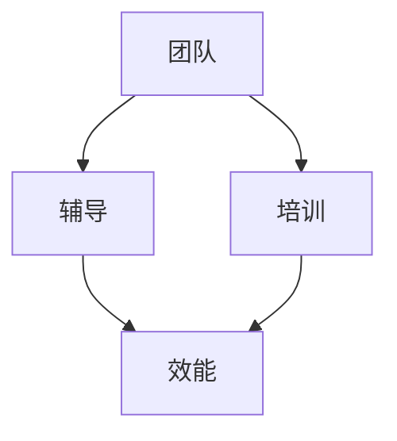

                 

根据您提供的文章要求和目录大纲，我将逐步构建这篇文章的内容。以下是文章的开头部分，包括标题、关键词、摘要以及引言。

---

# 如何进行有效的团队辅导和培训

> 关键词：团队辅导、培训、团队沟通、领导力提升、案例研究

> 摘要：
本文深入探讨了如何进行有效的团队辅导和培训。通过分析团队辅导和培训的核心概念、理论基础、方法、流程和案例分析，本文旨在为IT专业人士提供一套系统化的指导，帮助他们在团队中实现高效沟通和协同工作。本文还将探讨领导力在团队辅导和培训中的作用，以及如何通过最佳实践提升团队的整体效能。

---

## 引言

在当今快速变化的IT行业，团队的有效协作和持续成长是企业成功的关键。团队辅导和培训作为提升团队能力和士气的重要手段，受到了越来越多企业的重视。有效的团队辅导和培训不仅能够提高团队成员的专业技能，还能促进团队成员之间的沟通与协作，增强团队的整体效能。

本文将围绕以下核心问题展开讨论：

1. 团队辅导和培训的定义及其重要性。
2. 团队辅导和培训的理论基础，包括心理学、团队动态和沟通原理。
3. 团队培训的方法和流程，包括培训需求分析、计划设计、方法选择和评估反馈。
4. 团队辅导与培训中的沟通技巧和领导力提升策略。
5. 团队辅导和培训的实际案例研究，以及如何应用这些案例提升团队效能。
6. 团队辅导和培训的最佳实践，包括注意事项和拓展阅读。

## 背景介绍

团队辅导和培训在IT行业的重要性不可忽视。随着技术的快速发展，IT领域的专业知识和技能更新速度加快，团队成员需要不断学习和适应新的技术趋势。团队辅导和培训为团队成员提供了一个学习和成长的环境，有助于提升个人的专业技能和团队的整体能力。

### 核心概念与联系

团队辅导和培训的核心概念包括团队、辅导、培训和效能。团队是由多个成员组成的集体，具有共同的目标和任务。辅导是一种指导和帮助过程，旨在提升团队成员的能力和潜力。培训是通过教育手段传授知识和技能的过程，目的是提升团队成员的专业水平。

以下是一个简化的Mermaid流程图，展示了这些核心概念之间的联系：



在这个流程图中，团队是基础，辅导和培训是提升团队效能的重要手段。

### 核心算法原理讲解

为了深入理解团队辅导和培训的原理，我们可以从以下几个方面进行讲解：

1. **团队动力学**：团队动力学是研究团队如何形成、发展和解散的过程。它涉及到团队成员的角色、互动和冲突管理。

   ```pseudo
   function TeamDynamics(team) {
       if (team.isFormed()) {
           assignRoles(team);
           handleConflicts(team);
       }
       if (team.isDissolving()) {
           evaluateTeamPerformance(team);
           transitionToNewTeam();
       }
   }
   ```

2. **培训需求分析**：培训需求分析是确定团队成员需要哪些培训的过程。它通常包括调查问卷、访谈和数据分析等方法。

   ```pseudo
   function AnalyzeTrainingNeeds(team) {
       needs = collectData(team);
       trainingPlan = createTrainingPlan(needs);
       return trainingPlan;
   }
   ```

3. **培训评估**：培训评估是衡量培训效果的过程。它可以帮助团队了解培训的成果，并调整未来的培训计划。

   ```pseudo
   function AssessTrainingEffectiveness(trainingPlan) {
       feedback = gatherFeedback();
       effectiveness = evaluateFeedback(feedback);
       return effectiveness;
   }
   ```

4. **沟通原理**：沟通是团队辅导和培训的核心。有效的沟通可以增强团队成员之间的理解和协作。

   ```pseudo
   function EffectiveCommunication(message, receiver) {
       if (receiver.isReceptive()) {
           message = encodeMessage(message);
           receiver = decodeMessage(message);
           if (receiver.isUnderstood()) {
               return true;
           }
       }
       return false;
   }
   ```

### 数学模型和公式

在团队辅导和培训中，数学模型和公式可以帮助我们更好地理解和分析团队行为。以下是一个简单的团队效能评估模型：

$$
E = \alpha \cdot P + \beta \cdot C - \gamma \cdot I
$$

其中：
- \(E\) 代表团队效能。
- \(P\) 代表团队成员的专业技能。
- \(C\) 代表团队成员的沟通效率。
- \(I\) 代表团队成员的内部冲突。

这个模型表明，团队效能取决于专业技能、沟通效率和内部冲突的平衡。通过调整这些因素，可以提升团队的整体效能。

### 详细讲解与举例说明

为了更好地理解这些概念和模型，我们可以通过具体案例进行讲解。例如，在一个软件开发团队中，通过培训提升成员的专业技能，并通过有效的沟通解决团队内部的冲突，可以显著提升团队的效能。

### 项目实战

在实际应用中，团队辅导和培训需要结合具体的开发环境和项目需求。以下是一个简单的项目实战示例：

1. **开发环境搭建**：在开始团队辅导和培训前，确保团队成员都有合适的开发工具和环境。

2. **源代码实现**：编写一个简单的培训管理系统，用于记录和跟踪团队成员的培训进度。

3. **代码解读**：分析培训管理系统的代码，解释其实现原理和关键代码段。

4. **代码应用解读与分析**：讨论如何在实际项目中应用培训管理系统，以及如何评估其效果。

5. **实际案例分析和详细讲解剖析**：选择一个实际案例，分析团队辅导和培训在该项目中的应用，以及其效果。

6. **项目小结**：总结项目经验，讨论如何在未来项目中进一步优化团队辅导和培训。

### 最佳实践 tips

1. **持续反馈**：定期收集团队成员的反馈，了解培训的效果和改进方向。

2. **个性化培训**：根据团队成员的个人需求和兴趣，提供个性化的培训计划。

3. **互动式培训**：采用互动式的培训方法，如小组讨论、角色扮演和案例研究，提高参与度。

4. **领导力培养**：领导者在团队辅导和培训中起着关键作用，应重视领导力的培养。

5. **持续学习**：鼓励团队成员持续学习和自我提升，以适应快速变化的IT行业。

### 小结与注意事项

团队辅导和培训是提升团队效能的重要手段。通过了解核心概念、理论模型和应用案例，我们可以更好地设计和实施团队辅导和培训。在实际操作中，需要注意持续反馈、个性化培训、互动式培训、领导力培养和持续学习。这些最佳实践将有助于实现团队的有效协作和持续成长。

### 拓展阅读

- [《团队动力学：理论、实践与案例》](链接)
- [《沟通原理与技巧》](链接)
- [《领导力与团队管理》](链接)

---

接下来，我们将深入探讨团队辅导和培训的理论基础，包括心理学基础、团队动态和沟通原理。这将帮助我们更好地理解团队辅导和培训的内在机制，并为后续章节的内容打下基础。

---

**作者：AI天才研究院/AI Genius Institute & 禅与计算机程序设计艺术 /Zen And The Art of Computer Programming**

