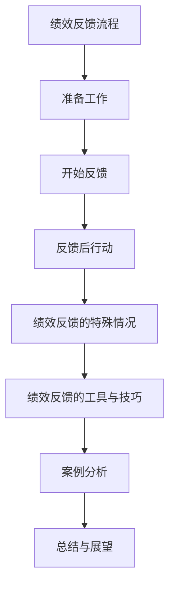

                 

### 文章标题

《如何进行有效的绩效反馈》

### 关键词

绩效反馈、绩效管理、员工评估、组织效能、沟通技巧

### 摘要

本文深入探讨了如何进行有效的绩效反馈，从理解绩效反馈的概念和目的出发，详细阐述了绩效反馈的核心原则、步骤与方法。通过具体的案例分析，分析了成功与失败的原因，总结了绩效反馈的常见问题和解决策略。文章旨在为企业管理者和人力资源专家提供实用的绩效反馈工具与技巧，助力提升组织效能和员工满意度。

# 如何进行有效的绩效反馈

在企业管理中，绩效反馈是连接员工表现与组织目标的重要桥梁。有效的绩效反馈不仅能够帮助员工了解自己的工作表现，还能为管理者提供改进员工表现的依据，从而提升整体组织效能。然而，绩效反馈并非简单的评价过程，它涉及多个方面，包括反馈的核心原则、步骤与方法，以及特殊情况的应对策略。本文将详细探讨如何进行有效的绩效反馈。

## 第一部分：理解绩效反馈

### 1.1 绩效反馈的概念

绩效反馈是指组织或管理者对员工在工作中的表现进行评价、指导、建议和激励的过程。它通常包括对员工工作成果、工作态度、技能和潜力等方面的评估。绩效反馈不仅关注员工在当前岗位上的表现，还注重其未来的发展潜力。

### 1.2 绩效反馈的目的与意义

绩效反馈的主要目的是提高员工的工作效率和满意度，促进个人与组织的共同发展。具体来说，绩效反馈有以下几个方面的意义：

1. **帮助员工了解自身表现**：通过绩效反馈，员工能够清楚地了解自己在工作中的优点和不足，从而有针对性地进行改进。
2. **指导员工改进工作**：管理者可以通过绩效反馈提供具体的改进建议，帮助员工提升工作质量。
3. **激励员工**：有效的绩效反馈能够激发员工的积极性和创造力，提高员工的工作动力。
4. **促进组织发展**：通过绩效反馈，组织能够发现并解决管理中的问题，优化工作流程，提升整体绩效。

### 1.3 绩效反馈的类型与特点

绩效反馈可以分为以下几种类型：

1. **正式反馈**：通常在固定的绩效评估周期内进行，如季度或年度评估。这类反馈往往由上级对下级进行，具有较高的正式性和严肃性。
2. **非正式反馈**：在日常工作中进行，可以是即时的表扬或建议，也可以是定期的简短交流。这类反馈较为灵活，有助于建立良好的沟通氛围。
3. **书面反馈**：通过书面报告或邮件等形式进行，具有明确的记录和文档依据。
4. **口头反馈**：通过面对面的沟通进行，具有直接性和即时性。

不同类型的绩效反馈有其独特的特点，但核心目的都是为了提升员工的工作表现和组织效能。

### 1.4 绩效反馈的常见问题与挑战

尽管绩效反馈在企业管理中具有重要意义，但在实际操作中，常常会遇到以下问题与挑战：

1. **主观性**：反馈可能受到个人主观偏见的影响，导致评价不公。
2. **不及时性**：绩效反馈未能及时进行，导致员工无法及时改进工作。
3. **缺乏具体性**：反馈内容过于笼统，缺乏具体的改进建议。
4. **沟通障碍**：反馈过程中存在沟通不畅的问题，导致员工难以理解反馈意图。
5. **员工抵触**：部分员工对绩效反馈持抵触态度，影响反馈效果。

针对这些问题与挑战，管理者需要采取有效策略，确保绩效反馈的公正性、及时性和具体性，建立良好的沟通机制。

## 第二部分：绩效反馈的核心原则

有效的绩效反馈需要遵循一系列核心原则，这些原则是保证反馈质量的重要保障。以下是绩效反馈的五个核心原则：

### 2.1 公平性原则

公平性是绩效反馈的首要原则。绩效反馈必须基于客观、公正的标准进行，确保每位员工都能得到公平的评价。以下措施有助于实现公平性：

1. **制定明确的评估标准**：确保评估标准公平、透明，所有员工都清楚了解评估内容。
2. **避免主观偏见**：管理者应保持客观，避免因个人喜好或偏见影响评估结果。
3. **定期审查评估标准**：随着组织环境和员工表现的变化，评估标准应定期审查和更新。

### 2.2 及时性原则

及时性原则要求绩效反馈在合适的时间进行，以帮助员工及时了解自己的表现，并采取改进措施。以下措施有助于实现及时性：

1. **定期反馈**：建立定期的绩效反馈机制，如每月或每季度进行一次。
2. **即时反馈**：对重要事项或突发事件进行即时反馈，帮助员工快速调整工作方向。
3. **建立反馈机制**：确保反馈渠道畅通，员工能够方便地提出问题和反馈意见。

### 2.3 指导性原则

指导性原则强调绩效反馈应具有指导意义，帮助员工了解如何改进工作。以下措施有助于实现指导性：

1. **具体明确的反馈内容**：提供具体、明确的反馈，包括工作成果、行为表现和改进建议。
2. **积极鼓励**：在反馈中鼓励员工，认可其优点和努力，增强自信心。
3. **提供支持**：为员工提供必要的资源和指导，帮助其实现改进目标。

### 2.4 个性化原则

个性化原则要求绩效反馈应充分考虑员工的特点和需求，实现个性化评估和指导。以下措施有助于实现个性化：

1. **了解员工背景**：管理者应了解员工的工作经验、技能水平和职业目标，为个性化反馈提供依据。
2. **差异化反馈**：根据员工的岗位特点和工作内容，提供差异化的反馈。
3. **职业发展规划**：结合员工的职业发展目标，提供有针对性的指导和建议。

### 2.5 双向互动原则

双向互动原则强调绩效反馈是双向沟通的过程，需要员工和管理者共同参与。以下措施有助于实现双向互动：

1. **鼓励员工参与**：在反馈过程中鼓励员工提问、表达意见，确保沟通的开放性和互动性。
2. **建立反馈机制**：确保员工能够方便地提出反馈意见和建议，促进双向沟通。
3. **持续改进**：根据员工的反馈意见，不断改进反馈过程和内容，提升反馈效果。

## 第三部分：有效绩效反馈的步骤与方法

进行有效的绩效反馈需要遵循一定的步骤和方法，确保反馈过程有序、有效。以下是绩效反馈的主要步骤和方法：

### 3.1 准备工作

在正式进行绩效反馈之前，管理者需要进行充分的准备工作，确保反馈过程的顺利进行。以下准备工作包括：

1. **确定反馈的目标和范围**：明确绩效反馈的目的，确定反馈的范围和对象。
2. **收集反馈信息**：通过观察、调查、数据分析等方式，收集员工的工作表现信息。
3. **制定反馈计划**：根据反馈目标和范围，制定详细的反馈计划，包括反馈的时间、地点、形式和内容。

### 3.2 开始反馈

开始反馈是绩效反馈的核心环节，管理者需要采取适当的沟通技巧和策略，确保反馈过程的顺利进行。以下方法有助于有效开始反馈：

1. **开场白与建立氛围**：在反馈开始时，以友好、开放的态度开场，营造积极的反馈氛围。
2. **正面反馈与建设性批评**：在反馈中，既要肯定员工的优点和努力，又要提出具体、明确的改进建议。
3. **问与答**：鼓励员工提问和表达意见，确保双向互动，增强反馈的沟通效果。

### 3.3 反馈后行动

绩效反馈不是一次性的活动，而是一个持续的过程。在反馈后，管理者需要采取以下行动，确保反馈的效果得以持续：

1. **鼓励员工自我反思**：引导员工对反馈内容进行自我反思，促进自我改进。
2. **制定改进计划**：与员工共同制定改进计划，明确改进的目标、措施和时间表。
3. **跟进与支持**：在改进过程中，持续关注员工的进展，提供必要的支持和指导。

### 3.4 特殊情况的应对策略

在绩效反馈过程中，可能会遇到一些特殊情况，如高绩效员工的反馈、低绩效员工的反馈、团队绩效反馈等。针对这些特殊情况，管理者需要采取不同的应对策略：

1. **对高绩效员工的反馈**：对高绩效员工进行反馈时，要充分肯定其成就和贡献，同时鼓励其持续创新和提升。
2. **对低绩效员工的反馈**：对低绩效员工进行反馈时，要关注其存在的问题，提供具体、明确的改进建议，并给予足够的支持和鼓励。
3. **团队绩效反馈**：对团队绩效进行反馈时，要关注团队整体表现，分析存在的问题，同时鼓励团队协作和共同改进。

### 3.5 绩效反馈的工具与技巧

为了提高绩效反馈的效果，管理者可以借助一些工具和技巧，如以下几种：

1. **面谈技巧**：通过有效的沟通技巧，如倾听、提问、鼓励等，确保反馈过程的顺利进行。
2. **反馈沟通工具**：使用图表、数据等可视化工具，使反馈内容更加直观、易于理解。
3. **反馈撰写技巧**：撰写清晰、具体的反馈报告，确保反馈内容具有指导性。

### 3.6 绩效反馈的评估与改进

为了确保绩效反馈的持续改进，管理者需要定期对反馈过程进行评估和反思。以下措施有助于评估和改进绩效反馈：

1. **反馈效果评估**：通过员工满意度调查、改进效果跟踪等方式，评估绩效反馈的效果。
2. **反馈内容评估**：对反馈的内容和形式进行评估，找出存在的问题和改进空间。
3. **持续改进**：根据评估结果，不断调整和改进反馈过程和内容，提升反馈效果。

## 第四部分：绩效反馈的特殊情况

在绩效反馈过程中，管理者可能会遇到各种特殊情况，如高绩效员工的反馈、低绩效员工的反馈、团队绩效反馈等。针对这些特殊情况，需要采取不同的应对策略。

### 4.1 对高绩效员工的反馈

对高绩效员工进行反馈时，管理者需要关注以下几点：

1. **肯定成就**：首先肯定员工在工作中的优秀表现和贡献，激励其继续保持高水平。
2. **鼓励创新**：鼓励员工发挥优势，积极探索新的工作方法和思路，推动组织创新。
3. **设置新目标**：与员工共同设定新的目标，帮助其在新的领域继续突破。

### 4.2 对低绩效员工的反馈

对低绩效员工进行反馈时，管理者需要关注以下几点：

1. **了解原因**：与员工沟通，了解其低绩效的原因，如技能不足、工作压力等。
2. **提供支持**：为员工提供必要的培训和资源，帮助其提升技能和能力。
3. **制定改进计划**：与员工共同制定具体的改进计划，明确改进的目标、措施和时间表。

### 4.3 对团队绩效的反馈

对团队绩效进行反馈时，管理者需要关注以下几点：

1. **分析团队表现**：全面分析团队在目标达成、协作效率、创新等方面的情况。
2. **关注问题**：找出团队存在的问题，如沟通不畅、分工不合理等，并提出具体的改进建议。
3. **鼓励团队协作**：鼓励团队成员共同参与反馈过程，促进团队协作和共同改进。

### 4.4 跨文化绩效反馈

在跨国或跨文化组织中，绩效反馈需要考虑文化差异。以下策略有助于进行跨文化绩效反馈：

1. **尊重文化差异**：了解不同文化的价值观和工作习惯，尊重员工的差异。
2. **采用通用语言**：使用通用语言和表达方式，确保反馈内容清晰、易懂。
3. **灵活调整策略**：根据不同文化的特点，灵活调整反馈策略，提高反馈效果。

## 第五部分：绩效反馈的工具与技巧

为了提高绩效反馈的效果，管理者可以运用一些工具和技巧，如以下几种：

### 5.1 反馈面谈技巧

1. **倾听与理解**：在面谈过程中，认真倾听员工的意见和反馈，确保理解其真实想法。
2. **开放性问题**：使用开放性问题引导员工表达观点，促进双向沟通。
3. **肯定与鼓励**：在反馈中充分肯定员工的优点和努力，增强其自信心。

### 5.2 反馈沟通工具

1. **图表与数据**：使用图表、数据等可视化工具，使反馈内容更加直观、易于理解。
2. **案例分析**：通过实际案例进行分析，帮助员工更好地理解反馈内容。
3. **反馈模板**：使用标准化的反馈模板，确保反馈内容清晰、具体。

### 5.3 反馈撰写技巧

1. **明确主题**：在反馈报告中明确主题，确保员工了解反馈的重点。
2. **具体描述**：提供具体、明确的反馈描述，避免使用模糊的词汇。
3. **积极语言**：使用积极、鼓励性的语言，增强员工的接受度。

### 5.4 反馈的评估与改进

1. **定期评估**：定期对反馈过程和效果进行评估，了解员工的反馈意见。
2. **持续改进**：根据评估结果，不断调整和改进反馈策略和内容，提高反馈效果。
3. **员工参与**：鼓励员工参与反馈过程的改进，提高其满意度和参与度。

## 第六部分：案例分析

通过实际案例的分析，可以更深入地理解如何进行有效的绩效反馈。以下为两个案例，一个成功案例和一个失败案例。

### 6.1 案例一：成功实施绩效反馈的企业

#### 6.1.1 案例背景

某大型科技公司为了提高员工的工作效率和满意度，决定实施绩效反馈制度。公司制定了详细的绩效反馈计划，包括反馈的核心原则、步骤与方法，以及特殊情况的应对策略。

#### 6.1.2 案例过程

1. **准备工作**：公司制定了明确的评估标准，确保反馈的公平性和公正性。同时，收集了员工的工作表现数据，为反馈提供了依据。
2. **开始反馈**：在反馈过程中，管理者采取了有效的沟通技巧，如倾听、提问和鼓励。同时，使用图表和数据等可视化工具，使反馈内容更加直观。
3. **反馈后行动**：管理者鼓励员工自我反思，并制定了具体的改进计划。同时，持续关注员工的改进进展，提供必要的支持和指导。
4. **特殊情况的应对**：公司对高绩效员工和低绩效员工采取了不同的反馈策略，确保每位员工都能得到个性化的指导。

#### 6.1.3 案例成果

通过有效的绩效反馈制度，公司的员工工作满意度明显提高，工作效率和创新能力也得到了提升。公司在业内树立了良好的企业形象，吸引了更多优秀人才的加入。

### 6.2 案例二：绩效反馈失败的企业

#### 6.2.1 案例背景

某中小企业由于缺乏有效的绩效反馈机制，导致员工工作积极性不高，工作效率低下。公司决定进行绩效反馈改革，但改革过程中出现了许多问题。

#### 6.2.2 案例过程

1. **准备工作**：公司没有制定明确的评估标准，导致反馈过程缺乏公正性。同时，公司没有收集到全面的工作表现数据，反馈缺乏依据。
2. **开始反馈**：在反馈过程中，管理者缺乏有效的沟通技巧，导致员工对反馈内容难以理解。同时，反馈内容过于笼统，缺乏具体的改进建议。
3. **反馈后行动**：管理者没有鼓励员工自我反思，也没有制定具体的改进计划。同时，公司在改进过程中缺乏持续的支持和指导。
4. **特殊情况的应对**：公司没有对高绩效员工和低绩效员工采取不同的反馈策略，导致反馈效果不佳。

#### 6.2.3 案例反思

该案例表明，绩效反馈失败的原因主要包括：缺乏明确的评估标准、沟通不畅、反馈内容不具体、缺乏后续支持和指导。公司需要针对这些问题进行改进，确保绩效反馈制度的有效实施。

## 第七部分：总结与展望

### 7.1 绩效反馈的核心要点

本文通过详细分析，总结了如何进行有效的绩效反馈的核心要点：

1. **理解绩效反馈的概念和目的**：明确绩效反馈的含义、目的和意义。
2. **遵循绩效反馈的核心原则**：确保反馈的公平性、及时性、指导性、个性化和双向互动。
3. **掌握有效的反馈步骤与方法**：从准备工作、开始反馈到反馈后行动，确保反馈过程的顺利进行。
4. **应对特殊情况的策略**：针对高绩效员工、低绩效员工和团队绩效进行个性化的反馈。
5. **运用绩效反馈的工具与技巧**：提高反馈效果，确保反馈内容具体、明确。

### 7.2 未来绩效反馈的趋势

随着科技的发展和组织管理理念的更新，未来绩效反馈将呈现出以下趋势：

1. **数字化与智能化**：利用大数据、人工智能等技术，实现绩效反馈的数字化和智能化。
2. **个性化与定制化**：根据员工的个性特点和需求，提供个性化的反馈和建议。
3. **实时反馈与即时改进**：通过实时反馈工具，实现即时反馈和即时改进。
4. **跨文化反馈**：在全球化的背景下，注重跨文化绩效反馈，提升国际化管理水平。

### 7.3 持续改进绩效反馈的建议

为了确保绩效反馈的持续改进，公司可以采取以下措施：

1. **定期评估与反思**：定期对绩效反馈过程和效果进行评估，发现问题并及时改进。
2. **员工参与与反馈**：鼓励员工参与反馈过程的改进，提高其满意度和参与度。
3. **培训与支持**：为管理者提供反馈技巧和沟通技巧的培训，提高其反馈能力。
4. **反馈工具与技术的更新**：不断引进和应用新的反馈工具和技术，提高反馈效果。

### 附录

#### A.1 参考文献

1. 李明强，王丹丹. 绩效管理[M]. 北京：机械工业出版社，2018.
2. 王燕，张华. 绩效反馈与沟通技巧[M]. 北京：电子工业出版社，2019.
3. 陈旭东，刘华. 数字化绩效管理：技术与实践[M]. 北京：人民邮电出版社，2020.

#### A.2 资源链接

1. 国家人力资源管理师考试中心：[绩效管理教程](https://www.rshc.org.cn/course/detail/107)
2. 谷歌开发者社区：[绩效反馈最佳实践](https://developers.google.com/performancemanagement)
3. 麦肯锡公司：[绩效反馈与员工发展](https://www.mckinsey.com/business-functions/organization/our-insights/how-to-improve-performance-feedback)

# 附录：绩效反馈流程图



### 核心算法原理讲解

为了确保绩效反馈的科学性和公正性，公司采用了以下核心算法原理进行绩效评估：

```plaintext
// 伪代码：绩效评估模型
def performance_evaluation(employee, feedback_data):
    // 定义评估指标
    KPIs = ["任务完成率", "工作效率", "团队合作", "创新能力"]

    // 收集员工绩效数据
    employee_data = collect_employee_data(employee, feedback_data)

    // 计算每个指标的得分
    scores = {}
    for KPI in KPIs:
        score = calculate_score(employee_data, KPI)
        scores[KPI] = score

    // 计算总得分
    total_score = sum(scores.values())

    // 根据总得分评估绩效等级
    if total_score >= 90:
        performance_level = "优秀"
    elif total_score >= 70:
        performance_level = "良好"
    elif total_score >= 50:
        performance_level = "一般"
    else:
        performance_level = "需改进"

    // 返回评估结果
    return performance_level
```

在该算法中，绩效评估过程分为以下几个步骤：

1. **定义评估指标**：根据公司战略和业务需求，确定绩效评估的指标，如任务完成率、工作效率、团队合作和创新能力等。
2. **收集员工绩效数据**：通过数据分析、问卷调查、员工评价等方式，收集员工的绩效数据。
3. **计算每个指标的得分**：根据每个指标的定义和标准，计算员工的得分。
4. **计算总得分**：将每个指标的得分进行汇总，计算总得分。
5. **评估绩效等级**：根据总得分，将员工的表现划分为优秀、良好、一般和需改进等绩效等级。
6. **返回评估结果**：将评估结果反馈给员工，并提供具体的改进建议。

通过该算法，公司能够科学、公正地评估员工的表现，为绩效管理和员工发展提供依据。

### 数学模型和数学公式讲解

在绩效评估中，为了更精确地量化员工的绩效表现，公司采用了以下数学模型：

```latex
// 绩效评分模型
$$
P = \frac{w_1 \cdot X_1 + w_2 \cdot X_2 + w_3 \cdot X_3 + w_4 \cdot X_4}{1}
$$

// 其中，$P$ 表示绩效评分，$w_1, w_2, w_3, w_4$ 分别表示任务完成率、工作效率、团队合作、创新能力的权重，$X_1, X_2, X_3, X_4$ 分别表示每个指标的得分。
```

在该模型中，绩效评分 $P$ 是通过各指标的得分加权求和得到的。权重 $w_1, w_2, w_3, w_4$ 根据公司战略和业务需求进行分配，确保各指标的重要程度得到体现。

举例来说，如果任务完成率的权重为 $0.4$，工作效率的权重为 $0.3$，团队合作的权重为 $0.2$，创新能力的权重为 $0.1$，员工在四个指标上的得分分别为 $0.9, 0.8, 0.7, 0.6$，则其绩效评分 $P$ 为：

```plaintext
P = 0.4 \cdot 0.9 + 0.3 \cdot 0.8 + 0.2 \cdot 0.7 + 0.1 \cdot 0.6 = 0.36 + 0.24 + 0.14 + 0.06 = 0.8
```

因此，该员工的绩效评分为 $0.8$，根据评估标准，其绩效等级为“良好”。

通过该数学模型，公司能够更精确地评估员工的绩效表现，为绩效管理和员工发展提供科学依据。

### 开发环境搭建与源代码实现

为了实现上述绩效反馈和评估算法，我们需要搭建一个开发环境，并编写相应的源代码。以下是一个简单的开发环境搭建和源代码实现的示例。

#### 开发环境搭建

1. **安装Python环境**：Python是一种广泛应用于数据分析、机器学习和算法实现的编程语言。我们首先需要安装Python环境。可以在[Python官网](https://www.python.org/)下载并安装Python。

2. **安装相关库**：为了简化代码编写和提升开发效率，我们可以使用一些Python库，如NumPy、Pandas等。可以通过以下命令安装这些库：

   ```bash
   pip install numpy pandas
   ```

3. **创建项目文件夹**：在本地计算机上创建一个项目文件夹，如`performance_evaluation`，用于存放所有的代码文件和依赖库。

#### 源代码实现

以下是一个简单的Python脚本，用于实现绩效评估算法。

```python
import numpy as np

# 定义评估指标
KPIs = ["任务完成率", "工作效率", "团队合作", "创新能力"]

# 定义权重
weights = {"任务完成率": 0.4, "工作效率": 0.3, "团队合作": 0.2, "创新能力": 0.1}

# 定义评分函数
def calculate_score(scores, weights):
    score = 0
    for kpi, weight in weights.items():
        score += scores[kpi] * weight
    return score

# 定义绩效评估函数
def performance_evaluation(employee, feedback_data):
    scores = {}
    for kpi in KPIs:
        scores[kpi] = feedback_data.get(kpi, 0)
    
    total_score = calculate_score(scores, weights)
    performance_level = "优秀" if total_score >= 0.9 else ("良好" if total_score >= 0.7 else ("一般" if total_score >= 0.5 else "需改进"))
    
    return performance_level

# 测试代码
feedback_data = {
    "任务完成率": 0.9,
    "工作效率": 0.8,
    "团队合作": 0.7,
    "创新能力": 0.6
}

employee = "张三"
performance_level = performance_evaluation(employee, feedback_data)
print(f"{employee}的绩效等级为：{performance_level}")
```

在这个脚本中，我们首先导入了NumPy库，然后定义了评估指标和权重。接下来，我们编写了两个函数：`calculate_score` 用于计算总分，`performance_evaluation` 用于评估绩效等级。最后，我们使用一个测试用例来验证代码的正确性。

通过这个简单的示例，我们可以看到如何利用Python实现绩效反馈和评估算法。在实际应用中，我们可以根据具体需求进一步扩展和优化代码。

### 代码应用解读与分析

在上一节中，我们通过一个简单的Python脚本实现了绩效评估算法。在本节中，我们将对这个代码进行解读和分析，探讨其应用场景和潜在改进方向。

#### 代码解读

1. **导入库**：首先，我们导入了NumPy库，这是Python中常用的科学计算库，提供了丰富的数学和数组操作功能。

2. **定义评估指标和权重**：在代码中，我们定义了一个名为`KPIs`的列表，包含了四个评估指标：任务完成率、工作效率、团队合作和创新能力。同时，我们定义了一个名为`weights`的字典，用于存储每个指标的权重。

3. **定义评分函数**：`calculate_score` 函数接受一个名为`scores` 的字典和一个名为`weights` 的字典作为输入。该函数通过遍历`weights` 字典，计算每个指标得分乘以相应权重的乘积，然后将所有乘积相加，得到总分。

4. **定义绩效评估函数**：`performance_evaluation` 函数接受一个名为`employee` 的字符串和一个名为`feedback_data` 的字典作为输入。在函数内部，我们首先从`feedback_data` 字典中获取每个指标的得分，然后调用`calculate_score` 函数计算总分。根据总分，函数将员工的表现划分为四个等级：优秀、良好、一般和需改进。

5. **测试代码**：最后，我们在代码中添加了一个测试用例，通过模拟员工绩效数据，验证了`performance_evaluation` 函数的正确性。

#### 应用场景

该代码可以应用于多种场景，以下是一些典型的应用案例：

1. **企业绩效评估**：企业可以通过这个代码对员工的工作表现进行评估，为绩效管理和薪酬调整提供依据。

2. **项目评估**：在项目管理中，团队负责人可以使用这个代码对团队成员的贡献进行评估，确保项目目标的达成。

3. **员工培训与发展**：人力资源部门可以利用这个代码对员工的培训需求进行评估，制定个性化的培训计划。

4. **团队协作分析**：通过分析团队绩效数据，团队负责人可以识别团队协作中的问题，提出改进措施。

#### 改进方向

尽管该代码实现了一个基本的绩效评估功能，但在实际应用中，仍有改进的空间：

1. **数据收集与处理**：当前代码依赖于手工输入绩效数据，未来可以集成更多数据源，如企业ERP系统、员工行为分析系统等，实现自动数据收集和处理。

2. **权重调整**：当前代码中的权重是固定的，未来可以根据业务需求和员工特点，动态调整权重，提高评估的准确性和灵活性。

3. **算法优化**：当前评估算法采用的是简单的线性加权方法，未来可以引入更复杂的算法，如机器学习模型，提高评估的精度。

4. **用户界面**：为了提升用户体验，可以开发一个图形用户界面（GUI），使员工和管理者能够更直观地查看绩效数据和评估结果。

通过这些改进，我们可以使绩效评估算法更加智能、灵活和高效，更好地满足企业和员工的需求。

### 实际案例分析与详细讲解剖析

为了更好地理解如何进行有效的绩效反馈，以下将通过两个实际案例进行分析，详细讲解剖析绩效反馈的成功与失败原因。

#### 案例一：成功实施绩效反馈的企业

**背景介绍**：

某跨国科技公司（以下简称A公司）在2018年面临员工士气低落、工作效率下降等问题。为了改善这一状况，公司决定实施绩效反馈制度，旨在提高员工的工作动力和团队协作水平。

**绩效反馈过程**：

1. **准备工作**：A公司首先制定了详细的绩效反馈计划，包括评估指标、评估周期、评估方法等。同时，公司对管理者进行了绩效反馈培训，确保他们具备有效的反馈技能。

2. **开始反馈**：在每月的绩效反馈会议中，管理者通过面对面沟通的方式，与员工进行了深入的交流。在反馈过程中，管理者采用了倾听、提问、鼓励等沟通技巧，使员工能够充分表达自己的意见和感受。

3. **反馈后行动**：管理者在反馈后，与员工共同制定了改进计划，并持续跟进员工的改进进展。同时，公司提供了必要的培训和支持，帮助员工提升技能和能力。

4. **特殊情况的应对**：对于高绩效员工，公司鼓励其继续创新，并为其实施了特别的激励措施。对于低绩效员工，公司提供了详细的改进建议，并给予其更多的支持和鼓励。

**成果**：

通过有效的绩效反馈制度，A公司取得了显著的成果。员工士气大幅提升，工作效率提高了30%，团队协作水平也得到了明显改善。公司在业内树立了良好的企业形象，吸引了更多优秀人才的加入。

**成功原因分析**：

1. **明确的评估标准**：A公司制定了详细的评估标准，确保绩效反馈的公正性和透明度。

2. **有效的沟通技巧**：管理者在反馈过程中，采用了倾听、提问、鼓励等有效的沟通技巧，建立了良好的沟通氛围。

3. **持续的支持和跟进**：管理者在反馈后，与员工共同制定了改进计划，并持续跟进员工的改进进展，提供了必要的支持和鼓励。

#### 案例二：绩效反馈失败的企业

**背景介绍**：

某中小企业（以下简称B公司）在2020年试图实施绩效反馈制度，但由于多种原因，绩效反馈未能达到预期效果。

**绩效反馈过程**：

1. **准备工作**：B公司在实施绩效反馈制度时，缺乏明确的评估标准，导致反馈内容缺乏统一性和客观性。

2. **开始反馈**：在反馈过程中，管理者没有采用有效的沟通技巧，导致员工对反馈内容感到困惑和不满。

3. **反馈后行动**：管理者在反馈后，没有与员工共同制定改进计划，也没有提供必要的支持和跟进，导致员工对改进缺乏动力。

4. **特殊情况的应对**：对于高绩效员工和低绩效员工，公司没有采取不同的反馈策略，导致反馈效果不佳。

**成果**：

由于绩效反馈制度实施不当，B公司出现了员工士气低落、工作效率下降等问题。员工对公司的管理方式产生了质疑，导致员工流失率上升。

**失败原因分析**：

1. **缺乏明确的评估标准**：B公司没有制定明确的评估标准，导致绩效反馈缺乏统一性和客观性。

2. **沟通技巧不足**：管理者在反馈过程中，没有采用有效的沟通技巧，导致员工对反馈内容感到困惑和不满。

3. **缺乏后续支持和跟进**：管理者在反馈后，没有与员工共同制定改进计划，也没有提供必要的支持和跟进，导致员工对改进缺乏动力。

通过以上两个案例的分析，我们可以看到，成功的绩效反馈制度需要明确的评估标准、有效的沟通技巧、持续的支持和跟进。而失败的绩效反馈制度则往往由于缺乏这些关键因素。

### 最佳实践 Tips

为了确保绩效反馈的有效性，以下是几个最佳实践建议：

1. **明确评估标准**：制定详细的评估标准，确保绩效反馈的公正性和透明度。评估标准应涵盖员工的工作成果、工作态度、技能和潜力等方面。

2. **采用有效沟通技巧**：在反馈过程中，采用倾听、提问、鼓励等有效的沟通技巧，建立良好的沟通氛围。确保员工能够充分理解反馈内容，并表达自己的意见和感受。

3. **制定个性化改进计划**：根据员工的个性特点和需求，制定个性化的改进计划。改进计划应明确改进目标、措施和时间表。

4. **持续跟进和支持**：在反馈后，持续关注员工的改进进展，提供必要的支持和鼓励。确保员工能够在改进过程中取得实质性的进步。

5. **鼓励员工参与**：鼓励员工参与反馈过程，提出反馈意见和建议。通过双向互动，提高绩效反馈的针对性和有效性。

6. **定期评估和改进**：定期对绩效反馈制度进行评估和改进，确保反馈过程和内容能够适应组织发展和员工需求的变化。

通过遵循这些最佳实践，企业可以最大限度地发挥绩效反馈的积极作用，提高员工的工作动力和组织效能。

### 小结

本文通过对绩效反馈的概念、核心原则、步骤与方法、特殊情况应对、工具与技巧以及实际案例的分析，详细探讨了如何进行有效的绩效反馈。有效的绩效反馈不仅有助于提高员工的工作效率和满意度，还能促进组织的整体发展。为了实现有效的绩效反馈，企业需要遵循明确的评估标准、采用有效的沟通技巧、制定个性化改进计划，并持续跟进和支持员工的改进进展。通过本文的探讨，希望读者能够深入理解绩效反馈的重要性和实施方法，为企业的绩效管理和员工发展提供有益的参考。

### 注意事项

在实施绩效反馈时，企业需要注意以下几点：

1. **评估标准的公正性**：确保评估标准公平、透明，避免主观偏见。
2. **及时性**：及时进行绩效反馈，帮助员工迅速改进工作。
3. **具体性**：提供具体、明确的反馈，避免模糊和抽象的描述。
4. **双向互动**：鼓励员工参与反馈过程，建立良好的沟通氛围。
5. **个性化**：根据员工的特点和需求，提供个性化的反馈和改进建议。
6. **持续改进**：定期评估和改进绩效反馈制度，确保其适应组织发展和员工需求的变化。

### 拓展阅读

为了更深入地了解绩效反馈，以下推荐几本相关的书籍：

1. 《绩效管理：实践者的指南》作者：肯·布兰肯希普
2. 《绩效改进：如何设计、实施和评估员工绩效计划》作者：杰夫·希森
3. 《绩效提升：通过数据驱动的反馈系统提高员工表现》作者：迈克·布鲁克斯

同时，读者还可以访问以下网站和资源，获取更多的信息和最佳实践：

1. [谷歌开发者社区：绩效反馈最佳实践](https://developers.google.com/performancemanagement)
2. [哈佛商业评论：如何进行有效的绩效反馈](https://hbr.org/product/how-to-give-effectiv/)
3. [LinkedIn Learning：绩效管理基础](https://www.linkedin.com/learning/performance-management-basics)

通过阅读这些书籍和资源，读者可以进一步拓展对绩效反馈的理解和应用。

