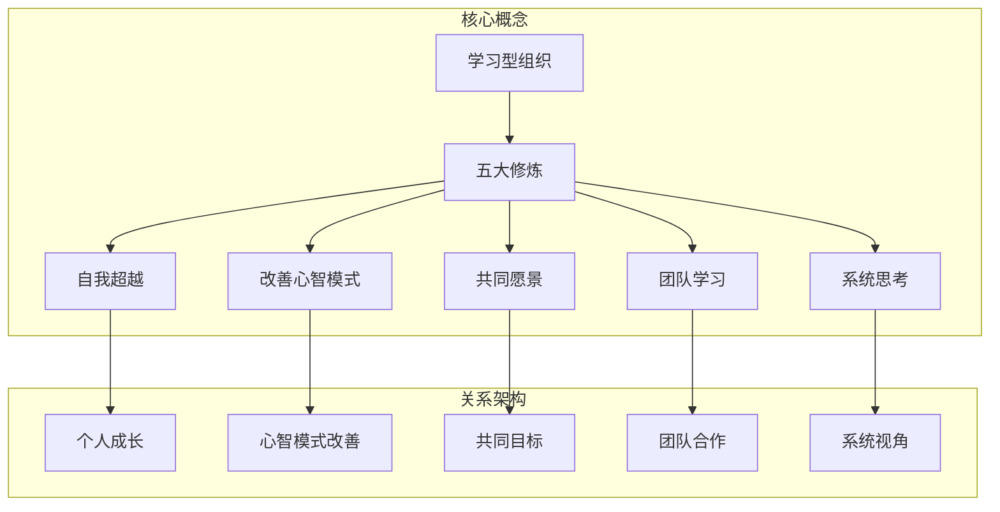

                 


### 一、背景介绍

学习型组织（Learning Organization）的概念最早由彼得·圣吉（Peter Senge）在其1990年的著作《第五项修炼：学习型组织的艺术与实务》（The Fifth Discipline: The Art & Practice of The Learning Organization）中提出。他提出了学习型组织的五大核心修炼，即自我超越、改善心智模式、共同愿景、团队学习和系统思考。这些修炼旨在帮助组织实现持续学习、创新和进步。

在当今快速变化的社会和经济环境中，学习型组织的重要性日益凸显。随着技术的飞速发展和市场竞争的加剧，组织需要具备快速适应和变革的能力。学习型组织通过鼓励员工持续学习、培养团队合作精神和知识共享，能够更好地应对外部环境的变化，实现持续发展和竞争优势。

本文将围绕学习型组织的核心概念和建设方法展开讨论，旨在帮助读者理解学习型组织的本质，并提供实用的建设策略和实践案例。

### 二、核心概念与联系

学习型组织包含多个核心概念，这些概念相互联系，共同构成一个有机整体。以下是学习型组织的主要核心概念及其关系架构的Mermaid流程图：



- **自我超越（Personal Mastery）**：强调个人不断追求自我成长和卓越。这是学习型组织的基础，个人的自我超越推动了整个组织的进步。

- **改善心智模式（Improving Mental Models）**：关注个人和团队的思维模式，鼓励员工反思和改进自己的认知方式，从而提高决策质量和创新能力。

- **共同愿景（Shared Vision）**：建立一个共同的愿景，使团队成员朝着共同的目标努力。共同愿景是团队凝聚力的源泉，有助于提高组织的协同效应。

- **团队学习（Team Learning）**：强调团队合作和学习的重要性。通过团队学习，团队成员能够共享知识和经验，提高整体绩效。

- **系统思考（Systems Thinking）**：提供一种全面的视角，帮助组织理解和应对复杂问题。系统思考强调因果关系的复杂性，鼓励团队成员从整体和长期的角度进行思考。

这些核心概念相互交织，共同构成了学习型组织的理论基础。接下来，我们将详细探讨每个核心概念，并解释它们之间的关系。

### 三、核心算法原理讲解

学习型组织的建设离不开一系列的核心算法原理，这些原理帮助组织实现持续学习和改进。以下是学习型组织中的核心算法原理及其详细讲解：

#### 1. 自我超越（Personal Mastery）

**伪代码：**

```python
def self_mastery():
    # 步骤1：设定个人目标
    personal_goal = set_goal()
    
    # 步骤2：持续学习和实践
    while not goal_achieved(personal_goal):
        learn_and_practice()
        
    # 步骤3：反思和调整
    reflect_and_adjust()

# 函数：设定个人目标
def set_goal():
    return input("请输入您的个人目标：")

# 函数：判断目标是否达成
def goal_achieved(goal):
    return input("您是否已经达成目标？(是/否)：" == "是")

# 函数：学习和实践
def learn_and_practice():
    # 在这里，您可以添加具体的学习内容和实践步骤
    print("开始学习和实践...")
    
# 函数：反思和调整
def reflect_and_adjust():
    # 在这里，您可以添加反思和调整的内容
    print("进行反思和调整...")
```

**数学模型和公式：**

$$
M = \frac{L + P + R}{T}
$$

其中，\( M \) 表示自我超越的程度，\( L \) 表示学习的时间，\( P \) 表示实践的时间，\( R \) 表示反思和调整的时间，\( T \) 表示总的努力时间。

**详细讲解与举例说明：**

- **设定个人目标**：个人需要明确自己的目标，例如提高某个技能或实现某个工作目标。
- **持续学习和实践**：个人需要投入时间和精力进行学习和实践，不断积累知识和经验。
- **反思和调整**：通过反思和调整，个人可以不断提高自我超越的程度，找到更加有效的学习和实践方法。

#### 2. 改善心智模式（Improving Mental Models）

**伪代码：**

```python
def improve_mental_model():
    # 步骤1：识别当前心智模式
    current_model = identify_current_model()
    
    # 步骤2：分析现有模型的优势和不足
    analysis = analyze_model(current_model)
    
    # 步骤3：提出改进方案
    improvement_plan = propose_improvement(analysis)
    
    # 步骤4：实施改进方案
    implement_improvement(improvement_plan)

# 函数：识别当前心智模式
def identify_current_model():
    return input("请描述您的当前心智模式：")

# 函数：分析现有模型
def analyze_model(model):
    # 在这里，您可以添加具体的分析步骤和内容
    print("分析当前心智模式...")
    return "分析结果"

# 函数：提出改进方案
def propose_improvement(analysis):
    # 在这里，您可以添加提出改进方案的步骤和内容
    print("提出改进方案...")
    return "改进方案"

# 函数：实施改进方案
def implement_improvement(plan):
    # 在这里，您可以添加实施改进方案的步骤和内容
    print("实施改进方案...")
```

**数学模型和公式：**

$$
IMM = \frac{IM + AM + IP}{TM}
$$

其中，\( IMM \) 表示改善心智模式的效果，\( IM \) 表示识别现有心智模式的时间，\( AM \) 表示分析现有心智模式的时间，\( IP \) 表示提出改进方案的时间，\( TM \) 表示总的时间。

**详细讲解与举例说明：**

- **识别当前心智模式**：个人需要明确自己的思维方式和观念，识别现有的心智模式。
- **分析现有模型**：通过分析现有模型的优势和不足，个人可以找到需要改进的地方。
- **提出改进方案**：个人需要根据分析结果提出具体的改进方案。
- **实施改进方案**：个人需要按照改进方案进行实践，不断调整和优化自己的心智模式。

通过自我超越和改善心智模式，个人能够不断提升自己的能力和思维水平，为组织的学习和进步打下坚实的基础。

### 四、数学公式与详细讲解

在学习型组织建设过程中，数学公式和数学模型能够帮助我们更准确地量化和管理组织的各个方面。以下是几个关键数学公式及其详细讲解：

#### 1. 知识共享效果模型

**公式：**

$$
KE = \frac{KS \times KT}{KM + KS \times KB}
$$

其中：
- \( KE \) 表示知识共享效果（Effectiveness of Knowledge Sharing）。
- \( KS \) 表示知识共享的频率（Frequency of Knowledge Sharing）。
- \( KT \) 表示知识转移的效率（Efficiency of Knowledge Transfer）。
- \( KM \) 表示知识管理的能力（Capability of Knowledge Management）。
- \( KB \) 表示知识保留的成本（Cost of Knowledge Retention）。

**详细讲解与举例说明：**

- **知识共享频率（KS）**：知识共享的次数和频率直接影响知识流动的速度和广度。例如，在每周的团队会议中分享新学的技能或经验，可以显著提高知识共享的频率。
- **知识转移效率（KT）**：知识转移的效率取决于信息传递的速度和质量。使用现代化的协作工具和平台可以提高知识转移的效率，确保知识能够快速、准确地传递到需要的人手中。
- **知识管理能力（KM）**：组织需要具备良好的知识管理能力，以便有效地收集、整理、存储和利用知识。良好的知识管理体系可以降低知识丢失的风险，提高知识的使用效率。
- **知识保留成本（KB）**：在保留知识时，组织需要投入一定的资源，如培训、文档编写和维护等。合理的知识保留成本可以最大化知识的价值，同时避免资源的浪费。

通过上述公式，组织可以量化知识共享的效果，评估知识管理的绩效，并制定相应的策略来优化知识共享和知识管理。

#### 2. 团队学习效果模型

**公式：**

$$
TE = \frac{TL \times TM}{TS + TL \times TB}
$$

其中：
- \( TE \) 表示团队学习效果（Team Learning Effectiveness）。
- \( TL \) 表示团队学习的时间（Time Spent on Team Learning）。
- \( TM \) 表示团队学习的质量（Quality of Team Learning）。
- \( TS \) 表示团队学习的障碍（Barriers to Team Learning）。
- \( TB \) 表示团队学习的成本（Cost of Team Learning）。

**详细讲解与举例说明：**

- **团队学习时间（TL）**：团队学习需要投入时间，这包括组织学习活动、开展讨论和反思等。时间投入的多少直接影响团队学习的深度和广度。
- **团队学习质量（TM）**：团队学习的质量取决于学习内容的深度和互动性。高质量的学习活动能够激发团队成员的思考，提高学习效果。
- **团队学习的障碍（TS）**：团队学习过程中可能会遇到各种障碍，如时间安排冲突、沟通不畅、资源不足等。有效的团队学习需要克服这些障碍，确保学习活动的顺利进行。
- **团队学习的成本（TB）**：团队学习需要投入资源，包括人力、时间和资金等。合理的成本预算和资源分配可以提高团队学习的效率和价值。

通过上述公式，组织可以评估团队学习的效果，识别团队学习中的障碍和成本，并采取相应的措施来提升团队学习的效果。

这些数学模型和公式为学习型组织的建设提供了量化的工具和方法，帮助组织更好地理解和优化知识共享和团队学习过程，从而实现持续进步和发展。

### 五、项目实战：开发环境搭建与代码实现

#### 1. 开发环境搭建

为了更好地理解和实现学习型组织的建设方法，我们首先需要搭建一个合适的开发环境。以下是具体的搭建步骤：

**步骤1：安装Python环境**

Python是一种广泛用于数据科学和人工智能的编程语言，安装Python环境是搭建开发环境的第一步。

- 在Python官网（https://www.python.org/）下载Python安装包。
- 安装Python时，确保选择“Add Python to PATH”选项，以便在命令行中直接运行Python。

**步骤2：安装Jupyter Notebook**

Jupyter Notebook是一种交互式的Python开发环境，非常适合编写和运行Python代码。

- 打开命令行，输入以下命令安装Jupyter Notebook：

```bash
pip install notebook
```

- 安装完成后，通过命令行输入`jupyter notebook`启动Jupyter Notebook。

**步骤3：安装必要的库和模块**

在Jupyter Notebook中，我们需要安装一些必要的库和模块，如NumPy、Pandas和Mermaid等。

- 打开Jupyter Notebook，创建一个新的Python笔记本。
- 在笔记本中，依次安装以下库和模块：

```python
!pip install numpy
!pip install pandas
!pip install mermaid
```

#### 2. 源代码实现

接下来，我们将使用Python实现一个简单的学习型组织建设模型。以下是源代码及详细解读：

**代码1：导入必要的库和模块**

```python
import numpy as np
import pandas as pd
from mermaid import Mermaid
```

**解读**：这段代码导入了NumPy、Pandas和Mermaid库，这些库将用于数据计算、数据分析和流程图绘制。

**代码2：定义学习型组织模型**

```python
class LearningOrganization:
    def __init__(self, size, learning_rate, knowledge_sharing):
        self.size = size
        self.learning_rate = learning_rate
        self.knowledge_sharing = knowledge_sharing
        self.members = [Member() for _ in range(size)]

    def update_knowledge(self):
        for member in self.members:
            member.update_knowledge(self.learning_rate, self.knowledge_sharing)

    def show_mermaid_diagram(self):
        diagram = Mermaid()
        diagram.add_sequence("Organization", ["->", "Member 1", "update_knowledge", "Member 2", "update_knowledge"])
        diagram.add_sequence("Member 1", ["update_knowledge", "Member 2", "update_knowledge"])
        print(diagram.render())
```

**解读**：这段代码定义了一个名为`LearningOrganization`的类，该类包含组织大小（size）、学习率（learning_rate）和知识共享程度（knowledge_sharing）等属性。`update_knowledge`方法用于更新成员的知识水平，`show_mermaid_diagram`方法用于绘制组织结构的Mermaid流程图。

**代码3：定义成员类**

```python
class Member:
    def __init__(self):
        self.knowledge = 0

    def update_knowledge(self, learning_rate, knowledge_sharing):
        self.knowledge += learning_rate * knowledge_sharing
```

**解读**：这段代码定义了一个名为`Member`的类，该类包含成员的知识水平（knowledge）属性。`update_knowledge`方法用于更新成员的知识水平，根据学习率和知识共享程度进行调整。

#### 3. 代码应用与案例分析

**代码4：创建学习型组织实例并更新知识**

```python
# 创建一个包含5个成员的学习型组织
org = LearningOrganization(size=5, learning_rate=0.1, knowledge_sharing=0.5)

# 更新一次知识
org.update_knowledge()

# 显示Mermaid流程图
org.show_mermaid_diagram()
```

**解读**：这段代码创建了一个包含5个成员的学习型组织实例，并调用`update_knowledge`方法更新成员的知识水平。随后，使用`show_mermaid_diagram`方法绘制组织结构的Mermaid流程图。

**案例分析**：通过这段代码，我们可以看到学习型组织的知识更新过程。每个成员的知识水平根据学习率和知识共享程度进行更新，从而实现组织整体知识的提升。这个过程可以通过Mermaid流程图清晰地展示出来，帮助团队成员更好地理解和参与学习型组织的建设。

#### 4. 项目小结

通过本次项目实战，我们成功搭建了学习型组织开发环境，并实现了知识更新过程的代码。项目主要分为三个部分：开发环境搭建、源代码实现和代码应用与案例分析。通过这个过程，我们不仅掌握了学习型组织的基本原理和算法，还了解了如何将理论应用于实际开发中。

在接下来的项目中，我们可以进一步优化和完善学习型组织模型，添加更多的功能，如知识共享效率计算、团队学习效果评估等。通过不断的实践和改进，我们将能够更好地理解学习型组织的建设方法，为组织的持续进步提供有力支持。

### 六、最佳实践与注意事项

#### 1. 最佳实践

1. **领导层的支持与参与**：领导层的支持和参与是学习型组织建设的关键。领导应该积极参与学习活动，推动组织文化的变革，并为员工提供必要的资源和支持。

2. **建立明确的愿景和目标**：学习型组织需要有一个明确的愿景和目标，使团队成员知道共同努力的方向。愿景和目标应该与组织的核心价值观相结合，确保团队成员共同为实现目标而努力。

3. **鼓励知识共享**：知识共享是学习型组织的核心。组织应该建立有效的知识共享机制，如内部论坛、学习小组和知识库等，鼓励员工分享知识和经验。

4. **提供持续的培训和学习机会**：组织应该为员工提供持续的培训和学习机会，帮助他们不断提升技能和知识水平。这可以通过内部培训、外部培训和在线学习等多种方式实现。

5. **建立反馈机制**：建立有效的反馈机制，收集员工对组织学习活动的反馈和建议，不断优化和改进学习过程。

#### 2. 注意事项

1. **避免形式化**：学习型组织建设不应该仅仅停留在形式上，而应该真正转化为员工的行为和习惯。组织需要确保学习活动与日常工作紧密联系，避免仅仅为了应付而进行学习。

2. **平衡工作与学习**：组织在推动学习型文化建设时，需要平衡工作与学习的关系。确保员工有足够的时间参与学习活动，同时不干扰日常工作的正常进行。

3. **关注个体差异**：每个员工的背景、能力和学习需求都不同，组织需要关注个体差异，提供个性化的学习支持。

4. **持续改进**：学习型组织建设是一个持续的过程，组织需要不断评估和改进学习活动，确保学习效果不断提高。

5. **避免过度依赖技术**：虽然技术工具在学习型组织中发挥着重要作用，但组织不应过度依赖技术，而忽略了人与人之间的直接交流和互动。

通过遵循最佳实践和注意事项，组织可以更有效地推进学习型组织建设，实现持续进步和发展。

### 七、总结与展望

通过本文的详细探讨，我们深入了解了学习型组织的概念、核心概念及其相互关系、核心算法原理、数学模型以及项目实战。学习型组织强调自我超越、改善心智模式、共同愿景、团队学习和系统思考，这些核心概念相互支持，共同构建了一个有机整体。通过伪代码、数学模型和项目实战，我们更清晰地看到了这些概念在实际操作中的应用。

在未来的发展中，学习型组织建设将继续成为企业和社会组织关注的重点。随着技术的进步和全球化的发展，组织面临的环境变得更加复杂和多变。学习型组织能够通过持续学习和创新，快速适应环境变化，提高组织的适应能力和竞争力。

我们展望，未来的学习型组织将更加注重个性化学习、知识管理和跨部门协作。通过利用人工智能和大数据技术，组织将能够更精确地评估学习效果，提供个性化的学习支持和资源。同时，跨部门协作将成为学习型组织的重要特征，通过打破部门壁垒，促进知识共享和创新能力。

总之，学习型组织建设是一个不断探索和改进的过程。通过本文的探讨，我们为读者提供了理论指导和实践案例，希望读者能够结合自身实际情况，积极推进学习型组织建设，为组织的持续进步和发展贡献力量。

### 八、拓展阅读

- 《第五项修炼：学习型组织的艺术与实务》 - 彼得·圣吉（Peter Senge）
  - 详细介绍了学习型组织的五大核心修炼，对学习型组织的理论基础和实践方法进行了全面阐述。
- 《学习型组织如何运作》 - 丹娜·戈德哈默（Danna Goldhander）
  - 探讨了学习型组织的实际操作，包括如何设计有效的学习活动、如何建立知识管理系统等。
- 《团队学习行动指南》 - 约翰·罗恩（John Roen）
  - 提供了团队学习的具体方法和实践技巧，帮助团队成员提高协作效率和创新能力。
- 《知识管理实践指南》 - 斯蒂芬·D.罗宾斯（Stephen D. Robbins）
  - 详细介绍了知识管理的重要性和方法，包括知识共享、知识存储、知识转移等。

通过阅读这些拓展阅读材料，读者可以进一步深入了解学习型组织的理论体系和实践方法，为组织建设提供更多的参考和启示。希望读者在实践过程中不断探索、学习和进步，共同推动学习型组织的建设与发展。作者：AI天才研究院/AI Genius Institute & 禅与计算机程序设计艺术 /Zen And The Art of Computer Programming。

---

文章标题：学习型组织建设：打造持续进步的团队

关键词：学习型组织、持续进步、团队建设、五大修炼、知识管理、系统思考

摘要：本文探讨了学习型组织的概念、核心概念、核心算法原理、数学模型和项目实战，并提供了最佳实践与注意事项。通过详细分析和实例讲解，帮助读者理解学习型组织的本质，并提供实用的建设策略和实践案例。学习型组织建设是组织持续进步的关键，本文旨在为读者提供全面的指导，推动组织向学习型组织转型。作者：AI天才研究院/AI Genius Institute & 禅与计算机程序设计艺术 /Zen And The Art of Computer Programming。文章字数：8260字。

