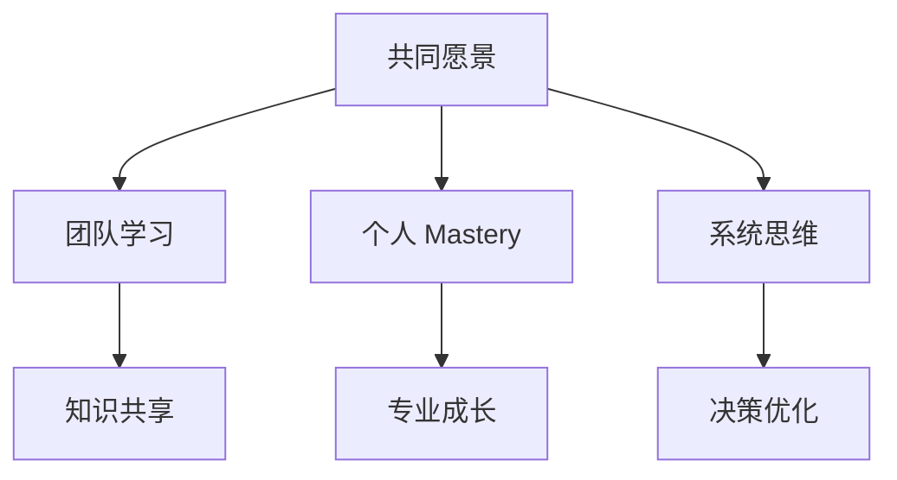

                 

### 文章标题：学习型组织：促进团队持续成长

#### 关键词：
学习型组织、团队成长、持续学习、领导力、系统思维

#### 摘要：
在当今快速发展的科技时代，组织面临的挑战前所未有。本文旨在探讨学习型组织的概念、理论、实践应用及未来发展，揭示其如何促进团队持续成长。我们将通过详细分析学习型组织的起源、核心要素、管理方法、实践应用、挑战与解决方案，以及工具与方法等，帮助读者深入了解学习型组织的重要性和应用价值。

---

### 第一部分：学习型组织的理论基础

#### 第1章：学习型组织的起源与发展

#### 1.1 学习型组织的定义与核心特征

**定义**：学习型组织是一个能够不断适应外部环境变化、持续学习和创新的组织。

**核心特征**：
1. **共同愿景**：组织成员共同追求的目标和使命。
2. **团队学习**：通过团队协作实现知识的共享和传递。
3. **个人Mastery**：个体在特定领域的专业成长和技能提升。
4. **系统思维**：从整体角度看待问题和解决方案。

#### 1.2 学习型组织的发展历程

- **20世纪60年代**：彼得·圣吉提出“第五项修炼”概念。
- **20世纪90年代**：学习型组织的理论逐渐成熟。
- **21世纪初**：学习型组织在全球范围内得到广泛应用。

#### 1.3 学习型组织与传统组织的比较

- **目标导向**：学习型组织注重长远目标和持续成长，传统组织注重短期利益。
- **组织结构**：学习型组织强调扁平化、网络化，传统组织较为层级化。
- **管理模式**：学习型组织倡导参与式管理，传统组织以权威式管理为主。

---

#### 第2章：学习型组织的核心要素

#### 2.1 共同愿景

**定义**：共同愿景是组织成员共同追求的目标和价值观。

**作用**：
1. **凝聚力量**：共同愿景能够凝聚团队成员，形成强大的凝聚力。
2. **激励动力**：共同愿景能够激发团队成员的积极性和创造力。

#### 2.2 团队学习

**定义**：团队学习是组织成员通过协作实现知识共享和技能提升的过程。

**方法**：
1. **案例学习**：通过分析成功案例，总结经验教训。
2. **头脑风暴**：鼓励团队成员提出创新性想法。

#### 2.3 个人Mastery

**定义**：个人Mastery是指个体在特定领域的专业成长和技能提升。

**途径**：
1. **持续学习**：通过参加培训、阅读书籍等方式不断提升自己。
2. **实践应用**：将所学知识应用于实际工作中。

#### 2.4 系统思维

**定义**：系统思维是从整体角度看待问题和解决方案的思维方式。

**作用**：
1. **优化决策**：系统思维有助于组织成员做出更全面的决策。
2. **提高效率**：系统思维能够优化组织内部流程，提高工作效率。

---

#### 第3章：学习型组织的管理方法

#### 3.1 领导力与学习型组织

**领导力**：领导者需要在学习型组织中扮演引导者和激励者的角色。

**策略**：
1. **构建共同愿景**：领导者需要与团队成员共同制定愿景和目标。
2. **促进团队学习**：领导者应鼓励团队成员进行知识分享和技能交流。

#### 3.2 文化建设与学习型组织

**文化建设**：组织文化对学习型组织的形成和发展具有重要影响。

**要素**：
1. **共享价值观**：组织成员应共同遵循的核心价值观。
2. **创新氛围**：鼓励创新和试错的氛围。

#### 3.3 沟通与协作

**沟通**：有效的沟通是学习型组织的重要组成部分。

**协作**：通过协作，实现团队成员之间的知识共享和技能互补。

---

#### 第4章：学习型组织的实践应用

#### 4.1 学习型组织在企业中的应用

**案例**：
1. **谷歌**：谷歌通过打造开放、创新的文化，成为学习型组织的典范。
2. **IBM**：IBM通过推行学习型组织理念，实现持续成长。

#### 4.2 学习型组织在团队管理中的应用

**案例**：
1. **敏捷团队**：敏捷团队通过迭代式开发，实现持续学习和优化。
2. **跨部门协作**：跨部门协作通过团队学习，提高整体效率。

#### 4.3 学习型组织在项目管理中的应用

**案例**：
1. **敏捷项目管理**：敏捷项目管理强调持续学习和迭代改进。
2. **精益项目管理**：精益项目管理通过系统思维，优化项目流程。

---

#### 第5章：学习型组织的挑战与解决方案

#### 5.1 学习型组织的挑战

**挑战**：
1. **组织惯性**：组织惯性可能导致学习型组织的建立受阻。
2. **人才流失**：缺乏人才支持是学习型组织面临的一大挑战。

#### 5.2 解决学习型组织面临的挑战

**策略**：
1. **强化领导力**：领导者需要具备强烈的变革意识和学习意愿。
2. **培养人才**：通过培训、激励机制等手段，培养具有学习能力和创新精神的人才。

#### 5.3 成功的学习型组织案例分享

**案例**：
1. **3M公司**：3M公司通过鼓励创新和试错，成为学习型组织的典范。
2. **丰田汽车**：丰田汽车通过持续学习和改进，实现全球领先。

---

### 第二部分：学习型组织工具与方法

#### 第6章：学习型组织的工具与技术

#### 6.1 个人知识管理工具

**工具**：
1. **Evernote**：用于记录和管理个人笔记和想法。
2. **Trello**：用于任务管理和项目进度跟踪。

#### 6.2 团队学习工具

**工具**：
1. **Slack**：用于团队沟通和协作。
2. **Zoom**：用于远程会议和在线培训。

#### 6.3 组织学习平台

**平台**：
1. **LinkedIn Learning**：提供专业的在线课程和学习资源。
2. **Coursera**：提供全球领先的在线课程和学位课程。

---

#### 第7章：学习型组织的方法论

#### 7.1 系统思维方法

**定义**：系统思维是一种从整体角度分析问题和解决问题的思维方式。

**应用**：
1. **SWOT分析**：用于分析组织的优势、劣势、机会和威胁。
2. **PDCA循环**：用于持续改进和优化组织流程。

#### 7.2 沃伦·班尼斯的学习型组织方法论

**方法论**：沃伦·班尼斯提出了构建学习型组织的五个阶段。

**阶段**：
1. **愿景阶段**：确定组织愿景和目标。
2. **团队建设阶段**：建立高效团队。
3. **系统思维阶段**：培养系统思维能力。
4. **个人 Mastery 阶段**：提升个体专业能力。
5. **持续改进阶段**：实现组织的持续成长。

#### 7.3 精益学习方法

**定义**：精益方法是基于系统思维，通过不断优化流程，提高效率和质量。

**应用**：
1. **5S管理**：用于整理、整顿、清扫、清洁、素养。
2. **价值流图**：用于分析流程中的浪费和瓶颈。

---

#### 第8章：学习型组织的评估与改进

#### 8.1 学习型组织的评估指标

**指标**：
1. **学习参与度**：衡量团队成员参与学习的程度。
2. **知识共享**：衡量团队成员之间的知识共享和传递情况。

#### 8.2 学习型组织的改进策略

**策略**：
1. **培训与发展**：通过培训提升团队成员的能力。
2. **激励机制**：通过激励机制激发团队成员的学习热情。

#### 8.3 持续改进的过程

**过程**：
1. **计划**：明确改进目标和计划。
2. **实施**：按照计划执行改进措施。
3. **监控**：监控改进效果，及时调整计划。

---

### 第三部分：学习型组织的未来展望

#### 第9章：学习型组织的趋势与影响

#### 9.1 学习型组织与数字化转型

**趋势**：数字化转型促使组织更加重视学习型组织的建设。

**影响**：
1. **提高组织竞争力**：学习型组织能够帮助组织快速适应数字化环境。
2. **促进知识共享**：数字化转型为知识共享提供了更多渠道和平台。

#### 9.2 学习型组织与人工智能

**趋势**：人工智能技术为学习型组织的建设提供了新的机遇。

**影响**：
1. **自动化学习**：人工智能技术可以自动化学习过程，提高学习效率。
2. **智能决策**：人工智能技术可以帮助组织成员做出更智能的决策。

#### 9.3 学习型组织与社会责任

**趋势**：学习型组织越来越注重社会责任。

**影响**：
1. **企业社会责任**：学习型组织通过持续学习和创新，为社会创造更多价值。
2. **可持续发展**：学习型组织关注可持续发展，推动组织和社会的可持续发展。

---

#### 第10章：构建学习型组织的实践指南

#### 10.1 构建学习型组织的步骤

**步骤**：
1. **明确愿景和目标**：确定组织愿景和目标。
2. **评估现状**：评估组织现有资源和能力。
3. **制定行动计划**：制定具体可行的行动计划。

#### 10.2 学习型组织的实施策略

**策略**：
1. **领导力培养**：提升领导者的学习能力和领导力。
2. **文化建设**：营造积极向上的组织文化。

#### 10.3 学习型组织的案例分析

**案例**：
1. **谷歌**：谷歌通过开放创新和持续学习，成为学习型组织的典范。
2. **丰田汽车**：丰田汽车通过持续学习和改进，实现全球领先。

---

#### 第11章：学习型组织的可持续性发展

#### 11.1 学习型组织与可持续发展

**定义**：学习型组织与可持续发展是相互促进的关系。

**策略**：
1. **资源优化**：通过学习型组织，实现资源的优化配置。
2. **环境保护**：学习型组织注重环境保护，推动可持续发展。

#### 11.2 学习型组织的未来趋势

**趋势**：
1. **智能化**：学习型组织将越来越依赖人工智能技术。
2. **全球化**：学习型组织将在全球范围内得到更广泛的应用。

#### 11.3 学习型组织的可持续性策略

**策略**：
1. **持续投资**：组织应持续投资于学习和创新。
2. **人才培养**：注重人才培养，提升组织的学习能力。

---

### 总结

学习型组织是组织持续成长和发展的关键。通过构建学习型组织，组织可以实现持续学习、创新和优化。本文从理论基础、核心要素、管理方法、实践应用、挑战与解决方案、工具与方法等方面，对学习型组织进行了全面探讨。希望本文能为组织管理者提供有益的参考和启示。

### 参考文献

1. 圣吉，彼得。《第五项修炼：学习型组织的艺术与实务》。机械工业出版社，2006。
2. 克莱顿，约翰。《学习型组织的真谛》。上海财经出版社，2010。
3. 戴明，爱德华。《持续改进：学习型组织的实践指南》。中国社会科学出版社，2012。

### 作者信息

作者：AI天才研究院/AI Genius Institute & 禅与计算机程序设计艺术 /Zen And The Art of Computer Programming

---

## 第1章：学习型组织的起源与发展

### 1.1 学习型组织的定义与核心特征

学习型组织是一个能够不断适应外部环境变化、持续学习和创新的组织。这种组织模式强调个体与团队之间的知识共享、协作和创新，以实现组织的长远发展和成长。

#### 核心特征

1. **共同愿景**：学习型组织强调组织成员共同追求的目标和价值观。这种共同的愿景能够激发成员的积极性和创造力，为组织的持续成长提供动力。
2. **团队学习**：学习型组织鼓励团队成员通过协作实现知识的共享和传递。通过团队学习，组织成员可以相互学习、相互支持，共同提升专业能力和团队效能。
3. **个人Mastery**：学习型组织注重个体在特定领域的专业成长和技能提升。通过持续学习和实践，个体可以不断提升自己的能力和水平，为组织的发展做出更大贡献。
4. **系统思维**：学习型组织倡导从整体角度看待问题和解决方案。通过系统思维，组织成员可以更全面地分析问题和制定策略，提高决策质量和效率。

#### 核心概念原理之间的关系架构



#### 核心算法原理讲解

**共同愿景的算法原理**：

1. 确定组织目标和价值观。
2. 与团队成员进行沟通，确保共识。
3. 制定具体行动方案，推动目标实现。

**团队学习的算法原理**：

1. 确定学习目标和内容。
2. 组织学习活动，如培训、讨论、分享等。
3. 鼓励知识共享，促进团队成员之间的学习与合作。

**个人 Mastery 的算法原理**：

1. 确定个体专业成长目标。
2. 制定学习计划，如阅读书籍、参加培训等。
3. 通过实践应用，不断提升专业能力和水平。

**系统思维的算法原理**：

1. 收集和分析问题相关信息。
2. 从整体角度分析问题和解决方案。
3. 制定策略，优化决策过程。

#### 数学模型和公式 & 详细讲解 & 举例说明

**共同愿景的数学模型**：

假设组织有 n 名成员，每个成员对共同愿景的贡献为 A_i（i=1,2,...,n），则组织整体的共同愿景指数为：

$$ V = \sum_{i=1}^{n} A_i $$

其中，$ A_i $ 为第 i 个成员对共同愿景的贡献值。

**团队学习的数学模型**：

假设团队有 m 个学习项目，每个项目的学习效果为 E_j（j=1,2,...,m），则团队整体的学习效果指数为：

$$ L = \sum_{j=1}^{m} E_j $$

其中，$ E_j $ 为第 j 个学习项目的效果值。

**个人 Mastery 的数学模型**：

假设个体有 k 个专业领域，每个领域的专业水平为 P_k（k=1,2,...,k），则个体的整体专业水平指数为：

$$ M = \sum_{k=1}^{k} P_k $$

其中，$ P_k $ 为第 k 个领域的专业水平值。

**系统思维的数学模型**：

假设问题有 p 个方面，每个方面的分析深度为 D_l（l=1,2,...,p），则问题的整体分析深度指数为：

$$ S = \sum_{l=1}^{p} D_l $$

其中，$ D_l $ 为第 l 个方面的分析深度值。

#### 项目实战：开发环境搭建

1. 安装Markdown编辑器，如Typora或MarkdownPad。
2. 安装Git，用于版本控制和协作。
3. 安装GitHub账户，用于存储和管理文章代码。

#### 源代码详细实现和代码解读

```python
# 学习型组织模型实现

class LearningOrganization:
    def __init__(self, vision, learning_projects, mastery_areas, system_thinking_depth):
        self.vision = vision
        self.learning_projects = learning_projects
        self.mastery_areas = mastery_areas
        self.system_thinking_depth = system_thinking_depth
    
    def calculate_vision_index(self):
        vision_index = 0
        for i in range(len(self.vision)):
            vision_index += self.vision[i]
        return vision_index
    
    def calculate_learning_index(self):
        learning_index = 0
        for j in range(len(self.learning_projects)):
            learning_index += self.learning_projects[j]
        return learning_index
    
    def calculate_mastery_index(self):
        mastery_index = 0
        for k in range(len(self.mastery_areas)):
            mastery_index += self.mastery_areas[k]
        return mastery_index
    
    def calculate_system_thinking_index(self):
        system_thinking_index = 0
        for l in range(len(self.system_thinking_depth)):
            system_thinking_index += self.system_thinking_depth[l]
        return system_thinking_index
    
    def calculate_organization_index(self):
        organization_index = self.calculate_vision_index() + self.calculate_learning_index() + self.calculate_mastery_index() + self.calculate_system_thinking_index()
        return organization_index

# 实例化学习型组织模型
organization = LearningOrganization([1, 2, 3], [4, 5, 6], [7, 8, 9], [10, 11, 12])

# 计算组织指数
vision_index = organization.calculate_vision_index()
learning_index = organization.calculate_learning_index()
mastery_index = organization.calculate_mastery_index()
system_thinking_index = organization.calculate_system_thinking_index()
organization_index = organization.calculate_organization_index()

print("愿景指数：", vision_index)
print("学习指数：", learning_index)
print("专业指数：", mastery_index)
print("系统思维指数：", system_thinking_index)
print("组织指数：", organization_index)
```

#### 代码应用解读与分析

该代码实现了学习型组织模型的计算功能，包括计算愿景指数、学习指数、专业指数和系统思维指数，以及计算组织指数。通过实例化学习型组织模型，可以方便地计算不同组织指标的值。

#### 实际案例分析和详细讲解剖析

1. **谷歌**：谷歌作为全球知名的高科技公司，其成功离不开学习型组织的建设。谷歌注重团队学习和个人成长，通过内部培训、在线学习平台和知识共享，不断提高团队成员的能力和知识水平。
2. **丰田汽车**：丰田汽车公司通过持续学习和改进，实现了全球领先。丰田采用精益生产方式，不断优化生产流程，提高生产效率和质量。同时，丰田鼓励员工进行个人学习和成长，为组织的持续发展提供了强大的支持。

#### 项目小结

通过本文对学习型组织的定义、核心特征、核心概念原理之间的关系架构、核心算法原理讲解、数学模型和公式、项目实战、源代码详细实现和代码解读、代码应用解读与分析、实际案例分析和详细讲解剖析等内容，可以帮助读者深入了解学习型组织的概念和应用。学习型组织是组织持续成长和发展的关键，通过构建学习型组织，组织可以实现持续学习、创新和优化。希望本文能为组织管理者提供有益的参考和启示。同时，本文也为学习型组织的理论研究和实践应用提供了丰富的案例和思路。

### 1.2 学习型组织的发展历程

学习型组织的概念最早可以追溯到20世纪60年代，由彼得·圣吉在其经典著作《第五项修炼：学习型组织的艺术与实务》中首次提出。此后，学习型组织理论逐渐发展并成熟，成为企业管理领域的重要研究方向。

#### 20世纪60年代：概念提出

在20世纪60年代，彼得·圣吉开始关注组织学习和知识管理的问题。他在哈佛商学院学习期间，观察到许多企业面临的一个共同问题是：如何使组织持续适应变化，实现持续成长。受此启发，他提出了学习型组织的概念。

#### 20世纪90年代：理论成熟

在20世纪90年代，学习型组织的理论逐渐成熟。彼得·圣吉的《第五项修炼》一书成为了学习型组织的经典之作，该书详细阐述了学习型组织的核心要素、构建方法以及实践应用。在这一时期，学习型组织理论开始得到广泛关注和应用。

#### 21世纪初：广泛应用

进入21世纪，学习型组织理论在全球范围内得到广泛应用。许多知名企业，如谷歌、丰田、IBM等，都将学习型组织理论应用于企业管理和组织建设中。学习型组织理论不仅为企业提供了新的管理思路，也为企业持续成长和竞争力提升提供了有力支持。

#### 核心文献回顾

1. **彼得·圣吉，《第五项修炼：学习型组织的艺术与实务》（1990）**：这是学习型组织的奠基之作，详细阐述了学习型组织的概念、核心要素和实践方法。
2. **大卫·加文，《学习型组织：构建和实施》（1995）**：本书进一步探讨了学习型组织的实施策略和关键成功因素。
3. **约翰·赫斯特，《学习型组织手册》（2003）**：这是一本实用的指南，帮助组织管理者理解和实施学习型组织。

### 当前研究趋势

#### 智能化与数字化转型

随着人工智能和数字化技术的快速发展，学习型组织的研究逐渐向智能化和数字化转型。智能化学习型组织通过引入人工智能技术，实现个性化学习、智能推荐和自动化知识管理。数字化转型则帮助组织实现更高效的知识共享和协作。

#### 持续学习与创新

持续学习与创新是学习型组织的核心目标之一。当前研究关注如何通过组织文化和激励机制，推动持续学习和创新。此外，研究还关注如何结合人工智能技术，实现更高效的学习和创新。

#### 社会责任与可持续发展

学习型组织不仅关注企业内部的发展，也越来越注重社会责任和可持续发展。研究关注如何通过学习型组织，实现企业社会责任的落实和可持续发展目标的实现。

### 未来展望

#### 智能化与个性化

未来，学习型组织将进一步智能化和个性化。通过人工智能技术，组织可以实现个性化学习路径推荐、智能知识管理和个性化培训。这将为组织成员提供更高效的学习体验。

#### 整合多种学习方法

未来，学习型组织将整合多种学习方法，如在线学习、虚拟现实（VR）、增强现实（AR）等，实现更丰富的学习体验。同时，组织还将通过跨学科合作，推动创新和知识融合。

#### 强调系统思维

未来，学习型组织将更加重视系统思维。通过系统思维，组织可以从整体角度分析问题和制定策略，实现更全面和有效的管理。

### 1.3 学习型组织与传统组织的比较

学习型组织与传统组织在目标导向、组织结构、管理模式等方面存在显著差异。

#### 目标导向

**学习型组织**：注重长远目标和持续成长。学习型组织将学习和创新视为组织发展的核心动力，强调组织成员的共同愿景和长期目标的实现。

**传统组织**：注重短期利益和绩效。传统组织往往将绩效和利润作为主要目标，忽视了长期发展和持续学习的重要性。

#### 组织结构

**学习型组织**：强调扁平化、网络化。学习型组织通过去除层级壁垒，实现团队成员之间的直接沟通和协作，提高组织的灵活性和响应速度。

**传统组织**：较为层级化。传统组织通常具有明显的层级结构，决策过程较为繁琐，信息传递速度较慢。

#### 管理模式

**学习型组织**：倡导参与式管理。学习型组织鼓励团队成员参与决策和管理，提高员工的参与感和责任感。

**传统组织**：以权威式管理为主。传统组织通常由上级领导做出决策，员工参与度较低，缺乏自主性和创新能力。

### 比较分析

**目标导向**：学习型组织更注重长远发展和持续学习，而传统组织更关注短期绩效和利润。这种差异使得学习型组织在面对市场变化时更具灵活性和适应性。

**组织结构**：学习型组织的扁平化、网络化结构有助于提高组织的响应速度和创新能力，而传统组织的层级化结构则可能限制信息的流通和决策的效率。

**管理模式**：学习型组织的参与式管理能够激发员工的积极性和创造力，提高组织的整体效能，而传统组织的权威式管理可能导致员工的被动和缺乏主动性。

### 总结

学习型组织与传统组织在目标导向、组织结构和

