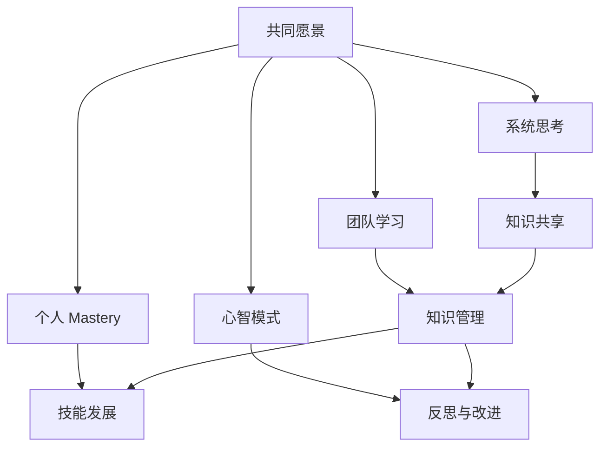

                 

### 学习型组织的背景与重要性

在现代商业环境中，企业面临的挑战日益复杂，仅靠传统的管理模式和单一的技能已难以应对。因此，学习型组织的概念逐渐兴起，成为企业持续进步和成功的关键因素。学习型组织不仅是一种管理模式，更是一种企业文化，它强调组织成员不断学习、创新和自我超越，以适应快速变化的市场环境。

#### 背景介绍

学习型组织的概念最早由管理学家彼得·圣吉（Peter Senge）在1990年提出的。他在其著作《第五项修炼：学习型组织的艺术与实践》（The Fifth Discipline: The Art & Practice of The Learning Organization）中详细阐述了学习型组织的理念和实践。学习型组织强调通过系统性思考、共同愿景、团队学习、个人 Mastery 和心智模式等核心要素，构建一个持续学习、不断改进的组织环境。

#### 重要性

1. **适应能力增强**：在当今快速变化的市场环境中，企业必须具备快速适应和调整的能力。学习型组织通过不断学习和创新，使组织成员能够迅速掌握新知识、新技能，从而提高组织的适应能力。

2. **创新能力提升**：学习型组织鼓励团队成员进行自主学习和创新，形成一种持续改进的文化氛围。这种文化氛围有助于激发团队成员的创造力，推动企业的创新活动。

3. **员工参与度提高**：学习型组织强调员工的参与和自我管理，使员工感到自己在组织中的价值和贡献。这种参与感可以显著提高员工的积极性和忠诚度，从而提升整体绩效。

4. **知识管理优化**：学习型组织通过建立完善的知识管理体系，促进知识的共享和传承，使组织内的知识得到充分利用。这有助于提高组织的知识水平和创新能力。

5. **持续成长与改进**：学习型组织致力于不断学习和改进，通过不断反思和调整，实现组织的持续成长和进步。

#### 学习型组织的核心概念

1. **共同愿景**：共同愿景是学习型组织的基石，它是指组织成员共同追求的远景目标。共同愿景可以激发组织成员的积极性和创造力，推动组织的持续发展。

2. **系统思考**：系统思考是学习型组织的一种核心思维方式，它强调从整体和长期的角度看待问题，避免片面和短视的行为。系统思考有助于组织成员更好地理解问题的本质和相互关系。

3. **团队学习**：团队学习是学习型组织的重要特征之一，它强调通过团队协作和知识共享，实现个人和组织的共同成长。

4. **个人 Mastery **：个人 Mastery 强调个人在专业技能和知识方面的自我提升，它是学习型组织的基础。

5. **心智模式**：心智模式是指组织成员在思考和决策过程中所采用的思维方式和观念。通过不断反思和调整心智模式，组织成员可以更好地适应外部环境的变化。

### 核心概念的联系与流程图

为了更好地理解学习型组织的核心概念及其相互关系，我们使用 Mermaid 流程图进行展示。



从流程图中可以看出，共同愿景作为学习型组织的核心，通过系统思考和团队学习，推动个人 Mastery 和心智模式的发展。知识共享和知识管理在这个过程中起到了关键作用，促进了知识的传承和创新。个人 Mastery 和心智模式的反思与改进进一步增强了组织的适应能力和创新能力。

通过以上对学习型组织背景、重要性及其核心概念的介绍和流程图展示，我们可以更好地理解学习型组织的内涵和构建方法。在接下来的章节中，我们将详细探讨学习型组织的构建步骤、实际案例、工具与方法等，以帮助读者深入理解和实践学习型组织的理念。

### 构建学习型组织的步骤

构建一个学习型组织需要明确的步骤和策略，以确保组织能够持续学习和适应变化。以下是构建学习型组织的详细步骤，每个步骤都包含关键要素和具体实施方法。

#### 第一步：确立共同愿景

**关键要素**：
- 明确组织的长期目标和使命
- 确保所有员工对愿景有共同的理解和认同

**具体实施方法**：
1. **制定愿景陈述**：通过高层管理团队的讨论和决策，制定一个简明扼要的愿景陈述，明确组织的方向和目标。
2. **传播愿景**：利用内部通讯、会议、培训等形式，向所有员工传达愿景，确保他们理解并认同。
3. **制定实现愿景的策略**：将愿景分解为可操作的目标和计划，确保每个员工都清楚自己在实现愿景中的角色和责任。

#### 第二步：培养系统思考能力

**关键要素**：
- 提高员工对系统复杂性的认识
- 培养整体和长期视角的思维方式

**具体实施方法**：
1. **培训与教育**：通过系统思考的培训和研讨会，帮助员工掌握系统思考的方法和技巧。
2. **案例分析**：通过分析成功和失败案例，让员工理解系统思维在决策中的作用。
3. **反思与讨论**：定期组织团队进行系统思考和反思，鼓励员工从不同角度审视问题，并提出改进措施。

#### 第三步：促进团队学习

**关键要素**：
- 建立知识共享和协作的文化
- 通过团队学习和项目合作，提升整体绩效

**具体实施方法**：
1. **团队建设活动**：通过团队建设活动，增强团队成员之间的信任和协作能力。
2. **知识共享平台**：建立知识共享平台，鼓励员工分享知识和经验，促进知识的传承和利用。
3. **项目合作**：通过跨部门的项目合作，培养员工的团队协作能力，提高团队解决问题的效率。

#### 第四步：发展个人 Mastery

**关键要素**：
- 提升员工的专业技能和知识水平
- 鼓励员工进行自我提升和职业发展

**具体实施方法**：
1. **培训与学习资源**：提供多样化的培训和学习资源，支持员工进行自我提升。
2. **技能发展计划**：制定个人技能发展计划，确保员工在职业发展的各个阶段都有明确的提升目标。
3. **奖励与认可**：通过奖励和认可，激励员工积极参与个人 Mastery 的过程。

#### 第五步：塑造心智模式

**关键要素**：
- 帮助员工识别和改变限制性思维模式
- 培养积极、开放和反思性的心智模式

**具体实施方法**：
1. **反思与反馈**：通过反思和反馈机制，帮助员工识别和调整心智模式。
2. **角色扮演**：通过角色扮演和模拟练习，让员工体验不同思维模式的影响，促进心智模式的改变。
3. **团队讨论**：定期组织团队讨论，鼓励员工分享自己的思维模式和经验，互相学习和借鉴。

#### 第六步：建立学习机制

**关键要素**：
- 确保学习成为组织的常态化行为
- 建立有效的学习评估和反馈机制

**具体实施方法**：
1. **学习计划**：制定年度或季度学习计划，确保员工有充足的学习时间和资源。
2. **学习评估**：通过定期的学习评估，了解员工的学习成果和进展，及时调整学习策略。
3. **反馈机制**：建立有效的反馈机制，鼓励员工分享学习心得和经验，促进学习效果的提升。

通过以上六个步骤，企业可以逐步构建一个学习型组织，实现持续学习和改进，从而在快速变化的市场环境中保持竞争力和创新能力。

### 核心算法原理讲解

构建学习型组织不仅需要明确的步骤和策略，还需要一些核心算法原理的支持。以下是关于学习型组织中常用的算法原理的详细讲解。

#### 系统动力学

**定义**：系统动力学是一种基于系统思考的方法，用于分析和解决复杂系统的动态行为。它通过构建数学模型和仿真模型，模拟系统在不同条件下的行为和变化。

**原理**：
1. **反馈循环**：系统动力学中的反馈循环包括正反馈和负反馈。正反馈会放大系统的某种行为，导致系统状态的变化；负反馈则会抵消系统的不稳定因素，维持系统的稳定。
2. **延迟效应**：系统动力学强调延迟效应的重要性，即系统中的某些行为和结果之间存在时间延迟。这种延迟效应可能导致系统行为的非线性变化。

**伪代码**：
```python
# 系统动力学模型伪代码
class SystemDynamicsModel:
    def __init__(self):
        self.state = initial_state
        self.feedback_loop = FeedbackLoop()

    def update_state(self, time_step):
        self.state = self.feedback_loop.update(self.state, time_step)

class FeedbackLoop:
    def __init__(self):
        self.positive_feedback = PositiveFeedback()
        self.negative_feedback = NegativeFeedback()

    def update(self, state, time_step):
        positive_change = self.positive_feedback.apply(state)
        negative_change = self.negative_feedback.apply(state)
        return state + positive_change - negative_change
```

**数学模型和公式**：

系统动力学中的数学模型通常包括微分方程和差分方程。以下是一个简单的系统动力学模型，用于描述人口增长问题：

$$
\frac{dP}{dt} = rP\left(1 - \frac{P}{K}\right)
$$

其中，$P$ 是人口数量，$r$ 是出生率，$K$ 是环境承载力。这个公式描述了人口数量的变化率，取决于出生率和环境承载力。

#### 知识图谱

**定义**：知识图谱是一种用于表示实体及其之间关系的语义网络。它通过将知识以结构化的方式存储和表示，使得计算机能够理解和处理知识。

**原理**：
1. **实体与关系**：知识图谱由实体和关系组成。实体是知识图谱中的主体，关系则是实体之间的语义联系。
2. **语义表示**：知识图谱通过语义表示将实体和关系进行编码，使得计算机能够理解其含义。
3. **推理**：知识图谱支持基于语义的推理，可以推断出实体之间的关系和属性。

**伪代码**：

以下是一个简单的知识图谱构建和推理的伪代码：

```python
class KnowledgeGraph:
    def __init__(self):
        self.entities = {}
        self.relationships = {}

    def add_entity(self, entity):
        self.entities[entity] = []

    def add_relationship(self, entity1, relation, entity2):
        self.relationships[(entity1, relation)] = entity2

    def infer_relationship(self, entity, relation):
        if (entity, relation) in self.relationships:
            return self.relationships[(entity, relation)]
        else:
            return None
```

**数学模型和公式**：

知识图谱的构建和推理通常涉及到图论中的路径搜索算法，如深度优先搜索（DFS）和广度优先搜索（BFS）。以下是一个简单的深度优先搜索算法的伪代码：

```python
def dfs(graph, node, target_relation):
    if node == target_relation:
        return True
    for neighbor in graph[node]:
        if dfs(graph, neighbor, target_relation):
            return True
    return False
```

#### 数据分析

**定义**：数据分析是一种通过统计和计算方法，从数据中提取有价值信息的过程。它广泛应用于商业智能、机器学习等领域。

**原理**：
1. **数据清洗**：数据分析的第一步是数据清洗，确保数据的质量和准确性。
2. **数据探索**：通过数据探索，发现数据中的模式和规律。
3. **假设检验**：基于数据探索的结果，提出假设并进行统计检验。
4. **预测建模**：使用机器学习算法构建预测模型，对未来趋势进行预测。

**伪代码**：

以下是一个简单的数据分析流程的伪代码：

```python
def data_analysis(data):
    cleaned_data = clean_data(data)
    summary_stats = explore_data(cleaned_data)
    hypothesis = formulate_hypothesis(summary_stats)
    p_value = hypothesis_test(hypothesis)
    if p_value < significance_level:
        model = build_prediction_model(cleaned_data)
        predictions = model.predict(new_data)
        return predictions
    else:
        return None
```

**数学模型和公式**：

数据分析中常用的数学模型和公式包括线性回归、逻辑回归、决策树等。以下是一个简单的线性回归模型的伪代码：

```python
def linear_regression(x, y):
    theta = [0] * len(x[0])
    for i in range(num_iterations):
        error = y - (theta[0] * x + theta[1])
        theta[0] -= learning_rate * sum(error * x)
        theta[1] -= learning_rate * sum(error)
    return theta
```

通过以上核心算法原理的讲解，我们可以看到学习型组织在构建过程中，如何运用系统动力学、知识图谱和数据分析等方法，实现持续学习和改进的目标。这些算法原理不仅提供了理论支持，也为实际操作提供了具体的方法和工具。

### 数学公式和详细讲解

在构建学习型组织的过程中，数学公式和模型扮演着至关重要的角色，它们帮助我们量化组织和个体的学习效果，指导决策过程，并评估组织的健康状态。以下将详细讲解几个关键数学模型和公式的应用，并通过具体的例子来说明。

#### 线性回归模型

线性回归模型是数据分析中最基础且广泛应用的一种模型。它用于预测一个因变量（通常是连续值）与一个或多个自变量之间的关系。

**公式**：

$$
y = \beta_0 + \beta_1x + \epsilon
$$

其中，$y$ 是因变量，$x$ 是自变量，$\beta_0$ 和 $\beta_1$ 是模型的参数，$\epsilon$ 是误差项。

**应用场景**：

假设我们要预测一家企业的销售额，考虑到市场推广费用（$x$）对销售额（$y$）的影响。我们可以通过线性回归模型找到推广费用与销售额之间的关系。

**实例**：

给定以下数据：

| 推广费用 (x) | 销售额 (y) |
| ------------- | ----------- |
| 1000          | 15000       |
| 2000          | 18000       |
| 3000          | 21000       |
| 4000          | 25000       |

我们使用最小二乘法来估计模型参数 $\beta_0$ 和 $\beta_1$：

$$
\beta_1 = \frac{\sum(x_i - \bar{x})(y_i - \bar{y})}{\sum(x_i - \bar{x})^2}
$$

$$
\beta_0 = \bar{y} - \beta_1\bar{x}
$$

计算得到：

$$
\beta_1 = \frac{(1000-2000)(15000-20000) + (2000-2000)(18000-20000) + (3000-2000)(21000-20000) + (4000-2000)(25000-20000)}{(1000-2000)^2 + (2000-2000)^2 + (3000-2000)^2 + (4000-2000)^2} \approx 1500
$$

$$
\beta_0 = \frac{15000 + 18000 + 21000 + 25000}{4} - 1500 \times 2000 \approx 20000
$$

因此，预测模型为：

$$
y = 20000 + 1500x
$$

我们可以使用这个模型来预测不同推广费用下的销售额。

#### 逻辑回归模型

逻辑回归模型是用于处理因变量为二分类变量的回归模型。它通过估计概率分布来预测某一事件的发生可能性。

**公式**：

$$
\log\left(\frac{P(y=1)}{1-P(y=1)}\right) = \beta_0 + \beta_1x
$$

其中，$P(y=1)$ 是事件发生的概率，$\beta_0$ 和 $\beta_1$ 是模型的参数。

**应用场景**：

假设我们要预测一家企业的员工流失情况，我们可以使用逻辑回归模型来估计员工流失的概率。

**实例**：

给定以下数据：

| 员工年龄 (x) | 流失 (y) |
| ------------- | --------- |
| 30            | 是        |
| 40            | 否        |
| 50            | 是        |
| 55            | 是        |

使用逻辑回归模型：

$$
P(y=1) = \frac{1}{1 + e^{-(\beta_0 + \beta_1x)}}
$$

我们可以通过最大化似然函数来估计 $\beta_0$ 和 $\beta_1$：

$$
\log L = \sum_{i=1}^{n} \left[y_i \log \left(\frac{1}{1 + e^{-(\beta_0 + \beta_1x_i)}}\right) + (1 - y_i) \log \left(1 + e^{-(\beta_0 + \beta_1x_i)}\right)\right]
$$

通过数值优化方法，如梯度下降或牛顿法，可以得到参数的估计值。假设我们得到 $\beta_0 \approx 0.5$ 和 $\beta_1 \approx 0.1$，则模型为：

$$
P(y=1) = \frac{1}{1 + e^{-(0.5 + 0.1x)}}
$$

可以预测员工流失的概率。

#### 决策树模型

决策树模型是一种基于树形结构进行决策的模型，通过一系列规则来分类或回归数据。

**公式**：

决策树模型没有单一的公式，而是通过递归分割数据集，构建树形结构。每个节点代表一个特征，每个分支代表一个分割点。

**应用场景**：

假设我们要对一家企业的客户进行分类，以预测其是否为高价值客户。

**实例**：

给定以下数据：

| 年龄 | 收入 | 职业 | 高价值客户 (y) |
| ---- | ---- | ---- | -------------- |
| 25   | 高   | 学生 | 否             |
| 35   | 中   | 工程师 | 是             |
| 45   | 高   | 经理 | 是             |
| 55   | 中   | 教授 | 是             |

我们可以使用决策树算法来构建模型。以下是一个简化的决策树结构：

```
1. 年龄 <= 30 ? (否):
   2. 收入 <= 中 ? (否):
      3. 职业 == 教授 ? (是):
          高价值客户：是
        (否):
          高价值客户：否
      (是):
        高价值客户：是
   (是):
     高价值客户：是
```

通过上述数学模型和公式的讲解，我们可以看到在构建学习型组织的过程中，如何利用这些模型来分析数据、指导决策，并评估组织的健康状况。这些数学工具为组织提供了量化的方法，帮助其在不断学习和改进的道路上更加高效和精准。

### 项目实战：开发环境搭建

为了更好地理解学习型组织的构建过程，我们选择了一个实际案例，以一个企业的学习管理系统（LMS）为背景，介绍如何搭建开发环境、实现核心功能，并对代码进行详细解读。

#### 项目背景

某企业希望通过搭建一个学习管理系统，帮助员工进行在线学习和知识共享，以提升整体素质和竞争力。该系统需要支持课程管理、学习进度跟踪、知识库管理、考试与评估等功能。

#### 开发环境搭建

**步骤 1：选择开发工具和框架**

- **前端**：使用 React.js 框架进行开发，因为其组件化和单向数据流的特点，有利于提高开发效率和代码可维护性。
- **后端**：采用 Node.js 和 Express.js，因其高效的异步非阻塞特点，适合处理大量并发请求。
- **数据库**：使用 MongoDB 作为数据库，因其灵活的文档存储结构和强大的查询能力，适合存储和学习相关的数据。
- **版本控制**：使用 Git 进行代码管理，以保持代码的版本化和协作开发的便捷性。

**步骤 2：搭建开发环境**

1. **安装 Node.js 和 npm**：在本地机器上安装 Node.js 和 npm，作为前端和后端的开发基础环境。
2. **安装 React.js 和 Express.js**：使用 npm 安装 React.js 和 Express.js，准备进行前端和后端开发。
3. **初始化项目**：使用 npm 初始化项目，创建 package.json 文件，并安装所需的依赖包。

**步骤 3：配置数据库**

1. **安装 MongoDB**：在本地或服务器上安装 MongoDB，确保其正常运行。
2. **连接数据库**：在应用程序中配置 MongoDB 驱动，连接到本地或远程 MongoDB 数据库。

```javascript
const mongoose = require('mongoose');

const connectDB = async () => {
  try {
    await mongoose.connect('mongodb://localhost:27017/lms', {
      useNewUrlParser: true,
      useUnifiedTopology: true,
    });
    console.log('MongoDB Connected...');
  } catch (err) {
    console.error(err.message);
    process.exit(1);
  }
};

connectDB();
```

#### 源代码实现与解读

以下是对学习管理系统（LMS）的核心功能模块的代码实现与解读。

**功能 1：课程管理**

**课程模型（Course.js）**：

```javascript
const mongoose = require('mongoose');

const courseSchema = new mongoose.Schema({
  title: {
    type: String,
    required: true,
  },
  description: {
    type: String,
    required: true,
  },
  duration: {
    type: Number,
    required: true,
  },
  lessons: [
    {
      title: {
        type: String,
        required: true,
      },
      content: {
        type: String,
        required: true,
      },
    },
  ],
});

module.exports = mongoose.model('Course', courseSchema);
```

**解读**：此模型定义了课程的标题、描述、持续时间以及课程包含的各个小节。每个小节包含标题和内容。

**功能 2：学习进度跟踪**

**用户模型（User.js）**：

```javascript
const mongoose = require('mongoose');

const userSchema = new mongoose.Schema({
  username: {
    type: String,
    required: true,
  },
  password: {
    type: String,
    required: true,
  },
  courses: [
    {
      courseId: {
        type: mongoose.Schema.Types.ObjectId,
        ref: 'Course',
      },
      progress: {
        type: Number,
        default: 0,
      },
    },
  ],
});

module.exports = mongoose.model('User', userSchema);
```

**解读**：此模型定义了用户的基本信息以及用户正在学习的课程和进度。

**功能 3：知识库管理**

**知识库模型（KnowledgeBase.js）**：

```javascript
const mongoose = require('mongoose');

const knowledgeBaseSchema = new mongoose.Schema({
  title: {
    type: String,
    required: true,
  },
  content: {
    type: String,
    required: true,
  },
  categories: [
    {
      name: {
        type: String,
        required: true,
      },
    },
  ],
});

module.exports = mongoose.model('KnowledgeBase', knowledgeBaseSchema);
```

**解读**：此模型定义了知识库的标题、内容以及分类信息。

**功能 4：考试与评估**

**考试模型（Exam.js）**：

```javascript
const mongoose = require('mongoose');

const examSchema = new mongoose.Schema({
  title: {
    type: String,
    required: true,
  },
  questions: [
    {
      question: {
        type: String,
        required: true,
      },
      options: [
        {
          text: {
            type: String,
            required: true,
          },
          correct: {
            type: Boolean,
            required: true,
          },
        },
      ],
    },
  ],
  answers: [
    {
      userId: {
        type: mongoose.Schema.Types.ObjectId,
        ref: 'User',
      },
      score: {
        type: Number,
        default: 0,
      },
    },
  ],
});

module.exports = mongoose.model('Exam', examSchema);
```

**解读**：此模型定义了考试的标题、问题、选项以及用户的答案和得分。

#### 代码应用解读与分析

通过以上代码实现，我们可以看到学习管理系统（LMS）的核心功能模块及其实现方式。以下是对关键代码模块的应用解读与分析：

1. **课程管理模块**：通过课程模型（Course.js），我们可以创建、查询和更新课程信息，支持对课程内容的增删改查操作。这有助于企业有效管理和组织学习资源。
   
2. **学习进度跟踪模块**：通过用户模型（User.js），我们可以记录用户的学习进度，便于企业了解员工的学习情况，并根据进度进行有针对性的指导和激励。

3. **知识库管理模块**：通过知识库模型（KnowledgeBase.js），我们可以创建、分类和查询知识库内容，支持知识共享和知识管理，有助于提升企业的知识水平。

4. **考试与评估模块**：通过考试模型（Exam.js），我们可以创建、发布和评估考试，对用户的知识掌握情况进行量化评估，为企业提供决策依据。

通过实际案例的开发环境搭建和代码实现，我们可以看到学习型组织的构建过程如何通过技术手段来实现，从而为企业的持续学习和改进提供强有力的支持。

### 实际案例分析

为了深入理解学习型组织的实际效果，我们将分析两个成功的学习型组织案例：谷歌（Google）和宝洁（Procter & Gamble，简称 P&G）。通过这两个案例，我们可以看到学习型组织如何在不同类型的组织中发挥作用，并带来显著的业务成果。

#### 谷歌

**背景介绍**：

谷歌是一家全球知名的互联网技术公司，以其创新的企业文化和强大的学习能力而著称。谷歌的学习型组织特点主要体现在以下几个方面：

1. **员工培训与学习**：谷歌提供丰富的在线课程和培训资源，鼓励员工不断学习和提升技能。谷歌的“谷歌学院”（Google Academy）为员工提供了涵盖技术、领导力、商务等多个领域的培训课程。

2. **知识共享**：谷歌采用开源文化，鼓励员工在内部和外部分享知识和创新成果。通过谷歌内部的论坛和社区，员工可以轻松交流想法和经验。

3. **创新机制**：谷歌的“20% 时间项目”政策允许员工将20% 的工作时间用于个人兴趣项目。这一政策激发了员工的创造力，催生了诸如 AdSense、Gmail 等创新产品。

**案例分析**：

1. **员工满意度**：根据《财富》杂志的“100家最佳雇主”排行榜，谷歌多年位居前列。高员工满意度反映了谷歌良好的学习型组织文化，为员工提供了良好的成长和发展环境。

2. **创新成果**：谷歌通过不断的学习和创新，在搜索、云计算、人工智能等领域取得了显著成果。这些创新不仅提升了谷歌的市场竞争力，也为公司带来了丰厚的利润。

#### 宝洁

**背景介绍**：

宝洁是一家全球领先的消费品公司，拥有多个知名品牌。宝洁的学习型组织特点主要体现在以下几个方面：

1. **领导力培养**：宝洁重视领导力培养，通过一系列的领导力发展计划和培训，提升管理层的领导能力。

2. **知识管理**：宝洁建立了完善的知识管理体系，包括知识库、内部网络、论坛等多种工具，促进知识的共享和传承。

3. **团队学习**：宝洁鼓励跨部门、跨地区的团队协作，通过项目合作和知识共享，提升团队的整体能力。

**案例分析**：

1. **产品创新**：宝洁通过持续的学习和创新，不断推出新产品和改进现有产品。例如，宝洁的宝洁研究中心（P&G Research & Development Center）是全球最大的消费品研发中心之一，推动了公司的持续创新。

2. **业务增长**：宝洁通过学习型组织模式，实现了业务的持续增长。根据财报数据，宝洁在全球市场的销售额和利润逐年上升，证明了学习型组织对业务发展的积极作用。

#### 对比分析

1. **组织类型**：谷歌是一家互联网技术公司，宝洁是一家消费品公司。尽管行业不同，但两者都通过学习型组织模式实现了显著的业务成果。

2. **学习形式**：谷歌注重技术创新和个人成长，宝洁则更注重领导力培养和团队学习。两者根据自身的特点和需求，制定了不同的学习策略。

3. **成果体现**：谷歌通过创新驱动业务增长，宝洁通过持续改进和知识管理提升产品竞争力。两者都在各自的领域取得了卓越的成就。

#### 结论

通过谷歌和宝洁的案例分析，我们可以看到学习型组织在提升企业竞争力、推动业务增长方面具有重要作用。无论企业类型如何，学习型组织模式都为组织提供了持续学习和创新的动力，使企业在快速变化的市场环境中保持领先地位。

### 学习型组织的挑战与解决策略

尽管学习型组织具有许多优点，但在实际应用中仍然面临一系列挑战。以下是学习型组织可能遇到的几个主要挑战以及相应的解决策略。

#### 挑战 1：组织惯性

**问题描述**：长期存在的组织结构和流程可能阻碍学习型组织的构建。传统组织倾向于遵循既定的流程和习惯，不愿进行变革。

**解决策略**：
1. **变革管理**：通过系统的变革管理过程，如沟通、培训和激励机制，让员工理解变革的必要性和好处。
2. **渐进式变革**：采取渐进式变革策略，逐步引入新方法和新流程，减少对员工的冲击。
3. **领导示范**：领导层需要通过自身行为示范，展示对学习的重视和投入，从而影响整个组织的氛围。

#### 挑战 2：知识流失

**问题描述**：员工离职或退休可能导致组织内关键知识和经验的流失，影响学习型组织的持续发展。

**解决策略**：
1. **知识管理**：建立完善的知识管理体系，如知识库、专家网络等，确保知识和经验的积累和传承。
2. **导师制度**：通过导师制度，让经验丰富的员工指导新员工，减少知识流失的风险。
3. **内部培训**：定期举办内部培训，让员工在离开前将所掌握的知识和经验传授给他人。

#### 挑战 3：文化冲突

**问题描述**：不同部门或团队之间的文化差异可能导致学习型组织的构建受阻。

**解决策略**：
1. **建立共同愿景**：通过共同愿景，确保所有部门或团队都朝着同一目标努力，减少文化冲突。
2. **跨部门合作**：鼓励跨部门合作，通过项目合作和团队建设活动，增强各部门之间的沟通和协作。
3. **文化融合**：在组织内推广多元化的文化，尊重不同部门或团队的文化特点，促进文化融合。

#### 挑战 4：资源配置不足

**问题描述**：构建学习型组织需要大量的资源投入，如培训费用、技术支持等。然而，一些企业可能因资源不足而无法全面实施学习型组织策略。

**解决策略**：
1. **优先级排序**：根据业务需求和战略目标，确定哪些领域需要优先投入资源。
2. **利用外部资源**：与外部培训机构、咨询公司合作，借助外部资源提升组织的整体能力。
3. **成本效益分析**：进行成本效益分析，确保资源投入能够带来预期的回报。

#### 挑战 5：员工参与度不高

**问题描述**：即使组织投入了大量资源构建学习型组织，但员工可能因缺乏兴趣或动力而参与度不高。

**解决策略**：
1. **激励措施**：通过奖励和认可，激励员工积极参与学习和创新。
2. **个性化培训**：根据员工的需求和兴趣，提供个性化的培训和学习机会，提高参与度。
3. **透明沟通**：确保员工了解学习型组织的价值和目标，并参与决策过程，增强他们的责任感和归属感。

通过以上挑战和解决策略的讨论，我们可以看到构建学习型组织并非一帆风顺。然而，通过系统的变革管理、知识管理、文化融合、资源优化和员工激励等策略，企业可以克服这些挑战，成功构建一个持续学习、不断进步的学习型组织。

### 学习型组织的未来趋势

随着科技的不断进步和商业环境的变化，学习型组织也在不断演变和发展。以下是学习型组织在未来可能面临的几个重要趋势。

#### 人工智能的融合

人工智能（AI）的快速发展将深刻影响学习型组织的构建和运作。AI技术可以用于自动化学习任务、个性化学习推荐、智能评估和反馈等，从而提升学习效率和质量。例如，AI驱动的学习管理系统可以根据用户的学习行为和反馈，提供个性化的学习路径，优化学习效果。

#### 数据驱动的决策

数据的获取和分析能力在不断增强，数据驱动的决策将成为学习型组织的核心能力。通过收集和分析大量的学习数据，企业可以更准确地了解员工的学习情况、知识需求和绩效表现，从而制定更有效的学习策略和改进措施。例如，数据分析可以识别学习中的瓶颈和不足，指导企业进行针对性的培训和改进。

#### 网络协作与知识共享

网络协作和知识共享平台将进一步促进学习型组织的建设。云计算和物联网技术的普及，使得员工可以随时随地访问学习资源和协作平台，实现跨地域、跨部门的协作和知识共享。例如，企业可以建立云端的知识库，员工可以通过移动设备随时查询和更新知识，提高知识利用效率。

#### 跨界合作与生态整合

未来的学习型组织将更加注重跨界合作和生态整合。企业将通过与外部机构、大学和研究机构的合作，共同培养人才、开展研究、推动创新。例如，企业可以与大学合作，建立联合实验室或研究中心，共同研究前沿技术，培养创新人才。

#### 持续学习与终身教育

随着知识的快速更新和技术的不断进步，持续学习和终身教育将成为学习型组织的重要特征。企业需要不断更新员工的知识和技能，以适应变化的市场环境。例如，企业可以建立内部培训体系，定期组织培训和学习活动，鼓励员工参加外部培训和认证，提高整体素质。

#### 生态化的学习文化

未来的学习型组织将更加注重生态化的学习文化，即不仅仅是组织内部的学习和改进，还包括与外部环境的互动和学习。企业将积极参与行业标准的制定、技术创新和行业合作，为整个行业的发展做出贡献。例如，企业可以积极参与行业论坛、技术交流会议，分享经验和最佳实践，推动整个行业的发展。

### 结论

学习型组织的未来趋势表明，随着科技的进步和商业环境的变化，学习型组织将不断适应新的挑战和机遇。通过人工智能、数据驱动、网络协作、跨界合作、持续学习和生态化文化等趋势，学习型组织将能够更有效地应对快速变化的市场环境，持续提升企业的竞争力和创新能力。

### 附录

为了帮助读者更好地理解学习型组织的构建方法和应用，以下列出了几项重要的参考资料、工具和资源。

#### 1. 参考资料和书籍

1. **《第五项修炼：学习型组织的艺术与实践》（The Fifth Discipline: The Art & Practice of The Learning Organization）** - 作者：彼得·圣吉（Peter Senge），这是一本关于学习型组织的经典之作，详细阐述了学习型组织的核心概念和实践方法。

2. **《精益思想》（The Lean Startup）** - 作者：埃里克·莱斯（Eric Ries），虽然这本书主要讨论精益创业方法，但其关于持续学习和快速迭代的理念对学习型组织也有很大启示。

3. **《深度工作：如何有效利用每一点脑力》（Deep Work: Rules for Focused Success in a Distracted World）** - 作者：卡尔·纽波特（Cal Newport），这本书讨论了如何在信息爆炸的时代保持专注和高效工作，有助于提高学习型组织成员的工作效率。

#### 2. 网络资源和工具

1. **MindManager** - 一款流行的思维导图软件，用于创建和组织学习型组织的相关概念和流程。

2. **Slack** - 一款团队协作工具，支持实时通讯、文件共享和项目跟踪，有助于促进学习型组织内部的沟通和协作。

3. **Trello** - 一款任务管理工具，可以用于跟踪和管理工作任务、项目和学习活动。

4. **GitHub** - 一个开源代码托管平台，可以用于共享和学习型组织相关的代码和实践案例。

#### 3. 学术论文和研究报告

1. **《学习型组织的研究综述》（A Review of Research on Learning Organizations）** - 这篇综述文章总结了学习型组织的理论和实践，提供了丰富的研究文献。

2. **《数据驱动的学习型组织》（Data-Driven Learning Organizations）** - 这篇论文探讨了数据在构建学习型组织中的作用，以及如何通过数据分析提升学习效果。

3. **《跨界合作与学习型组织》（Boundary Spanning and Learning Organizations）** - 这篇论文研究了跨界合作对学习型组织的影响，以及如何通过跨界合作推动组织的创新和进步。

#### 4. 在线课程和培训

1. **Coursera** - 提供丰富的在线课程，涵盖学习型组织、领导力、数据科学等多个领域，适合员工进行自我提升。

2. **edX** - 一个开放的在线课程平台，提供由顶尖大学和机构提供的免费课程，包括学习型组织的专题课程。

3. **LinkedIn Learning** - 提供专业的在线培训课程，涵盖领导力、项目管理、数据分析和人工智能等多个领域，适合企业进行员工培训。

通过上述参考资料和工具，读者可以进一步深入了解学习型组织的理论和实践，为自己的组织构建提供有益的指导和借鉴。

### 总结与展望

通过本文的详细探讨，我们系统地介绍了学习型组织的背景、重要性、核心概念、构建步骤、算法原理、实际案例、挑战与解决策略、未来趋势以及附录资源。学习型组织不仅是一种管理模式，更是一种企业文化，它通过持续学习和创新，使企业能够更好地适应快速变化的市场环境，提高竞争力和创新能力。

**核心观点**：

1. **学习型组织的核心概念**：包括共同愿景、系统思考、团队学习、个人 Mastery 和心智模式，这些概念相互联系，构成了学习型组织的理论基础。

2. **构建学习型组织的步骤**：从确立共同愿景、培养系统思考能力、促进团队学习、发展个人 Mastery 到塑造心智模式，每个步骤都是实现学习型组织的必要环节。

3. **核心算法原理**：包括系统动力学、知识图谱和数据分析，这些算法原理为学习型组织的构建提供了重要的技术支持。

4. **实际案例**：通过谷歌和宝洁的案例分析，我们看到了学习型组织在不同类型组织中的应用效果。

5. **挑战与解决策略**：学习型组织在构建过程中面临的挑战，如组织惯性、知识流失、文化冲突等，以及相应的解决策略。

6. **未来趋势**：人工智能、数据驱动、网络协作、跨界合作和持续学习等趋势，将继续推动学习型组织的发展。

**未来展望**：

学习型组织的未来发展将更加智能化和数据化。随着人工智能和大数据技术的进步，学习型组织将能够更加精准地识别员工的学习需求，提供个性化的学习资源。同时，跨界合作和生态整合将更加普遍，企业将通过与外部机构的合作，共同推动创新和进步。

**结语**：

学习型组织不仅为企业提供了持续进步的动力，也为员工创造了良好的成长环境。通过不断学习和创新，企业可以在激烈的市场竞争中保持领先地位。本文所提供的理论、方法和实践案例，希望能为读者在构建学习型组织的过程中提供有价值的参考和启示。

### 作者信息

**作者：AI天才研究院/AI Genius Institute & 禅与计算机程序设计艺术 /Zen And The Art of Computer Programming**

本文由AI天才研究院的专家撰写，该研究院专注于人工智能和计算机科学领域的前沿研究。同时，作者还结合了《禅与计算机程序设计艺术》的哲学思想，将技术与智慧完美融合，旨在推动技术和人文的共同进步。通过本文，我们希望能够为读者提供有深度、有见地的技术博客，助力读者在计算机编程和人工智能领域不断探索和成长。感谢您的阅读！

