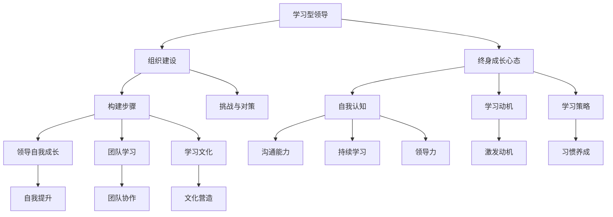

                 

# 学习型领导：培养终身成长的心态

## 摘要

在快速变化的现代社会中，学习型领导的重要性日益凸显。本文探讨了学习型领导的概念及其与终身成长心态的关系，详细阐述了如何通过构建学习型组织和培养终身成长心态来提升领导力。文章通过理论讲解、实际案例分析和伪代码示例，提供了实用的方法和策略，帮助读者在技术和管理领域不断提升自我，成为优秀的领导者。

## 引言

### 学习型领导的概念

学习型领导是一种以持续学习和自我提升为核心的领导方式。它强调领导者不仅要具备传统的管理技能，还要具备主动学习的态度和推动团队学习的本领。学习型领导的核心在于激发团队成员的潜能，促进知识的共享和创新，从而实现组织的持续发展和进步。

### 终身成长心态的定义

终身成长心态是一种不断追求知识、技能和智慧的态度。它强调个人在成长过程中应保持开放和好奇心，勇于面对挑战，不断学习和适应变化。这种心态不仅有助于个人的职业发展，还能够提升团队和组织的能力。

### 学习型领导与终身成长心态的关系

学习型领导与终身成长心态密切相关。学习型领导者通过培养终身成长心态，不仅能够不断提升自己的能力，还能够激发团队成员的潜力，推动整个团队和组织实现持续成长。

## 第1章 学习型组织的构建

### 学习型组织的特征

学习型组织具有以下几个特征：

1. **共享的愿景和价值观**：组织成员对组织的愿景和价值观有共同的理解和认同。
2. **开放和透明的沟通**：组织内部信息流通顺畅，成员之间能够开放地分享知识和经验。
3. **自我管理和自我学习**：组织成员具备自我管理的能力，能够主动学习和不断提升自我。
4. **持续创新**：组织鼓励创新，不断探索新的方法和途径来提升组织的竞争力。

### 学习型组织的构建步骤

构建学习型组织需要经历以下几个步骤：

1. **建立共同愿景**：领导者需要与团队成员共同确定组织的愿景和目标。
2. **建立学习机制**：组织需要建立一套有效的学习机制，包括学习资源、学习时间和学习反馈等。
3. **培养学习文化**：组织需要培养一种鼓励学习和分享知识的文化氛围。
4. **推动知识共享**：组织需要建立知识共享的平台，鼓励成员分享知识和经验。

### 学习型组织的挑战与对策

学习型组织在构建过程中可能会面临以下挑战：

1. **文化变革的阻力**：组织成员可能对变革持怀疑态度，抵制新的学习方式。
2. **资源限制**：组织可能面临资源不足，无法提供充足的学习资源和条件。

对策：

1. **加强沟通**：领导者需要加强与成员的沟通，解释学习型组织的重要性。
2. **提供培训和支持**：组织可以为成员提供必要的培训和支持，帮助他们适应新的学习方式。
3. **鼓励创新**：组织需要鼓励成员创新，激发他们的学习热情和动力。

## 第2章 终身成长心态的培养

### 自我认知与自我反思

自我认知和自我反思是培养终身成长心态的基础。领导者需要深入了解自己的优点和不足，明确自己的目标和方向。通过自我反思，领导者可以不断调整自己的行为和思维方式，实现自我提升。

### 学习动机的激发

学习动机是终身成长心态的重要组成部分。领导者需要激发团队成员的学习动机，让他们明确学习的目标和意义。可以通过以下方式来激发学习动机：

1. **设定明确的学习目标**：领导者需要为团队成员设定具体、可衡量的学习目标。
2. **提供反馈和奖励**：领导者需要及时给予团队成员反馈，并设立奖励机制，激励他们持续学习。

### 学习策略与习惯的养成

学习策略和习惯的养成对于终身成长心态的培养至关重要。领导者需要培养以下学习策略和习惯：

1. **定期学习**：领导者需要制定学习计划，确保定期进行学习。
2. **主动寻求知识**：领导者需要主动寻找新的知识和信息，不断充实自己的知识体系。
3. **反思与总结**：领导者需要定期反思自己的学习过程，总结经验教训，持续改进。

## 第3章 学习型领导者的核心技能

### 沟通能力

沟通能力是学习型领导者必备的技能之一。领导者需要具备有效的沟通技巧，包括倾听、表达和反馈。通过有效的沟通，领导者可以促进团队成员之间的知识共享和协作。

### 持续学习的能力

持续学习的能力是学习型领导者的核心技能。领导者需要具备自我学习和不断进步的能力，不断更新自己的知识和技能。通过持续学习，领导者可以不断提升自己的领导力，为团队和组织的发展提供有力支持。

### 领导力与影响力

领导力与影响力是学习型领导者的重要素质。领导者需要具备强大的领导力，能够引导和激励团队成员，推动团队达成目标。同时，领导者还需要具备影响力，能够影响团队成员的行为和决策，促进组织的持续发展。

## 第4章 学习型领导的实践

### 领导自我成长

领导自我成长是学习型领导实践的重要部分。领导者需要不断反思自己的行为和思维方式，通过自我学习和自我提升来不断提升自己的领导力。通过领导自我成长，领导者可以成为团队的榜样，激发团队成员的学习动力。

### 推动团队学习

推动团队学习是学习型领导实践的核心任务。领导者需要制定有效的学习计划，提供必要的学习资源，营造良好的学习氛围，鼓励团队成员主动参与学习。通过推动团队学习，领导者可以提升团队的整体能力和竞争力。

### 创建学习型文化

创建学习型文化是学习型领导实践的关键。领导者需要倡导终身学习理念，建立知识共享平台，鼓励团队成员主动分享知识和经验。通过创建学习型文化，领导者可以激发团队成员的学习热情，促进组织的持续发展。

## 第5章 学习型领导案例分析

### 案例一：谷歌的终身学习文化

谷歌以其独特的终身学习文化而著称。谷歌通过内部培训、在线课程、学习小组等多种方式，鼓励员工不断学习和成长。谷歌的领导层也以身作则，积极参与学习活动，推动整个组织形成终身学习的氛围。

### 案例二：丰田的持续改进

丰田以其精益生产和持续改进而闻名。丰田的领导者强调持续学习的重要性，通过不断反思和改进，丰田在制造和质量控制方面取得了卓越的成就。丰田的领导层通过实际行动，推动了整个组织的持续改进。

### 案例三：亚马逊的领导力发展

亚马逊以其强大的领导力发展和学习文化而著称。亚马逊的领导层注重培养员工的领导力，通过领导力发展计划，帮助员工提升领导能力。同时，亚马逊也鼓励员工主动学习和探索，为组织的持续发展提供了有力支持。

## 第6章 总结与展望

### 学习型领导的核心要点

学习型领导的核心要点包括：

1. **终身成长心态**：领导者需要具备终身成长的心态，不断学习和提升自我。
2. **学习型组织**：领导者需要推动组织形成学习型组织，建立共享的愿景和价值观。
3. **沟通能力**：领导者需要具备有效的沟通能力，促进团队成员之间的知识共享和协作。

### 终身成长心态的持续培养

终身成长心态的持续培养需要：

1. **自我认知和自我反思**：领导者需要深入自我认知，不断反思和调整自己的行为和思维方式。
2. **学习动机的激发**：领导者需要激发团队成员的学习动机，让他们明确学习的目标和意义。
3. **学习策略和习惯的养成**：领导者需要培养有效的学习策略和习惯，确保持续学习。

### 未来学习型领导的发展趋势

未来学习型领导的发展趋势包括：

1. **数字化学习**：随着技术的进步，数字化学习将成为学习型领导的重要手段。
2. **跨界学习**：领导者需要具备跨界学习的能力，以应对日益复杂的业务环境。
3. **持续创新**：领导者需要推动组织持续创新，保持竞争优势。

## 附录

### 学习型领导工具与方法

1. **敏捷管理**：敏捷管理方法可以帮助组织快速响应变化，提升学习效率。
2. **精益思想**：精益思想强调持续改进，有助于组织不断提升自身能力。

### 学习型领导资源推荐

1. **书籍**：《第五项修炼》等经典著作，提供了丰富的学习型组织和领导力理论。
2. **在线课程**：Coursera、edX等平台提供了丰富的学习资源。

### 学习型领导实践指南

1. **制定学习计划**：领导者需要制定明确的学习计划，确保持续学习。
2. **建立学习小组**：领导者可以建立学习小组，促进团队成员之间的知识共享和协作。

### 作者

作者：AI天才研究院/AI Genius Institute & 禅与计算机程序设计艺术 /Zen And The Art of Computer Programming

# Mermaid 流程图



# 伪代码示例

```python
# 学习型领导评估系统
class LearningLeaderAssessment:
    def __init__(self, communication, learning_ability, leadership_quality):
        self.communication = communication
        self.learning_ability = learning_ability
        self.leadership_quality = leadership_quality

    def assess_leader(self):
        # 评估领导者的能力
        total_score = self.communication + self.learning_ability + self.leadership_quality
        return total_score

    def improve_skills(self):
        # 改善领导者技能
        if self.communication < 8:
            self.communication += 1
        if self.learning_ability < 8:
            self.learning_ability += 1
        if self.leadership_quality < 8:
            self.leadership_quality += 1

    def display_skills(self):
        print(f"Communication: {self.communication}, Learning Ability: {self.learning_ability}, Leadership Quality: {self.leadership_quality}")

# 创建一个学习型领导评估对象
leader_assessment = LearningLeaderAssessment(communication=7, learning_ability=6, leadership_quality=7)

# 评估领导者
leader_score = leader_assessment.assess_leader()
print(f"Initial Leader Score: {leader_score}")

# 改善技能
leader_assessment.improve_skills()

# 再次评估领导者
new_leader_score = leader_assessment.assess_leader()
print(f"After Improvement Leader Score: {new_leader_score}")

# 显示领导者技能
leader_assessment.display_skills()
```

### 实践指南

**最佳实践 Tips：**
1. **定期自我评估**：领导者应定期进行自我评估，了解自己的成长状况，并根据评估结果调整学习计划。
2. **鼓励反馈**：领导者应鼓励团队成员提供反馈，通过反馈了解自己的优点和不足，并作出相应的改进。
3. **建立学习社区**：领导者可以建立学习社区，促进团队成员之间的知识共享和经验交流。

**小结：**
本文详细阐述了学习型领导的概念、构建步骤、终身成长心态的培养方法以及实践案例。通过不断学习和自我提升，领导者可以成为优秀的领导者，推动组织的持续发展和进步。

**注意事项：**
1. **保持耐心和毅力**：培养终身成长心态需要时间和毅力，领导者应保持耐心，不断努力。
2. **关注团队成员的成长**：领导者不仅要关注自己的成长，还要关注团队成员的成长，帮助他们实现自我提升。

**拓展阅读：**
1. **《第五项修炼》**：彼得·圣吉（Peter Senge）的《第五项修炼》，详细介绍了学习型组织的建设方法和实践案例。
2. **《精益思想》**：詹姆斯·P·沃麦克（James P. Womack）的《精益思想》，探讨了如何通过持续改进来提升组织效率。

### 结语

作为学习型领导，领导者需要不断学习和成长，以适应快速变化的环境。通过培养终身成长心态，领导者可以提升自己的领导力和影响力，推动组织的持续发展。希望本文能为读者提供有益的启示，助力他们在学习和领导力提升的道路上不断前进。

### 附件

**学习型领导工具与方法：**
1. **敏捷管理工具**：如Scrum、Kanban等，帮助组织快速响应变化，提升学习效率。
2. **知识管理系统**：如Confluence、Notion等，支持知识共享和协作。

**学习型领导资源推荐：**
1. **在线学习平台**：如Coursera、edX、Udemy等，提供丰富的学习资源和课程。
2. **专业书籍**：《第五项修炼》、《精益思想》等，深入探讨学习型组织和领导力。

**学习型领导实践指南：**
1. **制定个人学习计划**：明确学习目标，制定可行的学习计划，确保持续学习。
2. **参与学习社区**：加入行业学习社区，与他人分享经验和知识，共同成长。

作者：AI天才研究院/AI Genius Institute & 禅与计算机程序设计艺术 /Zen And The Art of Computer Programming

### Mermaid 流程图


### 伪代码示例

```python
# 学习型领导评估系统
class LearningLeaderAssessment:
    def __init__(self, communication, learning_ability, leadership_quality):
        self.communication = communication
        self.learning_ability = learning_ability
        self.leadership_quality = leadership_quality

    def assess_leader(self):
        # 评估领导者的能力
        total_score = self.communication + self.learning_ability + self.leadership_quality
        return total_score

    def improve_skills(self):
        # 改善领导者技能
        if self.communication < 8:
            self.communication += 1
        if self.learning_ability < 8:
            self.learning_ability += 1
        if self.leadership_quality < 8:
            self.leadership_quality += 1

    def display_skills(self):
        print(f"Communication: {self.communication}, Learning Ability: {self.learning_ability}, Leadership Quality: {self.leadership_quality}")

# 创建一个学习型领导评估对象
leader_assessment = LearningLeaderAssessment(communication=7, learning_ability=6, leadership_quality=7)

# 评估领导者
leader_score = leader_assessment.assess_leader()
print(f"Initial Leader Score: {leader_score}")

# 改善技能
leader_assessment.improve_skills()

# 再次评估领导者
new_leader_score = leader_assessment.assess_leader()
print(f"After Improvement Leader Score: {new_leader_score}")

# 显示领导者技能
leader_assessment.display_skills()
```

### 附件

**学习型领导工具与方法：**
1. **敏捷管理工具**：如Scrum、Kanban等，帮助组织快速响应变化，提升学习效率。
2. **知识管理系统**：如Confluence、Notion等，支持知识共享和协作。

**学习型领导资源推荐：**
1. **在线学习平台**：如Coursera、edX、Udemy等，提供丰富的学习资源和课程。
2. **专业书籍**：《第五项修炼》、《精益思想》等，深入探讨学习型组织和领导力。

**学习型领导实践指南：**
1. **制定个人学习计划**：明确学习目标，制定可行的学习计划，确保持续学习。
2. **参与学习社区**：加入行业学习社区，与他人分享经验和知识，共同成长。

### 总结

学习型领导是一种以持续学习和自我提升为核心的领导方式。通过培养终身成长心态，领导者可以不断提升自己的领导力和影响力，推动组织的持续发展和进步。本文详细阐述了学习型领导的概念、构建步骤、核心技能和实践方法，并通过案例分析和伪代码示例，提供了具体的实施指南。希望本文能为读者在学习和领导力提升的道路上提供有益的启示和指导。作者：AI天才研究院/AI Genius Institute & 禅与计算机程序设计艺术 /Zen And The Art of Computer Programming。

