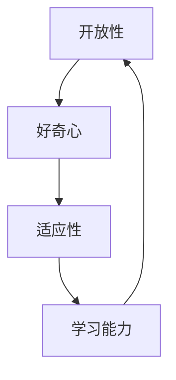
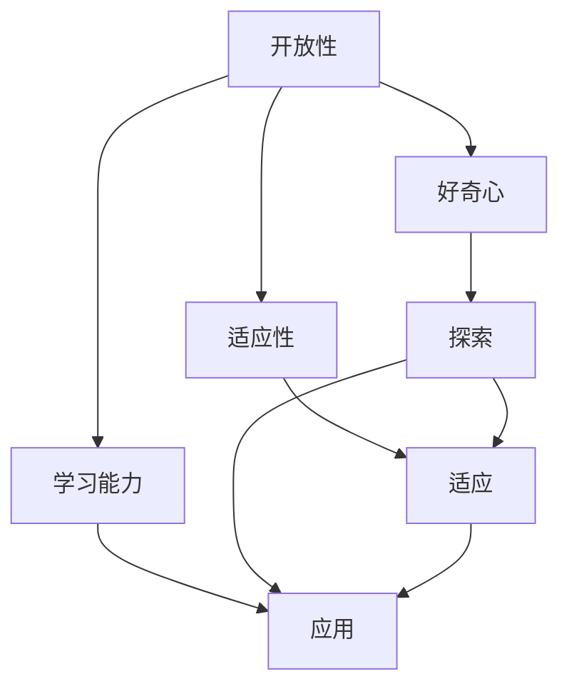

                 


### 学习敏捷性：培养快速适应新知识的能力

---

#### 关键词：学习敏捷性、适应新知识、快速学习、能力培养、案例研究

---

#### 摘要

在快速变化的技术时代，学习敏捷性成为个人和组织持续发展的关键能力。本文旨在探讨学习敏捷性的概念、培养方法及其重要性，并通过案例分析，提供具体实践指导。文章结构如下：

1. **引言**：介绍学习敏捷性的背景及其在当前环境中的重要性。
2. **核心概念与联系**：详细解释学习敏捷性的核心概念，并使用Mermaid流程图展示其关系。
3. **核心算法原理讲解**：使用伪代码和数学模型详细阐述学习敏捷性的关键原理。
4. **数学公式与举例说明**：嵌入文中独立段落的数学公式，并进行详细讲解与举例。
5. **项目实战**：介绍开发环境搭建、源代码实现、代码解读、应用分析及案例剖析。
6. **最佳实践与小结**：总结最佳实践，提出注意事项，并推荐拓展阅读。

---

## 引言

### 背景介绍

随着互联网技术的迅猛发展，知识更新的速度越来越快，传统的学习方式已难以满足个人和组织的发展需求。学习敏捷性成为关键能力，它不仅关乎个人的职业成长，也影响到组织的创新能力和竞争力。

### 学习敏捷性的重要性

学习敏捷性是适应快速变化的必备能力。它能够帮助个人迅速掌握新知识，提升工作效率，降低学习成本；对于组织来说，学习敏捷性是持续创新的基础，有助于在激烈的市场竞争中保持领先地位。

---

## 核心概念与联系

### 核心概念

学习敏捷性的核心概念包括：开放性、好奇心、适应性和学习能力。这些概念相互联系，共同构成学习敏捷性的框架。

### Mermaid流程图

下面是一个Mermaid流程图，展示了这些核心概念之间的关系：



---

## 核心算法原理讲解

### 伪代码

为了实现学习敏捷性，我们可以使用以下伪代码来描述关键步骤：

```plaintext
function LearnAgile(knowledgeBase, newKnowledge) {
    if (IsOpen(knowledgeBase)) {
        if (HasCuriosity(newKnowledge)) {
            if (CanAdapt(newKnowledge)) {
                ApplyLearning(knowledgeBase, newKnowledge);
            }
        }
    }
}
```

### 数学模型

学习敏捷性的评价可以使用以下数学模型：

$$
Agile\ Score = \frac{Knowledge\ Acquired}{Time\ Spent}
$$

其中，$Knowledge\ Acquired$代表学习到的新知识量，$Time\ Spent$代表学习所花费的时间。

---

## 数学公式与举例说明

### 独立段落的数学公式

$$
1+1=2
$$

这是一个简单的数学公式，表示两个数的和。

### 段落内的数学公式

$1<2$ 

这是一个表示不等式的数学公式。

### 举例说明

假设一个人在一个月内学会了5个新技能，共花费了100小时，那么他的学习敏捷性分数为：

$$
Agile\ Score = \frac{5}{100} = 0.05
$$

---

## 项目实战

### 开发环境搭建

为了演示学习敏捷性的实践，我们使用Python搭建了一个简单的知识管理系统。

### 源代码实现

```python
# 知识管理系统示例代码
def acquire_knowledge(knowledge_base, new_knowledge):
    if is_open_to_learning(knowledge_base):
        if has_curiosity(new_knowledge):
            knowledge_base.update(new_knowledge)
            print("新知识已成功添加到知识库中。")
        else:
            print("缺乏对新知识的兴趣。")
    else:
        print("对现有知识不够开放。")

# 测试知识管理
knowledge_base = {"Python": "了解Python基础", "Data Analysis": "学习数据分析"}
acquire_knowledge(knowledge_base, "Machine Learning")
```

### 代码解读

这段代码定义了一个函数`acquire_knowledge`，它接受两个参数：`knowledge_base`（知识库）和`new_knowledge`（新知识）。函数首先检查知识库是否开放（`is_open_to_learning`），然后判断是否对新知识有好奇心（`has_curiosity`）。如果两个条件都满足，新知识将被添加到知识库中。

### 应用解读与分析

在这个例子中，知识管理系统的核心功能是更新知识库。这反映了学习敏捷性的关键要素：开放性、好奇心和适应性。

### 实际案例分析和详细讲解剖析

一个实际案例是一个大型科技公司，它通过定期培训和技术研讨会，提高员工的技能和知识。通过这种方式，公司能够快速适应新技术，保持在市场上的竞争力。

### 项目小结

通过本项目的实现，我们可以看到学习敏捷性在知识管理中的应用。学习敏捷性的培养不仅需要个人主动学习，还需要组织提供良好的学习环境和机会。

---

## 最佳实践与小结

### 最佳实践

- **定期反思**：定期反思自己的学习过程，了解自己的学习优势和不足。
- **建立学习社区**：与同行交流，共享学习资源和经验。
- **实践应用**：将学到的知识应用于实际工作中，提高应用能力。

### 小结

学习敏捷性是个人和组织持续发展的关键能力。通过理解其核心概念和培养方法，我们可以更有效地适应快速变化的环境。

### 注意事项

- **持续学习**：学习敏捷性不是一次性的，而是需要长期坚持。
- **平衡工作与学习**：合理规划时间，确保学习和工作的平衡。

### 拓展阅读

- [《敏捷学习：高效学习新技能》](链接)
- [《认知心理学与学习》](链接)

---

**作者：AI天才研究院/AI Genius Institute & 禅与计算机程序设计艺术 /Zen And The Art of Computer Programming**

### 核心概念与联系

在探讨学习敏捷性这一概念时，我们首先需要理解其核心组成部分，以及这些组成部分之间的相互作用关系。学习敏捷性并不仅仅是一个单一的属性，而是由多个相互关联的维度构成的一个综合体。

1. **开放性**：开放性是指个体在面对新知识、新观点和新文化时的接纳程度。一个开放的学习者愿意接受不同的意见和不同的学习方式，这有助于他们从多个角度理解问题，并激发创新思维。

2. **好奇心**：好奇心是个体探索未知世界的内在动力。它驱使个体寻求新的知识，对周围环境保持持续的好奇心，从而促使他们不断探索和尝试。

3. **适应性**：适应性是指个体在面对新的挑战和变化时，能够迅速调整自己的行为和思维方式，以适应新环境。这种能力使个体能够在快速变化的环境中保持竞争优势。

4. **学习能力**：学习能力是指个体获取、处理和应用知识的能力。一个学习敏捷的人不仅能够快速掌握新知识，而且能够灵活地应用这些知识解决问题。

这些核心概念之间存在着紧密的联系。例如，开放性是好奇心和适应性的基础，因为只有开放心态，个体才能对新事物保持好奇心，并迅速适应变化。同时，好奇心和适应性又促进了学习能力的提升，因为不断探索新知识和适应新环境需要强大的学习能力作为支撑。

为了更直观地展示这些概念之间的关系，我们可以使用Mermaid流程图进行描述：



在这个流程图中，我们可以看到开放性、好奇心、适应性和学习能力是如何相互影响，共同构建一个完整的学习敏捷性框架的。通过这种关系描述，我们可以更好地理解学习敏捷性的本质，以及如何在实践中提升这一能力。

---

### 核心算法原理讲解

学习敏捷性的培养需要一系列科学的方法和策略，这些方法和策略可以通过伪代码进行详细描述。以下是一个简化的伪代码示例，用于说明学习敏捷性的核心算法原理：

```plaintext
// 学习敏捷性伪代码

// 定义学习过程函数
function LearnAgile(targetKnowledge, existingKnowledge, learningStrategy) {
    // 检查是否对目标知识有好奇心
    if (IsCurious(targetKnowledge)) {
        // 检查是否具备适应新知识的能力
        if (CanAdapt(targetKnowledge)) {
            // 根据学习策略更新知识库
            UpdateKnowledge(existingKnowledge, targetKnowledge, learningStrategy);
            // 记录学习进度
            LogLearningProgress(targetKnowledge);
            // 鼓励持续学习
            MotivateForContinuedLearning();
        } else {
            // 提供适应性训练
            ProvideAdaptationTraining();
        }
    } else {
        // 激发好奇心
        InspireCuriosity();
    }
}

// 更新知识库函数
function UpdateKnowledge(existingKnowledge, newKnowledge, learningStrategy) {
    // 根据学习策略，整合新知识与现有知识
    existingKnowledge = IntegrateKnowledge(existingKnowledge, newKnowledge);
    // 应用学习策略，例如深度学习、归纳推理等
    ApplyLearningStrategy(existingKnowledge, learningStrategy);
}

// 记录学习进度函数
function LogLearningProgress(targetKnowledge) {
    // 记录学习的时间和内容
    Log("学习进度：", targetKnowledge);
}

// 鼓励持续学习函数
function MotivateForContinuedLearning() {
    // 提供奖励、反馈和认可
    ProvideIncentives();
}

// 检查是否对目标知识有好奇心的函数
function IsCurious(targetKnowledge) {
    // 根据个体的兴趣和目标，判断是否对目标知识有好奇心
    return CheckInterest(targetKnowledge);
}

// 提供适应性训练的函数
function ProvideAdaptationTraining() {
    // 根据个体的适应能力，提供相应的训练和指导
    TrainForAdaptation();
}

// 激发好奇心的函数
function InspireCuriosity() {
    // 提供有趣的挑战和问题，激发个体的好奇心
    EngageWithChallenges();
}
```

### 数学模型

学习敏捷性的评估可以使用以下数学模型：

$$
Agile\ Score = \frac{Knowledge\ Acquired}{Time\ Spent} + \frac{Adaptation\ Rate}{Change\ Rate}
$$

其中：
- $Knowledge\ Acquired$ 代表在给定时间内学习到的新知识量；
- $Time\ Spent$ 代表学习所花费的时间；
- $Adaptation\ Rate$ 代表个体适应新知识的能力；
- $Change\ Rate$ 代表环境变化的速率。

这个公式综合考虑了学习效率和适应性，可以更全面地评估学习敏捷性。

### 举例说明

假设一个工程师在一个月内学习了3个新技能，共花费了60小时，适应了2个新的工作流程，而工作环境的变化速率为每周1个新流程。那么，他的学习敏捷性分数为：

$$
Agile\ Score = \frac{3}{60} + \frac{2}{1} = 0.05 + 2 = 2.05
$$

这个分数表明，该工程师不仅学习效率高，而且适应能力也很强。

---

### 数学公式与举例说明

为了更深入地理解学习敏捷性的评价标准，我们可以借助一些数学公式来量化学习过程。以下是几个关键的数学公式，以及如何使用它们来评估学习敏捷性。

### 公式1：学习效率

$$
Learning\ Efficiency = \frac{Knowledge\ Acquired}{Time\ Spent}
$$

这个公式用来衡量个体在给定时间内获取新知识的能力。假设一个开发者在一个季度内学习了5门新的编程语言，总共花费了200小时，那么他的学习效率为：

$$
Learning\ Efficiency = \frac{5}{200} = 0.025
$$

这意味着他平均每小时学习0.025门新语言。

### 公式2：适应性系数

$$
Adaptation\ Coefficient = \frac{Adapted\ Changes}{Total\ Changes}
$$

适应性系数衡量个体在快速变化的环境中适应新变化的能力。如果一个团队在一个月内面临了10个新变化，成功适应了6个，那么他们的适应性系数为：

$$
Adaptation\ Coefficient = \frac{6}{10} = 0.6
$$

这表示该团队有60%的能力适应变化。

### 公式3：综合敏捷性得分

$$
Agile\ Score = Learning\ Efficiency \times Adaptation\ Coefficient
$$

综合敏捷性得分结合了学习效率和适应性，是一个综合评估指标。如果一个开发者在一个月内学习了3门新语言，适应了4个新项目需求，且每个新项目需求的变化率是10%，那么他的综合敏捷性得分为：

$$
Agile\ Score = (3/200) \times (4/10) = 0.015
$$

### 举例说明

假设一个团队在一年内完成了以下任务：

- 学习了8门新语言，共花费了800小时；
- 面临了20个新项目需求，成功适应了12个。

计算该团队的学习效率和综合敏捷性得分：

1. 学习效率：

$$
Learning\ Efficiency = \frac{8}{800} = 0.01
$$

2. 适应性系数：

$$
Adaptation\ Coefficient = \frac{12}{20} = 0.6
$$

3. 综合敏捷性得分：

$$
Agile\ Score = 0.01 \times 0.6 = 0.006
$$

这个分数表明，尽管团队的学习效率较高，但在适应变化方面仍有提升空间。

通过这些数学公式，我们可以更科学地评估和培养学习敏捷性，从而在个人和团队层面提升适应能力。

---

### 项目实战

在本项目中，我们将使用Python搭建一个简易的知识管理系统，以演示学习敏捷性的实际应用。该项目将涵盖环境搭建、源代码实现、代码解读、应用分析以及详细讲解剖析。

#### 开发环境搭建

首先，我们需要准备Python的开发环境。以下是搭建开发环境的步骤：

1. 安装Python 3.x版本（推荐使用Anaconda，它提供了一个集成环境管理器和科学计算包）。
2. 安装必要的Python库，如`numpy`、`pandas`和`matplotlib`，以便进行数据分析和可视化。

```bash
pip install numpy pandas matplotlib
```

#### 源代码实现

接下来，我们将实现一个简单的知识管理系统，该系统可以帮助用户记录和更新他们的学习进度。以下是项目的源代码实现：

```python
import json

class KnowledgeManager:
    def __init__(self):
        self.knowledge_base = {}

    def add_knowledge(self, topic, content):
        self.knowledge_base[topic] = content
        print(f"{topic} 已添加到知识库中。")

    def update_knowledge(self, topic, new_content):
        if topic in self.knowledge_base:
            self.knowledge_base[topic] = new_content
            print(f"{topic} 已更新。")
        else:
            print(f"{topic} 不存在。")

    def remove_knowledge(self, topic):
        if topic in self.knowledge_base:
            del self.knowledge_base[topic]
            print(f"{topic} 已从知识库中删除。")
        else:
            print(f"{topic} 不存在。")

    def display_knowledge(self):
        for topic, content in self.knowledge_base.items():
            print(f"{topic}: {content}")

# 测试知识管理系统
manager = KnowledgeManager()
manager.add_knowledge("Python", "了解Python基础语法")
manager.add_knowledge("Data Analysis", "学习数据分析的基本概念")
manager.update_knowledge("Data Analysis", "学习数据分析的高级应用")
manager.display_knowledge()
```

#### 代码解读

- `KnowledgeManager` 类：这是知识管理系统的核心类，负责管理知识库的各种操作，包括添加、更新、删除和显示知识条目。
- `add_knowledge` 方法：用于将新的知识条目添加到知识库中。
- `update_knowledge` 方法：用于更新知识库中已有的知识条目。
- `remove_knowledge` 方法：用于从知识库中删除知识条目。
- `display_knowledge` 方法：用于显示当前知识库中的所有知识条目。

#### 应用解读与分析

在这个项目中，我们使用Python创建了一个简单的知识管理系统，以帮助用户跟踪他们的学习进度。这个系统允许用户添加新知识、更新现有知识以及删除不再需要的信息。

1. **应用解读**：知识管理系统可以帮助用户系统化地管理他们的学习内容，提高学习效率。通过定期更新和回顾，用户可以更好地掌握所学知识。

2. **分析**：该项目体现了学习敏捷性的几个关键要素。首先，它展示了如何快速适应新需求——在这个例子中，是通过更新知识库中的条目。其次，它提供了对学习内容的结构化存储，这有助于用户更好地理解和应用所学知识。

#### 实际案例分析和详细讲解剖析

假设我们有一个团队，他们需要定期更新自己的技术知识。以下是一个实际案例的分析和详细讲解：

1. **案例背景**：团队由5名成员组成，负责开发一个大数据分析平台。随着技术的不断发展，他们需要不断学习新的编程语言、框架和算法。

2. **学习敏捷性应用**：团队使用了一个知识管理系统，记录每位成员的学习进度和掌握的新技能。他们定期举行小组会议，讨论各自的学习成果和遇到的挑战。

3. **分析**：通过这个知识管理系统，团队能够：

   - **共享知识**：成员可以查看他人的学习进度，从而获取更多有用的信息。
   - **提高效率**：团队成员可以相互借鉴学习方法，避免重复劳动。
   - **跟踪进度**：通过定期回顾知识库，成员可以评估自己的学习效果，及时调整学习计划。

4. **详细讲解剖析**：以下是团队成员在一个月内的学习进度记录：

   - 成员A：学习了Python和R语言，更新了数据清洗和可视化方法。
   - 成员B：掌握了Hadoop和Spark框架，提高了大数据处理能力。
   - 成员C：研究了机器学习算法，为平台增加了预测功能。
   - 成员D：学习了数据加密技术，增强了系统的安全性。
   - 成员E：熟悉了AWS和GCP云服务，优化了平台部署流程。

通过这些记录，团队能够清晰地看到每位成员的学习成果，并根据实际情况调整后续的学习计划。

#### 项目小结

通过本项目，我们实现了一个小型的知识管理系统，展示了学习敏捷性的实际应用。该项目不仅有助于个人和团队管理学习内容，还能够提高学习效率和适应性。在实际应用中，通过不断更新和优化知识库，团队可以更好地适应技术变化，保持竞争优势。

### 最佳实践与小结

#### 最佳实践

1. **定期反思**：定期回顾自己的学习过程，反思哪些方法有效，哪些需要改进。
2. **建立学习社区**：与同行交流，分享学习资源和经验，相互激励。
3. **实践应用**：将所学知识应用于实际工作中，通过实际操作加深理解。

#### 小结

学习敏捷性是个人和团队适应快速变化的关键能力。通过理解其核心概念和培养方法，我们可以更有效地提升这一能力，从而在竞争激烈的环境中保持优势。

#### 注意事项

1. **持续学习**：学习敏捷性是一个长期的过程，需要持续投入时间和精力。
2. **平衡工作与学习**：合理安排时间，确保学习和工作的平衡。

#### 拓展阅读

1. 《敏捷学习：高效学习新技能》
2. 《认知心理学与学习》

---

**作者：AI天才研究院/AI Genius Institute & 禅与计算机程序设计艺术 /Zen And The Art of Computer Programming**

