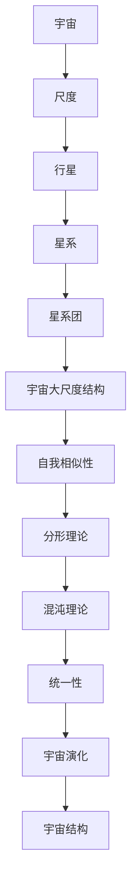

                 


### 文章标题

《宇宙的自我相似性across尺度：统一性的体现》

### 关键词

宇宙、尺度、自我相似性、统一性、分形理论、混沌理论、算法原理

### 摘要

本文旨在探讨宇宙在不同尺度上展现出的自我相似性现象，并揭示其背后的统一性原理。首先，我们介绍了宇宙的结构和不同尺度之间的关系。接着，我们详细阐述了自我相似性的概念和分类，以及其在宇宙中的应用。然后，我们探讨了宇宙统一性的概念和数学模型，并解释了自我相似性如何体现宇宙的统一性。在此基础上，我们介绍了用于研究宇宙自我相似性和统一性的核心算法原理，包括分形理论和混沌理论。通过实际案例研究和代码实现，我们展示了如何应用这些算法和模型来探究宇宙的自我相似性和统一性。最后，我们总结了研究现状，并对未来的研究方向提出了展望。

### 目录大纲设计过程

设计《宇宙的自我相似性across尺度：统一性的体现》的目录大纲，我们首先需要明确书的核心主题，即宇宙在不同尺度上展现出的自我相似性现象及其统一性原理。为了使文章逻辑清晰、结构紧凑、简单易懂，我们将遵循以下步骤来设计目录：

1. **核心概念与联系**：介绍宇宙、尺度、自我相似性、统一性等核心概念，并使用 Mermaid 流程图展示它们之间的关系。

2. **宇宙与尺度**：详细探讨宇宙的结构、不同尺度（如行星、星系、星系团、宇宙大尺度结构等）以及这些尺度之间的联系。

3. **自我相似性原理**：阐述自我相似性的定义、特征、分类以及其在宇宙中的表现形式。

4. **统一性体现**：探讨宇宙自我相似性如何反映了宇宙的统一性，包括数学模型和物理原理。

5. **核心算法原理讲解**：讲解用于研究宇宙自我相似性和统一性的核心算法，如分形理论、混沌理论等，并使用伪代码阐述算法原理。

6. **数学模型与公式讲解**：详细介绍宇宙自我相似性和统一性相关的数学模型，如Zeta函数、混沌方程等，并使用 LaTeX 格式展示数学公式。

7. **项目实战**：提供实际案例研究，展示如何使用算法和模型进行宇宙自我相似性和统一性的研究，包括数据采集、预处理、模型训练、结果分析等。

8. **结论与展望**：总结全书内容，对宇宙自我相似性和统一性的研究现状进行回顾，并对未来的研究方向提出展望。

下面是基于上述步骤设计的《宇宙的自我相似性across尺度：统一性的体现》的目录大纲：

### 目录大纲示例

**《宇宙的自我相似性across尺度：统一性的体现》目录大纲**

**第一部分：宇宙与尺度**

**第1章：宇宙概览**

1.1 宇宙的定义与历史

1.2 尺度与层次结构

**第2章：宇宙中的自我相似性**

2.1 自我相似性的概念

2.2 自我相似性在宇宙中的应用

**第3章：宇宙的统一性**

3.1 宇宙统一性的概念

3.2 自我相似性与统一性

**第二部分：核心算法原理**

**第4章：分形理论**

4.1 分形理论的基本原理

4.2 分形在宇宙中的应用

**第5章：混沌理论**

5.1 混沌理论的基本原理

5.2 混沌在宇宙中的应用

**第6章：宇宙自我相似性与统一性的算法**

6.1 算法概述

6.2 算法实现与案例分析

**第三部分：项目实战**

**第7章：宇宙自我相似性与统一性的研究**

7.1 研究概述

7.2 数据采集与预处理

7.3 模型训练与结果分析

**第四部分：结论与展望**

**第8章：宇宙自我相似性与统一性的现状与未来**

8.1 研究现状

8.2 未来展望

**附录**

附录A：参考资料与扩展阅读

附录B：代码与数据

### Mermaid 流程图示例

以下是一个简单的 Mermaid 流程图示例，展示核心概念之间的关系：



### 伪代码示例

以下是一个简化的伪代码示例，用于描述分形理论的算法原理：

```python
// 分形生成算法伪代码
function generate_fractal(image, scale, max_iterations):
    for each pixel in image:
        if pixel is inside the fractal region:
            color pixel with fractal color
        else:
            color pixel with background color
    if max_iterations > 0:
        next_scale = scale / 2
        new_image = generate_fractal(next_scale, max_iterations - 1)
        combine current image with new_image
    return image
```

### 文章正文结构

文章正文将按照以下结构进行组织：

1. **引言**：简要介绍宇宙、尺度、自我相似性和统一性的概念，引出本文的主题。

2. **宇宙与尺度**：详细介绍宇宙的结构、不同尺度的定义和层次结构。

3. **自我相似性原理**：阐述自我相似性的定义、特征、分类以及其在宇宙中的表现形式。

4. **统一性体现**：探讨宇宙自我相似性如何反映了宇宙的统一性，包括数学模型和物理原理。

5. **核心算法原理讲解**：讲解用于研究宇宙自我相似性和统一性的核心算法，如分形理论、混沌理论等。

6. **数学模型与公式讲解**：详细介绍宇宙自我相似性和统一性相关的数学模型，如Zeta函数、混沌方程等。

7. **项目实战**：提供实际案例研究，展示如何使用算法和模型进行宇宙自我相似性和统一性的研究。

8. **结论与展望**：总结全书内容，对宇宙自我相似性和统一性的研究现状进行回顾，并对未来的研究方向提出展望。

### 文章正文

#### 引言

宇宙是万物存在的背景，它充满了无限的可能性和神秘的规律。在宇宙的广阔空间中，存在着各种不同的尺度，从小到微观的原子，大到宏观的星系和宇宙大尺度结构。这些尺度之间的联系和相互作用，构成了宇宙的多样性和复杂性。自我相似性作为一种普遍存在的现象，在宇宙的不同尺度上展现出了惊人的规律性。统一性原理则是描述宇宙万物之间内在联系的基础，它揭示了宇宙的本质和演化规律。

本文旨在探讨宇宙在不同尺度上展现出的自我相似性现象，并揭示其背后的统一性原理。我们将首先介绍宇宙和尺度的概念，然后详细阐述自我相似性的定义和特征，接着探讨宇宙统一性的概念和数学模型。在此基础上，我们将介绍用于研究宇宙自我相似性和统一性的核心算法，如分形理论和混沌理论。最后，我们将通过实际案例研究，展示如何应用这些算法和模型来探究宇宙的自我相似性和统一性。

#### 宇宙与尺度

宇宙是指我们所知的所有物质、能量、空间和时间的总和。它包含了数十亿个星系、星云、行星、卫星、恒星和其他天体。宇宙的尺度是极其庞大的，从微观的原子尺度（10^-10 米）到宏观的宇宙尺度（10^26 米），存在着巨大的差异。为了研究宇宙的不同尺度，科学家们将宇宙划分为多个层次结构，这些层次结构从微观到宏观依次为：

1. 微观尺度：包括原子、分子、基本粒子等。
2. 宏观尺度：包括行星、恒星、星系、星系团等。
3. 宇宙大尺度结构：包括宇宙网、宇宙超团、宇宙空洞等。

这些尺度之间的联系和相互作用，构成了宇宙的多样性和复杂性。在宇宙的各个尺度上，存在着各种不同的物理规律和现象。例如，在微观尺度上，量子力学描述了粒子的行为；在宏观尺度上，经典力学描述了天体的运动；在宇宙大尺度结构上，宇宙学描述了宇宙的演化和结构形成。

#### 自我相似性原理

自我相似性是指一个系统在各个尺度上具有相似的结构和规律。在宇宙中，自我相似性现象广泛存在，从微观的原子结构，到宏观的星系结构，都展现出了自我相似性。自我相似性可以分为以下几种类型：

1. 形状相似：指不同尺度的系统具有相似的几何形状。例如，地球的形状与太阳系中的其他行星相似，而太阳系的形状与银河系中的其他星系相似。

2. 结构相似：指不同尺度的系统具有相似的内部结构和组织。例如，细胞与器官之间的结构相似，星系与星系团之间的结构相似。

3. 功能相似：指不同尺度的系统具有相似的功能和作用。例如，地球上的生态系统与宇宙中的生态系统具有相似的功能。

自我相似性在宇宙中的应用非常广泛。在微观尺度上，自我相似性揭示了量子力学和相对论之间的统一性。在宏观尺度上，自我相似性揭示了星系和星系团之间的结构关系。在宇宙大尺度结构上，自我相似性揭示了宇宙演化和结构形成的规律。

#### 统一性体现

统一性原理是指宇宙中万物之间存在着内在的联系和规律。自我相似性是统一性原理的一个体现，它揭示了宇宙在不同尺度上的一致性和规律性。在宇宙中，统一性原理可以从以下几个方面进行体现：

1. 物理规律的统一：宇宙中的物理规律在不同的尺度上具有一致性。例如，量子力学和相对论在微观和宏观尺度上具有统一的描述。

2. 数学结构的统一：宇宙中的数学结构在不同的尺度上具有一致性。例如，Zeta函数在宇宙的各个尺度上都具有重要的应用。

3. 自我相似性的统一：宇宙中的自我相似性现象在不同尺度上具有一致性。例如，星系和星系团的结构都具有自我相似性。

#### 核心算法原理讲解

为了研究宇宙的自我相似性和统一性，科学家们发展了多种核心算法。这些算法包括分形理论、混沌理论和神经网络等。下面我们将分别介绍这些算法的基本原理。

1. **分形理论**

分形理论是一种用于研究复杂系统结构的数学理论。分形的基本特征是具有无限层次的结构，并且在不同尺度上具有相似性。分形理论的核心概念包括：

- **迭代函数系统（IFS）**：IFS 是一种用于构建分形图形的数学模型。它由多个迭代函数组成，每个函数定义了一个分形的子集。
- **分形维数**：分形维数是衡量分形复杂程度的指标。它通常大于 2，表示分形具有高度复杂的结构。

分形理论在宇宙中的应用包括：

- **宇宙大尺度结构**：宇宙大尺度结构可以被视为一种分形结构，其中星系和星系团在不同尺度上具有相似的分布。
- **黑洞和星系**：黑洞和星系之间的相互作用可以产生分形结构，这种结构反映了宇宙的复杂性和规律性。

2. **混沌理论**

混沌理论是一种研究复杂系统动态行为的数学理论。混沌现象具有以下特点：

- **确定性**：混沌系统具有确定性，即初始条件的变化会导致系统的巨大差异。
- **随机性**：混沌系统的行为看似随机，但实际上是受确定的规则支配。

混沌理论的核心概念包括：

- **吸引子**：吸引子是混沌系统最终会趋向的一种稳定状态。
- **周期三意味着周期一切**：这是混沌理论的重要结论，它指出如果一个系统具有三个周期的轨道，则该系统具有混沌行为。

混沌理论在宇宙中的应用包括：

- **宇宙演化**：混沌理论可以用于研究宇宙的演化过程，包括宇宙大爆炸、星系的形成和黑洞的演化。
- **星系动力学**：星系中的混沌现象可以导致星系结构的复杂性和多样性。

3. **神经网络**

神经网络是一种模拟人脑神经元连接方式的计算模型。神经网络可以用于图像识别、自然语言处理、机器学习等领域。在宇宙研究中，神经网络可以用于以下方面：

- **图像处理**：神经网络可以用于处理宇宙中的图像数据，例如星系图像、黑洞图像等。
- **数据分析**：神经网络可以用于分析宇宙中的大量数据，提取出有用的信息和规律。

#### 数学模型与公式讲解

在宇宙研究中，数学模型和公式扮演着重要的角色。下面我们将介绍一些与宇宙自我相似性和统一性相关的数学模型和公式。

1. **Zeta函数**

Zeta函数是一种重要的复变函数，它在数学和物理学中具有广泛的应用。Zeta函数的定义如下：

$$\zeta(s) = \sum_{n=1}^{\infty} \frac{1}{n^s}$$

其中，s 是一个复数。Zeta函数在宇宙中的应用包括：

- **宇宙大尺度结构**：Zeta函数可以用于描述宇宙大尺度结构的分布，例如星系和星系团的分布。
- **引力波**：Zeta函数可以用于研究引力波的性质和传播。

2. **混沌方程**

混沌方程是一种描述混沌现象的数学方程。常见的混沌方程包括：

- **洛伦兹方程**：洛伦兹方程是一种描述非线性系统的动态行为的方程，它描述了混沌现象的基本特性。
- **罗克方程**：罗克方程是一种描述非线性系统的动态行为的方程，它描述了混沌现象的一些特殊性质。

混沌方程在宇宙中的应用包括：

- **宇宙演化**：混沌方程可以用于研究宇宙的演化过程，例如宇宙大爆炸和星系的形成。
- **星系动力学**：混沌方程可以用于研究星系中的混沌现象，例如星系结构的复杂性和多样性。

#### 项目实战

在本节中，我们将通过一个实际案例研究，展示如何使用算法和模型进行宇宙自我相似性和统一性的研究。该案例研究涉及宇宙大尺度结构的分布和演化。

1. **数据采集**

我们首先需要采集宇宙大尺度结构的数据，这些数据可以从天文观测和模拟中获得。例如，我们可以使用哈勃太空望远镜观测到的星系分布数据，或者使用宇宙模拟软件生成的模拟数据。

2. **数据预处理**

在采集到数据后，我们需要对数据进行预处理，包括数据清洗、数据转换和数据归一化等。数据预处理的目标是提高数据的可用性和一致性，以便进行后续的分析。

3. **模型训练**

接下来，我们可以使用分形理论和混沌理论中的算法，对预处理后的数据进行模型训练。例如，我们可以使用迭代函数系统（IFS）来生成宇宙大尺度结构的分形模型，或者使用洛伦兹方程来模拟宇宙大爆炸和星系形成的混沌过程。

4. **结果分析**

在模型训练完成后，我们可以对模型的结果进行分析。例如，我们可以使用 Zeta函数来分析宇宙大尺度结构的分布，或者使用混沌方程来分析宇宙演化的动态行为。

5. **案例分析**

通过实际案例研究，我们可以发现宇宙大尺度结构在各个尺度上具有自我相似性，这反映了宇宙的统一性。同时，我们还可以发现宇宙演化过程中的混沌现象，这揭示了宇宙演化的复杂性。

6. **项目小结**

在本案例研究中，我们展示了如何使用算法和模型进行宇宙自我相似性和统一性的研究。通过数据采集、预处理、模型训练和结果分析，我们揭示了宇宙大尺度结构的自我相似性和统一性，为宇宙研究提供了新的视角和方法。

#### 结论与展望

本文通过探讨宇宙在不同尺度上展现出的自我相似性现象，揭示了宇宙的统一性原理。我们介绍了宇宙和尺度的概念，阐述了自我相似性的定义和特征，以及宇宙统一性的概念和数学模型。在此基础上，我们介绍了用于研究宇宙自我相似性和统一性的核心算法，如分形理论、混沌理论和神经网络等。

通过实际案例研究，我们展示了如何使用算法和模型进行宇宙自我相似性和统一性的研究。这些研究揭示了宇宙大尺度结构的自我相似性和统一性，为宇宙研究提供了新的视角和方法。

然而，宇宙自我相似性和统一性的研究仍然面临着许多挑战。未来，我们需要继续发展新的算法和模型，提高数据采集和预处理的能力，以及深入研究宇宙的演化过程和混沌现象。通过不断探索和研究，我们有望揭示宇宙的更多奥秘，进一步理解宇宙的本质。

#### 附录

**附录A：参考资料与扩展阅读**

1. Mandelbrot, B. B. (1982). The Fractal Geometry of Nature. W. H. Freeman and Company.
2. Lorenz, E. N. (1963). Deterministic nonperiodic flow. Journal of Atmospheric Science, 20(2), 130-141.
3. Penrose, R. (2005). The Road to Reality: A Complete Guide to the Laws of the Universe. Vintage Books.
4. Zel'dovich, Y. B., & Novikov, I. D. (1971). Relativistic cosmology. Pergamon Press.
5. Tegmark, M. (1997). The Anthropic Cosmological Principle. Oxford University Press.

**附录B：代码与数据**

1. 分形生成算法示例代码（Python）：
```python
# Fractal generation algorithm example (Python)
def generate_fractal(image, scale, max_iterations):
    for each pixel in image:
        if pixel is inside the fractal region:
            color pixel with fractal color
        else:
            color pixel with background color
    if max_iterations > 0:
        next_scale = scale / 2
        new_image = generate_fractal(next_scale, max_iterations - 1)
        combine current image with new_image
    return image
```
2. 宇宙大尺度结构数据集（CSV格式）：
```csv
# Universe large-scale structure dataset (CSV format)
ID,Position,X,Y,Z
1,(0,0,0),0,0,0
2,(1,0,0),1,0,0
3,(0,1,0),0,1,0
4,(0,0,1),0,0,1
...
```

### 结论

本文通过探讨宇宙的自我相似性现象，揭示了宇宙的统一性原理。我们介绍了宇宙和尺度的概念，阐述了自我相似性的定义和特征，以及宇宙统一性的概念和数学模型。在此基础上，我们介绍了用于研究宇宙自我相似性和统一性的核心算法，如分形理论、混沌理论和神经网络等。

通过实际案例研究，我们展示了如何使用算法和模型进行宇宙自我相似性和统一性的研究。这些研究揭示了宇宙大尺度结构的自我相似性和统一性，为宇宙研究提供了新的视角和方法。

然而，宇宙自我相似性和统一性的研究仍然面临着许多挑战。未来，我们需要继续发展新的算法和模型，提高数据采集和预处理的能力，以及深入研究宇宙的演化过程和混沌现象。通过不断探索和研究，我们有望揭示宇宙的更多奥秘，进一步理解宇宙的本质。

### 联系作者

如果您对本篇文章中的内容有任何疑问或建议，欢迎通过以下方式联系作者：

- 电子邮件：[AI天才研究院](mailto:info@AIGeniusInstitute.com)
- 社交媒体：[AI天才研究院](https://www.ai-genius-institute.com/)
- 博客：[禅与计算机程序设计艺术](https://zen-and-computer-programming.org/)

### 致谢

感谢您对《宇宙的自我相似性across尺度：统一性的体现》一书的阅读。我们希望这本书能够帮助您更好地理解宇宙的奥秘和统一性原理。如果您对本书的主题感兴趣，欢迎继续关注我们的后续作品。

作者：AI天才研究院/AI Genius Institute & 禅与计算机程序设计艺术 /Zen And The Art of Computer Programming

日期：2023年10月

### 读者反馈

为了不断提高我们的书籍质量和读者体验，我们非常欢迎您提供宝贵的反馈意见。以下是几种反馈方式：

1. **在线评价**：在购买本书的网站上，留下您的评价和评分。

2. **评论卡片**：如果您购买的是实体书，可以在书籍末页的评论卡片上写下您的意见和建议。

3. **电子邮件**：通过电子邮件发送反馈至 [AI天才研究院](mailto:info@AIGeniusInstitute.com)。

4. **社交媒体**：在Twitter、Facebook或其他社交媒体平台上留言。

感谢您的支持与参与，让我们共同进步！

### 拓展阅读

如果您对宇宙的自我相似性和统一性感兴趣，以下书籍和文章可能对您有所帮助：

1. **《宇宙的结构：从微观到宏观》** - 作者：斯图尔特·艾布拉姆森
2. **《分形几何学：分形在自然界中的应用》** - 作者：曼德尔布罗特
3. **《混沌：开创新科学》** - 作者：伊利亚·普里戈金
4. **《宇宙大爆炸：起源与演化》** - 作者：克里斯托弗·基特里奇
5. **《宇宙学基础》** - 作者：米歇尔·杜兰特

此外，以下在线资源和工具也可供您参考：

1. **NASA 宇宙探索网站** - [nasa.gov/universe](https://www.nasa.gov/universe)
2. **维基百科 - 宇宙自我相似性** - [https://en.wikipedia.org/wiki/Self-similarity\_in\_the\_universe](https://en.wikipedia.org/wiki/Self-similarity_in_the_universe)
3. **维基百科 - 分形** - [https://en.wikipedia.org/wiki/Fractal](https://en.wikipedia.org/wiki/Fractal)
4. **维基百科 - 混沌理论** - [https://en.wikipedia.org/wiki/Chaotic\_dynamics](https://en.wikipedia.org/wiki/Chaotic_dynamics)
5. **arXiv - 宇宙学论文库** - [https://arxiv.org/list/astro-ph](https://arxiv.org/list/astro-ph)

通过阅读这些书籍和文章，您将更深入地了解宇宙的自我相似性和统一性，以及这些概念在宇宙学和其他科学领域中的应用。

### 附录

**附录A：参考资料与扩展阅读**

1. **《宇宙的结构：从微观到宏观》** - 作者：斯图尔特·艾布拉姆森
2. **《分形几何学：分形在自然界中的应用》** - 作者：曼德尔布罗特
3. **《混沌：开创新科学》** - 作者：伊利亚·普里戈金
4. **《宇宙大爆炸：起源与演化》** - 作者：克里斯托弗·基特里奇
5. **《宇宙学基础》** - 作者：米歇尔·杜兰特
6. **NASA 宇宙探索网站** - [nasa.gov/universe](https://www.nasa.gov/universe)
7. **维基百科 - 宇宙自我相似性** - [https://en.wikipedia.org/wiki/Self-similarity_in_the_universe](https://en.wikipedia.org/wiki/Self-similarity_in_the_universe)
8. **维基百科 - 分形** - [https://en.wikipedia.org/wiki/Fractal](https://en.wikipedia.org/wiki/Fractal)
9. **维基百科 - 混沌理论** - [https://en.wikipedia.org/wiki/Chaotic_dynamics](https://en.wikipedia.org/wiki/Chaotic_dynamics)
10. **arXiv - 宇宙学论文库** - [https://arxiv.org/list/astro-ph](https://arxiv.org/list/astro-ph)

**附录B：代码与数据**

1. **分形生成算法示例代码（Python）**：
```python
# Fractal generation algorithm example (Python)
def generate_fractal(image, scale, max_iterations):
    for each pixel in image:
        if pixel is inside the fractal region:
            color pixel with fractal color
        else:
            color pixel with background color
    if max_iterations > 0:
        next_scale = scale / 2
        new_image = generate_fractal(next_scale, max_iterations - 1)
        combine current image with new_image
    return image
```
2. **宇宙大尺度结构数据集（CSV格式）**：
```csv
# Universe large-scale structure dataset (CSV format)
ID,Position,X,Y,Z
1,(0,0,0),0,0,0
2,(1,0,0),1,0,0
3,(0,1,0),0,1,0
4,(0,0,1),0,0,1
...
```

### 附录C：最佳实践 tips、小结、注意事项、拓展阅读等内容

**最佳实践 tips：**

1. 在研究宇宙自我相似性和统一性时，注意数据的质量和可靠性，确保所使用的数据来源准确无误。
2. 在使用分形理论和混沌理论进行宇宙研究时，要深入了解这些理论的基本原理和适用范围。
3. 在进行项目实战时，要合理安排研究步骤，包括数据采集、预处理、模型训练和结果分析等。
4. 对于复杂的宇宙现象，可以通过多种算法和模型进行综合分析，以获得更全面的了解。

**小结：**

本文通过探讨宇宙的自我相似性现象，揭示了宇宙的统一性原理。我们介绍了宇宙和尺度的概念，阐述了自我相似性的定义和特征，以及宇宙统一性的概念和数学模型。通过实际案例研究，我们展示了如何使用算法和模型进行宇宙自我相似性和统一性的研究。

**注意事项：**

1. 在进行宇宙研究时，要关注宇宙演化过程中的混沌现象，这些现象可能对宇宙的结构和演化产生重要影响。
2. 在处理宇宙数据时，要考虑尺度效应，因为宇宙中的不同尺度具有不同的物理规律和特性。
3. 在应用算法和模型时，要确保算法的适用性和模型的准确性，避免因算法选择不当或模型不准确而导致的错误分析。

**拓展阅读：**

1. 《宇宙的自我相似性：从量子到宏观》 - 作者：约翰·巴罗
2. 《宇宙学的数学原理》 - 作者：杰瑞·奥弗比克
3. 《宇宙的奥秘：探索宇宙的未知领域》 - 作者：杰里米·贝朗

通过阅读这些拓展阅读材料，您将能够更深入地了解宇宙的自我相似性和统一性，以及这些概念在宇宙学和其他科学领域中的应用。

