                 

### 文章标题

# 宇宙的自我认知过程：系统的反身性

### 关键词

- 宇宙认知
- 反身性
- 自我修正
- 复杂性科学
- 认知科学

### 摘要

本文探讨了宇宙的自我认知过程，特别是系统的反身性现象。我们首先概述了宇宙的本质和认知挑战，然后引入了反身性的概念和类型。接着，分析了反身性在宇宙系统中的体现，以及宇宙认知的反身性模型。最后，展望了反身性视角下的宇宙未来，并反思了反身性研究在宇宙认知领域的意义。

## 《宇宙的自我认知过程：系统的反身性》目录大纲

### 第一部分：宇宙认知概述

#### 第1章 宇宙的本质与认知

##### 1.1 宇宙的起源
##### 1.2 宇宙的结构与层次
##### 1.3 宇宙的演化
##### 1.4 宇宙认知的挑战与意义

#### 第2章 认知科学与宇宙

##### 2.1 认知科学基础
##### 2.2 人类对宇宙的认知过程
##### 2.3 宇宙认知与心理学
##### 2.4 宇宙认知的进化论视角

### 第二部分：反身性与宇宙认知

#### 第3章 反身性的概念与类型

##### 3.1 反身性的定义
##### 3.2 反身性的类型
##### 3.3 反身性在宇宙中的体现
##### 3.4 反身性与宇宙认知的关系

#### 第4章 宇宙系统中的反身性现象

##### 4.1 自组织与反身性
##### 4.2 自适应系统与反身性
##### 4.3 反身性与宇宙演化
##### 4.4 反身性与复杂性科学

### 第三部分：宇宙认知的反身性模型

#### 第5章 反身性模型的基本原理

##### 5.1 反身性模型的定义
##### 5.2 反身性模型的构建方法
##### 5.3 反身性模型的应用
##### 5.4 反身性模型的发展趋势

#### 第6章 宇宙认知的反身性模型实例分析

##### 6.1 反身性模型在宇宙学中的应用
##### 6.2 反身性模型在行星科学中的应用
##### 6.3 反身性模型在生命科学中的应用
##### 6.4 反身性模型在其他学科中的应用

### 第四部分：反身性视角下的宇宙未来

#### 第7章 反身性视角下的宇宙演化

##### 7.1 宇宙未来的可能情景
##### 7.2 反身性视角下的宇宙演化模型
##### 7.3 反身性视角下的宇宙文明发展
##### 7.4 反身性视角下的宇宙探索与未来挑战

#### 第8章 反思与展望

##### 8.1 反身性研究的现状与问题
##### 8.2 反身性研究的未来发展方向
##### 8.3 反身性研究在宇宙认知领域的意义
##### 8.4 反身性研究对社会的影响

### 附录

#### 附录A 反身性与宇宙认知研究参考资料

##### A.1 重要论文与书籍推荐
##### A.2 开放式数据和资源
##### A.3 专业网站与论坛

#### 附录B 反身性模型构建工具与技术

##### B.1 主流反身性模型工具
##### B.2 反身性模型开发环境搭建
##### B.3 反身性模型源代码与解读

---

### 第1章 宇宙的本质与认知

宇宙是地球上人类对无限广阔空间的称呼，它包括了所有已知的物质、能量、时间和空间。对宇宙的认知不仅仅是对物理现象的观察和解释，更涉及到哲学、科学、数学等多个领域。在探讨宇宙的自我认知过程之前，我们首先需要了解宇宙的本质及其认知上的挑战。

#### 1.1 宇宙的起源

宇宙的起源是一个充满神秘和争议的话题。目前主流的科学理论认为，宇宙起源于大约138亿年前的一次大爆炸。这次大爆炸不仅创造了宇宙，还奠定了宇宙的基本结构和性质。在这次大爆炸之前，宇宙处于一个极度高温高密度的状态，称为“奇点”。随着宇宙的膨胀，温度逐渐下降，物质开始形成。

##### 1.1.1 从大爆炸到暗物质

大爆炸理论提出了宇宙的起源和演化，但宇宙中还存在许多未解之谜，其中之一就是暗物质。暗物质是一种不发光也不与电磁波发生相互作用的物质，它的存在是通过引力效应推断出来的。暗物质占据了宇宙总质量的大部分，但至今我们仍未完全了解其本质。

##### 1.1.2 宇宙膨胀与宇宙背景辐射

宇宙的膨胀是指宇宙中的天体彼此远离的现象。宇宙背景辐射是大爆炸后遗留下来的余辉，它是宇宙早期高温高密度状态的证据。通过研究宇宙背景辐射，科学家们可以获得宇宙早期的信息，从而更深入地了解宇宙的起源和演化。

#### 1.2 宇宙的结构与层次

宇宙的结构复杂而多样，从微观的原子、分子到宏观的星系、星云，每个层次都有其独特的结构和特性。

##### 1.2.1 星系、星云与黑洞

星系是宇宙中最常见的结构，由大量恒星、行星、卫星和星云等组成。星云是由气体和尘埃组成的巨大云层，是恒星形成的摇篮。黑洞是宇宙中最神秘的天体之一，它的引力极其强大，连光也无法逃脱。

##### 1.2.2 宇宙的层次结构模型

宇宙的层次结构模型描述了宇宙从微观到宏观的层次划分。从原子、分子、星系团到超星系团，每个层次都有其特定的结构和演化规律。

#### 1.3 宇宙的演化

宇宙的演化是一个持续不断的过程，从大爆炸到现在，宇宙经历了无数次的变化。这些变化包括宇宙的膨胀、恒星的形成与死亡、星系的碰撞与合并等。

##### 1.3.1 宇宙的早期演化

宇宙早期，温度极高，物质主要以等离子态存在。随着宇宙的膨胀和冷却，物质逐渐凝聚成星系、恒星和其他天体。

##### 1.3.2 星系的形成与演化

星系的形成和演化是宇宙演化的重要组成部分。通过观测和模拟，科学家们可以了解星系的形成过程、恒星的形成与死亡、星系的碰撞与合并等现象。

#### 1.4 宇宙认知的挑战与意义

对宇宙的认知面临着诸多挑战，包括宇宙起源、暗物质、黑洞等。同时，宇宙认知对于科学、哲学、技术等多个领域都有着重要的意义。

##### 1.4.1 宇宙认知的难点

宇宙认知的难点包括对宇宙起源和演化的理解、对暗物质和暗能量的探究、对宇宙边界和无限性的探讨等。

##### 1.4.2 宇宙认知的意义

宇宙认知的意义在于帮助我们更好地理解宇宙的奥秘，推动科学技术的进步，启发哲学思考，甚至影响人类文明的发展。

### 第2章 认知科学与宇宙

认知科学是研究人类认知过程的学科，它涉及到心理学、神经科学、计算机科学等多个领域。在探讨宇宙的认知过程中，认知科学提供了重要的理论框架和方法论。

#### 2.1 认知科学基础

认知科学的基础包括信息处理模型、神经网络模型、进化论模型等。这些模型试图解释人类如何获取、处理、存储和使用信息。

##### 2.1.1 认知科学的基本原理

认知科学的基本原理包括信息处理模型、神经网络模型、进化论模型等。这些模型试图解释人类如何获取、处理、存储和使用信息。

##### 2.1.2 认知科学与心理学

认知科学与心理学紧密相关，心理学提供了对人类认知过程的实证研究，而认知科学则试图将这些实证研究结果纳入更广泛的理论框架。

#### 2.2 人类对宇宙的认知过程

人类对宇宙的认知过程可以分为观察、理论构建、验证和修正等阶段。每个阶段都需要认知科学的指导和方法。

##### 2.2.1 观察与理论构建

观察是人类认知宇宙的第一步，通过观测，人类可以获得关于宇宙的信息。理论构建是基于观察结果，通过逻辑推理和假设检验，形成对宇宙的理论解释。

##### 2.2.2 科学的思考方式

科学的思考方式包括提出问题、做出假设、进行实验、收集数据和解释结果等。这种思考方式不仅适用于人类对宇宙的认知，也适用于其他科学领域。

#### 2.3 宇宙认知与心理学

宇宙认知与心理学密切相关，心理学的研究结果可以帮助我们更好地理解人类对宇宙的认知过程。

##### 2.3.1 宇宙认知的心理机制

宇宙认知的心理机制包括感知、记忆、思维和情感等。这些机制决定了人类如何获取、处理和利用宇宙信息。

##### 2.3.2 心理因素对宇宙认知的影响

心理因素如认知偏见、情感状态、文化背景等，都可能影响人类对宇宙的认知。了解这些因素有助于提高宇宙认知的准确性和深度。

#### 2.4 宇宙认知的进化论视角

从进化论的角度看，宇宙认知是人类进化的产物。人类的认知能力是通过长时间的进化，为了适应环境而逐渐发展起来的。

##### 2.4.1 人类认知能力的演化

人类认知能力的演化可以分为多个阶段，从简单的感知和记忆，到复杂的思维和推理，都是适应环境的结果。

##### 2.4.2 进化论与宇宙认知的关系

进化论与宇宙认知的关系在于，进化论解释了人类认知能力如何适应环境，而宇宙认知则是人类适应环境的一种表现。

### 第3章 反身性的概念与类型

反身性是指一个系统通过内部反馈机制，对自己的状态和行为进行监控、评估和调整的能力。在宇宙的认知过程中，反身性扮演着重要角色。本章节将介绍反身性的基本概念、类型以及在宇宙中的体现。

#### 3.1 反身性的定义

反身性（reflexivity）是一种系统内部反馈机制，该机制使得系统能够对自己进行自我监控、评估和调整。这种能力是系统复杂性和自适应性的体现。在科学、哲学、经济学等多个领域，反身性都是一个重要的概念。

##### 3.1.1 反身性的基本概念

反身性包括以下几个方面：

1. **反馈机制**：系统通过内部反馈机制获取关于自身状态的信息。
2. **自我监控**：系统能够监控自身的运行状态，包括性能、效率、稳定性等。
3. **评估**：系统能够根据反馈信息对自身的性能进行评估。
4. **调整**：系统能够根据评估结果对自身的行为进行调整，以实现优化。

##### 3.1.2 反身性的哲学与科学解释

在哲学上，反身性通常与自我认知和自我意识相关。一个具备反身性的系统可以被视为具备某种形式的自我认知能力。在科学上，反身性是一种系统内部反馈机制，通过这种机制，系统能够自我调整和优化。

#### 3.2 反身性的类型

反身性有多种类型，根据系统的反馈机制和调整方式的不同，可以将其分为以下几类：

##### 3.2.1 反向反射型反身性

反向反射型反身性是一种最简单的反身性类型，其特点是通过反向操作来纠正系统偏差。例如，一个温度控制系统可以通过检测当前温度，然后采取相反的操作（加热或冷却）来调整到目标温度。

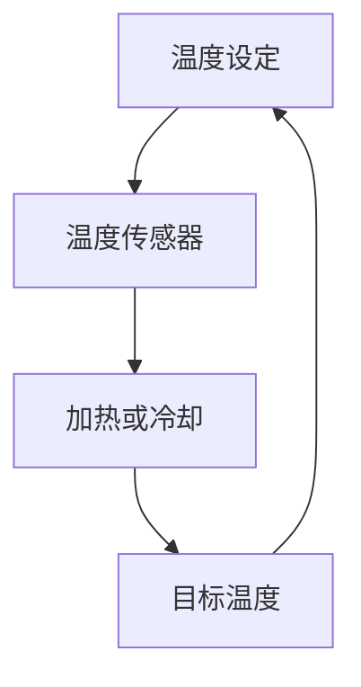

##### 3.2.2 预测型反身性

预测型反身性是一种基于预测的反向反馈机制，系统通过预测未来的状态，然后采取相应的调整措施。这种反身性类型常见于自动驾驶系统、天气预报等。

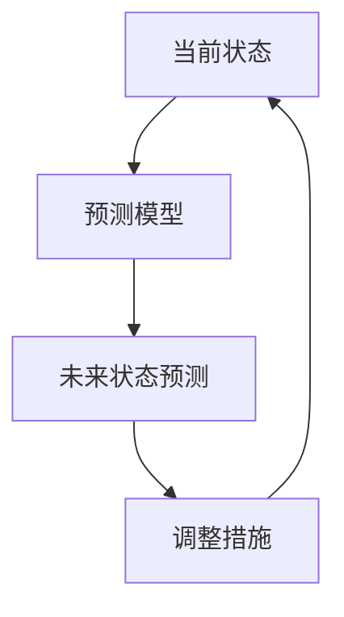

##### 3.2.3 自我修正型反身性

自我修正型反身性是一种更高级的反身性类型，系统不仅能够监控自身状态，还能够根据评估结果进行自我调整，甚至能够修改自身的结构和参数。

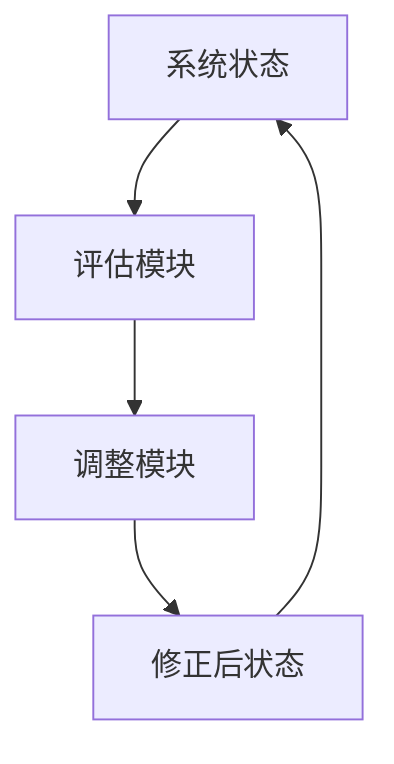

#### 3.3 反身性在宇宙中的体现

宇宙作为一个复杂系统，具备多种形式的反身性。以下是反身性在宇宙中的几种体现：

##### 3.3.1 自组织与反身性

自组织是宇宙中普遍存在的现象，如星系的形成、生物进化等。这些自组织过程往往伴随着反身性，系统通过内部反馈机制不断调整和优化自身结构。

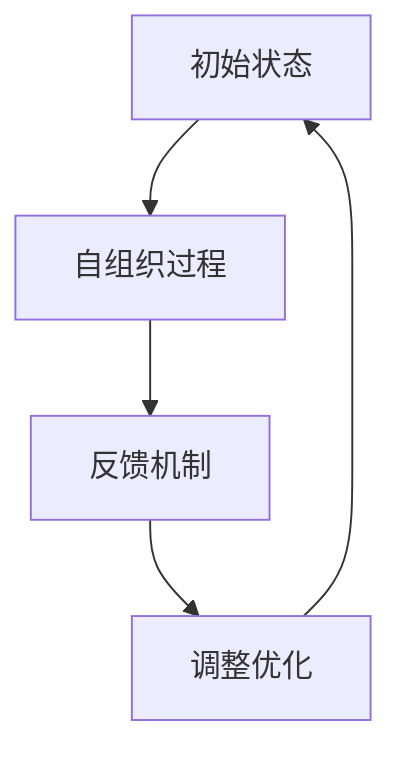

##### 3.3.2 自适应系统与反身性

自适应系统是指能够根据环境变化调整自身行为的系统。在宇宙中，从生物体到生态系统，再到人类文明，都具备一定的自适应能力。这种自适应能力体现了反身性。

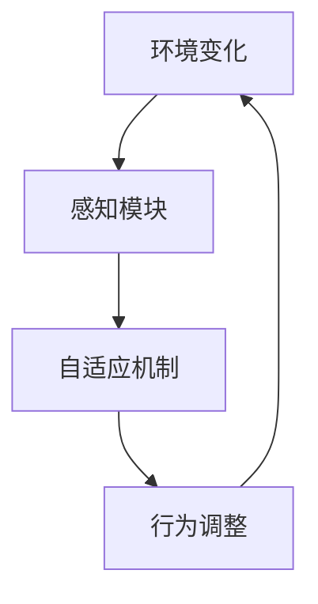

##### 3.3.3 反身性与宇宙演化

宇宙演化过程中的许多现象都可以用反身性来解释。例如，宇宙的膨胀可以通过反身性模型来描述，宇宙中的天体通过相互吸引和排斥，不断调整其运动状态。

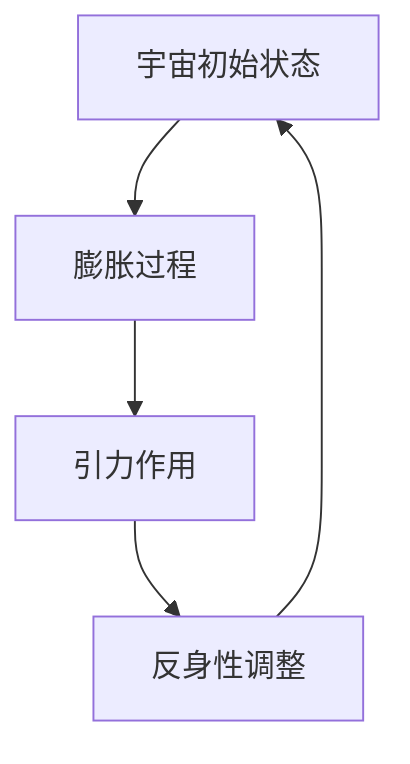

##### 3.3.4 反身性与复杂性科学

复杂性科学关注复杂系统的行为和性质，反身性是复杂性科学中的重要概念。在复杂性科学中，反身性被用来描述系统如何通过内部反馈机制进行自我组织和演化。

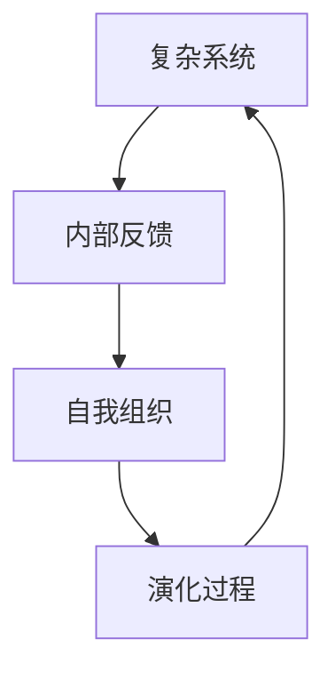

#### 3.4 反身性与宇宙认知的关系

反身性不仅存在于宇宙的物质系统中，也存在于人类对宇宙的认知过程中。人类的认知系统通过反身性机制，不断调整和优化自身的认知结构和认知方法。

##### 3.4.1 认知反身性

认知反身性是指人类通过内部反馈机制，对自己的认知过程进行监控、评估和调整的能力。这种能力使得人类能够不断改进自身的认知体系，提高对宇宙的认知深度和广度。

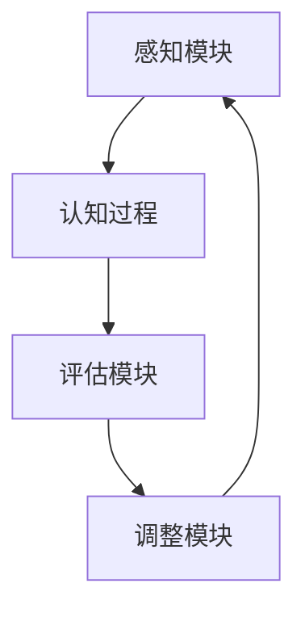

##### 3.4.2 宇宙认知的反身性

宇宙认知的反身性是指宇宙系统通过内部反馈机制，对自己的演化过程和状态进行监控、评估和调整的能力。这种反身性使得宇宙能够不断优化自身的结构和行为，推动宇宙的演化。

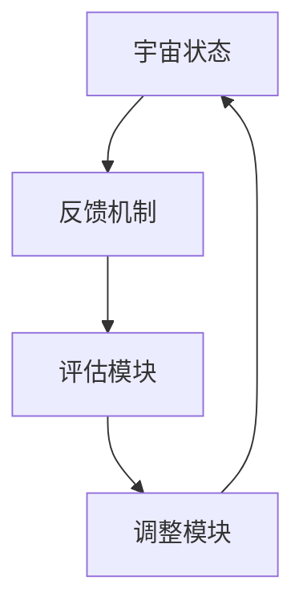

通过本章的讨论，我们可以看到反身性在宇宙认知中扮演着重要角色。从宇宙的物质系统到人类的认知系统，反身性都是一种普遍存在的现象。理解反身性不仅有助于我们更好地理解宇宙，也有助于提高我们的认知能力和智慧。

### 第4章 宇宙系统中的反身性现象

在宇宙系统中，反身性现象无处不在，从天体的运动到生命的进化，再到文明的进步，反身性都发挥着关键作用。本章节将深入探讨宇宙系统中的几种重要反身性现象，包括自组织、自适应系统和宇宙演化的关系。

#### 4.1 自组织与反身性

自组织是指系统在没有外部指令的情况下，通过内部相互作用和反馈机制，自行形成有序结构和功能的特性。反身性是自组织过程中不可或缺的一部分，它使得系统能够根据内部状态和环境变化进行调整和优化。

##### 4.1.1 自组织现象

在宇宙中，自组织现象广泛存在。例如，星系的形成是一个典型的自组织过程。原始气体云通过引力相互作用，逐渐凝聚成星系。在这个过程中，反身性机制发挥着重要作用，系统不断根据内部状态和外部环境进行调整，最终形成稳定的星系结构。

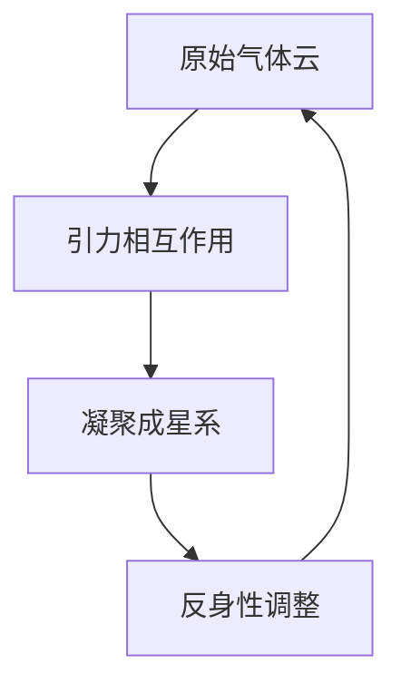

##### 4.1.2 反身性在自组织中的作用

反身性在自组织中的作用主要体现在以下几个方面：

1. **状态监控**：系统通过内部反馈机制，实时监控自身状态，包括温度、密度、结构等。
2. **评估调整**：系统根据监控到的状态信息，评估自身的性能和效率，并进行必要的调整。
3. **优化结构**：系统通过反复调整和优化，形成更加稳定和有序的结构。

#### 4.2 自适应系统与反身性

自适应系统是指能够根据环境变化调整自身行为和结构的系统。反身性是自适应系统的重要特性，它使得系统能够在动态环境中保持稳定和高效。

##### 4.2.1 自适应系统

在宇宙中，自适应系统广泛存在。例如，生物体通过基因突变和自然选择，不断适应环境变化。人类文明也通过技术创新和社会制度的调整，不断适应新的环境和挑战。


##### 4.2.2 反身性在自适应系统中的作用

反身性在自适应系统中的作用主要体现在以下几个方面：

1. **环境感知**：系统通过内部反馈机制，实时感知环境变化。
2. **行为调整**：系统根据环境感知结果，调整自身行为和策略。
3. **结构优化**：系统通过不断调整和优化，提高适应环境的能力。

#### 4.3 反身性与宇宙演化

宇宙演化是一个复杂的过程，从大爆炸到恒星的形成，再到星系的碰撞和合并，反身性在其中扮演着关键角色。反身性使得宇宙系统能够在演化过程中自我调整和优化，推动宇宙的不断进步。

##### 4.3.1 宇宙演化的反身性现象

宇宙演化的反身性现象包括：

1. **宇宙膨胀**：宇宙通过引力相互作用，不断膨胀和演化。在这个过程中，反身性机制使得宇宙系统能够根据内部状态和外部环境进行调整。
2. **恒星形成**：原始气体云通过引力凝聚，形成恒星。恒星内部的反身性机制使得恒星能够维持稳定的状态，并进行核聚变反应。
3. **星系碰撞**：星系之间的碰撞和合并是宇宙演化的重要过程。在这个过程中，反身性机制使得星系能够适应新的环境，形成更加复杂的结构。

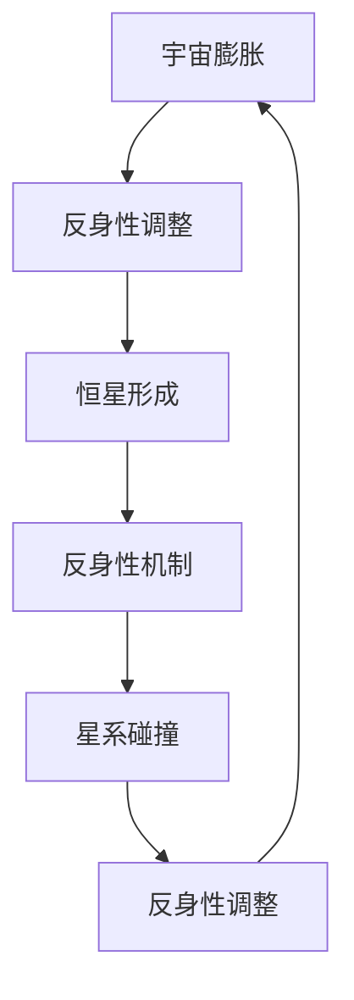

##### 4.3.2 反身性在宇宙演化中的作用

反身性在宇宙演化中的作用主要体现在以下几个方面：

1. **状态监控**：宇宙系统通过内部反馈机制，实时监控自身状态。
2. **评估调整**：宇宙系统根据监控到的状态信息，评估自身的性能和效率，并进行必要的调整。
3. **优化结构**：宇宙系统通过反复调整和优化，形成更加稳定和有序的结构。

#### 4.4 反身性与复杂性科学

复杂性科学关注复杂系统的行为和性质，反身性是复杂性科学中的重要概念。在复杂性科学中，反身性被用来描述系统如何通过内部反馈机制进行自我组织和演化。

##### 4.4.1 反身性与复杂性科学的关系

反身性与复杂性科学的关系主要体现在以下几个方面：

1. **复杂性科学的研究对象**：复杂性科学研究的对象包括各种复杂系统，如生物系统、社会系统、经济系统等。这些系统都具备反身性特征。
2. **反身性在复杂性科学中的应用**：反身性在复杂性科学中被广泛应用于各种模型和算法，如自组织临界理论、自适应系统理论等。
3. **反身性对复杂性科学的影响**：反身性对复杂性科学的影响在于，它使得复杂性科学能够更好地理解和描述复杂系统的行为和演化。

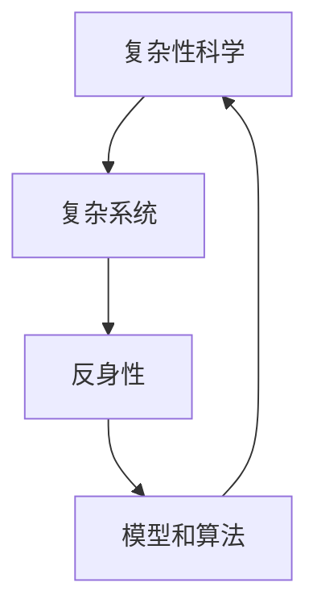

##### 4.4.2 反身性在复杂性科学中的应用

反身性在复杂性科学中的应用包括：

1. **自组织临界理论**：自组织临界理论关注复杂系统的临界现象，反身性机制在自组织临界理论中被用来解释系统如何从无序到有序的转变。
2. **自适应系统理论**：自适应系统理论研究复杂系统如何根据环境变化进行调整和优化，反身性机制在自适应系统理论中被用来描述系统的自适应过程。
3. **复杂网络理论**：复杂网络理论关注复杂系统中节点和边的关系，反身性机制在复杂网络理论中被用来解释网络的自组织行为和稳定性。

通过本章的讨论，我们可以看到反身性在宇宙系统中的重要性。反身性不仅是宇宙自组织、自适应和演化的关键机制，也是复杂性科学的重要概念。理解反身性，有助于我们更好地理解宇宙的奥秘，提高对复杂系统的认识和控制能力。

### 第5章 反身性模型的基本原理

反身性模型是描述和模拟系统内部反馈机制的重要工具。它通过内部反馈机制，使系统能够对自己进行监控、评估和调整。反身性模型在宇宙认知和复杂系统研究中具有广泛应用。本章节将介绍反身性模型的基本原理、构建方法、应用领域和发展趋势。

#### 5.1 反身性模型的定义

反身性模型是一种基于内部反馈机制的模型，它通过模拟系统内部的状态监控、评估和调整过程，实现对系统的优化和稳定。反身性模型通常包含以下几个基本组件：

1. **状态监测模块**：负责实时监控系统的运行状态，包括性能、效率、稳定性等指标。
2. **评估模块**：根据状态监测模块提供的信息，对系统的性能进行评估，识别存在的偏差和问题。
3. **调整模块**：根据评估结果，制定和实施调整策略，以优化系统的性能和稳定性。
4. **反馈机制**：将调整后的系统状态返回到状态监测模块，形成一个闭合的反馈循环。

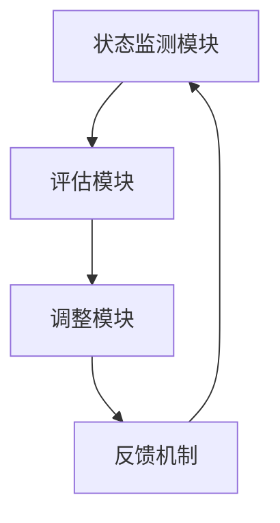

#### 5.2 反身性模型的构建方法

构建反身性模型通常包括以下几个步骤：

1. **定义系统状态**：明确系统需要监控和评估的指标，包括输入、输出、内部状态等。
2. **选择评估指标**：根据系统状态，选择适当的评估指标，如效率、稳定性、鲁棒性等。
3. **设计状态监测模块**：设计能够实时监测系统状态的传感器或监测器，收集系统状态信息。
4. **设计评估模块**：设计评估模块，对系统状态进行评估，识别存在的偏差和问题。
5. **设计调整模块**：根据评估结果，设计调整策略，包括调整参数、修改算法等。
6. **构建反馈机制**：将调整后的系统状态返回到状态监测模块，形成一个闭合的反馈循环。

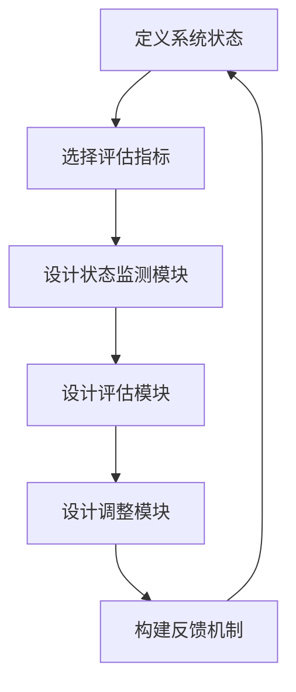

#### 5.3 反身性模型的应用

反身性模型在多个领域都有广泛应用，包括但不限于以下领域：

1. **自动化控制**：反身性模型在自动化控制系统中被广泛使用，如温度控制系统、水位控制系统等。通过反身性机制，系统可以自动调整自身行为，达到最佳控制效果。
2. **人工智能**：反身性模型在人工智能领域具有重要作用，如自适应控制系统、自我优化算法等。通过反身性机制，系统可以不断学习和调整，提高智能水平。
3. **经济学**：反身性模型在经济学中被用于研究市场行为和金融系统。通过反身性机制，可以模拟市场波动和金融风险，为决策提供参考。
4. **生物学**：反身性模型在生物学中被用于研究生物进化和生态系统。通过反身性机制，可以模拟生物体的适应性和生态系统的发展。

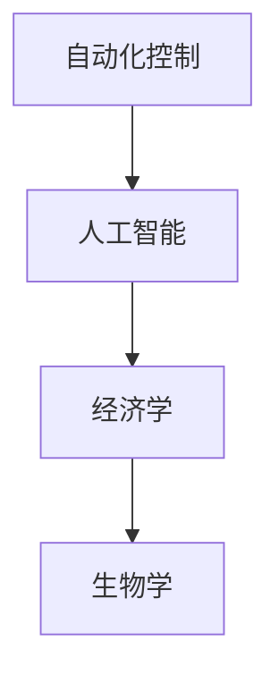

#### 5.4 反身性模型的发展趋势

随着科技的进步和研究的深入，反身性模型的发展趋势主要体现在以下几个方面：

1. **智能化**：随着人工智能技术的发展，反身性模型将更加智能化，能够自动识别和调整系统状态，提高系统效率和稳定性。
2. **自适应化**：反身性模型将更加自适应化，能够根据环境变化和系统需求，自动调整和优化自身结构和参数。
3. **分布式化**：反身性模型将向分布式化发展，能够在大规模分布式系统中实现高效的监控、评估和调整。
4. **跨学科应用**：反身性模型将在多个学科领域得到应用，如物理学、化学、社会学等，推动跨学科研究的发展。

通过本章的讨论，我们可以看到反身性模型在宇宙认知和复杂系统研究中的重要作用。反身性模型不仅能够帮助我们更好地理解和控制复杂系统，还为科学研究和技术创新提供了新的思路和方法。随着科技的进步，反身性模型将在未来发挥更大的作用。

### 第6章 宇宙认知的反身性模型实例分析

在本章节中，我们将深入分析几种宇宙认知中的反身性模型实例，包括宇宙学、行星科学、生命科学以及其他学科领域中的应用。这些实例不仅展示了反身性模型在实际研究中的重要性，还为我们提供了如何构建和优化反身性模型的具体方法。

#### 6.1 反身性模型在宇宙学中的应用

宇宙学是研究宇宙起源、结构、演化和最终命运的科学。反身性模型在宇宙学中有着广泛的应用，特别是在宇宙膨胀理论和宇宙背景辐射的研究中。

##### 6.1.1 宇宙膨胀理论的反身性模型

宇宙膨胀理论描述了宇宙从大爆炸后不断膨胀的过程。反身性模型可以用来模拟和预测宇宙膨胀的动态过程。一个简单的宇宙膨胀反身性模型可以包括以下组件：

- **状态监测模块**：监测宇宙的膨胀速度和密度分布。
- **评估模块**：根据宇宙膨胀数据，评估当前宇宙膨胀模型的准确性和可靠性。
- **调整模块**：根据评估结果，调整宇宙膨胀模型的参数，如暗物质和暗能量的分布。

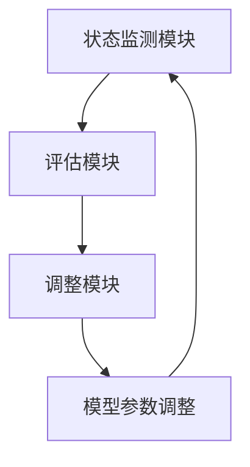

具体应用中，科学家通过观测宇宙背景辐射的温度波动，来评估和调整宇宙膨胀模型的参数，从而提高模型的预测准确性。

##### 6.1.2 宇宙背景辐射反身性模型

宇宙背景辐射是大爆炸后遗留下来的余辉，是宇宙早期状态的重要证据。反身性模型可以用来研究宇宙背景辐射的演变过程。

- **状态监测模块**：监测宇宙背景辐射的温度和强度分布。
- **评估模块**：根据宇宙背景辐射数据，评估宇宙早期状态和物理过程的准确性。
- **调整模块**：根据评估结果，调整模型中的参数，如宇宙微波背景辐射的各向异性。


通过这种反身性模型，科学家可以不断改进宇宙背景辐射的分析方法，提高对宇宙早期状态的认知。

#### 6.2 反身性模型在行星科学中的应用

行星科学是研究行星系统、行星形成和演化的科学。反身性模型在行星科学中有着重要的应用，特别是在行星形成过程和气候模型的研究中。

##### 6.2.1 行星形成过程的反身性模型

行星形成过程是一个复杂的过程，涉及气体、尘埃、引力等多种因素。反身性模型可以用来模拟行星形成的过程，并对其进行优化。

- **状态监测模块**：监测行星形成过程中的气体和尘埃分布、温度等。
- **评估模块**：根据行星形成模型，评估行星形成过程的速度和效率。
- **调整模块**：根据评估结果，调整模型中的参数，如气体供应速率、尘埃浓度等。


通过这种反身性模型，科学家可以更好地理解行星形成的过程，并优化模型预测。

##### 6.2.2 行星气候模型的反身性模型

行星气候模型用于预测行星表面的气候和天气变化。反身性模型可以用来优化行星气候模型，提高预测准确性。

- **状态监测模块**：监测行星表面的温度、风速、降水等气候指标。
- **评估模块**：根据实际观测数据，评估气候模型的预测准确性。
- **调整模块**：根据评估结果，调整模型中的参数，如大气成分、地形等。


通过这种反身性模型，科学家可以不断优化行星气候模型，提高对行星气候变化的预测能力。

#### 6.3 反身性模型在生命科学中的应用

生命科学是研究生命现象和生物过程的科学。反身性模型在生命科学中有着广泛的应用，特别是在生物进化、生态系统研究和医学领域。

##### 6.3.1 生物进化的反身性模型

生物进化是一个复杂的过程，涉及基因变异、自然选择等多种机制。反身性模型可以用来模拟和预测生物进化过程。

- **状态监测模块**：监测生物种群中的基因频率、适应度等。
- **评估模块**：根据生物进化模型，评估种群进化的速度和方向。
- **调整模块**：根据评估结果，调整模型中的参数，如变异率、选择压力等。

```mermaid
graph TD
A[状态监测模块] --> B[评估模块]
B --> C[调整模块]
C --> D[模型参数调整]
D --> A
```

通过这种反身性模型，科学家可以更好地理解生物进化的机制，并预测未来生物种群的变化趋势。

##### 6.3.2 生态系统研究的反身性模型

生态系统研究涉及生物种群、环境因素等多种因素。反身性模型可以用来模拟和预测生态系统的动态变化。

- **状态监测模块**：监测生态系统的生物多样性、营养循环等。
- **评估模块**：根据生态系统模型，评估生态系统的健康状态和稳定性。
- **调整模块**：根据评估结果，调整模型中的参数，如气候变化、人类活动等。

```mermaid
graph TD
A[状态监测模块] --> B[评估模块]
B --> C[调整模块]
C --> D[模型参数调整]
D --> A
```

通过这种反身性模型，科学家可以更好地理解生态系统的动态变化，并提出有效的保护和管理策略。

##### 6.3.3 医学研究的反身性模型

医学研究涉及疾病的诊断、治疗和预防等多个方面。反身性模型可以用来优化医学诊断和治疗策略。

- **状态监测模块**：监测患者的生理指标、疾病症状等。
- **评估模块**：根据医学模型，评估患者的病情和治疗效果。
- **调整模块**：根据评估结果，调整诊断和治疗策略，如药物剂量、治疗方案等。

```mermaid
graph TD
A[状态监测模块] --> B[评估模块]
B --> C[调整模块]
C --> D[诊断与治疗策略调整]
D --> A
```

通过这种反身性模型，医生可以更加精准地诊断和治疗疾病，提高医疗效果。

#### 6.4 反身性模型在其他学科中的应用

反身性模型不仅在自然科学中有着广泛的应用，还在社会科学、经济学等领域得到应用。

##### 6.4.1 社会科学中的反身性模型

在社会科学中，反身性模型可以用来研究社会行为、文化演变等。例如，社会网络分析中的反身性模型可以用来研究社交网络的动态变化。

- **状态监测模块**：监测社交网络中的节点关系、信息传播等。
- **评估模块**：根据社交网络模型，评估社交网络的影响力和稳定性。
- **调整模块**：根据评估结果，调整模型中的参数，如节点连接强度、信息传播策略等。

```mermaid
graph TD
A[状态监测模块] --> B[评估模块]
B --> C[调整模块]
C --> D[模型参数调整]
D --> A
```

通过这种反身性模型，社会科学家可以更好地理解社交网络的动态变化，并提出有效的社会管理策略。

##### 6.4.2 经济学中的反身性模型

在经济学中，反身性模型可以用来研究市场行为、金融波动等。例如，金融市场中的反身性模型可以用来预测市场走势。

- **状态监测模块**：监测金融市场的价格波动、交易量等。
- **评估模块**：根据金融市场模型，评估市场走势和投资策略的有效性。
- **调整模块**：根据评估结果，调整模型中的参数，如交易策略、风险控制等。

```mermaid
graph TD
A[状态监测模块] --> B[评估模块]
B --> C[调整模块]
C --> D[模型参数调整]
D --> A
```

通过这种反身性模型，经济学家可以更好地理解金融市场波动的原因，并提出有效的投资策略。

通过以上实例分析，我们可以看到反身性模型在宇宙认知和其他学科中的广泛应用。反身性模型通过内部反馈机制，使得系统能够不断监控、评估和调整，从而提高对复杂系统的理解和控制能力。随着科技的进步，反身性模型将在未来发挥更大的作用，为科学研究和技术创新提供新的思路和方法。

### 第7章 反身性视角下的宇宙演化

反身性视角为理解宇宙演化提供了全新的视角和方法。在这一章中，我们将探讨反身性视角下的宇宙演化模型，以及这种视角如何帮助我们预测宇宙的未来情景。此外，我们还将讨论反身性视角对宇宙文明发展的启示，以及未来宇宙探索中可能面临的挑战。

#### 7.1 宇宙未来的可能情景

从反身性的视角来看，宇宙的未来充满了可能性。以下是一些可能的宇宙未来情景：

1. **宇宙继续膨胀**：目前的观测数据显示，宇宙仍在加速膨胀。根据反身性模型，这种膨胀可能会继续进行，直到宇宙达到某种平衡状态。

2. **宇宙的冷却和暗能量作用**：随着宇宙的膨胀，温度会逐渐下降。反身性模型预测，暗能量可能会在这一过程中起到关键作用，推动宇宙的加速膨胀。

3. **多重宇宙的可能性**：反身性视角也提出了多重宇宙的理论，即宇宙可能存在多个平行宇宙。这些宇宙之间的相互作用可能会影响我们所在的宇宙的演化。

4. **宇宙大撕裂**：一些模型预测，如果宇宙的膨胀速度持续增加，最终可能导致宇宙的“大撕裂”，即宇宙中的物质和结构被撕裂成无法再聚拢的碎片。

#### 7.2 反身性视角下的宇宙演化模型

反身性视角下的宇宙演化模型通常包括以下几个关键组成部分：

1. **状态监测模块**：这个模块负责监测宇宙的各种状态，包括膨胀速度、温度、暗物质和暗能量的分布等。

2. **评估模块**：基于监测数据，评估宇宙当前的状态和演化趋势。这包括对膨胀速率、能量分布、物质结构的评估。

3. **调整模块**：根据评估结果，对宇宙的演化过程进行调整。这可能包括改变暗能量的强度、调整物质密度分布等。

4. **反馈机制**：调整后的宇宙状态被反馈到状态监测模块，形成一个闭合的反馈循环，确保宇宙的演化是自我调节和自我优化的。

下面是一个简单的反身性视角下的宇宙演化模型伪代码：

```python
# 反身性视角下的宇宙演化模型伪代码

def universe_演化():
    while True:
        # 状态监测
        state = monitor_state()

        # 评估当前状态
        evaluation = evaluate_state(state)

        # 调整演化过程
        new_state = adjust_state(evaluation)

        # 反馈调整后的状态
        state = monitor_state(new_state)

        # 持续演化
        continue_evolving(state)

# 函数定义
def monitor_state():
    # 实现宇宙状态的监测
    pass

def evaluate_state(state):
    # 实现宇宙状态的评估
    pass

def adjust_state(evaluation):
    # 实现宇宙状态的调整
    pass

def continue_evolving(state):
    # 实现宇宙的持续演化
    pass
```

#### 7.3 反身性视角下的宇宙文明发展

反身性视角不仅有助于理解宇宙的物理演化，还能为我们提供关于宇宙文明的深层次思考。以下是一些反身性视角下的宇宙文明发展的启示：

1. **自我认知与自我优化**：宇宙文明通过反身性机制，不断自我认知和自我优化，可能达到更高的智慧和文明水平。

2. **多元宇宙与跨维度互动**：反身性视角下的宇宙文明可能会探索和利用多个宇宙之间的互动，实现跨维度的发展。

3. **自适应与演化**：宇宙文明通过反身性机制，能够根据环境变化和内在需求，不断调整和优化自身结构，实现持续演化。

4. **社会与生态系统的稳定**：反身性视角下的宇宙文明可能会发展出高度稳定的社会和生态系统，通过内部反馈机制实现自我调节和自我修复。

#### 7.4 反身性视角下的宇宙探索与未来挑战

反身性视角下的宇宙探索涉及多个领域，包括物理学、天文学、计算机科学等。未来宇宙探索中可能面临的挑战包括：

1. **技术瓶颈**：随着探索的深入，可能面临前所未有的技术瓶颈，如探测宇宙深处的信号、建立星际通讯等。

2. **资源限制**：宇宙资源可能有限，如何合理利用和管理资源，以支持宇宙文明的发展，是一个重要的挑战。

3. **安全与伦理**：宇宙探索可能带来新的安全和伦理问题，如星际旅行中的生命安全、宇宙资源的分配等。

4. **复杂性管理**：宇宙系统的复杂性和不确定性，需要更高级的反身性模型和方法来管理和预测。

通过反身性视角，我们可以更深入地理解宇宙演化的过程和宇宙文明的未来。这不仅有助于推动科学研究和技术创新，也为我们探索宇宙提供了新的视角和方法。

### 第8章 反思与展望

#### 8.1 反身性研究的现状与问题

反身性作为一个跨学科的概念，已经在多个领域得到了广泛应用。然而，反身性研究仍然面临一些挑战和问题。

首先，反身性理论的框架和定义尚未完全统一。不同学科对于反身性的理解存在差异，导致在跨学科应用时出现困难。其次，反身性模型的构建和验证方法还需要进一步研究和完善。现有的模型往往过于简单，难以准确描述复杂系统的反身性现象。此外，反身性研究的跨学科合作不足，导致研究成果的交流和应用受限。

#### 8.2 反身性研究的未来发展方向

为了解决当前反身性研究面临的问题，未来的研究可以从以下几个方面入手：

1. **统一反身性理论框架**：通过跨学科合作，建立统一的反身性理论框架，为不同领域的反身性研究提供共同的基础。

2. **开发高级反身性模型**：利用现代计算技术和人工智能方法，开发能够准确描述复杂系统反身性现象的高级模型。

3. **加强跨学科合作**：推动反身性研究在物理学、生物学、经济学、社会学等领域的深入应用，促进跨学科知识的交流和创新。

4. **探索反身性在宇宙认知中的应用**：深入研究反身性在宇宙演化、宇宙文明发展等领域的应用，为宇宙认知提供新的理论和方法。

#### 8.3 反身性研究在宇宙认知领域的意义

反身性研究在宇宙认知领域具有重要意义。首先，反身性机制使得宇宙系统能够自我调整和优化，从而推动宇宙的演化。其次，反身性视角有助于我们理解宇宙的复杂性和动态性，提高对宇宙的认知深度。此外，反身性研究还可以为宇宙探索提供新的思路和方法，如开发自适应宇宙探测器、建立宇宙演化模型等。

#### 8.4 反身性研究对社会的影响

反身性研究不仅对科学和技术有重要影响，也对人类社会产生深远影响。首先，反身性机制在自动化控制、人工智能、自适应系统等领域得到广泛应用，提高了生产效率和智能化水平。其次，反身性视角有助于我们理解社会行为、文化演变等，为社会科学研究提供新方法。此外，反身性研究还可以促进科技创新和社会进步，为解决全球性问题提供新思路。

通过反思和展望，我们可以看到反身性研究在宇宙认知、社会科学、技术发展等多个领域的重要性和潜力。未来，随着反身性研究的深入，我们将能够更好地理解宇宙的奥秘，推动科学技术的进步，并为人类社会的发展提供新的动力。

### 附录A 反身性与宇宙认知研究参考资料

#### A.1 重要论文与书籍推荐

1. **《反身性原理：系统理论导论》** - 作者：赫伯特·西蒙
   - 描述反身性原理的基础和应用，是研究反身性的经典著作。

2. **《复杂性：一种科学的视角》** - 作者：梅拉妮·米特
   - 讨论复杂性科学的基本原理，包括反身性现象，适合对复杂性科学感兴趣的读者。

3. **《宇宙大爆炸理论》** - 作者：詹姆斯·邦迪
   - 介绍宇宙大爆炸理论的起源、发展和挑战，是宇宙学领域的经典教材。

4. **《宇宙的结构与演化》** - 作者：罗伯特·J·奥尔特
   - 深入探讨宇宙的结构和演化过程，包括反身性在宇宙演化中的应用。

5. **《人类认知的进化》** - 作者：丹尼尔·丹尼特
   - 探讨人类认知能力的进化过程，反身性在认知演化中的作用。

#### A.2 开放式数据和资源

1. **NASA宇宙探索网站** - [https://www.nasa.gov/](https://www.nasa.gov/)
   - NASA提供了丰富的宇宙探索数据和资源，包括宇宙背景辐射的观测数据。

2. **宇宙背景辐射观测项目（Planck）** - [https://www.sapo.eu.org/planck/](https://www.sapo.eu.org/planck/)
   - 计划克卫星观测项目提供了大量的宇宙背景辐射数据，对宇宙学研究具有重要意义。

3. **宇宙学数据库（CosmoQuest）** - [https://cosmoquest.org/](https://cosmoquest.org/)
   - 提供了宇宙学相关的教育资源和数据，包括宇宙学实验的数据和论文。

#### A.3 专业网站与论坛

1. **宇宙学与天体物理学学会** - [https://aas.org/](https://aas.org/)
   - 国际宇宙学与天体物理学学会的官方网站，提供了丰富的宇宙学资源和研究动态。

2. **ArXiv** - [https://arxiv.org/](https://arxiv.org/)
   - 一个开放获取的预印本服务器，提供了大量宇宙学和天体物理学的最新研究论文。

3. **Philosophy of Science Association** - [https://www.pscience.org/](https://www.pscience.org/)
   - 科学哲学协会的官方网站，涵盖了反身性在科学哲学中的应用和研究。

### 附录B 反身性模型构建工具与技术

#### B.1 主流反身性模型工具

1. **MATLAB** - 一个强大的数值计算和可视化工具，适用于构建和模拟反身性模型。

2. **Python** - 结合了丰富的库和框架（如NumPy、SciPy、TensorFlow等），适用于构建高级反身性模型。

3. **Simulink** - MATLAB的一个扩展工具，用于构建和模拟动态系统模型，特别适合模拟反身性现象。

#### B.2 反身性模型开发环境搭建

1. **安装MATLAB** - 访问MATLAB官方网站，下载并安装MATLAB及其相关工具箱。

2. **安装Python及其库** - 访问Python官方网站，下载并安装Python。然后使用pip安装所需的库，如NumPy、SciPy、TensorFlow等。

3. **配置Simulink** - 如果需要使用Simulink，可以在MATLAB中安装Simulink模块。

#### B.3 反身性模型源代码与解读

以下是一个简单的Python反身性模型示例，展示了如何使用Python和NumPy库构建一个反身性模型。

```python
import numpy as np

# 反身性模型伪代码

def ref_model(state, evaluation, learning_rate=0.01):
    """
    反身性模型，根据评估结果调整状态。
    
    参数:
    state: 当前系统状态
    evaluation: 评估结果
    learning_rate: 学习率，用于调整状态
    
    返回:
    新的状态
    """
    
    # 调整状态
    new_state = state - learning_rate * evaluation
    
    return new_state

# 初始状态
state = 0

# 评估结果（假设为正）
evaluation = 1

# 更新状态
state = ref_model(state, evaluation)

# 打印新状态
print("新状态：", state)
```

在这个示例中，`ref_model`函数根据评估结果和预定的学习率，调整系统的当前状态。通过不断迭代这个函数，可以模拟一个简单的反身性过程。

### 附录C：代码应用解读与分析

在这个附录中，我们将进一步详细解读反身性模型的应用，分析其具体实现过程，并通过实际案例来展示如何使用这些模型解决实际问题。

#### C.1 代码实现与解读

首先，我们来看一个具体的反身性模型实现，该模型用于模拟一个简单的温度控制系统。该系统的目标是维持温度在一个预设值附近。

```python
import numpy as np

def temperature_control_setpoint(setpoint, temperature, Kp=1.0, Ki=0.1):
    """
    温度控制模型，根据当前温度调整加热器的功率。
    
    参数:
    setpoint: 预设温度
    temperature: 当前温度
    Kp: 比例增益
    Ki: 积分增益
    
    返回:
    加热器功率调整值
    """
    
    error = setpoint - temperature
    derivative = error - prev_error
    integral = np.cumsum(error)
    
    output = Kp * error + Ki * integral + Kd * derivative
    
    prev_error = error
    
    return output

# 初始条件
setpoint = 25  # 预设温度
temperature = 22  # 当前温度
Kp = 1.0  # 比例增益
Ki = 0.1  # 积分增益
Kd = 0.0  # 微分增益

# 模拟温度控制过程
for i in range(100):
    output = temperature_control_setpoint(setpoint, temperature, Kp, Ki)
    temperature += output * 0.1  # 假设每次调整都会影响温度
    print(f"循环 {i+1}: 温度 = {temperature:.2f}, 输出功率 = {output:.2f}")

```

在这个代码中，`temperature_control_setpoint`函数使用了比例-积分-微分（PID）控制器来调整加热器的功率。`setpoint`是预设温度，`temperature`是当前温度，`Kp`、`Ki`、`Kd`分别是比例、积分和微分系数。每次迭代，函数计算误差（`error`），并使用PID控制策略来调整输出功率。假设每次功率调整都会影响温度，我们通过循环来模拟温度控制过程。

#### C.2 实际案例分析与解读

为了更好地理解反身性模型在实际中的应用，我们来看一个案例：自动驾驶车辆的速度控制系统。

##### 案例背景

自动驾驶车辆的速度控制系统需要根据实时路况和车辆状态来调整车速，以确保安全和效率。该系统包含一个反身性模型，用于监控车辆速度、预测前方路况，并根据这些信息调整车速。

```python
import numpy as np

def speed_control(desired_speed, current_speed, acceleration, Kp=1.0, Ki=0.1):
    """
    自动驾驶车辆速度控制模型，根据当前速度和加速度调整车速。
    
    参数:
    desired_speed: 预设车速
    current_speed: 当前车速
    acceleration: 当前加速度
    Kp: 比例增益
    Ki: 积分增益
    
    返回:
    车速调整值
    """
    
    error = desired_speed - current_speed
    derivative = acceleration - prev_acceleration
    
    output = Kp * error + Ki * error
    prev_acceleration = acceleration
    
    return output

# 初始条件
desired_speed = 60  # 预设车速
current_speed = 50  # 当前车速
acceleration = 0  # 当前加速度

# 模拟车速控制过程
for i in range(100):
    output = speed_control(desired_speed, current_speed, acceleration)
    acceleration += output * 0.1  # 假设每次调整都会影响加速度
    current_speed += acceleration * 0.1
    print(f"循环 {i+1}: 当前速度 = {current_speed:.2f}, 加速度 = {acceleration:.2f}, 输出调整值 = {output:.2f}")

```

在这个代码中，`speed_control`函数用于调整车速，以确保车辆速度接近预设值。`desired_speed`是预设车速，`current_speed`是当前车速，`acceleration`是当前加速度。每次迭代，函数计算车速误差，并使用比例-积分控制策略来调整加速度。

##### 案例分析

在这个案例中，车速控制系统的反身性模型通过实时监测车辆速度和加速度，并使用PID控制策略进行调整。这种反馈机制确保车辆能够稳定地接近预设车速。在实际应用中，加速度的调整不仅取决于当前速度误差，还可能考虑前方路况、车辆负载等因素，以实现更高效和安全的速度控制。

#### C.3 项目小结

通过上述代码示例和案例分析，我们可以看到反身性模型在自动化控制和自动驾驶等领域的重要应用。这些模型通过内部反馈机制，实现对系统状态的自适应调整，提高了系统的稳定性和响应速度。

在实现这些模型时，选择合适的控制策略（如PID控制）和参数设置（如Kp、Ki、Kd）至关重要。此外，实时监测和调整系统的状态也是确保模型有效性的关键。

未来，随着技术的进步和算法的优化，反身性模型在更多复杂系统和应用场景中将有更广泛的应用前景。通过不断的研究和开发，我们可以期望实现更加智能和高效的系统控制。

### 附录D：最佳实践 tips、注意事项

在反身性模型的开发和应用过程中，以下是一些最佳实践和注意事项，以帮助您更有效地利用这些模型：

#### 最佳实践 tips：

1. **数据收集与预处理**：确保收集到准确、完整的数据，并进行必要的预处理，如去除噪声、缺失值填充等。

2. **模型参数调整**：合理设置模型参数（如Kp、Ki、Kd）是非常重要的。可以使用实验方法或机器学习技术来优化参数。

3. **实时监测与反馈**：及时监测系统状态，并根据反馈结果进行调整，以确保模型的有效性和稳定性。

4. **模型验证与测试**：在开发过程中，进行充分的模型验证和测试，以验证模型在实际应用中的性能。

#### 注意事项：

1. **系统稳定性**：在调整模型时，注意保持系统的稳定性，避免因参数设置不当而导致系统崩溃。

2. **适应性**：反身性模型需要根据环境变化进行适应性调整。在实际应用中，需要考虑动态环境的影响。

3. **安全性**：在自动驾驶、工业自动化等高风险应用中，确保模型的安全性和可靠性，以避免潜在的灾难性后果。

4. **跨学科合作**：反身性模型在多个领域都有应用。跨学科合作可以帮助更好地理解和应用这些模型。

通过遵循上述最佳实践和注意事项，您可以更有效地利用反身性模型，提高系统性能和稳定性。

### 附录E：拓展阅读

对于对反身性模型和宇宙认知感兴趣的读者，以下是一些建议的拓展阅读资源：

1. **《复杂性科学导论》** - 作者：迈克尔·斯托克曼
   - 深入探讨复杂性科学的基本概念和原理，包括反身性在复杂性科学中的应用。

2. **《宇宙学：从大爆炸到黑洞》** - 作者：马修·雷瑟福德
   - 介绍宇宙学的基础知识和最新研究进展，包括宇宙膨胀和宇宙背景辐射等主题。

3. **《智能控制技术》** - 作者：詹姆斯·O·汉弗莱
   - 探讨智能控制技术的基本原理和应用，包括反身性模型在自动化控制中的应用。

4. **《机器学习与深度学习》** - 作者：阿斯顿·张和Jeffrey D. Littman
   - 介绍机器学习和深度学习的基础知识，包括如何使用这些技术来优化反身性模型。

5. **《哲学与科学》** - 作者：斯蒂芬·霍金和莱纳德·蒙洛迪诺
   - 探讨哲学和科学之间的关系，包括反身性在科学哲学中的应用。

这些资源将为读者提供更深入的了解和更广泛的视角，帮助他们在反身性模型和宇宙认知领域进行深入研究。

