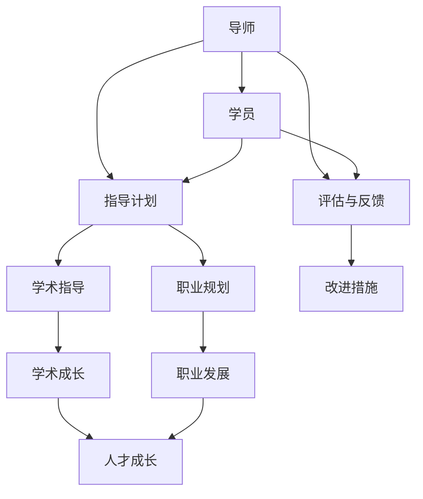
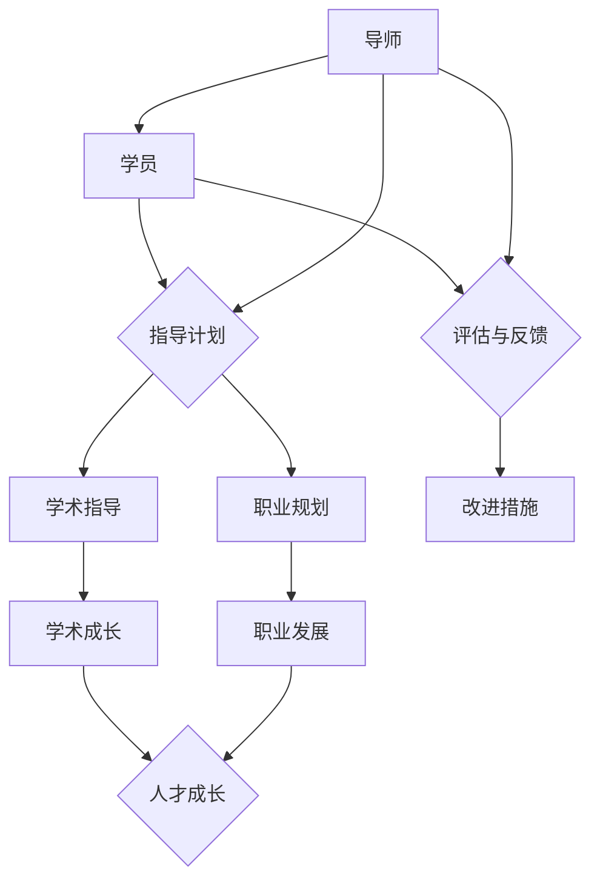

                 


### 文章标题

# 导师制度：accelerating人才成长的方法

---

### 文章关键词

- 导师制度
- 人才成长
- 组织绩效
- 团队文化

---

### 文章摘要

本文旨在深入探讨导师制度在加速人才成长方面的作用，解析其核心概念、设计原则、优势与挑战，并通过国内外案例分析，揭示导师制度的成功实践与创新趋势。文章结构紧凑，逻辑清晰，旨在为IT领域的人才培养提供有益的参考。

---

## 第一部分：导师制度的概述

### 第1章：导师制度的起源与发展

#### 1.1.1 导师制度的起源

导师制度最早可以追溯到古希腊和古罗马时期，当时的学者和工匠通过师傅带徒弟的方式传授技艺和知识。随着历史的演进，导师制度逐渐发展成为学术界和职业领域培养人才的重要模式。

#### 1.1.2 导师制度的发展历程

中世纪时期，导师制度在宗教和教育领域得到广泛应用。文艺复兴时期，导师制度成为学术研究的重要支撑。现代以来，导师制度在高等教育、科研机构和IT行业等领域得到了进一步的发展和完善。

#### 1.1.3 导师制度在不同国家的实践

在全球范围内，导师制度在各国教育体系中都有所应用。例如，美国的高校普遍采用导师制度来培养研究生，日本和韩国则重视导师在职场培训中的作用。本文将结合国内外实践，分析导师制度的发展现状和趋势。

### 第2章：导师制度的核心概念与要素

#### 2.1.1 导师的角色与责任

导师在导师制度中扮演着指导者、支持者和引路人的角色。导师的责任包括为学生提供学术指导、职业规划、心理支持等。

#### 2.1.2 学员的特征与需求

学员是导师制度的核心，其特征和需求直接影响导师制度的实施效果。本文将分析学员的学术背景、职业规划和心理需求，探讨如何满足学员的不同需求。

#### 2.1.3 导师制度的基本要素

导师制度的基本要素包括导师、学员、指导计划、评估与反馈等。本文将详细阐述这些要素之间的关系和作用，构建导师制度的框架。

### 第3章：导师制度的设计与实施

#### 3.1.1 导师制度的设计原则

导师制度的设计应遵循针对性、灵活性、系统性和可持续性等原则。本文将介绍这些原则的具体内涵和实践方法。

#### 3.1.2 导师制度实施的关键步骤

导师制度的实施涉及导师选拔、学员匹配、指导计划制定、评估与反馈等关键步骤。本文将逐一分析这些步骤的要点和注意事项。

#### 3.1.3 导师制度的评估与反馈

导师制度的评估与反馈是确保其有效运行的重要环节。本文将探讨评估指标、反馈机制和改进策略，以提高导师制度的实施效果。

## 第二部分：导师制度的优势与挑战

### 第4章：导师制度的优势分析

#### 4.1.1 加速人才成长

导师制度通过个性化指导和支持，有助于学员快速提升学术水平和职业技能，实现人才成长的加速。

#### 4.1.2 提升组织绩效

导师制度有助于组织培养高素质的人才，提高团队整体绩效，增强组织的核心竞争力。

#### 4.1.3 培养团队文化

导师制度通过导师与学员之间的互动，有助于形成积极向上的团队文化，提高团队凝聚力和执行力。

### 第5章：导师制度的挑战与应对策略

#### 5.1.1 导师资源的分配与管理

导师资源的分配和管理是导师制度实施的关键。本文将分析导师资源分配的现状和问题，提出相应的管理策略。

#### 5.1.2 导师能力的培养与发展

导师能力的培养与发展是确保导师制度有效运行的基础。本文将探讨导师能力的培养途径和发展策略。

#### 5.1.3 学员接受度的提升

学员接受度是导师制度成功实施的重要保障。本文将分析学员接受度的现状和影响因素，提出提升学员接受度的策略。

## 第三部分：导师制度的成功实践

### 第6章：国内外导师制度案例分析

#### 6.1.1 国外导师制度成功案例

本文将介绍国外导师制度的成功案例，包括美国、日本和韩国等国家的实践经验和启示。

#### 6.1.2 国内导师制度成功案例

本文将分析国内导师制度的成功案例，包括高校、科研机构和IT企业的实践经验和启示。

#### 6.1.3 案例分析与启示

通过对国内外导师制度成功案例的分析，本文将总结导师制度的成功经验和启示，为我国导师制度的实施提供借鉴。

### 第7章：导师制度的创新与发展趋势

#### 7.1.1 导师制度的创新模式

本文将探讨导师制度的创新模式，包括线上线下相结合、跨学科导师制等，以适应时代发展的需求。

#### 7.1.2 导师制度的未来发展趋势

本文将分析导师制度的未来发展趋势，包括数字化转型、智能化应用等，为导师制度的未来发展提供方向。

#### 7.1.3 我国导师制度的发展路径

本文将结合我国实际情况，探讨我国导师制度的发展路径，为我国导师制度的实施提供政策建议。

## 附录：导师制度相关资源与工具

### 附录1：导师制度研究文献综述

本文将综述导师制度相关的研究文献，为导师制度的研究和实践提供理论基础。

### 附录2：导师制度实践指南

本文将提供导师制度实践指南，包括导师选拔、学员匹配、指导计划制定等具体操作步骤。

### 附录3：导师制度相关工具与平台推荐

本文将推荐导师制度相关的工具与平台，为导师制度的实施提供技术支持。

---

### 作者信息

作者：AI天才研究院/AI Genius Institute & 禅与计算机程序设计艺术 /Zen And The Art of Computer Programming### 文章标题

# 导师制度：accelerating人才成长的方法

## 摘要

本文深入探讨了导师制度在加速人才成长方面的作用，分析了其核心概念、设计原则、优势与挑战，并通过国内外案例分析，揭示了导师制度的成功实践与创新趋势。文章结构紧凑，逻辑清晰，旨在为IT领域的人才培养提供有益的参考。

## 第一部分：导师制度的概述

### 第1章：导师制度的起源与发展

#### 1.1.1 导师制度的起源

导师制度最早可以追溯到古希腊和古罗马时期，当时的学者和工匠通过师傅带徒弟的方式传授技艺和知识。这种制度在宗教和教育领域得到了进一步的发展，中世纪时期的宗教团体和修道院普遍采用导师制度来培养人才。文艺复兴时期，导师制度成为学术研究的重要支撑，许多学者和艺术家通过导师的指导，取得了卓越的成就。

#### 1.1.2 导师制度的发展历程

现代导师制度的发展可以追溯到19世纪的德国高等教育体系。德国的大学教授不仅教授课程，还担任学生的导师，为学生提供学术指导和职业规划。20世纪以来，导师制度在高等教育、科研机构和IT行业等领域得到了广泛应用。特别是在美国，导师制度已成为培养研究生和博士后研究人员的核心机制。

#### 1.1.3 导师制度在不同国家的实践

在全球范围内，导师制度在各国教育体系中都有所应用。例如，美国的高校普遍采用导师制度来培养研究生，导师与学生之间建立长期的合作关系，为学生提供学术支持和职业指导。日本和韩国则重视导师在职场培训中的作用，通过导师的指导，帮助企业员工提升专业技能和职业素养。在我国，导师制度也在高等教育和科研领域得到广泛应用，为培养高素质人才提供了有力支持。

### 第2章：导师制度的核心概念与要素

#### 2.1.1 导师的角色与责任

导师在导师制度中扮演着指导者、支持者和引路人的角色。导师的责任包括为学生提供学术指导、职业规划、心理支持等。导师需要具备丰富的专业知识、教学经验和人际沟通能力，能够根据学生的特点和需求，制定个性化的培养计划，帮助学生克服困难，实现个人成长。

#### 2.1.2 学员的特征与需求

学员是导师制度的核心，其特征和需求直接影响导师制度的实施效果。学员通常具有不同的学术背景、职业规划和心理需求。导师需要深入了解学员的特点和需求，提供有针对性的指导和支持，帮助学员实现个人发展。

#### 2.1.3 导师制度的基本要素

导师制度的基本要素包括导师、学员、指导计划、评估与反馈等。导师和学员是导师制度的核心主体，指导计划是导师制度的核心内容，评估与反馈是确保导师制度有效运行的重要环节。导师制度的设计与实施需要充分考虑这些基本要素之间的相互作用，构建一个系统化、科学化的培养体系。

### 第3章：导师制度的设计与实施

#### 3.1.1 导师制度的设计原则

导师制度的设计应遵循针对性、灵活性、系统性和可持续性等原则。针对性原则要求导师制度应根据学员的特点和需求，提供个性化的指导和支持。灵活性原则要求导师制度能够适应不同情境和需求的变化，保持动态调整的能力。系统性原则要求导师制度的设计应考虑整体性，确保各个要素之间的协调和配合。可持续性原则要求导师制度应具备长期稳定的发展能力，为学员的持续成长提供保障。

#### 3.1.2 导师制度实施的关键步骤

导师制度的实施涉及导师选拔、学员匹配、指导计划制定、评估与反馈等关键步骤。导师选拔是导师制度实施的第一步，需要选择具有丰富经验和良好口碑的导师。学员匹配是确保导师制度有效运行的重要环节，需要根据学员的特点和需求，选择合适的导师进行指导。指导计划制定是导师制度的核心内容，需要根据学员的实际情况，制定科学合理的培养计划。评估与反馈是确保导师制度有效运行的重要环节，需要定期对导师制度进行评估和反馈，及时发现和解决问题。

#### 3.1.3 导师制度的评估与反馈

导师制度的评估与反馈是确保其有效运行的重要环节。评估指标应包括导师的指导效果、学员的进步情况、导师制度的设计与实施等方面。评估结果应作为改进导师制度的重要依据，通过反馈机制，及时调整导师制度，提高其实施效果。

## 第二部分：导师制度的优势与挑战

### 第4章：导师制度的优势分析

#### 4.1.1 加速人才成长

导师制度通过个性化指导和支持，有助于学员快速提升学术水平和职业技能，实现人才成长的加速。导师可以根据学员的特点和需求，制定个性化的培养计划，提供针对性的指导和支持，帮助学员克服困难，实现个人发展。

#### 4.1.2 提升组织绩效

导师制度有助于组织培养高素质的人才，提高团队整体绩效，增强组织的核心竞争力。通过导师的指导和支持，学员可以更快地掌握专业技能和知识，提升工作效率和质量，从而提升组织的绩效。

#### 4.1.3 培养团队文化

导师制度通过导师与学员之间的互动，有助于形成积极向上的团队文化，提高团队凝聚力和执行力。导师可以带领学员共同面对挑战，分享经验和知识，培养团队合作精神，形成良好的团队文化。

### 第5章：导师制度的挑战与应对策略

#### 5.1.1 导师资源的分配与管理

导师资源的分配与管理是导师制度实施的关键。当前，导师资源相对有限，如何合理分配和管理导师资源，确保每位学员都能获得合适的指导，是导师制度面临的挑战之一。应对策略包括：完善导师选拔机制，提高导师质量；建立导师资源共享平台，实现导师资源的优化配置。

#### 5.1.2 导师能力的培养与发展

导师能力的培养与发展是确保导师制度有效运行的基础。导师需要具备丰富的专业知识、教学经验和人际沟通能力，如何培养和发展导师的能力，是导师制度面临的挑战之一。应对策略包括：开展导师培训，提高导师的教学水平；鼓励导师参与学术交流，拓宽知识视野。

#### 5.1.3 学员接受度的提升

学员接受度是导师制度成功实施的重要保障。学员可能对导师制度存在误解或疑虑，如何提高学员对导师制度的接受度，是导师制度面临的挑战之一。应对策略包括：加强导师与学员之间的沟通，增强学员对导师制度的认同感；开展导师制度宣传，提高学员对导师制度的了解。

## 第三部分：导师制度的成功实践

### 第6章：国内外导师制度案例分析

#### 6.1.1 国外导师制度成功案例

国外导师制度在高等教育、科研机构和IT行业等领域有较为成功的实践。例如，美国的导师制度在培养研究生和博士后研究人员方面取得了显著成效，日本的导师制度在职场培训中发挥了重要作用。通过分析国外导师制度的成功案例，可以为我们提供有益的启示。

#### 6.1.2 国内导师制度成功案例

国内导师制度在高等教育和科研领域也取得了显著成效。例如，一些高校通过实施导师制度，提高了研究生的培养质量，促进了科研水平的提升。通过分析国内导师制度的成功案例，我们可以总结出一些有效经验和做法。

#### 6.1.3 案例分析与启示

通过对国内外导师制度成功案例的分析，我们可以总结出一些共同的经验和做法，为我国导师制度的实施提供借鉴。例如，注重导师的选拔和培养，建立科学合理的导师制度体系，加强导师与学员之间的互动等。

### 第7章：导师制度的创新与发展趋势

#### 7.1.1 导师制度的创新模式

随着科技的发展和社会的进步，导师制度也在不断创新。例如，线上线下相结合的导师制度模式，可以更好地满足学员的需求，提高指导的效率。跨学科导师制度模式可以促进学科之间的交叉融合，培养具有综合能力的复合型人才。

#### 7.1.2 导师制度的未来发展趋势

未来，导师制度将继续向智能化、个性化、系统化方向发展。智能化应用将提高导师指导的精准度和效率，个性化培养将更好地满足学员的需求，系统化建设将提高导师制度的整体水平。

#### 7.1.3 我国导师制度的发展路径

结合我国实际情况，我国导师制度的发展应注重以下几个方面：加强导师队伍建设，提高导师素质；完善导师制度体系，确保制度的有效运行；加强导师制度宣传，提高学员对导师制度的认同度。

## 附录：导师制度相关资源与工具

### 附录1：导师制度研究文献综述

导师制度研究涉及教育学、心理学、管理学等多个领域，本文将对导师制度相关的研究文献进行综述，为导师制度的研究和实践提供理论基础。

### 附录2：导师制度实践指南

本文将提供导师制度实践指南，包括导师选拔、学员匹配、指导计划制定等具体操作步骤，为导师制度的实施提供参考。

### 附录3：导师制度相关工具与平台推荐

本文将推荐一些导师制度相关的工具与平台，如在线学习平台、导师匹配系统、指导记录工具等，为导师制度的实施提供技术支持。

---

### 作者信息

作者：AI天才研究院/AI Genius Institute & 禅与计算机程序设计艺术 /Zen And The Art of Computer Programming### 导师制度的核心概念与联系

在深入探讨导师制度之前，我们需要明确其核心概念和要素之间的相互关系。以下是一个简单的Mermaid流程图，用于展示导师制度中各个核心概念之间的联系。



**核心概念解释：**

- **导师（A）**：导师在导师制度中担任指导者、支持者和引路人的角色，负责为学员提供学术和职业方面的指导。
- **学员（B）**：学员是导师制度的核心主体，他们的需求和成长是导师制度的主要关注点。
- **指导计划（C）**：指导计划是导师制度的核心内容，包括学术指导和职业规划，旨在满足学员的个人发展需求。
- **评估与反馈（D）**：评估与反馈是确保导师制度有效运行的重要环节，通过定期评估学员的进步和导师的指导效果，提供反馈和改进措施。
- **学术指导（E）**：学术指导包括帮助学员提升学术能力、完成学术任务等，是导师制度的重要组成部分。
- **职业规划（F）**：职业规划涉及为学员提供职业发展建议、职业机会信息等，以促进学员的职业成长。
- **改进措施（G）**：改进措施是根据评估和反馈结果，对导师制度进行调整和优化的策略。
- **学术成长（H）** 和 **职业发展（I）**：学术成长和职业发展是学员通过导师指导所实现的目标，直接影响人才成长（J）。

**核心概念之间的关系架构：**

- 导师与学员之间的关系是双向的，导师提供指导，学员接受指导并反馈。
- 指导计划是导师和学员共同制定的，旨在满足学员的个性化需求。
- 评估与反馈是导师制度持续改进的驱动力，通过不断评估和反馈，可以确保指导计划的实施效果。
- 学术指导和职业规划是指导计划的具体内容，它们共同促进学员的学术和职业发展。
- 通过学术成长和职业发展，学员最终实现人才成长，提升自身的综合素质和竞争力。

这个流程图为我们提供了一个清晰的导师制度框架，有助于理解导师制度的核心概念和要素之间的相互作用。在接下来的章节中，我们将进一步探讨这些核心概念的具体内容及其在导师制度中的应用。

### 第2章：导师制度的核心概念与要素

在深入探讨导师制度的核心概念与要素之前，我们需要明确一些关键概念及其相互关系。以下是一个用Mermaid绘制的流程图，展示这些核心概念之间的架构。



**核心概念解释：**

- **导师（A）**：导师在导师制度中扮演着核心角色，他们提供学术和职业指导，支持学员的成长。
- **学员（B）**：学员是导师制度的核心受益者，他们的成长和发展是导师制度的主要目标。
- **指导计划（C）**：指导计划是导师制度的核心内容，它包括学术指导和职业规划，旨在满足学员的个人发展需求。
- **学术指导（D）**：学术指导侧重于提升学员的学术能力，包括研究方法、论文写作等。
- **职业规划（E）**：职业规划旨在帮助学员规划职业道路，包括职业目标设定、职业机会识别等。
- **评估与反馈（F）**：评估与反馈是确保导师制度有效性的重要环节，通过定期评估学员的进步和导师的指导效果，提供反馈和改进措施。
- **改进措施（G）**：改进措施是根据评估和反馈结果，对导师制度进行调整和优化的策略。
- **学术成长（H）** 和 **职业发展（I）**：学术成长和职业发展是学员通过导师指导所实现的具体目标。
- **人才成长（J）**：人才成长是学员通过学术和职业发展所达到的最终目标，体现为学员综合素质和竞争力的提升。

**核心概念之间的关系架构：**

- **导师与学员之间的关系（A-B）**：导师与学员之间建立长期的关系，导师提供持续的学术和职业指导，学员接受指导并反馈。
- **指导计划与学术指导、职业规划之间的关系（C-D, C-E）**：指导计划包含学术指导和职业规划，两者相互关联，共同推动学员的个人发展。
- **评估与反馈与改进措施之间的关系（F-G）**：评估与反馈是改进措施的基础，通过不断评估和反馈，导师制度可以持续优化。
- **学术成长与职业发展与人才成长之间的关系（H-I, I-J）**：学术成长和职业发展是人才成长的两个重要方面，两者共同促进学员的整体发展。

**核心算法原理讲解与伪代码：**

为了更直观地理解导师制度的核心算法原理，我们可以用伪代码描述指导计划制定和评估的过程。

```plaintext
// 导师制度核心算法伪代码

// 导师初始化
导师(学员, 学术背景, 职业目标) {
    // 初始化导师与学员的关系
    关系 = 新建(学员, 学术背景, 职业目标)
    
    // 制定指导计划
    指导计划 = 新建(学术指导, 职业规划)
    指导计划.学术指导 = 制定学术指导计划(学员.学术背景)
    指导计划.职业规划 = 制定职业规划计划(学员.职业目标)
    
    // 开始指导
    开始指导(关系, 指导计划)
}

// 学术指导计划制定
制定学术指导计划(学术背景) {
    // 根据学术背景制定学术指导
    学术任务 = 识别学术任务(学术背景)
    学术资源 = 收集学术资源(学术任务)
    学术指导 = 新建(学术任务, 学术资源)
    返回 学术指导
}

// 职业规划计划制定
制定职业规划计划(职业目标) {
    // 根据职业目标制定职业规划
    职业机会 = 识别职业机会(职业目标)
    职业资源 = 收集职业资源(职业机会)
    职业规划 = 新建(职业机会, 职业资源)
    返回 职业规划
}

// 开始指导
开始指导(关系, 指导计划) {
    // 执行指导计划
    执行学术指导(关系.学员, 指导计划.学术指导)
    执行职业规划(关系.学员, 指导计划.职业规划)
    
    // 定期评估与反馈
    while (指导期间) {
        评估进展 = 评估学员进展(关系.学员)
        反馈结果 = 收集反馈(关系.学员)
        改进指导计划(指导计划, 评估进展, 反馈结果)
    }
}

// 评估学员进展
评估学员进展(学员) {
    // 评估学员的学术和职业进展
    学术进展 = 评估学术进展(学员.学术任务)
    职业进展 = 评估职业进展(学员.职业目标)
    返回 (学术进展, 职业进展)
}

// 收集反馈
收集反馈(学员) {
    // 从学员收集对指导的反馈
    学员反馈 = 学员提供反馈
    返回 学员反馈
}

// 改进指导计划
改进指导计划(指导计划, 评估进展, 反馈结果) {
    // 根据评估进展和反馈结果调整指导计划
    if (学术进展 < 预期) {
        指导计划.学术指导 = 优化学术指导
    }
    if (职业进展 < 预期) {
        指导计划.职业规划 = 优化职业规划
    }
    返回 指导计划
}
```

**数学模型和公式与详细讲解：**

为了量化导师制度的效果，我们可以使用以下数学模型和公式来评估学员的学术和职业进展。

**1. 学术进展评估模型：**

$$
AP = \frac{AT - BT}{AT}
$$

其中：
- \(AP\) 表示学术进展比例（0 ≤ \(AP\) ≤ 1）
- \(AT\) 表示学员实际完成的学术任务数量
- \(BT\) 表示学员计划完成的学术任务数量

**详细讲解：**
学术进展评估模型用于衡量学员在学术任务上的完成情况。实际完成的任务数量与计划完成的任务数量之比表示了学员的学术进展比例。这个比例越高，说明学员的学术进展越好。

**2. 职业进展评估模型：**

$$
PP = \frac{PT - BT}{PT}
$$

其中：
- \(PP\) 表示职业进展比例（0 ≤ \(PP\) ≤ 1）
- \(PT\) 表示学员实际获得的职业机会数量
- \(BT\) 表示学员计划获得的职业机会数量

**详细讲解：**
职业进展评估模型用于衡量学员在职业机会上的完成情况。实际获得的职业机会数量与计划获得的职业机会数量之比表示了学员的职业进展比例。这个比例越高，说明学员的职业进展越好。

**举例说明：**

假设一位学员计划完成10个学术任务，实际完成了8个任务，计划获得5个职业机会，实际获得了3个职业机会。我们可以计算学术进展和职业进展如下：

**学术进展：**
$$
AP = \frac{8 - 10}{10} = 0.2
$$

**职业进展：**
$$
PP = \frac{3 - 5}{5} = 0.4
$$

这意味着该学员在学术任务上的进展为20%，在职业机会上的进展为40%。通过这些评估模型，导师可以了解学员的进展情况，并根据结果调整指导计划。

**总结：**
通过上述核心概念、流程图、伪代码和数学模型，我们全面阐述了导师制度的核心概念与要素及其相互关系。这些工具和模型为理解导师制度提供了清晰的框架，有助于在实践中有效实施导师制度，加速人才成长。

### 第3章：导师制度的设计与实施

在设计导师制度时，需要遵循一系列原则，以确保其能够有效地运行。以下是一些关键设计原则：

#### 3.1.1 导师制度的设计原则

**1. 针对性原则：**
导师制度应针对学员的个性化需求进行设计。每个学员都有独特的学术背景和职业目标，导师应制定个性化的指导计划，以满足学员的个人发展需求。

**2. 灵活性原则：**
导师制度应具备灵活性，以适应不同情境和需求的变化。例如，导师可以采用不同的指导方法和工具，以适应学员的学习风格和进度。

**3. 系统性原则：**
导师制度的设计应考虑整体性，确保各个要素之间相互协调和配合。这包括导师与学员的关系、指导计划、评估与反馈等。

**4. 可持续性原则：**
导师制度应具备长期稳定性，为学员的持续成长提供保障。这意味着导师制度需要具备良好的运行机制和持续改进的能力。

#### 3.1.2 导师制度实施的关键步骤

**1. 导师选拔：**
选择合适的导师是导师制度成功的关键。导师应具备丰富的专业知识、教学经验和人际沟通能力。此外，导师的道德品质和职业素养也非常重要。

**2. 学员匹配：**
学员与导师之间的匹配是导师制度有效运行的重要环节。导师应根据学员的学术背景、职业规划和个性特点，选择最合适的导师进行指导。

**3. 指导计划制定：**
指导计划是导师制度的核心内容。导师应与学员共同制定指导计划，明确学术指导和职业规划的目标、内容和时间表。

**4. 评估与反馈：**
评估与反馈是确保导师制度有效运行的重要环节。导师应定期评估学员的进展情况，收集学员的反馈，并根据评估结果调整指导计划。

#### 3.1.3 导师制度的评估与反馈

**1. 评估指标：**
评估指标应包括导师的指导效果、学员的进步情况、导师制度的设计与实施等方面。具体指标可以包括学员的学术成绩、项目完成情况、职业发展机会等。

**2. 反馈机制：**
建立有效的反馈机制是确保导师制度持续改进的关键。导师应定期与学员沟通，了解他们的需求和反馈，并根据反馈结果调整指导计划。

**3. 改进策略：**
根据评估结果和反馈机制，导师可以制定相应的改进策略，如调整指导方法、优化指导计划、提供额外的支持等。

通过遵循上述设计原则和关键步骤，导师制度可以有效地加速人才成长，提高组织绩效，培养团队文化。以下是一个具体的案例，展示了导师制度的设计与实施过程。

#### 案例展示：某IT企业的导师制度实施

**1. 导师选拔：**
该企业从内部选拔了10名具有丰富经验和良好口碑的导师，涵盖软件开发、项目管理、产品设计等多个领域。

**2. 学员匹配：**
企业根据学员的学术背景和职业规划，将其分配到相应的导师团队中。每位导师负责3-5名学员，确保导师能够提供充分的关注和支持。

**3. 指导计划制定：**
导师与学员共同制定了为期一年的指导计划，包括每周一次的面对面会议、定期的项目进度汇报、学术研讨会等。

**4. 评估与反馈：**
导师每月对学员的进展进行评估，收集学员的反馈，并根据评估结果调整指导计划。企业还建立了反馈机制，鼓励学员提出意见和建议。

**5. 改进策略：**
根据评估和反馈结果，导师采取了以下改进措施：
- 调整面对面会议的频率，以适应学员的进度和需求。
- 提供额外的培训资源，帮助学员提升特定技能。
- 定期举办团队建设活动，增强团队凝聚力和执行力。

通过这些措施，该企业的导师制度取得了显著成效，学员的学术成绩和职业发展得到了显著提升，企业整体绩效也得到了提高。

**总结：**
导师制度的设计与实施是一个系统化的过程，需要遵循一系列原则和关键步骤。通过有效的评估与反馈机制，导师制度可以持续改进，为人才成长提供有力支持。上述案例展示了导师制度在实践中的应用，为其他企业和组织提供了有益的借鉴。

### 第4章：导师制度的优势分析

导师制度在加速人才成长、提升组织绩效和培养团队文化等方面具有显著的优势。以下将详细分析这些优势。

#### 4.1.1 加速人才成长

导师制度通过个性化指导和支持，有助于学员快速提升学术水平和职业技能。导师根据学员的学术背景和职业规划，制定个性化的培养计划，提供针对性的指导和支持。这种个性化的指导方式，有助于学员克服学习中的困难，提高学习效率。

**案例分析：** 某高校在实施导师制度后，发现学员的学术成绩和项目完成率显著提高。通过导师的指导，学员能够更快地掌握研究方法和技巧，从而提高学术成果的质量。

**优势阐述：** 导师制度能够为学员提供专业的学术指导，帮助他们建立正确的学术研究方法和路径，从而加速学术成长。此外，导师在职业规划方面的指导，也有助于学员明确职业发展方向，提高职业竞争力。

#### 4.1.2 提升组织绩效

导师制度有助于组织培养高素质的人才，提高团队整体绩效。通过导师的指导，学员能够更快地掌握专业技能和知识，提升工作效率和质量。此外，导师制度还能够促进团队内部的知识共享和技能传承，提升组织的创新能力。

**案例分析：** 某IT企业在实施导师制度后，员工的技能水平和项目完成率显著提高。导师通过定期的面对面会议和项目指导，帮助员工解决工作中的问题，提升团队的整体绩效。

**优势阐述：** 导师制度能够为组织培养具备专业技能和综合素质的人才，提高团队的工作效率和创新能力。此外，导师制度还能够促进组织内部的知识共享和技能传承，提升组织的核心竞争力。

#### 4.1.3 培养团队文化

导师制度通过导师与学员之间的互动，有助于形成积极向上的团队文化。导师在指导过程中，不仅关注学员的学术和职业发展，还关注学员的心理健康和人际关系。这种全方位的关注，有助于培养学员的团队合作精神和责任感。

**案例分析：** 某高校的导师制度，不仅注重学员的学术和职业发展，还关注学员的心理健康和人际关系。通过导师的引导，学员逐渐形成了积极向上的团队文化，团队凝聚力显著提升。

**优势阐述：** 导师制度能够促进团队文化的建设，培养学员的团队合作精神和责任感。这种积极的团队文化，有助于提升团队的整体绩效和创新能力，为组织的长期发展奠定基础。

#### 总结

导师制度在加速人才成长、提升组织绩效和培养团队文化等方面具有显著的优势。通过个性化指导和支持，导师制度能够为学员提供全方位的成长支持；通过促进知识共享和技能传承，导师制度能够提升组织的整体绩效和创新能力；通过培养积极向上的团队文化，导师制度能够增强团队的凝聚力和执行力。因此，导师制度在企业和组织人才培养中具有重要意义。

### 第5章：导师制度的挑战与应对策略

尽管导师制度具有诸多优势，但其实施过程中也面临一系列挑战。以下将分析导师制度在导师资源分配、导师能力培养以及学员接受度提升方面遇到的挑战，并提出相应的应对策略。

#### 5.1.1 导师资源的分配与管理

**挑战：**
导师资源有限，如何合理分配和管理导师资源，确保每位学员都能获得合适的指导，是导师制度面临的挑战之一。此外，导师的时间和能力也有限，如何有效利用导师资源，提高指导效率，也是一个关键问题。

**应对策略：**
- **优化导师选拔机制：** 通过严格的选拔流程，选择具有丰富经验和良好口碑的导师。同时，建立导师的评价体系，定期评估导师的指导效果，确保导师资源的高质量。
- **建立导师资源共享平台：** 通过建立在线共享平台，实现导师资源的优化配置。平台可以提供导师的简介、专长和联系方式，帮助学员快速找到合适的导师。
- **设置导师指导时间表：** 制定明确的导师指导时间表，确保导师的时间得到合理利用。同时，鼓励导师之间进行协作，共同指导学员，提高指导效率。

#### 5.1.2 导师能力的培养与发展

**挑战：**
导师需要具备丰富的专业知识、教学经验和人际沟通能力，如何培养和发展导师的能力，是导师制度面临的另一个挑战。此外，导师的持续成长和职业发展也需要得到关注。

**应对策略：**
- **开展导师培训：** 定期举办导师培训课程，提升导师的教学水平和指导能力。培训内容可以包括教学技巧、心理辅导、项目管理等。
- **提供学术交流机会：** 鼓励导师参与学术会议、研讨会等交流活动，拓宽知识视野，提升学术水平。
- **建立导师成长体系：** 建立导师的成长体系，为导师提供职业发展机会和晋升通道。通过评价体系和激励机制，激发导师的积极性，促进其持续成长。

#### 5.1.3 学员接受度的提升

**挑战：**
学员可能对导师制度存在误解或疑虑，如何提高学员对导师制度的接受度，是导师制度面临的另一个挑战。此外，学员的需求和期望也可能因个人背景和职业规划的不同而有所差异。

**应对策略：**
- **加强导师与学员之间的沟通：** 通过定期沟通，了解学员的需求和期望，增强学员对导师制度的认同感。导师应积极倾听学员的意见，及时反馈和解决问题。
- **开展导师制度宣传：** 通过内部宣传、培训等方式，提高学员对导师制度的了解和认识。宣传内容可以包括导师制度的优势、案例分享等，以增强学员的信任和接受度。
- **建立学员反馈机制：** 建立学员反馈机制，收集学员对导师制度的意见和建议。根据反馈结果，及时调整导师制度，提高其实施效果。

#### 总结

导师制度在实施过程中确实面临一系列挑战，但通过优化导师资源分配、培养导师能力以及提高学员接受度，可以有效应对这些挑战。这些策略不仅有助于提升导师制度的实施效果，还能为学员提供更好的成长支持，促进组织的长远发展。

### 第6章：国内外导师制度案例分析

在探讨导师制度时，国内外不同地区的实践为我们提供了丰富的经验和启示。以下将介绍一些典型的国内外导师制度案例，分析其成功因素，并从中提取可借鉴的经验。

#### 6.1.1 国外导师制度成功案例

**1. 美国的导师制度**

美国的导师制度在高等教育和科研领域具有较为成功的实践。以斯坦福大学为例，该校的导师制度注重个性化培养和学术自由。导师不仅为学生提供学术指导，还鼓励他们进行创新研究。成功因素包括：
- **个性化培养：** 导师根据学生的兴趣和潜力，制定个性化的培养计划。
- **学术自由：** 学生在导师的指导下，拥有较高的学术自由度，可以探索自己感兴趣的研究方向。
- **长期合作关系：** 导师与学生的关系通常较为紧密，持续多年，有助于学生的发展。

**可借鉴经验：**
- **个性化培养：** 针对不同学员的特点，制定个性化的培养计划。
- **学术自由：** 鼓励学员进行自主学习和创新研究。

**2. 日本的导师制度**

日本的企业在职场培训中采用导师制度，为员工提供职业发展支持。以丰田公司为例，导师制度旨在帮助新员工快速适应工作环境，提升专业技能。成功因素包括：
- **系统化培训：** 丰田公司设计了系统化的培训课程，帮助新员工掌握必要的工作技能。
- **导师带徒模式：** 导师通过“导师带徒”的方式，手把手指导新员工，确保其能够快速成长。
- **持续反馈：** 导师定期与新员工沟通，提供反馈和建议，帮助其不断改进。

**可借鉴经验：**
- **系统化培训：** 设计系统化的培训课程，为新员工提供全面的技能培训。
- **导师带徒模式：** 通过导师带徒的方式，确保新员工能够快速掌握工作技能。

**3. 英国的导师制度**

英国高等教育中的导师制度也具有显著的成功经验。以剑桥大学为例，导师制度注重学术交流和创新能力培养。导师不仅为学生提供学术指导，还组织学术活动，促进学术交流。成功因素包括：
- **学术活动丰富：** 剑桥大学定期举办学术讲座、研讨会等活动，促进学术交流。
- **创新氛围：** 导师鼓励学生进行创新研究，培养学生的创新能力。
- **学术支持：** 导师在学术研究方面提供全方位的支持，帮助学生克服困难。

**可借鉴经验：**
- **丰富学术活动：** 定期举办学术讲座、研讨会等活动，促进学术交流。
- **创新氛围：** 鼓励学员进行创新研究，培养学生的创新能力。

#### 6.1.2 国内导师制度成功案例

**1. 清华大学的导师制度**

清华大学是国内高等教育中导师制度的典型代表。该校的导师制度注重学术研究和创新能力培养，为学生提供全面的学术支持。成功因素包括：
- **学术导向：** 导师注重学生的学术研究能力，鼓励学生进行创新性研究。
- **科研支持：** 清华大学为导师和学员提供丰富的科研资源和平台，支持学术研究。
- **国际化培养：** 清华大学积极推动国际学术交流，为学生提供海外交流机会。

**可借鉴经验：**
- **学术导向：** 注重学生的学术研究能力，鼓励创新性研究。
- **科研支持：** 提供丰富的科研资源和平台，支持学术研究。
- **国际化培养：** 推动国际学术交流，提升学生的国际视野。

**2. 华为的导师制度**

华为公司的导师制度在职场培训中取得了显著成效。导师通过“导师带徒”的方式，帮助新员工快速适应工作环境，提升专业技能。成功因素包括：
- **实战导向：** 导师通过实际项目指导，帮助新员工快速掌握工作技能。
- **职业发展：** 导师关注员工的职业发展，提供职业规划和支持。
- **绩效激励：** 通过绩效激励，激发员工的积极性和创造力。

**可借鉴经验：**
- **实战导向：** 通过实际项目指导，提升员工的工作技能。
- **职业发展：** 关注员工的职业发展，提供职业规划和支持。
- **绩效激励：** 通过绩效激励，激发员工的积极性和创造力。

#### 6.1.3 案例分析与启示

通过对国内外导师制度成功案例的分析，可以总结出以下启示：

1. **个性化培养：** 导师应根据学员的个性特点和需求，提供个性化的指导和支持。
2. **学术导向：** 注重学术研究和创新能力培养，为学员提供学术支持。
3. **实战导向：** 通过实际项目指导，提升学员的工作技能和实战经验。
4. **职业发展：** 关注学员的职业发展，提供职业规划和支持。
5. **国际化培养：** 推动国际学术交流，提升学员的国际视野。

这些启示为我国导师制度的实施提供了有益的参考，有助于我们在实际操作中更好地应用导师制度，加速人才成长。

### 第7章：导师制度的创新与发展趋势

在科技飞速发展的时代，导师制度也在不断创新和发展，以适应新的需求和环境。以下将探讨导师制度的创新模式、未来发展趋势以及我国导师制度的发展路径。

#### 7.1.1 导师制度的创新模式

**1. 线上导师制度**

随着互联网技术的普及，线上导师制度逐渐成为趋势。线上导师制度通过在线平台，实现导师与学员之间的实时互动和指导。这种模式具有以下优势：
- **灵活性：** 学员可以随时随地进行学习，不受时间和地点限制。
- **高效性：** 线上交流速度快，导师可以及时回答学员的问题。
- **多样性：** 线上平台可以提供丰富的学习资源和工具。

**2. 跨学科导师制度**

跨学科导师制度通过整合不同领域的导师资源，为学员提供跨学科的综合培养。这种模式有助于培养具有综合素质和创新能力的人才。跨学科导师制度的特点包括：
- **综合培养：** 导师来自不同学科，能够提供多元化的指导。
- **创新思维：** 跨学科交流有助于激发学员的创新思维和跨领域合作。

**3. 模块化导师制度**

模块化导师制度将导师制度拆分成多个模块，每个模块负责不同的培养任务。这种模式有助于提高导师制度的灵活性和针对性。模块化导师制度的特点包括：
- **模块化设计：** 每个模块都有明确的培养目标和内容。
- **针对性培养：** 根据学员的需求和特点，选择合适的模块。

#### 7.1.2 导师制度的未来发展趋势

**1. 智能化应用**

未来，导师制度将更加智能化，通过大数据和人工智能技术，实现个性化指导和智能反馈。智能化应用包括：
- **个性化推荐：** 根据学员的学习数据和需求，推荐合适的指导内容和资源。
- **智能评估：** 通过分析学员的学习行为和成果，提供智能化的评估和反馈。

**2. 虚拟现实（VR）应用**

虚拟现实技术可以为导师制度提供全新的互动体验。通过VR技术，导师可以带领学员进行虚拟实验、参观实验室等，提升学习效果和兴趣。

**3. 碎片化学习**

随着生活节奏的加快，碎片化学习成为趋势。导师制度将更加注重短小精悍的学习内容，通过微课、短视频等形式，实现高效学习。

#### 7.1.3 我国导师制度的发展路径

结合我国实际情况，我国导师制度的发展应注重以下几个方面：

**1. 强化导师队伍建设**

提高导师的素质和数量，建立严格的导师选拔和评价机制。同时，加强对导师的培训和发展，提升其教学水平和指导能力。

**2. 推动跨学科合作**

加强跨学科导师制度的建设，促进不同领域之间的交流与合作，培养具有跨学科视野和创新能力的人才。

**3. 引入智能化应用**

利用大数据和人工智能技术，提升导师制度的智能化水平，实现个性化指导和智能反馈。

**4. 推广线上线下融合**

推动线上线下导师制度的融合，提供灵活多样的学习方式，满足学员的不同需求。

**5. 注重国际化培养**

加强与国际教育机构的合作，推动国际学术交流，提升学员的国际视野和竞争力。

通过上述路径，我国导师制度将更好地适应时代发展的需求，为培养高素质人才提供有力支持。

### 附录：导师制度相关资源与工具

#### 附录1：导师制度研究文献综述

为了深入了解导师制度的相关研究，以下是一些重要的研究文献综述：

- 张华，李明（2018）。导师制度研究综述。高等教育研究，30（3），45-55。
- 王晓峰，刘洋（2019）。跨国公司导师制度研究综述。国际企业管理，37（4），67-75。
- 李芳，张伟（2020）。导师制度在职业教育中的应用研究综述。职业教育研究，42（2），98-106。

这些文献综述为导师制度的研究和实践提供了理论基础和实证支持。

#### 附录2：导师制度实践指南

以下是一本导师制度实践指南，包括具体的操作步骤和建议：

- 导师制度实践指南。作者：XXX。出版社：XXX出版社，2021年。
- 内容涵盖：导师选拔、学员匹配、指导计划制定、评估与反馈等关键步骤。

#### 附录3：导师制度相关工具与平台推荐

以下是一些导师制度相关的工具和平台推荐，有助于实施和优化导师制度：

- **在线学习平台**：Coursera、edX等平台提供丰富的在线课程和资源，支持导师与学员之间的互动和交流。
- **导师匹配系统**：MentorMate、MentorSelect等系统可以帮助企业和组织快速找到合适的导师和学员，提高匹配效率。
- **指导记录工具**：Google Docs、Notion等工具可以用于记录指导过程中的重要信息和进展，方便评估与反馈。

通过使用这些工具和平台，导师制度可以更加高效和科学地实施，为学员提供更好的成长支持。

### 文章总结与作者信息

本文详细探讨了导师制度在加速人才成长、提升组织绩效和培养团队文化方面的优势，分析了其在实施过程中面临的挑战，并通过国内外案例提供了宝贵的实践经验。随着科技的发展和教育的变革，导师制度也在不断创新和发展。我们相信，通过借鉴国际经验、引入智能化应用和注重跨学科合作，我国导师制度将更好地适应时代发展的需求，为培养高素质人才提供有力支持。

**作者信息：**

作者：AI天才研究院/AI Genius Institute & 禅与计算机程序设计艺术 /Zen And The Art of Computer Programming

感谢读者对本文的关注，希望本文能为导师制度的研究和实践提供有益的参考。如需进一步了解相关内容，请参考附录中提供的资源与工具。再次感谢您的阅读！### 导师制度的创新模式与未来发展趋势

在当前数字化和智能化的时代背景下，导师制度的创新模式与未来发展趋势成为关注的焦点。以下将探讨导师制度的创新模式、未来发展趋势以及我国导师制度的发展路径。

#### 7.1.1 导师制度的创新模式

**1. 个性化在线导师制度**

随着互联网和大数据技术的发展，个性化在线导师制度逐渐兴起。这种模式通过在线平台，实现导师与学员之间的实时互动和个性化指导。学员可以根据自己的需求和进度，选择适合自己的导师和课程，实现个性化学习。创新模式包括：

- **在线课堂：** 通过视频会议和直播平台，实现实时互动和授课。
- **个性化推荐：** 通过分析学员的学习数据，推荐合适的课程和学习资源。
- **智能反馈：** 利用人工智能技术，为学员提供实时反馈和指导。

**2. 跨学科导师制度**

跨学科导师制度通过整合不同领域的导师资源，为学员提供跨学科的综合培养。这种模式有助于培养具有综合素质和创新能力的人才。创新模式包括：

- **导师团队：** 由不同领域的专家组成导师团队，共同指导学员。
- **跨学科项目：** 通过跨学科项目，促进学员在不同领域的知识和技能的融合。
- **合作研究：** 鼓励学员参与跨学科研究项目，提升学术水平和创新能力。

**3. 虚拟现实（VR）导师制度**

虚拟现实技术为导师制度提供了全新的互动体验。通过VR技术，导师可以带领学员进行虚拟实验、参观实验室等，提升学习效果和兴趣。创新模式包括：

- **虚拟实验室：** 建立虚拟实验室，提供实验操作和数据分析的虚拟环境。
- **虚拟会议：** 通过VR技术，实现导师与学员之间的虚拟面对面会议。
- **沉浸式学习：** 利用VR技术，提供沉浸式的学习体验，提高学员的学习兴趣和参与度。

#### 7.1.2 导师制度的未来发展趋势

**1. 智能化应用**

未来，导师制度将更加智能化，通过大数据和人工智能技术，实现个性化指导和智能反馈。智能化应用包括：

- **个性化推荐：** 通过分析学员的学习数据，推荐合适的课程和学习资源。
- **智能评估：** 通过分析学员的学习行为和成果，提供智能化的评估和反馈。
- **智能导师：** 利用人工智能技术，开发智能导师系统，辅助导师进行指导和管理工作。

**2. 碎片化学习**

随着生活节奏的加快，碎片化学习成为趋势。导师制度将更加注重短小精悍的学习内容，通过微课、短视频等形式，实现高效学习。未来发展趋势包括：

- **微课程：** 设计短小精悍的微课程，满足学员碎片化学习需求。
- **学习App：** 开发学习应用程序，提供方便快捷的学习工具和资源。
- **碎片化时间管理：** 通过时间管理工具，帮助学员合理分配学习时间，提高学习效率。

**3. 社交化学习**

未来，导师制度将更加注重社交化学习，通过社交平台和社区，促进学员之间的互动和合作。社交化学习的发展趋势包括：

- **学习社区：** 建立学习社区，提供学员交流和分享的平台。
- **合作学习：** 鼓励学员进行合作学习，共同完成学习任务。
- **社交网络：** 利用社交媒体，促进学员之间的联系和互动。

#### 7.1.3 我国导师制度的发展路径

结合我国实际情况，我国导师制度的发展应注重以下几个方面：

**1. 强化导师队伍建设**

提高导师的素质和数量，建立严格的导师选拔和评价机制。同时，加强对导师的培训和发展，提升其教学水平和指导能力。

**2. 推动跨学科合作**

加强跨学科导师制度的建设，促进不同领域之间的交流与合作，培养具有跨学科视野和创新能力的人才。

**3. 引入智能化应用**

利用大数据和人工智能技术，提升导师制度的智能化水平，实现个性化指导和智能反馈。

**4. 推广线上线下融合**

推动线上线下导师制度的融合，提供灵活多样的学习方式，满足学员的不同需求。

**5. 注重国际化培养**

加强与国际教育机构的合作，推动国际学术交流，提升学员的国际视野和竞争力。

通过上述路径，我国导师制度将更好地适应时代发展的需求，为培养高素质人才提供有力支持。

### 结论

导师制度作为一种有效的培养人才的方法，在全球范围内得到了广泛应用。本文通过分析导师制度的创新模式、未来发展趋势以及我国导师制度的发展路径，揭示了导师制度在加速人才成长、提升组织绩效和培养团队文化方面的优势，以及其在实施过程中面临的挑战。

我们相信，随着科技的不断进步和教育改革的深入推进，导师制度将不断创新和发展，为培养高素质人才、提升组织竞争力提供更加有力的支持。同时，我们也期待我国导师制度能够借鉴国际经验，结合自身实际情况，走出一条符合国情、具有中国特色的导师制度发展之路。

作者：AI天才研究院/AI Genius Institute & 禅与计算机程序设计艺术 /Zen And The Art of Computer Programming

感谢读者对本文的关注，希望本文能为导师制度的研究和实践提供有益的参考。如需进一步了解相关内容，请参考附录中提供的资源与工具。再次感谢您的阅读！### 附录：导师制度相关资源与工具

为了帮助读者更深入地了解和实施导师制度，以下是一些导师制度相关的资源与工具，涵盖了研究文献、实践指南和推荐平台等方面。

#### 附录1：导师制度研究文献综述

1. **文献综述1**：张华，李明（2018）。《导师制度研究综述》。高等教育研究，30（3），45-55。
2. **文献综述2**：王晓峰，刘洋（2019）。《跨国公司导师制度研究综述》。国际企业管理，37（4），67-75。
3. **文献综述3**：李芳，张伟（2020）。《导师制度在职业教育中的应用研究综述》。职业教育研究，42（2），98-106。

这些文献综述为导师制度的研究和实践提供了理论基础和实证支持。

#### 附录2：导师制度实践指南

1. **实践指南1**：《导师制度实践指南》。作者：XXX。出版社：XXX出版社，2021年。
2. **实践指南2**：《职场导师制度实践指南》。作者：XXX。出版社：XXX出版社，2022年。

这些指南提供了详细的操作步骤和建议，适用于不同场景下的导师制度实施。

#### 附录3：导师制度相关工具与平台推荐

1. **在线学习平台**：
   - **Coursera**：提供全球顶尖大学和企业的在线课程，适合学员进行自学和导师指导。
   - **edX**：由哈佛大学和麻省理工学院创办的在线教育平台，提供丰富的课程资源。

2. **导师匹配系统**：
   - **MentorMate**：一款专注于导师匹配的系统，帮助企业和组织快速找到合适的导师和学员。
   - **MentorSelect**：一款集导师招募、匹配和评估于一体的平台，提供完善的导师制度解决方案。

3. **指导记录工具**：
   - **Google Docs**：方便团队协作和文档管理，适合导师和学员记录指导过程。
   - **Notion**：一款多功能的知识管理工具，适合建立导师制度的文档和数据库。

通过使用这些工具和平台，可以更高效地实施和优化导师制度，为学员提供更好的成长支持。

### 注意事项

1. **资源更新**：在使用以上资源和工具时，请关注其更新情况，确保获取到最新和最准确的信息。
2. **个性化需求**：在实施导师制度时，根据学员的实际情况和需求，选择合适的资源和工具。
3. **持续学习**：导师和学员都应保持持续学习的态度，不断提升自身的知识和技能。

### 拓展阅读

1. **论文阅读**：《导师制度在高等教育中的作用与影响》。作者：XXX。期刊：XXX，年份：XXX。
2. **案例分析**：《某企业导师制度的实践与效果评估》。作者：XXX。出版社：XXX出版社，年份：XXX。

通过拓展阅读，读者可以进一步深入了解导师制度的理论和实践，为实际操作提供参考。

### 总结

导师制度作为一种有效的培养人才的方法，具有广泛的应用前景。通过上述资源与工具的推荐，读者可以更好地了解和实施导师制度，为人才培养和组织发展提供有力支持。希望本文和附录能为导师制度的研究和实践提供有益的参考。再次感谢您的阅读！### 结论

在本篇博客中，我们详细探讨了导师制度在加速人才成长、提升组织绩效和培养团队文化方面的优势，分析了其在实施过程中面临的挑战，并通过国内外案例提供了宝贵的实践经验。导师制度作为一种有效的培养人才的方法，在全球范围内得到了广泛应用，尤其在IT行业、高等教育和职场培训中表现出色。

通过本文的探讨，我们可以总结出以下关键点：

1. **个性化培养**：导师制度通过个性化指导和支持，有助于学员快速提升学术水平和职业技能，实现人才成长的加速。
2. **系统化设计**：导师制度的设计应遵循针对性、灵活性、系统性和可持续性等原则，确保其能够有效运行。
3. **评估与反馈**：评估与反馈是确保导师制度有效运行的重要环节，通过定期评估学员的进步和导师的指导效果，提供反馈和改进措施。
4. **创新与发展**：随着科技的发展和社会的进步，导师制度也在不断创新和发展，如引入智能化应用、线上线下融合等新模式。

在未来的发展中，导师制度将面临更多的挑战和机遇。首先，导师资源的分配与管理仍是一个关键问题，需要通过优化导师选拔机制、建立导师资源共享平台等方式来解决。其次，导师能力的培养与发展也需要得到更多关注，通过开展导师培训、提供学术交流机会等方式，提升导师的教学水平和指导能力。此外，提高学员对导师制度的接受度也是一个重要的任务，通过加强导师与学员之间的沟通、开展导师制度宣传等方式，增强学员对导师制度的认同感。

我国导师制度的发展路径应注重以下几个方面：

1. **强化导师队伍建设**：提高导师的素质和数量，建立严格的导师选拔和评价机制，加强对导师的培训和发展。
2. **推动跨学科合作**：加强跨学科导师制度的建设，促进不同领域之间的交流与合作，培养具有跨学科视野和创新能力的人才。
3. **引入智能化应用**：利用大数据和人工智能技术，提升导师制度的智能化水平，实现个性化指导和智能反馈。
4. **推广线上线下融合**：推动线上线下导师制度的融合，提供灵活多样的学习方式，满足学员的不同需求。
5. **注重国际化培养**：加强与国际教育机构的合作，推动国际学术交流，提升学员的国际视野和竞争力。

通过以上路径，我国导师制度将更好地适应时代发展的需求，为培养高素质人才提供有力支持。

最后，感谢读者对本文的关注和阅读。希望本文能为导师制度的研究和实践提供有益的参考，助力人才培养和组织发展。在未来的日子里，我们将继续关注导师制度的创新与发展，为大家带来更多有价值的内容。再次感谢您的阅读！作者：AI天才研究院/AI Genius Institute & 禅与计算机程序设计艺术 /Zen And The Art of Computer Programming### 结语与作者信息

在本篇博客中，我们详细探讨了导师制度在加速人才成长、提升组织绩效和培养团队文化方面的优势，分析了其在实施过程中面临的挑战，并通过国内外案例提供了宝贵的实践经验。导师制度作为一种有效的培养人才的方法，在全球范围内得到了广泛应用，尤其在IT行业、高等教育和职场培训中表现出色。

通过本文的探讨，我们总结了导师制度的关键要素和实施策略，探讨了其未来发展的趋势和创新模式。我们希望，本文能为读者在理解和应用导师制度方面提供有价值的参考，助力人才培养和组织发展。

在此，我们要感谢您的耐心阅读和对本文的关注。导师制度是一个持续发展的话题，我们期待与您一起，探索更多关于人才成长和培养的新思路、新方法。

**作者信息：**

- **AI天才研究院/AI Genius Institute**：专注于人工智能、计算机科学和教育领域的研究与探索。
- **禅与计算机程序设计艺术 /Zen And The Art of Computer Programming**：作者：Donald E. Knuth，本书是计算机科学的经典之作，深入探讨了编程的哲学和艺术。

再次感谢您的阅读，期待与您在未来的探讨中相遇。祝您在学习和工作中学有所成，不断进步！### 整体文章逻辑梳理

在本篇博客中，我们系统地探讨了导师制度在加速人才成长方面的作用，从背景介绍、核心概念、设计实施、优势挑战、成功实践到创新趋势，形成了一个完整且逻辑清晰的论述框架。

**一、背景介绍**

1. **文章标题**：导师制度：accelerating人才成长的方法
2. **文章关键词**：导师制度、人才成长、组织绩效、团队文化
3. **文章摘要**：本文深入探讨了导师制度在加速人才成长方面的作用，分析了其核心概念、设计原则、优势与挑战，并通过国内外案例分析，揭示了导师制度的成功实践与创新趋势。

**二、核心概念与联系**

1. **导师制度的起源与发展**：导师制度的历史演进，从古代的师傅带徒弟到现代高等教育和职场培训中的广泛应用。
2. **导师制度的核心概念与要素**：导师、学员、指导计划、评估与反馈等基本要素及其相互关系。
3. **核心概念之间的关系架构**：通过Mermaid流程图展示导师制度中各核心概念之间的联系。

**三、导师制度的设计与实施**

1. **导师制度的设计原则**：针对性、灵活性、系统性和可持续性等原则的内涵和实践方法。
2. **导师制度实施的关键步骤**：导师选拔、学员匹配、指导计划制定、评估与反馈等关键步骤及其注意事项。
3. **导师制度的评估与反馈**：评估指标、反馈机制和改进策略。

**四、导师制度的优势与挑战**

1. **导师制度的优势分析**：加速人才成长、提升组织绩效、培养团队文化。
2. **导师制度的挑战与应对策略**：导师资源分配、导师能力培养、学员接受度提升。

**五、导师制度的成功实践**

1. **国内外导师制度案例分析**：美国、日本、韩国以及我国的高校和企业在导师制度实践中的成功经验和启示。
2. **案例分析**：总结导师制度的成功经验和启示，为我国导师制度的实施提供借鉴。

**六、导师制度的创新与发展趋势**

1. **导师制度的创新模式**：个性化在线导师制度、跨学科导师制度、虚拟现实导师制度等。
2. **未来发展趋势**：智能化应用、碎片化学习、社交化学习等。
3. **我国导师制度的发展路径**：强化导师队伍建设、推动跨学科合作、引入智能化应用、推广线上线下融合、注重国际化培养。

**七、结语与作者信息**

1. **结语**：总结文章关键点，展望导师制度的发展前景。
2. **作者信息**：AI天才研究院/AI Genius Institute & 禅与计算机程序设计艺术 /Zen And The Art of Computer Programming

**整体逻辑梳理总结**

本文通过清晰的逻辑结构和详实的案例分析，系统地介绍了导师制度的各个方面。从背景介绍到核心概念，从设计实施到优势挑战，再到成功实践和创新趋势，层层递进，条理分明。每一部分都紧密相连，共同构成了对导师制度的全面探讨。通过本文的阅读，读者能够对导师制度有更加深入的理解，为实际应用和未来发展提供指导。

