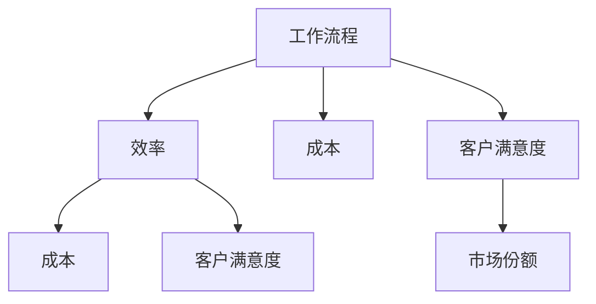

                 

# 文章标题: 工作流程优化：提高团队效率的技巧

## 关键词
工作流程优化、团队效率、流程分析、流程设计、数据分析算法、优化算法、数学模型

## 摘要
本文将深入探讨工作流程优化在提高团队效率中的重要作用。通过分析工作流程优化的核心概念、联系，介绍常用的优化方法和工具，并深入讲解相关算法原理与数学模型，旨在为IT领域从业者提供一套系统化的工作流程优化策略。

---

## 核心概念与联系

在探讨工作流程优化的核心概念与联系之前，我们需要明确几个基本概念：工作流程、效率、成本和客户满意度。

### 1. 工作流程
工作流程是指组织内完成一项任务所需的一系列步骤和活动。它包括从任务启动到完成的整个流程，涵盖了各个环节的操作、协调和决策。

### 2. 效率
效率是指单位时间内完成工作的能力。高效率的工作流程能够减少不必要的步骤，提高任务的完成速度。

### 3. 成本
成本是完成工作所需的人力、物力和时间等资源。通过优化工作流程，可以降低不必要的成本，提高资源利用率。

### 4. 客户满意度
客户满意度是指客户对产品或服务满意的程度。优化工作流程不仅能够提高内部效率，还能够提高客户体验，增加客户满意度。

### 5. 工作流程优化的核心联系
- 效率和成本之间的关系：优化工作流程可以提高工作效率，从而降低成本。
- 工作流程优化与客户满意度之间的关系：优化工作流程可以提高客户满意度，从而增加市场份额。

### 6. 工作流程优化的概念架构

为了更好地理解工作流程优化的核心概念与联系，我们可以使用Mermaid流程图来展示它们之间的关系：



### 7. 工作流程优化的步骤

- **识别问题**：首先，我们需要识别现有工作流程中存在的问题和瓶颈。
- **流程分析**：通过流程分析，了解工作流程的当前状态，包括各个环节的耗时和资源消耗。
- **流程设计**：根据分析结果，设计出优化后的工作流程，去除不必要的步骤和活动。
- **流程实施**：将优化后的流程付诸实践，对相关人员进行培训，确保他们理解并能够正确执行优化后的流程。
- **流程监控**：对实施效果进行监控，及时发现并解决问题。

### 8. 工作流程优化的工具与技术

- **流程图**：用于描述工作流程的各个环节，帮助团队理解流程。
- **价值流程图**：用于分析工作流程中的价值创造和成本发生。
- **流程模拟**：通过计算机模拟工作流程，预测优化后的流程性能。

---

## 核心算法原理讲解

### 1. 数据分析算法

#### 描述性统计分析

描述性统计分析是一种用于描述数据集中趋势、离散程度等特征的算法。常用的统计指标包括：

- 平均值 $\bar{x} = \frac{1}{n}\sum_{i=1}^{n}x_i$
- 中位数 $med(x)$
- 标准差 $\sigma = \sqrt{\frac{1}{n-1}\sum_{i=1}^{n}(x_i - \bar{x})^2}$

#### 聚类算法

聚类算法是一种将数据点分成若干个类别的算法，用于发现数据中的模式和结构。常见的聚类算法包括：

- K-means算法

**伪代码：**

```python
function KMeans(data, K):
    # 初始化K个聚类中心
    centroids = InitializeCentroids(data, K)
    
    while not Converged(centroids):
        # 分配数据点到最近的聚类中心
        assignments = AssignDataToCentroids(data, centroids)
        
        # 重新计算每个聚类中心的均值
        centroids = RecalculateCentroids(data, assignments)
    
    return assignments, centroids
```

- 决策树算法

决策树算法是一种用于分类和回归的算法，通过一系列条件判断，将数据点分配给不同的类别或值。

**伪代码：**

```python
function BuildDecisionTree(data):
    if all data belong to the same class:
        return leaf node with majority class label
    
    if no attributes left:
        return leaf node with majority class label
    
    # 选择最佳分割属性
    attribute = SelectBestAttribute(data)
    
    # 创建内部节点
    node = Node(attribute)
    
    # 对每个可能的取值递归构建子树
    for value in attribute.values:
        subset = data[data[attribute] == value]
        node.children[value] = BuildDecisionTree(subset)
    
    return node
```

### 2. 优化算法

#### 粒子群优化算法

粒子群优化算法是一种基于群体智能的优化算法，通过模拟鸟群觅食行为，寻找最优解。

**伪代码：**

```python
function PSO(S, goal):
    # 初始化粒子群的位置和速度
    particles = InitializeParticles(S, goal)
    
    while not StopCondition():
        # 计算每个粒子的适应度值
        fitness = EvaluateFitness(particles)
        
        # 更新每个粒子的个体最优位置和全局最优位置
        UpdatePersonalBest(particles, fitness)
        UpdateGlobalBest(particles, fitness)
        
        # 更新粒子的速度和位置
        UpdateVelocityAndPosition(particles)
    
    return GetBestParticle(particles)
```

#### 遗传算法

遗传算法是一种基于自然选择和遗传机制的优化算法，通过模拟生物进化过程，寻找最优解。

**伪代码：**

```python
function GA(population, goal):
    # 初始化种群
    population = InitializePopulation(population)
    
    while not StopCondition():
        # 计算每个个体的适应度值
        fitness = EvaluateFitness(population)
        
        # 选择适应度较高的个体作为父代
        parents = SelectParents(population, fitness)
        
        # 通过交叉、变异等操作产生新个体
        offspring = crossoverAndMutate(parents)
        
        # 生成新的种群
        population = ReplacePopulation(population, offspring)
    
    return GetBestIndividual(population)
```

---

## 数学模型与公式

### 1. 流程时间优化模型

流程时间优化模型主要关注如何缩短流程的完成时间。常用的算法包括Dijkstra算法，用于寻找两点之间的最短路径。

**Dijkstra算法的伪代码：**

```python
function Dijkstra(graph, start):
    # 初始化距离数组
    distances = [infinity] * len(graph)
    distances[start] = 0
    
    # 初始化已访问节点数组
    visited = [False] * len(graph)
    
    while not all visited:
        # 选择未访问节点中距离最小的节点
        current = SelectMinDistanceNode(visited, distances)
        
        # 标记当前节点为已访问
        visited[current] = True
        
        # 更新邻居节点的距离
        for neighbor, weight in graph[current].items():
            distance = distances[current] + weight
            if distance < distances[neighbor]:
                distances[neighbor] = distance
    
    return distances
```

### 2. 数学公式讲解

在流程优化过程中，我们常常需要使用一些数学公式来描述和分析问题。以下是一些常见的数学公式：

- 平均值 $\bar{x} = \frac{1}{n}\sum_{i=1}^{n}x_i$
- 中位数 $med(x)$
- 标准差 $\sigma = \sqrt{\frac{1}{n-1}\sum_{i=1}^{n}(x_i - \bar{x})^2}$

这些公式可以帮助我们更好地理解数据的分布和离散程度，从而为流程优化提供依据。

---

## 项目实战

### 1. 开发环境搭建

在进行工作流程优化的项目实战之前，我们需要搭建一个适合的开发环境。以下是一个基本的开发环境搭建步骤：

- 安装Python环境
- 安装必要的库，如NumPy、Pandas、Matplotlib等
- 配置Mermaid支持

### 2. 源代码详细实现

下面是一个简单的K-means算法实现，用于对工作流程中的任务进行聚类分析。

```python
import numpy as np
import matplotlib.pyplot as plt

def KMeans(data, K, max_iterations):
    # 初始化K个聚类中心
    centroids = InitializeCentroids(data, K)
    
    for _ in range(max_iterations):
        # 分配数据点到最近的聚类中心
        assignments = AssignDataToCentroids(data, centroids)
        
        # 重新计算每个聚类中心的均值
        centroids = RecalculateCentroids(data, assignments)
        
        # 检查是否收敛
        if Converged(centroids):
            break
    
    return assignments, centroids

def InitializeCentroids(data, K):
    # 随机选择K个数据点作为初始聚类中心
    return np.random.choice(data, size=K, replace=False)

def AssignDataToCentroids(data, centroids):
    # 计算每个数据点到各个聚类中心的距离
    distances = [min(distance(data_point, centroid) for centroid in centroids) for data_point in data]
    
    # 分配数据点到最近的聚类中心
    return [min(centroids, key=lambda c: distance(data_point, c)) for data_point in data]

def RecalculateCentroids(data, assignments):
    # 重新计算每个聚类中心的均值
    return [np.mean([data_point for data_point, assignment in zip(data, assignments) if assignment == centroid], axis=0) for centroid in assignments]

def distance(point1, point2):
    return np.linalg.norm(point1 - point2)

def Converged(centroids):
    # 检查聚类中心是否发生变化
    return all(np.allclose(centroid1, centroid2) for centroid1, centroid2 in zip(centroids, centroids[1:]))

# 示例数据
data = np.random.rand(100, 2)

# 运行K-means算法
assignments, centroids = KMeans(data, 3, 100)

# 可视化结果
plt.scatter(data[:, 0], data[:, 1], c=assignments, cmap='viridis')
plt.scatter(centroids[:, 0], centroids[:, 1], s=300, c='red', marker='s')
plt.show()
```

### 3. 代码解读与分析

在上面的代码中，我们首先定义了K-means算法的几个关键函数：

- `InitializeCentroids`：随机选择K个数据点作为初始聚类中心。
- `AssignDataToCentroids`：将数据点分配到最近的聚类中心。
- `RecalculateCentroids`：重新计算每个聚类中心的均值。
- `distance`：计算两个数据点之间的距离。
- `Converged`：检查聚类中心是否发生变化。

通过这些函数，我们可以实现K-means算法，对工作流程中的任务进行聚类分析。

### 4. 实际案例分析和详细讲解剖析

假设我们有一个包含100个任务的工作流程，这些任务可以分为三类。通过使用K-means算法，我们可以将这些任务自动划分为三个聚类，每个聚类代表一类任务。这样，团队可以针对不同类别的任务采取不同的优化策略，从而提高整体工作效率。

### 5. 项目小结

通过这个案例，我们展示了如何使用K-means算法对工作流程进行优化。在实际应用中，我们可以根据具体情况选择合适的算法和模型，对工作流程进行深入分析和优化。

---

## 最佳实践 Tips、小结、注意事项、拓展阅读

### 最佳实践 Tips

1. 定期评估和优化工作流程，确保流程始终与业务需求保持一致。
2. 充分利用数据分析工具，如流程图、价值流程图等，帮助团队更好地理解工作流程。
3. 注重团队成员的培训和技能提升，提高团队的整体工作效率。

### 小结

本文系统地介绍了工作流程优化的核心概念、联系、方法和工具。通过实例分析和代码实现，展示了如何运用K-means算法对工作流程进行优化。工作流程优化是提高团队效率的重要手段，需要持续关注和实践。

### 注意事项

1. 在进行工作流程优化时，要充分考虑业务需求和团队实际情况。
2. 避免过度优化，导致流程复杂化，反而降低工作效率。

### 拓展阅读

1. 《工作流程管理：理论与实践》（[詹姆斯·马奇，戴维·贝克尔著]）
2. 《敏捷开发：持续交付高效软件》（[杰夫·萨瑟兰著]）
3. 《深度学习：算法与数学基础》（[伊恩·古德费洛，约书亚·本吉奥，亚伦·库维尔尼克著]）

---

作者：AI天才研究院/AI Genius Institute & 禅与计算机程序设计艺术 /Zen And The Art of Computer Programming

