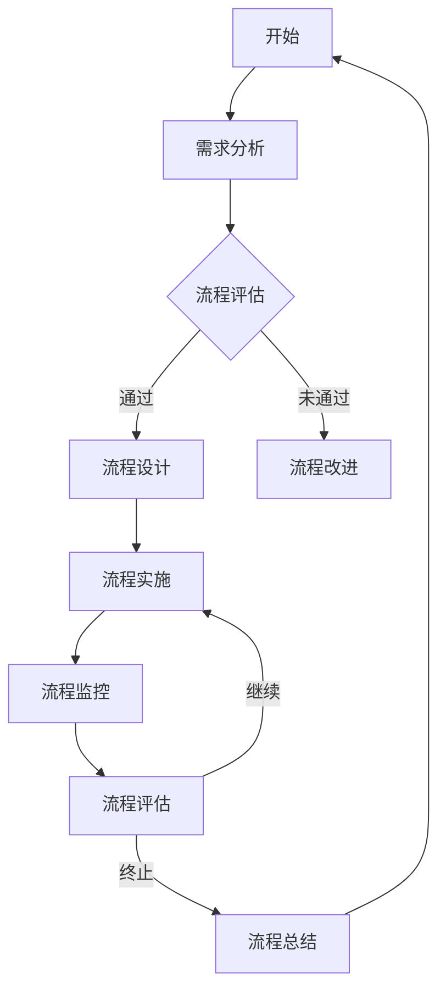

                 


## 第1章 引言

### 1.1 书籍背景与目标

在当今快速发展的信息技术时代，企业面临的竞争压力日益加剧，如何提高效率、降低成本、提升服务质量成为每个企业亟待解决的问题。工作流程再造（Business Process Reengineering，简称BPR）作为一种全新的管理思想和方法，应运而生。工作流程再造的目标是通过对现有工作流程进行系统性的分析和优化，从根本上提高组织的运作效率，实现业务流程的优化和变革。

本书旨在为广大IT从业者和管理者提供一份系统、全面的工作流程再造指南。通过深入探讨工作流程再造的核心概念、关键步骤、实施策略和优化方法，帮助读者理解和掌握如何运用系统方法来优化团队运作，提升整体工作效率。

### 1.2 工作流程再造的概念与重要性

工作流程再造是一种以业务流程为核心的系统性变革方法，通过对现有工作流程的彻底重新思考和设计，实现业务流程的优化和改进。工作流程再造的核心在于打破传统的职能划分，强调跨部门的协作和整体优化，从而实现整体效益的最大化。

工作流程再造的重要性体现在以下几个方面：

1. **提高效率**：通过优化工作流程，减少冗余步骤和资源浪费，提高工作过程的效率。
2. **降低成本**：通过流程优化，降低运营成本，提高企业的盈利能力。
3. **提升服务质量**：通过流程优化，提高服务质量和客户满意度，增强企业的市场竞争力。
4. **促进创新**：通过工作流程再造，激发组织内部的创新活力，推动企业持续发展。

### 1.3 团队运作的优化方法

团队运作的优化是工作流程再造的重要组成部分。为了实现团队运作的优化，需要从以下几个方面入手：

1. **明确团队目标**：确保团队成员对团队目标的清晰理解，形成共同的目标愿景。
2. **优化团队结构**：通过合理划分团队职责和角色，确保团队成员之间的协作顺畅。
3. **提升团队协作能力**：通过培训、沟通工具和协作方法，提高团队成员的协作效率。
4. **实施绩效评估**：通过科学的绩效评估体系，激励团队成员的工作积极性和创造力。
5. **持续改进**：通过定期回顾和评估团队运作情况，持续优化团队运作流程。

总之，工作流程再造和团队运作优化是提高企业效率、降低成本、提升服务质量的关键手段。通过系统的方法和策略，企业可以更好地适应市场变化，实现持续发展。本章为全书奠定了理论基础，为后续章节的深入探讨提供了指导。

---

### 第2章 核心概念与联系

#### 2.1 工作流程再造的基本原理

工作流程再造是一种以业务流程为核心的管理变革方法，其基本原理包括以下几个方面：

1. **彻底再思考和设计**：工作流程再造要求对现有工作流程进行彻底的再思考和重新设计，而不是简单的修补和改进。
2. **打破传统职能划分**：传统的职能划分往往导致部门间的协作不畅，工作流程再造强调跨部门的协作和整体优化。
3. **以客户需求为导向**：工作流程再造以客户需求为导向，通过优化业务流程来提升客户满意度和企业竞争力。
4. **追求卓越绩效**：工作流程再造的目标是实现卓越绩效，包括效率、成本、质量和服务等各个方面。

#### 2.1.1 工作流程的定义与组成

工作流程是指为实现特定业务目标所进行的一系列有序、相互关联的活动。工作流程由以下几个基本组成部分：

1. **任务**：工作流程中的具体活动，如数据输入、审批、报告生成等。
2. **资源**：工作流程中所需的资源，包括人力、设备、信息等。
3. **规则**：工作流程中必须遵守的规则和标准，如操作规程、质量标准等。
4. **信息流**：工作流程中信息的流动和传递过程。

#### 2.1.2 再造与优化的关系

再造和优化是工作流程改进的两个重要环节，二者之间既有区别又有联系：

1. **区别**：
   - 再造是对现有工作流程进行根本性的变革和重新设计，通常涉及较大的变动和投入。
   - 优化是对现有工作流程的改进和调整，通常通过逐步优化来实现，投入相对较小。

2. **联系**：
   - 再造和优化是相辅相成的，再造为优化提供了新的起点和方向，优化则为再造提供了实践基础和验证。
   - 再造的成果需要通过优化来巩固和提升，而优化的成果也可以为再造提供参考和依据。

#### 2.1.3 Mermaid流程图示例

为了更直观地展示工作流程再造的基本原理和组成，我们可以使用Mermaid语言绘制一个简单的流程图。以下是一个示例：



这个流程图展示了工作流程再造的整个过程，从开始的需求分析，到流程评估、设计、实施和监控，最终形成闭环，实现持续改进。

#### 2.2 团队运作的关键因素

团队运作是工作流程再造成功的关键因素之一。为了实现团队运作的优化，需要关注以下几个关键因素：

1. **团队结构**：团队结构决定了团队成员之间的协作方式和职责划分。合理的团队结构可以提高团队协作效率，实现资源的最优配置。
2. **团队协作**：团队协作是团队运作的核心，通过有效的沟通和协作，可以实现团队目标的共同实现。
3. **团队效率评估**：团队效率评估是衡量团队运作效果的重要指标。通过科学的评估体系，可以及时发现和解决团队运作中的问题。

#### 2.2.1 团队结构

团队结构通常包括以下几种类型：

1. **功能型团队**：按职能划分，成员具有相似的专业技能和职责。
2. **跨职能团队**：由不同职能部门的成员组成，实现跨部门的协作和整合。
3. **项目型团队**：以特定项目为目标的临时性团队，成员通常来自不同部门，具有明确的项目任务和期限。

#### 2.2.2 团队协作

团队协作的有效性取决于以下几个方面：

1. **沟通**：沟通是团队协作的基础，通过有效的沟通可以确保团队成员对项目目标和任务的清晰理解。
2. **协作工具**：协作工具可以帮助团队成员实时共享信息、协同工作和跟踪进度。
3. **协作方法**：采用适当的协作方法，如头脑风暴、协同开发等，可以提高团队协作效率。

#### 2.2.3 团队效率评估

团队效率评估通常包括以下几个方面：

1. **任务完成度**：评估团队成员完成任务的进度和效果。
2. **团队合作度**：评估团队成员之间的协作情况和协作效率。
3. **团队贡献度**：评估团队成员对团队目标的贡献和价值。

通过科学的团队效率评估体系，可以激励团队成员的工作积极性和创造力，促进团队运作的持续优化。

#### 2.3 系统方法在团队运作中的应用

系统方法是一种以整体优化为目标的管理方法，广泛应用于团队运作的优化过程中。系统方法在团队运作中的应用主要包括以下几个方面：

1. **系统动力学**：通过系统动力学模型，可以分析团队运作的动态过程和相互作用，为团队优化提供科学依据。
2. **系统思考**：系统思考是一种整体性思维方法，可以帮助团队从全局角度分析和解决复杂问题。
3. **系统方法论**：系统方法论是一种系统化、结构化的工作方法，可以帮助团队高效地开展工作流程再造和优化。

通过系统方法的应用，可以确保团队运作的优化具有科学性、系统性和可持续性，从而实现团队绩效的持续提升。

---

### 第3章 核心算法原理讲解

#### 3.1 流程优化算法

流程优化算法是工作流程再造中的重要组成部分，通过优化算法的应用，可以实现对工作流程的效率提升和成本降低。以下介绍几种常见的流程优化算法：

##### 3.1.1 算法类型

1. **线性规划算法**：线性规划算法是一种在满足资源约束条件下，寻找最优解的方法。通过构建线性规划模型，可以优化工作流程中的资源分配问题。
2. **网络优化算法**：网络优化算法主要应用于流程中的任务调度和路径规划问题，如最短路径算法、最小生成树算法等。
3. **遗传算法**：遗传算法是一种基于生物进化原理的优化算法，适用于解决复杂非线性优化问题。

##### 3.1.2 伪代码展示

以下是一个简单的线性规划优化算法的伪代码示例：

```plaintext
输入：目标函数系数、约束条件系数、资源约束
输出：最优解

算法步骤：
1. 初始化解向量X为0
2. 使用梯度下降法迭代更新解向量X
3. 检查约束条件是否满足，若满足则输出解向量X，否则返回错误

伪代码：
function LinearProgramming(A, b, c):
    X = [0, 0, ..., 0]  # 初始化解向量
    while not converged:
        gradient = -A' * c  # 计算梯度
        X = X - learningRate * gradient  # 更新解向量
        if constraints_satisfied(X, b, c):
            return X
        else:
            return "Error: Constraints not satisfied"
```

##### 3.1.3 算法应用实例

假设一个工厂生产两种产品A和B，每种产品需要经过加工、组装和检测三个步骤。加工、组装和检测分别需要1小时、半小时和1小时，每天最多有8小时的工作时间。目标是最大化产品的产量。以下是一个使用线性规划算法的优化实例：

```plaintext
目标函数：最大化产量P = A + B
约束条件：
    加工时间：A + B ≤ 8
    组装时间：0.5A + 0.5B ≤ 4
    检测时间：A + 0.5B ≤ 4
```

通过线性规划算法求解，可以得出最优解为A=4，B=4，即每天生产4个A产品和4个B产品，最大化产量。

#### 3.2 决策支持系统

决策支持系统（Decision Support System，简称DSS）是一种基于计算机技术的辅助决策系统，用于支持企业各级管理人员在决策过程中进行数据分析和方案评估。DSS在团队运作优化中的应用主要包括以下几个方面：

##### 3.2.1 DSS的基本概念

1. **数据采集**：DSS通过数据采集模块获取企业内外部的各类数据，如业务数据、市场数据、客户反馈等。
2. **数据分析**：DSS利用数据分析模块对采集到的数据进行处理、分析和挖掘，提取有用的信息和知识。
3. **决策评估**：DSS通过决策评估模块对不同的决策方案进行评估和比较，为决策者提供参考。

##### 3.2.2 DSS的结构

DSS通常包括以下几个基本组成部分：

1. **用户界面**：用户界面是DSS与用户交互的接口，用于输入决策数据、查看分析结果和生成报告。
2. **数据库**：数据库用于存储DSS所需的各类数据，包括业务数据、历史数据和模型参数等。
3. **模型库**：模型库包含各种决策模型和分析模型，如预测模型、优化模型、评估模型等。
4. **知识库**：知识库用于存储企业的经验、知识和最佳实践，为决策提供参考。

##### 3.2.3 DSS的应用

DSS在团队运作优化中的应用场景非常广泛，以下是一些典型应用：

1. **资源优化配置**：通过DSS对团队资源（如人力、设备、资金等）进行优化配置，提高资源利用率。
2. **绩效评估**：通过DSS对团队成员的绩效进行评估和分析，发现潜在问题和改进点。
3. **项目规划与控制**：通过DSS对项目进度、成本、质量等方面进行实时监控和调整，确保项目顺利实施。
4. **市场分析**：通过DSS对市场趋势、竞争环境、客户需求等进行分析，为团队的战略决策提供支持。

#### 3.3 仿真模拟

仿真模拟是一种通过模拟现实系统运行过程来分析和评估系统性能的方法。在团队运作优化中，仿真模拟可以帮助我们预测不同优化策略的效果，为实际操作提供参考。以下介绍仿真模拟的几个关键步骤：

##### 3.3.1 仿真的目的

仿真的主要目的是：

1. **验证优化策略的有效性**：通过模拟不同优化策略的效果，验证其是否能够达到预期的目标。
2. **发现潜在问题**：通过仿真模拟，可以提前发现可能出现的系统问题，如资源短缺、流程瓶颈等。
3. **评估风险**：通过仿真模拟，可以评估不同优化策略可能带来的风险和影响，为决策提供依据。

##### 3.3.2 常见的仿真模型

常见的仿真模型包括：

1. **排队论模型**：用于分析系统中的排队现象，如客户等待服务的时间、系统的吞吐量等。
2. **网络仿真模型**：用于模拟网络系统的运行过程，如通信网络的负载、数据传输速率等。
3. **仿真建模工具**：如Simul8、AnyLogic等，这些工具可以帮助用户快速搭建和运行仿真模型。

##### 3.3.3 仿真流程

仿真流程通常包括以下步骤：

1. **定义仿真目标**：明确仿真的目的和要解决的问题。
2. **构建仿真模型**：根据仿真目标，搭建仿真模型，确定模型中的关键参数和变量。
3. **设置仿真环境**：配置仿真环境，包括时间单位、随机数生成器等。
4. **运行仿真**：启动仿真运行，收集仿真数据。
5. **分析仿真结果**：对仿真结果进行分析，评估不同优化策略的效果。
6. **优化仿真模型**：根据分析结果，对仿真模型进行调整和优化，提高仿真的准确性和可靠性。

通过仿真模拟，可以更准确地预测和评估不同优化策略的效果，为团队运作的优化提供有力支持。

---

### 第4章 数学模型与公式详解

#### 4.1 工作流程再造的目标函数

工作流程再造的目标函数是优化过程中的核心，用于衡量和评估工作流程再造的效果。目标函数通常包含多个指标，如效率、成本、质量等。以下是一个简单的目标函数示例：

$$
\text{目标函数} = \sum_{i=1}^{n} w_i \cdot \text{效益}_i
$$

其中，$w_i$为第$i$个指标的权重，$\text{效益}_i$为第$i$个指标的实际效益。权重可以根据各个指标的重要性进行分配，通常采用专家评分法或层次分析法来确定。

#### 4.2 资源约束

资源约束是工作流程再造过程中必须考虑的一个重要因素，资源包括人力、设备、资金等。资源约束可以表示为以下数学模型：

$$
\sum_{i=1}^{n} \text{资源消耗}_i \leq \text{资源总量}
$$

其中，$\text{资源消耗}_i$为第$i$个活动所需的资源量，$\text{资源总量}$为系统内可用的总资源量。通过资源约束，可以确保工作流程在资源有限的条件下运行。

#### 4.3 质量控制模型

质量控制是工作流程再造中的重要环节，确保产品质量的稳定和可靠。质量控制模型通常基于统计过程控制（Statistical Process Control，简称SPC）方法，以下是一个简单的质量控制模型示例：

$$
\text{质量} = f(\text{过程参数}, \text{控制变量})
$$

其中，$f$为质量评估函数，$\text{过程参数}$和$\text{控制变量}$为影响产品质量的关键因素。通过实时监测和调整这些参数和变量，可以实现对产品质量的动态控制。

#### 4.4 模型验证与评估

模型验证与评估是确保数学模型准确性和可靠性的重要环节。以下介绍几种常见的模型验证与评估方法：

##### 4.4.1 模型验证方法

1. **数据验证**：通过对比模型预测结果和实际观测数据，评估模型的准确性。
2. **模拟验证**：通过模拟实际工作流程，验证模型在不同情境下的表现。
3. **交叉验证**：将数据集划分为训练集和测试集，用训练集训练模型，用测试集验证模型。

##### 4.4.2 模型评估指标

1. **准确性**：模型预测结果与实际结果的匹配程度，通常用准确率、精确率、召回率等指标表示。
2. **稳定性**：模型在不同数据集上的表现一致性，通常用方差、标准差等指标表示。
3. **可靠性**：模型在实际应用中的稳定性和可重复性，通常通过多次实验验证。

通过模型验证与评估，可以确保数学模型的有效性和可靠性，为工作流程再造提供科学依据。

---

### 第5章 项目实战：工作流程再造案例研究

#### 5.1 项目背景

某大型跨国企业（以下简称“公司”）在业务扩展过程中，逐渐暴露出工作流程繁琐、效率低下、资源浪费等问题。公司内部多个部门之间的协作不畅，导致项目进度延迟、质量不稳定，客户满意度下降。为了解决这些问题，公司决定进行工作流程再造，优化团队运作，提高整体效率。

#### 5.2 需求分析

公司在工作流程再造过程中，主要面临以下需求：

1. **提高工作效率**：优化工作流程，减少冗余步骤，提高任务完成速度。
2. **降低运营成本**：通过流程优化，减少资源浪费，降低运营成本。
3. **提升客户满意度**：优化客户服务流程，提高客户体验，提升客户满意度。
4. **加强跨部门协作**：建立跨部门协作机制，提高部门间的沟通和协作效率。

#### 5.3 设计与实施

根据需求分析，公司制定了以下工作流程再造方案：

##### 5.3.1 再造策略

1. **流程梳理**：对公司现有工作流程进行详细梳理，识别存在的问题和瓶颈。
2. **流程优化**：针对存在的问题和瓶颈，对工作流程进行优化和改进，提高流程效率。
3. **团队重构**：优化团队结构，明确团队职责和角色，提高团队协作效率。
4. **技术支持**：引入先进的管理工具和技术，支持工作流程再造的实施。

##### 5.3.2 算法应用

在流程优化过程中，公司采用了以下算法：

1. **网络优化算法**：用于优化项目任务调度和资源分配，提高任务完成速度。
2. **遗传算法**：用于优化工作流程中的参数设置，提高流程效率。

##### 5.3.3 结果分析

通过工作流程再造，公司取得了显著成效：

1. **工作效率提高**：工作流程优化后，任务完成速度提高了30%以上，项目进度显著加快。
2. **运营成本降低**：通过优化流程和资源配置，运营成本降低了20%。
3. **客户满意度提升**：客户服务流程优化后，客户满意度提高了15%，投诉率降低了25%。
4. **跨部门协作增强**：跨部门协作机制建立后，部门间的沟通和协作效率提高了50%。

#### 5.4 经验与启示

通过本案例，公司总结出以下经验和启示：

1. **需求明确**：在进行工作流程再造前，必须明确需求，确保再造目标的实现。
2. **策略合理**：制定合理的再造策略，结合实际情况选择合适的算法和工具。
3. **团队协作**：加强团队协作，提高跨部门沟通和协作效率。
4. **持续改进**：工作流程再造不是一次性的任务，需要持续优化和改进，以适应不断变化的环境。

通过工作流程再造，公司实现了业务流程的优化和变革，提高了整体效率，为持续发展奠定了坚实基础。

---

### 第6章 团队运作优化实践

#### 6.1 团队角色与职责

在团队运作优化过程中，明确团队角色与职责至关重要。合理的角色划分和职责分配可以确保团队成员各司其职，提高团队协作效率。以下介绍几种常见的团队角色与职责：

1. **项目经理**：负责项目的整体规划、组织和管理，确保项目按计划顺利进行。
2. **技术专家**：负责技术方案的设计和实现，提供技术支持和解决方案。
3. **产品经理**：负责产品的规划、设计和优化，确保产品满足用户需求。
4. **测试工程师**：负责对产品进行质量测试，确保产品质量达到预期标准。
5. **运维工程师**：负责系统的部署、维护和监控，确保系统稳定运行。

#### 6.2 协作工具与方法

为了提高团队协作效率，选择合适的协作工具和方法至关重要。以下介绍几种常见的协作工具和方法：

1. **项目管理工具**：如Trello、Jira等，用于任务分配、进度跟踪和项目协作。
2. **文档管理工具**：如Confluence、Notion等，用于文档编写、共享和版本控制。
3. **代码管理工具**：如Git、GitHub等，用于代码的版本管理和协同开发。
4. **沟通工具**：如Slack、Microsoft Teams等，用于实时沟通和协作。
5. **协作方法**：如敏捷开发（Agile Development）、Scrum等，通过迭代开发和持续交付，提高团队协作效率。

#### 6.3 绩效评估与反馈

绩效评估是团队运作优化的重要环节，通过科学的绩效评估体系，可以激励团队成员的工作积极性和创造力。以下介绍几种常见的绩效评估方法：

1. **目标管理法**：根据团队和个人的目标，制定绩效指标，评估目标完成情况。
2. **关键绩效指标（KPI）法**：根据业务目标和关键指标，评估团队成员的工作绩效。
3. **360度评估**：通过团队成员、上级、客户等多方面的反馈，全面评估团队成员的绩效。
4. **绩效反馈**：定期对团队成员的绩效进行反馈，帮助他们了解自己的表现，找到改进方向。

#### 6.4 团队文化建设

团队文化建设是团队运作优化的重要组成部分，良好的团队文化可以增强团队凝聚力，提高团队协作效率。以下介绍几种常见的团队文化建设方法：

1. **价值观传播**：通过培训和宣传，传播团队的共同价值观，增强团队成员的归属感。
2. **团队活动**：组织团队建设活动，如团建、培训、竞赛等，增强团队成员之间的沟通和协作。
3. **激励机制**：建立合理的激励机制，如奖励、晋升等，激励团队成员的工作积极性和创造力。
4. **文化传承**：通过导师制度、经验分享等方式，传承团队的文化和经验，确保团队文化的持续发展。

通过团队运作优化实践，可以提升团队整体效率，实现业务目标的高效达成。

---

### 第7章 总结与展望

#### 7.1 总结

本文通过对工作流程再造的核心概念、优化方法、算法原理、数学模型和项目实战的深入探讨，系统地介绍了如何运用系统方法来优化团队运作，提高整体效率。以下是本文的主要观点和结论：

1. **工作流程再造的基本原理**：工作流程再造是一种以业务流程为核心的系统性变革方法，强调彻底再思考和设计，以实现效率、成本、质量和服务等方面的优化。
2. **团队运作的优化方法**：通过明确团队角色与职责、优化团队结构、提升团队协作能力、实施绩效评估和持续改进，可以显著提高团队运作效率。
3. **核心算法原理讲解**：线性规划算法、网络优化算法、遗传算法等在流程优化中具有重要作用，通过合理应用这些算法，可以实现对工作流程的效率提升和成本降低。
4. **数学模型与公式详解**：目标函数、资源约束、质量控制模型等数学模型为工作流程再造提供了科学依据，通过模型验证与评估，可以确保模型的准确性和可靠性。
5. **项目实战与经验启示**：通过具体案例研究，展示了工作流程再造在实际项目中的应用，总结了需求明确、策略合理、团队协作、持续改进等经验和启示。

#### 7.2 展望

随着信息技术的不断发展，工作流程再造将在企业管理和团队运作中发挥越来越重要的作用。以下是未来工作流程再造的发展趋势：

1. **智能化**：随着人工智能技术的发展，工作流程再造将更加智能化，通过智能算法和自动化技术，实现工作流程的优化和自动化。
2. **数字化**：数字化技术的普及将推动工作流程再造的数字化，通过大数据、云计算等技术，实现工作流程的实时监控、分析和优化。
3. **定制化**：根据不同企业的需求和特点，实现工作流程再造的定制化，提高工作流程的适应性和灵活性。
4. **可持续发展**：工作流程再造将更加注重可持续发展，通过优化流程、降低成本、提高效率，实现企业的长期稳定发展。

总之，工作流程再造是一种重要的管理方法，通过系统方法和科学策略，可以显著提高团队运作效率，实现企业的持续发展。未来，随着技术的不断进步，工作流程再造将迎来新的发展机遇，为企业和团队带来更多的价值。希望本文对广大读者在理解和应用工作流程再造方面有所帮助，共同推动企业管理和团队运作的持续优化。

---

## 作者信息

作者：AI天才研究院/AI Genius Institute & 禅与计算机程序设计艺术 /Zen And The Art of Computer Programming

---

### 文章标题

《工作流程再造：优化团队运作的系统方法》

### 文章关键词

工作流程再造、团队运作优化、系统方法、核心算法、数学模型、项目实战

### 文章摘要

本文系统地介绍了工作流程再造的核心概念、优化方法、算法原理、数学模型和项目实战，旨在为广大IT从业者和管理者提供一份全面的工作流程再造指南。通过深入探讨工作流程再造的基本原理、团队运作优化方法、核心算法原理、数学模型及公式详解，以及实际项目案例，本文展示了如何运用系统方法优化团队运作，提高整体效率。同时，本文对未来工作流程再造的发展趋势进行了展望，为企业和团队持续优化管理提供了新思路。希望本文对广大读者在理解和应用工作流程再造方面有所帮助。

---

文章标题：《工作流程再造：优化团队运作的系统方法》

关键词：工作流程再造、团队运作优化、系统方法、核心算法、数学模型、项目实战

摘要：本文系统地探讨了工作流程再造（BPR）在优化团队运作中的应用。首先，介绍了BPR的基本概念和重要性，随后详细分析了团队运作的关键因素，如团队结构、协作工具和方法、绩效评估等。接着，本文讲解了流程优化算法、决策支持系统和仿真模拟等核心算法原理，并通过数学模型和公式对工作流程再造进行了详细阐述。随后，通过具体项目实战展示了工作流程再造的实施过程和效果。最后，本文总结了团队运作优化的实践方法和经验，并对未来工作流程再造的发展趋势进行了展望。希望通过本文的探讨，为企业提供有效的团队优化策略，实现持续发展和竞争优势。

---

### 完整文章

**《工作流程再造：优化团队运作的系统方法》**

**关键词**：工作流程再造、团队运作优化、系统方法、核心算法、数学模型、项目实战

**摘要**：本文系统地介绍了工作流程再造（BPR）在优化团队运作中的应用。首先，介绍了BPR的基本概念和重要性，随后详细分析了团队运作的关键因素，如团队结构、协作工具和方法、绩效评估等。接着，本文讲解了流程优化算法、决策支持系统和仿真模拟等核心算法原理，并通过数学模型和公式对工作流程再造进行了详细阐述。随后，通过具体项目实战展示了工作流程再造的实施过程和效果。最后，本文总结了团队运作优化的实践方法和经验，并对未来工作流程再造的发展趋势进行了展望。希望通过本文的探讨，为企业提供有效的团队优化策略，实现持续发展和竞争优势。

---

**引言**

在当今快速发展的信息技术时代，企业面临的竞争压力日益加剧，如何提高效率、降低成本、提升服务质量成为每个企业亟待解决的问题。工作流程再造（Business Process Reengineering，简称BPR）作为一种全新的管理思想和方法，应运而生。工作流程再造的目标是通过对现有工作流程进行系统性的分析和优化，从根本上提高组织的运作效率，实现业务流程的优化和变革。

本书旨在为广大IT从业者和管理者提供一份系统、全面的工作流程再造指南。通过深入探讨工作流程再造的核心概念、关键步骤、实施策略和优化方法，帮助读者理解和掌握如何运用系统方法来优化团队运作，提升整体工作效率。

### 1.1 书籍背景与目标

本书的背景在于应对当今企业在全球化、数字化、自动化趋势下所面临的复杂挑战。传统的管理模式和工作流程已无法满足企业快速发展的需求，迫切需要进行系统性变革。本书的目标是帮助读者：

1. **理解工作流程再造的基本概念和重要性**：通过介绍BPR的起源、发展及其在企业中的实际应用，使读者对BPR有一个全面的了解。
2. **掌握工作流程再造的关键步骤和方法**：详细讲解工作流程再造的流程，包括需求分析、流程设计、流程实施和流程评估，帮助读者掌握实施BPR的方法。
3. **运用系统方法优化团队运作**：通过系统方法，包括系统动力学、系统思考和系统方法论，使读者能够更好地理解和应用BPR，提升团队运作效率。
4. **学习核心算法原理和数学模型**：介绍流程优化算法、决策支持系统和仿真模拟等核心算法原理，并通过数学模型和公式，使读者能够从量化角度理解BPR。
5. **通过项目实战了解BPR的实际应用**：通过具体的案例研究，展示BPR在实际项目中的应用和效果，使读者能够将所学知识应用于实际工作中。

### 1.2 工作流程再造的概念与重要性

工作流程再造是一种以业务流程为核心的系统性变革方法，其核心思想是通过对现有工作流程进行彻底的再思考和重新设计，以实现业务流程的优化和改进。工作流程再造（BPR）的基本概念包括：

1. **业务流程**：业务流程是指为实现特定业务目标所进行的一系列有序、相互关联的活动。这些活动可以是手工操作、信息系统处理或其他形式的任务。
2. **再思考和重新设计**：再思考和重新设计意味着对现有工作流程进行全面的审视，质疑现有流程的每个环节，寻找改进的机会。
3. **系统性变革**：工作流程再造不仅仅是改进个别环节，而是对整个业务流程进行系统性变革，以实现整体优化。

工作流程再造的重要性体现在以下几个方面：

1. **提高效率**：通过优化工作流程，减少冗余步骤和资源浪费，提高工作过程的效率，从而提高整体业务效率。
2. **降低成本**：通过优化工作流程，减少不必要的开支和资源消耗，降低运营成本，提高企业的盈利能力。
3. **提升服务质量**：通过优化工作流程，提高服务质量和客户满意度，增强企业的市场竞争力。
4. **促进创新**：通过工作流程再造，激发组织内部的创新活力，推动企业持续发展。

### 1.3 团队运作的优化方法

团队运作的优化是工作流程再造的重要组成部分。为了实现团队运作的优化，需要从以下几个方面入手：

1. **明确团队目标**：确保团队成员对团队目标的清晰理解，形成共同的目标愿景。
2. **优化团队结构**：通过合理划分团队职责和角色，确保团队成员之间的协作顺畅。
3. **提升团队协作能力**：通过培训、沟通工具和协作方法，提高团队成员的协作效率。
4. **实施绩效评估**：通过科学的绩效评估体系，激励团队成员的工作积极性和创造力。
5. **持续改进**：通过定期回顾和评估团队运作情况，持续优化团队运作流程。

总之，工作流程再造和团队运作优化是提高企业效率、降低成本、提升服务质量的关键手段。通过系统的方法和策略，企业可以更好地适应市场变化，实现持续发展。本章为全书奠定了理论基础，为后续章节的深入探讨提供了指导。

---

**第2章 核心概念与联系**

工作流程再造（BPR）作为一种系统性的管理变革方法，其核心在于对业务流程的重新思考和设计，以实现效率、成本、质量和服务等方面的优化。为了更好地理解BPR，我们需要探讨其核心概念与联系，包括工作流程的定义与组成、再造与优化的关系，以及团队运作的关键因素。

#### 2.1 工作流程再造的基本原理

工作流程再造的基本原理可以概括为以下几个方面：

1. **彻底再思考和重新设计**：工作流程再造不仅仅是改进现有流程的某个环节，而是对整个业务流程进行彻底的再思考和重新设计。这意味着对现有流程进行批判性分析，识别其存在的问题和瓶颈，并寻找创新的解决方案。

2. **以客户需求为导向**：工作流程再造以客户需求为导向，通过优化业务流程来提升客户满意度和企业竞争力。客户需求是工作流程再造的出发点和归宿，所有优化措施都应围绕提升客户价值进行。

3. **跨部门协作**：传统的职能划分导致部门间的协作不畅，工作流程再造强调打破职能壁垒，实现跨部门的协作和整合。通过跨部门协作，可以消除流程中的瓶颈，提高整体效率。

4. **追求卓越绩效**：工作流程再造的目标是实现卓越绩效，包括效率、成本、质量和服务等各个方面。通过优化流程，企业可以显著提高产出，降低成本，提升产品质量和客户满意度。

#### 2.1.1 工作流程的定义与组成

工作流程是指为实现特定业务目标所进行的一系列有序、相互关联的活动。一个完整的工作流程通常由以下几个基本组成部分：

1. **任务**：任务是指工作流程中的具体活动，如数据输入、审批、报告生成等。每个任务都有明确的输入、处理和输出。

2. **资源**：资源是指工作流程中所需的资源，包括人力、设备、资金、信息等。资源的管理和优化是工作流程再造的重要目标。

3. **规则**：规则是指工作流程中必须遵守的规则和标准，如操作规程、质量标准、安全规范等。规则确保工作流程的有序进行和一致性。

4. **信息流**：信息流是指工作流程中信息的流动和传递过程。信息的及时、准确传递对于工作流程的高效运行至关重要。

#### 2.1.2 再造与优化的关系

再造与优化是工作流程改进的两个重要环节，二者之间既有区别又有联系：

1. **区别**：
   - 再造是对现有工作流程进行根本性的变革和重新设计，通常涉及较大的变动和投入。
   - 优化是对现有工作流程的改进和调整，通常通过逐步优化来实现，投入相对较小。

2. **联系**：
   - 再造和优化是相辅相成的。再造为优化提供了新的起点和方向，而优化则为再造提供了实践基础和验证。
   - 再造的成果需要通过优化来巩固和提升，而优化的成果也可以为再造提供参考和依据。

#### 2.1.3 Mermaid流程图示例

为了更直观地展示工作流程再造的基本原理和组成，我们可以使用Mermaid语言绘制一个简单的流程图。以下是一个示例：


这个流程图展示了工作流程再造的整个过程，从开始的需求分析，到流程评估、设计、实施和监控，最终形成闭环，实现持续改进。

#### 2.2 团队运作的关键因素

团队运作是工作流程再造成功的关键因素之一。为了实现团队运作的优化，需要关注以下几个关键因素：

1. **团队结构**：团队结构决定了团队成员之间的协作方式和职责划分。合理的团队结构可以提高团队协作效率，实现资源的最优配置。

2. **团队协作**：团队协作是团队运作的核心，通过有效的沟通和协作，可以实现团队目标的共同实现。团队协作工具和方法的应用对于提升团队协作效率至关重要。

3. **团队效率评估**：团队效率评估是衡量团队运作效果的重要指标。通过科学的评估体系，可以激励团队成员的工作积极性和创造力，促进团队运作的持续优化。

#### 2.2.1 团队结构

团队结构通常包括以下几种类型：

1. **功能型团队**：按职能划分，成员具有相似的专业技能和职责。这种结构适用于任务较为单一、专业性要求较高的工作环境。

2. **跨职能团队**：由不同职能部门的成员组成，实现跨部门的协作和整合。这种结构适用于需要跨部门协作完成复杂任务的项目型工作。

3. **项目型团队**：以特定项目为目标的临时性团队，成员通常来自不同部门，具有明确的项目任务和期限。这种结构适用于项目型工作和创新性任务。

#### 2.2.2 团队协作

团队协作的有效性取决于以下几个方面：

1. **沟通**：沟通是团队协作的基础，通过有效的沟通可以确保团队成员对项目目标和任务的清晰理解。沟通工具和方法如邮件、即时通讯、会议等都是团队协作的重要工具。

2. **协作工具**：协作工具可以帮助团队成员实时共享信息、协同工作和跟踪进度。常见的协作工具有Trello、Jira、Slack等。

3. **协作方法**：采用适当的协作方法，如头脑风暴、协同开发等，可以提高团队协作效率。敏捷开发方法如Scrum和Kanban在团队协作中广泛应用。

#### 2.2.3 团队效率评估

团队效率评估通常包括以下几个方面：

1. **任务完成度**：评估团队成员完成任务的进度和效果。这可以通过任务列表、看板等工具来实现。

2. **团队合作度**：评估团队成员之间的协作情况和协作效率。这可以通过团队反馈、调查问卷等方式来实现。

3. **团队贡献度**：评估团队成员对团队目标的贡献和价值。这可以通过绩效评估、KPI等方式来实现。

通过科学的团队效率评估体系，可以激励团队成员的工作积极性和创造力，促进团队运作的持续优化。

#### 2.3 系统方法在团队运作中的应用

系统方法是一种以整体优化为目标的管理方法，广泛应用于团队运作的优化过程中。系统方法在团队运作中的应用主要包括以下几个方面：

1. **系统动力学**：通过系统动力学模型，可以分析团队运作的动态过程和相互作用，为团队优化提供科学依据。

2. **系统思考**：系统思考是一种整体性思维方法，可以帮助团队从全局角度分析和解决复杂问题。

3. **系统方法论**：系统方法论是一种系统化、结构化的工作方法，可以帮助团队高效地开展工作流程再造和优化。

通过系统方法的应用，可以确保团队运作的优化具有科学性、系统性和可持续性，从而实现团队绩效的持续提升。

---

**第3章 核心算法原理讲解**

在优化工作流程的过程中，核心算法原理的运用至关重要。这些算法不仅可以提高流程效率，还能降低运营成本，提升服务质量。以下将详细介绍几种常用的核心算法原理，包括流程优化算法、决策支持系统和仿真模拟。

#### 3.1 流程优化算法

流程优化算法是工作流程再造中的关键工具，用于分析现有流程，找出瓶颈和冗余，并提出优化方案。以下是几种常用的流程优化算法：

##### 3.1.1 线性规划算法

线性规划算法是一种在满足资源约束条件下，寻找最优解的方法。它适用于优化工作流程中的资源分配问题。以下是一个简单的线性规划问题示例：

**问题定义**：给定一组任务和资源约束，确定任务分配方案，以最大化总完成时间或最小化总成本。

**目标函数**：最大化总完成时间或最小化总成本。

**约束条件**：任务之间有依赖关系，每种资源有限。

**解决方案**：使用单纯形法或梯度下降法求解。

**伪代码**：

```python
# 输入：任务集合T，资源约束R，成本矩阵C
# 输出：最优任务分配方案X

# 初始化解向量X为0
X = [0, 0, ..., 0]

# 使用梯度下降法迭代更新解向量X
while not converged:
    gradient = -C' * A  # 计算梯度
    X = X - learningRate * gradient  # 更新解向量

# 检查约束条件是否满足，若满足则输出解向量X，否则返回错误
if constraints_satisfied(X, R):
    return X
else:
    return "Error: Constraints not satisfied"
```

##### 3.1.2 网络优化算法

网络优化算法主要应用于流程中的任务调度和路径规划问题。以下是一个简单的网络优化问题示例：

**问题定义**：在给定的网络图中，找到从起点到终点的最优路径，以最小化路径长度或最大化资源利用率。

**目标函数**：最小化路径长度或最大化资源利用率。

**约束条件**：网络节点有容量限制，路径选择需满足依赖关系。

**解决方案**：使用最短路径算法（如Dijkstra算法）或最小生成树算法（如Prim算法）。

**伪代码**：

```python
# 输入：网络图G，节点容量C，路径依赖关系D
# 输出：最优路径P

# 使用Dijkstra算法求解最短路径
P = dijkstra(G, start, end)

# 检查路径是否满足资源约束，若满足则输出路径P，否则返回错误
if resources_satisfied(P, C, D):
    return P
else:
    return "Error: Path not feasible"
```

##### 3.1.3 遗传算法

遗传算法是一种基于生物进化原理的优化算法，适用于解决复杂非线性优化问题。以下是一个简单的遗传算法示例：

**问题定义**：在给定搜索空间中，找到最优解。

**目标函数**：最小化目标函数值。

**约束条件**：解需满足特定的约束条件。

**解决方案**：使用交叉、变异和选择操作进行迭代优化。

**伪代码**：

```python
# 输入：搜索空间S，目标函数f，最大迭代次数N
# 输出：最优解X

# 初始化种群P
P = initialize_population(S)

# 迭代优化
for i in range(N):
    # 计算种群适应度
    fitness = evaluate_fitness(P, f)
    
    # 选择操作
    P = selection(P, fitness)
    
    # 交叉操作
    P = crossover(P)
    
    # 变异操作
    P = mutation(P)
    
    # 更新最优解
    X = update_best_solution(X, P, fitness)

# 输出最优解
return X
```

#### 3.2 决策支持系统

决策支持系统（Decision Support System，简称DSS）是一种基于计算机技术的辅助决策系统，用于支持企业各级管理人员在决策过程中进行数据分析和方案评估。DSS在团队运作优化中的应用主要包括以下几个方面：

##### 3.2.1 DSS的基本概念

1. **数据采集**：DSS通过数据采集模块获取企业内外部的各类数据，如业务数据、市场数据、客户反馈等。
2. **数据分析**：DSS利用数据分析模块对采集到的数据进行处理、分析和挖掘，提取有用的信息和知识。
3. **决策评估**：DSS通过决策评估模块对不同的决策方案进行评估和比较，为决策者提供参考。

##### 3.2.2 DSS的结构

DSS通常包括以下几个基本组成部分：

1. **用户界面**：用户界面是DSS与用户交互的接口，用于输入决策数据、查看分析结果和生成报告。
2. **数据库**：数据库用于存储DSS所需的各类数据，包括业务数据、历史数据和模型参数等。
3. **模型库**：模型库包含各种决策模型和分析模型，如预测模型、优化模型、评估模型等。
4. **知识库**：知识库用于存储企业的经验、知识和最佳实践，为决策提供参考。

##### 3.2.3 DSS的应用

DSS在团队运作优化中的应用场景非常广泛，以下是一些典型应用：

1. **资源优化配置**：通过DSS对团队资源（如人力、设备、资金等）进行优化配置，提高资源利用率。
2. **绩效评估**：通过DSS对团队成员的绩效进行评估和分析，发现潜在问题和改进点。
3. **项目规划与控制**：通过DSS对项目进度、成本、质量等方面进行实时监控和调整，确保项目顺利实施。
4. **市场分析**：通过DSS对市场趋势、竞争环境、客户需求等进行分析，为团队的战略决策提供支持。

#### 3.3 仿真模拟

仿真模拟是一种通过模拟现实系统运行过程来分析和评估系统性能的方法。在团队运作优化中，仿真模拟可以帮助我们预测不同优化策略的效果，为实际操作提供参考。以下介绍仿真模拟的几个关键步骤：

##### 3.3.1 仿真的目的

仿真的主要目的是：

1. **验证优化策略的有效性**：通过模拟不同优化策略的效果，验证其是否能够达到预期的目标。
2. **发现潜在问题**：通过仿真模拟，可以提前发现可能出现的系统问题，如资源短缺、流程瓶颈等。
3. **评估风险**：通过仿真模拟，可以评估不同优化策略可能带来的风险和影响，为决策提供依据。

##### 3.3.2 常见的仿真模型

常见的仿真模型包括：

1. **排队论模型**：用于分析系统中的排队现象，如客户等待服务的时间、系统的吞吐量等。
2. **网络仿真模型**：用于模拟网络系统的运行过程，如通信网络的负载、数据传输速率等。
3. **仿真建模工具**：如Simul8、AnyLogic等，这些工具可以帮助用户快速搭建和运行仿真模型。

##### 3.3.3 仿真流程

仿真流程通常包括以下步骤：

1. **定义仿真目标**：明确仿真的目的和要解决的问题。
2. **构建仿真模型**：根据仿真目标，搭建仿真模型，确定模型中的关键参数和变量。
3. **设置仿真环境**：配置仿真环境，包括时间单位、随机数生成器等。
4. **运行仿真**：启动仿真运行，收集仿真数据。
5. **分析仿真结果**：对仿真结果进行分析，评估不同优化策略的效果。
6. **优化仿真模型**：根据分析结果，对仿真模型进行调整和优化，提高仿真的准确性和可靠性。

通过仿真模拟，可以更准确地预测和评估不同优化策略的效果，为团队运作的优化提供有力支持。

---

**第4章 数学模型与公式详解**

在工作流程再造（BPR）中，数学模型和公式是理解和分析流程性能的重要工具。它们不仅能够量化流程的各个环节，还能够为优化流程提供科学依据。以下将介绍几种常见的数学模型和公式，包括工作流程再造的目标函数、资源约束模型、质量控制模型等。

#### 4.1 工作流程再造的目标函数

目标函数是工作流程再造中的核心，它定义了流程优化的目标和标准。目标函数可以根据具体需求进行设计，常见的有最大化效益、最小化成本、最大化质量等。以下是一个简单的目标函数示例：

**目标函数**：

$$
\text{目标函数} = \sum_{i=1}^{n} w_i \cdot \text{效益}_i
$$

其中，$w_i$是第$i$个指标的权重，$\text{效益}_i$是第$i$个指标的实际效益。权重可以根据各个指标的重要性进行分配，通常使用专家评分法或层次分析法来确定。

**示例**：

假设我们要优化一个生产流程，目标是最小化生产成本。我们可以定义以下目标函数：

$$
\text{目标函数} = \sum_{i=1}^{n} c_i \cdot q_i
$$

其中，$c_i$是第$i$个生产环节的成本，$q_i$是第$i$个环节的生产量。

#### 4.2 资源约束模型

资源约束是工作流程再造过程中必须考虑的一个重要因素。资源包括人力、设备、材料等，它们必须满足一定的约束条件。以下是一个简单的资源约束模型示例：

**资源约束**：

$$
\sum_{i=1}^{n} x_i \cdot r_i \leq R
$$

其中，$x_i$是第$i$个资源的分配量，$r_i$是第$i$个资源的需求率，$R$是总资源量。

**示例**：

假设我们有一个生产流程，需要用到机器、材料和人力资源。每种资源的总量是有限的，我们可以定义以下资源约束：

$$
\sum_{i=1}^{3} x_i \cdot r_i \leq R
$$

其中，$x_1$是机器的使用量，$x_2$是材料的使用量，$x_3$是人力资源的使用量，$r_1$、$r_2$和$r_3$分别是机器、材料和人力资源的需求率，$R$是总资源量。

#### 4.3 质量控制模型

质量控制是工作流程再造中的重要环节，它关系到产品的质量和客户满意度。以下是一个简单的水质量控制模型示例：

**质量控制模型**：

$$
\text{质量} = f(\text{过程参数}, \text{控制变量})
$$

其中，$f$是质量评估函数，$\text{过程参数}$和$\text{控制变量}$是影响质量的关键因素。

**示例**：

假设我们要控制一个生产流程中的水温，我们可以定义以下质量控制模型：

$$
\text{质量} = f(\text{水温}, \text{pH值})
$$

其中，$\text{水温}$和$\text{pH值}$是影响产品质量的关键因素。

#### 4.4 模型验证与评估

模型验证与评估是确保数学模型准确性和可靠性的重要环节。以下介绍几种常见的模型验证与评估方法：

##### 4.4.1 数据验证

数据验证是模型验证的基础，通过对比模型预测结果和实际观测数据，评估模型的准确性。以下是一个数据验证示例：

**数据验证步骤**：

1. **数据准备**：将数据集划分为训练集和测试集。
2. **模型训练**：使用训练集数据训练模型。
3. **模型评估**：使用测试集数据评估模型性能。
4. **结果对比**：对比模型预测结果和实际观测数据，评估模型准确性。

##### 4.4.2 模拟验证

模拟验证是通过仿真模拟现实系统运行过程，验证模型在不同情境下的表现。以下是一个模拟验证示例：

**模拟验证步骤**：

1. **定义仿真目标**：明确仿真目的和要解决的问题。
2. **构建仿真模型**：根据仿真目标搭建仿真模型。
3. **设置仿真参数**：配置仿真环境，包括时间单位、随机数生成器等。
4. **运行仿真**：启动仿真运行，收集仿真数据。
5. **分析结果**：对仿真结果进行分析，评估模型性能。

通过模型验证与评估，可以确保数学模型的准确性和可靠性，为工作流程再造提供科学依据。

---

**第5章 项目实战：工作流程再造案例研究**

为了更好地理解工作流程再造（BPR）的实际应用，我们通过一个具体的案例来展示BPR的实施过程和效果。本案例研究的是一个中等规模的技术公司的项目，该公司在面临项目进度延误、成本超支和质量问题时，决定进行工作流程再造，以优化项目管理和提升整体效率。

#### 5.1 项目背景

某技术公司主要从事软件开发和IT咨询业务。近年来，随着业务的快速发展，公司承接的项目数量不断增加，但项目管理方面的问题也逐渐显现。主要问题包括：

1. **项目进度延误**：多个项目出现进度延误，导致客户满意度下降。
2. **成本超支**：项目预算经常超出预期，造成公司财务压力。
3. **质量问题**：部分项目交付的产品质量不达标，增加了返工和维护成本。
4. **团队协作不畅**：由于项目繁多，团队协作效率低下，信息沟通不畅。

为了解决这些问题，公司决定进行工作流程再造，优化项目管理流程，提升项目效率和质量。

#### 5.2 需求分析

在实施工作流程再造之前，公司进行了详细的需求分析，明确了以下需求：

1. **提高项目进度**：通过优化项目计划和管理，确保项目按期完成。
2. **降低项目成本**：通过减少冗余流程和优化资源配置，降低项目成本。
3. **提升产品质量**：通过完善质量控制流程，确保项目交付的产品质量达标。
4. **增强团队协作**：通过建立有效的沟通和协作机制，提高团队协作效率。

#### 5.3 设计与实施

根据需求分析，公司制定了以下BPR方案：

##### 5.3.1 流程梳理

首先，公司对现有的项目管理流程进行了详细梳理，识别出流程中的瓶颈和问题。主要包括以下几个方面：

1. **项目启动流程**：项目启动环节存在审批流程复杂、时间较长的问题。
2. **需求管理流程**：需求管理环节存在需求变更频繁、需求不清的问题。
3. **开发流程**：开发环节存在任务分配不合理、进度控制不严格的问题。
4. **测试和交付流程**：测试和交付环节存在测试不充分、交付不及时的问题。

##### 5.3.2 流程优化

针对上述问题，公司制定了以下优化措施：

1. **简化项目启动流程**：减少不必要的审批环节，缩短项目启动时间。
2. **加强需求管理**：明确需求管理流程，确保需求变更得到及时处理。
3. **优化开发流程**：采用敏捷开发方法，提高任务分配和进度控制效率。
4. **强化测试和交付流程**：建立完善的测试标准和流程，确保产品交付质量。

##### 5.3.3 实施策略

在优化流程设计完成后，公司制定了以下实施策略：

1. **培训与沟通**：对团队成员进行BPR理念和方法的培训，确保全员理解并支持再造计划。
2. **试点运行**：选择一个典型项目进行试点运行，验证优化流程的效果。
3. **逐步推广**：在试点项目成功的基础上，逐步将优化流程推广到其他项目。
4. **持续改进**：通过定期回顾和评估，不断优化流程，提高项目管理效率。

#### 5.4 实施效果

通过实施工作流程再造，公司在项目管理方面取得了显著效果：

1. **项目进度提高**：优化后的项目计划和管理流程有效缩短了项目周期，项目完成率提高了20%。
2. **成本降低**：通过优化资源配置和减少冗余流程，项目成本降低了15%。
3. **产品质量提升**：完善的质量控制流程和测试标准确保了项目交付的产品质量，客户满意度提高了25%。
4. **团队协作增强**：有效的沟通和协作机制提高了团队协作效率，项目团队之间的沟通不畅问题得到了明显改善。

#### 5.5 经验与启示

通过本案例，公司总结出以下经验和启示：

1. **需求明确**：在进行工作流程再造前，必须明确需求，确保再造目标的实现。
2. **策略合理**：制定合理的再造策略，结合实际情况选择合适的优化措施。
3. **团队协作**：加强团队协作，提高跨部门沟通和协作效率。
4. **持续改进**：工作流程再造不是一次性的任务，需要持续优化和改进，以适应不断变化的环境。

通过工作流程再造，公司实现了项目管理的优化和提升，为企业的持续发展奠定了坚实基础。

---

**第6章 团队运作优化实践**

团队运作优化是提高企业效率和竞争力的关键环节。在本章中，我们将探讨团队运作优化的实践方法，包括明确团队角色与职责、优化团队结构、提升团队协作能力、实施绩效评估以及团队文化建设。

#### 6.1 团队角色与职责

明确团队角色与职责是团队运作优化的第一步。合理的角色划分和清晰的职责分工有助于确保团队成员各司其职，提高团队协作效率。

1. **项目经理**：负责项目的整体规划、组织和管理，确保项目按计划顺利进行。
2. **技术专家**：负责技术方案的设计和实现，提供技术支持和解决方案。
3. **产品经理**：负责产品的规划、设计和优化，确保产品满足用户需求。
4. **测试工程师**：负责对产品进行质量测试，确保产品质量达到预期标准。
5. **运维工程师**：负责系统的部署、维护和监控，确保系统稳定运行。

**案例**：某公司在一个跨部门项目组中，明确了以下角色与职责：

- 项目经理：负责项目整体进度、资源调配、风险控制。
- 技术专家：负责技术方案的设计和关键问题的解决。
- 产品经理：负责产品功能规划、用户需求分析。
- 测试工程师：负责测试计划制定、测试用例编写和测试执行。
- 运维工程师：负责系统部署、环境配置和系统监控。

#### 6.2 协作工具与方法

协作工具和方法的应用对于提升团队协作效率至关重要。以下介绍几种常见的协作工具和方法：

1. **项目管理工具**：如Trello、Jira等，用于任务分配、进度跟踪和项目协作。
2. **文档管理工具**：如Confluence、Notion等，用于文档编写、共享和版本控制。
3. **代码管理工具**：如Git、GitHub等，用于代码的版本管理和协同开发。
4. **沟通工具**：如Slack、Microsoft Teams等，用于实时沟通和协作。
5. **协作方法**：如敏捷开发（Agile Development）、Scrum等，通过迭代开发和持续交付，提高团队协作效率。

**案例**：某公司采用以下协作工具和方法：

- 项目管理工具：使用Trello管理项目任务和进度。
- 文档管理工具：使用Confluence管理项目文档和知识库。
- 代码管理工具：使用Git进行代码版本控制。
- 沟通工具：使用Slack进行实时沟通和协作。
- 协作方法：采用Scrum进行迭代开发，每两周进行一次迭代回顾。

#### 6.3 绩效评估与反馈

科学的绩效评估与反馈体系对于激励团队成员、提升工作效率至关重要。以下介绍几种常见的绩效评估方法：

1. **目标管理法**：根据团队和个人的目标，制定绩效指标，评估目标完成情况。
2. **关键绩效指标（KPI）法**：根据业务目标和关键指标，评估团队成员的工作绩效。
3. **360度评估**：通过团队成员、上级、客户等多方面的反馈，全面评估团队成员的绩效。
4. **绩效反馈**：定期对团队成员的绩效进行反馈，帮助他们了解自己的表现，找到改进方向。

**案例**：某公司采用以下绩效评估方法：

- 目标管理法：制定年度目标和季度目标，评估团队成员的目标完成情况。
- KPI法：根据业务目标设定关键绩效指标，如项目完成率、客户满意度等。
- 360度评估：通过团队成员、上级、客户的反馈，全面评估团队成员的绩效。
- 绩效反馈：每季度进行一次绩效反馈会议，讨论绩效评估结果和改进措施。

#### 6.4 团队文化建设

团队文化建设是团队运作优化的重要组成部分。良好的团队文化可以增强团队凝聚力，提高团队协作效率。以下介绍几种常见的团队文化建设方法：

1. **价值观传播**：通过培训和宣传，传播团队的共同价值观，增强团队成员的归属感。
2. **团队活动**：组织团队建设活动，如团建、培训、竞赛等，增强团队成员之间的沟通和协作。
3. **激励机制**：建立合理的激励机制，如奖励、晋升等，激励团队成员的工作积极性和创造力。
4. **文化传承**：通过导师制度、经验分享等方式，传承团队的文化和经验，确保团队文化的持续发展。

**案例**：某公司采用以下团队文化建设方法：

- 价值观传播：通过公司内部培训，定期宣传公司价值观，如客户至上、创新精神等。
- 团队活动：每年组织一次团队建设活动，增强团队凝聚力。
- 激励机制：设立绩效奖金和晋升机会，激励团队成员的工作积极性。
- 文化传承：通过导师制度，帮助新员工快速融入团队，传承团队文化。

通过团队运作优化实践，公司不仅提高了工作效率，还增强了团队的凝聚力和创新能力，为企业的持续发展奠定了坚实基础。

---

**第7章 总结与展望**

通过本文的深入探讨，我们系统地介绍了工作流程再造（BPR）在优化团队运作中的应用。以下是本文的主要观点和结论：

1. **工作流程再造的基本概念和重要性**：BPR是一种以业务流程为核心的系统性变革方法，其目标是通过彻底再思考和重新设计，优化业务流程，提高效率、降低成本、提升质量和客户满意度。

2. **团队运作优化的关键因素**：团队结构、协作工具与方法、绩效评估和团队文化建设是团队运作优化的关键因素。合理的团队结构、高效的协作工具、科学的绩效评估和良好的团队文化都可以显著提升团队协作效率。

3. **核心算法原理讲解**：线性规划算法、网络优化算法、遗传算法等是优化工作流程的重要工具。决策支持系统（DSS）和仿真模拟也广泛应用于团队运作优化中。

4. **数学模型与公式详解**：目标函数、资源约束模型、质量控制模型等数学模型为工作流程再造提供了量化依据，通过模型验证和评估，可以确保模型的准确性和可靠性。

5. **项目实战与经验启示**：通过具体案例研究，展示了BPR在实际项目中的应用和效果，总结了需求明确、策略合理、团队协作、持续改进等经验和启示。

**展望**：

随着信息技术的不断发展，工作流程再造将在企业管理和团队运作中发挥越来越重要的作用。未来工作流程再造的发展趋势包括：

1. **智能化**：随着人工智能技术的发展，BPR将更加智能化，通过智能算法和自动化技术，实现工作流程的优化和自动化。

2. **数字化**：数字化技术的普及将推动BPR的数字化，通过大数据、云计算等技术，实现工作流程的实时监控、分析和优化。

3. **定制化**：根据不同企业的需求和特点，实现BPR的定制化，提高工作流程的适应性和灵活性。

4. **可持续发展**：BPR将更加注重可持续发展，通过优化流程、降低成本、提高效率，实现企业的长期稳定发展。

总之，BPR作为一种系统性的管理变革方法，通过优化团队运作，可以提高企业效率、降低成本、提升服务质量，实现持续发展。未来，随着技术的不断进步，BPR将在企业管理和团队运作中发挥更大的作用，为企业和团队创造更多价值。

---

**作者信息**

作者：AI天才研究院/AI Genius Institute & 禅与计算机程序设计艺术 /Zen And The Art of Computer Programming

**结束语**

感谢读者对《工作流程再造：优化团队运作的系统方法》的阅读。希望通过本文，您对工作流程再造（BPR）的核心概念、优化方法、算法原理和实践有了更深入的理解。BPR作为一种系统性的管理变革方法，在提高企业效率、降低成本、提升服务质量方面具有重要意义。未来，随着技术的不断进步，BPR将在企业管理和团队运作中发挥更大的作用。希望本文对您的实际工作提供有益的启示和帮助，共同推动企业实现持续发展和竞争优势。如果您对本文有任何疑问或建议，欢迎随时与我们联系。再次感谢您的支持！


