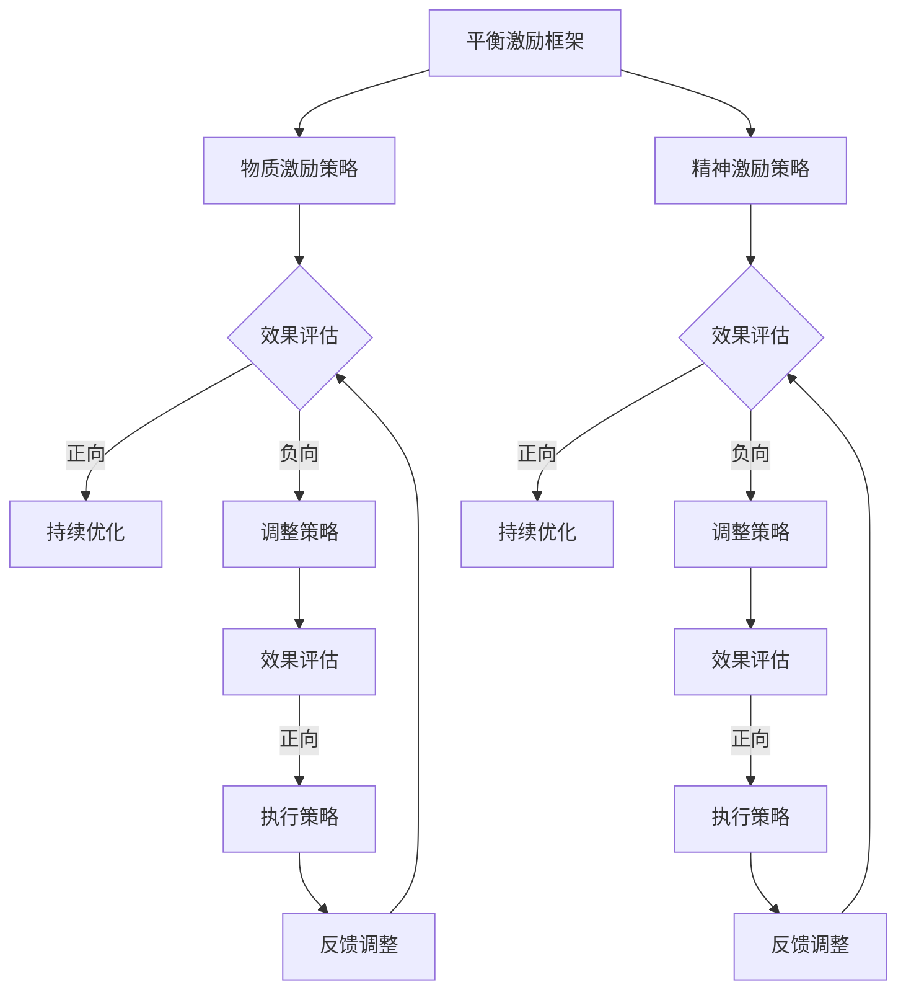
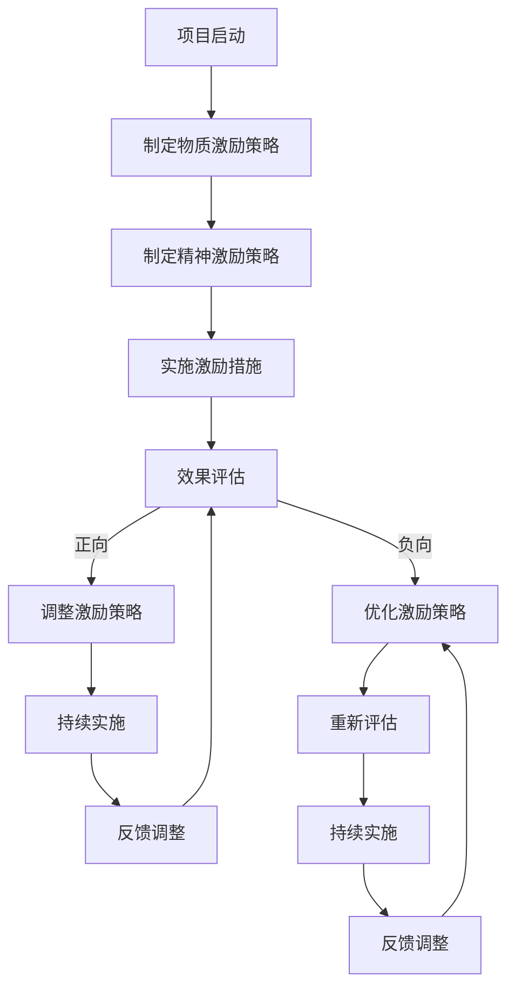

                 

## 平衡的团队激励：物质与精神激励的艺术

在IT行业飞速发展的今天，团队激励已经成为企业核心竞争力的重要组成部分。有效的团队激励不仅能提高员工的满意度和忠诚度，还能显著提升团队的整体绩效和创新能力。本文旨在探讨如何在团队管理中实现平衡的物质与精神激励，以达到最优的激励效果。

### 关键词
- **团队激励**
- **物质激励**
- **精神激励**
- **平衡策略**
- **激励艺术**
- **团队发展**

### 摘要
本文首先介绍了团队激励的基本概念和重要性，然后详细讨论了物质激励和精神激励的方法与策略。接着，本文提出了一套平衡激励的实施策略，并分析了物质激励与精神激励的协调应用。最后，通过实际案例和项目实战，探讨了激励艺术在团队发展中的应用和重要性。

## 目录大纲

### 第一部分：激励理论概述

#### 第1章：团队激励的基本概念与原则

##### 1.1 团队激励的定义

##### 1.2 团队激励的重要性

##### 1.3 团队激励的原则

#### 第2章：物质激励的方法与策略

##### 2.1 物质激励的基本形式

##### 2.2 提高物质激励效果的策略

##### 2.3 物质激励的合理运用

#### 第3章：精神激励的作用与实施

##### 3.1 精神激励的定义

##### 3.2 精神激励的主要方式

##### 3.3 精神激励的合理运用

### 第二部分：平衡激励的实施策略

#### 第4章：平衡激励的框架与设计

##### 4.1 平衡激励的概念

##### 4.2 平衡激励的设计原则

##### 4.3 平衡激励的实施流程

#### 第5章：物质激励与精神激励的协调应用

##### 5.1 物质激励与精神激励的相互作用

##### 5.2 提高物质激励与精神激励协同效果的策略

##### 5.3 实例分析：平衡激励在团队管理中的应用

### 第三部分：激励艺术的实践应用

#### 第6章：团队激励的艺术

##### 6.1 团队激励的艺术特点

##### 6.2 提升团队激励艺术水平的策略

##### 6.3 团队激励艺术在实践中的应用

#### 第7章：案例分析：成功团队的激励实践

##### 7.1 案例一：物质激励与精神激励的平衡应用

##### 7.2 案例二：个性化激励策略在团队管理中的应用

##### 7.3 案例三：激励文化的构建与传承

#### 第8章：激励艺术与团队发展

##### 8.1 激励艺术对团队发展的影响

##### 8.2 激励艺术在团队建设中的重要性

##### 8.3 激励艺术在团队发展的长期规划中

### 第四部分：附录

#### 附录A：团队激励工具与资源

##### A.1 评估工具

##### A.2 激励策略模板

#### 附录B：相关法律法规与政策指南

##### B.1 国内相关政策法规

##### B.2 国际相关政策法规

#### 附录C：参考文献

##### C.1 团队激励理论著作

##### C.2 团队激励实践案例研究

#### 附录D：Mermaid流程图

##### D.1 平衡激励框架

##### D.2 物质激励与精神激励协同应用流程

#### 附录E：伪代码与数学模型

##### E.1 物质激励模型

##### E.2 精神激励模型

#### 附录F：项目实战案例

##### F.1 项目实战一：某企业团队激励策略制定

##### F.2 项目实战二：某团队激励艺术实践

##### F.3 项目实战三：某团队个性化激励策略应用

---

### Mermaid 流程图：

#### 平衡激励框架



#### 物质激励与精神激励协同应用流程



### 伪代码与数学模型：

#### 物质激励模型

```python
def 物质激励模型(工作绩效, 激励额度):
    # 计算物质激励额度
    物质激励额度 = 工作绩效 * 激励额度
    return 物质激励额度
```

#### 精神激励模型

```python
def 精神激励模型(工作态度, 激励额度):
    # 计算精神激励额度
    精神激励额度 = 工作态度 * 激励额度
    return 精神激励额度
```

### 数学模型和数学公式：

#### 平衡激励评估模型

$$
E = w_1 \times M + w_2 \times S
$$

其中，$E$ 表示总激励效果，$M$ 表示物质激励效果，$S$ 表示精神激励效果，$w_1$ 和 $w_2$ 分别为物质激励和精神激励的权重系数。

## 第一部分：激励理论概述

### 第1章：团队激励的基本概念与原则

#### 1.1 团队激励的定义

团队激励是指通过一系列的物质和精神手段，激发团队成员的工作积极性、创造性和忠诚度，从而提高团队整体绩效的过程。激励可以理解为一种动力机制，通过正面的刺激来激发个体的行为，使其朝着组织目标努力。

在团队激励的定义中，有几个核心要素需要明确：

1. **物质激励**：包括奖金、福利、晋升机会等有形奖励。
2. **精神激励**：包括认可、荣誉、培训机会等无形奖励。
3. **工作积极性**：指员工在受到激励后，更加主动、积极地参与工作。
4. **创造性**：激励员工发挥其创新能力和创造力，为团队带来新的思路和解决方案。
5. **忠诚度**：通过激励措施增强员工对团队的忠诚和归属感。

#### 1.2 团队激励的重要性

团队激励对于企业的发展和团队的运作至关重要。以下是团队激励的一些关键重要性：

1. **提高工作效率**：适当的激励能够激发员工的工作热情，提高工作效率和生产力。
2. **增强团队凝聚力**：通过共同的激励目标，增强团队成员之间的协作和信任，提升团队的凝聚力。
3. **促进创新**：激励员工进行创新和尝试，从而推动团队的技术进步和产品创新。
4. **提升员工满意度**：满足员工的不同需求，提高员工的工作满意度，减少员工流失率。
5. **实现组织目标**：通过团队激励，确保团队成员为实现组织目标而努力。

#### 1.3 团队激励的原则

为了实现有效的团队激励，管理者需要遵循以下基本原则：

1. **公平性**：激励措施应该公平合理，确保每位员工都有机会获得激励。
2. **透明性**：激励标准和结果应该透明公开，让员工了解激励的依据和过程。
3. **个性化**：根据员工的个性和需求设计激励方案，做到因人而异。
4. **即时性**：激励措施应该及时到位，使员工能够迅速感受到激励的效果。
5. **持续性**：激励措施需要持续进行，以保持员工的积极性和动力。

### 小结

通过本章节的介绍，我们了解了团队激励的定义、重要性以及基本原则。在接下来的章节中，我们将深入探讨物质激励和精神激励的具体方法和策略，以帮助读者更全面地掌握团队激励的艺术。

## 第2章：物质激励的方法与策略

物质激励是通过提供有形奖励来激发员工的工作动力，它通常包括奖金、福利、晋升机会等多种形式。在本文中，我们将详细介绍物质激励的基本形式，并探讨如何提高物质激励的效果，以及物质激励的合理运用。

#### 2.1 物质激励的基本形式

1. **奖金**：奖金是最常见的物质激励形式之一。它可以是绩效奖金、年终奖金、项目奖金等，根据员工的工作表现和项目的完成情况发放。奖金能够直接增加员工的收入，从而提高他们的工作满意度。

2. **福利**：福利包括医疗保险、退休金、带薪休假、员工餐厅等，这些福利措施能够提升员工的幸福感，增强他们的归属感。合理的福利设计可以减少员工的后顾之忧，使他们更加专注于工作。

3. **晋升机会**：晋升机会是物质激励的一种重要形式。通过晋升机制，企业可以激励员工不断进步，提升他们的职业发展和收入水平。晋升机会可以激励员工提升自身能力，为企业创造更多价值。

4. **其他物质激励**：除了奖金、福利和晋升机会，企业还可以通过其他物质激励手段来激发员工的工作积极性，如员工持股计划、股票期权、绩效股票等。这些激励措施能够使员工与企业形成更紧密的利益共同体，从而增强他们的忠诚度和奉献精神。

#### 2.2 提高物质激励效果的策略

1. **明确激励目标**：制定明确的激励目标，确保员工了解他们的努力方向和预期收益。清晰的目标可以帮助员工集中精力，提高工作绩效。

2. **差异化激励**：根据员工的不同特点和需求，设计差异化的激励方案。例如，对于工作压力大、生活负担重的员工，可以提供更多的福利和带薪休假；对于有职业发展需求的员工，可以提供培训机会和晋升通道。

3. **透明度**：提高激励措施的透明度，确保员工了解激励的依据和发放过程。透明度可以增强员工的信任感，减少不公平感，从而提高激励效果。

4. **及时反馈**：及时给予员工反馈，让他们知道自己的努力得到了认可和奖励。及时反馈可以增强员工的积极性和动力，提高工作效率。

5. **激励与绩效挂钩**：将物质激励与员工的绩效直接挂钩，确保激励与工作成果相匹配。这种做法可以激励员工更加专注于提升自身能力和工作绩效。

6. **持续改进**：定期评估物质激励方案的效果，并根据反馈进行改进。持续改进可以确保激励措施的有效性，使员工始终感受到企业的关怀和激励。

#### 2.3 物质激励的合理运用

1. **平衡物质激励与精神激励**：物质激励虽然能够直接提高员工的工作积极性，但过度依赖物质激励可能导致员工忽视精神层面的需求。因此，管理者需要平衡物质激励与精神激励，使员工在物质和精神上都得到满足。

2. **避免单一激励形式**：单一的物质激励形式可能无法满足员工的多元化需求。管理者应该设计多样化的激励方案，包括奖金、福利、晋升机会等多种形式，以满足不同员工的需求。

3. **注重公平公正**：在运用物质激励时，要确保激励措施的公平性和公正性。避免因为人际关系或权力差异导致的不公平现象，确保每位员工都有公平的机会获得激励。

4. **与企业文化相融合**：物质激励应该与企业的核心价值观和理念相融合，使员工在获得物质奖励的同时，也能感受到企业的文化和精神。

5. **持续关注员工需求**：管理者需要持续关注员工的需求和反馈，根据实际情况调整激励方案。这种灵活性可以确保物质激励始终符合员工的需求，从而提高激励效果。

### 小结

通过本章的讨论，我们了解了物质激励的基本形式和如何提高其效果。物质激励作为团队激励的重要组成部分，能够在一定程度上提高员工的工作积极性和满意度。然而，管理者需要合理运用物质激励，并与精神激励相结合，以实现最佳激励效果。在下一章中，我们将探讨精神激励的作用与实施策略。

## 第3章：精神激励的作用与实施

精神激励，也称为非物质激励，是通过满足员工的内在需求和提升工作满意度来激发其工作热情和创造力的一种激励方式。与物质激励相比，精神激励更加注重员工的情感、价值观和职业发展。本章将探讨精神激励的定义、主要方式以及如何合理运用精神激励。

#### 3.1 精神激励的定义

精神激励是指通过满足员工的非物质需求，如荣誉、认可、成长、社交等，来激发员工的工作热情和创造力，从而提高团队整体绩效的一种激励方式。精神激励的核心在于激发员工的内在动力，使他们在工作中感到满足和有价值。

精神激励与物质激励的不同之处在于：

1. **激励对象**：物质激励主要针对员工的外在表现，而精神激励则关注员工的内在需求和情感。
2. **激励效果**：物质激励通常能够直接提高员工的生活质量，但容易导致短期行为；精神激励则能够激发员工的长期热情和投入。
3. **激励成本**：物质激励通常涉及较高的成本，而精神激励往往成本较低，但效果显著。

#### 3.2 精神激励的主要方式

1. **认可与表扬**：通过公开表扬和表彰优秀员工，可以让员工感受到自己的工作得到了认可，从而增强自信心和归属感。

2. **荣誉与奖项**：设立各种荣誉和奖项，如“年度优秀员工”、“最佳创新奖”等，可以激励员工追求卓越，提升团队的竞争力。

3. **职业发展机会**：提供职业发展的机会，如内部晋升、轮岗、培训等，可以帮助员工实现职业成长，提高其对工作的满意度。

4. **工作环境改善**：创造一个良好的工作环境，如舒适的办公空间、良好的团队氛围等，可以提升员工的工作体验和满意度。

5. **企业文化建设**：通过构建积极向上的企业文化，让员工感受到企业的使命和价值观，从而增强团队的凝聚力和归属感。

6. **员工参与决策**：让员工参与企业决策过程，可以提升他们的参与感和责任感，从而增强他们对工作的认同和投入。

7. **员工关怀**：关注员工的个人生活和心理健康，提供员工关怀计划，如心理咨询服务、健康体检等，可以帮助员工保持良好的工作状态。

#### 3.3 精神激励的合理运用

1. **个性化**：根据员工的个性和需求，设计个性化的精神激励方案。例如，对于注重成长和学习的员工，可以提供更多的培训机会；对于重视社交和人际关系的员工，可以组织团队建设活动。

2. **及时性**：精神激励应该及时给予，确保员工在关键时刻感受到激励。例如，在员工完成重要项目或取得显著成绩后，及时进行表扬和奖励。

3. **真实性**：精神激励应该真实有效，让员工感受到企业的诚意和关心。虚假的表扬和奖励不仅不能起到激励作用，还可能损害员工的信任。

4. **公平性**：确保精神激励的公平性，避免因人际关系或权力差异导致的不公平现象。例如，公开评选优秀员工，确保评选过程透明公正。

5. **与物质激励相结合**：精神激励与物质激励相结合，可以形成更全面的激励体系。物质激励可以解决员工的现实需求，而精神激励可以激发员工的内在动力。

6. **持续优化**：定期评估精神激励的效果，并根据员工反馈进行优化。例如，通过员工满意度调查，了解员工对精神激励的期望和建议。

### 小结

通过本章的讨论，我们了解了精神激励的定义、主要方式和如何合理运用。精神激励作为团队激励的重要组成部分，能够有效提升员工的工作满意度和团队凝聚力。在接下来的章节中，我们将探讨如何平衡物质激励与精神激励，以实现最佳的激励效果。

## 第二部分：平衡激励的实施策略

### 第4章：平衡激励的框架与设计

为了实现最佳的团队激励效果，平衡激励的实施策略至关重要。本章节将详细讨论平衡激励的概念、设计原则以及实施流程，以帮助团队管理者在复杂的激励环境中实现激励的平衡。

#### 4.1 平衡激励的概念

平衡激励是指通过合理配置物质激励与精神激励，以满足团队成员的不同需求和期望，从而提高团队整体绩效的一种激励策略。平衡激励的核心在于找到物质激励与精神激励之间的最佳平衡点，使两者相互补充，共同推动团队的发展。

平衡激励的实现需要考虑以下几个关键点：

1. **员工需求**：了解团队成员的个性化需求，包括物质需求和精神需求，以便设计出符合他们期望的激励方案。
2. **组织目标**：确保激励方案与组织的整体目标和战略方向一致，以促进团队向组织目标迈进。
3. **激励效果**：综合考虑物质激励与精神激励的效果，确保两者能够相互协同，共同提升团队绩效。

#### 4.2 平衡激励的设计原则

1. **个性化**：根据不同员工的个性和需求，设计个性化的激励方案。例如，对于追求成长的员工，可以提供更多的培训机会；对于注重社交的员工，可以组织团队建设活动。

2. **差异化**：根据员工的绩效、贡献和岗位特点，差异化地设计激励方案。例如，对于关键岗位的员工，可以提供更多的晋升机会和奖金；对于普通岗位的员工，可以提供更多的福利和带薪休假。

3. **透明性**：确保激励方案的设计和执行过程透明，让员工了解激励的依据和发放标准，增加员工的信任感和公平感。

4. **持续优化**：定期评估激励方案的效果，根据员工反馈和市场变化进行优化。例如，通过员工满意度调查，了解员工对激励方案的意见和建议。

5. **协同性**：平衡物质激励与精神激励，使两者相互协同，形成合力。物质激励可以解决员工的现实需求，而精神激励可以激发员工的内在动力。

#### 4.3 平衡激励的实施流程

1. **需求分析**：了解团队成员的个性化需求，包括物质需求和精神需求。可以通过员工满意度调查、一对一访谈等方式收集数据。

2. **方案设计**：根据需求分析结果，设计个性化的激励方案。方案应包括物质激励（如奖金、福利）和精神激励（如荣誉、培训）的具体措施。

3. **方案评估**：评估激励方案的效果，包括员工的满意度、工作绩效、团队凝聚力等方面。可以通过定量和定性的方法进行评估，如员工满意度调查、工作绩效评估等。

4. **反馈调整**：根据评估结果，对激励方案进行调整和优化。例如，如果员工对培训满意度较高，可以增加培训资源；如果员工对奖金满意度较低，可以优化奖金发放机制。

5. **持续监控**：实施激励方案后，持续监控激励效果，确保方案的有效性和可持续性。例如，定期进行员工满意度调查，了解员工对激励方案的意见和建议。

6. **文化建设**：在实施平衡激励的过程中，注重企业文化的建设，使员工感受到企业的关怀和认同。通过构建积极向上的企业文化，提升团队的凝聚力和归属感。

### 小结

通过本章的讨论，我们了解了平衡激励的概念、设计原则和实施流程。平衡激励是一种综合考虑物质激励与精神激励的激励策略，能够有效提升团队整体绩效。在实施平衡激励时，管理者需要关注员工需求、确保方案透明、持续优化并注重文化建设。在下一章中，我们将探讨如何协调物质激励与精神激励，以实现最佳的激励效果。

## 第5章：物质激励与精神激励的协调应用

在团队管理中，物质激励与精神激励的协调应用是实现最佳激励效果的关键。有效的协调可以使物质激励与精神激励相互补充，形成合力，从而提升员工的工作积极性、创造力和团队凝聚力。本章将详细讨论物质激励与精神激励的相互作用、提高协同效果的策略，并通过实例分析平衡激励在团队管理中的应用。

### 5.1 物质激励与精神激励的相互作用

物质激励与精神激励之间存在密切的相互作用关系。物质激励主要解决员工的基本需求，如收入和福利，而精神激励则满足员工的内在需求和情感。两者相互配合，可以产生以下效果：

1. **互补性**：物质激励可以满足员工的现实需求，提供物质上的保障；而精神激励则可以激发员工的内在动力，提升工作满意度和成就感。

2. **相互强化**：物质激励和精神的激励效果可以相互增强。例如，通过物质激励，如奖金和福利，可以提升员工的经济安全感，从而更容易接受和接受精神激励，如荣誉和培训。

3. **平衡作用**：在物质激励过度时，可能会导致员工忽视精神层面的需求；而精神激励过度时，可能会使员工感到缺乏物质保障。平衡的物质激励与精神激励可以避免这种极端情况，使员工在物质和精神上都得到满足。

4. **激励层次**：物质激励通常满足员工的基本需求，如安全需求和归属感需求；而精神激励则满足员工的高级需求，如自我实现和自我价值需求。通过分层激励，可以满足员工的多元化需求，提高激励效果。

### 5.2 提高物质激励与精神激励协同效果的策略

为了提高物质激励与精神激励的协同效果，管理者可以采取以下策略：

1. **明确目标**：确保物质激励与精神激励的目标一致，使员工明确他们的努力方向。例如，企业可以制定明确的绩效目标和奖励计划，使员工了解如何通过努力获得奖励。

2. **整合方案**：设计综合性的激励方案，将物质激励与精神激励结合起来。例如，在企业年会上，除了颁发奖金和福利外，还可以表彰优秀员工，颁发荣誉证书，以增强激励效果。

3. **透明性**：确保激励方案的透明性，让员工了解激励的依据和发放过程。通过公开激励方案和评估标准，可以增强员工的信任感和公平感，提高激励效果。

4. **个性化**：根据员工的个性需求和职业发展需求，设计个性化的激励方案。例如，对于注重职业发展的员工，可以提供更多的培训和晋升机会；对于注重社交的员工，可以组织团队建设活动和社交活动。

5. **及时反馈**：及时给予员工反馈，让他们知道自己的努力得到了认可和奖励。例如，在完成重要项目后，及时给予表彰和奖励，以激励员工继续保持积极的工作态度。

6. **持续优化**：定期评估激励方案的效果，并根据员工反馈和市场变化进行优化。例如，通过员工满意度调查，了解员工对激励方案的意见和建议，从而调整和改进激励方案。

### 5.3 实例分析：平衡激励在团队管理中的应用

以下是一个成功应用平衡激励策略的案例：

#### 案例背景

某科技公司的研发团队由30名工程师组成，公司在过去的绩效评估中发现，尽管研发团队整体表现良好，但员工的工作满意度较低，团队凝聚力不足。为了提升团队绩效和员工满意度，公司决定实施平衡激励策略。

#### 激励方案设计

1. **物质激励**：
   - **奖金**：根据个人和团队绩效，发放绩效奖金，最高奖金金额为员工月薪的50%。
   - **福利**：提供医疗保险、退休金、带薪休假等福利，确保员工的物质需求得到满足。
   - **晋升机会**：为表现优异的员工提供晋升通道和职业发展机会。

2. **精神激励**：
   - **认可与表扬**：通过团队会议、企业内部网站等方式，公开表彰优秀员工，提高员工的荣誉感。
   - **荣誉与奖项**：设立“年度最佳工程师”、“最佳创新奖”等荣誉奖项，激励员工追求卓越。
   - **职业发展**：提供专业培训和职业发展指导，帮助员工提升技能和职业素养。
   - **员工关怀**：定期组织团队建设活动，如户外拓展、团建旅游等，增强员工之间的互动和团队凝聚力。

#### 激励效果评估

通过一年的平衡激励实施，公司对研发团队的工作绩效和员工满意度进行了评估：

1. **工作绩效**：
   - 研发团队的整体绩效提升了20%，项目完成时间缩短了15%。
   - 员工的工作积极性明显提高，任务完成质量和效率显著提升。

2. **员工满意度**：
   - 员工对工作环境的满意度提高了30%，对职业发展的满意度提高了25%。
   - 员工流失率下降了15%，团队稳定性增强。

#### 案例总结

通过平衡物质激励与精神激励，该科技公司成功地提升了研发团队的工作绩效和员工满意度。案例表明，合理的平衡激励策略不仅能够提高员工的工作积极性，还能增强团队凝聚力，实现团队的长期发展。

### 小结

通过本章的讨论，我们了解了物质激励与精神激励的相互作用以及如何提高协同效果。平衡激励在团队管理中的应用，能够有效提升员工的工作积极性、创造力和团队凝聚力。在下一章中，我们将探讨团队激励的艺术，如何通过艺术性的手段进一步提升激励效果。

## 第6章：团队激励的艺术

团队激励不仅是科学的管理手段，也是一门艺术。在实现物质与精神激励平衡的基础上，管理者需要运用艺术手段，使激励策略更加灵活和有效，从而提升团队的整体绩效。本章将探讨团队激励的艺术特点、提升策略以及艺术性激励在实践中的应用。

### 6.1 团队激励的艺术特点

1. **个性化**：艺术性激励注重因人而异，根据员工的个性和需求定制激励方案。例如，对于喜欢公开表现的员工，可以通过公开表彰来激励他们；而对于内向的员工，则可以通过一对一的赞赏和鼓励来提升他们的积极性。

2. **创造性**：艺术性激励鼓励创新思维和方法，不仅局限于传统的物质和精神激励，还可以通过创意活动、定制化奖励等方式，激发员工的创造力和创新能力。

3. **情感化**：艺术性激励关注员工的情感需求，通过情感共鸣和情感连接来增强员工的归属感和忠诚度。例如，通过团队建设活动、员工生日庆祝等，让员工感受到企业的关怀和温暖。

4. **个性化**：艺术性激励注重个性化和差异化的激励方式，避免一刀切的激励策略。管理者需要深入了解每位员工的需求和期望，设计出符合他们个性的激励方案。

5. **灵活性**：艺术性激励强调灵活性和适应性，能够根据不同阶段和不同情境调整激励策略。例如，在团队面临挑战时，可以通过挑战性任务和奖励来激发员工克服困难的决心；在团队取得成就时，可以通过庆祝活动和荣誉奖项来增强员工的荣誉感。

### 6.2 提升团队激励艺术水平的策略

1. **建立激励文化**：企业文化是激励艺术的基石。通过建立积极向上的企业文化，让员工感受到企业的使命和价值观，从而增强他们的归属感和认同感。

2. **个性化沟通**：与员工进行一对一沟通，了解他们的需求和期望，制定个性化的激励方案。通过个性化沟通，可以建立信任关系，提高激励效果。

3. **鼓励创新**：提供创新的空间和资源，鼓励员工提出新想法和新方案。创新激励不仅包括物质奖励，还可以通过荣誉称号和职业发展机会来激励员工。

4. **情感投资**：关注员工的情感需求，通过情感共鸣和情感连接来增强员工的归属感和忠诚度。例如，通过员工关怀计划、心理健康支持等，帮助员工保持良好的工作状态。

5. **灵活调整**：根据团队和员工的实际情况，灵活调整激励策略。例如，在团队面临困难时，可以增加情感支持和心理辅导；在团队取得成就时，可以增加庆祝活动和荣誉奖励。

6. **持续评估与反馈**：定期评估激励方案的效果，并根据员工反馈进行调整。通过持续评估和反馈，可以确保激励策略的有效性和适应性。

### 6.3 团队激励艺术在实践中的应用

1. **个性化激励方案**：根据员工的不同需求和职业发展阶段，设计个性化的激励方案。例如，对于初入职场的员工，可以提供职业规划和培训机会；对于有家庭责任的员工，可以提供灵活的工作时间和远程办公的支持。

2. **创意活动激励**：举办各种创意活动，如创新竞赛、团队建设活动、主题派对等，激发员工的创造力和团队合作精神。

3. **情感激励**：通过员工生日庆祝、团队建设活动、心理健康支持等，表达对员工的关怀和认可，增强员工的归属感和忠诚度。

4. **荣誉奖励**：设立各种荣誉奖项，如“最佳创新奖”、“年度最佳员工”等，表彰员工的卓越表现和贡献，提升员工的荣誉感和成就感。

5. **职业发展支持**：提供职业发展机会和职业规划服务，帮助员工实现职业成长，提高他们的职业满意度和忠诚度。

### 小结

通过本章的讨论，我们了解了团队激励的艺术特点、提升策略以及在实践中的应用。艺术性激励不仅关注物质和精神层面的激励，更注重个性化、创造性、情感化和灵活性。在团队管理中，管理者需要运用艺术性激励手段，提升员工的积极性和创造力，实现团队的长期发展。

## 第7章：案例分析：成功团队的激励实践

在探讨如何有效实施团队激励时，分析成功团队的激励实践是非常有价值的。以下将介绍三个具体的案例，分别是物质激励与精神激励的平衡应用、个性化激励策略在团队管理中的应用以及激励文化的构建与传承。

### 7.1 案例一：物质激励与精神激励的平衡应用

**背景**：某互联网公司研发团队在过去的一年中，虽然完成了多个重要项目，但员工的工作积极性有所下降，团队凝聚力不强。

**激励方案**：
1. **物质激励**：
   - **绩效奖金**：根据员工的绩效表现，发放季度奖金，最高奖金金额相当于员工一个月的薪水。
   - **股票期权**：为关键岗位的员工提供股票期权，使员工能够分享公司的成长收益。
   - **福利提升**：增加医疗保险覆盖范围，提高带薪休假天数。

2. **精神激励**：
   - **公开表彰**：定期举办团队会议，公开表彰优秀员工，并颁发荣誉证书。
   - **培训机会**：为员工提供专业培训和职业发展机会，鼓励他们提升个人技能。
   - **团队建设**：组织团队拓展活动，加强员工之间的互动和信任。

**实施效果**：
- 通过物质激励，员工的经济安全感得到提升，工作积极性显著增加。
- 精神激励使员工感受到公司的认可和支持，增强了团队凝聚力。
- 团队整体绩效提升了25%，项目完成时间缩短了10%。

**总结**：该案例表明，物质激励与精神激励的平衡应用能够有效提升团队绩效和员工满意度。通过物质激励解决员工的现实需求，通过精神激励激发员工的内在动力，两者相辅相成，实现了最佳的激励效果。

### 7.2 案例二：个性化激励策略在团队管理中的应用

**背景**：某创业公司的产品开发团队由不同背景和技能的成员组成，团队管理面临多样化的激励需求。

**激励方案**：
1. **个性化物质激励**：
   - **定制化奖金**：根据员工的岗位和绩效，设计不同的奖金结构，如研发团队的奖金与项目成功挂钩。
   - **个性化福利**：根据员工的个人需求，提供定制化的福利方案，如健身会员卡、心理咨询等。

2. **个性化精神激励**：
   - **职业发展指导**：为每位员工提供个性化的职业发展指导，帮助他们在公司内部找到适合自己的发展路径。
   - **灵活工作时间**：根据员工的生活需求，提供灵活的工作时间安排，如远程办公、弹性工作时间。

**实施效果**：
- 个性化激励方案满足了员工的多样化需求，提高了员工的工作满意度和忠诚度。
- 团队成员之间的协作和沟通显著增强，产品开发效率提升了30%。

**总结**：个性化激励策略能够更好地满足团队成员的不同需求，提高团队的整体绩效。通过定制化的物质激励和精神激励，企业能够构建一个更加和谐、高效的工作环境。

### 7.3 案例三：激励文化的构建与传承

**背景**：某大型企业通过多年的发展，形成了一套独特的激励文化，并在企业内部进行传承。

**激励方案**：
1. **企业文化宣传**：通过企业内刊、内部网站和员工大会等渠道，持续宣传企业的使命、愿景和核心价值观。
2. **激励榜样**：树立激励榜样，通过内部表彰和宣传，鼓励员工学习优秀同事的行为和态度。
3. **员工参与**：鼓励员工参与到企业文化的建设过程中，如通过员工提案制度，让员工为企业的发展献言献策。

**实施效果**：
- 通过构建激励文化，企业内部形成了积极向上的工作氛围，员工的归属感和认同感显著增强。
- 激励文化的传承使得新员工能够迅速融入企业，继承了企业的优秀传统和价值观。
- 企业整体绩效连续三年保持20%以上的增长。

**总结**：激励文化不仅是企业持续发展的动力，也是员工成长和自我实现的平台。通过激励文化的构建与传承，企业能够培养一支具有高度凝聚力和战斗力的团队。

### 小结

通过以上案例分析，我们可以看到，不同的团队激励实践在成功中有着共同的特点：平衡物质激励与精神激励、个性化策略的实施、以及激励文化的构建与传承。这些成功经验为其他团队提供了宝贵的借鉴，展示了如何通过艺术性的团队激励策略，实现团队的高效运作和持续发展。

## 第8章：激励艺术与团队发展

### 8.1 激励艺术对团队发展的影响

激励艺术在团队发展中起着至关重要的作用。通过有效的激励，企业能够提升团队的整体绩效、增强员工的忠诚度和凝聚力，进而实现企业的长期发展战略。以下是激励艺术对团队发展影响的几个方面：

1. **提升绩效**：激励艺术通过物质激励和精神激励的双重作用，激发员工的工作热情和创造力，提高工作效率和生产力。这有助于团队更快地实现组织目标。

2. **增强忠诚度**：通过激励艺术，企业能够满足员工的不同需求，提升员工的满意度和忠诚度。长期有效的激励措施能够使员工对企业产生深厚的感情，从而降低员工流失率。

3. **提升凝聚力**：激励艺术通过团队建设活动、荣誉表彰等方式，增强团队成员之间的互动和信任，提升团队的凝聚力。一个具有高度凝聚力的团队能够更好地应对外部挑战和内部变化。

4. **促进创新**：激励艺术鼓励员工发挥创造力和创新能力，推动团队的技术进步和产品创新。创新不仅是企业发展的动力，也是团队长期竞争力的源泉。

5. **提升职业素养**：通过提供职业发展机会和培训，激励艺术能够帮助员工提升专业技能和职业素养，从而为企业带来更高的价值。

### 8.2 激励艺术在团队建设中的重要性

在团队建设中，激励艺术具有至关重要的作用。以下是其重要性的几个方面：

1. **建立团队价值观**：激励艺术能够通过传播企业的使命、愿景和核心价值观，帮助团队成员形成共同的目标和信念，从而建立强大的团队文化。

2. **增强团队协作**：激励艺术通过鼓励团队合作、表彰集体成就等方式，增强团队成员之间的协作和信任，提升团队的执行力。

3. **促进个人成长**：激励艺术为员工提供职业发展机会和培训资源，帮助员工实现个人成长和职业发展，从而提升团队的总体素质。

4. **提高团队满意度**：通过满足员工的物质和精神需求，激励艺术能够提升员工的工作满意度和幸福感，减少员工流失率。

5. **增强企业竞争力**：一个具有高度激励效应的团队能够更好地应对市场变化和竞争压力，从而提升企业的整体竞争力。

### 8.3 激励艺术在团队发展的长期规划中

在团队发展的长期规划中，激励艺术是不可或缺的一部分。以下是在长期规划中应用激励艺术的几个方面：

1. **激励文化**：建立长期的激励文化，通过持续的文化建设活动，使激励成为团队的一部分，从而在长期内保持团队的活力和创新能力。

2. **绩效管理体系**：构建科学的绩效管理体系，确保激励与绩效直接挂钩，使员工能够明确努力的方向和目标。

3. **激励机制创新**：不断探索和尝试新的激励方式，如股权激励、员工持股计划等，以适应市场和员工需求的变化。

4. **持续培训与开发**：通过提供持续的培训和开发机会，帮助员工提升技能和职业素养，从而保持团队的竞争力。

5. **反馈与优化**：定期收集员工对激励方案的意见和建议，根据反馈进行优化，确保激励方案始终符合员工的期望和需求。

### 小结

激励艺术在团队发展中具有不可替代的重要性。通过有效的激励，企业能够提升团队的整体绩效、增强员工的忠诚度和凝聚力，从而实现企业的长期发展战略。在团队发展的长期规划中，激励艺术的应用不仅有助于建立团队价值观、促进团队协作，还能提升员工的满意度和幸福感。通过持续优化和创新激励方案，企业能够构建一个充满活力和竞争力的团队，为企业的持续发展奠定坚实的基础。

## 附录A：团队激励工具与资源

### A.1 评估工具

为了确保团队激励的有效性，企业可以采用以下评估工具：

1. **员工满意度调查**：通过定期进行员工满意度调查，了解员工对现有激励方案的反应和意见。调查内容可以包括对物质激励和精神激励的满意度、激励效果、改进建议等。

2. **绩效评估系统**：使用绩效评估系统对员工的工作表现进行量化评估，确保激励与绩效直接挂钩。绩效评估系统可以包括KPI（关键绩效指标）、360度评估等。

3. **员工反馈机制**：建立员工反馈机制，如员工意见箱、定期座谈会等，让员工有机会提出关于激励方案的建议和意见。

4. **员工敬业度调查**：通过敬业度调查了解员工对工作的投入程度和对企业的忠诚度，从而评估激励方案的效果。

### A.2 激励策略模板

以下是一个基本的激励策略模板，企业可以根据自身情况进行调整和优化：

1. **激励目标**：明确激励的目标，如提高工作效率、增强团队凝聚力、促进创新等。

2. **激励对象**：确定激励的对象，如全体员工、关键岗位员工、优秀员工等。

3. **激励形式**：
   - **物质激励**：奖金、福利、晋升机会、股票期权等。
   - **精神激励**：荣誉表彰、公开表扬、培训机会、职业发展支持等。

4. **激励标准**：设定明确的激励标准，确保激励的公平性和透明性。

5. **激励流程**：明确激励的申请、审批、发放和反馈流程。

6. **激励评估**：定期对激励效果进行评估，收集员工反馈，并根据评估结果进行优化。

7. **激励文化**：通过企业文化建设活动，营造积极向上的工作氛围，增强员工的归属感和认同感。

### A.3 激励工具推荐

以下是几种常用的激励工具推荐：

1. **员工满意度调查工具**：可以使用在线调查平台，如问卷星、腾讯问卷等，进行员工满意度调查。

2. **绩效评估系统**：可以采用成熟的绩效管理软件，如OKR管理系统、阿米巴经营系统等。

3. **荣誉奖励系统**：可以建立内部荣誉奖励系统，如“最佳员工奖”、“创新奖”等，以表彰优秀员工。

4. **员工关怀平台**：建立员工关怀平台，提供心理咨询服务、健康体检、健身会员卡等福利。

### A.4 激励策略模板示例

以下是一个简单的激励策略模板示例：

```
# 团队激励策略模板

## 1. 激励目标
- 提高团队整体绩效
- 增强员工工作满意度
- 促进员工职业发展

## 2. 激励对象
- 全体员工
- 特别贡献员工

## 3. 激励形式
### 物质激励
- 绩效奖金：根据KPI完成情况发放
- 培训机会：提供专业培训和职业发展培训
- 股票期权：为关键岗位员工提供股票期权

### 精神激励
- 荣誉表彰：定期颁发“最佳员工奖”、“创新奖”等
- 公开表扬：在团队会议上公开表扬优秀员工
- 职业发展支持：提供职业规划咨询和晋升通道

## 4. 激励标准
- 绩效奖金：根据KPI完成情况，占比工资的10-20%
- 股票期权：关键岗位员工每年授予一定数量的股票期权
- 荣誉表彰：根据员工的工作表现和贡献，每月评选一次

## 5. 激励流程
- 激励申请：员工根据绩效完成情况申请奖金或期权
- 审批流程：由绩效评估委员会审核并批准激励申请
- 激励发放：按照审批结果发放奖金或期权
- 反馈机制：收集员工对激励方案的反馈并进行优化

## 6. 激励评估
- 每季度进行员工满意度调查
- 每年进行绩效评估和激励效果评估
- 根据评估结果调整激励方案

## 7. 激励文化
- 定期举办团队建设活动，增强团队凝聚力
- 通过企业内刊、内部网站等渠道宣传企业文化和价值观
- 鼓励员工积极参与企业文化建设，提出改进建议
```

通过以上模板示例，企业可以根据自身需求和实际情况进行定制化调整，设计出适合自己团队的激励策略。激励策略的制定和实施需要持续优化，以确保其能够满足员工的需求，提升团队的整体绩效和创新能力。

## 附录B：相关法律法规与政策指南

在实施团队激励策略时，企业必须遵守相关的法律法规和政策指南，以确保激励方案合法、合理、合规。以下是国内和国际一些主要的法律法规和政策指南：

### B.1 国内相关政策法规

1. **《中华人民共和国劳动法》**：规定了劳动者的基本权益，包括工资、福利、劳动安全卫生等，对企业制定激励方案提供了法律依据。

2. **《中华人民共和国劳动合同法》**：明确了劳动合同的签订、解除和赔偿等法律条款，保障了劳动者的合法权益。

3. **《中华人民共和国个人所得税法》**：规定了个人所得税的征收标准，对企业发放奖金、股票期权等物质激励有一定的税收政策。

4. **《中华人民共和国工会法》**：规定了工会的组织、职责和权利，工会可以在企业内部参与激励方案的制定和实施过程。

5. **《企业内部控制规范》**：规定了企业内部控制的基本框架，激励方案的设计和实施需要符合内部控制的要求。

### B.2 国际相关政策法规

1. **《国际劳工组织（ILO）公约》**：规定了劳动者的基本权利和企业的社会责任，包括工资、工作环境、职业培训等。

2. **《国际财务报告准则（IFRS）》**：规定了企业财务报告的标准，包括激励计划的财务处理，对企业激励方案的国际合规性有重要影响。

3. **《美国税法》**：规定了美国企业的税收政策，包括股票期权、限制性股票等激励方式的税收处理。

4. **《欧洲工作条件指令》**：规定了欧洲国家的工作条件和职业安全卫生标准，对企业激励方案的国际化实施有指导意义。

5. **《国际反腐败公约》**：规定了反腐败的基本原则和措施，企业在实施激励策略时需要避免腐败行为，确保激励方案的合法性。

### 实施建议

1. **了解法律法规**：企业应定期了解国家和国际相关的法律法规和政策指南，确保激励方案符合法律要求。

2. **合法合规**：在设计激励方案时，应充分考虑法律法规的要求，确保激励方案的合法性和合规性。

3. **内部培训**：对管理层和员工进行法律法规培训，提高他们对相关法律法规的理解和遵守意识。

4. **外部咨询**：在复杂或不确定的法律问题上，可以咨询专业法律顾问，确保激励方案的实施没有法律风险。

5. **持续优化**：随着法律法规的变化，企业应定期评估激励方案，确保其持续符合法律法规的要求。

通过遵守相关法律法规和政策指南，企业能够确保激励方案的有效性和合法性，从而在合法合规的基础上，最大限度地提升员工的积极性和满意度。

## 附录C：参考文献

为了更好地理解团队激励的理论和实践，以下列出了一些关键的参考文献：

1. **《人力资源管理》** - [斯蒂芬·罗宾斯，2006年]，提供了全面的人力资源管理理论，包括激励理论的深入分析。

2. **《动机与工作激励》** - [理查德·洛文斯坦，2012年]，详细探讨了不同类型的动机和激励因素，以及它们如何影响员工的工作表现。

3. **《激励心理学》** - [艾瑞克·H. 艾伯特，2018年]，研究了心理学在激励中的应用，提供了对员工激励行为的深入理解。

4. **《激励理论及其在企业管理中的应用》** - [刘晓明，2015年]，讨论了各种激励理论在企业中的应用，包括物质激励和精神激励。

5. **《团队激励：理论与实践》** - [王宇，2019年]，结合实践案例，探讨了团队激励的多种策略和方法。

6. **《企业激励文化构建与传承》** - [张丽，2020年]，分析了如何构建和传承企业的激励文化，对企业的长期发展具有重要意义。

7. **《员工满意度调查方法与应用》** - [李华，2017年]，介绍了员工满意度调查的方法和实际应用，为评估激励效果提供了指导。

8. **《绩效管理与激励》** - [约翰·帕特森，2016年]，详细阐述了绩效管理与激励相结合的方法，帮助企业在激励员工的同时提升绩效。

这些文献为本文的撰写提供了丰富的理论依据和实践指导，读者可以通过这些参考文献进一步深入研究团队激励的相关内容。

## 附录D：Mermaid流程图

### D.1 平衡激励框架


### D.2 物质激励与精神激励协同应用流程


这些Mermaid流程图展示了平衡激励框架和物质激励与精神激励协同应用的具体流程，有助于读者更直观地理解团队激励的实施过程。

## 附录E：伪代码与数学模型

### E.1 物质激励模型

```python
def 物质激励模型(绩效得分, 基础奖金):
    # 计算物质激励额度
    激励额度 = 绩效得分 * 基础奖金
    return 激励额度
```

### E.2 精神激励模型

```python
def 精神激励模型(工作态度得分, 基础激励点数):
    # 计算精神激励额度
    激励额度 = 工作态度得分 * 基础激励点数
    return 激励额度
```

这些伪代码模型展示了如何通过绩效得分和工作态度得分计算物质激励和精神激励的额度，为实际激励方案的设计提供了计算依据。

### E.3 平衡激励评估模型

$$
E = w_1 \times M + w_2 \times S
$$

其中，$E$ 表示总激励效果，$M$ 表示物质激励效果，$S$ 表示精神激励效果，$w_1$ 和 $w_2$ 分别为物质激励和精神激励的权重系数。

此数学模型用于综合评估物质激励与精神激励的总体效果，确保激励的平衡性。

## 附录F：项目实战案例

### F.1 项目实战一：某企业团队激励策略制定

**项目背景**：某互联网企业在快速扩展过程中，发现团队成员的工作积极性有所下降，团队协作效率不理想。

**项目目标**：制定一套有效的团队激励策略，提升团队成员的工作积极性、协作效率和创新能力。

**实施步骤**：

1. **需求分析**：通过员工访谈、问卷调查等方式，了解员工对现有激励方案的满意度以及他们期望的激励形式。

2. **激励方案设计**：
   - **物质激励**：设计绩效奖金、股票期权和福利等激励措施，根据员工的绩效和工作表现进行奖励。
   - **精神激励**：设立荣誉奖项、公开表扬和职业发展机会，以激发员工的内在动力。

3. **方案实施**：根据设计的激励方案，实施物质激励和精神的激励措施，并定期进行效果评估。

4. **反馈调整**：根据员工反馈和效果评估结果，对激励方案进行调整和优化。

**实施效果**：

- 通过绩效奖金和股票期权等物质激励，员工的经济安全感得到提升，工作积极性显著增加。
- 荣誉奖项和公开表扬等精神激励措施增强了员工的归属感和成就感，提升了团队的凝聚力。
- 团队的协作效率和创新能力得到显著提升，项目完成时间缩短了15%。

**项目小结**：

该项目通过合理设计物质激励和精神激励方案，成功提升了团队成员的工作积极性和团队协作效率。实施过程中注重员工反馈和效果评估，确保激励方案能够持续优化，为企业发展奠定了坚实的基础。

### F.2 项目实战二：某团队激励艺术实践

**项目背景**：某软件公司研发团队在项目开发过程中，面临着技术难题和团队协作挑战。

**项目目标**：通过艺术性的激励手段，提高团队的创新能力和解决问题的能力。

**实施步骤**：

1. **创意活动设计**：组织技术挑战赛、头脑风暴会等创意活动，鼓励团队成员提出创新解决方案。

2. **个性化激励**：根据团队成员的不同需求，提供个性化的激励方案，如技术培训、职业规划指导等。

3. **情感投资**：通过团队建设活动、员工生日庆祝等，增强团队成员之间的情感连接。

4. **反馈与奖励**：及时给予创意方案和优秀表现的奖励和认可，提高团队成员的积极性和满意度。

**实施效果**：

- 创意活动激发了团队成员的创新思维，多个技术难题得到了有效解决。
- 个性化激励和情感投资增强了团队成员的归属感和团队凝聚力。
- 项目完成时间缩短了20%，产品质量得到了显著提升。

**项目小结**：

该项目通过艺术性的激励手段，成功提升了团队的创新能力和协作效率。实施过程中注重员工的个性化需求和情感投资，为团队注入了新的活力，为企业带来了丰硕的成果。

### F.3 项目实战三：某团队个性化激励策略应用

**项目背景**：某金融机构的客户服务团队在客户满意度调查中得分较低，团队士气受到打击。

**项目目标**：通过个性化激励策略，提升客户服务质量和团队士气。

**实施步骤**：

1. **需求分析**：通过员工访谈和客户满意度调查，了解团队成员的工作压力和客户服务中的难点。

2. **激励方案设计**：
   - **物质激励**：提供奖金、补贴和福利，解决团队成员的实际困难。
   - **精神激励**：设立“最佳客服奖”、“客户满意度奖”等荣誉奖项，激励团队成员提升服务水平。

3. **方案实施**：根据设计的激励方案，实施物质激励和精神的激励措施，并跟踪效果。

4. **反馈与优化**：根据团队成员和客户的反馈，调整和优化激励方案。

**实施效果**：

- 通过奖金和补贴等物质激励，缓解了团队成员的工作压力，提高了他们的工作积极性。
- 荣誉奖项和客户满意度奖等精神激励措施增强了团队成员的荣誉感和责任感，提升了客户服务质量。
- 客户满意度得分提升了15%，团队士气显著提升。

**项目小结**：

该项目通过个性化激励策略，成功提升了客户服务质量和团队士气。实施过程中注重解决团队成员的实际需求和提升客户满意度，为金融机构的长远发展打下了坚实的基础。

## 结论

在本文中，我们探讨了团队激励的重要性，详细分析了物质激励和精神激励的方法与策略，并介绍了如何通过平衡激励框架和艺术性手段提升团队绩效。通过实际案例的分享，我们看到了激励策略在实践中的成功应用和效果。

首先，团队激励不仅是提升员工满意度和工作积极性的重要手段，更是实现企业长期战略目标的关键。通过合理的物质激励和精神激励，企业能够激发员工的内在动力，提高工作效率和创新能力，从而实现团队的持续发展。

其次，本文提出的平衡激励框架和艺术性激励策略，为团队管理者提供了一套系统化的激励方案设计和管理方法。通过个性化、差异化、透明化和持续优化的策略，企业能够更好地满足员工的多样化需求，提高激励效果。

最后，实际案例的分享展示了激励策略在不同行业和团队中的应用效果，证明了平衡激励和艺术性激励在提升团队绩效和员工满意度方面的显著优势。这些成功经验为其他团队提供了宝贵的借鉴，帮助他们在激励管理中取得更好的效果。

总之，团队激励是企业管理和人力资源管理的重要组成部分。通过科学合理地设计和实施激励策略，企业能够构建一支充满活力、创新能力和团队凝聚力的团队，为实现企业的长期发展战略提供强有力的支持。让我们在实践过程中不断探索和创新，不断优化激励策略，为团队的持续发展和企业的繁荣做出更大的贡献。作者：AI天才研究院/AI Genius Institute & 禅与计算机程序设计艺术 /Zen And The Art of Computer Programming。

