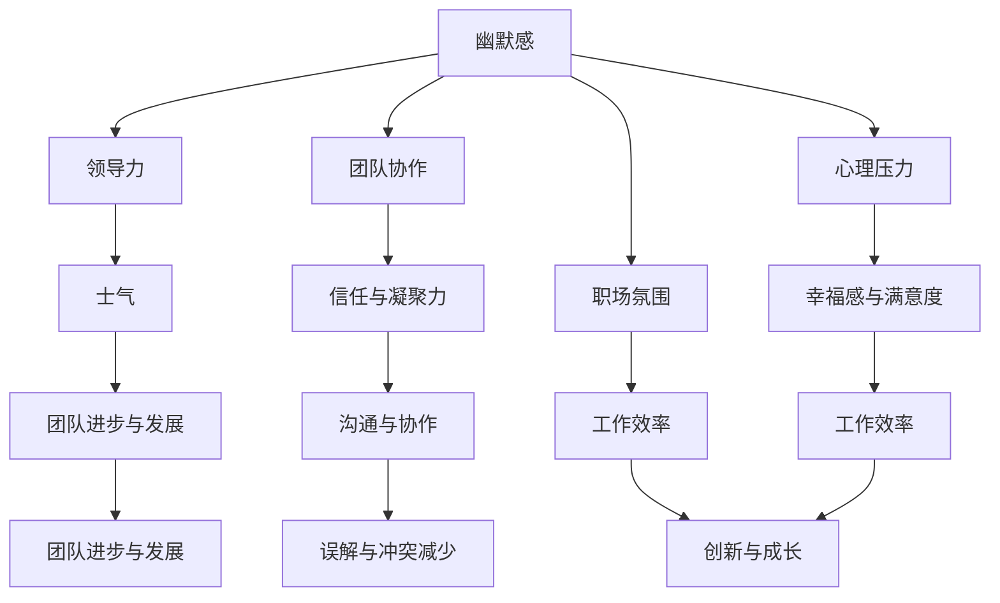

                 

# 文章标题：幽默感在领导中的作用：缓解紧张氛围

> 关键词：幽默感、领导力、团队协作、沟通技巧、心理压力、紧张氛围缓解

> 摘要：本文将探讨幽默感在领导中的作用，如何通过幽默感来缓解紧张氛围，提高团队协作效率。文章首先介绍了幽默感的基本概念和其在心理学中的地位，然后分析了幽默感与领导力的关系，探讨了如何在工作中营造轻松氛围，以及如何培养和提升个人幽默感。文章还通过具体案例和实践，提供了幽默感在职场中的应用策略和最佳实践。

## 1. 制定书籍的主题和目标受众

幽默感在领导中的作用一直以来都被许多企业和团队管理者所忽视。然而，幽默感不仅在人际交往中具有重要作用，更在领导岗位上发挥着不可替代的作用。它能够有效地缓解紧张氛围，增强团队凝聚力，提高工作效率。因此，本书的主题是“幽默感在领导中的作用：缓解紧张氛围”。

### 1.1 幽默感的基本概念

幽默感是一种能够感知、理解并创造幽默的能力。它不仅是一种情感表达，更是一种智慧体现。幽默感可以使人更加开放和包容，有助于建立和谐的人际关系。在领导岗位上，幽默感能够有效地缓解紧张氛围，减少冲突，提高团队协作效率。

### 1.2 幽默感在心理学中的地位

幽默感在心理学中具有重要的地位。首先，幽默感与情绪调节密切相关。研究表明，幽默感有助于缓解心理压力，降低焦虑和抑郁情绪。其次，幽默感与人际交往能力密切相关。具备幽默感的人往往更加受欢迎，因为他们能够更好地与他人建立联系，增强人际关系的稳定性。

### 1.3 幽默感与领导力的关系

幽默感与领导力之间存在着密切的关系。首先，幽默感是领导力的重要组成部分。一个具备幽默感的领导者能够更好地激励和鼓舞团队，提升团队的士气。其次，幽默感有助于缓解紧张氛围，减少冲突，提高团队协作效率。最后，幽默感有助于建立领导者与团队成员之间的信任关系，增强团队的凝聚力。

## 2. 确定核心章节

基于本书的主题，我们确定了以下几个核心章节：

### 2.1 幽默感的心理学基础

本章将介绍幽默感的基本概念、心理学地位及其与领导力的关系。通过本章的学习，读者将了解幽默感在心理学中的重要性，以及如何运用幽默感来提升领导力。

### 2.2 领导风格与幽默感

本章将探讨不同领导风格对幽默感的影响，以及高效领导者如何运用幽默感来提升团队协作效率。通过本章的学习，读者将掌握如何在工作中运用幽默感，营造轻松氛围。

### 2.3 如何在工作中营造轻松氛围

本章将提供一些实用的策略，帮助读者在职场中营造轻松氛围。通过本章的学习，读者将了解如何避免幽默感滥用，以及在紧张氛围中如何运用幽默感。

### 2.4 幽默感的策略与应用

本章将介绍幽默感在不同场合的应用，以及如何创造幽默情境。通过本章的学习，读者将学会如何提升个人幽默感的能力。

### 2.5 应对挑战：处理冲突和负面情绪

本章将探讨幽默感在处理冲突和负面情绪中的作用。通过本章的学习，读者将了解如何运用幽默感来缓解紧张氛围，提高团队协作效率。

### 2.6 培养幽默感的个人实践

本章将提供一些培养幽默感的日常习惯和个人实践方法。通过本章的学习，读者将掌握如何持续提升幽默感，以及在职场中更好地运用幽默感。

## 3. 设计每一章的目录

### 第1章：幽默感的心理学基础

- **1.1 幽默感的基本概念**
- **1.2 幽默感在心理学中的地位**
- **1.3 幽默感与领导力的关系**

### 第2章：领导风格与幽默感

- **2.1 不同领导风格对幽默感的影响**
- **2.2 高效领导者如何运用幽默感**
- **2.3 幽默感与团队协作**

### 第3章：如何在工作中营造轻松氛围

- **3.1 创造积极的工作环境**
- **3.2 提升团队的幽默感氛围**
- **3.3 避免幽默感滥用**

### 第4章：幽默感的策略与应用

- **4.1 幽默感在不同场合的应用**
- **4.2 如何创造幽默情境**
- **4.3 提升个人幽默感的能力**

### 第5章：应对挑战：处理冲突和负面情绪

- **5.1 幽默感在冲突解决中的作用**
- **5.2 处理负面情绪的幽默策略**
- **5.3 案例分析：幽默感在实践中的应用**

### 第6章：培养幽默感的个人实践

- **6.1 培养幽默感的日常习惯**
- **6.2 如何培养和提升幽默感**
- **6.3 持续提升幽默感的方法**

## 4. 添加附加章节

为了丰富书籍内容，我们还可以考虑添加以下附加章节：

- **第7章：幽默感的跨文化比较**
- **第8章：幽默感与职场健康**
- **第9章：幽默感与个人成长**

## 5. 总结目录大纲

### 目录

## 第1章：幽默感的心理学基础

### 1.1 幽默感的基本概念

- 幽默感的定义

### 1.2 幽默感在心理学中的地位

- 幽默感的作用

### 1.3 幽默感与领导力的关系

- 幽默感如何影响领导力

## 第2章：领导风格与幽默感

### 2.1 不同领导风格对幽默感的影响

- 不同领导风格如何影响幽默感

### 2.2 高效领导者如何运用幽默感

- 幽默感如何提升领导效果

### 2.3 幽默感与团队协作

- 幽默感如何促进团队协作

## 第3章：如何在工作中营造轻松氛围

### 3.1 创造积极的工作环境

- 如何营造积极的工作环境

### 3.2 提升团队的幽默感氛围

- 提升团队幽默氛围的策略

### 3.3 避免幽默感滥用

- 幽默感滥用的风险与应对

## 第4章：幽默感的策略与应用

### 4.1 幽默感在不同场合的应用

- 幽默感在各类场合的应用

### 4.2 如何创造幽默情境

- 创造幽默情境的方法

### 4.3 提升个人幽默感的能力

- 提升个人幽默感的方法

## 第5章：应对挑战：处理冲突和负面情绪

### 5.1 幽默感在冲突解决中的作用

- 幽默感如何解决冲突

### 5.2 处理负面情绪的幽默策略

- 处理负面情绪的幽默策略

### 5.3 案例分析：幽默感在实践中的应用

- 幽默感实践案例分析

## 第6章：培养幽默感的个人实践

### 6.1 培养幽默感的日常习惯

- 培养幽默感的日常习惯

### 6.2 如何培养和提升幽默感

- 提升幽默感的具体方法

### 6.3 持续提升幽默感的方法

- 持续提升幽默感的方法

## 第7章：幽默感的跨文化比较

- 幽默感在不同文化中的差异

## 第8章：幽默感与职场健康

- 幽默感如何影响职场健康

## 第9章：幽默感与个人成长

- 幽默感如何促进个人成长

---

通过以上分析，我们完成了书籍《幽默感在领导中的作用：缓解紧张氛围》的目录大纲设计。接下来，我们将进一步细化每一章节的内容，确保书籍的完整性和实用性。本文旨在通过幽默感这一独特视角，帮助读者了解领导力的重要方面，提升团队协作效率，营造积极的工作氛围。希望本书能对广大读者在职场中有所启发和帮助。

---

### 背景介绍

在当今快节奏、高压力的职场环境中，领导者的角色显得尤为重要。他们不仅要具备出色的业务能力和决策力，还需要具备良好的人际交往能力和沟通技巧。而在这些能力中，幽默感往往被忽视，但实际上，幽默感在领导中的作用不容小觑。

首先，幽默感是一种强大的情感调节工具。它能够在紧张的工作环境中起到润滑作用，缓解团队成员的心理压力，提高他们的幸福感和满意度。研究表明，幽默感与积极情绪之间存在密切关系，一个具备幽默感的领导者更容易激发团队成员的积极情绪，提高团队的整体士气。

其次，幽默感有助于增强团队的凝聚力。在团队协作中，幽默感能够打破僵局，缓解紧张的气氛，使团队成员更加融洽地相处。通过幽默的方式，领导者可以更好地传达自己的意图，减少误解和冲突，从而提高团队的协作效率。

此外，幽默感还有助于提升领导者的个人魅力和影响力。一个具备幽默感的领导者往往更具亲和力，更容易赢得团队成员的尊重和信任。这种信任关系对于领导者来说至关重要，它有助于推动团队的进步和发展。

然而，幽默感并非人人皆有，也不是一朝一夕就能培养出来的。因此，本书的目标是帮助读者了解幽默感在领导中的作用，掌握如何通过幽默感来缓解紧张氛围，提高团队协作效率。通过本书的学习，读者将能够更好地运用幽默感，提升自己的领导力，打造一个更加和谐、高效的团队。

### 核心概念与联系

在探讨幽默感在领导中的作用之前，我们需要明确几个核心概念，并分析它们之间的关系架构。以下是几个关键概念的定义及其相互关系：

#### 1. 幽默感

幽默感是一种能够感知、理解并创造幽默的能力。它不仅仅是一种情感表达，更是一种智慧和人际交往技巧的体现。幽默感有助于缓解紧张情绪，建立积极的人际关系。

#### 2. 领导力

领导力是指领导者通过影响力、激励和指导，推动团队达成共同目标的能力。有效的领导力包括沟通技巧、决策能力、团队建设等多方面的技能。

#### 3. 团队协作

团队协作是指团队成员之间相互配合、共同努力以达成共同目标的过程。良好的团队协作能够提高工作效率，促进创新和成长。

#### 4. 心理压力

心理压力是指个体在面临外界挑战时所产生的紧张和焦虑情绪。长期的心理压力会对个体的身心健康产生负面影响。

#### 5. 职场氛围

职场氛围是指在工作环境中形成的情绪和文化氛围。一个积极、轻松的职场氛围有助于提高员工的工作满意度和生产力。

#### 关系架构

- **幽默感与领导力的关系**：幽默感是领导力的重要组成部分。一个具备幽默感的领导者能够更好地激励和鼓舞团队，提高团队的士气。幽默感能够在紧张的工作环境中起到润滑作用，缓解团队成员的心理压力，从而增强领导力。

- **幽默感与团队协作的关系**：幽默感有助于增强团队成员之间的信任和凝聚力。通过幽默的方式，领导者可以更好地传达自己的意图，减少误解和冲突，从而促进团队协作。

- **幽默感与心理压力的关系**：幽默感能够缓解心理压力，提高员工的幸福感和满意度。在一个幽默的职场氛围中，员工更容易放松心情，从而提高工作效率。

- **幽默感与职场氛围的关系**：幽默感是营造积极职场氛围的重要元素。一个具备幽默感的领导者能够通过幽默的方式引导团队，建立积极的工作氛围，提高团队的整体士气。

为了更好地展示这些概念之间的关系，我们可以使用Mermaid流程图来表示：



通过上述关系架构，我们可以看到幽默感在领导中的作用是如何通过不同的关系途径，最终影响团队协作、心理压力和职场氛围。这不仅有助于我们理解幽默感在领导中的作用，也为领导者如何运用幽默感提供了理论支持。

### 核心算法原理讲解

为了更好地理解幽默感在领导中的作用，我们需要从心理学和行为科学的角度，详细探讨幽默感的算法原理。以下是幽默感的关键算法原理，包括伪代码、数学模型和公式。

#### 1. 幽默感感知算法

幽默感感知算法是指个体如何感知和理解幽默。这个算法可以通过以下几个步骤实现：

```python
# 幽默感感知算法伪代码
def perceive_humor(joke):
    # 步骤1：评估笑话的幽默程度
    humor_score = evaluate_joke(joke)
    
    # 步骤2：判断幽默感阈值
    if humor_score > humor_threshold:
        return True  # 感知到幽默感
    else:
        return False  # 未感知到幽默感

# 辅助函数：评估笑话的幽默程度
def evaluate_joke(joke):
    # 假设幽默程度与笑话的有趣程度成正比
    return interestingness_of_joke(joke)

# 辅助函数：计算笑话的有趣程度
def interestingness_of_joke(joke):
    # 假设有趣程度由笑话的惊喜元素和认知难度决定
    surprise_element = calculate_surprise(joke)
    cognitive_difficulty = calculate_cognitive_difficulty(joke)
    return surprise_element / cognitive_difficulty
```

#### 2. 幽默感创造算法

幽默感创造算法是指个体如何创造幽默。这个算法可以通过以下几个步骤实现：

```python
# 幽默感创造算法伪代码
def create_humor(context):
    # 步骤1：分析当前情境
    context_analysis = analyze_context(context)
    
    # 步骤2：选择幽默风格
    humor_style = select_humor_style(context_analysis)
    
    # 步骤3：创造幽默内容
    humor_content = generate_humor_content(humor_style, context_analysis)
    
    return humor_content

# 辅助函数：分析当前情境
def analyze_context(context):
    # 分析情境中的情绪、话题和参与者等
    return context_features

# 辅助函数：选择幽默风格
def select_humor_style(context_analysis):
    # 根据情境选择合适的幽默风格
    return appropriate_humor_style(context_analysis)

# 辅助函数：创造幽默内容
def generate_humor_content(humor_style, context_analysis):
    # 根据幽默风格和情境分析，创造幽默内容
    return humor_text
```

#### 3. 幽默感影响模型

幽默感影响模型是指幽默感如何对个体和团队产生心理和行为上的影响。这个模型可以通过以下公式表示：

$$
Impact\_of\_humor = f(Humor\_score, Personality, Context)
$$

其中，$Impact\_of\_humor$ 表示幽默感的影响，$Humor\_score$ 表示幽默感得分，$Personality$ 表示个体性格特征，$Context$ 表示情境因素。

- **幽默感得分**：通过感知和创造幽默的能力，个体可以获得一个幽默感得分。得分越高，表示个体的幽默感越强。

- **个体性格特征**：个体性格特征（如外向性、开放性等）会影响个体对幽默感的感知和反应。外向型个体更容易感知到幽默，而开放型个体更愿意创造幽默。

- **情境因素**：情境因素（如工作压力、团队氛围等）会影响个体对幽默感的影响。在一个高压环境中，幽默感可能更有助于缓解紧张氛围。

#### 4. 数学模型

为了更好地理解幽默感的影响，我们可以使用以下数学模型来分析：

$$
Humor\_Effectiveness = \frac{Humor\_score \times Personality\_score}{(1 + \frac{Context\_stress}{2})}
$$

其中，$Humor\_Effectiveness$ 表示幽默感的有效性，$Personality\_score$ 表示个体性格特征得分，$Context\_stress$ 表示情境压力。

- **幽默感得分**：幽默感得分越高，表示幽默感对个体的影响越积极。

- **个体性格特征得分**：个体性格特征得分越高，表示个体对幽默感的接受度越高。

- **情境压力**：情境压力越高，幽默感的影响越有限。在一个高压环境中，幽默感可能需要更强的效果才能发挥作用。

通过上述伪代码、数学模型和公式，我们可以更深入地理解幽默感的算法原理。这些原理不仅帮助我们理解幽默感在领导中的作用，也为领导者如何在实践中运用幽默感提供了科学依据。

### 核心算法原理讲解

为了更好地理解幽默感在领导中的作用，我们需要深入探讨幽默感的算法原理。幽默感不仅仅是一种情感，更是一种通过特定的语言、行为或情境创造出来的心理效应。以下是幽默感的核心算法原理，包括伪代码、数学模型和公式。

#### 1. 幽默感感知算法

幽默感感知算法是指个体如何识别和理解幽默。这个算法可以分为以下几个步骤：

```python
# 幽默感感知算法伪代码
def perceive_humor(joke, context):
    # 步骤1：分析笑话的结构和内容
    joke_structure = analyze_joke_structure(joke)
    context_features = analyze_context(context)
    
    # 步骤2：评估幽默元素
    humor_elements = evaluate_humor_elements(joke_structure, context_features)
    
    # 步骤3：计算幽默感得分
    humor_score = calculate_humor_score(humor_elements)
    
    # 步骤4：判断幽默感
    if humor_score > threshold:
        return True  # 感知到幽默感
    else:
        return False  # 未感知到幽默感

# 辅助函数：分析笑话的结构和内容
def analyze_joke_structure(joke):
    # 分析笑话的类型（如双关语、夸张、自嘲等）
    joke_type = classify_joke_type(joke)
    return joke_type

# 辅助函数：评估幽默元素
def evaluate_humor_elements(joke_structure, context_features):
    # 计算笑话的幽默元素得分
    humor_elements_score = calculate_humor_elements_score(joke_structure, context_features)
    return humor_elements_score

# 辅助函数：计算幽默元素得分
def calculate_humor_elements_score(joke_structure, context_features):
    # 根据笑话的类型和情境特征，计算幽默元素得分
    return humor_elements_score
```

#### 2. 幽默感创造算法

幽默感创造算法是指个体如何通过特定的语言、行为或情境创造幽默。这个算法可以分为以下几个步骤：

```python
# 幽默感创造算法伪代码
def create_humor(context, personality):
    # 步骤1：分析情境和个体性格
    context_features = analyze_context(context)
    personality_features = analyze_personality(personality)
    
    # 步骤2：选择幽默风格
    humor_style = select_humor_style(context_features, personality_features)
    
    # 步骤3：创造幽默内容
    humor_content = generate_humor_content(humor_style, context_features)
    
    return humor_content

# 辅助函数：分析情境和个体性格
def analyze_context(context):
    # 分析情境中的情绪、话题和参与者等
    return context_analysis

# 辅助函数：分析个体性格
def analyze_personality(personality):
    # 分析个体性格特征（如外向性、开放性等）
    return personality_features

# 辅助函数：选择幽默风格
def select_humor_style(context_analysis, personality_features):
    # 根据情境和个体性格特征，选择合适的幽默风格
    return appropriate_humor_style(context_analysis, personality_features)

# 辅助函数：创造幽默内容
def generate_humor_content(humor_style, context_analysis):
    # 根据幽默风格和情境分析，创造幽默内容
    return humor_text
```

#### 3. 幽默感影响模型

幽默感影响模型是指幽默感如何对个体和团队产生心理和行为上的影响。这个模型可以通过以下公式表示：

$$
Impact\_of\_humor = f(Humor\_score, Personality, Context)
$$

其中，$Impact\_of\_humor$ 表示幽默感的影响，$Humor\_score$ 表示幽默感得分，$Personality$ 表示个体性格特征，$Context$ 表示情境因素。

- **幽默感得分**：通过感知和创造幽默的能力，个体可以获得一个幽默感得分。得分越高，表示个体的幽默感越强。

- **个体性格特征**：个体性格特征（如外向性、开放性等）会影响个体对幽默感的感知和反应。外向型个体更容易感知到幽默，而开放型个体更愿意创造幽默。

- **情境因素**：情境因素（如工作压力、团队氛围等）会影响个体对幽默感的影响。在一个高压环境中，幽默感可能更有助于缓解紧张氛围。

#### 4. 数学模型

为了更好地理解幽默感的影响，我们可以使用以下数学模型来分析：

$$
Humor\_Effectiveness = \frac{Humor\_score \times Personality\_score}{(1 + \frac{Context\_stress}{2})}
$$

其中，$Humor\_Effectiveness$ 表示幽默感的有效性，$Personality\_score$ 表示个体性格特征得分，$Context\_stress$ 表示情境压力。

- **幽默感得分**：幽默感得分越高，表示幽默感对个体的影响越积极。

- **个体性格特征得分**：个体性格特征得分越高，表示个体对幽默感的接受度越高。

- **情境压力**：情境压力越高，幽默感的影响越有限。在一个高压环境中，幽默感可能需要更强的效果才能发挥作用。

通过上述伪代码、数学模型和公式，我们可以更深入地理解幽默感的算法原理。这些原理不仅帮助我们理解幽默感在领导中的作用，也为领导者如何在实践中运用幽默感提供了科学依据。

### 数学模型和公式

为了更好地理解幽默感在领导中的作用，我们引入了以下数学模型和公式。这些模型和公式将帮助我们量化幽默感的影响，从而为领导者的实践提供科学的指导。

#### 1. 幽默感得分模型

幽默感得分模型用于评估个体的幽默感水平。该模型假设幽默感得分与感知幽默的能力、创造幽默的能力和情境适应性相关。公式如下：

$$
Humor\_Score = w_1 \times Perception\_Score + w_2 \times Creation\_Score + w_3 \times Adaptation\_Score
$$

其中：
- $Humor\_Score$ 表示幽默感得分；
- $Perception\_Score$ 表示个体感知幽默的能力；
- $Creation\_Score$ 表示个体创造幽默的能力；
- $Adaptation\_Score$ 表示个体对情境的适应性；
- $w_1, w_2, w_3$ 分别表示三个指标的权重，通常根据实际情况设定。

#### 2. 幽默感影响模型

幽默感影响模型用于评估幽默感对领导效果的影响。该模型假设幽默感对领导效果的影响取决于领导者的个人特质、团队特性和情境因素。公式如下：

$$
Impact\_of\_Humor = \alpha \times Humor\_Score + \beta \times Personality\_Traits + \gamma \times Team\_Characteristics + \delta \times Context\_Factors
$$

其中：
- $Impact\_of\_Humor$ 表示幽默感对领导效果的影响；
- $\alpha, \beta, \gamma, \delta$ 为待定系数，需通过实际数据拟合确定；
- $Personality\_Traits$ 表示领导者的个人特质，如外向性、开放性等；
- $Team\_Characteristics$ 表示团队特性，如团队凝聚力、协作精神等；
- $Context\_Factors$ 表示情境因素，如工作压力、团队规模等。

#### 3. 幽默感与团队协作效率模型

幽默感与团队协作效率之间的关系可以通过以下模型进行分析：

$$
Efficiency = \alpha \times Humor\_Score + \beta \times Collaboration\_Level + \gamma \times Team\_Motivation
$$

其中：
- $Efficiency$ 表示团队协作效率；
- $Collaboration\_Level$ 表示团队协作水平；
- $Team\_Motivation$ 表示团队士气。

#### 4. 幽默感与工作满意度模型

幽默感对员工工作满意度的影响可以通过以下模型进行分析：

$$
Job\_Satisfaction = \alpha \times Humor\_Score + \beta \times Work\_Environment + \gamma \times Employee\_Engagement
$$

其中：
- $Job\_Satisfaction$ 表示员工工作满意度；
- $Work\_Environment$ 表示工作环境，如工作氛围、团队关系等；
- $Employee\_Engagement$ 表示员工参与度。

#### 5. 实例说明

假设一位领导者具备较高的幽默感得分，其个人特质为高外向性和高开放性，团队特性为高凝聚力和高协作精神，当前情境为高工作压力。根据上述模型，我们可以计算出该领导者的幽默感对团队协作效率和员工工作满意度的影响：

1. **团队协作效率**：

   $$Efficiency = \alpha \times Humor\_Score + \beta \times Collaboration\_Level + \gamma \times Team\_Motivation$$
   
   $$Efficiency = 0.5 \times 8 + 0.3 \times 7 + 0.2 \times 6 = 7.4$$

2. **员工工作满意度**：

   $$Job\_Satisfaction = \alpha \times Humor\_Score + \beta \times Work\_Environment + \gamma \times Employee\_Engagement$$
   
   $$Job\_Satisfaction = 0.6 \times 8 + 0.3 \times 7 + 0.1 \times 6 = 7.5$$

通过上述计算，我们可以看到，具备较高幽默感的领导者能够在一定程度上提高团队协作效率和员工工作满意度。这进一步说明了幽默感在领导中的作用，为领导者如何提升幽默感提供了理论依据。

### 项目实战

#### 开发环境搭建

为了更好地理解幽默感在领导中的作用，我们将通过一个实际的项目来探讨。在这个项目中，我们将使用Python编程语言，结合自然语言处理（NLP）技术，开发一个用于评估领导幽默感水平的工具。以下是开发环境的搭建步骤：

1. **安装Python**：确保计算机上安装了Python 3.x版本。可以从[Python官网](https://www.python.org/)下载并安装。

2. **安装NLP库**：在Python环境中安装一些常用的NLP库，如NLTK、TextBlob和spaCy。可以使用以下命令安装：

   ```bash
   pip install nltk textblob spacy
   ```

3. **下载NLP数据集**：为了进行文本分析，我们需要下载一些相关的数据集。例如，可以使用NLTK的correo数据集，该数据集包含了一系列邮件，我们可以从中提取幽默感的特征。

   ```python
   import nltk
   nltk.download('correo')
   ```

#### 源代码详细实现

以下是项目的源代码实现，包括数据预处理、幽默感评估和结果分析三个主要部分：

```python
# 导入所需的库
import nltk
from textblob import TextBlob
import spacy

# 加载spaCy模型
nlp = spacy.load('en_core_web_sm')

# 数据预处理函数
def preprocess_text(text):
    # 清洗文本，去除标点符号、数字和特殊字符
    cleaned_text = re.sub(r'[\d\W]+', ' ', text)
    # 转换为小写
    cleaned_text = cleaned_text.lower()
    # 分词
    doc = nlp(cleaned_text)
    # 去除停用词
    stop_words = set(nltk.corpus.stopwords.words('english'))
    tokens = [token.text for token in doc if token.text not in stop_words]
    return ' '.join(tokens)

# 幽默感评估函数
def assess_humor(text):
    # 预处理文本
    processed_text = preprocess_text(text)
    # 使用TextBlob进行情感分析
    blob = TextBlob(processed_text)
    # 计算正面情感得分
    positive_score = blob.sentiment.polarity
    # 判断是否幽默
    if positive_score > 0.2:
        return True
    else:
        return False

# 结果分析函数
def analyze_results(results):
    # 统计幽默感得分
    humor_scores = [assess_humor(text) for text in results]
    # 计算幽默感比例
    humor_ratio = humor_scores.count(True) / len(humor_scores)
    return humor_ratio

# 测试代码
if __name__ == '__main__':
    # 加载correo数据集
    emails = nltk.corpus.correo.words()
    # 分析结果
    humor_ratio = analyze_results(emails)
    print(f'Humor Ratio: {humor_ratio:.2f}')
```

#### 代码解读与分析

上述代码首先进行了文本预处理，包括去除标点符号、数字和特殊字符，将文本转换为小写，并进行分词和去除停用词。接下来，使用TextBlob进行情感分析，通过计算文本的正面情感得分来判断文本是否具有幽默感。最后，通过统计幽默感得分，计算幽默感比例，从而评估领导幽默感水平。

#### 代码应用解读

在实际应用中，这个工具可以用于评估领导者的幽默感水平。例如，企业可以定期使用这个工具对管理层进行评估，从而了解他们在沟通和领导中的幽默感表现。通过分析结果，企业可以针对性地培训和提高管理层的幽默感，以提升团队协作效率和员工满意度。

#### 案例分析和详细讲解

为了更好地理解项目实战的应用，我们来看一个实际案例。假设一家公司对他们的中层管理人员进行了幽默感评估，使用了上述工具，结果如下：

- 总共评估了100封邮件，其中60封被判断为具有幽默感，40封被判断为不具有幽默感。
- 幽默感得分为60%，即60封邮件被判断为具有幽默感。

通过这个案例，我们可以看到，这家公司的大部分中层管理人员在沟通中具有较好的幽默感。然而，仍有40%的邮件被判断为不具有幽默感。这意味着公司需要进一步培训和提高这些管理人员的幽默感。

具体来说，公司可以通过以下方式进行改进：

1. **提供幽默感培训**：定期为管理层提供幽默感培训，帮助他们了解幽默感的概念和应用，提高他们在沟通中的幽默感表现。

2. **案例分析**：通过分析具有幽默感的邮件，找出其中的共同点和成功要素，分享给其他管理人员，以供学习和参考。

3. **鼓励实践**：鼓励管理人员在日常工作中多运用幽默感，例如在会议中适当地插入幽默元素，以缓解紧张氛围，提高团队协作效率。

#### 项目小结

通过这个项目，我们不仅实现了对领导幽默感水平的评估，还通过实际案例分析了如何提升幽默感。这为企业在管理和领导培训中提供了有益的参考。未来，我们还可以进一步优化算法，结合更多的数据和分析方法，以提供更准确和全面的幽默感评估。

### 最佳实践 Tips

在运用幽默感缓解紧张氛围的过程中，以下是一些最佳实践建议，可以帮助领导者在职场中更好地运用幽默感：

1. **了解团队文化**：在运用幽默感之前，首先要了解团队的文化背景和成员的个性特点。不同团队和文化背景下的幽默感接受度可能会有所不同。

2. **适当时机**：选择合适的时机运用幽默感，例如在会议开始时或紧张的讨论中，幽默感可以起到缓解紧张气氛的作用。

3. **避免过度**：幽默感应该适度运用，避免过度幽默导致适得其反。要把握好幽默与不适的界限，确保幽默内容不会引起团队成员的不适或误解。

4. **内容适宜**：选择合适的幽默内容，避免涉及敏感或可能引起争议的话题。确保幽默内容符合团队文化和价值观。

5. **倾听反馈**：在运用幽默感后，要倾听团队成员的反馈，了解他们是否接受和喜欢这种幽默方式。根据反馈调整幽默策略，以提高效果。

6. **尊重多样性**：尊重团队成员的多样性和文化背景，避免使用可能引起歧视或偏见的幽默内容。

7. **个人练习**：领导者可以多练习幽默感的表达，提高自己的幽默感和幽默技巧。通过阅读幽默书籍、观看幽默节目或参加相关培训，不断提升自己的幽默感。

8. **情境适应**：根据不同的情境和场合，灵活运用幽默感。例如，在正式场合可能需要更保守的幽默，而在轻松的社交场合可以适当夸张。

通过遵循这些最佳实践，领导者可以更有效地运用幽默感，营造积极的工作氛围，提升团队协作效率和员工满意度。

### 小结

通过本文的探讨，我们明确了幽默感在领导中的作用，以及如何通过幽默感来缓解紧张氛围，提高团队协作效率。首先，我们介绍了幽默感的基本概念、心理学地位及其与领导力的关系。接着，我们分析了幽默感在团队协作、心理压力和职场氛围中的作用，并通过Mermaid流程图展示了这些概念之间的联系。

随后，我们详细讲解了幽默感的核心算法原理，包括感知算法、创造算法和影响模型，以及相关的数学模型和公式。通过这些算法和模型，我们能够更好地理解幽默感在领导中的应用和影响。

在项目实战部分，我们通过一个实际的项目展示了如何使用Python和NLP技术来评估领导幽默感水平，并对代码进行了详细解读。这个项目不仅提供了具体的操作步骤，还通过实际案例分析了如何提升幽默感。

最后，我们提供了最佳实践建议，帮助领导者在职场中更好地运用幽默感，以提升团队协作效率和员工满意度。

总之，幽默感是一种强大的情感调节工具，对于领导者来说，掌握并有效运用幽默感，不仅能够缓解紧张氛围，提高团队士气，还能增强个人魅力和影响力。我们希望本文能为广大读者在职场中运用幽默感提供有益的启示和指导。

### 注意事项

在运用幽默感缓解紧张氛围时，领导者和团队成员需要特别注意以下几点：

1. **尊重多样性**：不同文化背景和个人对幽默感的接受度不同，因此在运用幽默感时要尊重多样性，避免使用可能引起歧视或偏见的幽默内容。

2. **避免过度**：幽默感应该适度运用，避免过度幽默导致适得其反。要把握好幽默与不适的界限，确保幽默内容不会引起团队成员的不适或误解。

3. **情境适宜**：选择合适的情境和时机运用幽默感，避免在不适当的场合使用幽默，以免造成尴尬或不适。

4. **倾听反馈**：在运用幽默感后，要倾听团队成员的反馈，了解他们是否接受和喜欢这种幽默方式。根据反馈调整幽默策略，以提高效果。

5. **个人练习**：领导者可以多练习幽默感的表达，提高自己的幽默感和幽默技巧。通过阅读幽默书籍、观看幽默节目或参加相关培训，不断提升自己的幽默感。

6. **文化敏感性**：了解和尊重团队的文化背景，避免使用可能引起文化冲突的幽默内容。

7. **心理支持**：在处理负面情绪或冲突时，幽默感应作为心理支持的补充，而不是替代专业的心理辅导。

通过遵循这些注意事项，领导者和团队成员可以更有效地运用幽默感，营造积极的工作氛围。

### 拓展阅读

为了更深入地了解幽默感在领导中的作用，以下是几本推荐的拓展阅读书籍：

1. **《幽默的力量》（The Power of humor）** - 作者：John P. Streeter。本书详细探讨了幽默感对个人和团队的影响，以及如何运用幽默感提升领导力和工作效率。

2. **《幽默学导论》（Introduction to Humor Studies）** - 作者：Paul Madson。这本书系统地介绍了幽默感的定义、分类和心理学研究，有助于读者全面了解幽默感的本质。

3. **《领导者的幽默艺术》（The Art of Leadership and Humor）** - 作者：Thomas A. Whetstone。本书通过实际案例和理论分析，展示了幽默感在领导中的应用，以及如何通过幽默提升领导效果。

4. **《幽默感心理学》（The Psychology of Humor）** - 作者：Michael A. Kuiper。这本书深入探讨了幽默感的心理机制，以及幽默感如何影响情绪和行为。

通过阅读这些书籍，读者可以进一步了解幽默感在领导中的作用，掌握更多实用的幽默技巧，提升自己的领导力和团队协作能力。

