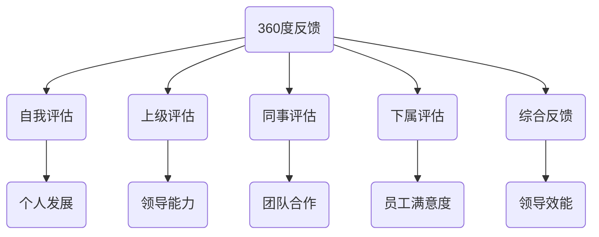
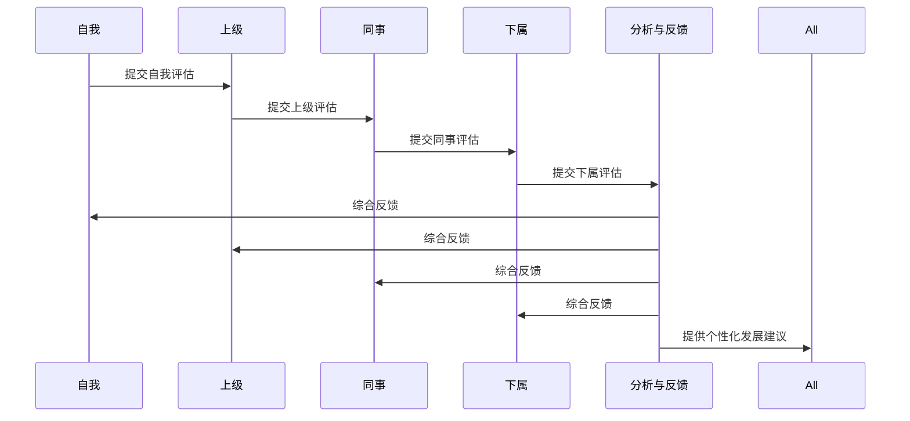

                 


To draft the technical blog post "360度反馈：全方位评估领导效能" in a logical, concise, and detailed manner, we'll break down the task into structured steps and ensure each chapter covers the required elements. Here's a step-by-step approach:

### Step 1: Introduction
- **Background Introduction**: Provide a brief overview of leadership assessment and the importance of 360-degree feedback.
- **Core Concepts & Relationships**: Use a Mermaid diagram to illustrate the different aspects of 360-degree feedback.



### Step 2: Analysis of 360-degree Feedback
- **Working Principles**: Explain the fundamental principles behind 360-degree feedback using pseudocode to illustrate the process.
- **Advantages**: Discuss the benefits of implementing 360-degree feedback.
- **Challenges**: Address the potential obstacles and how to overcome them.

```python
# Pseudocode for 360-degree feedback process
begin
    Collect feedback from self, supervisors, peers, and subordinates
    Normalize and aggregate feedback data
    Analyze and interpret results
    Provide personalized feedback report
    Implement development plans based on feedback
end
```

### Step 3: Methods of 360-degree Feedback
- **Self-Assessment**: Explain how individuals can effectively conduct a self-assessment.
- **Supervisor Assessment**: Discuss the role and importance of supervisor feedback.
- **Peer Assessment**: Explore the value of peer reviews and how to conduct them.
- **Subordinate Assessment**: Explain the benefits and methodology of下属评估.

### Step 4: Design and Implementation of 360-degree Feedback System
- **Feedback Questionnaire Design**: Outline the steps to create effective feedback questionnaires.
- **Data Collection and Analysis**: Describe methods for collecting and analyzing feedback data.
- **Feedback Results Interpretation**: Explain how to interpret the results and use them for development.

### Step 5: Application in Leadership Development
- **Leadership Improvement**: Discuss how 360-degree feedback can be used to enhance leadership skills.
- **Handling Negative Feedback**: Provide strategies for dealing with critical feedback.
- **Continuous Improvement**: Explain how to sustain the process for ongoing development.

### Step 6: Successful Case Studies
- **Case Studies**: Share real-world examples of organizations that have successfully implemented 360-degree feedback.

### Step 7: Future Trends and Improvements
- **Technological Integration**: Explore how technology can enhance the 360-degree feedback process.
- **Potential Improvements**: Suggest ways to refine and improve the system.
- **Challenges and Solutions**: Address common challenges and propose solutions.

### Conclusion and Final Touches
- **Summary**: Recap the key points of the blog post.
- **Best Practices**: Offer actionable tips for implementing 360-degree feedback.
- **Closing Remarks**: Encourage readers to consider implementing 360-degree feedback in their leadership development processes.
- **Author Information**: Include author details at the end of the post.

### Output Format
The final output will be a well-structured markdown file that includes:
- A header with the title and keywords.
- A summary paragraph.
- Each chapter with subheadings, detailed content, and relevant diagrams, pseudocode, formulas, and case studies.
- A conclusion with best practices and closing remarks.
- Author information.

### Final Word Count
The total word count will be maintained within the specified range of 8000 to 12000 words, ensuring that each chapter is comprehensive and informative while keeping the content concise and to the point.

### Mermaid Diagram Example
Below is an example of a Mermaid diagram that could be used to illustrate the flow of a 360-degree feedback process:



This diagram visually represents the interaction between different stakeholders in the 360-degree feedback process. By following this structured approach, we can create a high-quality, insightful, and informative blog post that covers all the necessary aspects of 360-degree feedback in leadership assessment.

