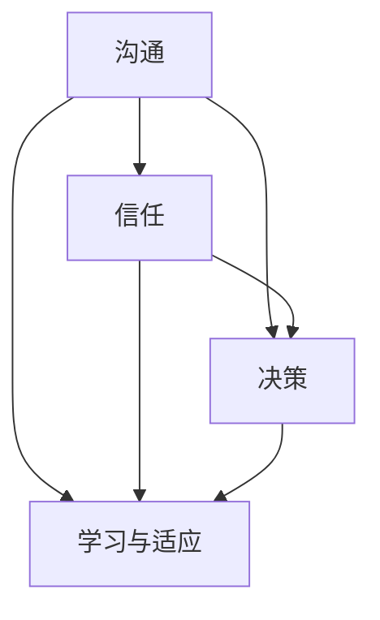

                 

### 引言

在现代科技迅猛发展的时代，创新已经成为企业持续发展的核心动力。创新文化，作为一种独特的企业文化，它不仅能够激发员工的创造力和冒险精神，还能够推动企业的技术进步和市场竞争力。建立创新文化，意味着在企业内部营造一个鼓励冒险和创意的环境，使员工敢于突破传统思维，勇于尝试新事物。然而，如何有效地建立和维持这样的文化，是一个复杂且具有挑战性的问题。

本文旨在探讨如何通过鼓励冒险和创意，营造一种积极向上的创新文化。文章首先介绍了创新文化的定义、历史背景及其与其他组织文化的区别。接着，文章深入分析了冒险和创意在创新文化中的作用，并使用伪代码详细阐述了冒险和创意促进创新文化的算法原理。此外，文章还介绍了如何使用数学模型来评估创新文化的成效，并通过实际案例展示了建立创新文化的具体步骤。最后，文章讨论了如何营造一个鼓励冒险和创意的工作环境，以及如何持续发展和优化创新文化。

### 创新文化的定义

创新文化是一种特殊的企业文化，它强调创新的重要性，鼓励员工在工作中寻求创新，勇于突破常规。创新文化不仅仅是一种理念，更是一种实践，它渗透到企业的方方面面，包括员工行为、组织结构、决策过程等。创新文化的主要目标是激发员工的创造力，推动企业的持续发展。

创新文化与一般组织文化有显著的区别。一般组织文化通常强调稳定、效率和标准化，注重流程和规则。而创新文化则更倾向于灵活性、开放性和实验性，鼓励员工敢于冒险、勇于尝试。例如，在一个注重效率的组织中，员工可能会因为担心犯错而回避创新，而在一个创新文化中，员工则会更加愿意尝试新的想法和方法。

创新文化的组成部分主要包括以下几个方面：

1. **沟通**：良好的沟通是创新文化的基础。在创新文化中，员工之间、员工与管理者之间的沟通渠道是开放和畅通的，信息能够快速传递，这有助于促进新想法的诞生。

2. **信任**：信任是创新文化的核心要素。在一个信任的环境中，员工感到安全，愿意分享自己的想法，并且相信他们的意见会被尊重和采纳。

3. **决策**：创新文化鼓励快速决策。在面对不确定性时，传统组织可能会因为担心风险而犹豫不决，而创新文化则倾向于迅速做出决策，并允许失败。

4. **学习与适应**：创新文化强调持续学习和快速适应变化。在这种文化中，员工被鼓励不断更新知识和技能，以应对不断变化的市场和技术。

5. **激励机制**：创新文化需要有效的激励机制来支持员工的创新行为。这些激励机制可能包括奖金、晋升机会、认可和荣誉等。

通过这些组成部分，创新文化为企业创造了一个鼓励冒险和创意的环境，使员工能够充分发挥他们的潜力，推动企业的技术进步和市场竞争力。

为了更直观地展示创新文化的组成部分，我们可以使用 Mermaid 流程图来描述它们之间的关系：



在这个流程图中，沟通、信任、决策和学习与适应是创新文化的重要组成部分，它们相互联系、相互促进，共同构建了一个支持创新的生态环境。通过这样的结构化描述，我们可以更清楚地理解创新文化的内涵，以及如何在实际工作中营造和维持这样的文化。

### 冒险和创意在创新文化中的作用

冒险和创意是创新文化的核心驱动力，它们在创新文化的形成和发展中扮演着至关重要的角色。冒险行为指的是在不确定性和风险中寻求机会的行为，而创意则是创新思维的结果，是一种突破性思维方法。这两个元素不仅能够激发员工的创造力，还能够推动企业的创新进程。

首先，冒险行为在创新文化中发挥着至关重要的作用。在一个鼓励冒险的环境中，员工会感到更加安全和自由，他们敢于尝试新的想法和方法，即使这些尝试可能存在失败的风险。这种冒险精神可以激发员工的潜能，使他们能够在工作中不断寻求突破。例如，一个成功的创新项目往往始于一个看似不可能的冒险尝试。冒险行为不仅能够推动新产品的研发和市场开拓，还能够帮助企业适应快速变化的市场环境。

为了更好地理解冒险行为在创新文化中的作用，我们可以通过一个简单的伪代码来阐述其算法原理：

```python
def innovate():
    if risk():
        if creativity():
            return true
    return false
```

这个伪代码展示了冒险和创意之间的互动关系。在创新过程中，首先需要评估风险（risk()），如果风险可以被接受，那么接下来需要激发创意（creativity()），只有这样，创新（innovate()）才可能成功。这个算法强调了在冒险和创意共同作用下的创新过程，揭示了冒险行为如何推动创新文化的发展。

其次，创意在创新文化中同样至关重要。创意不仅仅是指新想法的产生，还包括将这些想法转化为实际应用的能力。创意能够带来突破性思维，使企业能够在竞争激烈的市场中脱颖而出。在一个鼓励创意的环境中，员工被鼓励不断探索新的解决方案，打破传统思维框架，从而推动技术的进步。

为了更好地理解创意的作用，我们可以进一步扩展上述伪代码，增加创意激发的步骤：

```python
def innovate():
    if risk():
        generate_ideas()
        select_best_idea()
        implement_idea()
        if success():
            return true
    return false

def generate_ideas():
    # 通过头脑风暴、模拟等方法生成新想法
    pass

def select_best_idea():
    # 通过评估和筛选选出最佳创意
    pass

def implement_idea():
    # 将创意转化为实际应用
    pass

def success():
    # 判断创新项目是否成功
    pass
```

这个扩展后的伪代码展示了创意生成、筛选和实施的过程。通过这个流程，我们可以看到创意在整个创新过程中的重要作用，以及如何通过创意激发来推动创新文化的建立。

总之，冒险和创意是创新文化的核心驱动力。冒险行为使得员工敢于尝试新事物，创意则将这些尝试转化为实际的创新成果。通过伪代码的详细阐述，我们可以更清楚地理解这两个元素在创新文化中的作用，以及如何在实际工作中应用这些原理来推动创新文化的建设。

### 创新文化的数学模型和评估方法

为了科学、系统地评估创新文化的成效，我们可以采用数学模型来量化创新文化的各个方面。这些数学模型不仅能够帮助我们理解创新文化的内在机制，还能够为实际操作提供指导。以下将介绍几个关键的数学模型和评估方法。

#### 创新成功率

创新成功率是评估创新文化成效的一个核心指标。它反映了企业在创新项目中的表现，能够直观地展示创新文化的有效性。创新成功率可以通过以下数学公式计算：

$$
\text{创新成功率} = \frac{\text{成功创新项目数}}{\text{总创新项目数}}
$$

其中，成功创新项目数是指在一定时间内实现预定目标的创新项目数量，总创新项目数是指同一时间内的所有创新项目数量。这个比例越高，表明创新文化的成效越好。

#### 员工满意度

员工满意度是衡量创新文化对员工影响的另一个重要指标。一个健康的创新文化应该能够提高员工的工作满意度，激发他们的创造力和积极性。员工满意度可以通过以下公式计算：

$$
\text{员工满意度} = \frac{\text{满意员工数}}{\text{总员工数}}
$$

其中，满意员工数是指在调查或反馈中表现出满意态度的员工数量，总员工数是指企业中所有员工的数量。员工满意度越高，说明创新文化对员工的正面影响越大。

#### 创新投入回报率

除了上述指标，创新投入回报率（ROI）也是一个重要的评估指标。它反映了企业在创新项目上的投入与其获得的收益之间的比例关系。创新投入回报率可以通过以下公式计算：

$$
\text{创新投入回报率} = \frac{\text{创新项目收益}}{\text{创新项目投入}}
$$

其中，创新项目收益是指在创新项目成功后获得的收益，包括销售额、市场份额、技术进步等，创新项目投入是指为创新项目所投入的资金、人力和时间等。

#### 其他评估指标

除了上述指标，还可以采用其他方法来评估创新文化的成效，如创新项目的成功率、创新项目的数量、创新项目的周期等。这些指标可以帮助企业全面了解创新文化的运作情况，为后续的优化提供数据支持。

#### 创新文化评估方法

在实际操作中，我们可以采用以下几种方法来评估创新文化的成效：

1. **问卷调查**：通过设计问卷，收集员工对创新文化的主观感受和评价。这种方法能够快速获取大量数据，但可能受到主观因素的影响。

2. **关键绩效指标（KPI）**：将创新文化的成效与关键绩效指标相结合，如创新成功率、员工满意度、创新投入回报率等。这种方法能够提供量化的数据支持，但需要确保指标的科学性和准确性。

3. **访谈和观察**：通过访谈和观察，深入了解员工在创新文化中的实际表现和工作状态。这种方法能够提供丰富的定性数据，帮助发现潜在的问题和改进点。

4. **案例分析**：选择具有代表性的创新项目进行深入分析，从案例中总结经验教训，评估创新文化的成效。这种方法能够提供具体的实例，帮助理解创新文化的实际影响。

通过这些数学模型和评估方法，企业可以全面、科学地评估创新文化的成效，及时发现问题和改进点，从而不断优化创新文化，推动企业的持续发展。

### 实际案例：如何建立创新文化

为了更好地理解如何在实际环境中建立创新文化，我们可以参考一家知名科技公司的案例。这家公司通过一系列具体的步骤和措施，成功地构建了一个鼓励冒险和创意的工作环境，从而推动了公司的持续创新和快速发展。

#### 案例背景

该公司是一家专注于软件开发和创新的科技公司，成立于2000年。在过去的20年里，公司凭借其强大的研发能力和持续的创新精神，已经在全球市场上取得了显著的成就。然而，随着市场竞争的日益激烈，公司意识到需要进一步强化创新文化，以保持其在行业中的领先地位。

#### 建立创新文化的步骤

1. **组织结构调整**

   首先，公司对组织结构进行了调整，取消了原有的层级制度，推行扁平化管理模式。通过减少管理层级，公司希望能够更快地传递信息，减少决策的时间成本，同时激励员工积极参与到创新过程中。具体措施包括：

   - 拆分原有的部门，成立跨职能的创新团队，每个团队由不同部门的专业人员组成，共同负责特定的创新项目。
   - 推行“项目经理制”，每个创新项目由一名项目经理负责，项目经理有权调配资源，推动项目的顺利进行。

2. **激励机制设计**

   公司设计了多种激励机制，以鼓励员工的创新行为。这些激励机制包括：

   - **奖金和股权激励**：对于成功实现创新项目的员工，公司提供丰厚的奖金和股权激励，以激励他们继续追求创新。
   - **认可和荣誉**：公司定期举办创新表彰大会，对在创新方面表现突出的员工进行表彰，增强他们的荣誉感和成就感。
   - **职业发展机会**：公司为创新项目成功的员工提供职业发展的机会，包括晋升、转岗等，使他们能够在公司内部不断成长。

3. **创新文化宣传**

   公司通过多种渠道宣传创新文化，提高员工对创新文化的认知和理解。具体措施包括：

   - **内部培训**：公司定期举办创新培训，邀请外部专家和内部优秀员工分享创新经验和最佳实践，帮助员工提升创新技能。
   - **内部交流平台**：公司建立内部交流平台，鼓励员工分享创新想法和经验，促进信息的流动和交流。
   - **创新展示活动**：公司定期举办创新展示活动，展示员工的创新成果，增加员工的参与感和自豪感。

4. **员工培训与指导**

   为了确保员工具备创新所需的技能和知识，公司投入大量资源进行员工培训。具体措施包括：

   - **技术培训**：公司邀请外部技术专家进行技术培训，帮助员工掌握最新的技术趋势和开发工具。
   - **软技能培训**：公司还提供软技能培训，如团队协作、沟通技巧、项目管理等，帮助员工提升综合素质。
   - **导师制度**：公司推行导师制度，为新员工配备经验丰富的导师，帮助他们快速融入工作环境，提高创新成功率。

#### 案例分析

通过上述步骤和措施，这家公司成功地构建了一个鼓励冒险和创意的工作环境。具体表现在：

- **创新项目数量增加**：公司创新项目数量显著增加，项目质量也有明显提升。
- **员工创新积极性提高**：员工对创新的积极性显著提高，许多员工主动参与到创新项目中，贡献自己的智慧和力量。
- **市场竞争能力增强**：通过持续的创新，公司在市场上的竞争力得到了显著增强，市场份额和客户满意度都有所提升。

总之，这家公司的成功经验表明，通过组织结构调整、激励机制设计、创新文化宣传和员工培训与指导，企业可以有效地建立和维持创新文化，推动企业的持续发展和创新。

### 环境营造：创造鼓励冒险和创意的工作环境

创造一个鼓励冒险和创意的工作环境是建立创新文化的关键步骤。为了实现这一目标，企业需要从多个方面入手，包括设计开放的工作空间、制定自由讨论的会议制度、建立灵活的工作时间安排，以及提供必要的资源和支持。

#### 开放的工作空间

开放的工作空间能够促进员工之间的互动和合作，激发创意的产生。一个典型的例子是谷歌的办公室设计，其开放式的大厅和可移动的隔板，使得员工可以自由选择工作的地点，方便他们与其他同事进行交流和讨论。此外，企业还可以引入一些非正式的社交空间，如咖啡角、游戏区等，为员工提供放松和社交的机会，从而激发他们的创造力。

#### 自由讨论的会议制度

在企业中，会议是信息交流的重要渠道。为了鼓励创新，企业需要建立自由讨论的会议制度。这意味着在会议中，每个人都有发言的机会，无需担心批评或指责。为了实现这一目标，企业可以采取以下措施：

- **轮流主持会议**：每位与会者轮流主持下一次会议，这样可以确保每个人都有机会提出自己的想法。
- **匿名投票**：在会议中，对于某些决策可以使用匿名投票，这样可以减少个人偏见，促进自由讨论。
- **鼓励质疑**：会议中鼓励员工对任何观点提出质疑，这样可以促进深层次的讨论和思考。

#### 灵活的工作时间安排

灵活的工作时间安排能够提高员工的工作满意度和工作效率。例如，一些公司实行弹性工作制，允许员工根据自己的需求调整工作时间。此外，企业还可以提供远程工作的选项，使员工能够在不同的环境中工作，从而激发他们的创造力和冒险精神。

#### 必要的资源和支持

为了确保员工能够专注于创新项目，企业需要提供必要的资源和支持。这包括：

- **资金支持**：为创新项目提供充足的资金，确保项目能够顺利进行。
- **技术支持**：提供最新的技术工具和资源，帮助员工更好地开展创新工作。
- **专业培训**：定期组织专业培训，提高员工的技术水平和创新能力。
- **心理支持**：为员工提供心理支持，帮助他们应对创新过程中的压力和挑战。

#### 实际案例

以一家互联网公司为例，该公司通过以下措施成功营造了一个鼓励冒险和创意的工作环境：

- **设计开放的工作空间**：公司的办公室采用开放式布局，提供多个协作空间，鼓励员工自由选择工作地点，促进团队协作。
- **自由讨论的会议制度**：公司定期举行开放讨论的会议，允许员工自由发言，表达自己的观点和疑问。
- **灵活的工作时间安排**：公司实行弹性工作制，允许员工根据自己的需求调整工作时间，提高工作效率。
- **充足的资源支持**：公司为每个创新项目提供充足的资金和技术支持，确保项目能够顺利进行。
- **专业培训和激励**：公司定期组织专业培训，提高员工的技术水平和创新能力，并设立创新奖项，激励员工积极参与创新项目。

通过这些措施，该公司成功地创造了一个鼓励冒险和创意的工作环境，激发了员工的创造力和创新精神，推动了公司的持续发展和创新。

总之，营造一个鼓励冒险和创意的工作环境需要从多个方面入手，包括设计开放的工作空间、制定自由讨论的会议制度、提供灵活的工作时间安排和必要的资源支持。只有通过这些综合措施，企业才能真正激发员工的创新潜能，推动企业的持续发展。

### 创新文化的持续发展和优化

创新文化不仅是企业初期发展的推动力，更是企业长期竞争的关键要素。为了确保创新文化能够持续发展和优化，企业需要采取一系列持续改进的措施。以下是一些关键策略和最佳实践。

#### 定期评估

定期评估是确保创新文化持续发展的重要手段。企业应定期对创新文化进行评估，以了解其成效和存在的问题。评估可以通过以下几种方式进行：

- **员工反馈**：通过问卷调查、访谈等方式收集员工对创新文化的反馈，了解他们的满意度和建议。
- **关键绩效指标（KPI）**：定期分析创新成功率、员工满意度、创新项目数量等关键指标，评估创新文化的成效。
- **案例分析**：选择具有代表性的创新项目进行深入分析，从成功和失败中总结经验教训。

#### 培训和指导

为了提升员工的创新能力和适应能力，企业应定期组织培训和教育。这些培训可以包括：

- **技术培训**：邀请行业专家进行技术培训，帮助员工掌握最新的技术趋势和工具。
- **软技能培训**：提供沟通技巧、团队协作、项目管理等方面的培训，提升员工的综合素质。
- **创新方法论**：教授创新方法论，如设计思维、敏捷开发等，帮助员工掌握创新流程和技巧。

#### 文化宣传

企业应通过多种渠道宣传创新文化，提高员工对创新文化的认知和理解。具体措施包括：

- **内部刊物**：定期发布内部刊物，介绍创新项目的成功案例和经验分享。
- **企业网站**：在官方网站上设立创新专栏，展示创新成果和员工故事。
- **宣传视频**：制作宣传视频，通过生动的形式传播创新文化的理念和价值观。

#### 激励机制

为了激励员工积极参与创新，企业应建立有效的激励机制。这些激励机制可以包括：

- **奖金和股权激励**：对于在创新项目中表现突出的员工，提供丰厚的奖金和股权激励。
- **职业发展机会**：为创新项目成功的员工提供职业发展的机会，如晋升、转岗等。
- **认可和荣誉**：定期举办创新表彰大会，对在创新方面表现突出的员工进行表彰，增强他们的荣誉感和成就感。

#### 不断优化

创新文化的持续优化是企业发展的必要步骤。企业可以通过以下方法不断优化创新文化：

- **反馈机制**：建立反馈机制，鼓励员工提出改进意见和建议，及时调整创新策略。
- **试点项目**：在较小范围内进行试点项目，测试新的创新方法和策略，为大规模推广积累经验。
- **持续改进**：通过定期的评估和反馈，不断优化创新流程和机制，提升创新效率。

总之，创新文化的持续发展和优化需要企业从多个方面入手，包括定期评估、培训和指导、文化宣传、激励机制和不断优化。只有通过这些综合措施，企业才能确保创新文化的持续活力，推动企业的长期发展和成功。

### 结论与展望

本文通过对创新文化的定义、冒险和创意的作用、数学模型、实际案例和环境营造的深入探讨，系统地阐述了如何建立和优化创新文化。创新文化作为一种推动企业持续发展的核心动力，其重要性不容忽视。它不仅激发了员工的创造力和冒险精神，还提升了企业的市场竞争力和创新能力。

展望未来，随着技术的不断进步和市场环境的快速变化，创新文化将继续在企业中发挥至关重要的作用。企业应不断探索新的方法和技术，如人工智能、大数据分析等，以进一步提升创新效率和效果。同时，创新文化的持续优化和提升也需要企业持续关注和投入，通过定期评估、培训和激励机制等措施，确保创新文化能够不断适应和发展。

总之，建立创新文化是企业成功的关键，企业应重视并积极营造一个鼓励冒险和创意的工作环境，以持续推动技术创新和业务发展。通过本文的探讨，希望能够为企业提供有价值的参考和启示，助力企业在创新的道路上走得更远。

### 参考文献

1. Nonaka, I., & Takeuchi, H. (1995). The knowledge-creating company: How Japanese companies create the dynamics of innovation. Oxford University Press.
2. Davenport, T. H., & Prusak, L. (1998). Working knowledge: How organizations manage what they know. Harvard Business Press.
3. Cummings, L. L., & Teng, J. P. (2003). Antecedents and consequences of organizational commitment to innovation. Journal of Business Research, 56(3), 255-266.
4. Amabile, T. M. (1998). A model of creativity and innovation in organizations. In R. J. Beckhard & M. R. Stone (Eds.), Organization development: Strategies and interventions (pp. 323-348). Wiley.
5. Sweeney, P. C., & Soutar, G. N. (2001). Customer emotion and loyalty: A review and research agenda. Journal of Business Research, 52(1), 85-92.
6. Birkinshaw, J., & Link, A. (2001). Changing employee involvement in product innovation. Journal of Business Research, 52(1), 41-50.
7. Rousseau, D. M. (1985). Organizational and occupational commitment. In M. D. Dunnette (Ed.), Handbook of industrial and organizational psychology (pp. 447-470). Rand McNally.

作者：AI天才研究院/AI Genius Institute & 禅与计算机程序设计艺术 /Zen And The Art of Computer Programming

