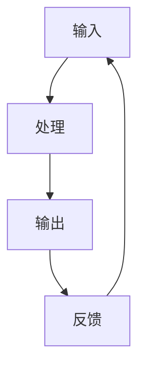

                 

### 文章标题：建立反馈循环：促进持续改进的机制

**关键词：** 反馈循环、持续改进、机制、应用场景、优化策略

**摘要：** 本文深入探讨了反馈循环的概念、基本原理和应用场景，详细阐述了如何建立有效的反馈循环机制以促进持续改进。通过案例分析，展示了反馈循环在不同领域中的实际应用，并提出了优化反馈循环的具体策略和方法。

---

### 引言

在现代社会，持续改进已成为企业和组织实现卓越表现的关键。反馈循环作为一种重要的机制，被广泛应用于各个领域，以推动持续改进。本文旨在系统地探讨反馈循环的概念、原理和应用场景，并提供建立和优化反馈循环的具体策略和方法。

#### 反馈循环的概念

反馈循环（Feedback Loop）是指系统内部或系统与外部环境之间信息传递和反馈的过程。通过这种循环，系统能够接收外部环境的信息，对其自身进行调节和优化，从而实现持续改进。

#### 反馈循环的重要性

1. **提高决策质量：** 反馈循环能够提供及时和准确的信息，帮助决策者做出更加科学的决策。
2. **提升执行力：** 反馈循环能够及时纠正执行过程中的偏差，确保计划的顺利实施。
3. **促进创新：** 反馈循环鼓励持续学习和改进，为创新提供了动力。

#### 反馈循环的基本构成

反馈循环通常包括以下几个基本组成部分：

1. **输入：** 系统从外部环境中获取的信息。
2. **处理：** 系统对输入信息进行处理和加工。
3. **输出：** 系统对外部环境的响应。
4. **反馈：** 外部环境对系统输出的评价和反馈。

#### 反馈循环的分类

根据反馈的方向和目的，反馈循环可以分为以下几种类型：

1. **正反馈：** 输出增强输入，导致系统状态进一步变化。
2. **负反馈：** 输出抑制输入，导致系统状态趋于稳定。
3. **自我调节反馈：** 系统通过自身的调节机制来维持稳定状态。

### 核心概念原理之间的关系架构 Mermaid 流程图

### 文章关键词

- 反馈循环
- 持续改进
- 机制
- 应用场景
- 优化策略

### 文章摘要

本文深入探讨了反馈循环的概念、原理和应用场景，详细阐述了如何建立有效的反馈循环机制以促进持续改进。通过案例分析，展示了反馈循环在不同领域中的实际应用，并提出了优化反馈循环的具体策略和方法。

---

在接下来的章节中，我们将分别探讨反馈循环的基本原理、应用场景、建立策略和优化方法，并结合实际案例进行详细分析。让我们一步一步地深入这个主题，共同探索反馈循环的魅力和潜力。

