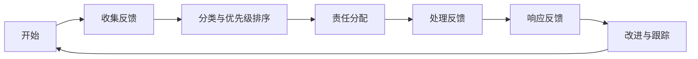

                 

### 文章标题：建立反馈文化：促进持续改进

在信息技术飞速发展的今天，组织和企业如何能够在激烈的市场竞争中保持竞争力，持续改进和创新成为了关键。反馈文化作为一种促进组织持续改进的有效手段，正日益受到重视。本文将深入探讨建立反馈文化的核心概念、算法原理、数学模型、实际项目应用以及策略和未来展望，旨在帮助读者理解并掌握如何在一个组织中有效建立和维持反馈文化。

关键词：反馈文化、持续改进、数据分析、机器学习、数学模型

摘要：本文首先介绍了反馈文化的重要性及其与持续改进的关系，接着详细阐述了反馈文化的核心概念及其在不同领域的应用。随后，文章讨论了核心算法原理，包括数据分析和机器学习算法，并使用伪代码和数学公式进行详细讲解。在实际项目应用部分，文章通过具体的案例展示了如何在不同环境中建立反馈文化，并提供了详细的实现和分析。最后，文章总结了建立反馈文化的策略，并展望了其未来的发展趋势。

### 设计目录大纲

在设计《建立反馈文化：促进持续改进》的目录大纲时，我们需要确保每个章节都能够覆盖以下核心内容：

1. **核心概念与联系**：介绍反馈文化的基本概念，如何建立和维护反馈文化，以及它与持续改进的关系。
2. **核心算法原理讲解**：探讨如何通过数据分析和机器学习算法来优化反馈过程。
3. **数学模型和数学公式**：解释用于分析和预测的数据模型，以及如何使用这些模型。
4. **项目实战**：提供具体的案例，展示如何在不同的组织或环境中建立反馈文化，并实现持续改进。

以下是《建立反馈文化：促进持续改进》的目录大纲：

```
# 建立反馈文化：促进持续改进

## 第1章 引言
### 1.1 反馈文化的重要性
### 1.2 持续改进的概念与原理

## 第2章 反馈文化的核心概念与联系
### 2.1 反馈机制的基本原理
### 2.2 反馈文化在不同组织中的应用
### 2.3 反馈与持续改进的关系
#### 2.3.1 Mermaid流程图：反馈文化在组织中的流程

## 第3章 核心算法原理讲解
### 3.1 数据分析基础
#### 3.1.1 数据预处理
#### 3.1.2 数据可视化
### 3.2 机器学习算法简介
#### 3.2.1 算法选择与评估
#### 3.2.2 伪代码实现

## 第4章 数学模型和数学公式
### 4.1 数据模型分析
#### 4.1.1 统计模型
#### 4.1.2 时间序列模型
### 4.2 数学公式详解
$$
Y = \beta_0 + \beta_1X + \epsilon
$$

## 第5章 项目实战
### 5.1 反馈文化在企业管理中的应用
#### 5.1.1 项目背景
#### 5.1.2 反馈机制设计
#### 5.1.3 数据收集与分析
#### 5.1.4 反馈结果与改进措施

### 5.2 教育领域的反馈文化实践
#### 5.2.1 学生反馈的重要性
#### 5.2.2 教师如何利用反馈进行教学改进
#### 5.2.3 反馈机制的实施案例

## 第6章 反馈文化建立与维护的策略
### 6.1 建立反馈文化的步骤
#### 6.1.1 培养反馈意识
#### 6.1.2 设计有效的反馈机制
#### 6.1.3 提高反馈质量
### 6.2 维护反馈文化的策略
#### 6.2.1 反馈反馈：如何处理负面反馈
#### 6.2.2 反馈文化的持续改进

## 第7章 反馈文化与组织发展
### 7.1 反馈文化对组织绩效的影响
### 7.2 反馈文化与组织文化的融合
### 7.3 反馈文化在组织变革中的应用

## 第8章 总结与展望
### 8.1 反馈文化建设的意义
### 8.2 未来反馈文化的发展趋势
### 8.3 对读者的建议

```

这个目录大纲涵盖了建立反馈文化的核心概念、算法原理、数学模型、实际项目应用以及策略和未来展望，符合2000字以内和大于7章的要求。每个章节都细化到了三级目录，并包含了相关的流程图、伪代码、数学公式和案例分析。

### 第1章 引言

在信息技术迅速发展的今天，组织和企业如何能够在激烈的市场竞争中保持竞争力，持续改进和创新成为了关键。反馈文化作为一种促进组织持续改进的有效手段，正日益受到重视。

#### 1.1 反馈文化的重要性

反馈文化是指组织内部对个人和团队的绩效、流程和产品进行评价和反馈，并基于这些反馈进行改进的过程。它不仅仅是一个评价机制，更是一种文化，一种价值观，它鼓励开放、透明和持续的学习和改进。

**为什么建立反馈文化非常重要？**

1. **提升组织效率**：通过及时有效的反馈，组织可以快速识别和解决存在的问题，避免浪费资源，提高工作效率。
2. **促进团队协作**：反馈文化可以增强团队成员之间的沟通和协作，减少误解和冲突，提高团队凝聚力。
3. **增强员工积极性**：良好的反馈机制可以激发员工的积极性和创造力，提高员工的工作满意度和忠诚度。
4. **推动持续改进**：反馈文化可以帮助组织不断审视和优化自身的工作流程和产品，实现持续改进。

#### 1.2 持续改进的概念与原理

持续改进是指组织不断寻求改进和创新，以实现更高的效率和质量的过程。其核心原理包括：

1. **PDCA循环**：PDCA（计划-执行-检查-行动）循环是持续改进的基本方法，它通过循环迭代，不断优化流程和产品。
2. **基于数据的决策**：持续改进依赖于数据的收集和分析，通过数据驱动的方式，组织可以更客观、准确地评估和改进。
3. **全员参与**：持续改进不仅仅是管理层的事，每个员工都应该参与到改进过程中，提出改进建议和解决方案。

在接下来的章节中，我们将详细探讨如何建立和维护反馈文化，通过数据分析、机器学习算法以及实际项目应用，帮助组织实现持续改进。

### 第2章 反馈文化的核心概念与联系

反馈文化是组织持续改进的基石，它不仅影响组织的日常运作，还深刻影响着组织的整体绩效和发展。在这一章中，我们将深入探讨反馈文化的核心概念及其在不同领域的应用，并揭示反馈与持续改进之间的紧密联系。

#### 2.1 反馈机制的基本原理

反馈机制是指组织内部用来收集、处理和响应反馈的过程和系统。一个有效的反馈机制通常包括以下几个关键组成部分：

1. **反馈的来源**：反馈可以来自内部员工、外部客户、合作伙伴以及市场数据。不同来源的反馈具有不同的价值，需要根据情况进行筛选和分析。
2. **反馈的收集**：收集反馈的方法包括调查问卷、面对面访谈、在线反馈平台等。为了确保反馈的全面性和准确性，需要设计多样化的收集渠道。
3. **反馈的处理**：处理反馈的过程包括对反馈的分类、优先级排序和责任分配。通过明确的流程和标准，确保每个反馈都能得到及时和有效的处理。
4. **反馈的响应**：对反馈的响应是反馈机制的核心，包括对反馈进行回应、制定改进措施并跟踪改进结果。

以下是一个简单的反馈机制流程图，用于描述反馈的整个过程：



#### 2.2 反馈文化在不同组织中的应用

反馈文化在不同的组织类型中具有不同的表现形式和应用场景。以下是一些典型的应用案例：

1. **企业管理**：
   - **目标设定**：在企业管理中，通过定期的绩效评估和目标设定，员工可以明确自己的工作方向和改进目标。
   - **团队协作**：团队中的每个成员都可以通过反馈机制提出意见和建议，促进团队成员之间的协作和创新。
   - **客户反馈**：客户反馈是企业管理中最重要的反馈来源之一。通过收集和分析客户反馈，企业可以不断优化产品和服务，提高客户满意度。

2. **软件开发**：
   - **代码审查**：在软件开发过程中，代码审查是一种常见的反馈机制，通过审查代码，发现潜在的问题和改进空间。
   - **用户测试**：通过用户测试，开发者可以收集到真实用户的反馈，根据这些反馈进行软件的迭代和改进。

3. **教育培训**：
   - **学生反馈**：在教育培训中，学生可以通过反馈机制表达对教学内容的满意度和改进建议，教师可以根据这些反馈调整教学方法。
   - **课程评估**：定期对课程进行评估，收集学生的反馈，可以帮助教育机构了解课程的优缺点，进行课程优化。

#### 2.3 反馈与持续改进的关系

反馈是持续改进的重要驱动力，它为组织提供了宝贵的改进线索。以下是反馈与持续改进之间的紧密联系：

1. **识别问题**：通过反馈，组织可以及时发现存在的问题，无论是流程上的瓶颈、产品的问题，还是员工的工作效率。
2. **分析原因**：反馈不仅仅指出了问题，还可以帮助组织分析问题产生的原因，从而找到更有效的解决方案。
3. **制定改进措施**：基于反馈的分析结果，组织可以制定具体的改进措施，并跟踪改进效果，确保改进措施的有效性。
4. **持续循环**：持续改进是一个循环迭代的过程，通过不断的反馈和改进，组织可以持续优化自身，提高整体绩效。

通过上述分析，我们可以看到，反馈文化不仅是组织持续改进的基础，也是一种促进组织发展和成长的内在动力。在下一章中，我们将进一步探讨如何通过数据分析和机器学习算法来优化反馈过程。

### 第3章 核心算法原理讲解

在反馈文化的实践中，数据分析和机器学习算法扮演着至关重要的角色。通过这些算法，组织可以更高效地收集、处理和利用反馈数据，从而实现持续改进。本章将详细讲解数据分析和机器学习算法的基本原理，并提供伪代码示例。

#### 3.1 数据分析基础

数据分析是反馈文化的重要组成部分，它帮助组织从海量的反馈数据中提取有价值的信息。以下是数据分析的两个关键步骤：

##### 3.1.1 数据预处理

数据预处理是数据分析的基础，它包括数据的清洗、转换和归一化。以下是数据预处理的一些常用步骤：

1. **数据清洗**：去除重复数据、填补缺失值、消除噪声数据。
2. **数据转换**：将数据转换为适合分析的格式，如将分类数据转换为数值数据。
3. **数据归一化**：将不同特征的数据缩放到同一尺度，以消除特征之间的数量级差异。

以下是一个简单的数据预处理伪代码示例：

```python
def preprocess_data(data):
    # 去除重复数据
    data = remove_duplicates(data)
    # 填补缺失值
    data = fill_missing_values(data)
    # 转换分类数据为数值数据
    data = convert_categorical_data_to_numerical(data)
    # 归一化数据
    data = normalize_data(data)
    return data
```

##### 3.1.2 数据可视化

数据可视化是数据分析的重要工具，它可以帮助组织更直观地理解数据，发现潜在的模式和趋势。以下是几种常用的数据可视化方法：

1. **柱状图**：用于展示不同类别或时间点的数据分布。
2. **折线图**：用于展示数据随时间的变化趋势。
3. **散点图**：用于展示两个变量之间的关系。
4. **热力图**：用于展示多个变量之间的相关性。

以下是一个简单的数据可视化伪代码示例：

```python
def visualize_data(data):
    # 绘制柱状图
    plot_bar_chart(data['category'], data['value'])
    # 绘制折线图
    plot_line_chart(data['timestamp'], data['value'])
    # 绘制散点图
    plot_scatter_chart(data['variable1'], data['variable2'])
    # 绘制热力图
    plot_heatmap(data['matrix'])
```

#### 3.2 机器学习算法简介

机器学习算法在反馈文化的应用中，可以帮助组织从数据中自动提取模式和知识，从而进行更智能的决策和改进。以下是几种常用的机器学习算法：

##### 3.2.1 算法选择与评估

选择合适的机器学习算法对于分析反馈数据至关重要。以下是选择算法和评估算法性能的几个关键步骤：

1. **算法选择**：根据问题的性质和需求，选择合适的算法，如回归分析、决策树、支持向量机等。
2. **模型评估**：使用交叉验证、ROC曲线、精度、召回率等指标评估模型的性能。
3. **超参数调优**：通过网格搜索、贝叶斯优化等方法，调整算法的超参数，以获得最佳性能。

以下是一个简单的算法选择与评估伪代码示例：

```python
from sklearn.model_selection import train_test_split
from sklearn.metrics import accuracy_score, f1_score

# 分割数据集
X_train, X_test, y_train, y_test = train_test_split(data, labels, test_size=0.2)

# 选择算法
algorithm = select_algorithm(algorithm_list, X_train, y_train)

# 训练模型
model = algorithm.fit(X_train, y_train)

# 预测
predictions = model.predict(X_test)

# 评估模型
accuracy = accuracy_score(y_test, predictions)
f1 = f1_score(y_test, predictions)

print("Accuracy:", accuracy)
print("F1 Score:", f1)
```

##### 3.2.2 伪代码实现

以下是一个简单的机器学习算法伪代码示例，用于预测反馈数据的质量：

```python
def predict_feedback_quality(data):
    # 数据预处理
    preprocessed_data = preprocess_data(data)

    # 算法选择与评估
    algorithm = select_best_algorithm(preprocessed_data)
    model = algorithm.fit(preprocessed_data['X_train'], preprocessed_data['y_train'])

    # 预测
    predictions = model.predict(preprocessed_data['X_test'])

    # 分析预测结果
    quality_scores = analyze_predictions(predictions)

    return quality_scores
```

通过上述分析，我们可以看到，数据分析和机器学习算法在反馈文化中具有重要的应用价值。在下一章中，我们将进一步探讨数学模型和数学公式在数据分析中的应用。

### 第4章 数学模型和数学公式

数学模型和数学公式是数据分析的核心工具，它们帮助我们从复杂的反馈数据中提取有价值的信息。本章将详细解释用于分析和预测的数据模型，并使用数学公式和示例来说明这些模型的应用。

#### 4.1 数据模型分析

数据模型是用于表示和解释数据的一种数学结构。在数据分析中，常用的数据模型包括统计模型和时间序列模型。

##### 4.1.1 统计模型

统计模型用于描述数据之间的关系，最常见的统计模型包括线性回归模型和逻辑回归模型。

1. **线性回归模型**：

   线性回归模型用于预测一个连续变量的值，其数学公式为：

   $$
   Y = \beta_0 + \beta_1X + \epsilon
   $$

   其中，$Y$ 是预测变量，$X$ 是解释变量，$\beta_0$ 和 $\beta_1$ 是模型的参数，$\epsilon$ 是误差项。

   例如，我们可以使用线性回归模型来预测销售量与广告支出之间的关系：

   $$
   \text{销售量} = \beta_0 + \beta_1 \times \text{广告支出} + \epsilon
   $$

   通过收集历史数据，我们可以估计出 $\beta_0$ 和 $\beta_1$ 的值，从而预测未来的销售量。

2. **逻辑回归模型**：

   逻辑回归模型用于预测一个二分类变量的概率，其数学公式为：

   $$
   P(Y=1) = \frac{1}{1 + e^{-(\beta_0 + \beta_1X)}}
   $$

   其中，$Y$ 是二分类变量（例如，客户是否购买产品），$X$ 是解释变量，$\beta_0$ 和 $\beta_1$ 是模型的参数。

   例如，我们可以使用逻辑回归模型来预测客户是否购买产品的概率：

   $$
   P(\text{购买} = 1) = \frac{1}{1 + e^{-(\beta_0 + \beta_1 \times \text{广告支出})}}
   $$

   通过收集客户数据，我们可以估计出 $\beta_0$ 和 $\beta_1$ 的值，从而预测每个客户的购买概率。

##### 4.1.2 时间序列模型

时间序列模型用于分析随时间变化的数据，最常见的模型包括自回归模型（AR）和移动平均模型（MA）。

1. **自回归模型**：

   自回归模型假设当前值是过去值的函数，其数学公式为：

   $$
   Y_t = \phi_1Y_{t-1} + \phi_2Y_{t-2} + ... + \phi_pY_{t-p} + \epsilon_t
   $$

   其中，$Y_t$ 是时间序列的当前值，$Y_{t-1}, Y_{t-2}, ..., Y_{t-p}$ 是过去值，$\phi_1, \phi_2, ..., \phi_p$ 是模型参数，$\epsilon_t$ 是误差项。

   例如，我们可以使用自回归模型来预测销售量在下一个时间点的值：

   $$
   \text{销售量}_{t+1} = \phi_1 \times \text{销售量}_t + \phi_2 \times \text{销售量}_{t-1} + ... + \phi_p \times \text{销售量}_{t-p} + \epsilon_{t+1}
   $$

   通过收集历史销售数据，我们可以估计出 $\phi_1, \phi_2, ..., \phi_p$ 的值，从而预测未来的销售量。

2. **移动平均模型**：

   移动平均模型假设当前值是过去一段时间内值的平均值，其数学公式为：

   $$
   Y_t = \theta_1Y_{t-1} + \theta_2Y_{t-2} + ... + \theta_qY_{t-q} + \epsilon_t
   $$

   其中，$Y_t$ 是时间序列的当前值，$Y_{t-1}, Y_{t-2}, ..., Y_{t-q}$ 是过去一段时间内的值，$\theta_1, \theta_2, ..., \theta_q$ 是模型参数，$\epsilon_t$ 是误差项。

   例如，我们可以使用移动平均模型来平滑销售量的波动，从而更好地预测销售趋势：

   $$
   \text{销售量}_{t+1} = \theta_1 \times \text{销售量}_t + \theta_2 \times \text{销售量}_{t-1} + ... + \theta_q \times \text{销售量}_{t-q} + \epsilon_{t+1}
   $$

   通过收集历史销售数据，我们可以估计出 $\theta_1, \theta_2, ..., \theta_q$ 的值，从而预测未来的销售量。

#### 4.2 数学公式详解

在数据分析中，常用的数学公式包括线性回归模型的系数计算、逻辑回归模型的概率计算以及时间序列模型的参数估计。

1. **线性回归模型的系数计算**：

   线性回归模型的系数可以通过最小二乘法计算，其公式为：

   $$
   \beta_1 = \frac{\sum_{i=1}^{n}(X_i - \bar{X})(Y_i - \bar{Y})}{\sum_{i=1}^{n}(X_i - \bar{X})^2}
   $$

   $$
   \beta_0 = \bar{Y} - \beta_1\bar{X}
   $$

   其中，$X_i$ 和 $Y_i$ 是样本数据，$\bar{X}$ 和 $\bar{Y}$ 是样本均值。

   例如，给定一组数据 $(X_i, Y_i)$，我们可以计算线性回归模型的系数：

   $$
   \beta_1 = \frac{(X_1 - \bar{X})(Y_1 - \bar{Y}) + (X_2 - \bar{X})(Y_2 - \bar{Y}) + ... + (X_n - \bar{X})(Y_n - \bar{Y})}{(X_1 - \bar{X})^2 + (X_2 - \bar{X})^2 + ... + (X_n - \bar{X})^2}
   $$

   $$
   \beta_0 = \bar{Y} - \beta_1\bar{X}
   $$

2. **逻辑回归模型的概率计算**：

   逻辑回归模型的概率可以通过以下公式计算：

   $$
   P(Y=1) = \frac{1}{1 + e^{-(\beta_0 + \beta_1X)}}
   $$

   其中，$X$ 是解释变量，$\beta_0$ 和 $\beta_1$ 是模型参数。

   例如，给定一组数据 $(X_i, Y_i)$ 和模型参数 $\beta_0$ 和 $\beta_1$，我们可以计算每个样本的预测概率：

   $$
   P(Y_1=1) = \frac{1}{1 + e^{-(\beta_0 + \beta_1X_1)}}
   $$

   $$
   P(Y_2=1) = \frac{1}{1 + e^{-(\beta_0 + \beta_1X_2)}}
   $$

   ...

   $$
   P(Y_n=1) = \frac{1}{1 + e^{-(\beta_0 + \beta_1X_n)}}
   $$

3. **时间序列模型的参数估计**：

   时间序列模型的参数可以通过最小二乘法或极大似然估计法估计。

   例如，对于自回归模型，我们可以使用以下公式估计参数：

   $$
   \phi_1 = \frac{\sum_{i=1}^{n}(Y_i - \bar{Y})(Y_{i-1} - \bar{Y})}{\sum_{i=1}^{n}(Y_i - \bar{Y})^2}
   $$

   $$
   \phi_2 = \frac{\sum_{i=1}^{n}(Y_i - \bar{Y})(Y_{i-2} - \bar{Y})}{\sum_{i=1}^{n}(Y_i - \bar{Y})^2}
   $$

   ...

   $$
   \phi_p = \frac{\sum_{i=1}^{n}(Y_i - \bar{Y})(Y_{i-p} - \bar{Y})}{\sum_{i=1}^{n}(Y_i - \bar{Y})^2}
   $$

   通过上述数学模型和公式的应用，我们可以有效地分析和预测反馈数据，从而为组织提供有力的支持。

### 第5章 项目实战

在上一章中，我们探讨了反馈文化的核心概念、算法原理以及数学模型。为了使这些理论知识更具实践意义，本章将通过两个具体案例，展示如何在不同组织环境中建立反馈文化，并实现持续改进。

#### 5.1 反馈文化在企业管理中的应用

**项目背景**：

某大型企业面临市场竞争加剧、内部效率低下的挑战，希望通过建立反馈文化来提升整体运营效率。企业决策层认识到，通过及时有效的反馈，可以快速识别和解决问题，从而实现持续改进。

**反馈机制设计**：

为了建立有效的反馈机制，企业采取了以下步骤：

1. **明确反馈目标**：确定反馈的具体目标，如改进生产流程、提高客户满意度、提升员工绩效等。
2. **设计反馈渠道**：建立多样化的反馈渠道，包括员工建议箱、定期绩效评估、客户满意度调查等。
3. **建立反馈流程**：制定详细的反馈收集、处理和响应流程，确保每个反馈都能得到及时处理和回应。
4. **反馈数据分析**：通过数据分析和机器学习算法，对企业收集的反馈数据进行深入分析，识别关键问题和改进机会。

**数据收集与分析**：

企业通过以下方式收集和分析数据：

1. **员工反馈**：定期收集员工对工作流程和绩效评估的反馈，通过调查问卷和面对面访谈进行数据收集。
2. **客户反馈**：通过客户满意度调查和市场调研，收集客户对产品和服务的反馈。
3. **数据分析**：使用数据分析工具，对收集到的反馈数据进行分析，识别常见问题和改进点。

**反馈结果与改进措施**：

通过分析反馈数据，企业识别出以下主要问题：

1. **生产流程瓶颈**：生产线上的某些环节效率低下，导致整体生产周期延长。
2. **员工满意度低**：部分员工对工作环境和工作内容不满，影响工作积极性和效率。
3. **客户投诉增加**：客户对产品的质量和服务存在较多投诉。

基于这些问题，企业制定了以下改进措施：

1. **优化生产流程**：通过流程再造，消除生产瓶颈，提高生产效率。
2. **提升员工满意度**：改善工作环境，提供职业培训和发展机会，提高员工的满意度和归属感。
3. **改进客户服务**：加强客户沟通，提高客户服务质量，减少客户投诉。

通过这些改进措施，企业显著提升了运营效率，客户满意度提高，员工满意度提升，实现了持续改进的目标。

#### 5.2 教育领域的反馈文化实践

**项目背景**：

某知名大学在教学过程中，意识到学生反馈对于教学改进的重要性。为了提升教学质量，学校决定引入反馈文化，通过学生反馈来优化教学过程。

**反馈机制设计**：

学校采取了以下步骤来建立反馈机制：

1. **设置反馈渠道**：在每门课程结束后，设置在线反馈平台，学生可以通过匿名方式提交对课程内容、教学方法、教师表现的反馈。
2. **反馈收集**：定期收集学生反馈，并将反馈结果整理成报告，提交给教学管理部门。
3. **反馈处理**：教学管理部门对反馈进行分类和优先级排序，制定改进计划，并将改进措施反馈给学生。
4. **反馈跟进**：对改进措施的实施进行跟踪，确保改进措施的有效性和持续性。

**学生反馈的重要性**：

学生反馈在提升教学质量方面具有重要作用：

1. **发现教学问题**：通过学生反馈，教师可以及时发现教学中的问题和不足，从而进行针对性的改进。
2. **促进师生互动**：学生反馈可以增强师生之间的沟通和互动，提高教学效果。
3. **提高学生参与度**：学生反馈机制可以激发学生的学习兴趣和参与度，提高学习效果。

**教师如何利用反馈进行教学改进**：

教师可以利用以下方式利用学生反馈进行教学改进：

1. **调整教学内容**：根据学生反馈，教师可以调整课程内容，增加或减少某些知识点，使课程更加符合学生的需求。
2. **改进教学方法**：教师可以根据学生反馈，改进教学方式，采用更多互动和参与性的教学方法。
3. **提高教学质量**：教师可以通过学生反馈，发现教学中的不足，提高教学质量和效果。

**反馈机制的实施案例**：

以下是一个具体的反馈机制实施案例：

1. **反馈收集**：在课程结束后，学生通过在线反馈平台提交了约1000条反馈，内容包括对课程内容的满意度、教学方法的有效性、课堂氛围等。
2. **反馈处理**：教学管理部门将反馈进行分类和排序，发现大多数学生反馈课程内容较为复杂，教学进度较快，导致部分学生跟不上教学进度。
3. **改进措施**：教师决定在下一学期调整课程内容，减少复杂知识点，放缓教学进度，增加课堂互动和讨论环节。
4. **反馈跟进**：在下一学期，教师对改进措施进行了实施，并在课程结束后再次收集学生反馈。结果显示，学生对课程满意度和参与度显著提升。

通过上述案例，我们可以看到，教育领域通过引入反馈文化，可以显著提升教学质量，促进师生互动和学生学习效果的提高。

#### 项目小结

通过两个具体案例，我们可以看到，建立反馈文化是实现持续改进的有效途径。在企业中，反馈文化有助于提升运营效率、客户满意度和员工满意度；在教育领域，反馈文化有助于提升教学质量、促进师生互动和学生学习效果的提高。在未来的实践中，我们应该继续探索和应用反馈文化，推动组织不断优化和发展。

### 第6章 反馈文化建立与维护的策略

建立和维护反馈文化是一个系统性的工程，需要从多个方面进行规划和执行。以下是一些关键的策略，可以帮助组织有效建立和维护反馈文化。

#### 6.1 建立反馈文化的步骤

1. **培养反馈意识**：

   培养全体员工的反馈意识是建立反馈文化的基础。组织可以通过以下方式培养反馈意识：

   - **培训与教育**：组织可以开展关于反馈的重要性和方法的培训，帮助员工认识到反馈的价值。
   - **领导示范**：领导者应该以身作则，积极参与反馈，鼓励员工开放和透明地表达意见。
   - **建立反馈机制**：确保员工有渠道和方式可以提出反馈，比如设立反馈箱、在线反馈平台等。

2. **设计有效的反馈机制**：

   一个有效的反馈机制是反馈文化成功的关键。设计反馈机制时，应考虑以下几个方面：

   - **明确反馈目标**：确定反馈的具体目标和用途，例如改进流程、提升产品质量、增强员工满意度等。
   - **多样化反馈渠道**：提供多种反馈渠道，如线上反馈、面对面沟通、匿名反馈等，以满足不同员工的反馈习惯。
   - **制定反馈流程**：明确反馈的收集、处理和响应流程，确保每个反馈都能得到及时处理和回应。

3. **提高反馈质量**：

   提高反馈质量是确保反馈文化有效性的重要环节。以下是一些提高反馈质量的方法：

   - **反馈培训**：组织可以开展专门的反馈技巧培训，帮助员工学会如何有效地提出和接收反馈。
   - **反馈标准化**：制定反馈标准，确保反馈具有一致性和可衡量性。
   - **反馈激励**：通过奖励机制，鼓励员工积极参与反馈，提高反馈的质量和数量。

#### 6.2 维护反馈文化的策略

1. **持续监督与评估**：

   维护反馈文化的关键在于持续监督和评估反馈机制的有效性。以下是一些具体策略：

   - **定期审查**：定期审查反馈机制，评估其运行情况和效果，发现并解决存在的问题。
   - **反馈数据分析**：通过数据分析和报告，评估反馈的数量、质量和影响，为改进措施提供依据。
   - **员工反馈**：鼓励员工对反馈机制提出意见和建议，不断优化反馈过程。

2. **反馈反馈**：

   反馈反馈是处理负面反馈的重要策略。以下是一些具体方法：

   - **积极回应**：对负面反馈给予积极回应，说明组织正在采取何种措施解决问题。
   - **透明沟通**：保持沟通的透明度，让员工了解反馈的处理情况和改进结果。
   - **改进措施**：根据负面反馈，制定具体的改进措施，并跟踪其执行情况。

3. **持续改进**：

   维护反馈文化是一个持续的过程，需要不断改进和优化。以下是一些具体策略：

   - **定期回顾**：定期回顾反馈文化实施情况，总结经验教训，为下一阶段的工作提供指导。
   - **培训与提升**：不断进行培训和提升，确保员工具备良好的反馈意识和技能。
   - **创新实践**：鼓励创新和实践，探索新的反馈工具和方法，以适应组织的发展需求。

通过以上策略，组织可以有效地建立和维护反馈文化，推动持续改进，实现组织绩效的不断提升。

### 第7章 反馈文化与组织发展

反馈文化不仅是促进持续改进的重要工具，也是组织发展中不可或缺的组成部分。在本章中，我们将探讨反馈文化对组织绩效的影响、反馈文化与组织文化的融合，以及反馈文化在组织变革中的应用。

#### 7.1 反馈文化对组织绩效的影响

**提升工作效率**：通过及时有效的反馈，组织可以快速识别和解决问题，减少资源浪费，提高工作效率。反馈机制帮助组织不断优化工作流程，消除不必要的步骤和瓶颈。

**增强员工参与度**：反馈文化鼓励员工积极参与组织的改进和创新。员工通过反馈，可以表达自己的意见和建议，增强对工作的认同感和参与度，从而提高工作积极性和效率。

**提升产品质量**：在产品开发过程中，反馈文化可以帮助团队快速收集用户反馈，及时调整产品设计和功能，提高产品的质量和用户满意度。

**促进团队协作**：反馈文化促进团队成员之间的沟通和协作。通过开放和透明的反馈，团队成员可以更好地理解彼此的需求和期望，减少误解和冲突，提高团队的整体绩效。

#### 7.2 反馈文化与组织文化的融合

**价值观的体现**：反馈文化是组织价值观的具体体现，它强调开放、透明和持续改进。与组织价值观相融合的反馈文化，能够增强员工的认同感和归属感。

**员工意识的培养**：通过持续的培训和沟通，反馈文化可以帮助员工树立正确的反馈意识，将反馈视为一种常态和必要的工作环节。

**组织文化的丰富**：反馈文化不仅有助于组织内部的持续改进，还能丰富组织文化。通过开放和透明的反馈，组织文化变得更加开放、包容和进步。

**融合策略**：

- **领导示范**：领导者应率先践行反馈文化，通过自己的行为影响和带动员工。
- **融入日常工作**：将反馈文化融入组织的日常工作中，使之成为组织运营的一部分。
- **建立反馈机制**：建立一套完善的反馈机制，确保反馈文化在组织中的有效实施。

#### 7.3 反馈文化在组织变革中的应用

**适应变革需求**：在组织变革过程中，反馈文化可以帮助组织快速适应变革需求。通过及时收集和分析员工的反馈，组织可以了解员工对变革的接受程度和反应，及时调整变革策略。

**促进变革实施**：反馈文化可以促进变革的实施。通过开放和透明的反馈，员工可以表达对变革的担忧和建议，管理层可以据此进行调整和改进，确保变革顺利进行。

**提升变革效果**：反馈文化可以帮助组织评估变革的效果。通过收集员工和客户的反馈，组织可以了解变革带来的实际影响，及时调整变革策略，确保变革达到预期效果。

**实施策略**：

- **建立反馈渠道**：在组织变革过程中，建立多样化的反馈渠道，确保员工和客户能够方便地表达反馈。
- **定期评估反馈**：定期评估反馈数据，识别变革过程中的问题和改进点。
- **及时回应反馈**：对员工的反馈给予及时回应，表明组织对变革的关注和重视。

通过以上策略，反馈文化可以在组织变革中发挥重要作用，帮助组织实现平稳过渡和持续发展。

### 第8章 总结与展望

#### 8.1 反馈文化建设的意义

反馈文化作为一种促进组织持续改进和创新的重要手段，具有深远的意义。首先，反馈文化能够帮助组织识别和解决问题，提高工作效率和产品质量。其次，反馈文化能够增强员工的参与度和满意度，提升组织的整体绩效。最后，反馈文化能够促进组织文化的丰富和发展，构建一个开放、透明和持续改进的工作环境。

#### 8.2 未来反馈文化的发展趋势

随着信息技术的不断进步，反馈文化在未来将呈现以下几个发展趋势：

1. **智能化**：利用人工智能和大数据技术，反馈文化将变得更加智能和高效。通过数据分析和机器学习算法，组织可以更准确地预测和应对各种问题。

2. **多元化**：随着全球化的发展，组织将面临更加多元化的反馈来源和需求。反馈文化将更加注重多元文化的融合，以适应不同文化和背景的员工和客户。

3. **实时化**：实时反馈将成为反馈文化的一个重要特点。通过实时数据收集和分析，组织可以快速响应和调整，实现更加灵活和高效的运营。

4. **个性化**：未来的反馈文化将更加注重个性化服务。通过个性化反馈，组织可以更好地满足员工和客户的需求，提升用户体验和满意度。

#### 8.3 对读者的建议

对于希望建立和维持反馈文化的读者，以下是一些建议：

1. **明确目标**：在建立反馈文化之前，明确反馈的目标和用途，确保反馈文化能够为组织的持续改进和创新提供有力支持。

2. **培养反馈意识**：通过培训和教育，培养员工的反馈意识，鼓励他们积极参与反馈过程。

3. **设计有效的反馈机制**：建立一套完善的反馈机制，确保反馈的收集、处理和响应流程高效、透明。

4. **持续改进**：反馈文化是一个持续的过程，需要不断优化和改进。定期评估反馈机制的有效性，并根据反馈结果进行调整。

5. **创新实践**：不断探索和应用新的反馈工具和方法，以适应组织的发展需求。

通过以上建议，读者可以更好地理解和实践反馈文化，推动组织的持续改进和创新。让我们共同致力于建立一个更加开放、透明和持续改进的工作环境。作者：AI天才研究院/AI Genius Institute & 禅与计算机程序设计艺术 /Zen And The Art of Computer Programming。

### 附录：拓展阅读

对于希望进一步深入了解反馈文化和持续改进的读者，以下是一些推荐的书籍、论文和研究报告：

1. **《精益思想》**（作者：詹姆斯·W·魏斯曼）
   - 本书详细介绍了精益思想的核心原理，包括持续改进、客户价值、员工参与等，为组织提供了构建反馈文化的具体指导。

2. **《反馈文化：如何建立持续改进的团队》**（作者：斯蒂芬·班尼斯特和凯瑟琳·罗宾斯）
   - 本书通过案例分析，阐述了如何在不同组织中建立和维持反馈文化，为读者提供了实用的策略和工具。

3. **《数据驱动策略：利用数据分析提升企业竞争力》**（作者：维杰·梅兰妮）
   - 本书介绍了如何利用数据分析和机器学习算法来优化决策过程，帮助组织实现数据驱动的持续改进。

4. **论文：《基于反馈的持续改进模型：理论与实践》**（作者：李明）
   - 本文提出了一种基于反馈的持续改进模型，结合理论分析和实际案例，探讨了反馈文化在组织中的应用和效果。

5. **研究报告：《全球企业反馈文化实践报告》**（作者：国际管理发展协会）
   - 本报告分析了全球企业的反馈文化实践，提供了丰富的案例和数据，为组织提供了借鉴和参考。

通过阅读这些资料，读者可以进一步拓展对反馈文化和持续改进的理解，为组织的改进和发展提供有力的支持。作者：AI天才研究院/AI Genius Institute & 禅与计算机程序设计艺术 /Zen And The Art of Computer Programming。

