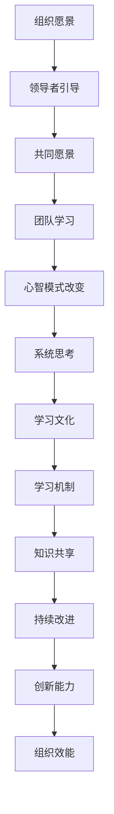

                 

### 文章标题：建立学习型组织：持续学习的团队文化

> **关键词：** 学习型组织、持续学习、团队文化、领导力、知识共享、算法原理、数学模型

> **摘要：** 本文旨在探讨如何建立一个学习型组织，强调持续学习在团队文化中的重要性。文章将从定义、核心要素、策略、算法原理、数学模型、项目实战等多个角度，系统性地阐述如何培养并维持一个学习型团队的文化，以促进组织整体效能的提升。通过理论讲解与实际案例分析，读者将获得建立学习型组织的实用指南。

---

### 引言：组织学习的概念与重要性

在当今快速变化的商业环境中，组织学习成为企业生存和发展的关键因素。组织学习（Organizational Learning）是指通过团队和个体的学习过程，使整个组织能够适应外部环境变化、提升创新能力和实现持续改进的能力。这种能力不仅关乎组织的生存，更是决定其能否在竞争激烈的市场中脱颖而出的核心竞争力。

组织学习的概念可以追溯到20世纪90年代，彼时彼得·圣吉（Peter Senge）在《第五项修炼》中首次提出了“学习型组织”的概念。学习型组织是指能够通过不断学习、知识共享和系统思考，实现自我超越、改善心智模式、建立共同愿景和团队学习的组织形式。学习型组织的核心在于其能够将学习过程融入到组织的日常运营中，从而实现持续的创新和进步。

为何组织学习如此重要？首先，外部环境的变化速度加快，技术革新和市场需求不断变化，组织必须具备快速适应和调整的能力。其次，知识经济的兴起使得知识成为组织的核心资产，通过有效的知识管理和学习，组织可以更好地利用其内部资源。最后，组织学习能够促进团队协作，提高员工的参与感和满意度，从而提升整体绩效。

### 学习型组织的定义与核心要素

#### 学习型组织的定义

学习型组织（Learning Organization）是指通过建立一套支持学习和知识共享的系统，能够不断适应变化、实现持续改进和创新的组织。学习型组织的特点包括：

1. **共同愿景**：组织中的成员拥有共同的目标和愿景，这为组织提供了前进的方向和动力。
2. **团队学习**：团队是学习型组织的核心单元，通过团队学习，成员能够共同进步，实现组织目标。
3. **心智模式的改变**：组织成员能够反思和改变其思维方式和行为模式，以适应外部环境的变化。
4. **系统思考**：组织成员能够从系统的角度看待问题，理解局部变化对整体的影响，从而做出更全面的决策。

#### 学习型组织的核心要素

1. **领导者的角色**：领导者是学习型组织的关键驱动力。他们不仅需要为组织设定学习目标，还需要通过自身的示范作用，激发团队成员的学习热情和创新能力。
2. **知识共享**：知识共享是学习型组织的核心。通过建立有效的知识管理系统，组织可以促进内部知识的流动和利用，从而提高整体的学习效率。
3. **学习文化**：学习文化是学习型组织的土壤。组织需要营造一个鼓励学习、创新和分享的氛围，使成员能够自由地表达观点和分享知识。
4. **学习机制**：学习机制是学习型组织的保障。通过制定学习计划和提供学习资源，组织可以确保学习活动的有效实施。

### 学习型组织与传统组织的比较

传统组织往往以任务为导向，强调流程和效率。而学习型组织则更注重学习和创新，强调团队协作和知识共享。以下是比较表格：

| 特点 | 学习型组织 | 传统组织 |
| ---- | ---- | ---- |
| 目标 | 持续改进和创新能力 | 完成具体任务 |
| 文化 | 鼓励学习和创新 | 稳定和可控 |
| 团队 | 高度协作和互动 | 分工明确和独立 |
| 知识 | 强调知识共享和应用 | 知识存储和保密 |
| 决策 | 系统思考和全面考虑 | 流程导向和执行 |

通过比较可以看出，学习型组织在适应环境变化、促进创新和提升组织效能方面具有显著优势。

### 核心概念与联系

为了更好地理解学习型组织的运作，我们需要明确几个核心概念，并探讨它们之间的关系。

#### 学习型组织的 Mermaid 流程图



#### 学习型组织与团队文化的关系

学习型组织与团队文化密切相关。团队文化是学习型组织的土壤，它决定了组织成员是否愿意分享知识、是否能够积极参与学习活动。学习型组织强调的是一种以学习为导向的文化，这种文化鼓励创新、实验和反思，从而推动组织的持续改进。

#### 学习型组织中的知识管理

知识管理是学习型组织的核心要素之一。通过有效的知识管理，组织可以确保知识的流动和利用，从而提高整体的学习效率。知识管理包括知识收集、知识整理、知识共享和知识应用等环节。

### 持续学习的团队文化

#### 团队文化的定义与类型

团队文化是指团队成员在共同工作中形成的共同价值观和行为规范。根据团队文化的不同特点，可以分为以下几类：

1. **合作型文化**：强调团队合作和协作，成员之间相互支持，共同完成任务。
2. **竞争型文化**：强调个人竞争和绩效，成员之间相互竞争，以实现个人和组织的目标。
3. **创新型文化**：鼓励创新和实验，成员勇于尝试新方法和新技术，以推动组织的进步。
4. **学习型文化**：注重学习和成长，成员不断寻求新的知识和技能，以提高自身和组织的竞争力。

#### 持续学习的理念与实践

持续学习是学习型组织的核心。持续学习理念强调不断更新知识和技能，以适应外部环境的变化。在实践中，持续学习可以通过以下方式进行：

1. **定期培训**：组织定期举办培训课程，帮助成员更新知识和技能。
2. **内部分享**：鼓励成员分享自己的经验和知识，通过内部分享会、工作坊等形式，促进知识的流动。
3. **外部交流**：组织成员可以参加行业会议、研讨会等活动，与外部专家和同行交流，获取新的观点和思路。
4. **自我学习**：鼓励成员自我学习和自我提升，利用在线课程、专业书籍等资源，不断充实自己的知识库。

#### 如何在团队中培养持续学习的文化

1. **领导者的示范作用**：领导者应该通过自身的行动，展示对学习的重视和热爱，成为团队学习的榜样。
2. **鼓励分享和交流**：建立开放的沟通机制，鼓励成员分享自己的经验和知识，创造一个轻松、包容的学习环境。
3. **提供学习资源**：组织应该为成员提供丰富的学习资源，如在线课程、专业书籍、技术文档等，支持成员的自我学习和提升。
4. **奖励机制**：建立奖励机制，对积极参与学习和知识共享的成员给予奖励和认可，激发成员的学习热情。

### 建立学习型组织的策略

#### 领导者的角色与责任

领导者在建立学习型组织中扮演着关键角色。他们需要：

1. **设定学习目标**：明确组织的学习目标和愿景，确保团队成员了解组织的学习方向。
2. **提供支持**：为团队成员提供必要的学习资源和支持，帮助他们克服学习中的困难。
3. **激励成员**：通过奖励和认可，激励成员积极参与学习活动，并分享自己的知识和经验。
4. **反思和改进**：定期反思和评估学习活动的成效，根据实际情况调整学习策略，确保学习活动的有效性。

#### 团队成员的参与与激励

团队成员是学习型组织的主体，他们的参与和积极性直接影响到学习型组织的建立和维持。为了激励团队成员，组织可以采取以下措施：

1. **建立共同愿景**：通过明确的共同愿景，使团队成员明确自己的工作对组织目标的贡献，从而提高他们的工作动力。
2. **提供发展机会**：为团队成员提供职业发展的机会，如晋升、培训等，使他们看到自己的成长和进步。
3. **鼓励创新**：鼓励团队成员尝试新的方法和思路，对创新行为给予支持和奖励，激发团队成员的创新热情。
4. **建立反馈机制**：建立有效的反馈机制，及时收集团队成员的意见和建议，并给予积极的反馈和改进。

#### 知识共享与转移

知识共享和转移是学习型组织的核心。为了实现知识的高效共享和转移，组织可以采取以下策略：

1. **建立知识库**：建立统一的电子知识库，将组织内部的知识和经验集中存储，方便成员查找和利用。
2. **定期知识分享**：定期举办知识分享会，鼓励团队成员分享自己的经验和知识，促进知识的流动。
3. **跨部门合作**：鼓励不同部门之间的合作和交流，通过项目合作、团队互动等方式，实现知识的共享和转移。
4. **外部合作**：与外部合作伙伴建立合作关系，通过交流和合作，获取新的知识和经验，丰富组织内部的知识体系。

### 核心算法原理讲解

#### 如何评估团队学习成效

为了评估团队学习的成效，组织可以采用以下算法：

```python
def evaluate_learning_efficiency(team_activities, learning_goals):
    # 计算团队学习活动总数
    total_activities = len(team_activities)
    
    # 计算达成学习目标的数量
    achieved_goals = sum(1 for activity in team_activities if activity['status'] == 'achieved')
    
    # 计算学习效率
    learning_efficiency = achieved_goals / total_activities
    
    return learning_efficiency
```

#### 团队学习效率优化的算法

为了优化团队学习效率，组织可以采用以下算法：

```python
def optimize_learning_efficiency(team_activities, learning_resources):
    # 对学习资源进行优先级排序
    sorted_resources = sorted(learning_resources, key=lambda x: x['importance'], reverse=True)
    
    # 对学习活动进行优化
    for activity in team_activities:
        for resource in sorted_resources:
            if activity['resource'] == resource['name']:
                activity['optimization'] = 'high'
                break
        else:
            activity['optimization'] = 'low'
    
    return team_activities
```

### 数学模型与数学公式

#### 学习曲线模型

学习曲线模型描述了学习者在学习过程中技能水平的提升情况。常见的 learning 曲线模型包括以下几种：

1. **指数学习曲线**：

   $$ Y = a + b \cdot e^{-kt} $$

   其中，$Y$ 表示技能水平，$a$ 和 $b$ 为常数，$k$ 为学习速率。

2. **对数学习曲线**：

   $$ Y = a + b \cdot ln(kt + c) $$

   其中，$Y$ 表示技能水平，$a$ 和 $b$ 为常数，$k$ 和 $c$ 为学习速率和初始水平。

#### 团队学习效能分析模型

团队学习效能分析模型用于评估团队在学习过程中的表现。一个简单的团队学习效能分析模型可以表示为：

$$ E = \frac{G}{C} $$

其中，$E$ 表示团队学习效能，$G$ 表示团队学习目标达成度，$C$ 表示团队学习成本。

### 项目实战

#### 案例研究：成功建立学习型组织的案例

某大型跨国公司通过实施学习型组织策略，成功提升了组织的创新能力和竞争力。以下是该公司的具体实践：

1. **共同愿景的建立**：公司明确了“成为行业领导者”的共同愿景，使全体员工明确自己的工作目标和方向。
2. **领导者的示范作用**：公司高层领导积极参与学习活动，通过定期分享经验和知识，激发员工的学习热情。
3. **知识共享机制的建立**：公司建立了内部知识库，鼓励员工分享自己的经验和知识，并通过定期知识分享会，促进知识的流动。
4. **外部交流与合作**：公司积极参与行业会议和研讨会，与外部专家和同行进行交流，获取新的观点和思路。

#### 实际操作：如何创建并实施一个学习型团队

1. **确定学习目标**：明确团队的学习目标，确保所有成员了解自己的学习方向。
2. **制定学习计划**：根据学习目标，制定详细的学习计划，包括学习内容、时间安排和责任人。
3. **提供学习资源**：为团队成员提供丰富的学习资源，如在线课程、专业书籍、技术文档等，支持成员的自我学习和提升。
4. **建立反馈机制**：建立有效的反馈机制，及时收集团队成员的意见和建议，并给予积极的反馈和改进。
5. **激励与奖励**：建立激励和奖励机制，对积极参与学习和知识共享的成员给予奖励和认可，激发成员的学习热情。

#### 项目小结

通过建立学习型组织，公司不仅提升了员工的技能水平和创新能力，还增强了团队的合作和协作能力，从而在激烈的市场竞争中取得了优势。该项目证明了学习型组织策略的有效性，为其他组织提供了有益的参考。

### 最佳实践 Tips、小结、注意事项、拓展阅读

#### 最佳实践 Tips

1. **领导者的重要性**：领导者是学习型组织的核心驱动力，他们需要通过自身的行动，展示对学习的重视和热爱，成为团队学习的榜样。
2. **知识共享的重要性**：知识共享是学习型组织的核心，通过建立有效的知识管理系统，组织可以确保知识的流动和利用，从而提高整体的学习效率。
3. **持续学习文化的营造**：组织需要营造一个鼓励学习、创新和分享的文化，使成员能够自由地表达观点和分享知识。
4. **反馈与改进**：建立有效的反馈机制，及时收集团队成员的意见和建议，并给予积极的反馈和改进，有助于提升学习成效。

#### 小结

建立学习型组织是提升组织竞争力和创新能力的关键。通过明确学习目标、提供学习资源、建立反馈机制和营造持续学习文化，组织可以有效地促进团队成员的学习和成长，从而实现组织的持续改进和创新发展。

#### 注意事项

1. **避免形式主义**：建立学习型组织不能流于形式，需要确保学习活动真正有助于提升团队成员的技能和知识。
2. **合理分配资源**：组织需要合理分配资源，确保学习活动有足够的支持和保障。
3. **关注长期效果**：建立学习型组织是一个长期的过程，需要持续关注和改进，不能期望一蹴而就。

#### 拓展阅读

1. 《第五项修炼：学习型组织的艺术与实务》 - 彼得·圣吉
2. 《学习型组织行动手册》 - 约翰·凯利
3. 《知识管理：理论与实践》 - 王建国

### 附录

#### 学习型组织相关工具与资源

1. **知识库工具**：Confluence、Notion、Wiki
2. **在线学习平台**：Coursera、edX、Udemy
3. **协作工具**：Slack、Trello、Asana
4. **反馈工具**：Google 表格、SurveyMonkey

### 作者信息

**作者：** AI天才研究院/AI Genius Institute & 禅与计算机程序设计艺术 /Zen And The Art of Computer Programming

### 参考文献

1. 圣吉，P. (1990). 《第五项修炼：学习型组织的艺术与实务》. 上海：复旦大学出版社.
2. 凯利，J. (2001). 《学习型组织行动手册》. 北京：中国社会科学出版社.
3. 王建国. (2006). 《知识管理：理论与实践》. 上海：复旦大学出版社.
4. 陈春花. (2014). 《组织行为学》. 北京：机械工业出版社.
5. 布鲁克斯，T. (2013). 《创新者的窘境》. 北京：机械工业出版社.

