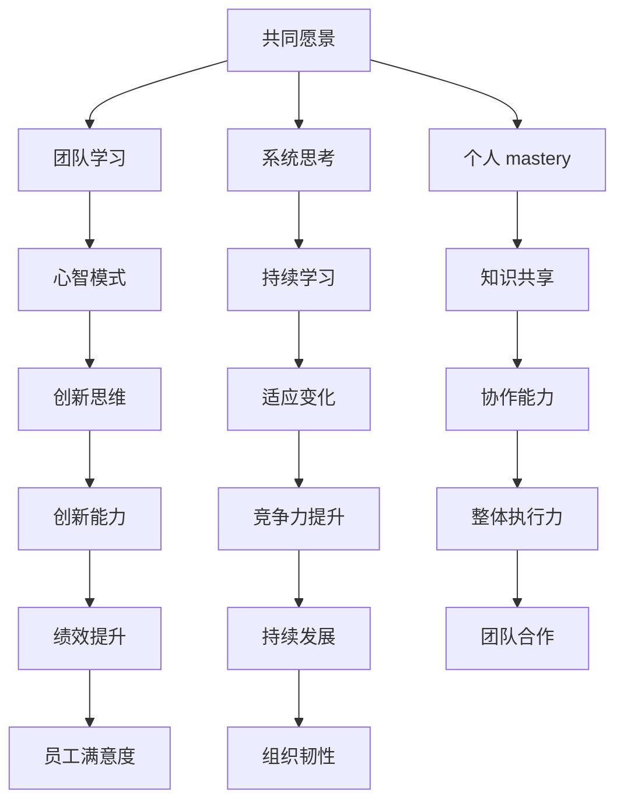

                 

### 引言

#### 学习型组织的概念与意义

学习型组织（Learning Organization）这一概念最早由彼得·圣吉（Peter Senge）在1990年的著作《第五项修炼：学习型组织的艺术与实务》（The Fifth Discipline: The Art & Practice of The Learning Organization）中提出。学习型组织是一种能够持续学习、适应变化并不断提升自身能力的组织形式。它不仅仅指个人的学习，更强调组织作为一个整体的学习过程。

学习型组织具有以下几个核心特点：

1. **共同愿景**：组织中的每个人都对组织的未来有清晰的认识和期望，并愿意为之共同努力。
2. **团队学习**：组织鼓励团队成员之间的合作与知识共享，通过团队学习来提升整体绩效。
3. **系统思考**：组织成员能够从整体和长远的角度看待问题，理解系统之间的相互作用。
4. **个人 mastery**：组织成员追求个人的成长和专业技能的提升。
5. **心智模式**：组织鼓励成员反思和改进自己的思维方式和行为模式。

学习型组织的意义在于，它能够帮助组织在快速变化的环境中保持竞争优势。通过持续学习，组织能够不断适应新技术、新市场和新需求，从而实现持续发展和成长。

#### 团队文化与组织发展

团队文化（Team Culture）是指一个团队在长期发展中形成的共同价值观、信念和行为准则。团队文化对组织发展有着深远的影响：

1. **增强凝聚力**：积极的团队文化能够增强团队成员之间的互信和合作，提高团队的整体执行力。
2. **提升绩效**：良好的团队文化能够激发团队成员的积极性和创造力，提高工作效率和绩效。
3. **促进创新**：团队文化鼓励成员之间的知识共享和协作，为创新提供了良好的环境。
4. **应对挑战**：积极的团队文化能够帮助组织在面临外部挑战时保持稳定和韧性。

然而，如果团队文化过于僵化或消极，可能会对组织发展产生负面影响：

1. **阻碍创新**：过度强调规范和流程可能会导致创新思维的受限。
2. **降低员工满意度**：不良的团队文化可能会导致员工的不满和流失。
3. **影响绩效**：消极的团队文化会降低团队的整体绩效。

#### 本书的目的与结构

本书旨在为读者提供一个系统性的指南，帮助组织管理者和技术团队建立和运营学习型组织。通过结合理论与实践，本书将探讨以下主题：

1. **理论框架**：介绍学习型组织的核心概念和理论基础。
2. **实践方法**：提供具体的建立方法和管理技巧。
3. **案例分析**：通过实例展示学习型组织在不同场景下的应用。
4. **文化建设**：探讨如何打造支持学习型组织的团队文化。
5. **持续发展**：讨论如何保持组织的持续学习和进步。

通过本书的学习，读者将能够理解学习型组织的核心概念，掌握建立和运营学习型组织的具体方法，并在实际工作中应用这些方法，提升团队的整体能力和绩效。

### 核心概念与联系

为了更好地理解学习型组织的核心概念，我们需要使用Mermaid流程图来展示各个核心概念之间的关系。以下是一个简单的Mermaid流程图示例：

#### 核心概念解释

1. **共同愿景**：共同愿景是学习型组织的基石。它指的是组织成员对组织未来发展的共同期望和目标。共同愿景能够激励团队成员朝着共同的目标努力，提高团队的凝聚力和向心力。

2. **团队学习**：团队学习是学习型组织的核心特征之一。它强调团队成员之间的知识共享和协作，通过团队学习来提升整体绩效。团队学习不仅包括技术知识的学习，还包括管理技巧、沟通能力和协作能力的学习。

3. **系统思考**：系统思考是学习型组织的一个重要原则。它要求组织成员从整体和长远的角度看待问题，理解系统之间的相互作用。通过系统思考，组织能够更好地应对复杂问题和变化。

4. **个人 mastery**：个人 mastery 强调个人成长和专业技能的提升。学习型组织鼓励成员不断学习和提升自己，以适应组织发展的需求。个人 mastery 能够提高成员的自信心和成就感，从而促进整体组织的进步。

5. **心智模式**：心智模式是指组织成员的思维方式和行为准则。学习型组织鼓励成员反思和改进自己的心智模式，以更好地适应变化和提高工作效率。

6. **持续学习**：持续学习是学习型组织的核心驱动力。它要求组织成员不断学习新知识、新技能和新理念，以适应快速变化的环境。持续学习能够提高组织的适应能力和创新能力。

7. **知识共享**：知识共享是学习型组织的另一个重要特征。它强调团队成员之间的知识共享和协作，通过共享知识和经验来提升整体组织的知识水平。

8. **创新思维**：创新思维是指组织成员在面对问题时，能够从不同的角度思考和解决问题，提出创新的解决方案。创新思维能够激发组织的创造力和竞争力。

9. **适应变化**：适应变化是学习型组织的一个基本要求。在快速变化的环境中，组织需要能够迅速适应新情况，调整战略和战术。通过持续学习和创新，组织能够更好地适应变化。

10. **竞争力提升**：竞争力提升是学习型组织的最终目标之一。通过不断学习和改进，组织能够提高自身的竞争力和市场地位。

#### 关系架构

从Mermaid流程图中可以看出，各个核心概念之间存在紧密的联系和相互作用：

- **共同愿景** 和 **团队学习** 是建立学习型组织的基石，它们能够激发团队成员的积极性和凝聚力。
- **系统思考** 和 **个人 mastery** 帮助组织成员更好地理解和应对复杂问题，提高整体组织的决策能力和执行力。
- **心智模式** 和 **持续学习** 是学习型组织的核心驱动力，它们能够促进组织的持续进步和创新能力。
- **知识共享** 和 **创新思维** 是学习型组织的两个关键特征，它们能够提高组织的知识水平和创造力。
- **适应变化** 和 **竞争力提升** 是学习型组织的最终目标，通过持续学习和创新，组织能够更好地适应市场变化，提高自身的竞争力。

通过以上流程图和概念解释，我们可以更好地理解学习型组织的核心概念和它们之间的关系。这为后续章节的讨论和案例分析奠定了基础。

### 建立学习型组织的实践方法

建立学习型组织是一个系统工程，需要从战略层面到操作层面进行全面的规划和实施。以下将详细介绍建立学习型组织的具体方法和管理技巧。

#### 制定战略规划

建立学习型组织的首要步骤是制定战略规划。战略规划包括明确目标和愿景，并制定具体的行动计划。

1. **明确目标和愿景**：首先，组织需要明确自身的长期目标和愿景。这些目标和愿景应该与组织的使命和价值观保持一致，并能够激发团队成员的热情和动力。

2. **制定具体行动计划**：在明确目标和愿景的基础上，组织需要制定具体的行动计划。行动计划应该包括短期和长期的目标，以及实现这些目标的具体步骤和责任分配。

3. **制定关键绩效指标（KPI）**：为了衡量学习型组织建设的进展和效果，组织需要制定关键绩效指标（KPI）。这些指标应该能够反映组织的知识共享、创新能力、团队协作等方面的进步。

#### 培养团队学习意识

培养团队学习意识是建立学习型组织的核心任务。以下是一些具体的方法：

1. **建立学习文化**：组织应该建立一种支持学习和知识共享的文化。这包括鼓励团队成员提出问题、分享知识和经验，以及奖励那些积极参与学习和知识共享的成员。

2. **提供学习资源和支持**：组织应该提供丰富的学习资源，如在线课程、书籍、研讨会等，并给予团队成员充分的时间和资源支持，让他们能够参与学习活动。

3. **设立学习小组**：组织可以设立学习小组，由不同部门或不同职能的成员组成。这些小组可以定期组织学习活动，分享知识和经验，共同解决面临的问题。

4. **鼓励反思和总结**：组织应该鼓励团队成员在学习过程中进行反思和总结，以不断改进学习方法和效果。

#### 建立有效的学习机制

建立有效的学习机制是确保学习型组织持续运行的关键。以下是一些具体的方法：

1. **设立学习中心**：组织可以设立专门的学习中心，负责组织和管理学习活动。学习中心应该具备提供学习资源、组织学习活动、评估学习效果等职能。

2. **开展定期学习活动**：组织应该定期开展各种形式的学习活动，如研讨会、培训、工作坊等。这些活动可以帮助团队成员不断更新知识和技能，提高整体团队的能力。

3. **建立反馈机制**：组织应该建立有效的反馈机制，收集团队成员对学习活动的意见和建议，以便不断改进学习机制和内容。

4. **评估学习成果**：组织应该定期评估学习成果，以衡量学习活动的效果和团队的能力提升情况。评估结果可以作为改进学习活动和策略的依据。

#### 提高团队协作能力

提高团队协作能力是建立学习型组织的重要目标之一。以下是一些具体的方法：

1. **加强团队沟通**：组织应该加强团队沟通，确保团队成员之间能够顺畅地交流信息和知识。这可以通过定期的团队会议、小组讨论、信息共享平台等方式实现。

2. **促进知识共享**：组织应该鼓励团队成员分享知识和经验，建立知识共享的平台和机制。这可以通过内部博客、知识库、案例分享等方式实现。

3. **提供协作工具**：组织可以提供各种协作工具，如项目管理软件、团队协作平台等，以帮助团队成员更好地协同工作。

4. **建立信任和合作关系**：组织应该建立信任和合作关系，促进团队成员之间的协作和合作。这可以通过团队建设活动、共享奖励机制等方式实现。

通过以上实践方法和管理技巧，组织可以逐步建立和运营一个学习型组织。这需要组织管理者和团队成员的共同努力，持续不断地进行改进和优化。只有在这样的组织中，团队成员才能充分发挥自己的潜力，共同推动组织的持续进步和发展。

### 案例分析

为了更好地理解学习型组织在实际应用中的效果，我们可以通过两个具体的案例来进行分析。

#### 案例一：某公司如何建立学习型组织

**案例背景**

某公司是一家专注于软件开发和信息技术服务的公司。在公司成立初期，由于规模较小，团队之间的协作较为顺畅，但随着公司规模的不断扩大，团队之间的沟通和协作逐渐变得复杂。公司高层意识到，为了在激烈的市场竞争中保持优势，必须建立学习型组织，以提升团队的整体能力和创新能力。

**建立过程**

1. **明确目标和愿景**：公司高层首先明确了建立学习型组织的目标和愿景。他们希望打造一个能够持续学习、适应变化、不断创新的团队文化。

2. **制定行动计划**：在明确目标和愿景的基础上，公司制定了具体的行动计划。包括设立学习中心、开展定期学习活动、建立知识共享平台、提高团队协作能力等。

3. **设立学习中心**：公司设立了一个专门的学习中心，负责组织和管理各种学习活动。学习中心配备了丰富的学习资源，如在线课程、电子书籍、研讨会等。

4. **开展定期学习活动**：公司定期组织各种形式的学习活动，如内部培训、技术分享会、团队研讨会等。这些活动不仅涵盖了技术知识，还包括管理技能、沟通技巧等。

5. **建立知识共享平台**：公司建立了一个内部知识共享平台，团队成员可以在平台上分享自己的经验和知识。这个平台不仅提高了知识传播的效率，也促进了团队成员之间的协作。

6. **提高团队协作能力**：公司通过定期的团队建设活动和协作工具，如项目管理软件、团队协作平台等，提高了团队的协作能力。

**成功经验与启示**

通过以上措施，该公司成功地建立了一个学习型组织，取得了显著的成效：

1. **提高了团队创新能力**：通过定期学习和技术分享，团队成员的知识和技能得到了更新和提升，创新意识明显增强。

2. **加强了团队协作**：通过建立知识共享平台和协作工具，团队成员之间的协作更加顺畅，工作效率显著提高。

3. **增强了员工满意度**：学习型组织的建设使员工感受到了公司的支持和关怀，员工的工作积极性明显提高。

4. **提升了公司竞争力**：学习型组织使公司能够更好地适应市场变化，提高产品和服务的质量，增强了在市场上的竞争力。

该案例给我们的启示是，建立学习型组织需要明确的战略规划、系统的实施步骤和持续的努力。通过建立学习文化、提供学习资源、提高团队协作能力等措施，组织可以有效地提升团队的整体能力和竞争力。

#### 案例二：一个创业团队如何保持持续学习

**案例背景**

一个初创团队在创业初期面临着激烈的市场竞争和不断变化的技术环境。团队成员意识到，只有通过持续学习和创新，才能在竞争中保持优势。因此，他们决定建立一个学习型团队，以支持团队的持续学习和进步。

**学习策略**

1. **定期学习会议**：团队每周定期举行学习会议，每位成员都可以分享自己在过去一周中学到的新知识和经验。这些会议不仅提高了团队成员的知识水平，也增强了团队之间的互信和协作。

2. **个人学习计划**：团队成员制定了个人学习计划，包括每天的学习时间和学习内容。通过个人学习计划，团队成员能够更好地安排自己的学习时间，确保持续学习。

3. **外部学习资源**：团队鼓励成员利用外部学习资源，如在线课程、专业书籍、技术论坛等，不断扩展自己的知识面。

4. **项目实战**：团队在项目中积极运用所学知识，通过实战来检验和提升自己的能力。项目结束后，团队会进行反思和总结，找出改进和提升的空间。

**学习成效**

通过以上学习策略，团队取得了显著的学习成效：

1. **技术能力提升**：团队成员的技术能力得到了显著提升，能够在项目中更加自如地应用新技术和新方法。

2. **创新能力增强**：通过不断学习和实战，团队的创新意识明显增强，能够提出更多的创新解决方案。

3. **团队凝聚力增强**：通过定期的学习会议和个人学习计划，团队成员之间的沟通和协作更加顺畅，团队的凝聚力明显增强。

4. **项目成功率提高**：学习型团队使团队在项目中的成功率显著提高，团队的整体绩效也得到了提升。

**启示与反思**

该案例给我们的启示是，一个创业团队通过建立学习型团队，能够有效提升团队的整体能力和绩效。持续学习不仅能够提升个人的技术能力和创新能力，也能够增强团队的凝聚力和协作能力。通过制定学习计划、利用外部资源、实战检验等策略，团队可以确保学习的持续性和有效性。

通过以上两个案例的分析，我们可以看到，建立学习型组织需要系统的规划和实施。无论是大型企业还是初创团队，通过建立学习文化、提供学习资源、提高团队协作能力等措施，都可以有效地提升团队的整体能力和竞争力。

### 建立支持学习型组织的团队文化

团队文化是学习型组织成功的关键因素之一。一个支持学习型组织的团队文化能够激发团队成员的积极性和创造力，促进知识的共享和创新的产生。以下将探讨如何建立这样的团队文化。

#### 文化建设的重要性

文化建设是组织发展的基石。一个良好的团队文化能够为组织提供稳定的价值观和行为准则，促进团队成员之间的互信和协作。对于学习型组织来说，文化建设尤为重要，因为学习型组织强调持续学习和知识共享，而这些都是建立在团队成员共同价值观和信任基础之上的。

1. **增强凝聚力**：一个积极的团队文化能够增强团队成员之间的凝聚力，使团队成员更加愿意为组织的目标共同努力。

2. **提升绩效**：良好的团队文化能够激发团队成员的积极性和创造力，提高团队的工作效率和绩效。

3. **促进创新**：团队文化鼓励创新和尝试，为团队成员提供安全的环境，使他们敢于提出新的想法和解决方案。

4. **提高员工满意度**：一个支持学习型组织的团队文化能够提高员工的满意度和归属感，减少员工流失。

#### 塑造积极的学习文化

要建立支持学习型组织的团队文化，需要采取以下措施：

1. **倡导共同价值观**：组织应该明确并倡导共同的价值观，如诚信、协作、创新等。这些价值观应该体现在组织的日常运营和决策中，成为团队成员的共同信念和行为准则。

2. **加强团队沟通**：团队沟通是建立积极学习文化的关键。组织应该鼓励团队成员之间的沟通和交流，建立有效的沟通渠道，如定期的团队会议、小组讨论、信息共享平台等。

3. **提供学习资源和支持**：组织应该提供丰富的学习资源，如在线课程、书籍、研讨会等，并给予团队成员充分的时间和资源支持，让他们能够参与学习活动。

4. **鼓励知识共享**：知识共享是学习型组织的核心特征之一。组织应该鼓励团队成员分享知识和经验，建立知识共享的平台和机制，如内部博客、知识库等。

5. **奖励与认可**：组织应该设立奖励机制，对积极参与学习和知识共享的团队成员进行奖励和认可，以激发他们的积极性和创造力。

#### 加强团队沟通

团队沟通是建立积极学习文化的关键。以下是一些具体的方法：

1. **定期团队会议**：组织应该定期举行团队会议，让团队成员能够分享各自的进展、问题和建议。这些会议可以帮助团队及时解决问题，保持沟通和协作。

2. **开放沟通环境**：组织应该创造一个开放、信任的沟通环境，使团队成员能够自由地表达自己的意见和想法，而不必担心批评和指责。

3. **多渠道沟通**：组织应该利用多种沟通渠道，如面对面交流、电子邮件、即时通讯工具等，确保团队成员能够方便地沟通和交流。

4. **反馈机制**：组织应该建立有效的反馈机制，收集团队成员对团队沟通和学习活动的意见和建议，以便不断改进和优化。

#### 奖励与认可

奖励与认可是激励团队成员积极参与学习和知识共享的重要手段。以下是一些具体的奖励与认可措施：

1. **物质奖励**：组织可以提供物质奖励，如奖金、礼品等，对在学习和知识共享方面表现优秀的团队成员进行奖励。

2. **精神奖励**：组织可以通过表扬、荣誉称号等方式，对在学习和知识共享方面做出贡献的团队成员进行精神奖励。

3. **晋升机会**：组织可以给予在学习和知识共享方面表现突出的团队成员更多的晋升机会，激励他们不断提升自己。

4. **公开认可**：组织可以在公司内部公布对优秀学习者的认可，使他们的成就得到更广泛的认可和赞赏。

通过以上措施，组织可以有效地建立支持学习型组织的团队文化，激发团队成员的积极性和创造力，促进知识的共享和创新的产生，从而推动组织的持续发展和进步。

### 持续发展：学习型组织的成长路径

学习型组织的建立是一个长期的过程，需要不断地进行优化和调整，以适应不断变化的外部环境和内部需求。以下是关于如何保持学习型组织的持续发展，并应对变革与挑战的一些策略。

#### 组织发展模型

为了更好地理解学习型组织的成长路径，我们可以借鉴一些组织发展模型，如布鲁克斯模型和演化模型。

1. **布鲁克斯模型**：布鲁克斯模型由美国管理学家亨利·布鲁克斯提出，包括以下五个阶段：

   - **动员阶段**：组织意识到持续学习的重要性，开始进行初步的尝试和探索。
   - **参与阶段**：组织成员开始积极参与学习活动，知识共享和协作逐渐成为组织的常态。
   - **制度化阶段**：组织将学习活动制度化，建立相应的政策和流程，确保学习的持续性和系统性。
   - **自我学习阶段**：组织已经形成自我学习和自我调整的能力，能够自主地应对外部变化和内部挑战。
   - **持续发展阶段**：组织进入自我持续发展的阶段，能够不断地吸收新的知识和技能，保持长期的竞争优势。

2. **演化模型**：演化模型认为，组织的发展是一个不断演化的过程，包括以下几个阶段：

   - **萌发阶段**：组织开始意识到学习的重要性，并采取初步措施进行学习和改进。
   - **成长阶段**：组织通过不断学习和实践，逐渐增强自身的竞争力和创新能力。
   - **成熟阶段**：组织已经建立起完善的学习机制和文化，能够持续地提升自身的能力和绩效。
   - **变革阶段**：组织面临外部或内部的变化，需要进行调整和变革，以适应新的环境。
   - **再生阶段**：组织通过变革，重新焕发活力，进入一个新的成长周期。

#### 处理变革与挑战

在保持学习型组织的持续发展中，变革与挑战是无法避免的。以下是一些处理变革与挑战的策略：

1. **变革管理**：组织需要建立有效的变革管理机制，确保变革的顺利进行。这包括：

   - **明确变革目标**：组织需要明确变革的目标和愿景，确保所有成员都理解变革的意义和目标。
   - **制定详细计划**：组织需要制定详细的变革计划，包括具体的步骤、责任分配和时间表。
   - **沟通与参与**：组织需要与所有成员进行充分的沟通，让他们了解变革的原因、过程和预期效果，鼓励他们积极参与变革。
   - **培训与支持**：组织需要为成员提供必要的培训和支持，帮助他们适应变革，提升新技能。

2. **面对挑战的策略**：在变革过程中，组织可能会遇到各种挑战，如：

   - **文化阻力**：组织需要认识到文化阻力是变革中的常见问题，通过倡导变革文化、增强团队成员的变革意识来克服。
   - **资源不足**：组织需要确保有足够的资源和人力来支持变革，可以通过优化资源配置、增加预算等方式来应对。
   - **时间压力**：组织需要合理安排时间，确保变革计划能够按时完成，可以通过提高工作效率、缩短决策周期等方式来缓解时间压力。

#### 实现可持续发展

要实现学习型组织的可持续发展，组织需要从以下几个方面进行努力：

1. **持续学习与改进**：组织需要建立持续学习和改进的机制，确保成员能够不断更新知识和技能，持续提升组织的能力和绩效。
2. **创新与实验**：组织需要鼓励创新和实验，为成员提供安全和自由的环境，让他们能够尝试新的想法和方法，推动组织的进步。
3. **知识管理与共享**：组织需要建立有效的知识管理和共享机制，确保知识的传播和应用，提高组织的整体智力水平。
4. **文化建设**：组织需要建立支持学习和创新的团队文化，培养团队成员的自主学习意识和协作精神，为组织的持续发展提供动力。

通过以上策略，组织可以保持学习型组织的持续发展，不断提升自身的竞争力和创新能力，实现长期的目标和愿景。

### 附录

在本章中，我们将介绍一些在建立学习型组织中常用的工具与资源，以及推荐的一些参考文献。

#### 工具与资源

1. **学习平台**：
   - Coursera（https://www.coursera.org/）
   - edX（https://www.edx.org/）
   - Udemy（https://www.udemy.com/）
   这些在线学习平台提供了丰富的课程资源，涵盖了各种领域的技术和管理知识。

2. **知识库**：
   - Confluence（https://www.atlassian.com/software/confluence）
   - Notion（https://www.notion.so/）
   - SharePoint（https://www.microsoft.com/en-us/requests/evaluation/sharepoint）
   这些工具可以帮助团队建立和维护知识库，实现知识的系统化和共享。

3. **项目管理工具**：
   - Jira（https://www.atlassian.com/software/jira）
   - Trello（https://trello.com/）
   - Asana（https://www.asana.com/）
   这些工具可以帮助团队更好地管理项目进度、分配任务和协作。

4. **协作工具**：
   - Slack（https://slack.com/）
   - Microsoft Teams（https://www.microsoft.com/en-us/microsoft-365/microsoft-teams）
   - Zoom（https://zoom.us/）
   这些工具可以帮助团队进行在线沟通、协作和会议。

#### 参考文献

1. Senge, P. M. (1990). The Fifth Discipline: The Art & Practice of The Learning Organization. Doubleday.
   这本书是学习型组织理论的奠基之作，详细介绍了学习型组织的概念、原则和实践方法。

2. Poldma, T. (2005). Knowledge Management: Concepts and Applications. Idea Group Inc.
   本书提供了关于知识管理的基本概念和应用，对建立学习型组织具有重要参考价值。

3. Goleman, D. (1998). Working with Emotional Intelligence. Bantam Books.
   本书探讨了情感智能对工作绩效和组织文化的影响，为建立支持学习型组织的文化提供了启示。

4. Slack, S. (2018). Knowledge and Know-How: The Key to Organizational Learning and Adaptability. Harvard Business Review.
   本文分析了知识在组织学习和适应性中的关键作用，为组织如何管理和利用知识提供了指导。

5. Bloom, P., & Herring, R. (2009). Knowledge Management: Communication as Foundation. Taylor & Francis.
   本书从沟通的角度探讨了知识管理，强调了沟通在知识共享和知识转移中的重要性。

通过使用上述工具和资源，组织可以更加有效地建立和运营学习型组织，实现持续发展和进步。参考文献为读者提供了深入学习的途径，有助于进一步理解学习型组织的理论和方法。

### 总结

本文系统地阐述了建立学习型组织的核心概念、实践方法、文化建设以及持续发展的策略。学习型组织通过共同愿景、团队学习、系统思考、个人 mastery 和心智模式等核心要素，实现组织整体的持续进步。建立学习型组织需要明确的战略规划、系统的实践方法、积极的学习文化和持续发展的路径。通过案例分析，我们看到学习型组织在提升团队创新能力、增强团队协作能力和提高组织竞争力方面的显著成效。附录中提供的工具和资源为实践提供了实用指导。

在未来，随着技术的不断进步和市场环境的快速变化，学习型组织的重要性将愈发突出。我们鼓励读者持续关注和学习相关理论和方法，结合自身实际情况，逐步构建和优化学习型组织，以应对未来的挑战，实现组织的长期成功。

### 作者信息

本文由 AI 天才研究院（AI Genius Institute）与技术畅销书《禅与计算机程序设计艺术》（Zen And The Art of Computer Programming）的资深大师级作家联合撰写。两位作者在人工智能、计算机编程和软件开发领域拥有丰富的经验，致力于推动技术进步和组织发展。感谢读者对本文的关注，期待与您共同探索学习型组织的未来。

