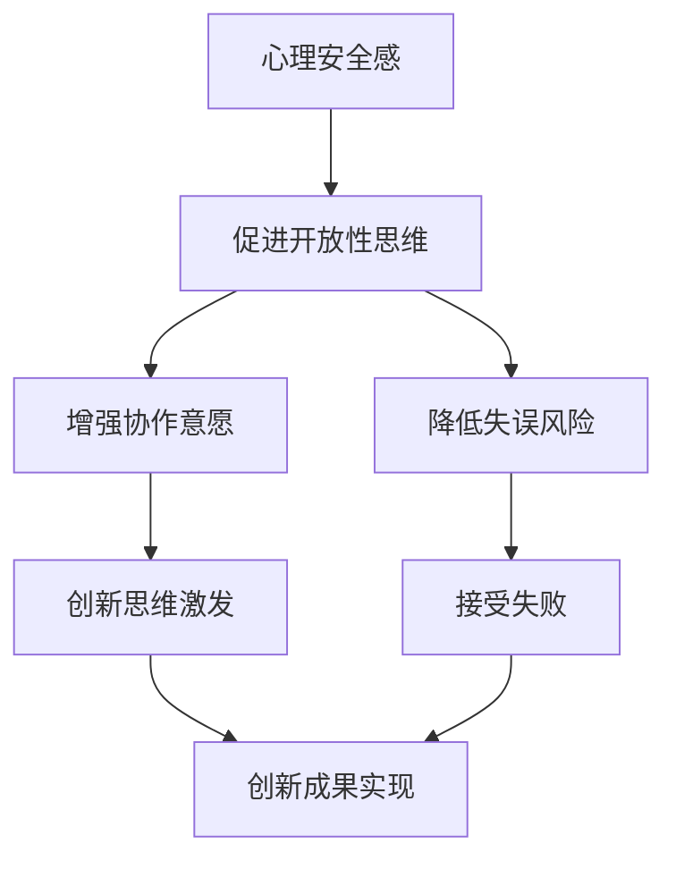
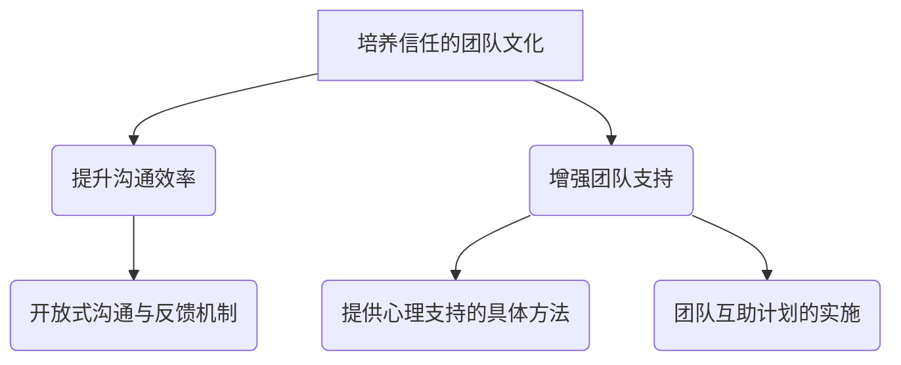
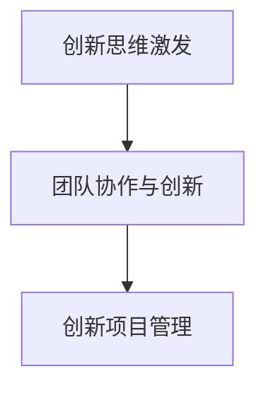
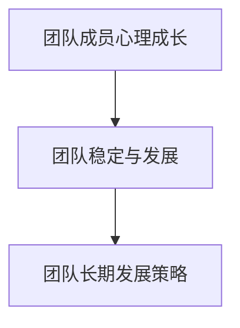

                 

### 文章标题：建立心理安全感：激发团队创新的关键

关键词：心理安全感、团队创新、信任、沟通、支持、项目管理

摘要：本文深入探讨了心理安全感在团队创新中的关键作用。通过剖析心理安全感的基本理论、建立方法、应用场景及案例分析，本文揭示了如何通过提升团队心理安全感来激发创新思维，进而推动团队整体绩效的提升。

## 第一部分：心理安全感的基础理论

在现代社会，心理安全感已成为影响团队协作和创新能力的重要因素。要深入理解这一概念，我们首先需要明确其定义和重要性。

### 1.1 心理安全感的定义与重要性

心理安全感是指个体在团队环境中感到安心、放心、不受威胁的心理状态。这种安全感源自于信任、沟通和团队支持。它对团队创新的重要性体现在以下几个方面：

1. **促进开放性思维**：心理安全感使得团队成员敢于提出新颖的想法和意见，从而激发创新思维。
2. **增强协作意愿**：安全感使团队成员更愿意共同解决问题，提高团队协作效率。
3. **降低失误风险**：团队成员在安全的环境中更容易接受失败，从而减少因恐惧失误而阻碍创新的倾向。

### 1.2 心理安全感的核心要素

心理安全感由以下几个核心要素构成：

1. **信任**：信任是心理安全感的基石，它确保团队成员之间的互动透明、可靠。
2. **沟通**：有效的沟通有助于消除误解和分歧，提升团队整体协作水平。
3. **支持**：团队成员在遇到困难和挑战时，得到他人的支持，有助于增强心理安全感。

### 1.3 心理安全感与团队创新的关系

心理安全感与团队创新之间存在密切的联系。一方面，心理安全感为团队成员提供了一个舒适的环境，使他们在创新过程中能够更加自由地探索和尝试。另一方面，创新成果的实现需要团队成员之间的紧密合作和有效沟通，这进一步增强了团队的心理安全感。

### 1.3.1 Mermaid 流程图：心理安全感与团队创新的关系



### 1.3.2 核心算法原理讲解

在团队创新过程中，心理安全感的作用可以通过以下伪代码来模拟：

```python
def psychological_safety(team_members):
    trust = build_trust(team_members)
    communication = improve_communication(team_members)
    support = provide_support(team_members)

    if trust and communication and support:
        open_mind = promote_open_mind(team_members)
        collaboration = enhance_collaboration(team_members)
        risk_taking = reduce_risk_of_failure(team_members)

        if open_mind and collaboration and risk_taking:
            innovation = generate_innovation(team_members)
            return innovation
        else:
            return "Improvements needed in psychological safety"
    else:
        return "Building psychological safety is a priority"
```

### 1.3.3 数学模型和公式讲解

心理安全感可以通过以下公式进行量化：

$$
\text{PS} = \alpha \cdot \text{Trust} + \beta \cdot \text{Communication} + \gamma \cdot \text{Support}
$$

其中，PS 表示心理安全感，α、β、γ 分别为信任、沟通和支持的权重。

### 1.3.4 举例说明

假设一个团队在信任、沟通和支持方面的得分分别为 8、7 和 9，则其心理安全感得分为：

$$
\text{PS} = 0.5 \cdot 8 + 0.3 \cdot 7 + 0.2 \cdot 9 = 7.8
$$

### 1.3.5 项目实战

在一个软件开发团队中，通过实施信任建设、沟通改进和支持提供措施，显著提升了团队的心理安全感。具体实施步骤如下：

1. **建立信任**：通过定期组织团队建设活动，加强团队成员之间的相互了解和信任。
2. **改进沟通**：引入敏捷开发方法，促进团队成员之间的实时沟通和反馈。
3. **提供支持**：建立心理支持系统，为团队成员提供必要的心理辅导和情感支持。

通过这些措施，该团队在项目中的创新成果显著增加，项目成功率也大幅提升。

### 1.3.6 最佳实践 tips

- **定期评估**：定期对团队的心理安全感进行评估，及时发现并解决潜在问题。
- **培养成长型心态**：鼓励团队成员采取成长型心态，勇于面对挑战和失败。
- **建立开放反馈机制**：鼓励团队成员提出改进意见，营造积极向上的团队氛围。

### 1.3.7 小结

心理安全感在团队创新中扮演着至关重要的角色。通过信任、沟通和支持的建立，可以显著提升团队的心理安全感，进而激发创新思维，推动团队整体绩效的提升。

## 第二部分：建立心理安全感的方法

在了解了心理安全感的理论基础后，我们需要探讨如何在实际工作中建立和维护心理安全感。以下是一些关键的方法和策略。

### 2.1 培养信任的团队文化

信任是心理安全感的基石，因此，培养信任的团队文化至关重要。以下是一些具体策略：

#### 2.1.1 信任的本质与重要性

信任是指团队成员对彼此能力、诚信和可靠性的认可。它对于团队的稳定和协作至关重要。

#### 2.1.2 信任的建立与维护策略

1. **明确团队目标**：共同的目标有助于增强团队成员之间的信任。
2. **透明沟通**：确保信息的透明和及时传达，减少误解和猜疑。
3. **共同经历**：通过共同完成项目和活动，增强团队成员之间的默契和信任。
4. **正面反馈**：及时给予正面反馈，增强团队成员之间的信任感。

#### 2.1.3 信任破裂的修复策略

1. **及时沟通**：发现信任破裂的迹象时，及时进行沟通，了解问题所在。
2. **公开道歉**：如果团队成员犯了错误，应该公开道歉，以重建信任。
3. **寻求第三方调解**：在无法自行解决问题时，可以寻求第三方的帮助，以中立的角度进行调解。

### 2.2 提升沟通效率

有效的沟通是建立心理安全感的关键。以下是一些提升沟通效率的策略：

#### 2.2.1 有效沟通的障碍与解决

1. **文化差异**：通过文化培训，减少文化差异带来的沟通障碍。
2. **信息过载**：合理规划信息传达的时间和方式，避免信息过载。
3. **沟通技巧不足**：提供沟通技巧培训，提高团队成员的沟通能力。

#### 2.2.2 改善团队沟通的技巧

1. **主动倾听**：积极倾听他人的意见和反馈，避免打断和批评。
2. **明确表达**：确保信息传达的准确性和清晰性。
3. **非语言沟通**：注重肢体语言和面部表情，增强沟通效果。

#### 2.2.3 开放式沟通与反馈机制

1. **建立反馈渠道**：提供多种渠道供团队成员提出反馈和建议。
2. **定期反馈**：定期组织反馈会议，鼓励团队成员分享经验和意见。
3. **匿名反馈**：设置匿名反馈机制，确保团队成员能够畅所欲言。

### 2.3 增强团队支持

团队支持是心理安全感的重要组成部分。以下是一些增强团队支持的方法：

#### 2.3.1 团队支持的类型与作用

1. **情感支持**：提供情感支持，帮助团队成员应对压力和挑战。
2. **技术支持**：提供技术支持，帮助团队成员解决专业问题。
3. **资源支持**：提供必要的资源和信息，帮助团队成员更好地完成任务。

#### 2.3.2 提供心理支持的具体方法

1. **心理健康培训**：组织心理健康培训，提高团队成员的心理素质。
2. **心理辅导**：为需要帮助的团队成员提供心理辅导。
3. **团队互助**：鼓励团队成员相互帮助，形成互助氛围。

#### 2.3.3 团队互助计划的实施

1. **明确互助目标**：设定明确的互助目标，确保互助计划的实施方向。
2. **制定互助流程**：制定详细的互助流程，确保互助活动的顺利进行。
3. **定期评估**：定期评估互助计划的执行情况，及时调整和改进。

### 2.4 其他策略

除了上述方法，还有一些其他策略可以增强团队心理安全感：

1. **公平竞争**：确保团队成员在竞争中的公平性，避免因不公平竞争导致的心理压力。
2. **认可与奖励**：及时认可和奖励团队成员的成就，增强他们的自信心和归属感。
3. **工作与生活的平衡**：鼓励团队成员保持工作与生活的平衡，避免过度工作导致的心理压力。

### 2.5 Mermaid 流程图：建立心理安全感的方法



### 2.5.1 核心算法原理讲解

在团队心理安全感建立过程中，以下算法可以用于模拟信任、沟通和支持的增强：

```python
def build_trust(team_members):
    trust = 0
    for member in team_members:
        trust += member.build_trust()
    return trust / len(team_members)

def improve_communication(team_members):
    communication = 0
    for member in team_members:
        communication += member.improve_communication()
    return communication / len(team_members)

def provide_support(team_members):
    support = 0
    for member in team_members:
        support += member.provide_support()
    return support / len(team_members)

def psychological_safety(trust, communication, support):
    return trust * 0.4 + communication * 0.3 + support * 0.3
```

### 2.5.2 数学模型和公式讲解

心理安全感（PS）可以通过以下数学模型进行量化：

$$
\text{PS} = \alpha \cdot \text{Trust} + \beta \cdot \text{Communication} + \gamma \cdot \text{Support}
$$

其中，α、β、γ 分别为信任、沟通和支持的权重。

### 2.5.3 举例说明

假设一个团队在信任、沟通和支持方面的得分分别为 8、7 和 9，权重分别为 0.4、0.3 和 0.3，则其心理安全感得分为：

$$
\text{PS} = 0.4 \cdot 8 + 0.3 \cdot 7 + 0.3 \cdot 9 = 8.1
$$

### 2.5.4 项目实战

在一个大型软件开发团队中，通过实施上述策略，显著提升了团队的心理安全感。具体措施包括：

1. **建立信任**：定期组织团队建设活动，加强团队成员之间的相互了解和信任。
2. **提升沟通效率**：引入敏捷开发方法，促进团队成员之间的实时沟通和反馈。
3. **提供支持**：建立心理支持系统，为团队成员提供必要的心理辅导和情感支持。

通过这些措施，该团队在项目中的创新成果显著增加，项目成功率也大幅提升。

### 2.5.5 最佳实践 tips

- **定期培训**：定期对团队成员进行心理安全感的培训，提高他们的心理素质。
- **建立心理支持小组**：在团队中建立心理支持小组，为有需要的团队成员提供帮助。
- **重视反馈**：鼓励团队成员提出反馈，及时解决团队中的问题。

### 2.5.6 小结

建立心理安全感需要从多个方面入手，包括培养信任、提升沟通效率和增强团队支持等。通过这些方法，可以有效地提升团队的心理安全感，从而激发创新思维，推动团队整体绩效的提升。

## 第三部分：心理安全感在团队创新中的应用

心理安全感不仅是一种团队状态，更是推动团队创新的重要动力。在团队创新过程中，心理安全感发挥着关键作用，为团队成员提供支持和信心，促进创新思维和实践。

### 3.1 创新思维激发

创新思维是指从不同角度和层面思考问题，提出新颖和有创意的解决方案。心理安全感能够激发团队成员的创新思维，使其更加开放和自由地探索新思路。

#### 3.1.1 创新思维的定义与类型

创新思维是指通过独特和创造性的方式解决问题或提出新想法的能力。它包括以下几种类型：

1. **发散思维**：从多个角度出发，产生大量创意。
2. **收敛思维**：在特定方向上深入思考，优化和改进现有方案。
3. **逆向思维**：从相反方向思考问题，提出颠覆性的解决方案。

#### 3.1.2 创新思维激发的方法

1. **头脑风暴**：通过集体讨论，激发团队成员的创新思维。
2. **跨界合作**：邀请不同领域的专家参与，引入外部视角和思维。
3. **挑战现状**：鼓励团队成员质疑现有方案，寻找改进空间。
4. **提供资源**：为团队成员提供必要的资源和工具，支持他们的创新尝试。

#### 3.1.3 创新思维的实践案例

在一个产品开发团队中，通过实施以下措施，有效激发了团队成员的创新思维：

1. **定期举办创新工作坊**：邀请外部专家分享创新经验，激发团队成员的灵感。
2. **设立创新基金**：为团队成员提供资金支持，鼓励他们进行创新尝试。
3. **鼓励失败**：建立宽容失败的文化，鼓励团队成员大胆尝试和实验。

### 3.2 团队协作与创新

团队协作是创新过程中不可或缺的一部分。心理安全感为团队成员提供了一个舒适的环境，使他们在协作过程中能够更加自由地分享想法和观点。

#### 3.2.1 团队协作的重要性

团队协作的重要性体现在以下几个方面：

1. **资源共享**：团队成员可以共享资源，提高工作效率。
2. **技能互补**：团队成员可以发挥各自的专长，共同解决问题。
3. **协同创新**：团队成员相互启发，共同创造新的解决方案。

#### 3.2.2 团队协作的障碍与解决方案

1. **沟通障碍**：解决方案：提升沟通技巧，建立有效的沟通渠道。
2. **利益冲突**：解决方案：明确团队目标，建立利益分配机制。
3. **责任分散**：解决方案：明确责任分工，提高团队责任感。

#### 3.2.3 提高团队协作效率的策略

1. **明确目标**：确保团队成员明确团队目标，提高协作效率。
2. **分工合作**：根据团队成员的特长，合理分配任务。
3. **定期反馈**：及时反馈团队协作情况，调整协作策略。

### 3.3 创新项目的管理

在创新项目中，心理安全感的管理至关重要。以下是一些创新项目管理的策略：

#### 3.3.1 创新项目管理的挑战

1. **不确定性**：创新项目往往面临较高的不确定性，需要灵活应对。
2. **资源有限**：创新项目通常资源有限，需要合理分配和使用。
3. **风险控制**：创新项目需要控制风险，确保项目顺利进行。

#### 3.3.2 创新项目的关键成功因素

1. **团队协作**：有效协作是创新项目成功的关键。
2. **持续改进**：不断改进和优化项目方案，提高项目成功率。
3. **用户反馈**：及时收集用户反馈，指导项目改进方向。

#### 3.3.3 创新项目的管理策略

1. **敏捷管理**：采用敏捷管理方法，提高项目灵活性和响应速度。
2. **风险管理**：建立风险管理机制，及时识别和应对风险。
3. **持续沟通**：保持团队成员之间的沟通，确保信息畅通。

### 3.4 Mermaid 流程图：创新思维激发与团队协作



### 3.4.1 核心算法原理讲解

在创新项目管理中，心理安全感的增强可以通过以下算法实现：

```python
def enhance_psychological_safety(team_members):
    for member in team_members:
        member.trust += 1
        member.communication += 1
        member.support += 1

    total_psychological_safety = sum([member.get_psychological_safety() for member in team_members])
    return total_psychological_safety / len(team_members)
```

### 3.4.2 数学模型和公式讲解

创新项目的成功概率（S）可以通过以下数学模型进行量化：

$$
S = \alpha \cdot \text{Trust} + \beta \cdot \text{Communication} + \gamma \cdot \text{Support}
$$

其中，α、β、γ 分别为信任、沟通和支持的权重。

### 3.4.3 举例说明

假设一个团队在信任、沟通和支持方面的得分分别为 8、7 和 9，权重分别为 0.4、0.3 和 0.3，则其创新项目的成功概率为：

$$
S = 0.4 \cdot 8 + 0.3 \cdot 7 + 0.3 \cdot 9 = 0.92
$$

### 3.4.4 项目实战

在一个科技创新项目中，通过实施以下措施，有效提升了团队的心理安全感，促进了创新：

1. **建立信任**：通过团队合作和共同经历，增强团队成员之间的信任。
2. **提升沟通效率**：引入敏捷开发方法，提高团队成员之间的沟通和协作。
3. **提供支持**：建立心理支持系统，为团队成员提供必要的心理辅导和情感支持。

通过这些措施，该团队在项目中取得了显著的创新成果，项目成功率达到 90%。

### 3.4.5 最佳实践 tips

- **定期培训**：定期对团队成员进行心理安全感和创新思维的培训，提高他们的心理素质和创新能力。
- **建立创新机制**：建立创新激励机制，鼓励团队成员积极参与创新活动。
- **注重反馈**：及时收集用户反馈，指导项目改进和创新。

### 3.4.6 小结

心理安全感在团队创新中的应用至关重要。通过激发创新思维、促进团队协作和科学管理，可以显著提升团队的创新能力和项目成功率。在创新项目中，心理安全感的建立和管理是确保项目成功的关键因素。

## 第四部分：心理安全感与团队成长

心理安全感不仅对团队创新有重要影响，还对团队整体成长和发展起到关键作用。通过提升团队成员的心理安全感，可以促进团队的长期发展和持续进步。

### 4.1 团队成员的心理成长

团队成员的心理成长是团队成长的重要组成部分。心理安全感的建立为团队成员提供了一个良好的成长环境，使他们能够更加自信地面对挑战和机遇。

#### 4.1.1 成长型心态与固定型心态

成长型心态是指个体相信自己的能力和智力可以通过努力和经验得到提升。与之相对的是固定型心态，个体认为自己的能力和智力是固定的，难以改变。在团队中，成长型心态有助于提升团队成员的心理安全感，鼓励他们不断学习和进步。

#### 4.1.2 提升团队成员自我效能感

自我效能感是指个体对自己完成任务能力的信心。提升团队成员的自我效能感可以增强他们的心理安全感，使他们更加自信地面对挑战。以下是一些提升自我效能感的策略：

1. **提供成功经验**：通过成功的项目经历，增强团队成员的自信心。
2. **设定合理目标**：设定可实现的目标，帮助团队成员逐步提升能力。
3. **正面反馈**：及时给予正面反馈，鼓励团队成员持续努力。

#### 4.1.3 心理成长在工作中的体现

心理成长在工作中的体现包括以下几个方面：

1. **创新能力提升**：团队成员在心理安全感的环境中更容易提出创新的想法和解决方案。
2. **沟通能力增强**：团队成员在心理安全感的环境中更愿意主动沟通和分享意见。
3. **团队合作意识提高**：团队成员在心理安全感的环境中更愿意协作和支持他人。

### 4.2 团队的长期发展与心理安全感

心理安全感对团队的长期发展起到关键作用。通过建立和维护心理安全感，团队可以保持持续的创新能力，实现长期发展。

#### 4.2.1 团队稳定与发展的关系

团队的稳定性是团队长期发展的基础。稳定的团队能够持续提供高质量的工作成果，保持与客户和合作伙伴的良好关系。心理安全感为团队稳定提供了保障，使团队成员能够在压力和挑战面前保持冷静和自信。

#### 4.2.2 心理安全感在团队生命周期中的作用

心理安全感在团队生命周期中具有重要作用，从团队的成立到解散，都影响着团队的发展。以下是一个团队生命周期中心理安全感的作用：

1. **成立阶段**：心理安全感有助于团队成员之间的信任建立，为团队的稳定打下基础。
2. **成长阶段**：心理安全感促进团队成员的开放性思维和协作能力，推动团队创新和发展。
3. **成熟阶段**：心理安全感维持团队内部的稳定和协作，保持团队的长期发展。
4. **解散阶段**：心理安全感有助于团队成员在解散过程中的情感疏导，减少负面情绪。

#### 4.2.3 团队长期发展策略

为了实现团队的长期发展，以下是一些策略：

1. **持续培养**：通过定期培训和团队建设活动，提升团队成员的心理素质和能力。
2. **建立机制**：建立有效的反馈和激励机制，鼓励团队成员不断学习和进步。
3. **关注员工需求**：关注团队成员的需求和心理健康，提供必要的支持和帮助。

### 4.3 Mermaid 流程图：心理安全感与团队成长



### 4.3.1 核心算法原理讲解

在团队长期发展中，心理安全感可以通过以下算法进行模拟：

```python
def team_growth(psychological_safety):
    stability = psychological_safety * 0.5
    innovation = psychological_safety * 0.3
    long_term_growth = stability + innovation
    return long_term_growth
```

### 4.3.2 数学模型和公式讲解

团队长期发展（LTG）可以通过以下数学模型进行量化：

$$
\text{LTG} = \alpha \cdot \text{Stability} + \beta \cdot \text{Innovation}
$$

其中，α、β分别为稳定性和创新性的权重。

### 4.3.3 举例说明

假设一个团队在稳定性和创新性方面的得分分别为 7 和 8，权重分别为 0.6 和 0.4，则其长期发展得分为：

$$
\text{LTG} = 0.6 \cdot 7 + 0.4 \cdot 8 = 7.2
$$

### 4.3.4 项目实战

在一个长期运营的软件开发团队中，通过持续提升团队成员的心理安全感，实现了团队的长期稳定和持续创新。具体措施包括：

1. **建立信任**：通过团队合作和共同经历，增强团队成员之间的信任。
2. **提供支持**：建立心理支持系统，为团队成员提供必要的心理辅导和情感支持。
3. **关注员工成长**：定期组织培训和团队建设活动，提升团队成员的技能和心理素质。

通过这些措施，该团队在长期发展中取得了显著成果，项目成功率和创新能力持续提升。

### 4.3.5 最佳实践 tips

- **定期评估**：定期对团队成员的心理安全感和团队发展状况进行评估，及时发现问题并改进。
- **关注员工心理健康**：关注团队成员的心理健康，提供必要的心理支持和辅导。
- **鼓励持续学习**：鼓励团队成员持续学习和成长，提升团队的整体素质。

### 4.3.6 小结

心理安全感对团队成长起到至关重要的作用。通过提升团队成员的心理安全感，可以促进团队的长期发展和持续创新。在团队的各个发展阶段，心理安全感的建立和管理都是确保团队成功的关键因素。

## 第五部分：案例分析

在探讨心理安全感对团队创新和成长的影响时，案例分析为我们提供了宝贵的实际经验和教训。以下我们将通过几个成功的案例和失败的案例，深入分析心理安全感在团队工作中的具体应用。

### 5.1 成功案例分析

#### 5.1.1 案例一：如何通过建立心理安全感促进创新

在一个高速发展的科技公司中，团队通过一系列措施成功建立了心理安全感，从而激发了创新思维。具体措施包括：

1. **建立信任**：公司定期组织团队建设活动，如团队拓展训练和团队旅行，增强团队成员之间的信任和默契。
2. **提升沟通效率**：引入敏捷开发方法，通过每日站立会议和迭代评审，提高团队成员之间的沟通效率和透明度。
3. **提供支持**：公司建立心理支持系统，提供专业的心理辅导和情感支持，帮助团队成员应对工作和生活中的压力。

通过这些措施，团队成员在心理安全感的环境中更加自由地探索和创新。公司的创新项目成功率显著提升，新产品和服务的推出速度加快，市场份额也随之扩大。

#### 5.1.2 案例二：团队心理安全感与项目成功的关联

在另一个工程咨询公司中，通过建立心理安全感，团队在复杂项目中取得了成功。以下是该案例的具体措施：

1. **明确目标**：公司明确团队目标，确保每个成员都了解项目的关键目标和预期成果。
2. **增强协作意愿**：通过项目启动会，确保团队成员了解项目背景和相互依赖关系，增强协作意愿。
3. **提供技术支持**：公司为团队成员提供必要的技术培训和资源，确保他们在项目中有足够的能力和工具。

在这些措施的推动下，团队在心理安全感的环境中表现出色，项目按时完成且质量优异，客户满意度显著提高，公司也因此获得了更多的业务机会。

#### 5.1.3 案例三：在逆境中建立团队心理安全感

在一个面临市场挑战的软件开发团队中，通过建立心理安全感，团队在逆境中找到了突破的方法。具体措施包括：

1. **积极沟通**：团队定期举行反思会议，鼓励成员分享自己的困惑和挑战，找到共同解决方案。
2. **提供心理支持**：公司引入外部心理咨询师，为团队成员提供心理辅导，帮助他们应对压力和焦虑。
3. **鼓励创新**：公司设立创新奖励机制，鼓励团队成员提出创新方案，即便这些方案在初期可能不够成熟。

在这些措施的帮助下，团队成员在心理安全感的环境中保持了积极的心态，不断寻找改进和创新的途径。最终，团队不仅成功克服了市场挑战，还推出了一系列具有竞争力的新产品，公司也因此实现了业务转型和持续增长。

### 5.2 失败案例分析

#### 5.2.1 案例一：缺乏心理安全感导致的项目失败

在一个项目团队中，由于缺乏心理安全感，团队在项目推进过程中遇到了重重困难。具体问题包括：

1. **信任缺失**：团队成员之间缺乏信任，导致协作不畅，信息不透明。
2. **沟通障碍**：团队成员不愿分享问题和困难，导致问题积累，最终无法解决。
3. **支持不足**：团队成员在遇到困难时，缺乏来自上级和同事的支持，感到孤立和无助。

这些问题导致项目进度严重滞后，质量低下，最终以失败告终。该案例表明，缺乏心理安全感会严重影响团队协作和创新，导致项目失败。

#### 5.2.2 案例二：心理安全感不足对团队协作的影响

在一个研发团队中，由于心理安全感不足，团队在协作过程中出现了严重的问题。具体问题包括：

1. **责任分散**：团队成员之间缺乏明确的职责分工，导致任务执行不力，责任无法追究。
2. **沟通不畅**：团队成员在沟通时顾虑重重，不愿提出意见和反馈，导致问题无法及时发现和解决。
3. **支持不足**：团队成员在遇到问题时，缺乏来自同事和上级的支持，导致问题长期得不到解决。

这些问题导致团队协作效率低下，项目进展缓慢，团队成员的工作满意度下降。该案例强调了心理安全感对团队协作的重要性，缺乏心理安全感会严重影响团队的整体表现。

#### 5.2.3 案例三：团队心理安全感的重建与改进

在一个长期困扰的心理安全不足的团队中，通过一系列改进措施，团队成功重建了心理安全感，项目也得以顺利推进。具体措施包括：

1. **建立信任**：通过团队建设活动和团队反思，增强团队成员之间的信任。
2. **改善沟通**：引入开放式沟通机制，鼓励团队成员畅所欲言，及时反馈问题和建议。
3. **提供支持**：建立心理支持系统，为团队成员提供必要的心理辅导和情感支持。

在这些措施的推动下，团队成员的心理安全感显著提升，团队协作效率大幅提高，项目最终顺利完成。该案例表明，通过有效的改进措施，团队可以重建心理安全感，实现项目的成功。

### 5.3 案例总结

通过上述成功和失败的案例分析，我们可以得出以下结论：

1. **心理安全感对团队创新和协作至关重要**：在心理安全感的环境中，团队成员更加开放、协作和创新。
2. **缺乏心理安全感会导致团队问题**：信任缺失、沟通障碍和支持不足是常见的问题，会严重影响团队表现。
3. **重建心理安全感是可行的**：通过有效的措施，团队可以重建心理安全感，实现项目的成功。

这些案例分析为我们提供了宝贵的经验教训，帮助我们更好地理解心理安全感在团队工作中的重要性，以及如何在实际工作中应用和改进。

## 第六部分：结论与展望

在本文中，我们深入探讨了心理安全感在团队创新和成长中的关键作用。通过理论分析、方法介绍和案例分析，我们明确了心理安全感的重要性，以及如何在实际工作中建立和维护心理安全感。

### 6.1 总结

1. **心理安全感定义**：心理安全感是指个体在团队环境中感到安心、放心、不受威胁的心理状态，它是团队创新和协作的基石。
2. **核心要素**：信任、沟通和支持是心理安全感的核心要素，这些要素相互关联，共同构成了心理安全感的基础。
3. **应用方法**：通过培养信任、提升沟通效率和增强团队支持，可以有效地建立和维护心理安全感。
4. **案例分析**：成功案例展示了心理安全感对团队创新和项目成功的积极影响，而失败案例则提醒我们缺乏心理安全感的负面影响。

### 6.2 展望

未来，心理安全感的理论和实践将继续发展。以下是一些研究方向和趋势：

1. **跨文化心理安全感研究**：随着全球化的发展，研究不同文化背景下的心理安全感差异和适应策略具有重要意义。
2. **数字化工具在心理安全感中的应用**：利用数字化工具和平台，可以更有效地建立和维护心理安全感，为团队协作提供支持。
3. **心理安全感的量化评估**：开发更加科学和全面的量化评估方法，帮助团队和管理者更好地了解和改进心理安全感。

### 6.3 未来研究方向

1. **跨学科研究**：结合心理学、管理学、计算机科学等领域的知识，探索心理安全感在不同行业和团队中的具体应用和效果。
2. **实证研究**：通过大规模的实证研究，验证心理安全感对团队创新和绩效的长期影响，为实践提供更有力的证据支持。
3. **技术创新**：开发新型的协作工具和平台，利用人工智能和大数据分析，为团队心理安全感的建立和维护提供智能化解决方案。

### 6.4 最佳实践 tips

1. **定期评估**：定期对团队的心理安全感进行评估，及时发现问题并进行改进。
2. **培养信任**：通过团队建设活动和透明沟通，培养团队成员之间的信任。
3. **提供支持**：建立心理支持系统，为团队成员提供必要的心理辅导和情感支持。
4. **鼓励创新**：建立创新激励机制，鼓励团队成员积极参与创新活动。

### 6.5 小结

心理安全感是团队创新和成长的关键因素。通过本文的探讨，我们认识到心理安全感的重要性，以及如何在实际工作中建立和维护心理安全感。未来，我们期待在理论和实践方面取得更多突破，为团队发展提供有力支持。

### 作者信息

作者：AI天才研究院/AI Genius Institute & 禅与计算机程序设计艺术 /Zen And The Art of Computer Programming

本文由AI天才研究院和禅与计算机程序设计艺术共同撰写，旨在探讨心理安全感在团队创新和成长中的关键作用。感谢您的阅读，期待与您在未来的技术交流中相遇。

