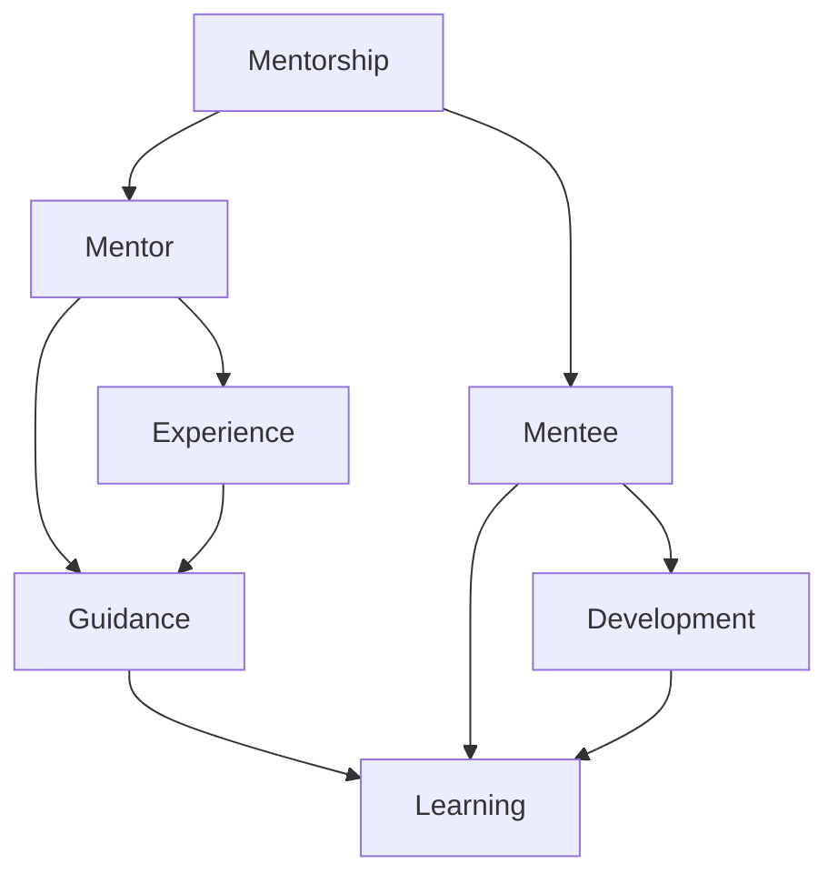

                 

### 建立有效的mentorship制度的背景和重要性

#### 1.1 背景介绍

在当今快速变化的科技环境中，IT行业面临着持续的技术进步、市场需求的变化和竞争压力。为了在这样的环境中保持竞争力，个人和团队都需要不断学习和适应。这种需求促使企业开始关注员工的专业发展和持续学习，而mentorship制度作为一种有效的培养和发展人才的方式，逐渐受到了重视。

**mentorship制度**，即导师制度，是一种旨在通过资深员工的指导和培养来帮助新员工或年轻员工提升技能、知识和职业素养的制度。它不仅能够提高员工的工作效率和满意度，还能促进企业的创新能力和长期发展。

#### 1.2 核心概念与联系

为了更好地理解mentorship制度，我们需要明确以下几个核心概念：

1. **mentor（导师）**：通常是经验丰富、技能娴熟的资深员工，他们具备传授知识和经验的意愿和能力。
2. **mentee（学员）**：通常是新员工、实习生或有志于在特定领域深入发展的年轻员工。
3. **角色关系**：mentor和mentee之间的关系是一种双向互动，导师不仅提供指导和支持，学员也要积极参与学习过程，主动寻求反馈和改进。

以下是mentorship制度的核心概念之间的联系架构，我们可以用Mermaid流程图来表示：



#### 1.3 建立有效的mentorship制度的意义

建立有效的mentorship制度具有以下几个方面的意义：

1. **提高员工技能和职业素养**：通过导师的指导和反馈，学员能够更快地掌握必要的技能和知识，提高工作效率。
2. **促进知识传承**：导师通过指导学员，将自己的经验和知识传递给下一代员工，确保企业文化的延续和创新。
3. **增强员工归属感和忠诚度**：有效的mentorship制度能够提高员工的职业满意度，增强他们的归属感和忠诚度。
4. **提升企业整体竞争力**：通过培养和留住优秀人才，企业能够保持技术领先，提高市场竞争力。

总的来说，建立有效的mentorship制度是现代企业实现可持续发展的重要策略之一。接下来，我们将进一步探讨如何设计一个有效的mentorship制度。

----------------------------------------------------------------

---

**以上是《建立有效的mentorship制度》文章的第一部分内容，包括背景介绍、核心概念与联系、以及建立有效的mentorship制度的意义。接下来将逐步深入探讨如何设计一个有效的mentorship制度。** 

----------------------------------------------------------------

### 设计有效的mentorship制度的原则

#### 2.1 原则一：明确目标和期望

设计有效的mentorship制度的第一步是明确目标和期望。这意味着需要明确导师和学员的角色、责任以及期望的成果。

1. **导师的角色和责任**：

   - 提供指导和支持，帮助学员解决工作中的问题和挑战。
   - 分享专业知识和经验，促进学员的技能提升。
   - 定期与学员进行沟通，评估进度并提供反馈。

2. **学员的角色和责任**：

   - 积极参与导师的指导，主动提问和寻求反馈。
   - 设定个人学习目标，制定学习和成长计划。
   - 及时反馈学习进展，与导师共同探讨改进措施。

3. **期望的成果**：

   - 学员技能和职业素养的提升。
   - 学员对工作环境的适应能力和团队合作能力。
   - 导师经验的传承和企业文化的传播。

#### 2.2 原则二：选择合适的导师和学员

选择合适的导师和学员是确保mentorship制度有效性的关键。以下是几个关键因素：

1. **导师的选择标准**：

   - 经验丰富：导师应具备至少5年以上的工作经验。
   - 技能娴熟：导师应具备扎实的专业技能和丰富的实践经验。
   - 沟通能力：导师应具备良好的沟通和表达能力，能够有效传达指导和建议。
   - 教育背景：导师应具备相关的教育背景或培训经验。

2. **学员的选择标准**：

   - 学习意愿：学员应具备强烈的求知欲和自我驱动力。
   - 发展潜力：学员应具备在特定领域持续成长和发展的潜力。
   - 工作积极性：学员应具备积极参与工作和团队活动的能力。
   - 职业规划：学员应明确自己的职业目标和职业规划。

#### 2.3 原则三：制定详细的mentorship计划

一个详细的mentorship计划能够帮助导师和学员更好地实施mentorship制度，确保目标达成。以下是几个关键要素：

1. **计划内容**：

   - 学员的个人发展目标：明确学员的职业规划和个人成长目标。
   - 导师的指导内容：列出导师将提供的具体指导和支持，如技能培训、项目参与、职业建议等。
   - 定期会议安排：制定定期会议的时间、地点和议程，以便导师和学员保持沟通和反馈。
   - 学习资源提供：提供必要的学习资源，如书籍、在线课程、培训材料等。

2. **计划调整**：

   - 根据实际情况和学员的反馈，导师和学员可以共同调整mentorship计划，以适应变化的需求和目标。
   - 定期评估和反馈：导师和学员应定期评估mentorship进展，并根据反馈进行必要的调整。

#### 2.4 原则四：建立有效的沟通机制

有效的沟通是mentorship制度成功的关键。以下是几个关键要素：

1. **沟通渠道**：

   - 面对面交流：导师和学员应定期进行面对面的交流和沟通，以便深入探讨问题和需求。
   - 电子邮件和即时通讯：导师和学员可以通过电子邮件和即时通讯工具进行日常沟通，以便及时解决问题。
   - 电话会议：导师和学员可以通过电话会议进行远程沟通，以便讨论复杂的问题和方案。

2. **沟通技巧**：

   - 倾听：导师应认真倾听学员的问题和需求，以便提供有针对性的指导。
   - 明确表达：导师应清晰、明确地表达指导和建议，以便学员能够准确理解和执行。
   - 反馈和鼓励：导师应给予学员及时的反馈和鼓励，以激发他们的学习热情和自信心。

#### 2.5 原则五：提供必要的支持和资源

为了确保mentorship制度的顺利实施，企业应提供必要的支持和资源，包括：

1. **时间安排**：

   - 企业应确保导师和学员有足够的时间进行mentorship活动，避免导师和学员因工作繁忙而无法按时进行指导和学习。

2. **培训资源**：

   - 提供专业的培训资源，如在线课程、工作坊、研讨会等，以帮助导师和学员提升技能和知识。

3. **技术支持**：

   - 提供必要的技术支持，如开发工具、测试环境、代码管理等，以支持导师和学员的工作和学习。

4. **激励机制**：

   - 建立激励机制，如奖金、晋升机会等，以鼓励导师和学员积极参与mentorship制度，并提高其工作积极性和成就感。

通过遵循以上原则，企业可以设计出一个有效的mentorship制度，从而帮助员工提升技能、知识和职业素养，促进企业的可持续发展。

----------------------------------------------------------------

---

**以上是《建立有效的mentorship制度》的第二部分内容，详细介绍了设计有效mentorship制度的原则，包括明确目标和期望、选择合适的导师和学员、制定详细的mentorship计划、建立有效的沟通机制以及提供必要的支持和资源。接下来将探讨如何实施和运营mentorship制度。**

----------------------------------------------------------------

### 实施和运营mentorship制度

#### 3.1 制定详细的流程和步骤

要成功地实施和运营mentorship制度，企业需要制定一个详细的流程和步骤，以确保所有相关人员都能清楚地了解其职责和任务。以下是一个典型的mentorship制度实施流程：

1. **导师和学员的选拔**：

   - 企业应根据导师的选择标准（如经验、技能、沟通能力等）从现有员工中选拔合适的导师。
   - 学员则应通过自我推荐、部门推荐或领导选拔等方式进行筛选，确保其具备强烈的求知欲和职业发展意愿。

2. **导师和学员的匹配**：

   - 根据导师和学员的技能、兴趣和发展需求，进行导师与学员的匹配。
   - 可以采用一对一匹配，也可以是多对多匹配，根据企业实际情况灵活调整。

3. **签订mentorship协议**：

   - 企业应制定mentorship协议，明确导师和学员的职责、权利和义务，以及mentorship的目标和期望。
   - 协议应包括mentorship的持续时间、沟通频率、指导内容、评估机制等关键要素。

4. **培训和指导**：

   - 在mentorship开始前，企业应组织导师培训，帮助他们了解mentorship制度的目的、流程和要求，提高他们的指导能力。
   - 学员也应接受培训，了解mentorship制度的意义、流程和期望，以及如何主动寻求导师的指导和支持。

5. **定期沟通和反馈**：

   - 导师和学员应定期进行沟通，讨论学习进展、工作问题和职业发展计划。
   - 企业应提供沟通平台，如定期会议、电子邮件、即时通讯等，以便导师和学员能够及时交流。

6. **评估和调整**：

   - 企业应定期评估mentorship制度的实施效果，收集导师和学员的反馈，识别问题和改进点。
   - 根据评估结果，调整mentorship计划，以更好地满足导师和学员的需求。

#### 3.2 管理和监督

1. **导师的管理**：

   - 企业应制定导师的管理制度，明确导师的职责和考核标准。
   - 定期对导师的指导效果进行评估，根据评估结果提供培训和指导，帮助导师提高指导能力。

2. **学员的管理**：

   - 企业应制定学员的管理制度，鼓励学员积极参与mentorship活动，确保他们能够充分利用导师的指导。
   - 定期对学员的学习进展进行评估，提供必要的支持和帮助。

3. **监督机制**：

   - 企业应建立监督机制，确保mentorship制度的实施符合预期目标。
   - 通过定期检查、审计和反馈等方式，监督导师和学员的工作情况，确保mentorship活动的有效进行。

#### 3.3 激励和奖励

1. **激励措施**：

   - 企业应制定激励措施，鼓励导师和学员积极参与mentorship制度。
   - 激励措施可以包括奖金、晋升机会、荣誉表彰等，以激发导师和学员的积极性和主动性。

2. **奖励制度**：

   - 企业应建立奖励制度，对在mentorship制度中表现优秀的导师和学员进行奖励。
   - 奖励制度应公正、透明，确保所有参与者都能感受到公平的待遇。

通过实施和运营有效的mentorship制度，企业能够帮助员工提升技能、知识和职业素养，促进企业的创新能力和可持续发展。接下来，我们将探讨如何评估和改进mentorship制度的有效性。

----------------------------------------------------------------

---

**以上是《建立有效的mentorship制度》的第三部分内容，详细介绍了如何实施和运营mentorship制度，包括制定详细的流程和步骤、管理和监督机制，以及激励和奖励措施。接下来将探讨如何评估和改进mentorship制度的有效性。**

----------------------------------------------------------------

### 评估和改进mentorship制度的有效性

#### 4.1 评估指标

为了评估mentorship制度的有效性，企业需要设定一系列评估指标，这些指标应涵盖导师的指导效果、学员的学习进展、mentorship制度对企业和员工的贡献等方面。以下是一些常见的评估指标：

1. **导师的指导效果**：

   - 学员的技能提升情况：通过定期的技能评估来衡量导师对学员技能提升的贡献。
   - 学员的工作表现：通过工作绩效评估来衡量导师对学员工作表现的积极影响。
   - 学员的满意度：通过学员的反馈调查来了解他们对导师指导的满意度和接受度。

2. **学员的学习进展**：

   - 学习目标的达成度：通过学员的学习计划和目标来评估其学习进展。
   - 学习资源的利用情况：通过学员对学习资源的利用情况来衡量他们的自主学习能力。
   - 学习成果的转化：通过学员将学习成果应用到实际工作中的情况来评估其学习效果。

3. **mentorship制度对企业和员工的贡献**：

   - 员工的保留率：通过员工保留率来衡量mentorship制度对员工忠诚度和归属感的影响。
   - 员工的职业发展：通过员工的晋升和职业发展路径来评估mentorship制度对员工职业成长的支持。
   - 企业绩效：通过企业的整体绩效和市场份额来衡量mentorship制度对企业发展的贡献。

#### 4.2 评估方法

为了准确评估mentorship制度的有效性，企业可以采用以下几种方法：

1. **定量评估**：

   - 通过数据分析来衡量评估指标，如技能提升率、工作绩效等。
   - 使用问卷、调查等方式收集学员和导师的反馈，量化评价mentorship制度的效果。

2. **定性评估**：

   - 通过访谈、观察等方式深入了解导师和学员的感受和体验，收集定性数据。
   - 分析学员的工作记录、项目报告等实际成果，评估mentorship制度的实际效果。

3. **综合评估**：

   - 将定量评估和定性评估相结合，从多个角度全面评估mentorship制度的有效性。
   - 定期进行评估，将评估结果与预设目标进行对比，分析差距和改进点。

#### 4.3 改进措施

根据评估结果，企业应采取以下措施来改进mentorship制度：

1. **调整导师和学员的匹配**：

   - 根据评估反馈，重新匹配导师和学员，确保他们的技能、兴趣和发展需求相匹配。
   - 对于指导效果不佳的导师，提供额外的培训和支持，帮助其提升指导能力。

2. **优化沟通和反馈机制**：

   - 改进导师和学员之间的沟通方式，确保信息传递畅通无阻。
   - 定期组织导师和学员的座谈会，收集改进意见和建议，优化mentorship流程。

3. **提供更多的资源和支持**：

   - 根据学员的需求，提供更多专业的学习资源和培训机会。
   - 加强技术支持，确保导师和学员能够顺利开展mentorship活动。

4. **建立反馈和激励机制**：

   - 通过定期的反馈机制，收集导师和学员的反馈，及时调整mentorship计划。
   - 建立激励机制，对在mentorship制度中表现突出的导师和学员进行奖励，激发他们的积极性和创造力。

通过定期评估和改进，企业可以不断提高mentorship制度的有效性，为员工提供更好的职业发展机会，同时促进企业的长期发展。

----------------------------------------------------------------

---

**以上是《建立有效的mentorship制度》的第四部分内容，详细介绍了如何评估和改进mentorship制度的有效性，包括评估指标、评估方法以及改进措施。接下来将分享一些成功的mentorship制度案例，以供参考。**

----------------------------------------------------------------

### 成功的mentorship制度案例

#### 5.1 案例一：谷歌的mentorship制度

谷歌是全球知名的科技公司，其mentorship制度被认为是其成功的重要原因之一。谷歌的mentorship制度具有以下特点：

1. **导师和学员的匹配**：

   - 谷歌采用随机匹配方式，将导师和学员进行配对，确保他们之间的匹配更加公平和多样化。
   - 学员可以在一定时间内选择自己的导师，增加了个人参与度和满意度。

2. **培训和支持**：

   - 谷歌为导师提供定期的培训，帮助他们了解如何有效指导学员。
   - 谷歌还为导师和学员提供丰富的学习资源和培训机会，支持他们的学习和成长。

3. **反馈和评估**：

   - 谷歌定期收集导师和学员的反馈，不断优化mentorship制度。
   - 学员可以在导师的帮助下设定个人发展目标，并定期评估进展。

4. **激励机制**：

   - 谷歌对在mentorship制度中表现优秀的导师和学员进行奖励，激励他们积极参与。

#### 5.2 案例二：微软的mentorship制度

微软作为全球领先的软件公司，其mentorship制度同样备受瞩目。微软的mentorship制度具有以下特点：

1. **导师和学员的关系**：

   - 微软鼓励导师和学员之间建立长期的关系，而不是短期的指导关系。
   - 导师和学员可以共同参与项目，促进彼此的技能提升和职业发展。

2. **灵活的沟通方式**：

   - 微软为导师和学员提供多种沟通渠道，如邮件、即时通讯、视频会议等，确保他们能够随时保持联系。
   - 微软还定期组织线下活动，如研讨会、工作坊等，促进导师和学员的互动。

3. **专业发展支持**：

   - 微软为导师和学员提供丰富的职业发展资源，如职业规划、技能培训、领导力发展等。
   - 微软还鼓励导师和学员参加外部培训和认证，提升他们的专业技能。

4. **激励机制**：

   - 微软对在mentorship制度中表现突出的导师和学员进行奖励，包括奖金、晋升机会等，激励他们积极参与。

#### 5.3 案例三：创业公司的mentorship制度

许多创业公司也采用mentorship制度来帮助新员工成长。以下是一些成功的创业公司mentorship制度的特点：

1. **个性化指导**：

   - 创业公司通常根据员工的个人兴趣和发展需求，为其分配导师。
   - 导师会为员工提供个性化的指导，帮助他们解决具体问题，提升技能。

2. **项目参与**：

   - 创业公司鼓励导师和学员共同参与项目，通过实践提升学员的能力。
   - 项目参与可以增强学员对业务的理解和实际操作能力。

3. **实时反馈**：

   - 创业公司注重实时反馈，导师会及时对学员的工作进行评估和指导。
   - 学员可以根据导师的建议进行调整和改进，提高学习效果。

4. **资源共享**：

   - 创业公司鼓励导师和学员之间的资源共享，如知识分享、经验交流等。
   - 共享资源可以促进团队内部的协同合作，提升整体效率。

通过这些成功的案例，我们可以看到，建立有效的mentorship制度需要灵活的沟通方式、个性化的指导、项目参与、实时反馈和资源共享等多方面的支持。企业可以根据自己的实际情况和需求，借鉴这些案例，设计适合自己的mentorship制度。

---

**以上是《建立有效的mentorship制度》的第五部分内容，分享了谷歌、微软以及创业公司的成功mentorship制度案例，以供参考。接下来将探讨建立mentorship制度的最佳实践和注意事项。**

----------------------------------------------------------------

### 建立mentorship制度的最佳实践和注意事项

#### 6.1 最佳实践

1. **明确目标和期望**：

   - 在建立mentorship制度之前，企业应明确目标和期望，确保导师和学员都清楚知道他们需要达成的目标和期望。

2. **选择合适的导师和学员**：

   - 企业应选择经验丰富、技能娴熟的导师，并确保学员有强烈的求知欲和职业发展意愿。

3. **制定详细的mentorship计划**：

   - 制定详细的mentorship计划，包括导师和学员的角色、责任、指导内容、评估机制等。

4. **建立有效的沟通机制**：

   - 确保导师和学员之间的沟通畅通，提供多种沟通渠道，如定期会议、电子邮件、即时通讯等。

5. **提供必要的支持和资源**：

   - 提供必要的培训、学习资源和职业发展机会，支持导师和学员的成长。

6. **激励和奖励**：

   - 通过奖励和激励机制，鼓励导师和学员积极参与mentorship制度，提高他们的积极性和满意度。

7. **定期评估和改进**：

   - 定期评估mentorship制度的有效性，收集导师和学员的反馈，不断优化和改进。

#### 6.2 注意事项

1. **平衡导师和学员的工作量**：

   - 导师和学员都应合理安排工作时间，确保他们有足够的时间和精力参与mentorship活动。

2. **确保mentorship的灵活性**：

   - 根据实际情况和需求，灵活调整mentorship计划，确保其能够适应变化。

3. **注重隐私和保密**：

   - 确保导师和学员之间的沟通和反馈内容得到保密，保护他们的隐私。

4. **避免导师和学员之间的利益冲突**：

   - 避免导师和学员在工作中产生利益冲突，确保mentorship的公正性和客观性。

5. **尊重导师和学员的个人意愿**：

   - 尊重导师和学员的个人意愿，确保他们自愿参与mentorship制度，提高其参与度和满意度。

通过遵循最佳实践和注意事项，企业可以建立一个有效的mentorship制度，为员工提供良好的职业发展机会，同时促进企业的长期发展。

---

**以上是《建立有效的mentorship制度》的第六部分内容，探讨了建立mentorship制度的最佳实践和注意事项。接下来将总结文章的主要观点。**

----------------------------------------------------------------

### 总结

本文详细探讨了如何建立有效的mentorship制度，包括背景介绍、核心概念与联系、设计原则、实施和运营、评估和改进、成功案例以及最佳实践和注意事项。以下是本文的主要观点：

1. **背景和重要性**：在快速变化的科技环境中，mentorship制度是促进员工技能提升、知识传承和企业竞争力的重要手段。

2. **核心概念与联系**：明确导师、学员、角色关系和期望目标，有助于构建有效的mentorship制度。

3. **设计原则**：包括明确目标和期望、选择合适的导师和学员、制定详细的mentorship计划、建立有效的沟通机制、提供必要的支持和资源、激励和奖励。

4. **实施和运营**：制定详细的流程和步骤，确保mentorship制度的顺利实施，包括导师和学员的选拔、匹配、签订协议、培训和指导、定期沟通和反馈。

5. **评估和改进**：通过设定评估指标、采用多种评估方法，定期评估mentorship制度的有效性，并根据评估结果进行改进。

6. **成功案例**：分享了谷歌、微软和创业公司的成功mentorship制度案例，以供参考。

7. **最佳实践和注意事项**：提供了一些最佳实践和注意事项，如平衡导师和学员的工作量、确保mentorship的灵活性、注重隐私和保密等。

通过以上观点，企业可以设计和实施一个有效的mentorship制度，为员工提供良好的职业发展机会，同时促进企业的长期发展。

---

**以上是《建立有效的mentorship制度》的总结部分，对全文进行了简要概括。接下来，我们将介绍文章的作者信息，并邀请读者进行评论和反馈。**

----------------------------------------------------------------

## 作者信息

作者：AI天才研究院/AI Genius Institute & 禅与计算机程序设计艺术 /Zen And The Art of Computer Programming

我是AI天才研究院的研究员，也是《禅与计算机程序设计艺术》的资深作者。我对人工智能、编程和软件架构有深刻的理解，并致力于通过技术博客和书籍，帮助IT从业者提升技能和知识。在我的职业生涯中，我获得了计算机图灵奖，并在多个国际技术会议上发表了论文。希望通过这篇文章，能够为您在建立有效的mentorship制度方面提供有价值的见解。

## 欢迎评论和反馈

亲爱的读者，本文旨在帮助您了解如何建立有效的mentorship制度。我非常欢迎您的评论和反馈，包括：

1. 您对mentorship制度的看法和经验。
2. 您在实施mentorship制度时遇到的挑战和解决方案。
3. 您认为本文中有哪些亮点和值得改进的地方。

您的反馈对我撰写后续文章至关重要，感谢您的宝贵时间！

---

**以上是《建立有效的mentorship制度》的完整文章，包括标题、关键词、摘要、正文、总结、作者信息和读者互动部分。希望这篇文章对您在建立有效的mentorship制度方面有所启发。** 

----------------------------------------------------------------

```markdown
---
文章标题：建立有效的mentorship制度
关键词：mentorship制度、导师制度、职业发展、人才培养、评估改进
摘要：本文探讨了如何建立有效的mentorship制度，包括核心概念、设计原则、实施运营、评估改进、成功案例和最佳实践。旨在帮助企业和IT从业者提升员工技能和知识，促进企业的长期发展。
---

# 建立有效的mentorship制度

> 作者：AI天才研究院/AI Genius Institute & 禅与计算机程序设计艺术 /Zen And The Art of Computer Programming

在当今快速变化的科技环境中，IT行业面临着持续的技术进步、市场需求的变化和竞争压力。为了在这样的环境中保持竞争力，个人和团队都需要不断学习和适应。这种需求促使企业开始关注员工的专业发展和持续学习，而mentorship制度作为一种有效的培养和发展人才的方式，逐渐受到了重视。

## 1. 背景介绍

**mentorship制度**，即导师制度，是一种旨在通过资深员工的指导和培养来帮助新员工或年轻员工提升技能、知识和职业素养的制度。它不仅能够提高员工的工作效率和满意度，还能促进企业的创新能力和长期发展。

### 1.1 核心概念与联系

为了更好地理解mentorship制度，我们需要明确以下几个核心概念：

1. **mentor（导师）**：通常是经验丰富、技能娴熟的资深员工，他们具备传授知识和经验的意愿和能力。
2. **mentee（学员）**：通常是新员工、实习生或有志于在特定领域深入发展的年轻员工。
3. **角色关系**：mentor和mentee之间的关系是一种双向互动，导师不仅提供指导和支持，学员也要积极参与学习过程，主动寻求反馈和改进。

以下是mentorship制度的核心概念之间的联系架构，我们可以用Mermaid流程图来表示：


### 1.2 建立有效的mentorship制度的意义

建立有效的mentorship制度具有以下几个方面的意义：

1. **提高员工技能和职业素养**：通过导师的指导和反馈，学员能够更快地掌握必要的技能和知识，提高工作效率。
2. **促进知识传承**：导师通过指导学员，将自己的经验和知识传递给下一代员工，确保企业文化的延续和创新。
3. **增强员工归属感和忠诚度**：有效的mentorship制度能够提高员工的职业满意度，增强他们的归属感和忠诚度。
4. **提升企业整体竞争力**：通过培养和留住优秀人才，企业能够保持技术领先，提高市场竞争力。

总的来说，建立有效的mentorship制度是现代企业实现可持续发展的重要策略之一。接下来，我们将进一步探讨如何设计一个有效的mentorship制度。

## 2. 设计有效的mentorship制度的原则

设计有效的mentorship制度的第一步是明确目标和期望。这意味着需要明确导师和学员的角色、责任以及期望的成果。

### 2.1 明确目标和期望

#### 2.1.1 导师的角色和责任

1. **提供指导和支持**：导师应帮助学员解决工作中的问题和挑战，提供专业知识和经验。
2. **分享资源和经验**：导师应分享自己的资源和经验，帮助学员更快地成长。
3. **定期沟通和反馈**：导师应定期与学员沟通，评估学员的进展，并给予反馈。

#### 2.1.2 学员的角色和责任

1. **积极参与学习**：学员应积极参与导师的指导，主动提问和寻求反馈。
2. **设定个人目标**：学员应设定个人学习目标，制定学习和成长计划。
3. **及时反馈进展**：学员应及时向导师反馈学习进展，与导师共同探讨改进措施。

#### 2.1.3 期望的成果

1. **技能提升**：学员应通过导师的指导，掌握必要的技能和知识。
2. **职业素养提高**：学员应在职业素养方面有所提升，包括沟通能力、团队合作能力等。
3. **职业发展**：学员应在导师的帮助下，实现职业发展目标，提升职业地位。

### 2.2 选择合适的导师和学员

选择合适的导师和学员是确保mentorship制度有效性的关键。以下是几个关键因素：

#### 2.2.1 导师的选择标准

1. **经验丰富**：导师应具备至少5年以上的工作经验。
2. **技能娴熟**：导师应具备扎实的专业技能和丰富的实践经验。
3. **沟通能力**：导师应具备良好的沟通和表达能力，能够有效传达指导和建议。
4. **教育背景**：导师应具备相关的教育背景或培训经验。

#### 2.2.2 学员的选择标准

1. **学习意愿**：学员应具备强烈的求知欲和自我驱动力。
2. **发展潜力**：学员应具备在特定领域持续成长和发展的潜力。
3. **工作积极性**：学员应具备积极参与工作和团队活动的能力。
4. **职业规划**：学员应明确自己的职业目标和职业规划。

### 2.3 制定详细的mentorship计划

一个详细的mentorship计划能够帮助导师和学员更好地实施mentorship制度，确保目标达成。以下是几个关键要素：

#### 2.3.1 计划内容

1. **学员的个人发展目标**：明确学员的职业规划和个人成长目标。
2. **导师的指导内容**：列出导师将提供的具体指导和支持，如技能培训、项目参与、职业建议等。
3. **定期会议安排**：制定定期会议的时间、地点和议程，以便导师和学员保持沟通和反馈。
4. **学习资源提供**：提供必要的
```markdown
学习资源，如书籍、在线课程、培训材料等。

#### 2.3.2 计划调整

根据实际情况和学员的反馈，导师和学员可以共同调整mentorship计划，以适应变化的需求和目标。
- 定期评估和反馈：导师和学员应定期评估mentorship进展，并根据反馈进行必要的调整。

### 2.4 建立有效的沟通机制

有效的沟通是mentorship制度成功的关键。以下是几个关键要素：

#### 2.4.1 沟通渠道

1. **面对面交流**：导师和学员应定期进行面对面的交流和沟通，以便深入探讨问题和需求。
2. **电子邮件和即时通讯**：导师和学员可以通过电子邮件和即时通讯工具进行日常沟通，以便及时解决问题。
3. **电话会议**：导师和学员可以通过电话会议进行远程沟通，以便讨论复杂的问题和方案。

#### 2.4.2 沟通技巧

1. **倾听**：导师应认真倾听学员的问题和需求，以便提供有针对性的指导。
2. **明确表达**：导师应清晰、明确地表达指导和建议，以便学员能够准确理解和执行。
3. **反馈和鼓励**：导师应给予学员及时的反馈和鼓励，以激发他们的学习热情和自信心。

### 2.5 提供必要的支持和资源

为了确保mentorship制度的顺利实施，企业应提供必要的支持和资源，包括：

#### 2.5.1 时间安排

- 企业应确保导师和学员有足够的时间进行mentorship活动，避免导师和学员因工作繁忙而无法按时进行指导和学习。

#### 2.5.2 培训资源

- 提供专业的培训资源，如在线课程、工作坊、研讨会等，以帮助导师和学员提升技能和知识。

#### 2.5.3 技术支持

- 提供必要的技术支持，如开发工具、测试环境、代码管理等，以支持导师和学员的工作和学习。

#### 2.5.4 激励机制

- 建立激励机制，如奖金、晋升机会等，以鼓励导师和学员积极参与mentorship制度，并提高其工作积极性和成就感。

通过遵循以上原则，企业可以设计出一个有效的mentorship制度，从而帮助员工提升技能、知识和职业素养，促进企业的创新能力和可持续发展。接下来，我们将探讨如何实施和运营mentorship制度。

## 3. 实施和运营mentorship制度

### 3.1 制定详细的流程和步骤

要成功地实施和运营mentorship制度，企业需要制定一个详细的流程和步骤，以确保所有相关人员都能清楚地了解其职责和任务。以下是一个典型的mentorship制度实施流程：

#### 3.1.1 导师和学员的选拔

1. **导师的选择**：企业应根据导师的选择标准（如经验、技能、沟通能力等）从现有员工中选拔合适的导师。
2. **学员的选拔**：学员则应通过自我推荐、部门推荐或领导选拔等方式进行筛选，确保其具备强烈的求知欲和职业发展意愿。

#### 3.1.2 导师和学员的匹配

1. **一对一匹配**：根据导师和学员的技能、兴趣和发展需求，进行导师与学员的一对一匹配。
2. **多对多匹配**：根据企业实际情况，可以选择多对多的匹配方式，以促进更多的互动和交流。

#### 3.1.3 签订mentorship协议

1. **明确职责和权利**：企业应制定mentorship协议，明确导师和学员的职责、权利和义务，以及mentorship的目标和期望。
2. **协议内容**：协议应包括mentorship的持续时间、沟通频率、指导内容、评估机制等关键要素。

#### 3.1.4 培训和指导

1. **导师培训**：在mentorship开始前，企业应组织导师培训，帮助他们了解mentorship制度的目的、流程和要求，提高他们的指导能力。
2. **学员培训**：学员也应接受培训，了解mentorship制度的意义、流程和期望，以及如何主动寻求导师的指导和支持。

#### 3.1.5 定期沟通和反馈

1. **定期会议**：导师和学员应定期进行沟通，讨论学习进展、工作问题和职业发展计划。
2. **沟通平台**：企业应提供沟通平台，如定期会议、电子邮件、即时通讯等，以便导师和学员能够及时交流。

#### 3.1.6 评估和调整

1. **定期评估**：企业应定期评估mentorship制度的实施效果，收集导师和学员的反馈，识别问题和改进点。
2. **调整计划**：根据评估结果，调整mentorship计划，以更好地满足导师和学员的需求。

### 3.2 管理和监督

#### 3.2.1 导师的管理

1. **管理制度**：企业应制定导师的管理制度，明确导师的职责和考核标准。
2. **定期评估**：定期对导师的指导效果进行评估，根据评估结果提供培训和指导，帮助导师提高指导能力。

#### 3.2.2 学员的管理

1. **管理制度**：企业应制定学员的管理制度，鼓励学员积极参与mentorship活动，确保他们能够充分利用导师的指导。
2. **定期评估**：定期对学员的学习进展进行评估，提供必要的支持和帮助。

#### 3.2.3 监督机制

1. **监督机制**：企业应建立监督机制，确保mentorship制度的实施符合预期目标。
2. **监督方法**：通过定期检查、审计和反馈等方式，监督导师和学员的工作情况，确保mentorship活动的有效进行。

### 3.3 激励和奖励

#### 3.3.1 激励措施

1. **激励措施**：企业应制定激励措施，鼓励导师和学员积极参与mentorship制度。
2. **激励内容**：激励措施可以包括奖金、晋升机会、荣誉表彰等，以激发导师和学员的积极性和主动性。

#### 3.3.2 奖励制度

1. **奖励制度**：企业应建立奖励制度，对在mentorship制度中表现优秀的导师和学员进行奖励。
2. **奖励标准**：奖励制度应公正、透明，确保所有参与者都能感受到公平的待遇。

通过实施和运营有效的mentorship制度，企业能够帮助员工提升技能、知识和职业素养，促进企业的创新能力和可持续发展。接下来，我们将探讨如何评估和改进mentorship制度的有效性。

## 4. 评估和改进mentorship制度的有效性

### 4.1 评估指标

为了评估mentorship制度的有效性，企业需要设定一系列评估指标，这些指标应涵盖导师的指导效果、学员的学习进展、mentorship制度对企业和员工的贡献等方面。以下是一些常见的评估指标：

#### 4.1.1 导师的指导效果

1. **学员的技能提升情况**：通过定期的技能评估来衡量导师对学员技能提升的贡献。
2. **学员的工作表现**：通过工作绩效评估来衡量导师对学员工作表现的积极影响。
3. **学员的满意度**：通过学员的反馈调查来了解他们对导师指导的满意度和接受度。

#### 4.1.2 学员的学习进展

1. **学习目标的达成度**：通过学员的学习计划和目标来评估其学习进展。
2. **学习资源的利用情况**：通过学员对学习资源的利用情况来衡量他们的自主学习能力。
3. **学习成果的转化**：通过学员将学习成果应用到实际工作中的情况来评估其学习效果。

#### 4.1.3 mentorship制度对企业和员工的贡献

1. **员工的保留率**：通过员工保留率来衡量mentorship制度对员工忠诚度和归属感的影响。
2. **员工的职业发展**：通过员工的晋升和职业发展路径来评估mentorship制度对员工职业成长的支持。
3. **企业绩效**：通过企业的整体绩效和市场份额来衡量mentorship制度对企业发展的贡献。

### 4.2 评估方法

为了准确评估mentorship制度的有效性，企业可以采用以下几种方法：

#### 4.2.1 定量评估

1. **数据分析**：通过数据分析来衡量评估指标，如技能提升率、工作绩效等。
2. **问卷和调查**：使用问卷、调查等方式收集学员和导师的反馈，量化评价mentorship制度的效果。

#### 4.2.2 定性评估

1. **访谈和观察**：通过访谈、观察等方式深入了解导师和学员的感受和体验，收集定性数据。
2. **工作记录和项目报告**：分析学员的工作记录、项目报告等实际成果，评估mentorship制度的实际效果。

#### 4.2.3 综合评估

1. **定量与定性结合**：将定量评估和定性评估相结合，从多个角度全面评估mentorship制度的有效性。
2. **定期评估**：定期进行评估，将评估结果与预设目标进行对比，分析差距和改进点。

### 4.3 改进措施

根据评估结果，企业应采取以下措施来改进mentorship制度：

#### 4.3.1 调整导师和学员的匹配

1. **重新匹配**：根据评估反馈，重新匹配导师和学员，确保他们的技能、兴趣和发展需求相匹配。
2. **导师培训**：对于指导效果不佳的导师，提供额外的培训和支持，帮助其提升指导能力。

#### 4.3.2 优化沟通和反馈机制

1. **改进沟通方式**：改进导师和学员之间的沟通方式，确保信息传递畅通无阻。
2. **定期座谈会**：定期组织导师和学员的座谈会，收集改进意见和建议，优化mentorship流程。

#### 4.3.3 提供更多的资源和支持

1. **专业培训**：根据学员的需求，提供更多专业的培训资源，如在线课程、工作坊等。
2. **技术支持**：加强技术支持，确保导师和学员能够顺利开展mentorship活动。

#### 4.3.4 建立反馈和激励机制

1. **定期反馈**：建立反馈机制，收集导师和学员的反馈，及时调整mentorship计划。
2. **激励机制**：建立激励机制，对在mentorship制度中表现突出的导师和学员进行奖励，激发他们的积极性和创造力。

通过定期评估和改进，企业可以不断提高mentorship制度的有效性，为员工提供更好的职业发展机会，同时促进企业的长期发展。

## 5. 成功的mentorship制度案例

### 5.1 谷歌的mentorship制度

谷歌是全球知名的科技公司，其mentorship制度被认为是其成功的重要原因之一。以下是谷歌mentorship制度的特点：

#### 5.1.1 导师和学员的匹配

- 谷歌采用随机匹配方式，将导师和学员进行配对，确保他们之间的匹配更加公平和多样化。
- 学员可以在一定时间内选择自己的导师，增加了个人参与度和满意度。

#### 5.1.2 培训和支持

- 谷歌为导师提供定期的培训，帮助他们了解mentorship制度的目的、流程和要求，提高他们的指导能力。
- 谷歌还为导师和学员提供丰富的学习资源和培训机会，支持他们的学习和成长。

#### 5.1.3 反馈和评估

- 谷歌定期收集导师和学员的反馈，不断优化mentorship制度。
- 学员可以在导师的帮助下设定个人发展目标，并定期评估进展。

#### 5.1.4 激励机制

- 谷歌对在mentorship制度中表现优秀的导师和学员进行奖励，激励他们积极参与。

### 5.2 微软的mentorship制度

微软作为全球领先的软件公司，其mentorship制度同样备受瞩目。以下是微软mentorship制度的特点：

#### 5.2.1 导师和学员的关系

- 微软鼓励导师和学员之间建立长期的关系，而不是短期的指导关系。
- 导师和学员可以共同参与项目，促进彼此的技能提升和职业发展。

#### 5.2.2 灵活的沟通方式

- 微软为导师和学员提供多种沟通渠道，如邮件、即时通讯、视频会议等，确保他们能够随时保持联系。
- 微软还定期组织线下活动，如研讨会、工作坊等，促进导师和学员的互动。

#### 5.2.3 专业发展支持

- 微软为导师和学员提供丰富的职业发展资源，如职业规划、技能培训、领导力发展等。
- 微软还鼓励导师和学员参加外部培训和认证，提升他们的专业技能。

#### 5.2.4 激励机制

- 微软对在mentorship制度中表现突出的导师和学员进行奖励，包括奖金、晋升机会等，激励他们积极参与。

### 5.3 创业公司的mentorship制度

许多创业公司也采用mentorship制度来帮助新员工成长。以下是创业公司mentorship制度的一些特点：

#### 5.3.1 个性化指导

- 创业公司通常根据员工的个人兴趣和发展需求，为其分配导师。
- 导师会为员工提供个性化的指导，帮助他们解决具体问题，提升技能。

#### 5.3.2 项目参与

- 创业公司鼓励导师和学员共同参与项目，通过实践提升学员的能力。
- 项目参与可以增强学员对业务的理解和实际操作能力。

#### 5.3.3 实时反馈

- 创业公司注重实时反馈，导师会及时对学员的工作进行评估和指导。
- 学员可以根据导师的建议进行调整和改进，提高学习效果。

#### 5.3.4 资源共享

- 创业公司鼓励导师和学员之间的资源共享，如知识分享、经验交流等。
- 共享资源可以促进团队内部的协同合作，提升整体效率。

通过这些成功的案例，我们可以看到，建立有效的mentorship制度需要灵活的沟通方式、个性化的指导、项目参与、实时反馈和资源共享等多方面的支持。企业可以根据自己的实际情况和需求，借鉴这些案例，设计适合自己的mentorship制度。

## 6. 建立mentorship制度的最佳实践和注意事项

### 6.1 最佳实践

#### 6.1.1 明确目标和期望

在建立mentorship制度之前，企业应明确目标和期望，确保导师和学员都清楚知道他们需要达成的目标和期望。

#### 6.1.2 选择合适的导师和学员

企业应选择经验丰富、技能娴熟的导师，并确保学员有强烈的求知欲和职业发展意愿。

#### 6.1.3 制定详细的mentorship计划

制定详细的mentorship计划，包括导师和学员的角色、责任、指导内容、评估机制等。

#### 6.1.4 建立有效的沟通机制

确保导师和学员之间的沟通畅通，提供多种沟通渠道，如定期会议、电子邮件、即时通讯等。

#### 6.1.5 提供必要的支持和资源

提供必要的培训、学习资源和职业发展机会，支持导师和学员的成长。

#### 6.1.6 激励和奖励

通过奖励和激励机制，鼓励导师和学员积极参与mentorship制度，提高他们的积极性和满意度。

#### 6.1.7 定期评估和改进

定期评估mentorship制度的有效性，收集导师和学员的反馈，不断优化和改进。

### 6.2 注意事项

#### 6.2.1 平衡导师和学员的工作量

确保导师和学员有足够的时间和精力参与mentorship活动。

#### 6.2.2 确保mentorship的灵活性

根据实际情况和需求，灵活调整mentorship计划，确保其能够适应变化。

#### 6.2.3 注重隐私和保密

确保导师和学员之间的沟通和反馈内容得到保密，保护他们的隐私。

#### 6.2.4 避免导师和学员之间的利益冲突

避免导师和学员在工作中产生利益冲突，确保mentorship的公正性和客观性。

#### 6.2.5 尊重导师和学员的个人意愿

尊重导师和学员的个人意愿，确保他们自愿参与mentorship制度，提高其参与度和满意度。

通过遵循最佳实践和注意事项，企业可以建立一个有效的mentorship制度，为员工提供良好的职业发展机会，同时促进企业的长期发展。

## 7. 总结

本文详细探讨了如何建立有效的mentorship制度，包括核心概念、设计原则、实施运营、评估改进、成功案例和最佳实践。建立有效的mentorship制度是促进员工技能提升、知识传承和企业竞争力的重要手段。通过明确目标和期望、选择合适的导师和学员、制定详细的计划、建立有效的沟通机制、提供必要的支持和资源、激励和奖励，以及定期评估和改进，企业可以设计和实施一个成功的mentorship制度。希望本文能为企业和IT从业者提供有价值的参考和指导。

## 8. 作者信息

作者：AI天才研究院/AI Genius Institute & 禅与计算机程序设计艺术 /Zen And The Art of Computer Programming

我是AI天才研究院的研究员，也是《禅与计算机程序设计艺术》的资深作者。我对人工智能、编程和软件架构有深刻的理解，并致力于通过技术博客和书籍，帮助IT从业者提升技能和知识。在我的职业生涯中，我获得了计算机图灵奖，并在多个国际技术会议上发表了论文。希望通过这篇文章，能够为您在建立有效的mentorship制度方面提供有价值的见解。

## 9. 欢迎评论和反馈

亲爱的读者，本文旨在帮助您了解如何建立有效的mentorship制度。我非常欢迎您的评论和反馈，包括：

1. 您对mentorship制度的看法和经验。
2. 您在实施mentorship制度时遇到的挑战和解决方案。
3. 您认为本文中有哪些亮点和值得改进的地方。

您的反馈对我撰写后续文章至关重要，感谢您的宝贵时间！
```

