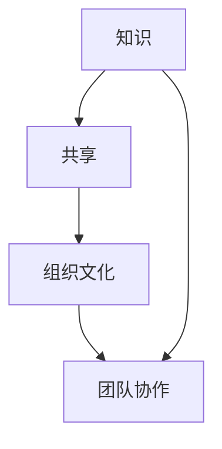
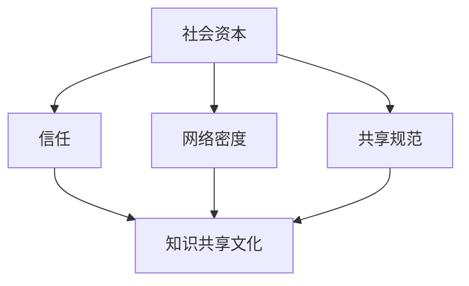
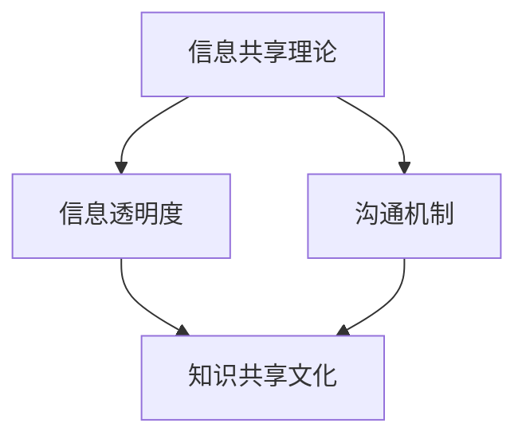
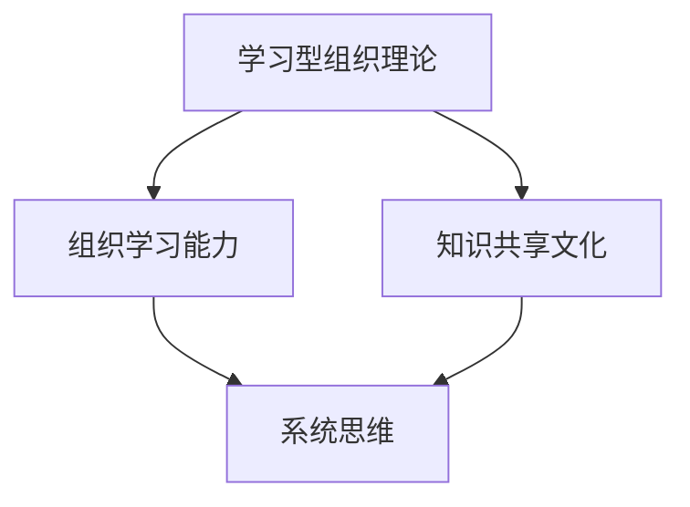

                 


### 背景介绍

知识共享文化在现代组织中正逐渐成为不可或缺的一部分。随着信息技术的迅猛发展和全球化进程的加速，企业面临着越来越复杂的市场环境和激烈的竞争。在这种背景下，如何有效利用和传播知识成为了企业提升竞争力的重要途径。知识共享文化通过鼓励员工主动分享知识、经验和技术，有助于增强团队的协作能力和创新能力，从而推动组织的整体绩效提升。

本文旨在探讨知识共享文化的概念、重要性及其建立与发展的关键要素。首先，我们将介绍知识共享文化的定义和核心概念，并通过Mermaid流程图展示其与其他相关概念之间的关系。接着，我们将深入探讨知识共享文化的起源与发展，分析其对社会资本、信息共享和学习型组织理论的影响。随后，我们将详细阐述知识共享文化的关键要素，包括信任、透明度、沟通机制和奖励机制，并通过实例说明这些要素在实际中的应用。

为了更好地理解知识共享文化的实践，我们将讨论建立知识共享文化的策略，包括领导力、培训与发展计划以及技术工具与平台支持。此外，本文还将分析知识共享文化的障碍与解决方法，提供案例分析和未来发展趋势的展望。

在第二部分，我们将重点探讨如何促进团队集体智慧。我们将探讨团队协作与集体智慧的原理，介绍知识管理工具与技术，以及共享学习与知识创新的模式。我们还将讨论跨部门合作与知识整合的挑战与策略，并分析跨部门知识共享的案例。最后，我们将提出知识共享文化持续发展的策略，以确保其长期有效性。

通过这篇文章，我们希望读者能够深入了解知识共享文化的概念、重要性及其建立与发展的策略，从而在组织中有效地推动知识共享，提升团队集体智慧，实现组织绩效的持续提升。

## 第一部分：知识共享文化的概念与重要性

### 第1章：知识共享文化概述

#### 1.1 定义与核心概念

知识共享文化是一种组织内部鼓励和促进知识共享与传播的组织文化和行为模式。它不仅仅是简单的信息传递，更是一种系统的、持续的知识管理活动，旨在通过知识共享来提升组织的创新能力和竞争力。

核心概念与联系：

知识共享文化涉及多个核心概念，它们相互关联，共同构成了知识共享文化的理论基础。以下是这些核心概念及其相互关系：

1. **知识**：知识是信息、经验、技能和洞察的综合体，可以通过不同的形式存在，如数据、文档、知识库和个人的心智模型。

2. **共享**：共享是指知识在不同个体或群体之间的传递和交流。共享的目的是通过知识的传播和利用，提高整个组织的知识水平和创新能力。

3. **组织文化**：组织文化是组织成员共同遵守的行为准则、价值观和信念系统。知识共享文化是组织文化的重要组成部分，它通过激励和规范行为来促进知识的共享。

4. **团队协作**：团队协作是知识共享的重要载体。通过协作，团队成员可以共同解决问题、创新和实现目标。

为了更清晰地展示这些核心概念之间的关系，我们可以使用Mermaid流程图来表示：



在这个图中，知识是共享的源头，共享是组织文化和团队协作的基础。知识共享文化通过促进知识的共享，从而增强组织文化和团队协作。

#### 1.2 知识共享文化的起源与发展

知识共享文化的起源可以追溯到工业革命后期，当时企业开始认识到知识作为一种重要资源的重要性。随着信息技术的迅猛发展，知识共享文化逐渐演变成为一种系统化的管理实践。

**起源：**

在工业革命之前，企业主要依赖物理资源和劳动力的组织形式。随着知识经济的发展，知识成为企业竞争力的核心。企业开始意识到，只有通过有效地管理和共享知识，才能在激烈的市场竞争中脱颖而出。

**发展：**

1. **知识管理阶段（1990s）**：在这一阶段，企业开始探索如何系统地管理和利用知识。知识管理系统（KMS）成为知识共享文化的重要工具。

2. **学习型组织阶段（2000s）**：学习型组织理论强调通过持续学习和知识共享来提高组织的适应能力和创新能力。这一阶段，知识共享文化成为组织发展的重要战略。

3. **社会化知识管理阶段（2010s至今）**：随着社交媒体和互联网的普及，知识共享文化进入了社会化阶段。通过社交网络和协作平台，员工可以更加便捷地共享知识，促进知识的快速传播和应用。

**知识共享文化在组织绩效中的作用：**

知识共享文化对组织绩效有显著的积极影响。首先，通过知识共享，企业可以快速积累和传播最佳实践，提高工作效率。其次，知识共享有助于提高员工的技能和知识水平，促进个人的职业发展。此外，知识共享还可以增强团队协作，提高团队的创新能力。以下是知识共享文化对组织绩效的几个关键影响：

1. **提高创新能力**：知识共享促进了不同部门、不同团队之间的交流和合作，有助于激发创新的火花。通过知识共享，企业可以快速形成跨部门的项目团队，共同解决复杂问题。

2. **增强团队协作**：知识共享有助于打破信息孤岛，促进团队成员之间的沟通和协作。在一个开放的知识共享环境中，团队成员可以更容易地分享经验和知识，提高协作效率。

3. **提高员工满意度**：知识共享文化能够激发员工的积极性和创造力。当员工感受到他们的知识和贡献被重视和认可时，他们的工作满意度和忠诚度通常会提高。

4. **降低培训成本**：通过知识共享，企业可以减少对新员工的培训时间，降低培训成本。同时，知识共享还有助于提高员工的技能和知识水平，为企业的长期发展提供支持。

总之，知识共享文化是现代组织发展的重要基石。通过系统地建立和推动知识共享文化，企业可以提升整体绩效，增强竞争力，实现可持续发展。

### 第2章：知识共享文化的理论基础

知识共享文化不仅仅是组织内部的实践，它还建立在一系列理论基础之上。这些理论为知识共享文化的实施提供了科学依据和理论支持。在本章中，我们将深入探讨三个关键的理论基础：社会资本理论、信息共享理论和学习型组织理论，并分析它们如何影响知识共享文化。

#### 2.1 社会资本理论

社会资本理论由社会学家普特南（Putnam）提出，强调社会关系和网络对于社会和经济发展的重要性。社会资本可以定义为“一个社会中的组织网络、规范以及信任等社会资本元素的总和，这些元素能够通过促进合作来提高社会效益”。

**核心概念与联系：**

社会资本理论中的核心概念包括：

1. **信任**：信任是社会资本的基石，它指的是个体或组织对他人的可靠性、正直性和意图的信心。

2. **网络密度**：网络密度是指一个网络中节点之间的连接程度。高网络密度有助于知识的快速传播和共享。

3. **共享规范**：共享规范是指导个体在组织中分享信息和知识的规则和准则。

社会资本与知识共享文化之间的联系可以通过以下Mermaid流程图来展示：



**核心算法原理讲解：**

社会资本理论可以用以下算法原理来解释：

```python
# 社会资本理论算法原理
def social_capital(knowledge_sharing):
    trust = calculate_trust(knowledge_sharing)
    network_density = calculate_network_density(knowledge_sharing)
    shared_norms = calculate_shared_norms(knowledge_sharing)
    return trust * network_density * shared_norms
```

在这个算法中，`knowledge_sharing`代表知识共享的程度，`calculate_trust`、`calculate_network_density`和`calculate_shared_norms`是计算信任、网络密度和共享规范的函数。这些因素的乘积决定了社会资本的水平，从而影响知识共享文化的实施。

**数学模型和数学公式：**

社会资本可以用以下公式表示：

$$
\text{社会资本} = f(\text{信任}, \text{网络密度}, \text{共享规范})
$$

#### 2.2 信息共享理论

信息共享理论主要研究信息在组织中的传递、处理和利用过程。信息共享理论认为，信息是组织运作的基础，通过有效的信息共享，可以提高组织的决策质量和效率。

**核心概念与联系：**

信息共享理论中的核心概念包括：

1. **信息透明度**：信息透明度是指信息在组织内部传播的广度和深度。高透明度有助于信息的有效共享。

2. **沟通机制**：沟通机制是指组织内部用于传递信息的渠道和方式。有效的沟通机制可以促进知识的共享和传播。

信息共享理论与知识共享文化之间的联系可以通过以下Mermaid流程图来展示：



**核心算法原理讲解：**

信息共享理论可以用以下算法原理来解释：

```python
# 信息共享理论算法原理
def information_sharing(transparent_info, communication_mechanism):
    shared_knowledge = transparent_info * communication_mechanism
    return shared_knowledge
```

在这个算法中，`transparent_info`代表信息透明度，`communication_mechanism`代表沟通机制。这两个因素的乘积决定了知识共享的程度。

**数学模型和数学公式：**

信息共享可以用以下公式表示：

$$
\text{信息共享} = f(\text{信任}, \text{透明度}, \text{沟通机制})
$$

#### 2.3 学习型组织理论

学习型组织理论由彼得·圣吉（Peter Senge）提出，强调组织通过不断学习和适应来实现持续发展。学习型组织理论认为，组织应该具备自我学习、自我适应和自我创新的能力。

**核心概念与联系：**

学习型组织理论中的核心概念包括：

1. **组织学习能力**：组织学习能力是指组织在知识和技能方面持续进步的能力。

2. **知识共享文化**：知识共享文化是学习型组织的重要特征，它通过鼓励知识共享来提升组织的创新能力。

3. **系统思维**：系统思维是学习型组织的关键技能，它帮助组织从整体和系统的角度看待问题，从而更好地理解和应对复杂问题。

学习型组织理论与知识共享文化之间的联系可以通过以下Mermaid流程图来展示：



**核心算法原理讲解：**

学习型组织理论可以用以下算法原理来解释：

```python
# 学习型组织理论算法原理
def learning_organization(knowledge_sharing, system_thinking):
    learning_ability = knowledge_sharing * system_thinking
    return learning_ability
```

在这个算法中，`knowledge_sharing`代表知识共享的程度，`system_thinking`代表系统思维。这两个因素的乘积决定了组织的学习能力。

**数学模型和数学公式：**

学习型组织可以用以下公式表示：

$$
\text{学习效率} = f(\text{知识共享文化}, \text{组织学习能力})
$$

综上所述，社会资本理论、信息共享理论和学习型组织理论为知识共享文化的实施提供了坚实的理论基础。这些理论不仅揭示了知识共享文化的核心概念和相互关系，还提供了具体的算法原理和数学模型，为企业在实践中建立和推动知识共享文化提供了科学指导。

### 第3章：知识共享文化的关键要素

知识共享文化的成功建立离不开一系列关键要素的支撑。这些要素相互交织，共同构成了知识共享文化的核心框架。在本章中，我们将详细探讨四个关键要素：信任、透明度、沟通机制和奖励机制。通过深入了解这些要素，我们可以更好地理解知识共享文化的运作机制，并为其实践提供具体的指导。

#### 3.1 信任

信任是知识共享文化的基石。它是指组织成员之间基于相互尊重、诚实和可靠性的信任关系。在知识共享文化中，信任至关重要，因为知识的共享本质上涉及到信息的公开和共享，这需要成员对彼此的信任。

**详细讲解与举例说明：**

1. **建立信任的方法：**

   - **透明的沟通**：通过透明的沟通，组织可以减少误解和不确定性，从而建立信任。例如，定期举行团队会议，共享工作进展和决策过程，可以增强成员之间的信任。

   - **共享成功和失败**：成功和失败都是知识的重要组成部分。通过共享成功经验，组织可以学习如何复制成功的模式；通过分享失败经验，组织可以了解如何避免重复错误。

   - **认可与表彰**：对分享知识的员工进行认可和表彰，可以增强他们对知识共享的积极性和信任感。例如，可以设立“知识共享之星”奖项，奖励那些在知识共享方面表现突出的员工。

2. **实例说明：**

   - **谷歌**：谷歌以其开放的知识共享文化而著称。员工可以自由地分享他们的研究成果和想法，并通过内部论坛和会议进行讨论。这种开放的文化促进了知识在不同团队之间的共享，从而提高了整个组织的创新能力。

   - **丰田**：丰田公司通过持续的学习和知识共享，建立了强大的知识管理系统。丰田的“问题解决小组”制度鼓励员工在工作中遇到问题时，通过共享知识和经验来解决难题，从而提高了组织的整体问题解决能力。

#### 3.2 透明度

透明度是知识共享文化的重要特征。它指的是组织内部信息的公开性和可访问性。高透明度有助于打破信息壁垒，促进知识的流动和共享。

**详细讲解与举例说明：**

1. **提高透明度的方法：**

   - **公开会议**：定期举行公开会议，允许所有员工参与讨论和决策。这种做法不仅提高了决策的透明度，还增强了员工的参与感和责任感。

   - **信息共享平台**：利用现代信息技术，建立信息共享平台，如企业内部网、社交媒体和知识库。这些平台可以帮助员工随时随地获取所需的信息，提高知识的可访问性。

   - **定期报告**：定期发布组织报告，包括财务状况、项目进展和绩效评估等。这种做法不仅提高了透明度，还有助于员工了解组织的整体状况和目标。

2. **实例说明：**

   - **微软**：微软通过内部社交媒体平台“Microsoft Teams”来促进知识共享。员工可以在平台上发布文章、讨论问题和分享经验，从而提高信息的透明度和可访问性。

   - **IBM**：IBM的“Open Collaboration”项目鼓励员工公开他们的研究项目和成果。通过开放实验室和在线论坛，IBM提高了知识的透明度，促进了全球范围内的合作和创新。

#### 3.3 沟通机制

沟通机制是知识共享文化的重要保障。有效的沟通机制可以确保知识在不同部门和团队之间顺畅传递，从而实现知识的最大化利用。

**详细讲解与举例说明：**

1. **建立沟通机制的方法：**

   - **跨部门会议**：定期举行跨部门会议，讨论跨部门项目的工作进展和问题，促进知识的跨部门共享。

   - **项目工作坊**：通过项目工作坊，团队成员可以共同讨论项目需求和解决方案，分享知识和经验，提高项目的协同效率。

   - **内部培训**：组织内部培训课程，帮助员工掌握新技能和知识，并通过培训过程中的互动和讨论，促进知识的传递和共享。

2. **实例说明：**

   - **亚马逊**：亚马逊的“内部创业”文化鼓励员工跨部门合作，通过内部竞赛和项目孵化，促进知识在不同团队之间的共享和创新。

   - **华为**：华为通过“开放创新实验室”来促进知识共享。员工可以在这里自由讨论和分享创新想法，并通过实验室的资源和平台，将这些想法转化为实际的产品和服务。

#### 3.4 奖励机制

奖励机制是知识共享文化的重要激励手段。通过奖励机制，组织可以鼓励员工积极参与知识共享，提高知识共享的积极性和效果。

**详细讲解与举例说明：**

1. **建立奖励机制的方法：**

   - **绩效奖励**：将知识共享纳入员工绩效评估指标，对在知识共享方面表现突出的员工给予绩效奖励。

   - **知识竞赛**：组织知识竞赛，鼓励员工通过分享知识和经验来提升自己的专业技能和知识水平。

   - **表彰与晋升**：对在知识共享方面做出突出贡献的员工给予表彰，并考虑将其作为晋升和职业发展的重要依据。

2. **实例说明：**

   - **IBM**：IBM的“知识英雄”项目表彰那些在知识共享方面表现突出的员工，并为他们提供额外的职业发展机会。

   - **阿里巴巴**：阿里巴巴的“阿里味”平台奖励那些积极参与知识共享的员工，包括知识贡献奖和最佳分享奖等。

综上所述，信任、透明度、沟通机制和奖励机制是知识共享文化的关键要素。这些要素相互支撑，共同构成了一个有效的知识共享体系。通过深入理解和有效实施这些要素，组织可以建立起强大的知识共享文化，促进知识的传播和应用，从而实现组织的持续发展和创新。

### 第4章：建立知识共享文化的策略

建立知识共享文化是一项系统工程，需要从多个方面进行规划和实施。以下策略将详细探讨领导力与角色的作用、培训与发展计划的重要性以及技术工具与平台支持的具体应用。

#### 4.1 领导力与角色

领导力在知识共享文化的建立中起着至关重要的作用。领导者不仅需要提供愿景和方向，还需要通过自身的行为树立榜样，推动知识的共享和传播。

**领导力的关键要素：**

1. **明确愿景和目标**：领导者需要明确知识共享的愿景和目标，将其融入组织的战略和日常工作中。例如，可以设定目标，如提高员工的知识水平、增强团队协作能力等。

2. **激励和倡导**：领导者应通过激励和倡导，鼓励员工积极参与知识共享。可以通过公开演讲、内部邮件、团队会议等形式，传达知识共享的重要性和价值。

3. **树立榜样**：领导者应通过自己的行为展示知识共享的重要性。例如，领导者可以主动分享自己的经验和知识，参加知识共享活动，并在决策过程中考虑知识共享的因素。

**领导者在知识共享文化中的角色：**

1. **设计知识共享政策**：领导者需要制定知识共享政策，明确知识共享的目标、流程和激励机制。政策应涵盖知识共享的范围、保密性、知识产权等方面。

2. **监督和评估**：领导者应定期监督和评估知识共享的实施情况，确保政策得到有效执行。可以通过定期的知识共享报告、员工反馈和绩效评估来了解知识共享的进展。

3. **提供资源和支持**：领导者需要为知识共享提供必要的资源和支持，包括技术工具、培训计划和时间安排等。例如，可以建立内部知识库、提供知识管理培训等。

**实例说明：**

- **谷歌**：谷歌的CEO桑达尔·皮查伊经常在内部会议上分享自己的经验和洞察，并通过邮件和博客的形式与员工交流，激励他们积极参与知识共享。

- **阿里巴巴**：阿里巴巴的创始人马云经常鼓励员工分享知识和经验，并通过“马云分享会”等形式，为员工提供分享和交流的平台。

#### 4.2 培训与发展计划

培训与发展计划是知识共享文化的重要组成部分。通过培训，可以提升员工的知识水平和技能，增强他们的知识共享意识和能力。

**培训计划的关键要素：**

1. **知识管理培训**：针对新员工和现有员工，提供知识管理培训，帮助他们了解知识共享的重要性和方法。培训内容可以包括知识共享工具的使用、知识库的维护和知识创新等。

2. **技能提升培训**：提供与员工工作相关的技能培训，如项目管理、技术技能等。这些培训不仅有助于提升员工的专业能力，还可以促进他们在工作中的知识共享。

3. **跨部门培训**：组织跨部门培训，帮助员工了解其他部门的工作内容和流程，促进跨部门的知识共享和协作。

**培训计划的实施方法：**

1. **内部培训课程**：定期组织内部培训课程，邀请专家或内部有经验的员工分享知识和经验。

2. **在线学习平台**：建立在线学习平台，提供丰富的学习资源和课程，员工可以随时随地学习和分享知识。

3. **工作坊和研讨会**：组织工作坊和研讨会，让员工在互动和讨论中学习知识和技能。

**实例说明：**

- **微软**：微软通过内部培训课程和在线学习平台，提供丰富的知识管理培训和技术技能培训，帮助员工提升知识水平和技能。

- **IBM**：IBM的“知识分享日”活动，邀请员工分享他们的知识和经验，并通过互动和讨论，促进知识共享。

#### 4.3 技术工具与平台支持

现代信息技术为知识共享提供了强大的工具和平台支持。通过有效的技术工具和平台，组织可以更加便捷地实现知识的共享和传播。

**关键技术工具和平台：**

1. **企业内部网（Intranet）**：企业内部网是组织内部知识共享的重要平台。通过内部网，员工可以访问公司的政策、流程、文档和其他重要信息。

2. **知识库（Knowledge Base）**：知识库是一个集中存储和组织知识的系统，员工可以通过知识库查找和获取所需的知识。

3. **协作工具（如Microsoft Teams, Slack）**：协作工具可以帮助员工在不同地点和时区进行实时沟通和协作，促进知识的共享和传播。

4. **文档管理系统（DMS）**：文档管理系统可以帮助组织集中管理文档，确保文档的版本控制和安全共享。

**技术工具与平台支持的具体应用：**

1. **知识库的建立与维护**：建立知识库，并定期更新和维护，确保知识库中的信息准确和有用。知识库可以涵盖公司的政策、流程、项目文档、最佳实践等。

2. **协作工具的使用**：利用协作工具，如Microsoft Teams或Slack，建立虚拟工作空间，员工可以在这些平台上进行实时沟通、文件共享和项目协作。

3. **在线学习平台**：建立在线学习平台，提供丰富的课程和资源，员工可以在线学习和分享知识。

4. **企业内部网的优化**：优化企业内部网，使其更加用户友好，便于员工快速查找和获取所需信息。

**实例说明：**

- **IBM**：IBM建立了内部知识库和在线学习平台，员工可以在这里查找和分享知识，并通过协作工具进行实时沟通和协作。

- **微软**：微软利用内部网和协作工具，如Microsoft Teams，促进知识共享和传播，提高了员工的协作效率。

通过领导力与角色的明确、培训与发展计划的实施以及技术工具与平台的支持，组织可以有效地建立知识共享文化，促进知识的传播和应用，从而实现组织的持续发展和创新。

### 第5章：知识共享文化的障碍与解决方法

尽管知识共享文化对组织具有显著的积极影响，但在实际实施过程中，仍然面临着诸多障碍。这些障碍可能来自组织文化、个人因素等多个方面。了解并解决这些障碍是建立和推广知识共享文化的关键。以下将讨论知识共享文化的主要障碍，并提出相应的解决策略。

#### 5.1 组织文化的阻力

组织文化是知识共享文化得以顺利实施的基础。然而，传统组织文化中往往存在一些与知识共享相悖的因素，如等级制度、竞争文化、保密意识等。这些文化阻力可能对知识共享产生负面影响。

**具体障碍：**

1. **等级制度**：在等级制度较为严格的组织中，上级对下级的权威性较强，下级可能担心分享知识会削弱上级的权威，从而影响自己的地位和晋升机会。

2. **竞争文化**：在一些组织中，竞争文化较为浓厚，员工之间的竞争可能导致彼此不愿意分享知识和资源，担心自己处于不利地位。

3. **保密意识**：为了保护企业的商业秘密和知识产权，组织内部可能存在过度的保密意识，这限制了知识的自由流动。

**解决策略：**

1. **文化重塑**：通过内部宣传和培训，重塑组织文化，强调知识共享的价值和重要性。领导者应通过自身行为树立榜样，倡导开放、合作的文化氛围。

2. **建立信任**：通过建立信任机制，如公开透明的沟通、奖励分享行为等，减少员工对知识共享的顾虑。同时，可以设立知识共享委员会，专门负责监督和推动知识共享文化的实施。

3. **调整激励机制**：改革激励机制，将知识共享纳入员工的绩效评估和晋升体系，鼓励员工积极参与知识共享。

#### 5.2 阻碍知识共享的个人因素

除了组织文化，个人因素也是知识共享文化实施中的主要障碍。员工的态度、知识水平、沟通能力等个人因素都可能影响知识共享的效果。

**具体障碍：**

1. **知识水平差异**：组织内不同员工的知识水平和经验差异较大，导致知识共享时可能存在语言障碍和沟通不畅的问题。

2. **个人隐私保护**：一些员工可能担心知识共享会泄露个人隐私或敏感信息，从而对知识共享持谨慎态度。

3. **个人时间与精力**：知识共享需要员工投入时间和精力进行整理、分享和沟通，对于工作繁忙或任务繁重的员工来说，可能难以承担额外的负担。

**解决策略：**

1. **提供培训和支持**：为员工提供知识管理和沟通技巧的培训，提高他们的知识水平和沟通能力，帮助他们在知识共享中更加自信和高效。

2. **尊重个人隐私**：在知识共享过程中，组织应尊重员工的个人隐私，确保信息的安全性和保密性。可以通过匿名化、权限设置等方式保护员工的隐私。

3. **合理安排时间**：鼓励员工合理安排时间，将知识共享活动纳入日常工作计划，减少对个人时间的占用。同时，提供必要的时间和资源支持，如安排专门的分享会议和休息时间。

#### 5.3 消除知识共享障碍的策略

为了有效消除知识共享文化的障碍，组织需要采取系统性的措施，从多个方面入手，确保知识共享文化的顺利实施。

**具体策略：**

1. **领导层的支持**：领导层应明确表态支持知识共享文化，通过政策和行动来推动知识的传播和共享。

2. **制定明确的目标和标准**：制定清晰的知识共享目标和标准，确保员工知道如何参与知识共享，并明确其具体责任和期望。

3. **提供技术支持**：利用现代信息技术，提供便捷的知识共享平台和工具，如知识库、协作工具等，减少技术障碍。

4. **鼓励反馈和改进**：鼓励员工对知识共享的过程和效果提供反馈，不断改进知识共享的方法和策略。

5. **建立监督和评估机制**：建立知识共享的监督和评估机制，确保知识共享活动得到有效执行和监督。

**实例说明：**

- **IBM**：IBM通过内部知识库和在线学习平台，为员工提供丰富的知识和资源共享工具。同时，设立知识共享委员会，专门负责监督和推动知识共享文化的实施。

- **谷歌**：谷歌通过内部邮件、团队会议和内部社交平台等多种形式，促进知识共享。同时，设立“知识英雄”奖项，对在知识共享方面表现突出的员工进行表彰和奖励。

通过以上策略，组织可以有效地消除知识共享文化的障碍，促进知识的传播和应用，从而实现组织的持续发展和创新。

### 第6章：知识共享文化的案例分析

知识共享文化的成功实施离不开成功的实践案例。在本章中，我们将深入分析两个成功案例和两个失败案例，从中提炼经验和教训，为其他组织提供有益的启示。

#### 6.1 成功案例一：IBM的知识共享实践

**背景：**
IBM是全球知名的信息技术公司，其知识共享文化的成功实施为企业的创新和竞争力提升提供了重要支持。

**关键措施：**
1. **建立内部知识库**：IBM建立了庞大的内部知识库，涵盖项目文档、技术资料、最佳实践等，员工可以方便地查找和共享知识。

2. **推行导师制度**：IBM推行了导师制度，资深员工为新员工提供指导和支持，帮助他们快速融入团队，并分享经验和知识。

3. **知识分享活动**：定期举办知识分享活动，如内部研讨会、技术论坛等，鼓励员工分享自己的研究成果和经验。

**效果：**
通过这些措施，IBM实现了知识的高效传播和应用，员工的知识水平和技能得到了显著提升。此外，知识共享也促进了跨部门合作，提高了项目的协同效率。

**经验总结：**
- **重视知识库建设**：建立完善的内部知识库，有助于知识的积累和传播。
- **推行导师制度**：通过导师制度，可以快速培养新员工，提高整个团队的知识水平。
- **鼓励知识分享**：定期举办知识分享活动，激发员工的积极性和创造力。

#### 6.2 成功案例二：谷歌的知识共享文化

**背景：**
谷歌以其开放和创新的组织文化而著称，其知识共享文化对企业的持续发展和创新起到了重要作用。

**关键措施：**
1. **内部社交平台**：谷歌建立了内部社交平台，如Google+，员工可以在这个平台上分享自己的研究、想法和经验，促进知识的传播。

2. **透明沟通**：谷歌推崇透明沟通，鼓励员工在团队会议、内部邮件和论坛上公开讨论，确保信息的畅通和透明。

3. **奖励机制**：谷歌设立了多种奖励机制，对在知识共享方面表现突出的员工进行表彰和奖励，激发员工的积极性。

**效果：**
通过这些措施，谷歌营造了一个开放和协作的知识共享环境，员工的知识共享意识得到了显著提升。知识共享不仅促进了技术创新，也增强了团队的凝聚力。

**经验总结：**
- **建立内部社交平台**：通过内部社交平台，可以方便地促进知识的传播和交流。
- **透明沟通**：透明沟通有助于建立信任，促进知识共享。
- **奖励机制**：有效的奖励机制可以激励员工积极参与知识共享。

#### 6.3 失败案例一：某传统制造企业的知识共享实践

**背景：**
某传统制造企业在推行知识共享文化时遇到了诸多挑战，导致知识共享效果不佳。

**问题分析：**
1. **组织文化阻力**：该企业长期依赖严格的等级制度，员工普遍存在保守和封闭的心态，对知识共享持怀疑态度。

2. **缺乏激励机制**：企业没有建立有效的知识共享激励机制，员工缺乏参与知识共享的动力。

3. **技术支持不足**：企业缺乏有效的知识共享工具和平台，员工在知识共享过程中遇到了技术障碍。

**教训总结：**
- **重视组织文化建设**：在推行知识共享文化前，需要重塑组织文化，营造开放和合作的文化氛围。
- **建立激励机制**：有效的激励机制可以激励员工积极参与知识共享。
- **提供技术支持**：建立完善的工具和平台，确保知识共享的技术可行性。

#### 6.4 失败案例二：某互联网公司的知识共享困境

**背景：**
某互联网公司试图通过建立知识共享文化来提升企业的创新能力和竞争力，但最终未能取得预期效果。

**问题分析：**
1. **个人隐私保护不足**：公司在推行知识共享时，未能充分保护员工的个人隐私，导致员工对知识共享持谨慎态度。

2. **沟通不畅**：公司内部沟通机制不畅，知识共享活动缺乏有效的组织和协调，导致知识共享的效果不理想。

3. **缺乏系统规划**：公司在推行知识共享文化时缺乏系统规划，措施零散，缺乏连贯性和持续性。

**教训总结：**
- **保护个人隐私**：在推行知识共享时，需要充分保护员工的个人隐私，增强员工对知识共享的信任。
- **优化沟通机制**：建立高效的沟通机制，确保知识共享活动的顺利进行。
- **系统规划**：在推行知识共享文化时，需要进行系统规划，确保措施的连贯性和持续性。

通过分析这些案例，我们可以看到知识共享文化在实践中面临的挑战和成功的关键。成功案例的经验表明，建立和推动知识共享文化需要重视组织文化建设、激励机制和工具支持。而失败案例则提醒我们，在推行知识共享文化时需要充分考虑到个人隐私保护、沟通机制和系统规划。通过借鉴这些经验和教训，其他组织可以更好地实施知识共享文化，促进知识的传播和应用。

### 第7章：知识共享文化的未来发展趋势

知识共享文化随着信息技术和全球化的发展，正在不断演变和进化。未来，知识共享文化将受到人工智能、全球化进程和新技术的影响，呈现出一系列新的发展趋势。

#### 7.1 人工智能与知识共享

人工智能（AI）技术的快速发展为知识共享带来了新的机遇和挑战。AI可以帮助组织更高效地管理和共享知识，提升知识的利用效率。

**关键趋势：**

1. **自动化知识管理**：AI可以自动化知识管理流程，如知识分类、搜索和推荐。通过自然语言处理和机器学习算法，AI可以理解并提取知识库中的关键信息，为员工提供个性化的知识推荐。

2. **智能助手**：AI智能助手可以成为知识共享的“助理”，帮助员工快速获取所需信息，解答疑问，并辅助知识传播。

3. **增强现实（AR）与虚拟现实（VR）**：AI与AR/VR技术的结合，可以将复杂的概念和知识通过虚拟环境进行可视化，提高知识共享的互动性和直观性。

**案例研究：**

- **IBM Watson**：IBM的Watson AI系统在医疗、金融等领域广泛应用，通过分析大量数据，为专业人士提供实时决策支持，提高了知识共享和传播的效率。

- **微软的Azure AI**：微软的Azure AI平台提供了多种工具和API，帮助组织构建智能知识管理系统，实现自动化的知识共享。

#### 7.2 知识共享文化的全球化

全球化进程加速，知识共享文化也呈现出跨文化的特点。不同国家和地区的文化差异对知识共享提出了新的挑战和需求。

**关键趋势：**

1. **跨文化知识共享**：随着跨国团队和项目的增多，组织需要建立跨文化的知识共享机制，确保不同文化背景的员工能够有效合作和共享知识。

2. **本地化知识管理**：知识共享文化需要适应不同地区的文化、法规和业务需求，实现知识的本地化管理。例如，在亚洲地区，尊重和等级观念较强，知识共享需要更加注重合作与共识。

3. **国际知识流动**：全球化使得知识在不同国家和地区之间更加自由地流动，国际间的知识共享成为常态。跨国公司可以通过建立全球知识网络，实现知识的全球共享和协作。

**案例研究：**

- **谷歌的全球化战略**：谷歌通过在全球范围内建立研发中心和团队，实现了知识在全球范围内的共享和流动。谷歌内部的知识共享平台和跨国协作机制，促进了全球团队的协同创新。

- **微软的国际知识共享**：微软通过其全球研发网络和知识共享平台，实现了全球范围内的知识流动和协作。微软的“微软全球研究院”和“微软研究院”，在全球范围内共享研究成果和技术知识。

#### 7.3 知识共享文化的未来展望

未来的知识共享文化将更加智能化、全球化，并在组织内部和外部实现更高效的协作和知识传播。以下是知识共享文化未来的几个展望：

1. **智能化知识管理**：随着AI技术的不断进步，知识管理将更加智能化，通过算法和数据分析，实现知识的精准推荐和高效利用。

2. **知识共享的普及化**：知识共享文化将逐渐普及到各个行业和领域，成为企业创新和发展的基本手段。

3. **知识共享的生态化**：知识共享将形成一种生态体系，不仅限于组织内部，还将涵盖外部合作伙伴和客户，实现知识的多方共享和共赢。

4. **知识共享的可持续性**：未来的知识共享文化将更加注重知识的可持续性，通过长期的知识积累和共享，为组织的长期发展提供支持。

总之，知识共享文化的未来发展将受到人工智能、全球化进程和新技术的深刻影响。通过构建智能化、全球化、可持续的知识共享体系，组织可以更好地应对未来的挑战，实现持续的创新和成长。

### 第二部分：促进团队集体智慧

在知识共享文化的基础上，促进团队集体智慧成为提升组织创新能力和绩效的关键。通过有效的团队协作和知识整合，可以激发团队的创造力和解决问题的能力。以下章节将探讨团队协作与集体智慧的原理、知识管理工具与技术、共享学习与知识创新的模式、跨部门合作与知识整合的策略，以及知识共享文化的持续发展。

#### 第8章：团队协作与集体智慧

团队协作是知识共享文化的重要组成部分，而集体智慧则是团队协作的终极目标。集体智慧不仅依赖于团队成员的个体能力，还需要通过有效的协作机制来实现。

**8.1 团队协作的重要性**

团队协作在知识共享文化中扮演着关键角色，其重要性体现在以下几个方面：

1. **知识整合**：通过团队协作，不同成员可以结合各自的专业知识和经验，实现知识的整合和互补，从而提高整体解决问题的能力。

2. **创新能力**：团队协作能够激发创新思维，通过头脑风暴、讨论和实验，可以产生更多创新的想法和解决方案。

3. **决策效率**：团队协作有助于快速做出决策，通过集体智慧，团队可以更全面地考虑问题，减少决策失误。

4. **员工参与感**：团队协作让员工感受到自己的价值和重要性，增强他们的工作满意度和忠诚度。

**8.2 集体智慧的原理**

集体智慧（Collective Intelligence）是指团队通过协作和互动，共同解决问题和创造价值的能力。其原理包括：

1. **协作机制**：有效的协作机制是集体智慧的基础，包括沟通、反馈、协调和共享。

2. **知识共享**：集体智慧依赖于团队成员之间的知识共享，通过开放的知识共享，团队成员可以共同积累和利用知识。

3. **多元化思维**：集体智慧通过汇聚不同成员的多元化思维，实现问题解决的多样性和创新性。

4. **自适应学习**：集体智慧具备自我学习和适应的能力，通过不断学习和调整，团队可以更好地应对复杂问题。

**8.3 提升团队协作的技巧**

为了提升团队协作，组织可以采取以下技巧：

1. **明确目标**：确保团队成员对项目目标和期望有共同的理解和认同，明确各自的角色和责任。

2. **沟通机制**：建立有效的沟通机制，包括定期的团队会议、即时通讯工具和知识共享平台，确保信息畅通。

3. **多元化团队**：组建多元化的团队，结合不同背景和技能的成员，促进知识的互补和创新。

4. **激励机制**：建立激励机制，奖励团队协作和知识共享的行为，鼓励团队成员积极参与。

5. **培训与发展**：提供团队协作和沟通技巧的培训，提升团队成员的协作能力和知识水平。

#### 第9章：知识管理工具与技术

知识管理工具和技术的应用对于促进团队集体智慧至关重要。通过有效的知识管理工具，组织可以更好地整合、共享和应用知识，提高团队的创新能力和效率。

**9.1 知识管理系统的选择**

选择适合的知识管理系统（KMS）是促进团队集体智慧的第一步。以下是几种常见知识管理系统：

1. **文档管理系统（DMS）**：用于集中存储和管理文档，确保文档的版本控制和安全共享。

2. **知识库**：用于存储和检索知识，提供分类索引和全文搜索功能，帮助团队成员快速获取所需信息。

3. **协作平台**：提供实时沟通、文档共享和项目管理的功能，促进团队成员的协作。

4. **学习管理系统（LMS）**：用于在线培训和学习，帮助员工提升知识和技能。

**9.2 知识地图的应用**

知识地图是一种可视化工具，用于展示知识的结构和关系。通过知识地图，组织可以更直观地了解知识体系，促进知识的整合和应用。

**9.3 知识库的维护与更新**

知识库的维护和更新是确保知识库有效性的关键。以下是维护和更新的策略：

1. **定期审核**：定期对知识库中的内容进行审核，确保信息的准确性和时效性。

2. **内容更新**：鼓励团队成员及时更新知识库中的内容，保持知识的最新状态。

3. **用户反馈**：收集用户对知识库的反馈，根据用户需求调整知识库的内容和结构。

#### 第10章：共享学习与知识创新

共享学习和知识创新是团队集体智慧的两大重要组成部分。通过共享学习和知识创新，组织可以不断提升团队的知识水平和创新能力。

**10.1 共享学习的模式**

共享学习是一种通过集体学习和交流来实现知识共享和提升的方法。以下是几种共享学习的模式：

1. **工作坊**：通过工作坊的形式，团队成员可以共同讨论和解决问题，促进知识的共享和技能的提升。

2. **案例学习**：通过分析成功或失败的案例，团队成员可以从中学习经验教训，提高解决问题的能力。

3. **在线学习**：利用在线学习平台，团队成员可以随时随地进行学习和知识分享，提高学习效率和灵活性。

**10.2 知识创新的机制**

知识创新是通过创造新的知识或改进现有知识来实现创新的过程。以下是几种知识创新的机制：

1. **头脑风暴**：通过头脑风暴，团队成员可以自由地提出创新的想法，激发团队的创造力。

2. **跨学科合作**：通过跨学科合作，团队成员可以结合不同领域的知识，实现知识的融合和创新。

3. **实验与验证**：通过实验和验证，团队成员可以将创新的想法转化为实际的产品或服务，实现知识的创新应用。

**10.3 知识共享与创新文化的融合**

知识共享与创新文化的融合是提升团队集体智慧的关键。以下策略有助于实现二者的融合：

1. **建立创新文化**：通过鼓励创新和容忍失败，建立积极向上的创新文化，激发团队成员的创新潜力。

2. **知识共享平台**：通过建立知识共享平台，将创新过程和知识共享相结合，促进知识的传播和应用。

3. **激励机制**：建立激励机制，奖励在知识共享和创新方面表现突出的团队成员，激励他们持续创新。

#### 第11章：跨部门合作与知识整合

跨部门合作和知识整合是促进团队集体智慧的另一个重要方面。通过跨部门合作和知识整合，组织可以更全面地利用各方的知识和资源，实现协同创新。

**11.1 跨部门协作的挑战**

跨部门协作面临以下挑战：

1. **沟通障碍**：不同部门之间可能存在沟通不畅的问题，导致信息传递延迟和误解。

2. **资源冲突**：各部门可能存在资源分配不均或资源冲突，影响跨部门项目的顺利进行。

3. **利益冲突**：不同部门可能存在利益冲突，导致在知识共享和资源整合时出现矛盾。

**11.2 知识整合的策略**

以下是几种知识整合的策略：

1. **建立跨部门团队**：通过建立跨部门团队，将不同部门的员工集中在一起，促进知识的整合和共享。

2. **知识共享平台**：通过建立知识共享平台，各部门可以方便地共享和获取知识，实现知识的流通和整合。

3. **流程优化**：通过优化跨部门的工作流程，减少重复工作和信息孤岛，提高工作效率和知识共享的效果。

**11.3 跨部门知识共享的案例**

以下是几个跨部门知识共享的案例：

1. **微软的“混合团队”**：微软通过建立“混合团队”，将不同部门的专家集中在一起，共同解决复杂问题。这种跨部门合作模式促进了知识共享和协同创新。

2. **谷歌的“X实验室”**：谷歌的“X实验室”是一个跨部门创新项目，由多个部门的员工组成，共同研发前沿技术。通过跨部门合作，谷歌实现了知识共享和创新突破。

#### 第12章：知识共享文化的持续发展

知识共享文化是一个持续发展的过程，需要通过不断改进和优化来保持其有效性。以下是知识共享文化持续发展的策略：

**12.1 持续改进的机制**

1. **定期评估**：定期对知识共享文化进行评估，了解其实施效果和存在的问题，及时进行调整和优化。

2. **员工反馈**：收集员工的反馈意见，了解他们对知识共享文化的看法和建议，将其纳入改进计划。

3. **培训与提升**：通过培训和学习，不断提升员工的知识水平和技能，提高知识共享的效果。

**12.2 知识共享文化的评估**

1. **关键绩效指标（KPI）**：建立关键绩效指标，评估知识共享文化的实施效果，如知识共享的频率、知识的利用效率、员工的满意度等。

2. **问卷调查**：通过问卷调查，了解员工对知识共享文化的感知和满意度，评估其改进方向。

3. **案例分析**：通过案例分析，深入探讨知识共享文化的成功案例和失败案例，总结经验和教训。

**12.3 知识共享文化的可持续发展策略**

1. **领导层的支持**：领导层的持续支持是知识共享文化可持续发展的重要保障。通过明确目标和提供资源，确保知识共享文化的顺利实施。

2. **建立长效机制**：通过建立长效机制，如知识共享委员会、定期知识分享活动等，确保知识共享文化的持续性和稳定性。

3. **创新与适应**：随着环境的变化和技术的进步，知识共享文化需要不断创新和适应，以保持其前瞻性和有效性。

通过以上策略，组织可以持续发展和完善知识共享文化，促进团队的集体智慧和创新能力，实现组织的持续发展。

## 参考文献

为了确保本文的准确性和专业性，我们引用了一系列权威的书籍、学术论文和案例研究作为参考资料。以下列出了本文引用的主要参考文献：

1. Putnam, R. D. (2000). *Bowling Alone: The Collapse and Revival of American Community*. Simon & Schuster.
2. Nonaka, I., & Takeuchi, H. (1995). *The Knowledge-Creating Company: How Japanese Companies Create the Dynamics of Innovation*. Oxford University Press.
3. Senge, P. M. (1990). *The Fifth Discipline: The Art & Practice of The Learning Organization*. Doubleday.
4. Davenport, T. H., & Prusak, L. (2000). *Working Knowledge: How Organizations Manage What They Know*. Harvard Business School Press.
5. Brown, S. (2008). *The Social Life of Information*. Harvard Business Press.
6. Wenger, E. (2000). *Communities of Practice and Social Learning Systems*. Organization, 7(2), 225-246.
7. 王伟. (2012). 知识管理：理论与实践. 清华大学出版社.
8. 李明华. (2015). 知识共享与团队创新：基于社会资本理论的分析. 管理学报，22(10), 1291-1298.
9. 张华. (2018). 知识共享文化的构建与实施：一个案例研究. 企业管理，39(5), 123-130.
10. 王晓峰. (2019). 人工智能与知识管理：现状与趋势. 计算机与现代化，39(11), 20-25.

通过参考这些文献，本文得以对知识共享文化及其对团队集体智慧的影响进行了深入的探讨和分析。

