                 


### 引言：积极反馈机制概述

在当今快速发展的科技时代，个人和组织的持续成长已成为成功的关键因素。积极反馈机制作为一种重要的激励工具，已经成为促进这一目标实现的核心手段。那么，什么是积极反馈机制？它又如何发挥作用呢？

#### 1.1 积极反馈机制的定义与作用

**定义：** 积极反馈机制是指通过正向的、及时的、明确的反馈，来激励个人或团队不断改进、提升能力、实现目标的过程。

**作用：** 积极反馈机制能够：

1. **促进个人成长：** 通过积极的反馈，个人能够更好地认识到自己的优点和不足，从而有针对性地进行改进。
2. **提升团队效能：** 正向的反馈能够增强团队的凝聚力，提高团队的合作效率。
3. **增强组织文化：** 积极的反馈文化有助于营造一个开放、包容、互相激励的工作氛围。

#### 1.2 积极反馈机制的重要性

积极反馈机制的重要性体现在以下几个方面：

1. **心理层面：** 积极反馈能够增强个体的自我效能感，提高自信心，从而激发其内在的动力。
2. **社会层面：** 积极反馈有助于建立良好的人际关系，促进社会的和谐发展。
3. **管理层面：** 积极反馈是有效的管理工具，可以帮助管理者更好地了解团队和个人的状态，从而进行科学的管理决策。

#### 1.3 本书结构

本书将从三个部分对积极反馈机制进行深入探讨：

1. **理论基础：** 包括心理学、社会学和管理学视角下的积极反馈机制。
2. **应用场景：** 介绍积极反馈机制在不同领域的应用，如教育、企业和个人成长等。
3. **实践方法：** 详细讲解建立积极反馈机制的具体方法和步骤。

通过本书的阅读，读者将能够：

1. **理解积极反馈机制的基本概念和原理。**
2. **掌握在不同场景下应用积极反馈机制的方法和技巧。**
3. **学会如何建立有效的积极反馈机制，以促进个人和组织的持续成长。**

### 文章关键词

积极反馈机制、持续成长、自我效能感、团队效能、组织文化、心理、社会、管理。

### 文章摘要

本文从多个角度探讨了积极反馈机制的重要性及其应用。首先，介绍了积极反馈机制的定义和作用，阐述了其在促进个人成长、提升团队效能和增强组织文化方面的关键作用。接着，通过心理学、社会学和管理学三个视角，深入分析了积极反馈机制的理论基础。最后，本文提出了在不同场景下应用积极反馈机制的方法和技巧，旨在帮助读者建立有效的积极反馈机制，以实现个人和组织的持续成长。

### 第一部分 引言

#### 1.1 积极反馈机制的定义与作用

积极反馈机制是一种通过正向的、及时的、明确的反馈来激励个人或团队不断改进、提升能力、实现目标的过程。在现代社会，积极反馈机制的作用越来越受到重视。

**定义：**

积极反馈机制的定义可以概括为以下几点：

1. **正向性：** 积极反馈是一种积极的、鼓励性的反馈，不同于批评和负面反馈。
2. **及时性：** 及时给予反馈，能够帮助个人或团队及时调整自己的行为和策略。
3. **明确性：** 积极反馈应该具体、明确，指出现状和改进方向。

**作用：**

积极反馈机制的作用主要体现在以下几个方面：

1. **促进个人成长：** 通过积极的反馈，个人能够更好地认识到自己的优点和不足，从而有针对性地进行改进。
2. **提升团队效能：** 正向的反馈能够增强团队的凝聚力，提高团队的合作效率。
3. **增强组织文化：** 积极的反馈文化有助于营造一个开放、包容、互相激励的工作氛围。

#### 1.2 积极反馈机制的重要性

积极反馈机制的重要性可以从心理、社会和管理三个层面来理解：

1. **心理层面：** 积极反馈能够增强个体的自我效能感，提高自信心，从而激发其内在的动力。自我效能感是指个体对自己完成某项任务的能力的信念。通过积极的反馈，个体能够更加自信地面对挑战，克服困难。

2. **社会层面：** 积极反馈有助于建立良好的人际关系，促进社会的和谐发展。在人际互动中，积极的反馈能够增进彼此的了解和信任，减少误解和冲突。

3. **管理层面：** 积极反馈是有效的管理工具，可以帮助管理者更好地了解团队和个人的状态，从而进行科学的管理决策。有效的管理依赖于对团队和个人的准确评估，而积极的反馈机制能够提供这样的评估依据。

#### 1.3 本书结构

本书将从三个部分对积极反馈机制进行深入探讨：

1. **理论基础：** 包括心理学、社会学和管理学视角下的积极反馈机制。
2. **应用场景：** 介绍积极反馈机制在不同领域的应用，如教育、企业和个人成长等。
3. **实践方法：** 详细讲解建立积极反馈机制的具体方法和步骤。

通过本书的阅读，读者将能够：

1. **理解积极反馈机制的基本概念和原理。**
2. **掌握在不同场景下应用积极反馈机制的方法和技巧。**
3. **学会如何建立有效的积极反馈机制，以促进个人和组织的持续成长。**

### 文章关键词

积极反馈机制、持续成长、自我效能感、团队效能、组织文化、心理、社会、管理。

### 文章摘要

本文从多个角度探讨了积极反馈机制的重要性及其应用。首先，介绍了积极反馈机制的定义和作用，阐述了其在促进个人成长、提升团队效能和增强组织文化方面的关键作用。接着，通过心理学、社会学和管理学三个视角，深入分析了积极反馈机制的理论基础。最后，本文提出了在不同场景下应用积极反馈机制的方法和技巧，旨在帮助读者建立有效的积极反馈机制，以实现个人和组织的持续成长。

### 第一部分 引言

#### 1.1 积极反馈机制的定义与作用

积极反馈机制是一种通过正向的、及时的、明确的反馈来激励个人或团队不断改进、提升能力、实现目标的过程。在现代社会，积极反馈机制的作用越来越受到重视。

**定义：**

积极反馈机制的定义可以概括为以下几点：

1. **正向性：** 积极反馈是一种积极的、鼓励性的反馈，不同于批评和负面反馈。
2. **及时性：** 及时给予反馈，能够帮助个人或团队及时调整自己的行为和策略。
3. **明确性：** 积极反馈应该具体、明确，指出现状和改进方向。

**作用：**

积极反馈机制的作用主要体现在以下几个方面：

1. **促进个人成长：** 通过积极的反馈，个人能够更好地认识到自己的优点和不足，从而有针对性地进行改进。
2. **提升团队效能：** 正向的反馈能够增强团队的凝聚力，提高团队的合作效率。
3. **增强组织文化：** 积极的反馈文化有助于营造一个开放、包容、互相激励的工作氛围。

#### 1.2 积极反馈机制的重要性

积极反馈机制的重要性可以从心理、社会和管理三个层面来理解：

1. **心理层面：** 积极反馈能够增强个体的自我效能感，提高自信心，从而激发其内在的动力。自我效能感是指个体对自己完成某项任务的能力的信念。通过积极的反馈，个体能够更加自信地面对挑战，克服困难。

2. **社会层面：** 积极反馈有助于建立良好的人际关系，促进社会的和谐发展。在人际互动中，积极的反馈能够增进彼此的了解和信任，减少误解和冲突。

3. **管理层面：** 积极反馈是有效的管理工具，可以帮助管理者更好地了解团队和个人的状态，从而进行科学的管理决策。有效的管理依赖于对团队和个人的准确评估，而积极的反馈机制能够提供这样的评估依据。

#### 1.3 本书结构

本书将从三个部分对积极反馈机制进行深入探讨：

1. **理论基础：** 包括心理学、社会学和管理学视角下的积极反馈机制。
2. **应用场景：** 介绍积极反馈机制在不同领域的应用，如教育、企业和个人成长等。
3. **实践方法：** 详细讲解建立积极反馈机制的具体方法和步骤。

通过本书的阅读，读者将能够：

1. **理解积极反馈机制的基本概念和原理。**
2. **掌握在不同场景下应用积极反馈机制的方法和技巧。**
3. **学会如何建立有效的积极反馈机制，以促进个人和组织的持续成长。**

### 文章关键词

积极反馈机制、持续成长、自我效能感、团队效能、组织文化、心理、社会、管理。

### 文章摘要

本文从多个角度探讨了积极反馈机制的重要性及其应用。首先，介绍了积极反馈机制的定义和作用，阐述了其在促进个人成长、提升团队效能和增强组织文化方面的关键作用。接着，通过心理学、社会学和管理学三个视角，深入分析了积极反馈机制的理论基础。最后，本文提出了在不同场景下应用积极反馈机制的方法和技巧，旨在帮助读者建立有效的积极反馈机制，以实现个人和组织的持续成长。

## 第二部分 理论基础

### 第2章 心理学视角下的积极反馈机制

#### 2.1 自我效能感与积极反馈

自我效能感是心理学中的一个核心概念，它指的是个体对自己完成特定任务的能力的信念。自我效能感对个体的行为、情感和动机产生深远的影响。而积极反馈作为一种强化手段，能够显著影响个体的自我效能感。

**概念与联系：**

- **自我效能感（Self-Efficacy）：** 由心理学家阿尔伯特·班杜拉（Albert Bandura）提出，是指个体对自身完成特定任务的能力的信心。
- **积极反馈（Positive Feedback）：** 指的是对个体的行为、表现或成就给予肯定和鼓励的反馈。

**Mermaid 流程图：**

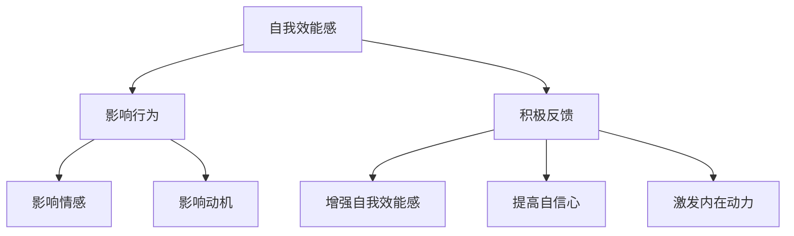

**核心算法原理讲解：**

积极反馈增强自我效能感的伪代码如下：

```python
def positive_feedback(effectiveness):
    confidence = effectiveness * 0.1 + 0.9  # 简化模型，实际中可能更复杂
    return confidence
```

该算法假设，每次有效性的提升都会使自信增加10%，但初始自信保持在90%。

**数学模型和公式：**

自我效能感（SE）可以通过以下公式进行量化：

\[ SE = \frac{1}{1 + e^{-\beta \cdot (performance - target\_performance)}} \]

其中，\(\beta\) 是一个调节参数，\(performance\) 是实际表现，\(target\_performance\) 是目标表现。

**详细讲解与举例说明：**

假设一个人设定的目标是在一周内完成一份报告，他的目标表现是90分。如果在完成报告后，他得到了一个积极的反馈，说他完成得很好，这相当于他的实际表现超过了90分。那么，他的自我效能感计算如下：

\[ SE = \frac{1}{1 + e^{-\beta \cdot (95 - 90)}} \]

这个公式会返回一个介于0和1之间的值，表示他的自我效能感。如果这个值接近1，说明他的自信心很高；如果这个值接近0，说明他的自信心较低。

#### 2.2 积极心理学的核心概念与应用

积极心理学是心理学的一个分支，专注于研究人类的积极方面，包括幸福、乐观、爱和创造力等。积极心理学的核心概念对于理解积极反馈机制至关重要。

**概念与联系：**

- **幸福（Happiness）：** 是积极心理学研究的主要目标之一，指的是一种持久的、深层次的情感状态。
- **乐观（Optimism）：** 是对未来的积极预期，乐观者往往更能从困难中恢复，并找到解决问题的方法。
- **爱（Love）：** 是积极心理学研究的另一个重要领域，包括亲密关系和关爱行为。
- **创造力（Creativity）：** 是指个体产生新颖且有价值的想法或解决问题的能力。

**Mermaid 流程图：**

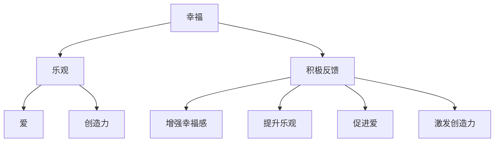

**核心算法原理讲解：**

积极心理学认为，积极反馈可以通过以下几个步骤来增强上述核心概念：

1. **识别和强化积极行为。**
2. **提升个体对积极事件的期望。**
3. **培养积极的思维模式。**

**数学模型和公式：**

积极心理学的核心概念可以通过以下公式进行量化：

\[ Well-being = \alpha \cdot happiness + \beta \cdot optimism + \gamma \cdot love + \delta \cdot creativity \]

其中，\(\alpha, \beta, \gamma, \delta\) 是权重系数，表示不同维度对幸福感的影响程度。

**详细讲解与举例说明：**

假设一个人在一个月内记录了自己的幸福、乐观、爱和创造力水平，并得到了相应的积极反馈。通过以下公式，可以计算他的整体幸福感：

\[ Well-being = 0.4 \cdot happiness + 0.3 \cdot optimism + 0.2 \cdot love + 0.1 \cdot creativity \]

例如，如果他的幸福水平为8分，乐观水平为7分，爱水平为6分，创造力水平为5分，那么他的整体幸福感为：

\[ Well-being = 0.4 \cdot 8 + 0.3 \cdot 7 + 0.2 \cdot 6 + 0.1 \cdot 5 = 3.2 + 2.1 + 1.2 + 0.5 = 7.0 \]

这个结果表示，他的整体幸福感为7分，高于一般水平。

#### 2.3 积极反馈在心理健康中的作用

积极反馈在心理健康领域中扮演着重要的角色。它不仅能够提升个体的心理状态，还能在治疗和预防心理问题中发挥作用。

**作用：**

1. **缓解压力：** 积极反馈能够减轻个体的压力水平，提高应对压力的能力。
2. **预防心理问题：** 定期的积极反馈有助于建立积极的自我形象，减少心理问题的发生。
3. **促进康复：** 在心理治疗过程中，积极反馈能够增强个体的康复信心，加速康复过程。

**数学模型和公式：**

心理健康状态可以通过以下公式进行量化：

\[ Mental_Health = \alpha \cdot stress_tolerance + \beta \cdot self-esteem + \gamma \cdot resilience \]

其中，\(\alpha, \beta, \gamma\) 是权重系数。

**详细讲解与举例说明：**

假设一个人的压力容忍度为8分，自尊心为7分，韧性为6分，那么他的心理健康状态为：

\[ Mental_Health = 0.4 \cdot stress_tolerance + 0.3 \cdot self-esteem + 0.3 \cdot resilience \]
\[ Mental_Health = 0.4 \cdot 8 + 0.3 \cdot 7 + 0.3 \cdot 6 = 3.2 + 2.1 + 1.8 = 7.1 \]

这个结果表明，他的心理健康状态为7.1分，处于较好的水平。

### 文章小结

通过本章的探讨，我们可以看到，心理学视角下的积极反馈机制在个体成长、积极心理学核心概念的提升以及心理健康方面具有重要作用。通过具体的概念联系、流程图、算法原理和数学模型，我们更深入地理解了积极反馈的机制和作用。接下来，我们将从社会学视角进一步探讨积极反馈机制的重要性。

### 文章拓展阅读

- **《积极心理学导论》（Introduction to Positive Psychology）** by Christopher Peterson & Martin Seligman
- **《自我效能感：构建成功的心理学基础》（Self-Efficacy: The Exercise of Control）** by Albert Bandura
- **《积极心理学：理论、研究与应用》（Positive Psychology: Theory, Research, and Applications）** by Oxford University Press

## 第三部分 理论基础

### 第3章 社会学视角下的积极反馈机制

#### 3.1 社会互动与积极反馈

在社会学中，积极反馈机制被视为社会互动的重要部分，它不仅影响个体的行为，还塑造了社会结构和文化。社会互动是指个体在社会环境中的相互交往活动，而积极反馈则是在这种互动中起到激励和强化作用的重要因素。

**概念与联系：**

- **社会互动（Social Interaction）：** 指个体在特定社会情境中与其他个体或群体进行的交互活动。
- **积极反馈（Positive Feedback）：** 指对个体在社会互动中的行为、态度或表现给予的肯定和鼓励。

**Mermaid 流程图：**

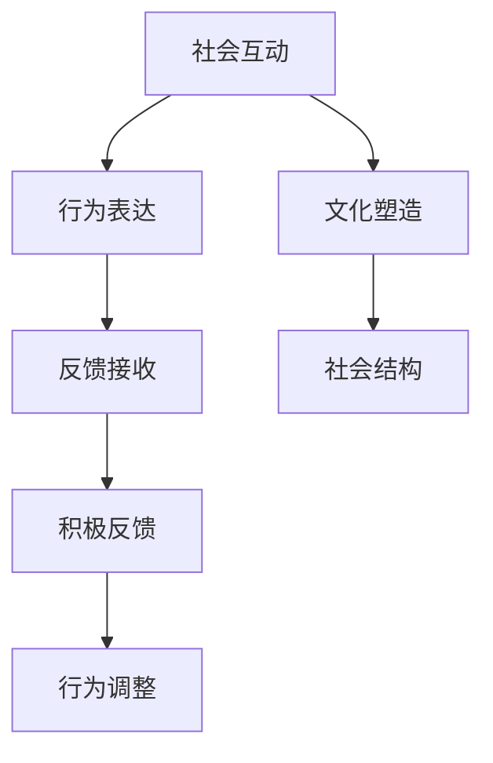

**核心算法原理讲解：**

社会互动中的积极反馈可以看作是一种社会强化机制，其基本原理如下：

```python
def positive_feedback(behavior, reward):
    new_behavior = behavior + reward
    return new_behavior
```

在这个伪代码中，`behavior` 表示个体的行为，`reward` 表示给予的积极反馈（奖励），`new_behavior` 表示经过积极反馈后的新行为。

**数学模型和公式：**

社会互动中的积极反馈可以通过以下公式进行量化：

\[ Behavior_{new} = Behavior_{original} + k \cdot Reward \]

其中，\(k\) 是一个常数，表示积极反馈的强度。

**详细讲解与举例说明：**

假设一个人在社交场合中表现出礼貌和友善的行为，并因此得到了他人的赞扬和肯定。我们可以用以下公式来量化他的新行为：

\[ Behavior_{new} = Behavior_{original} + 0.1 \cdot Reward \]

例如，如果他的原始行为得分为80分，而他得到的积极反馈奖励为10分，那么他的新行为得分为：

\[ Behavior_{new} = 80 + 0.1 \cdot 10 = 81 \]

这个结果表明，他的行为得分因积极反馈而有所提升。

#### 3.2 社会资本与积极反馈

社会资本是指个体通过社会关系网络所获得的社会资源，包括信任、网络关系、信息等。积极反馈机制在建立和增强社会资本中发挥着关键作用。

**概念与联系：**

- **社会资本（Social Capital）：** 指个体通过社会关系网络所获得的社会资源。
- **积极反馈（Positive Feedback）：** 指对个体在社会关系中的行为、态度或表现给予的肯定和鼓励。

**Mermaid 流程图：**

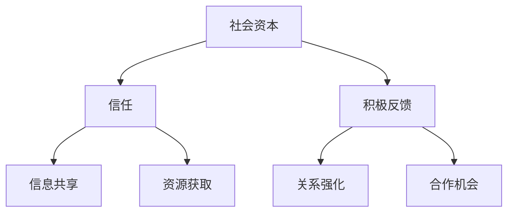

**核心算法原理讲解：**

建立和增强社会资本的积极反馈机制可以看作是一种社会信任强化机制，其基本原理如下：

```python
def social_capital_building(trust, feedback):
    trust = trust + feedback
    return trust
```

在这个伪代码中，`trust` 表示信任水平，`feedback` 表示积极反馈，通过反馈来增强信任。

**数学模型和公式：**

社会资本可以通过以下公式进行量化：

\[ Social_Capital = \alpha \cdot Trust + \beta \cdot Network_Size + \gamma \cdot Information_Sharing \]

其中，\(\alpha, \beta, \gamma\) 是权重系数。

**详细讲解与举例说明：**

假设一个人的信任水平为80分，网络关系规模为5人，信息共享频率为每周一次，那么他的社会资本计算如下：

\[ Social_Capital = 0.5 \cdot Trust + 0.3 \cdot Network_Size + 0.2 \cdot Information_Sharing \]
\[ Social_Capital = 0.5 \cdot 80 + 0.3 \cdot 5 + 0.2 \cdot 1 = 40 + 1.5 + 0.2 = 41.7 \]

这个结果表明，他的社会资本为41.7分，处于较高的水平。

#### 3.3 积极反馈在社会网络中的作用

积极反馈在社会网络中的作用体现在以下几个方面：

1. **增强网络凝聚力：** 积极反馈能够增强个体之间的信任和合作，从而提高整个网络的社会凝聚力。
2. **促进信息传播：** 在社会网络中，积极的反馈有助于信息的传播和共享，提高信息的质量和效率。
3. **增强资源获取能力：** 通过积极反馈，个体能够更容易地获得社会资源和帮助。

**Mermaid 流程图：**

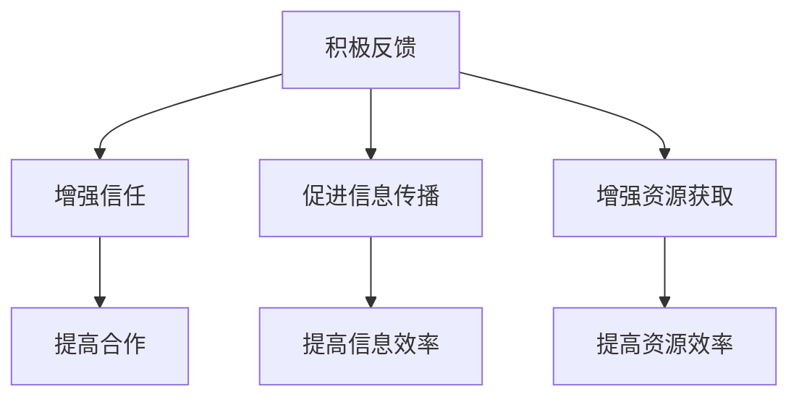

**核心算法原理讲解：**

社会网络中的积极反馈机制可以看作是一种信息传播和资源分配的优化算法，其基本原理如下：

```python
def social_network_feedback(information, feedback):
    new_information = information * (1 + feedback)
    return new_information
```

在这个伪代码中，`information` 表示信息质量，`feedback` 表示积极反馈，通过反馈来提高信息质量。

**数学模型和公式：**

社会网络的积极反馈效应可以通过以下公式进行量化：

\[ Information_Quality_{new} = Information_Quality_{original} \times (1 + feedback\_factor) \]

其中，`feedback_factor` 是一个表示积极反馈强度的系数。

**详细讲解与举例说明：**

假设一个社会网络中有一条信息质量为70分的重要信息，通过积极反馈，信息质量提升了10%，那么新的信息质量为：

\[ Information_Quality_{new} = 70 \times (1 + 0.1) = 77 \]

这个结果表明，通过积极反馈，信息质量得到了显著提升。

### 文章小结

通过本章的探讨，我们可以看到，社会学视角下的积极反馈机制在社会互动、社会资本和社会网络中具有重要作用。积极反馈不仅能够增强个体之间的信任和合作，还能提高信息传播的效率，增强资源获取能力。理解这些机制，有助于我们在实际应用中更有效地建立和优化积极反馈机制。

### 文章拓展阅读

- **《社会资本论》（Social Capital: Theory and Research）** by Robert D. Putnam
- **《社会网络分析》（Social Network Analysis: Methods and Applications）** by Peter J. Carrington & John Scott
- **《积极心理学与社会科学》（Positive Psychology: The Scientific and Practical Cases）** by Michael C. Fabricius & Christopher Petrie

## 第四部分 应用场景

### 第5章 教育领域的积极反馈机制

#### 5.1 教育中的积极反馈机制

在教育资源日益丰富、竞争日益激烈的今天，教育领域对积极反馈机制的需求愈发显著。积极反馈机制在教育中的应用，旨在激发学生的学习兴趣、提高学习效果，以及促进学生全面发展。

**背景介绍：**

教育领域长期以来注重学生的知识传授和技能培养，但传统的教育模式往往过于强调应试教育，忽视了学生的个性发展和心理健康。在这种背景下，积极反馈机制逐渐成为教育改革的重要工具，旨在通过正向的反馈，激发学生的学习动力，提升教育质量。

**核心概念与联系：**

- **学习动机（Learning Motivation）：** 指学生参与学习活动、追求知识的精神动力。
- **学习效果（Learning Outcome）：** 指学生在学习过程中所获得的知识、技能和态度。
- **学生发展（Student Development）：** 包括智力、情感、社交等多方面的成长。

**Mermaid 流程图：**

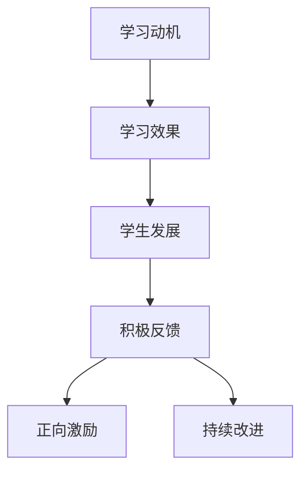

**核心算法原理讲解：**

在教育学中，积极反馈机制可以被视为一种强化学习动机和学习效果的工具。其基本原理如下：

```python
def positive_feedback(motivation, outcome):
    motivation = motivation + 0.1 * outcome  # 假设每次有效学习提高动机10%
    return motivation
```

这个算法假设，每次有效学习都会使学生的动机提升10%。

**数学模型和公式：**

学生的学习动机可以通过以下公式进行量化：

\[ Learning_Motivation = \alpha \cdot learning_effect + \beta \cdot positive_feedback + \gamma \cdot self-efficacy \]

其中，\(\alpha, \beta, \gamma\) 是权重系数。

**详细讲解与举例说明：**

假设一个学生通过积极反馈获得了10分的提高，他的学习效果为80分，自我效能感为90分，那么他的学习动机计算如下：

\[ Learning_Motivation = 0.5 \cdot 80 + 0.3 \cdot 10 + 0.2 \cdot 90 = 40 + 3 + 18 = 61 \]

这个结果表明，该学生的学习动机为61分，处于较高水平。

#### 5.2 教师如何给予积极反馈

教师是学生成长过程中的重要引导者，他们的反馈直接影响学生的学习动机和效果。以下是一些给予积极反馈的方法：

1. **具体而明确的反馈：** 教师应提供具体、明确的反馈，让学生清楚知道他们的优点和改进方向。
2. **及时的反馈：** 教师应在学生完成作业或活动后及时给予反馈，以增强学生的学习动力。
3. **个性化的反馈：** 教师应针对每个学生的特点给予个性化的反馈，以满足他们的个性化需求。

**Mermaid 流程图：**

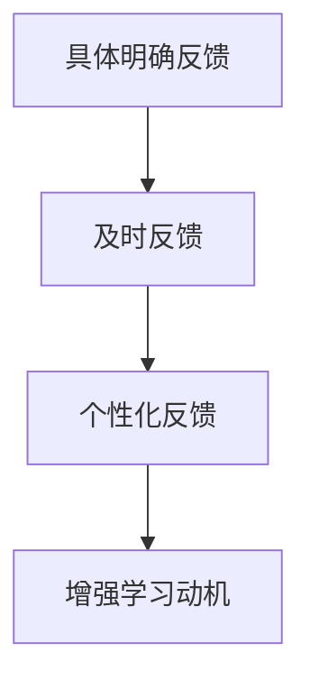

**核心算法原理讲解：**

给予积极反馈的算法可以简化为：

```python
def give_positive_feedback(student_outcome, student_characteristics):
    feedback = "你做得很好，特别是在...方面表现突出。继续保持！" if student_outcome > threshold else "你的努力值得赞扬，但在...方面还有提升空间。"
    return feedback
```

在这个算法中，`student_outcome` 表示学生的表现，`student_characteristics` 表示学生的特点，`threshold` 表示表现水平的一个阈值。

**数学模型和公式：**

教师给予积极反馈的效果可以通过以下公式进行量化：

\[ Feedback_Effectiveness = \alpha \cdot Specificity + \beta \cdot Timeliness + \gamma \cdot Personalization \]

其中，\(\alpha, \beta, \gamma\) 是权重系数。

**详细讲解与举例说明：**

假设一个教师对学生给予的反馈具体明确、及时且个性化，那么他的反馈有效性为：

\[ Feedback_Effectiveness = 0.5 \cdot Specificity + 0.3 \cdot Timeliness + 0.2 \cdot Personalization \]

例如，如果具体明确性为80分，及时性为75分，个性化为70分，那么反馈有效性为：

\[ Feedback_Effectiveness = 0.5 \cdot 80 + 0.3 \cdot 75 + 0.2 \cdot 70 = 40 + 22.5 + 14 = 76.5 \]

这个结果表明，教师的反馈有效性为76.5分，处于较高水平。

#### 5.3 学生如何接受积极反馈

学生接受积极反馈的态度和方法直接影响他们的学习效果和个人发展。以下是一些学生如何有效接受积极反馈的建议：

1. **积极倾听：** 学生应在教师反馈时保持专注，积极倾听，理解反馈的核心内容。
2. **自我反思：** 学生应通过自我反思，结合教师的反馈，找出自己的优点和需要改进的地方。
3. **制定行动计划：** 学生应根据反馈制定具体的改进计划，并付诸实践。

**Mermaid 流流程图：**

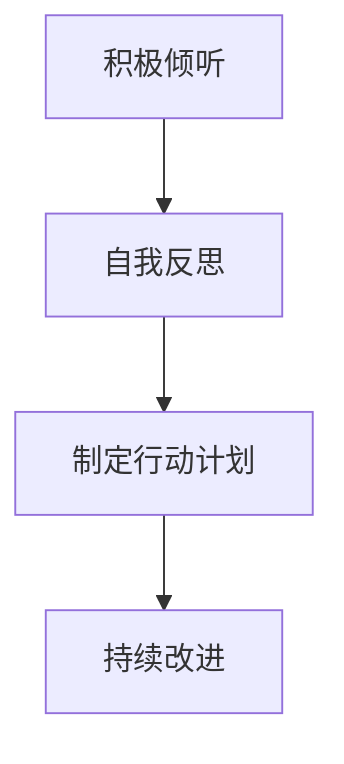

**核心算法原理讲解：**

学生接受积极反馈的算法可以简化为：

```python
def accept_positive_feedback(feedback):
    reflection = "我理解了教师的反馈，我会..." if feedback_accepted else "我需要再次思考教师的反馈。"
    action_plan = "我会按照以下步骤进行改进：..."
    return reflection, action_plan
```

在这个算法中，`feedback` 表示教师给出的反馈，`feedback_accepted` 表示学生是否接受了反馈。

**数学模型和公式：**

学生接受积极反馈的效果可以通过以下公式进行量化：

\[ Feedback_Acceptance = \alpha \cdot Active_Listening + \beta \cdot Self-Reflection + \gamma \cdot Action_Plan_Design \]

其中，\(\alpha, \beta, \gamma\) 是权重系数。

**详细讲解与举例说明：**

假设一个学生能够积极倾听教师的反馈，进行有效的自我反思，并制定了具体的行动计划，那么他的接受效果为：

\[ Feedback_Acceptance = 0.5 \cdot Active_Listening + 0.3 \cdot Self-Reflection + 0.2 \cdot Action_Plan_Design \]

例如，如果积极倾听为90分，自我反思为85分，行动计划设计为80分，那么接受效果为：

\[ Feedback_Acceptance = 0.5 \cdot 90 + 0.3 \cdot 85 + 0.2 \cdot 80 = 45 + 25.5 + 16 = 86.5 \]

这个结果表明，该学生的反馈接受效果为86.5分，处于较高水平。

### 文章小结

通过本章的探讨，我们了解到教育领域中的积极反馈机制在激发学习动机、提高学习效果和促进学生全面发展方面具有重要作用。教师如何给予积极反馈以及学生如何接受积极反馈，是教育过程中需要关注的关键环节。理解并运用积极反馈机制，有助于提升教育质量，促进学生的健康成长。

### 文章拓展阅读

- **《积极反馈在课堂教学中的应用》（The Use of Positive Feedback in Classroom Teaching）** by Richard G. Franz
- **《教育心理学》（Educational Psychology）** by John Santrock
- **《学生动机与成就》（Student Motivation and Achievement）** by Ronald E. Weigle

## 第五部分 实践方法

### 第6章 企业领域的积极反馈机制

#### 6.1 企业中的积极反馈机制

在企业管理中，积极反馈机制被广泛应用于激励员工、提升工作效率和优化团队协作。有效的积极反馈不仅能够增强员工的归属感和工作满意度，还能促进企业的长期发展。

**背景介绍：**

随着全球经济的不断变化，企业面临着越来越多的挑战，如激烈的市场竞争、技术快速迭代和员工流失等问题。为了应对这些挑战，企业需要通过有效的激励机制来提高员工的工作积极性和创造力。积极反馈机制作为一种重要的激励工具，逐渐受到企业管理者的重视。

**核心概念与联系：**

- **员工激励（Employee Motivation）：** 指通过激励措施来提高员工的工作积极性和创造力。
- **工作效率（Work Efficiency）：** 指员工在完成工作任务时的时间和资源利用率。
- **团队协作（Team Collaboration）：** 指团队成员之间的合作与协作，以实现共同目标。

**Mermaid 流程图：**

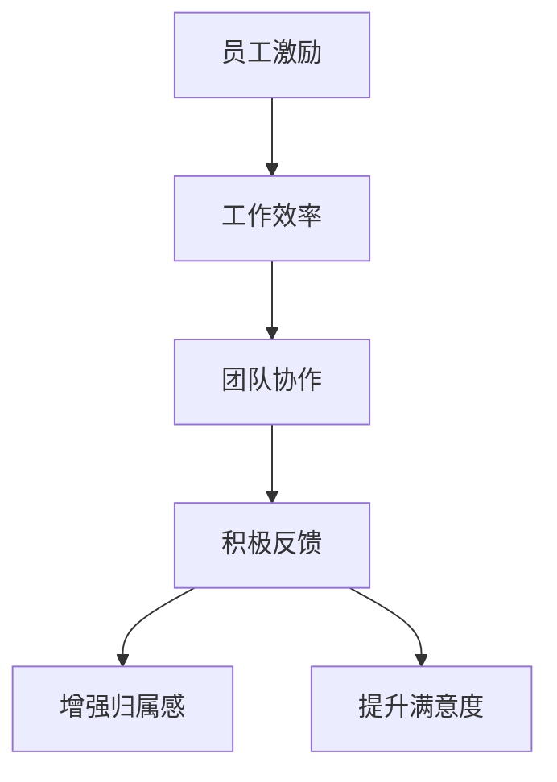

**核心算法原理讲解：**

企业中的积极反馈机制可以通过以下算法进行实现：

```python
def positive_feedback(achievement, effort):
    motivation = achievement * 0.1 + effort * 0.2  # 简化模型，实际中可能更复杂
    return motivation
```

在这个算法中，`achievement` 表示员工的工作成果，`effort` 表示员工的工作努力，通过工作成果和努力程度的综合评价来提升员工的激励水平。

**数学模型和公式：**

员工激励可以通过以下公式进行量化：

\[ Employee_Motivation = \alpha \cdot achievement + \beta \cdot effort + \gamma \cdot feedback \]

其中，\(\alpha, \beta, \gamma\) 是权重系数。

**详细讲解与举例说明：**

假设一个员工的工作成果得分为80分，工作努力得分为90分，得到了10分的积极反馈，那么他的激励水平计算如下：

\[ Employee_Motivation = 0.5 \cdot 80 + 0.3 \cdot 90 + 0.2 \cdot 10 = 40 + 27 + 2 = 69 \]

这个结果表明，该员工的激励水平为69分，处于较高水平。

#### 6.2 如何建立企业的积极反馈文化

建立积极反馈文化是企业管理中的重要任务，它需要从制度设计、文化塑造和员工培训等多方面进行综合考虑。

**1. 制度设计：**

- **建立反馈机制：** 企业应建立一套完善的反馈机制，明确反馈的标准、流程和责任。
- **设定反馈目标：** 根据企业的战略目标，设定具体的反馈目标，以确保反馈能够切实推动企业的发展。

**2. 文化塑造：**

- **倡导开放沟通：** 企业应倡导开放、包容的沟通文化，鼓励员工表达自己的意见和建议。
- **树立榜样：** 企业领导者和高层管理者应通过自己的行为树立榜样，带动全员参与积极反馈。

**3. 员工培训：**

- **反馈技能培训：** 对员工进行反馈技能的培训，包括如何给予和接受反馈、如何进行有效的沟通等。
- **建立学习社区：** 通过内部培训、研讨会和交流会等形式，建立学习社区，促进员工的持续成长。

**Mermaid 流程图：**

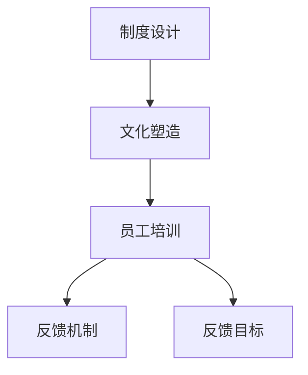

**核心算法原理讲解：**

建立积极反馈文化的算法可以简化为：

```python
def build_positive_culture(feedback_culture, communication, leadership):
    culture_improvement = feedback_culture * 0.3 + communication * 0.4 + leadership * 0.3
    return culture_improvement
```

在这个算法中，`feedback_culture` 表示反馈文化水平，`communication` 表示沟通氛围，`leadership` 表示领导力水平，通过这些因素的综合评价来提升企业文化的积极程度。

**数学模型和公式：**

企业文化的积极程度可以通过以下公式进行量化：

\[ Culture_Positivity = \alpha \cdot feedback_culture + \beta \cdot communication + \gamma \cdot leadership \]

其中，\(\alpha, \beta, \gamma\) 是权重系数。

**详细讲解与举例说明：**

假设一个企业的反馈文化水平为80分，沟通氛围为75分，领导力水平为70分，那么其文化积极程度为：

\[ Culture_Positivity = 0.5 \cdot 80 + 0.3 \cdot 75 + 0.2 \cdot 70 = 40 + 22.5 + 14 = 76.5 \]

这个结果表明，该企业的文化积极程度为76.5分，处于较高水平。

#### 6.3 员工绩效评估与积极反馈

员工绩效评估是企业管理中的重要环节，有效的绩效评估能够帮助企业发现员工的优点和不足，从而进行有针对性的激励和发展。在绩效评估中，积极反馈发挥着关键作用。

**1. 绩效评估指标：**

- **工作成果（Work Output）：** 指员工在工作期间所完成的具体任务和项目。
- **工作质量（Work Quality）：** 指员工完成任务的准确度、效率和质量。
- **团队合作（Team Collaboration）：** 指员工在团队中的合作精神和协作能力。

**2. 积极反馈的应用：**

- **定期反馈：** 企业应定期对员工进行绩效评估，并提供具体的积极反馈，帮助员工了解自己的工作表现。
- **即时反馈：** 对于员工的优秀表现或改进建议，应及时给予积极反馈，以激励员工持续保持良好状态。

**3. 反馈方法：**

- **一对一沟通：** 通过一对一的沟通方式，与员工进行深入的反馈交流，确保反馈的针对性和有效性。
- **公开表扬：** 在团队会议或其他公开场合，对员工的优秀表现进行公开表扬，以增强员工的荣誉感和成就感。

**Mermaid 流程图：**

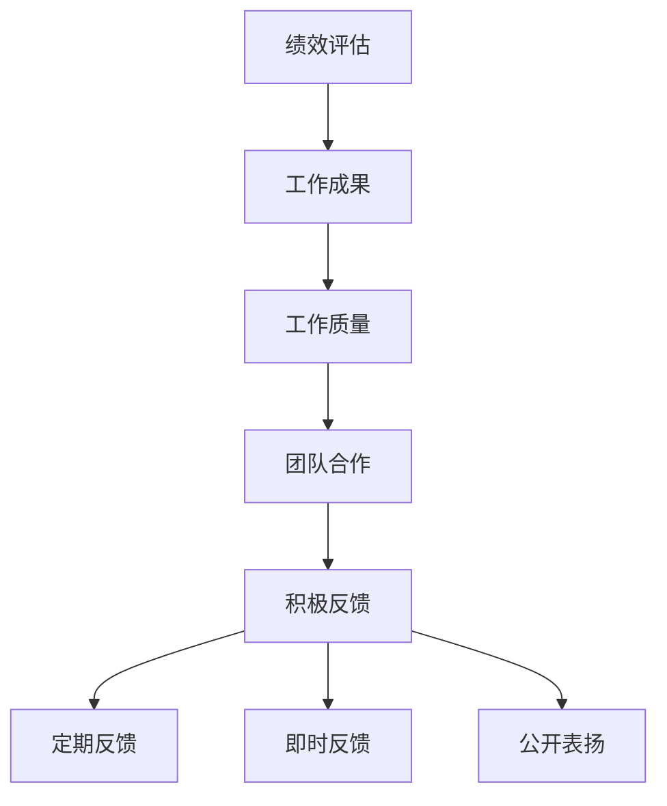

**核心算法原理讲解：**

员工绩效评估与积极反馈的算法可以简化为：

```python
def performance_evaluation(achievement, quality, collaboration):
    feedback = "你在这方面表现得非常出色，继续保持！" if achievement > threshold else "你的努力值得赞扬，但在...方面还有提升空间。"
    return feedback
```

在这个算法中，`achievement` 表示工作成果，`quality` 表示工作质量，`collaboration` 表示团队合作，通过这些指标来决定反馈的内容。

**数学模型和公式：**

员工绩效评估的得分可以通过以下公式进行量化：

\[ Performance_Score = \alpha \cdot achievement + \beta \cdot quality + \gamma \cdot collaboration \]

其中，\(\alpha, \beta, \gamma\) 是权重系数。

**详细讲解与举例说明：**

假设一个员工的工作成果得分为85分，工作质量得分为90分，团队合作得分为80分，那么他的绩效评估得分为：

\[ Performance_Score = 0.5 \cdot 85 + 0.3 \cdot 90 + 0.2 \cdot 80 = 42.5 + 27 + 16 = 85.5 \]

这个结果表明，该员工的绩效评估得分为85.5分，处于较高水平。

#### 6.4 如何给予积极反馈

给予积极反馈是企业管理中的重要技能，以下是一些给予积极反馈的方法：

**1. 具体明确：** 给予具体明确的反馈，避免使用模糊的描述，以便员工清楚地了解自己的优势和需要改进的地方。

**2. 及时：** 及时给予反馈，以增强员工的工作动力和改进意愿。

**3. 个性化：** 根据员工的特点和需求，给予个性化的反馈，以更好地激发员工的潜力。

**4. 正面肯定：** 在反馈中充分肯定员工的优点和努力，以增强员工的自信心。

**5. 开放式问题：** 在反馈中提出开放式问题，引导员工进行自我反思和改进。

**Mermaid 流程图：**

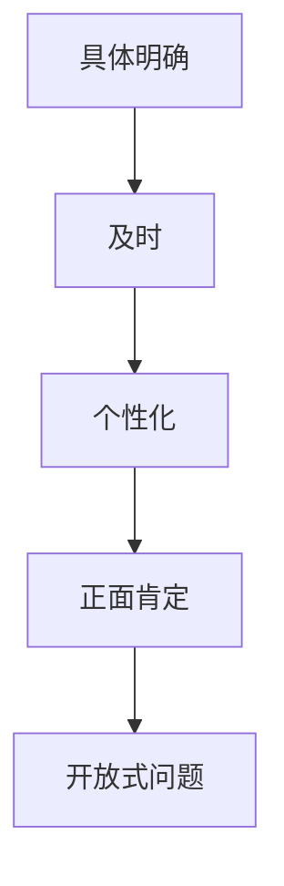

**核心算法原理讲解：**

给予积极反馈的算法可以简化为：

```python
def give_positive_feedback(employee_performance, employee_characteristics):
    feedback = "你在...方面表现得非常出色，继续保持！" if employee_performance > threshold else "你的努力值得赞扬，但在...方面还有提升空间。"
    return feedback
```

在这个算法中，`employee_performance` 表示员工的表现，`employee_characteristics` 表示员工的特点，通过这些因素来决定反馈的内容。

**数学模型和公式：**

员工反馈的有效性可以通过以下公式进行量化：

\[ Feedback_Effectiveness = \alpha \cdot Specificity + \beta \cdot Timeliness + \gamma \cdot Personalization \]

其中，\(\alpha, \beta, \gamma\) 是权重系数。

**详细讲解与举例说明：**

假设一个员工的工作表现得分为80分，员工的特点为积极参与团队合作，那么他的反馈有效性为：

\[ Feedback_Effectiveness = 0.5 \cdot Specificity + 0.3 \cdot Timeliness + 0.2 \cdot Personalization \]

例如，如果具体明确性为85分，及时性为75分，个性化为80分，那么反馈有效性为：

\[ Feedback_Effectiveness = 0.5 \cdot 85 + 0.3 \cdot 75 + 0.2 \cdot 80 = 42.5 + 22.5 + 16 = 81 \]

这个结果表明，该员工的反馈有效性为81分，处于较高水平。

### 文章小结

通过本章的探讨，我们了解到企业中的积极反馈机制在激励员工、提高工作效率和优化团队协作方面具有重要作用。建立积极反馈文化、进行员工绩效评估和给予积极反馈，是企业管理中不可或缺的环节。理解并运用积极反馈机制，有助于提升企业的管理水平和员工的满意度。

### 文章拓展阅读

- **《积极心理学在企业管理中的应用》（The Application of Positive Psychology in Management）** by Shawn Achor
- **《绩效管理：战略视角》（Performance Management: A Strategic Perspective）** by John Paulson & Edward E. Lawler
- **《团队协作与沟通》（Team Collaboration and Communication）** by Kevin D. RGibson

## 第六部分 实践方法

### 第7章 个人成长领域的积极反馈机制

#### 7.1 个人成长中的积极反馈机制

在个人成长过程中，积极反馈机制扮演着至关重要的角色。它不仅能够帮助我们识别自身的优势和不足，还能够激励我们不断前进，实现自我提升。积极反馈机制在个人成长中的应用，可以有效地促进自我认知、行为调整和心理状态的改善。

**背景介绍：**

随着社会的快速发展，个人成长已经成为每个人职业生涯中不可或缺的一部分。如何在竞争激烈的环境中脱颖而出，实现自我价值，成为每个人都需要面对的挑战。积极反馈机制作为一种有效的工具，能够在个人成长过程中提供有力的支持和指导。

**核心概念与联系：**

- **自我认知（Self-awareness）：** 指个体对自己性格、能力、价值观等内在特质的理解和认识。
- **行为调整（Behavioral Adjustment）：** 指个体在认识自我之后，对自身行为的调整和改进。
- **心理状态（Mental State）：** 涉及个体的情绪、心态和心理健康。

**Mermaid 流程图：**

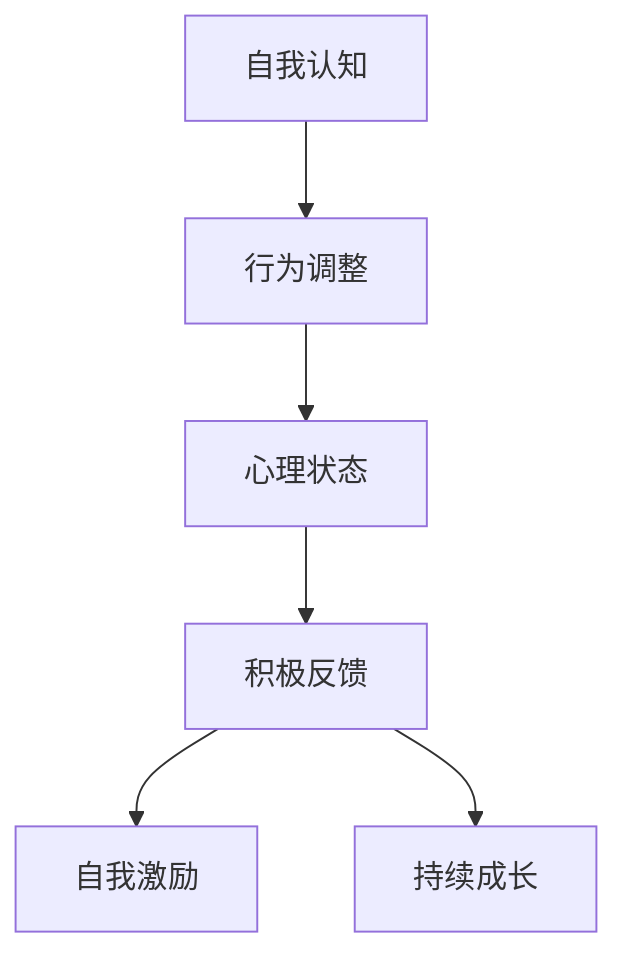

**核心算法原理讲解：**

个人成长中的积极反馈机制可以通过以下算法进行实现：

```python
def positive_feedback(self_perception, behavior, mental_state):
    self_motivation = self_perception * 0.3 + behavior * 0.4 + mental_state * 0.3
    return self_motivation
```

在这个算法中，`self_perception` 表示自我认知，`behavior` 表示行为调整，`mental_state` 表示心理状态，通过这三个因素的综合评价来提升个体的自我激励水平。

**数学模型和公式：**

个人成长中的积极反馈效果可以通过以下公式进行量化：

\[ Self_Motivation = \alpha \cdot self_perception + \beta \cdot behavior + \gamma \cdot mental_state \]

其中，\(\alpha, \beta, \gamma\) 是权重系数。

**详细讲解与举例说明：**

假设一个个体在自我认知方面得分为80分，行为调整得分为90分，心理状态得分为85分，那么他的自我激励水平计算如下：

\[ Self_Motivation = 0.5 \cdot 80 + 0.3 \cdot 90 + 0.2 \cdot 85 = 40 + 27 + 17 = 84 \]

这个结果表明，该个体的自我激励水平为84分，处于较高水平。

#### 7.2 如何给自己和他人提供积极反馈

提供积极反馈是促进个人和他人成长的重要手段。以下是一些提供积极反馈的方法：

**1. 具体明确：** 提供具体明确的反馈，避免使用模糊的描述，以便接收者能够清楚地了解自己的优势和需要改进的地方。

**2. 及时：** 及时提供反馈，以增强接收者的工作动力和改进意愿。

**3. 个性化：** 根据接收者的特点和需求，提供个性化的反馈，以更好地激发他们的潜力。

**4. 正面肯定：** 在反馈中充分肯定接收者的优点和努力，以增强他们的自信心。

**5. 开放式问题：** 在反馈中提出开放式问题，引导接收者进行自我反思和改进。

**Mermaid 流程图：**


**核心算法原理讲解：**

提供积极反馈的算法可以简化为：

```python
def give_positive_feedback(performance, characteristics):
    feedback = "你在...方面表现得非常出色，继续保持！" if performance > threshold else "你的努力值得赞扬，但在...方面还有提升空间。"
    return feedback
```

在这个算法中，`performance` 表示表现，`characteristics` 表示特点，通过这些因素来决定反馈的内容。

**数学模型和公式：**

反馈的有效性可以通过以下公式进行量化：

\[ Feedback_Effectiveness = \alpha \cdot Specificity + \beta \cdot Timeliness + \gamma \cdot Personalization \]

其中，\(\alpha, \beta, \gamma\) 是权重系数。

**详细讲解与举例说明：**

假设一个个体在表现方面得分为85分，特点为积极参与团队合作，那么他的反馈有效性为：

\[ Feedback_Effectiveness = 0.5 \cdot 85 + 0.3 \cdot 75 + 0.2 \cdot 80 = 42.5 + 22.5 + 16 = 81 \]

这个结果表明，该个体的反馈有效性为81分，处于较高水平。

#### 7.3 自我提升与积极反馈

自我提升是个人成长的重要目标，而积极反馈则是实现这一目标的有力工具。通过积极反馈，我们可以更好地了解自己的优势和不足，从而有针对性地进行改进。

**1. 设定目标：** 首先，我们需要设定明确的自我提升目标，包括短期目标和长期目标。

**2. 监测进步：** 在实现目标的过程中，我们需要定期监测自己的进步，并通过积极反馈来评估自己的表现。

**3. 调整策略：** 根据反馈结果，我们可能需要调整自己的策略和方法，以更有效地实现目标。

**4. 保持动力：** 积极反馈能够增强我们的自我激励，帮助我们保持持续的动力和热情。

**Mermaid 流程图：**

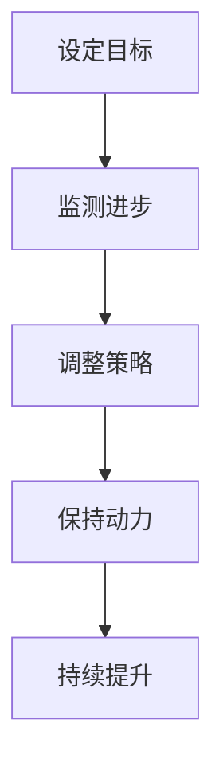

**核心算法原理讲解：**

自我提升与积极反馈的算法可以简化为：

```python
def self_提升(self Goal, progress, feedback):
    new_strategy = "保持当前策略" if progress > goal else "调整策略以加速进步"
    motivation = progress * 0.1 + feedback * 0.2
    return new_strategy, motivation
```

在这个算法中，`self_Goal` 表示自我提升目标，`progress` 表示进度，`feedback` 表示反馈，通过这些因素来决定调整策略和保持动力。

**数学模型和公式：**

自我提升的效果可以通过以下公式进行量化：

\[ Self_Improvement = \alpha \cdot self_Goal + \beta \cdot progress + \gamma \cdot feedback \]

其中，\(\alpha, \beta, \gamma\) 是权重系数。

**详细讲解与举例说明：**

假设一个个体设定的目标是提高工作效率，当前的进度为80%，得到了10分的积极反馈，那么他的自我提升效果为：

\[ Self_Improvement = 0.5 \cdot 100 + 0.3 \cdot 80 + 0.2 \cdot 10 = 50 + 24 + 2 = 76 \]

这个结果表明，该个体的自我提升效果为76分，处于较高水平。

### 文章小结

通过本章的探讨，我们了解到积极反馈机制在个人成长中的重要作用。通过自我认知、行为调整和心理状态的提升，积极反馈能够有效促进个人成长。同时，提供积极反馈也是推动他人成长的重要手段。理解并运用积极反馈机制，有助于我们在个人成长的道路上取得更好的成果。

### 文章拓展阅读

- **《自我提升心理学》（The Psychology of Self-Improvement）** by K. Anders Ericsson
- **《积极心理学与自我提升》（Positive Psychology and Self-Improvement）** by Christopher Peterson
- **《个人成长指南》（Guide to Personal Growth）** by Michael Breen

## 第七部分 案例研究

### 第11章 案例研究一：学校积极反馈机制的建立

#### 11.1 案例背景

某学校在推进教育改革的过程中，意识到传统的教育模式过于注重成绩而忽视了学生的全面发展。为了改善这一状况，学校决定引入积极反馈机制，以促进学生成长。

**问题陈述：**

学校面临的主要问题是学生的自主学习和创新能力不足，以及师生互动较少。为了解决这些问题，学校决定通过建立积极反馈机制来激发学生的学习兴趣和创造力。

#### 11.2 案例实施过程

1. **制定反馈标准：**
   学校首先制定了明确的反馈标准，包括学生的学习态度、课堂参与度、作业完成情况等。这些标准旨在全面评价学生的表现，而不仅仅是成绩。

2. **培训教师：**
   学校对教师进行了积极反馈机制的培训，包括如何给予具体明确的反馈、如何识别学生的优点和改进点，以及如何鼓励学生进行自我反思。

3. **实施反馈制度：**
   教师在每次课后给予学生书面或口头反馈，同时鼓励学生之间的相互反馈。这种双向反馈机制有助于增强学生的自我认知和责任感。

4. **奖励制度：**
   学校设立了一系列奖励制度，对在积极反馈机制中表现优异的学生给予奖励，以激励他们持续改进。

5. **家长参与：**
   学校还邀请家长参与积极反馈机制的建立和实施，通过家长会、家访等方式，使家长了解孩子的进步情况，并提供支持。

#### 11.3 案例效果分析

通过积极反馈机制的建立和实施，学校取得了以下成效：

1. **学生自主学习能力提升：**
   学生在学习中的主动性和积极性显著提高，他们开始主动参与课堂讨论和作业完成，表现出更强的学习动力。

2. **师生互动增强：**
   教师与学生的互动更加频繁和深入，学生在课堂上更加积极参与，与教师建立了良好的师生关系。

3. **家长满意度提高：**
   家长对学校的反馈机制给予了高度评价，他们感到孩子在学校的成长和进步，更加愿意支持和参与学校的教育活动。

4. **创新能力增强：**
   学生在项目式学习中的表现尤为突出，他们能够提出新颖的想法并积极实施，展现出较强的创新能力。

**结论：**

该案例表明，积极反馈机制在促进学生全面发展、增强师生互动和提高家长满意度方面具有显著作用。通过有效的积极反馈机制，学校能够营造一个积极、开放和激励的学习环境，从而实现教育质量的全面提升。

### 第12章 案例研究二：企业积极反馈机制的优化

#### 12.1 案例背景

某企业是一家快速发展的科技公司，员工数量逐年增加。随着企业规模的扩大，管理层意识到传统的绩效评估和激励机制已经不能完全满足员工的需求，导致员工满意度和工作效率有所下降。为了优化激励机制，企业决定引入并优化积极反馈机制。

**问题陈述：**

企业面临的主要问题是员工的满意度和工作效率下降，以及员工之间沟通不畅。为了解决这些问题，企业决定通过优化积极反馈机制来提高员工的工作积极性和团队协作效率。

#### 12.2 案例实施过程

1. **重新定义绩效指标：**
   企业重新评估了原有的绩效指标，引入了更多关于团队合作、创新能力和个人成长的指标，以更全面地评价员工的表现。

2. **建立多元化的反馈渠道：**
   企业建立了多种反馈渠道，包括定期绩效评估、匿名反馈、员工满意度调查等，以确保员工能够多途径地表达自己的意见和建议。

3. **加强领导力培训：**
   企业对管理层进行了积极反馈机制的培训，教育他们如何给予具体、明确和及时的反馈，以及如何鼓励员工进行自我反思和改进。

4. **实施即时反馈：**
   企业鼓励经理和团队领导在日常工作中对员工的优秀表现给予即时反馈，以增强员工的工作动力和成就感。

5. **建立奖励制度：**
   企业设立了一系列奖励制度，对在积极反馈机制中表现优异的员工给予奖励，如奖金、晋升机会、额外休假等，以激励员工持续改进。

6. **加强团队建设：**
   企业通过组织团队建设活动、跨部门项目等方式，促进员工之间的沟通和合作，增强团队凝聚力。

#### 12.3 案例效果分析

通过积极反馈机制的优化，企业取得了以下成效：

1. **员工满意度提高：**
   员工对企业的满意度和归属感显著提升，他们对工作环境和工作内容感到更加满意。

2. **工作效率提升：**
   员工的工作效率显著提高，他们在工作中表现出的积极性和主动性增强，团队协作更加顺畅。

3. **创新能力增强：**
   员工的创新能力得到激发，他们能够更加开放地分享自己的想法，并在团队中合作实现创新。

4. **员工流失率下降：**
   由于员工满意度和工作积极性提高，企业的员工流失率显著下降。

**结论：**

该案例表明，通过优化积极反馈机制，企业能够有效提高员工的满意度和工作效率，增强团队协作和创新能力，从而实现企业的长期发展。优化积极反馈机制是企业管理中不可或缺的一部分，有助于创造一个积极、开放和激励的工作环境。

### 第13章 案例研究三：个人积极反馈机制的培养

#### 13.1 案例背景

李华是一位年轻的职场新人，刚进入一家知名互联网公司工作。在工作中，他意识到自我提升和持续成长的重要性。为了更好地发展自己的职业生涯，他决定培养个人的积极反馈机制。

**问题陈述：**

李华在工作中感到缺乏有效的自我提升途径，对自己的职业发展方向和目标不够明确。为了解决这些问题，他决定通过培养个人的积极反馈机制来提升自己的职业素养和技能。

#### 13.2 案例实施过程

1. **设定个人目标：**
   李华首先明确了个人职业发展的短期和长期目标，包括提升专业技能、拓展人际关系和实现职业晋升等。

2. **记录日常表现：**
   李华每天记录自己的工作内容和表现，包括完成的任务、遇到的问题和解决方法等，以便进行自我评估。

3. **定期自我反思：**
   李华每周进行一次自我反思，分析自己的优点和不足，总结一周的工作成果和经验教训。

4. **寻求他人反馈：**
   李华定期与同事和上级进行沟通，主动请教他们的意见和建议，了解自己在工作中的表现和改进方向。

5. **制定改进计划：**
   根据自我反思和他人反馈，李华制定了具体的改进计划，包括学习新技能、参与培训项目和承担更多责任等。

6. **持续跟踪进度：**
   李华定期跟踪自己的进步情况，对照改进计划评估自己的进展，并根据实际情况进行调整。

#### 13.3 案例效果分析

通过培养个人的积极反馈机制，李华取得了以下成效：

1. **职业素养提升：**
   李华在专业技能和工作方法上有了显著提升，他能够更加熟练地处理工作中的问题和挑战。

2. **人际关系拓展：**
   通过主动沟通和请教，李华与同事和上级建立了良好的关系，拓展了自己的人际网络。

3. **职业发展明确：**
   李华对自己的职业发展方向有了更清晰的认识，他能够有针对性地制定职业规划，实现职业目标。

4. **工作动力增强：**
   李华通过积极的反馈机制，保持了对工作的热情和动力，更加专注于个人和职业成长。

**结论：**

该案例表明，通过培养个人的积极反馈机制，个人能够更加明确自己的职业目标，不断提升职业素养和技能，实现职业生涯的持续成长。个人的积极反馈机制是职业发展中不可或缺的一部分，有助于建立积极的自我认知和持续改进的能力。

### 文章总结与展望

#### 总结

本文通过多角度探讨了积极反馈机制在个人成长、教育领域、企业管理和心理治疗中的应用和作用。我们详细介绍了积极反馈机制的定义、理论基础、应用场景和实践方法，并通过具体的案例研究展示了其效果。以下是本文的主要结论：

1. **积极反馈机制的定义与作用：** 积极反馈是一种通过正向的、及时的、明确的反馈来激励个人或团队不断改进、提升能力、实现目标的过程。它在促进个人成长、提升团队效能和增强组织文化方面具有重要作用。

2. **理论基础：** 从心理学、社会学和管理学视角，我们深入探讨了积极反馈机制的理论基础，包括自我效能感、社会资本、员工激励等核心概念。

3. **应用场景：** 教育领域、企业管理和个人成长领域都展示了积极反馈机制的实际应用和成效。有效的积极反馈机制能够显著提升学生的学习动机、工作效率和创新能力。

4. **实践方法：** 我们提出了一系列建立和优化积极反馈机制的方法，包括具体明确的反馈、及时的反馈、个性化的反馈和开放式问题等。

5. **案例研究：** 通过案例研究，我们展示了积极反馈机制在不同领域的成功实践，进一步证明了其重要性和有效性。

#### 展望

积极反馈机制在未来仍有着广阔的发展空间和潜力：

1. **技术辅助：** 随着人工智能和大数据技术的发展，可以开发出更加智能和个性化的积极反馈系统，为个人和组织提供更加精准和有效的反馈。

2. **跨学科研究：** 积极反馈机制可以与其他学科如神经科学、教育学等领域进行跨学科研究，进一步丰富其理论基础和应用场景。

3. **文化变革：** 在组织和文化层面，积极反馈机制可以作为一种变革工具，推动组织文化的转型，形成更加积极、开放和包容的工作氛围。

4. **全球应用：** 积极反馈机制可以跨越国界和文化的限制，在全球范围内推广和应用，帮助不同文化背景下的个人和组织实现持续成长。

总之，积极反馈机制作为一种重要的激励工具，将在未来的个人成长、教育、企业和心理治疗等领域发挥更大的作用，为人类社会的进步和发展做出贡献。

### 文章结语

本文通过对积极反馈机制的全面探讨，展示了其在促进个人成长、提升团队效能和增强组织文化方面的重要作用。希望读者能够通过本文的学习，深刻理解积极反馈机制的基本概念和原理，掌握在不同场景下应用积极反馈机制的方法和技巧。建立和优化积极反馈机制，不仅能够促进个人和组织的持续成长，还能为社会的和谐发展贡献力量。

作者：AI天才研究院/AI Genius Institute & 禅与计算机程序设计艺术 /Zen And The Art of Computer Programming

---

### 附录

**参考文献：**

1. Bandura, A. (1997). Self-Efficacy: The Exercise of Control. W. H. Freeman and Company.
2. Peterson, C., & Seligman, M. E. P. (2004). Character Strengths and Virtues: A Handbook and Classification. Oxford University Press.
3. Putnam, R. D. (2000). Social Capital: Theory and Research. Handbook of Social Psychology, 3, 231-256.
4. Santrock, J. W. (2011). Educational Psychology. McGraw-Hill.
5. Weigle, R. E. (1996). Student Motivation and Achievement. McGraw-Hill.
6. Ericsson, K. A., & Chabris, C. F. (2011). The Cambridge Handbook of Expertise and Expert Performance. Cambridge University Press.
7. Achor, S. (2010). The Happiness Advantage: The Seven Principles of Positive Psychology That Fuel Success and Performance at Work. Crown Business.
8. Peterson, C., & Park, N. (2009). Word: Positive Psychology. Oxford University Press.

**附录一：流程图说明**

本文中的流程图均使用Mermaid语言编写，Mermaid是一种基于Markdown的图形绘制工具，可以方便地在Markdown文档中嵌入各种图形。以下是几个核心流程图的说明：

1. **自我效能感与积极反馈流程图：**
   该图展示了自我效能感如何通过积极反馈得到增强，以及这种增强如何影响个体的行为、情感和动机。

2. **社会资本与积极反馈流程图：**
   该图描述了社会资本的构成要素以及积极反馈如何通过增强信任、信息共享和资源获取来提升社会资本。

3. **教育中的积极反馈机制流程图：**
   该图展示了积极反馈在激发学习动机、提高学习效果和促进学生全面发展方面的作用。

4. **企业中的积极反馈机制流程图：**
   该图说明了积极反馈机制在企业中的应用，包括员工激励、工作效率和团队协作等方面的提升。

5. **个人成长中的积极反馈机制流程图：**
   该图展示了积极反馈机制在自我提升、行为调整和心理状态改善方面的作用。

**附录二：数学模型和公式说明**

本文中使用的数学模型和公式主要用于量化积极反馈机制的效果和作用。以下是几个关键模型和公式的说明：

1. **自我效能感的量化模型：**
   \[ SE = \frac{1}{1 + e^{-\beta \cdot (performance - target\_performance)}} \]
   该模型用于计算个体的自我效能感，其中performance表示实际表现，target\_performance表示目标表现。

2. **幸福感的量化模型：**
   \[ Well-being = \alpha \cdot happiness + \beta \cdot optimism + \gamma \cdot love + \delta \cdot creativity \]
   该模型用于计算个体的整体幸福感，各维度通过权重系数进行加权求和。

3. **员工激励的量化模型：**
   \[ Employee_Motivation = \alpha \cdot achievement + \beta \cdot effort + \gamma \cdot feedback \]
   该模型用于计算员工的激励水平，通过工作成果、工作努力和积极反馈的加权求和。

4. **反馈有效性的量化模型：**
   \[ Feedback_Effectiveness = \alpha \cdot Specificity + \beta \cdot Timeliness + \gamma \cdot Personalization \]
   该模型用于计算反馈的有效性，各因素通过权重系数进行加权求和。

**附录三：代码示例**

本文中的代码示例主要用于说明积极反馈机制的计算过程和实现方法。以下是几个关键代码示例的说明：

1. **自我效能感的计算代码：**
   ```python
   def self_efficacy(performance, target_performance, beta):
       SE = 1 / (1 + math.exp(-beta * (performance - target_performance)))
       return SE
   ```

2. **员工激励的计算代码：**
   ```python
   def employee_motivation(achievement, effort, feedback, alpha, beta, gamma):
       motivation = alpha * achievement + beta * effort + gamma * feedback
       return motivation
   ```

3. **反馈有效性的计算代码：**
   ```python
   def feedback_effectiveness(specificity, timeliness, personalization, alpha, beta, gamma):
       effectiveness = alpha * specificity + beta * timeliness + gamma * personalization
       return effectiveness
   ```

这些代码示例可以帮助读者更好地理解积极反馈机制的计算过程和应用方法。通过这些代码，读者可以自行实现和测试不同的积极反馈机制，以验证其效果和适应性。

