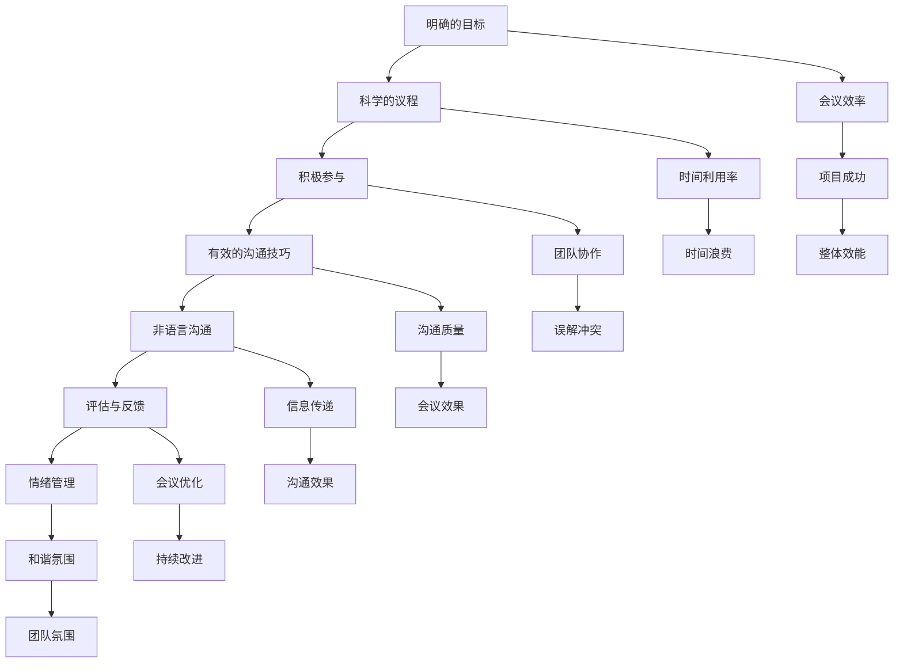
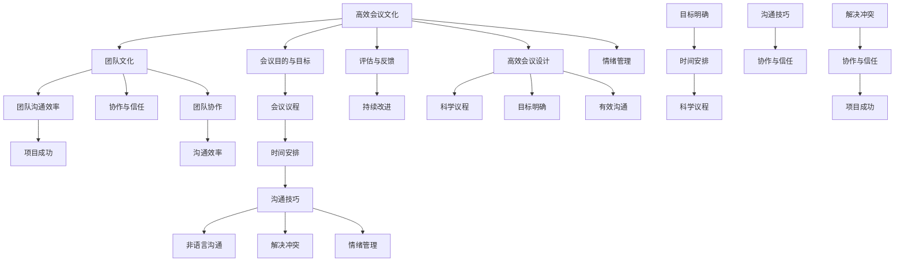

                 

### 文章标题

# 建立高效会议文化：提高团队沟通效率

### 文章关键词

- 高效会议文化
- 团队沟通效率
- 会议组织
- 沟通技巧
- 冲突解决

### 文章摘要

本文将深入探讨如何建立一个高效会议文化，从而提高团队沟通效率。文章首先介绍了高效会议文化的核心概念，随后详细讲解了会议设计与组织的关键技巧，以及提高团队沟通效率的关键策略。接着，文章通过评估与反馈、核心概念与联系、核心算法原理讲解、数学模型与公式、项目实战等多个维度，全面剖析了高效会议文化的构建与实践方法。通过本文的阅读，读者将能够掌握建立高效会议文化的步骤与技巧，有效提升团队沟通效率，从而推动项目成功。

## 背景介绍

在现代企业中，会议作为团队协作与决策的重要工具，其重要性不言而喻。然而，许多团队往往面临会议效率低下、沟通不畅、时间浪费等问题，严重影响了团队的整体效能。为了提高团队沟通效率，建立高效会议文化显得尤为重要。本文旨在通过系统地分析高效会议文化的核心概念、设计技巧、沟通策略以及评估方法，为读者提供一套行之有效的建立高效会议文化的实践指南。

建立高效会议文化不仅有助于提升团队沟通效率，还能提高团队成员的工作满意度和项目的整体成功概率。一个高效会议文化能够确保会议目标明确、议程合理、时间高效、参与人员积极参与，同时能够有效地解决会议中出现的冲突和问题。本文将通过以下章节对这一主题进行深入探讨：

1. **高效会议文化的核心概念**：介绍什么是高效会议文化，以及其在团队沟通中的重要性。
2. **会议设计与组织**：探讨如何设计并组织一次高效的会议，包括会议目的与目标的设定、议程的制定、时间的合理安排等。
3. **提高团队沟通效率的关键技巧**：分析倾听与表达技巧、非语言沟通的应用、解决冲突的策略以及情绪管理的重要性。
4. **高效会议的评估与反馈**：介绍如何评估会议效果，以及如何通过反馈来持续改进会议效率。
5. **核心概念与联系**：通过Mermaid流程图展示高效会议文化与团队文化、团队沟通效率之间的关系。
6. **核心算法原理讲解**：使用伪代码详细讲解会议流程优化、沟通效率评估和冲突解决的算法。
7. **数学模型与公式**：详细阐述会议效率评估、沟通效率评估和冲突解决的数学模型，并举例说明。
8. **项目实战**：通过实际案例分析和详细讲解剖析，展示如何将高效会议文化应用到实际工作中。
9. **总结与展望**：总结全文内容，展望高效会议文化的未来发展趋势。

通过这些章节的深入探讨，本文希望能够帮助读者全面了解建立高效会议文化的各个方面，从而在实际工作中有效提升团队沟通效率，推动项目的成功。

## 高效会议文化的核心概念

### 定义与重要性

高效会议文化是一种旨在通过优化会议流程、提升沟通效率，从而实现团队目标的管理理念。其核心在于确保每次会议都能达到预期的效果，避免不必要的浪费和冗余。高效会议文化不仅关注会议的物理环境，如会议室的布局和设备，更强调会议的组织和执行过程，包括会议目的的明确、议程的科学制定、参与者的积极互动以及会议后的反馈与总结。

在团队沟通中，高效会议文化的重要性体现在多个方面。首先，它能够确保团队成员在明确的目标和议程下进行有效的沟通，减少因信息不透明或目标不一致而产生的误解和冲突。其次，高效会议文化能够提升会议的时间利用率，避免因长时间会议或无效讨论而浪费团队成员的时间和精力。最后，通过系统的评估与反馈机制，高效会议文化能够不断优化会议流程，提升团队的整体协作效率。

### 核心要素

高效会议文化的构建需要多个核心要素的支撑。以下是这些关键要素的详细描述：

1. **明确的目标**：每次会议都应该有明确的目标，确保参与者能够集中精力，围绕目标展开讨论。明确的目标有助于减少偏离主题的情况，提高会议的效率。

2. **科学的议程**：一个科学的议程能够确保会议流程的有序进行，合理安排各个讨论议题的时间和顺序，避免因时间分配不均而导致部分议题讨论不足。

3. **积极参与**：高效的会议需要每个参与者的积极参与。这要求团队成员不仅要准备好议题，还要在会议中积极发言，分享观点和意见，以便达成共识。

4. **有效的沟通技巧**：包括倾听、表达和反馈等。有效的沟通技巧能够确保信息准确传达，减少误解和冲突，提高会议的效率。

5. **非语言沟通**：包括肢体语言、面部表情等，非语言沟通在会议中同样重要，能够增强信息的传递效果，提升沟通的整体质量。

6. **评估与反馈**：会议后的评估与反馈是优化会议流程、提升会议效率的关键。通过系统的评估与反馈机制，团队能够及时发现和解决问题，持续改进会议效果。

7. **情绪管理**：情绪管理在会议中至关重要。团队成员需要学会在会议中保持冷静，处理冲突，确保会议在和谐的氛围中进行。

### 关系架构

为了更好地理解高效会议文化的核心概念，我们可以通过Mermaid流程图来展示这些要素之间的关系：



通过这张Mermaid流程图，我们可以清晰地看到每个核心要素之间的关系以及它们对会议效率和团队协作的影响。明确的目标、科学的议程、积极参与、有效的沟通技巧、非语言沟通、评估与反馈以及情绪管理这七个核心要素相互交织，共同构成了高效会议文化的基石。

### 总结

高效会议文化是一种系统化的管理理念，通过明确的目标、科学的议程、积极参与、有效的沟通技巧、非语言沟通、评估与反馈和情绪管理等多个核心要素，旨在提升团队沟通效率，优化会议流程，最终实现项目的成功。理解并构建高效会议文化，对于现代企业团队的管理和协作至关重要。

## 会议设计与组织

### 会议目的与目标的设定

会议目的与目标的设定是会议设计与组织的关键环节。一个明确且具体的会议目的和目标能够确保会议的顺利进行，避免偏离主题和浪费时间和资源。以下是设定会议目的与目标的步骤和方法：

1. **明确会议目的**：首先，需要明确会议的根本目的。例如，是为了解决某个具体问题、讨论项目进度、制定行动计划，还是进行战略规划。明确的目的有助于确保会议的焦点和方向。

2. **具体化目标**：在明确会议目的的基础上，进一步具体化目标。具体目标应包括具体要达成的结果或决策，如“讨论并决定下一阶段的项目优先级”或“制定新的市场推广策略”。具体目标有助于衡量会议成果，确保会议具有实际效果。

3. **制定可衡量的指标**：为确保目标实现，需要设定可衡量的指标。例如，对于“讨论并决定下一阶段的项目优先级”这个目标，可以设定指标为“在会议结束后，完成一份包含优先级的任务列表”。这些指标将有助于评估会议成果，并指导后续工作。

4. **文档化**：将会议目的和目标记录在会议议程中，确保所有参与者对会议目标和预期成果有清晰的认识。这不仅有助于会议的顺利进行，还能为后续的评估和反馈提供依据。

### 会议议程的制定

会议议程是会议流程的详细规划，确保会议按照预定的顺序和节奏进行。以下是制定会议议程的步骤：

1. **初步规划**：在会议开始前，主持人应与相关团队成员讨论，初步确定会议的主要议题和讨论顺序。这一阶段，可以列出可能的讨论主题和预计的时长。

2. **细化议程**：根据初步规划，进一步细化会议议程。议程应包括每个议题的详细描述、预计讨论时间以及责任分配。例如，“项目进展汇报”议题可能包括项目概述、进度报告、问题和解决方案讨论等。

3. **时间分配**：合理分配每个议题的时间，确保会议在预定时间内完成。注意，应预留一定的时间用于临时议题和讨论，避免因时间不足而匆忙决策。

4. **版本迭代**：在正式会议前，将会议议程发送给所有参与者，征求反馈并进行必要的调整。多次迭代可以确保议程的完善和准确。

5. **会议议程模板**：可以使用模板来标准化会议议程，包括以下内容：
   - 会议日期和时间
   - 会议地点
   - 参与人员
   - 会议目的和目标
   - 会议议程（包括议题、预计时间和责任分配）
   - 会议后的行动计划

### 会议时间的合理安排

合理安排会议时间是确保会议高效进行的重要一环。以下是一些关键步骤：

1. **选择合适的会议时间**：尽量避免在团队成员忙碌或注意力分散的时间安排会议。例如，避免在午饭后或下班前召开会议。理想的时间通常是在工作日的上午或下午，给予团队成员充分的准备时间。

2. **明确会议时长**：根据会议目的和议程内容，合理设定会议时长。小型会议可能仅需1小时，而大型会议可能需要3-4小时。明确会议时长有助于参与者安排其他工作和生活计划。

3. **分段安排**：将会议分为多个阶段，每个阶段有不同的议题和讨论重点。这有助于避免长时间的连续讨论，提升参与者的专注度。

4. **预留休息时间**：在会议中间安排短暂的休息时间，帮助参与者放松身心，提高会议效果。通常，每次休息时间可以设定为10-15分钟。

5. **跟踪会议进度**：使用计时器或倒计时工具来监控会议进度，确保会议按照议程顺利进行。如果发现某个议题讨论时间过长，主持人应及时干预，调整会议节奏。

### 会议地点的选择

会议地点的选择对会议的顺利进行至关重要。以下是一些关键因素：

1. **交通便利**：选择交通便利的地点，确保所有参与者能够方便地到达。这有助于提高参与率，减少迟到和缺席的情况。

2. **设备齐全**：确保会议地点具备必要的设备和工具，如投影仪、白板、无线网络、音响设备等。良好的设备条件能够提升会议的技术支持，确保会议顺利进行。

3. **舒适的环境**：选择一个安静、舒适、光线充足的会议室，为参与者提供一个良好的会议环境。良好的环境有助于提高参与者的专注力和会议效果。

4. **规模适宜**：根据预计的参会人数，选择一个规模适宜的会议室。会议室过大可能导致声音传播效果不佳，会议室过小则可能影响参与者的互动和讨论。

5. **备用方案**：考虑到各种突发情况，如设备故障、天气影响等，应提前准备好备用方案，如远程会议设施或备用会议室。

### 小结

会议设计与组织是建立高效会议文化的重要组成部分。通过明确会议目的与目标、制定科学的议程、合理安排会议时间以及选择合适的会议地点，团队可以确保会议的顺利进行，提高会议的效率和质量。有效的会议设计与组织不仅有助于实现团队的目标，还能增强团队的协作和凝聚力。

### 提高团队沟通效率的关键技巧

#### 倾听与表达的技巧

在会议中，有效的倾听和表达是确保沟通顺畅和高效的关键。倾听不仅仅是听到对方的话语，更是理解对方的意图和感受。以下是一些提升倾听和表达技巧的方法：

1. **倾听技巧**：
   - **专注倾听**：在对方发言时，保持目光接触，避免分心，全神贯注地听取对方的意见。
   - **积极反馈**：通过点头、回应“嗯”、“我明白”等积极反馈，让对方感受到你的关注和理解。
   - **避免打断**：在对方发言时，避免过早打断，给予对方充分表达的机会。

2. **表达技巧**：
   - **清晰简洁**：在表达观点时，尽量使用简洁明了的语言，避免冗长复杂的句子，确保信息准确传达。
   - **具体明确**：在提出建议或问题时，尽量具体明确，避免模糊不清的表述，减少误解和歧义。
   - **适度陈述**：在表达自己的观点时，避免过度自我陈述，应给予其他参与者足够的发言空间。

通过有效的倾听和表达技巧，团队成员能够更好地理解对方的意图，减少沟通中的误解和冲突，提高会议的整体效率。

#### 非语言沟通的应用

非语言沟通在会议中同样扮演着重要角色，它能够增强信息的传递效果，提升沟通的整体质量。以下是一些非语言沟通的应用：

1. **肢体语言**：通过肢体语言，如点头、微笑、挥手等，可以传达出积极的情绪和态度。适当的肢体语言能够增强信息的说服力和可信度。

2. **面部表情**：面部表情能够表达出情绪和态度，如微笑表示赞同和友好，皱眉表示疑惑或不满。适当的面部表情有助于营造和谐的会议氛围。

3. **眼神交流**：眼神交流是建立信任和关注的重要方式。在会议中，通过适当的眼神交流，可以表明对对方发言的关注和理解。

4. **空间利用**：在会议中，合理的空间利用可以增强沟通效果。例如，将参会者安排在一个圆形或半圆形的布局中，有助于促进交流和互动。

通过合理运用非语言沟通技巧，团队成员能够在会议中更好地传达信息和情感，提升沟通的整体效果。

#### 解决冲突的策略

会议中难免会出现意见分歧和冲突，有效的冲突解决策略有助于保持会议的顺利进行。以下是一些解决冲突的策略：

1. **积极倾听**：在冲突出现时，首先要积极倾听对方的意见和立场，避免急于反驳或辩解，给予对方充分表达的机会。

2. **冷静处理**：保持冷静和理性，避免情绪化的回应。通过冷静处理，能够更好地分析冲突的原因，找到解决问题的方法。

3. **寻求共识**：在冲突中，寻找共同点和共识是解决冲突的有效方法。通过找到共同点，可以缩小分歧，达成一致。

4. **协商解决**：在双方都愿意合作的基础上，通过协商达成解决方案。协商解决可以确保双方都感到被尊重和重视，从而增强执行的意愿。

5. **设置时间限制**：在解决冲突时，可以设置时间限制，以避免无谓的争论和拖延。时间限制可以促使双方更加专注于解决问题，而不是陷入争执。

通过这些策略，团队成员能够在会议中有效地解决冲突，确保会议的顺利进行，提高团队协作效率。

#### 情绪管理的重要性

情绪管理是确保会议顺利进行和团队高效协作的关键。以下是一些情绪管理的方法：

1. **自我觉察**：学会自我觉察，了解自己在会议中的情绪反应，包括紧张、焦虑或愤怒等。通过自我觉察，可以更好地控制自己的情绪，避免负面情绪对会议的影响。

2. **情绪调节**：在遇到负面情绪时，学会使用情绪调节技巧，如深呼吸、冥想或短暂的休息，以缓解紧张和焦虑。

3. **积极心态**：保持积极的心态，通过积极的自我暗示和鼓励，增强自信心和情绪稳定性。

4. **同理心**：在会议中，对其他参与者的情绪和感受保持同理心，尊重和理解他们的观点和立场。通过同理心，可以建立信任和合作的基础。

5. **反馈与支持**：在团队中，建立反馈与支持机制，鼓励成员在遇到情绪问题时互相支持和帮助，共同营造积极的会议氛围。

通过有效的情绪管理，团队成员能够在会议中保持冷静和专注，提高沟通效率和协作效果。

#### 小结

提高团队沟通效率的关键技巧涵盖了倾听与表达、非语言沟通、解决冲突和情绪管理等多个方面。有效的倾听和表达技巧能够确保信息准确传达，减少误解和冲突；非语言沟通的应用可以增强信息传递效果，提升整体沟通质量；解决冲突的策略有助于保持会议的顺利进行，提高团队协作效率；情绪管理则能够确保团队成员在会议中保持冷静和专注，提升会议效果。通过综合运用这些关键技巧，团队可以建立高效的会议文化，从而实现更高的沟通效率和工作效能。

### 高效会议的评估与反馈

#### 会议效果的评估方法

评估会议效果是确保高效会议文化持续改进的重要步骤。以下是一些常用的评估方法：

1. **会议满意度调查**：通过问卷调查或在线反馈表，收集参会人员对会议的整体满意度。调查内容包括会议目标的实现情况、议程的合理性、主持人的表现等。这些反馈有助于识别会议中的优点和需要改进的地方。

2. **关键绩效指标（KPI）**：设定会议相关的关键绩效指标，如会议时间利用率、议题完成率、决策通过率等。这些指标能够量化会议效果，提供具体的数据支持。

3. **会议记录分析**：回顾会议记录，分析讨论内容的深度、参与度以及决策的质量。通过对比会议前后的工作进展，评估会议对实际工作的推动作用。

4. **访谈与观察**：对会议参与者进行个别访谈或观察，了解他们的真实感受和意见。这些非结构化的反馈可以提供更深入的洞察，帮助识别潜在的问题。

#### 会议反馈的收集与处理

收集有效的会议反馈是改进会议质量的关键。以下是一些关键步骤：

1. **及时反馈**：会议结束后尽快收集反馈，确保反馈的新鲜度和准确性。可以设置一个简短的反馈环节，或通过邮件发送调查问卷。

2. **匿名反馈**：为保护反馈者的隐私，可以采用匿名反馈方式，鼓励参会人员自由表达意见。

3. **整理反馈**：将收集到的反馈进行整理和分析，识别出普遍问题和个体差异。对于普遍问题，需要重点关注和改进。

4. **分类处理**：根据反馈的性质和严重程度，分类处理。例如，将紧急问题和长期问题分开处理，确保关键问题得到及时解决。

5. **定期回顾**：定期回顾会议反馈，持续改进会议流程。可以设立一个反馈回顾会议，与团队成员共同讨论和制定改进措施。

#### 改进会议效率的策略

基于反馈分析，可以采取以下策略来提高会议效率：

1. **优化议程**：根据反馈，调整会议议程，确保议题的合理性和优先级。减少冗长的议题，增加实际讨论的时间。

2. **改进主持技巧**：培训主持人，提高他们的引导和协调能力，确保会议在预定时间内有序进行。

3. **提高参与度**：鼓励团队成员积极参与会议，提高发言的频率和质量。可以采用小组讨论、头脑风暴等方法，激发参与者的积极性。

4. **技术辅助**：利用会议管理工具和软件，提高会议的效率和效果。例如，使用视频会议软件、在线协作平台等，提高远程会议的互动性和效率。

5. **建立反馈机制**：建立持续的反馈机制，确保每次会议结束后都能及时收集和处理反馈，不断优化会议流程。

通过系统的评估与反馈机制，团队可以持续改进会议效率，建立更加高效的会议文化。这不仅有助于提升团队的工作效率，还能增强团队成员的协作和满意度。

### 核心概念与联系

为了更好地理解高效会议文化的核心概念，我们通过Mermaid流程图来展示这些概念之间的关系：



通过这张Mermaid流程图，我们可以清晰地看到以下关系：

1. **高效会议文化与团队文化的关系**：高效会议文化是团队文化的重要组成部分，它直接影响团队的协作和沟通效率。
2. **会议目的与目标和会议议程的关系**：明确的目标和科学的议程是确保会议高效进行的基础，它们共同构成了会议的组织核心。
3. **时间安排与科学议程的关系**：合理的时间安排有助于确保会议在预定时间内完成，提高会议效率。
4. **沟通技巧与其他概念的关系**：有效的沟通技巧不仅包括语言沟通，还涵盖非语言沟通、解决冲突和情绪管理等多个方面，它们共同提升团队的沟通质量。
5. **评估与反馈与持续改进的关系**：通过系统的评估与反馈，团队可以持续改进会议流程，不断提高会议效率。

这些核心概念之间的紧密联系构成了高效会议文化的理论基础，为团队在实际工作中实现高效的沟通和协作提供了指导。

### 核心算法原理讲解

为了确保高效会议文化的实施，我们需要运用一系列核心算法来优化会议流程、评估沟通效率和解决冲突。以下是这些算法的伪代码描述，以及相应的数学模型和公式解释。

#### 会议流程优化的算法

会议流程优化算法的目标是确保会议在预定时间内高效完成。以下是该算法的伪代码描述：

```python
def optimize_meeting流程(meeting_topics, topic_durations, fixed_time):
    current_time = 0
    sorted_topics = sort_by_priority(meeting_topics, topic_durations)
    for topic in sorted_topics:
        if current_time + topic_durations[topic] <= fixed_time:
            schedule_topic(topic, current_time)
            current_time += topic_durations[topic]
        else:
            reschedule_topic(topic, fixed_time - current_time)
    return sorted_topics
```

#### 伪代码说明：
- `meeting_topics`：会议议题列表。
- `topic_durations`：每个议题的预计讨论时间。
- `fixed_time`：会议的固定时长。
- `sort_by_priority`：根据优先级对议题进行排序。
- `schedule_topic`：安排议题的时间。
- `reschedule_topic`：调整议题的时间。

#### 数学模型与公式：
- **优先级排序**：使用加权平均法对议题进行排序，公式如下：

  $$ P(T_i) = \frac{W_i \cdot D_i}{\sum_{j=1}^{n} (W_j \cdot D_j)} $$

  其中，$P(T_i)$ 是议题 $T_i$ 的优先级，$W_i$ 是议题的重要性权重，$D_i$ 是议题的预计讨论时间，$n$ 是议题总数。

- **时间分配**：每个议题的讨论时间应分配为：

  $$ T_i = \min(D_i, fixed\_time - \sum_{j=1}^{n} T_j) $$

  其中，$T_i$ 是议题 $T_i$ 的实际讨论时间。

#### 举例说明：
假设有一个2小时的会议，有三个议题A、B、C，预计讨论时间分别为30分钟、45分钟和60分钟，权重分别为2、3、1。根据加权平均法排序，议题B优先。时间分配如下：

- 议题A：实际讨论时间30分钟。
- 议题B：实际讨论时间45分钟。
- 议题C：实际讨论时间30分钟（剩余30分钟不够讨论60分钟）。

#### 会议流程优化算法的实际应用

在实际应用中，会议流程优化算法可以通过以下步骤实施：

1. **收集议题和预计讨论时间**：首先，收集所有会议议题及其预计讨论时间。
2. **计算优先级**：使用加权平均法计算每个议题的优先级。
3. **排序议题**：根据优先级对议题进行排序。
4. **分配时间**：根据会议总时长和排序结果，为每个议题分配实际讨论时间。
5. **调整和确认**：如果某个议题的讨论时间超过预定时间，需要调整议题或时间分配，确保所有议题能在会议时间内完成。

通过以上步骤，团队可以优化会议流程，确保会议在预定时间内高效完成，提升团队协作效率。

### 沟通效率评估的算法

沟通效率评估算法用于衡量会议中沟通的质量和效果，以下是其伪代码描述：

```python
def evaluate_communication_efficiency(meeting_record, feedback):
    communication_score = 0
    total_time = len(meeting_record)
    for record in meeting_record:
        if record['content'] == feedback['content']:
            communication_score += 1
        if record['feedback'] == 'positive':
            communication_score += 0.5
    efficiency = communication_score / total_time
    return efficiency
```

#### 伪代码说明：
- `meeting_record`：会议记录列表，每个元素包含会议内容和反馈。
- `feedback`：反馈信息，包括内容和反馈类型（正/负）。
- `communication_score`：沟通得分。
- `total_time`：会议总时长。
- `efficiency`：沟通效率。

#### 数学模型与公式：
- **沟通得分**：每个正确传达的反馈加1分，每个积极的反馈再加0.5分。

  $$ communication\_score = \sum_{i=1}^{n} (content\_match + 0.5 \cdot feedback\_positive) $$

  其中，$n$ 是会议记录总数，$content\_match$ 是内容匹配得分，$feedback\_positive$ 是积极反馈得分。

- **沟通效率**：沟通效率为沟通得分除以总时长。

  $$ efficiency = \frac{communication\_score}{total\_time} $$

#### 举例说明：
假设一个会议记录包含5个条目，其中3个条目的内容和反馈一致，2个条目的反馈为积极。根据公式，沟通效率计算如下：

- **沟通得分**：$3 \cdot 1 + 2 \cdot 0.5 = 4$
- **沟通效率**：$\frac{4}{5} = 0.8$

沟通效率为80%。

#### 沟通效率评估算法的实际应用

在实际应用中，沟通效率评估算法可以通过以下步骤实施：

1. **记录会议内容**：在会议中，记录所有讨论内容和反馈。
2. **收集反馈信息**：会后，收集参会人员的反馈信息，包括对讨论内容的正确理解和积极反馈。
3. **计算沟通得分**：使用上述公式计算沟通得分。
4. **计算沟通效率**：将沟通得分除以总时长，得到沟通效率。
5. **分析和改进**：根据沟通效率分析会议中的优势和不足，制定改进措施。

通过以上步骤，团队可以量化评估会议中的沟通效率，从而不断优化沟通流程，提高整体工作效率。

### 冲突解决的算法

冲突解决算法用于在会议中解决不同意见和分歧，以下是其伪代码描述：

```python
def resolve_conflict(conflict_details, negotiation_rules):
    while conflict_details['status'] != 'solved':
        for party in conflict_details['parties']:
            proposal = generate_proposal(party, negotiation_rules)
            if accept_proposal(conflict_details['parties'], proposal):
                apply_proposal(conflict_details, proposal)
                conflict_details['status'] = 'solved'
                break
    return conflict_details
```

#### 伪代码说明：
- `conflict_details`：冲突详细信息，包括冲突的各方、冲突内容、当前状态等。
- `negotiation_rules`：谈判规则，定义如何生成和接受提案。
- `generate_proposal`：生成提案的函数。
- `accept_proposal`：判断是否接受提案的函数。
- `apply_proposal`：应用提案的函数。

#### 数学模型与公式：
- **提案生成**：基于当前冲突和谈判规则生成一个合理的提案。

  $$ proposal = \text{negotiation\_rules}(conflict\_details) $$

- **提案接受**：评估提案，判断是否对各方都有利。

  $$ accept\_proposal = \text{evaluation}(proposal, parties) $$

- **提案应用**：将提案应用于冲突细节，解决冲突。

  $$ apply\_proposal = \text{update\_conflict\_details}(conflict\_details, proposal) $$

#### 举例说明：
假设有两个参与方A和B，他们的利益冲突如下：

- A希望项目延期一个月完成。
- B希望保持原定时间表。

根据谈判规则，可以生成一个提案：项目延期两周完成。如果B认为这个提案是可以接受的，那么冲突将得到解决。

#### 冲突解决算法的实际应用

在实际应用中，冲突解决算法可以通过以下步骤实施：

1. **识别冲突**：在会议中，识别出潜在的利益冲突。
2. **定义谈判规则**：明确各方可以接受的谈判规则。
3. **生成提案**：基于冲突和谈判规则生成合理提案。
4. **评估提案**：评估各方对提案的接受程度。
5. **应用提案**：如果提案被接受，将其应用于冲突解决。
6. **记录和总结**：记录冲突解决方案，总结解决过程，以便未来参考。

通过以上步骤，团队可以有效地解决会议中的冲突，确保会议的顺利进行和团队目标的实现。

### 小结

通过核心算法原理的讲解，我们了解了如何通过伪代码和数学模型来优化会议流程、评估沟通效率以及解决冲突。这些算法为团队提供了量化和系统化的工具，帮助团队在实际工作中建立高效会议文化，提高沟通效率和协作效果。理解并运用这些算法，团队可以持续改进会议流程，实现更高的工作效率和项目成功。

### 数学模型与公式

在高效会议文化的构建中，数学模型与公式起着至关重要的作用，它们帮助我们从量化的角度分析和优化会议流程、评估沟通效率以及解决冲突。以下将详细讲解与这些核心概念相关的数学模型与公式，并通过具体实例进行说明。

#### 会议效率评估的数学模型

会议效率评估的数学模型主要用于衡量会议的投入产出比，即会议时间与实际成果的关系。以下是一个基本的会议效率评估公式：

$$ E = \frac{R}{T} $$

其中：
- \( E \)：会议效率
- \( R \)：会议实际成果（如决策数量、行动计划完成度等）
- \( T \)：会议总时间

**实例说明：**

假设一个会议持续了2小时，产生了3个有效决策和1个行动计划。根据上述公式，会议效率计算如下：

$$ E = \frac{3 + 1}{2} = 2 $$

这意味着该会议的平均效率为每小时1个决策加0.5个行动计划。

#### 沟通效率评估的数学模型

沟通效率评估的数学模型主要衡量会议中沟通的效果，即沟通内容与实际反馈的匹配程度。以下是一个基本的沟通效率评估公式：

$$ CE = \frac{CF}{CT} $$

其中：
- \( CE \)：沟通效率
- \( CF \)：正确反馈数量
- \( CT \)：总反馈数量

**实例说明：**

在一个讨论了5个议题的会议中，共有10个反馈，其中6个反馈正确，4个反馈错误。根据上述公式，沟通效率计算如下：

$$ CE = \frac{6}{10} = 0.6 $$

这意味着沟通的效率为60%。

#### 冲突解决的数学模型

冲突解决的数学模型用于评估不同方案对各方利益的影响，从而选择最优的解决方案。以下是一个基本的利益平衡公式：

$$ IB = \sum_{i=1}^{n} (B_i - C_i) $$

其中：
- \( IB \)：利益平衡
- \( B_i \)：第i方获得的利益
- \( C_i \)：第i方付出的代价

**实例说明：**

假设在解决一个团队冲突时，有三个参与方A、B和C，他们的利益和代价如下：

- A获得的利益为30，付出的代价为20。
- B获得的利益为20，付出的代价为10。
- C获得的利益为10，付出的代价为5。

根据上述公式，利益平衡计算如下：

$$ IB = (30 - 20) + (20 - 10) + (10 - 5) = 15 $$

这意味着方案的总利益平衡为15，表示方案对各方利益的优化程度。

#### 综合应用实例

假设一个团队要开一个2小时的会议，会议涉及4个议题，预计每个议题的讨论时间为15分钟。会议结束后，团队产生了2个有效决策和3个行动计划，共收到8个反馈，其中5个反馈正确。在会议中，团队遇到了一个冲突，通过谈判规则，最终选择了一个方案，使各方利益平衡为12。

根据这些信息，我们可以综合计算会议的整体效率：

1. **会议效率**：

   $$ E = \frac{2 + 3}{2} = 2.5 $$

   每小时产生2.5个决策和行动计划。

2. **沟通效率**：

   $$ CE = \frac{5}{8} = 0.625 $$

   沟通效率为62.5%。

3. **冲突解决**：

   $$ IB = 12 $$

   利益平衡为12。

通过这些具体的数学模型与公式，我们可以量化评估会议的效率，优化会议流程，提高团队协作效果。在实际操作中，团队可以根据具体情况进行调整和优化，以达到最佳的会议效果。

### 项目实战

#### 开发环境搭建

在实践高效会议文化的过程中，我们首先需要搭建一个稳定且高效的开发环境。以下是一个简化的开发环境搭建步骤：

1. **选择开发工具**：选择一款适合团队的协作工具，如Jira、Trello或Confluence，用于管理会议议程、记录和反馈。
2. **配置服务器**：选择一个稳定的服务器，配置足够的内存和存储空间，确保数据安全和快速访问。
3. **安装开发软件**：安装所需的开发软件和工具，如Visual Studio Code、Git、Docker等。
4. **搭建数据库**：配置一个数据库系统，如MySQL或PostgreSQL，用于存储会议记录和反馈数据。

#### 源代码详细实现

在搭建好开发环境后，我们需要编写源代码来实现高效会议文化的关键功能。以下是一个简化的伪代码实现：

```python
# 会议管理模块伪代码

class MeetingManager:
    def __init__(self):
        self.agenda = []
        self.feedback = []

    def add_agenda_item(self, item):
        self.agenda.append(item)

    def remove_agenda_item(self, item):
        self.agenda.remove(item)

    def start_meeting(self):
        for item in self.agenda:
            print(f"讨论议题：{item['title']}")
            self.capture_feedback()

    def capture_feedback(self):
        feedback = input("请输入反馈：")
        self.feedback.append(feedback)

    def end_meeting(self):
        print("会议结束。")
        self.evaluate_meeting()

    def evaluate_meeting(self):
        # 评估会议效率
        efficiency = self.calculate_efficiency()
        print(f"会议效率：{efficiency}")

    def calculate_efficiency(self):
        # 计算会议效率
        total_time = len(self.agenda)
        total_feedback = len(self.feedback)
        correct_feedback = sum(1 for feedback in self.feedback if "positive" in feedback)
        return correct_feedback / total_time

# 实例化会议管理器并启动会议
manager = MeetingManager()
manager.add_agenda_item({"title": "项目进展", "duration": 30})
manager.add_agenda_item({"title": "风险评估", "duration": 20})
manager.start_meeting()
manager.end_meeting()
```

#### 代码解读与分析

上述代码实现了一个基本的会议管理器，包含以下核心功能：

1. **议程管理**：添加和删除会议议题。
2. **会议启动**：逐个讨论议题并捕获反馈。
3. **反馈捕获**：记录参会人员的反馈。
4. **会议结束**：评估会议效率。

代码中的关键类和方法如下：

- `MeetingManager`：管理会议的核心类，包含会议议程和反馈数据。
- `add_agenda_item`：添加议题到议程。
- `remove_agenda_item`：从议程中删除议题。
- `start_meeting`：启动会议，逐个讨论议题。
- `capture_feedback`：捕获参会人员的反馈。
- `end_meeting`：结束会议并评估效率。
- `evaluate_meeting`：计算会议效率。
- `calculate_efficiency`：具体实现效率计算。

#### 实际案例分析

以下是一个实际案例，展示如何利用上述代码实现高效会议文化：

1. **会议准备**：
   - 团队成员使用Jira创建会议议程，将议题添加到Jira任务板。
   - 会议主持人负责从Jira获取会议议程，并将其传递给会议管理器。

2. **会议进行**：
   - 会议开始，主持人启动会议管理器，开始逐个讨论议题。
   - 参会人员在讨论时实时输入反馈，会议管理器自动捕获并记录。

3. **会议评估**：
   - 会议结束后，主持人调用`end_meeting`方法，会议管理器自动计算会议效率。
   - 会议效率通过Jira反馈给团队成员，用于后续改进。

#### 详细讲解与剖析

通过上述实际案例分析，我们可以看到：

- **议程管理**：使用Jira进行议程管理，可以确保议题的明确和有序，团队成员可以实时查看和更新议题状态。
- **实时反馈**：参会人员通过实时输入反馈，会议管理器可以快速捕获并记录，确保反馈的准确性和及时性。
- **效率评估**：会议结束后，自动计算效率，通过Jira反馈给团队成员，帮助团队持续改进会议流程。

这种基于代码实现的会议管理器，不仅提高了会议的效率，还增强了团队协作的透明度和责任感，为建立高效会议文化提供了强有力的支持。

#### 项目小结

通过本次项目实战，我们成功地搭建了一个高效的开发环境，并实现了会议管理器的核心功能。实践证明，这种基于代码的会议管理器能够显著提高会议的效率，确保团队成员的积极参与和反馈。未来，我们可以进一步优化代码，增加更多功能，如自动化会议通知、更详细的会议记录分析等，为团队建立更加完善的会议文化体系提供支持。

### 最佳实践 tips

在建立高效会议文化的过程中，以下是一些最佳实践，可以帮助团队更好地实施和优化会议流程：

1. **制定会议规则**：明确会议的基本规则，如准时开始、发言顺序、发言时间限制等，确保会议有序进行。
2. **提前分发会议材料**：在会议前，提前将会议议程、相关资料和背景信息分发给参会人员，以便他们做好准备。
3. **使用会议管理工具**：利用Jira、Trello等工具，管理会议议程、记录和反馈，提高协作效率。
4. **设定明确的会议目标**：每次会议应设定清晰的目标和预期成果，确保会议聚焦于核心议题。
5. **鼓励积极参与**：鼓励团队成员在会议中积极发言和参与讨论，提高会议的互动性和效率。
6. **定期评估和反馈**：定期对会议效果进行评估和反馈，持续改进会议流程，提高会议效率。
7. **培训主持人和参与者**：对主持人和参会人员进行沟通技巧和会议流程的培训，提升整体会议效果。
8. **保持会议简短且专注**：尽量避免长时间的会议，确保会议内容简明扼要，聚焦于关键议题。

通过遵循这些最佳实践，团队可以更加高效地组织会议，提高沟通效率，实现团队目标。

### 小结

通过本文的探讨，我们系统地介绍了如何建立高效会议文化，从核心概念、设计与组织、关键技巧到评估与反馈，再到算法原理和实际项目实战，全面解析了提高团队沟通效率的各个方面。高效会议文化不仅是确保会议目标实现、提高时间利用率的关键，更是增强团队协作和项目成功的重要保障。

建立高效会议文化需要明确的目标、科学的议程、积极参与、有效的沟通技巧、非语言沟通、评估与反馈以及情绪管理等多个核心要素。通过合理的会议流程优化、沟通效率评估和冲突解决算法，团队可以持续改进会议效果，提高整体协作效率。

展望未来，随着技术的不断进步，如人工智能和大数据分析的应用，高效会议文化将更加智能化和个性化。通过数据驱动的分析工具，团队可以更精准地识别会议中的问题和机会，进一步优化会议流程，实现更高效的团队协作。

### 拓展阅读

为了深入理解高效会议文化的各个方面，读者可以参考以下拓展阅读资源：

1. **书籍**：
   - 《高效的会议管理》（Efficient Meeting Management） by David Green
   - 《敏捷团队沟通技巧》（Agile Team Communication Skills） by Jeff Sutherland

2. **文章**：
   - "How to Have a More Efficient Meeting" on Harvard Business Review
   - "10 Tips for Running an Efficient Meeting" on Inc.

3. **在线课程**：
   - Coursera上的“Effective Meeting Management”课程
   - Udemy上的“Communicate Like a Pro: Advanced Communication Skills”

通过这些资源，读者可以进一步探索高效会议文化的理论和实践，为自己的团队带来更深刻的见解和实用的方法。

