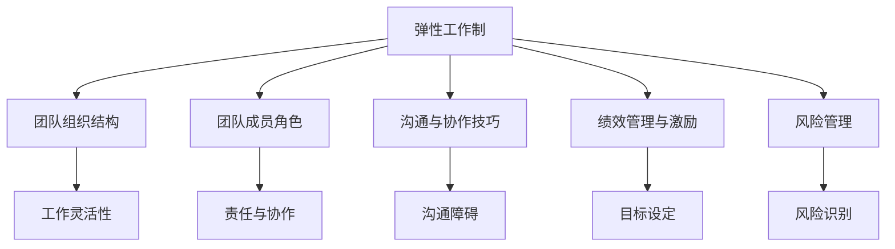

                 


为了撰写一篇符合要求的《弹性工作制下的团队管理策略》文章，我们需要遵循以下步骤进行逻辑分析和内容构建：

### 1. 文章结构规划

首先，我们需要按照提供的目录大纲来规划文章的结构，确保每个章节都有具体的内容填充。这包括：

- **引言**：简要介绍弹性工作制的背景和重要性。
- **核心概念与联系**：用Mermaid流程图展示弹性工作制下团队管理的核心概念及其相互关系。
- **团队组织结构**：详细描述如何设计和调整团队组织结构以适应弹性工作制。
- **团队成员角色**：阐述团队成员在不同角色下的职责与协作。
- **沟通与协作技巧**：提供实用的沟通和协作工具，以及提高团队凝聚力的策略。
- **绩效管理与激励**：讨论如何评估和管理团队成员的绩效，并提供激励策略。
- **风险管理**：介绍弹性工作制下的风险管理策略。
- **案例分析**：通过实际案例展示弹性工作制的实施效果。
- **企业文化建设**：探讨弹性工作制对企业文化的影响和建设方法。
- **总结与展望**：总结文章要点，展望未来团队管理的发展趋势。

### 2. 核心概念与联系

接下来，我们需要用Mermaid流程图来展示弹性工作制下团队管理的核心概念及其相互关系。这将帮助我们更直观地理解各概念之间的联系。以下是一个示例的Mermaid流程图：



### 3. 团队组织结构与角色

在这一部分，我们将详细描述如何设计和调整团队组织结构以适应弹性工作制，并阐述团队成员在不同角色下的职责与协作。以下是一个示例：

#### 团队组织结构

在弹性工作制下，团队组织结构需要更加灵活和模块化。以下是一种可能的设计：

```markdown
### 团队组织结构

弹性工作制要求团队组织结构具备高度的可塑性和适应性。我们可以采用以下组织结构：

1. **矩阵型组织**：结合职能和项目两种组织方式，团队成员既可以专注于特定职能领域，又可以参与到多个项目中。
2. **跨职能团队**：团队成员来自不同的部门或专业领域，可以更有效地协作，快速响应项目需求。
3. **分布式团队**：团队成员分布在不同地点，利用远程协作工具进行沟通和合作。

#### 团队成员角色

团队成员在弹性工作制下扮演不同的角色，包括：

1. **团队成员**：负责具体任务的执行，需要具备良好的自我管理能力和协作精神。
2. **团队领导者**：除了管理团队日常工作外，还需要负责团队目标的设定、成员激励和团队文化建设。
3. **协调员**：负责协调跨部门或跨团队的合作，确保项目顺利进行。
```

### 4. 沟通与协作技巧

在这一部分，我们将提供实用的沟通和协作工具，以及提高团队凝聚力的策略。以下是一个示例：

#### 沟通与协作技巧

在弹性工作制下，有效的沟通和协作是团队成功的关键。以下是一些策略和工具：

```markdown
### 沟通与协作技巧

1. **沟通工具**：
   - **视频会议软件**：如Zoom、Microsoft Teams等，提供实时视频交流和屏幕共享功能。
   - **即时通讯工具**：如Slack、WhatsApp等，方便团队成员快速交流。
   - **项目管理工具**：如Trello、Asana等，帮助团队跟踪任务进度和项目管理。

2. **提高团队凝聚力**：
   - **定期团队建设活动**：通过线上或线下活动，增强团队成员之间的联系。
   - **透明沟通**：鼓励团队成员分享自己的想法和意见，建立信任和透明度。
   - **共同目标**：确保团队成员明确团队目标，共同努力达成目标。

### 5. 绩效管理与激励

在这一部分，我们将讨论如何评估和管理团队成员的绩效，并提供激励策略。以下是一个示例：

#### 绩效管理与激励

在弹性工作制下，绩效管理需要更加灵活和个性化。以下是一些建议：

```markdown
### 绩效管理与激励

1. **绩效评估**：
   - **关键绩效指标（KPI）**：设定与团队目标相关的关键绩效指标，确保团队成员明确自己的工作重点。
   - **定期的绩效评估**：定期对团队成员进行绩效评估，提供反馈和改进建议。
   - **自我评估**：鼓励团队成员定期进行自我评估，增强自我管理和成长意识。

2. **激励策略**：
   - **奖励与认可**：通过奖励和认可来激励团队成员，如奖金、晋升机会、表彰等。
   - **灵活工作安排**：为表现出色的团队成员提供更多的工作自由度，如调整工作时间、工作地点等。
   - **职业发展机会**：为团队成员提供职业发展机会，如培训、项目参与等。

### 6. 风险管理

在这一部分，我们将介绍弹性工作制下的风险管理策略。以下是一个示例：

#### 风险管理

在弹性工作制下，风险管理尤为重要。以下是一些策略：

```markdown
### 风险管理

1. **风险识别**：
   - **风险评估矩阵**：使用风险评估矩阵来识别潜在风险，并评估其影响程度和发生概率。
   - **定期风险评估**：定期对项目或团队进行风险评估，及时识别和应对潜在风险。

2. **风险应对策略**：
   - **风险预防**：通过制定预防措施来降低风险的发生概率。
   - **风险转移**：将部分风险转移给第三方，如购买保险等。
   - **风险应对计划**：制定详细的应对计划，确保在风险发生时能够迅速响应。

### 7. 案例分析

在这一部分，我们将通过实际案例展示弹性工作制的实施效果。以下是一个示例：

#### 案例分析

以某科技公司的远程团队为例，该公司在实施弹性工作制后，取得了以下成效：

```markdown
### 案例分析

#### 某科技公司的远程团队

- **工作灵活性**：团队成员可以自主选择工作时间，提高了工作满意度和生产力。
- **团队凝聚力**：定期团队建设和沟通活动增强了团队成员之间的联系和信任。
- **绩效提升**：通过灵活的绩效管理机制，团队成员的工作效率和质量得到了显著提升。
- **企业文化**：以员工为中心的企业文化得到了巩固，员工积极参与企业建设和创新。

### 8. 企业文化建设

在这一部分，我们将探讨弹性工作制对企业文化的影响和建设方法。以下是一个示例：

#### 企业文化建设

弹性工作制对企业文化产生了深远的影响。以下是一些建议：

```markdown
### 企业文化建设

1. **建立以员工为中心的企业文化**：尊重员工的个人需求，鼓励自主学习和创新。
2. **透明沟通**：建立透明沟通机制，鼓励员工分享意见和反馈。
3. **激励机制**：建立与弹性工作制相适应的激励机制，鼓励员工积极参与团队建设和创新。

### 9. 总结与展望

在这一部分，我们将总结文章要点，并展望未来团队管理的发展趋势。以下是一个示例：

#### 总结与展望

弹性工作制已成为现代企业管理的趋势。未来，团队管理将更加注重灵活性、个性化和数字化。企业需要：

- **灵活应对变化**：快速适应市场变化，调整团队组织和管理策略。
- **培养数字化技能**：提升团队成员的数字化技能，以应对未来挑战。
- **注重员工体验**：关注员工的职业发展和工作满意度，提高团队的整体效能。

通过以上步骤，我们可以确保文章内容丰富、逻辑清晰，并满足格式和要求。接下来，我们将逐步撰写每个章节的具体内容，确保字数在8000-12000字之间。

