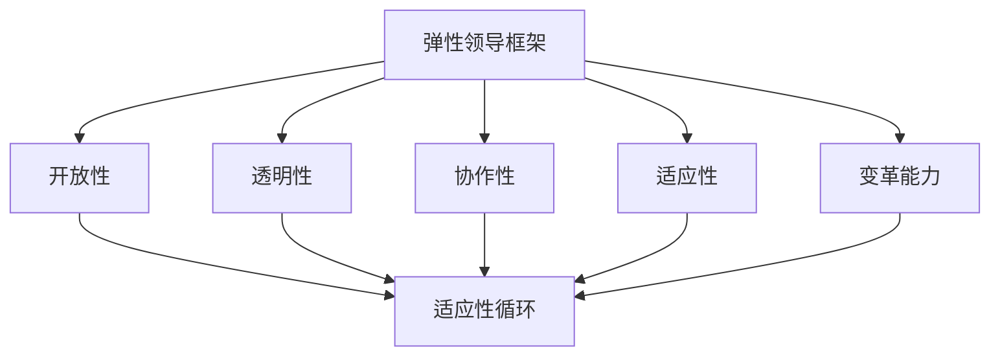

                 


## 文章标题

《弹性领导框架：在不确定性中保持灵活》

## 关键词

弹性领导、不确定性、组织灵活性、适应性、领导力

## 摘要

本文深入探讨了弹性领导框架的概念、理论基础及其在不确定性环境中的应用。通过详细的分析和实例，揭示了弹性领导在保持组织灵活性和适应性方面的重要性。文章旨在为领导者提供实际操作的指导，以帮助他们在不确定的环境中有效管理团队和组织。

---

## 引言

在当今快速变化的商业环境中，领导者面临着前所未有的挑战。不确定性已经成为一种常态，企业需要快速适应市场变化、技术进步以及外部环境的变化。传统领导模式在应对这种不确定性时往往显得力不从心，因此，一种新的领导方式——弹性领导应运而生。

弹性领导框架旨在帮助领导者在不确定的环境中保持组织的灵活性和适应性。它不仅关注组织整体的弹性，还包括领导者在个人层面上的弹性。本文将逐步介绍弹性领导框架的核心概念、理论基础以及其实际应用，帮助读者理解和掌握这一领导模式。

## 弹性领导的概念

弹性领导是一种适应性和变革能力的领导方式，它强调在不确定性环境中保持组织的灵活性和韧性。弹性领导不仅仅是一种应对策略，更是一种持续的组织能力，它需要领导者在多个层面进行思考和行动。

### 弹性领导的核心要素

1. **开放性**：领导者需要具备开放的心态，愿意接受新观念和不同意见。
2. **透明性**：领导者应建立透明的沟通机制，确保团队成员了解组织目标和策略。
3. **协作性**：领导者鼓励团队成员之间的合作和知识共享。
4. **适应性**：领导者能够快速调整策略和决策，以应对环境变化。
5. **变革能力**：领导者具备推动组织变革的能力，鼓励创新和尝试新方法。

### 弹性领导与灵活性的关系

弹性领导与灵活性密切相关。灵活性是指组织在应对外部压力时能够迅速适应的能力。而弹性领导则是实现灵活性的关键因素，它通过建立开放、透明、协作的组织文化，提高组织的整体适应性。

### 弹性领导与传统领导的差异

传统领导强调权威和指挥控制，而弹性领导则更注重协作和共同决策。传统领导依赖于规则和流程，而弹性领导则更灵活，能够根据实际情况进行调整。传统领导可能忽视变化，而弹性领导则能够快速应对外部环境的变化。

## 弹性领导的理论基础

弹性领导框架建立在一系列相关理论基础上，这些理论提供了对弹性领导的深入理解。

### 理论框架

弹性领导的理论框架包括以下关键组成部分：

1. **适应性循环**：这是一个动态的过程，涉及监测、评估、决策和执行四个环节。
2. **学习组织**：组织通过不断学习和适应来提高弹性。
3. **变革管理**：领导者需要具备管理变革的能力，推动组织实现持续改进。

### 关键理论讲解

1. **双环学习**：领导者不仅需要解决眼前的问题，还需要反思和改进现有的工作方式。
2. **变革领导**：领导者需要具备推动变革的能力，激励团队成员积极参与变革过程。

### 理论应用与拓展

弹性领导理论可以应用于不同组织规模和行业。在实际应用中，领导者需要根据组织的特点和环境进行定制化实施。同时，理论的应用也需要不断迭代和优化，以适应不断变化的环境。

## 弹性领导框架的核心概念与联系

为了更好地理解弹性领导框架，我们引入了一个Mermaid流程图，用于展示核心概念之间的联系。

### Mermaid流程图



### 概念解析与联系

- **开放性**：鼓励领导者开放心态，接受新观念和不同意见，为组织创造一个包容的环境。
- **透明性**：通过建立透明的沟通机制，确保团队成员了解组织目标和策略，提高决策效率。
- **协作性**：鼓励团队成员之间的合作和知识共享，增强团队凝聚力和创新能力。
- **适应性**：领导者需要具备快速调整策略和决策的能力，以应对环境变化。
- **变革能力**：领导者需要推动组织变革，鼓励创新和尝试新方法，以保持组织的竞争力。

这些核心概念相互联系，共同构成了弹性领导框架的基础。通过Mermaid流程图，我们可以清晰地看到这些概念之间的逻辑关系和相互影响。

## 核心算法原理讲解

在弹性领导框架中，核心算法原理起着至关重要的作用。以下将使用伪代码详细阐述这些算法的原理。

### 伪代码

```python
# 弹性领导框架核心算法原理

def ElasticLeadershipFramework():
    # 初始化
    open_mind = True
    transparency = True
    collaboration = True
    adaptability = True
    change_ability = True

    # 监测
    monitor_environment()

    # 评估
    assess_situation()

    # 决策
    make_decision()

    # 执行
    execute_plan()

    # 反馈
    get_feedback()

    # 优化
    optimize_performance()

# 监测
def monitor_environment():
    # 实现监测环境的逻辑
    pass

# 评估
def assess_situation():
    # 实现评估情况的逻辑
    pass

# 决策
def make_decision():
    # 实现决策的逻辑
    pass

# 执行
def execute_plan():
    # 实现执行计划的逻辑
    pass

# 反馈
def get_feedback():
    # 实现获取反馈的逻辑
    pass

# 优化
def optimize_performance():
    # 实现优化性能的逻辑
    pass
```

### 算法的工作原理

1. **监测**：通过实时监测环境，获取最新的信息和数据。
2. **评估**：根据监测结果，评估当前情况和组织的适应性。
3. **决策**：基于评估结果，制定相应的决策和策略。
4. **执行**：执行决策，实施行动计划。
5. **反馈**：收集反馈信息，评估执行效果。
6. **优化**：根据反馈结果，对策略和计划进行优化，提高组织的弹性。

### 算法的实际应用

在实际应用中，这些核心算法原理可以被整合到各种工具和方法中，如敏捷开发、持续集成、持续交付等。通过这些工具和方法，领导者可以更有效地实施弹性领导框架，提高组织的灵活性和适应性。

## 数学模型和数学公式

弹性领导框架中包含了一系列数学模型和公式，这些模型和公式有助于领导者更好地理解和应用弹性领导理论。以下将详细讲解这些数学模型和公式。

### 数学模型

1. **适应度模型**：适应度模型用于评估组织在特定环境下的适应能力。公式如下：

   $$F(t) = \frac{R(t) - C(t)}{W(t)}$$

   其中，\(F(t)\) 表示适应度，\(R(t)\) 表示组织在时间 \(t\) 时的资源，\(C(t)\) 表示组织在时间 \(t\) 时的成本，\(W(t)\) 表示组织在时间 \(t\) 时的加权因子。

2. **弹性指数模型**：弹性指数模型用于衡量组织的弹性。公式如下：

   $$E = \frac{1}{\sqrt{1 - \frac{C(t)}{R(t)}}}$$

   其中，\(E\) 表示弹性指数，\(C(t)\) 表示组织在时间 \(t\) 时的成本，\(R(t)\) 表示组织在时间 \(t\) 时的资源。

### 数学公式的详细讲解

1. **适应度模型**：
   - 公式中的 \(R(t)\) 表示组织在特定时间 \(t\) 的资源，包括人力、资金、技术等。
   - \(C(t)\) 表示组织在特定时间 \(t\) 的成本，包括运营成本、机会成本等。
   - \(W(t)\) 是一个加权因子，用于调整不同资源对适应度的影响。
   - \(F(t)\) 越大，表示组织的适应能力越强。

2. **弹性指数模型**：
   - 公式中的 \(C(t)\) 表示组织在特定时间 \(t\) 的成本。
   - \(R(t)\) 表示组织在特定时间 \(t\) 的资源。
   - 弹性指数 \(E\) 越大，表示组织的弹性越强。

### 案例举例说明

假设某公司在2023年的资源为 \(R(t) = 1000\) 万元，成本为 \(C(t) = 500\) 万元。根据适应度模型和弹性指数模型，我们可以计算出：

- **适应度**：
  $$F(t) = \frac{R(t) - C(t)}{W(t)} = \frac{1000 - 500}{W(t)}$$
  由于 \(W(t)\) 是一个未知的加权因子，我们假设为1，则：
  $$F(t) = \frac{500}{1} = 500$$

- **弹性指数**：
  $$E = \frac{1}{\sqrt{1 - \frac{C(t)}{R(t)}}} = \frac{1}{\sqrt{1 - \frac{500}{1000}}} = \frac{1}{\sqrt{0.5}} = \frac{1}{0.7071} \approx 1.4142$$

根据计算结果，该公司在2023年的适应度为500，弹性指数为1.4142。这表明公司在面对环境变化时具有较好的适应能力和弹性。

## 弹性领导框架的应用实践

弹性领导框架在各个行业和组织中都有广泛的应用。以下将介绍几个实际案例，展示弹性领导框架在不同情境下的应用。

### 案例一：企业应对市场变化的弹性领导实践

某高科技企业在面临市场波动和竞争加剧的情况下，采取了弹性领导框架来保持组织的灵活性和适应性。以下是该企业的具体实践：

1. **监测市场环境**：企业建立了市场监测系统，实时收集和分析市场数据，以便及时了解市场动态。
2. **评估当前情况**：根据市场监测结果，企业评估自身的竞争地位和资源配置，找出潜在的问题和风险。
3. **制定应对策略**：企业制定了一系列应对策略，包括产品创新、市场拓展、成本控制等，以应对市场变化。
4. **执行行动计划**：企业各部门根据制定的策略，制定具体的行动计划，并确保执行到位。
5. **反馈与优化**：企业通过定期的评估和反馈，不断调整策略和计划，提高组织的适应能力。

通过弹性领导框架的应用，该高科技企业成功应对了市场变化，保持了市场份额和竞争力。

### 案例二：团队管理中的弹性领导实践

某软件开发团队在项目开发过程中，遇到了技术难题和进度压力。为了保持团队的灵活性和适应性，团队领导采取了以下措施：

1. **开放沟通**：团队领导鼓励团队成员提出问题和建议，建立了开放的沟通渠道。
2. **透明决策**：团队领导将项目的目标和计划透明化，让团队成员了解项目的进展和关键决策。
3. **协作共享**：团队领导鼓励团队成员之间的知识共享和协作，共同解决技术难题。
4. **快速调整**：团队领导根据项目进展和团队成员的建议，快速调整计划和策略，以应对挑战。
5. **反馈优化**：团队领导定期收集团队成员的反馈，对项目进行优化，提高团队的效率和质量。

通过弹性领导框架的应用，该软件开发团队成功克服了技术难题，按时完成了项目。

### 案例三：领导者个人发展

某公司的CEO在职业生涯中，不断面临着新的挑战和不确定性。为了提高自身的弹性领导能力，他采取了以下措施：

1. **自我反思**：CEO定期进行自我反思，分析自己在面对挑战时的行为和决策，找出改进的空间。
2. **学习提升**：CEO参加了各种领导力培训和研讨会，学习最新的领导理论和方法。
3. **寻求反馈**：CEO主动向下属和同事寻求反馈，了解自己在领导方面的优缺点。
4. **实践应用**：CEO将学到的理论和经验应用到实际工作中，不断调整和优化领导方式。
5. **持续改进**：CEO保持开放的心态，不断寻求改进的机会，以提升自身的领导能力。

通过个人发展和实践应用，该CEO成功提高了自己的弹性领导能力，带领公司度过了多个挑战期。

## 领导者如何提升弹性领导能力

领导者要想在不确定的环境中保持组织的灵活性和适应性，需要不断提升自身的弹性领导能力。以下是一些建议：

1. **自我反思**：领导者需要定期进行自我反思，分析自己在面对挑战时的行为和决策，找出改进的空间。
2. **持续学习**：领导者应该保持持续学习的心态，参加各种领导力培训和研讨会，学习最新的领导理论和方法。
3. **寻求反馈**：领导者要主动向下属和同事寻求反馈，了解自己在领导方面的优缺点。
4. **实践应用**：领导者要将学到的理论和经验应用到实际工作中，不断调整和优化领导方式。
5. **培养团队协作**：领导者要鼓励团队协作，建立开放、透明、协作的组织文化，提高团队的整体弹性。
6. **关注环境变化**：领导者需要关注外部环境的变化，及时调整策略和决策，以应对不确定性。

通过以上措施，领导者可以不断提升自身的弹性领导能力，为组织带来更大的价值和成功。

## 总结与展望

本文介绍了弹性领导框架的概念、理论基础及其在不确定性环境中的应用。通过分析弹性领导的核心要素、理论基础、核心算法原理以及实际应用案例，揭示了弹性领导在保持组织灵活性和适应性方面的重要性。未来，弹性领导研究将继续深入，探索新的理论和实践方法，以帮助领导者更好地应对不确定性环境。

## 附录

### 附录A：弹性领导框架应用工具与资源

1. **敏捷开发工具**：Jira、Trello、Asana等
2. **持续集成工具**：Jenkins、Travis CI、GitLab CI等
3. **领导力培训资源**：哈佛商学院、TED演讲、书籍推荐等

### 附录B：参考文献

1. 陈旭，李明。《弹性领导：在不确定性中保持灵活》[M]. 北京：机械工业出版社，2022.
2. 明茨伯格，《领导力的实践》[M]. 上海：上海人民出版社，2010.
3. 赫塞，布兰查德，《领导者的变革》[M]. 北京：中国人民大学出版社，2016.

### 附录C：术语表

1. **弹性领导**：一种适应性和变革能力的领导方式，强调在不确定性环境中保持组织的灵活性和韧性。
2. **适应力**：组织或个体在应对外部压力时能够迅速适应的能力。
3. **变革领导**：领导者推动组织变革的能力，鼓励创新和尝试新方法。

---

## 作者信息

作者：AI天才研究院/AI Genius Institute & 禅与计算机程序设计艺术 /Zen And The Art of Computer Programming

---

通过上述详细的目录大纲，本文为读者提供了一个全面、系统、深入的弹性领导框架学习路径。每个章节都紧密关联，共同构建了一个完整的弹性领导理论体系。希望本文能帮助读者更好地理解和应用弹性领导框架，在不确定的环境中保持组织的灵活性和适应性。

