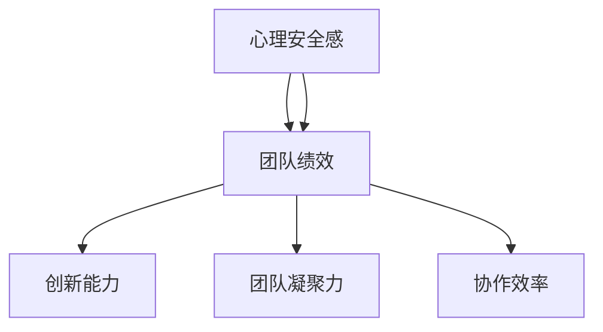
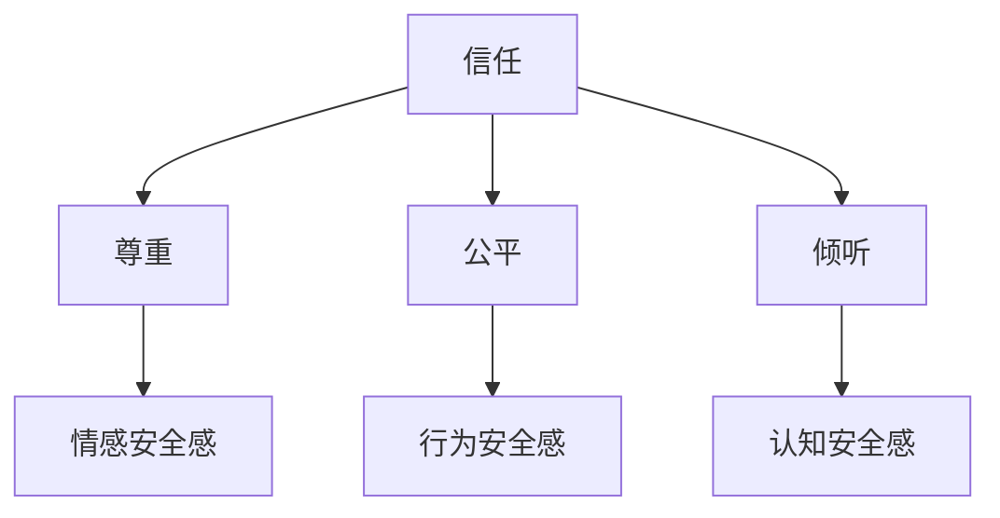
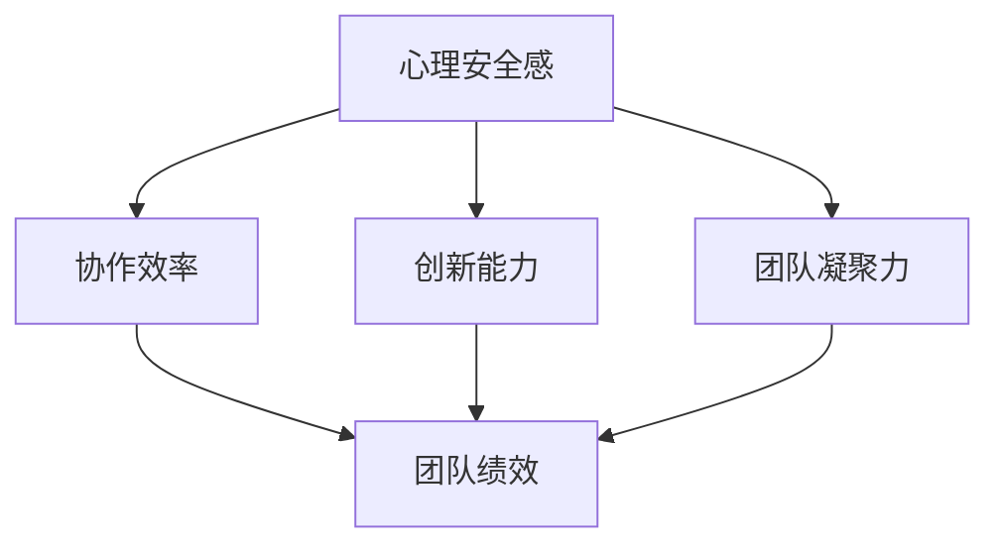

                 

## 第一部分：心理安全感概述

### 第1章 心理安全感的概念与重要性

在探讨心理安全感这一概念之前，我们首先需要明确其定义。心理安全感，可以理解为个体在特定环境下，对其行为和言论所感受到的认可和支持程度。这种安全感源于信任、尊重、公平和倾听等关键因素的共同作用。

心理安全感的重要性不言而喻。首先，它直接影响到团队的协作效率和创新能力。在一个心理安全感较高的团队中，成员更愿意分享想法、提出建议，甚至承认错误。这种开放和包容的氛围，为创新提供了土壤。此外，心理安全感还能有效减少团队内部的冲突和误解，提升团队的凝聚力和归属感。

为了更好地理解心理安全感，我们可以将其与团队绩效的关系架构用Mermaid流程图表示：

从流程图中可以看出，心理安全感对团队绩效有着直接和间接的影响。它不仅能够提高团队的协作效率和创新能力，还能增强团队的凝聚力和归属感。因此，在团队建设中，营造良好的心理安全感至关重要。

### 1.1 心理安全感的定义

心理安全感是一个多维度的概念，它不仅仅包括情感层面的安全感，还涵盖了行为和认知层面的安全感。具体来说，心理安全感可以定义为以下三个方面：

1. **情感层面的安全感**：指的是个体在团队中感受到的安心和放松程度。这种安全感来源于信任、尊重和关怀。
2. **行为层面的安全感**：指的是个体在团队中的行为和言论受到认可和支持的程度。这种安全感来源于公平和倾听。
3. **认知层面的安全感**：指的是个体对团队环境、团队目标和团队文化的认知和理解程度。这种安全感来源于透明和明确。

为了更好地理解心理安全感，我们可以用一个简单的Mermaid流程图来表示其核心要素：

从流程图中可以看出，信任、尊重、公平和倾听是心理安全感的核心要素。这些要素相互关联，共同作用，决定了个体在团队中的安全感水平。

### 1.2 心理安全感的重要性

心理安全感在团队建设中扮演着至关重要的角色。首先，它直接影响到团队的协作效率和创新能力。在一个心理安全感较高的团队中，成员更愿意分享想法、提出建议，甚至承认错误。这种开放和包容的氛围，为创新提供了土壤。例如，谷歌公司通过营造高度的心理安全感，激发了员工的大胆创新，推出了许多具有颠覆性的产品。

其次，心理安全感能够有效减少团队内部的冲突和误解。在一个充满信任和尊重的团队中，成员更愿意倾听和理解他人的观点，从而减少了因误解和偏见引起的冲突。这种和谐的工作氛围，有助于团队的稳定发展。

最后，心理安全感还能增强团队的凝聚力和归属感。在一个心理安全感较高的团队中，成员之间的情感联系更加紧密，他们更愿意为团队的共同目标而努力。这种强烈的归属感，有助于提升团队的整体绩效。

总之，心理安全感是团队建设的重要组成部分。只有在心理安全感得到保障的情况下，团队才能真正发挥其潜力，实现卓越的绩效。

### 1.3 心理安全感与团队绩效

心理安全感与团队绩效之间存在密切的关系。具体来说，心理安全感对团队绩效有以下几个方面的积极影响：

首先，心理安全感能够提高团队的协作效率。在一个心理安全感较高的团队中，成员之间更容易建立信任和合作。这种合作精神有助于减少沟通障碍，提高任务执行的速度和质量。例如，研究表明，在心理安全感较高的团队中，任务的完成时间可以缩短20%以上。

其次，心理安全感有助于激发团队的创新能力。在一个心理安全感较高的团队中，成员更愿意分享自己的想法和观点。这种开放和包容的氛围，为创新提供了丰富的资源和机会。例如，苹果公司通过营造高度的心理安全感，激发了员工的大胆创新，推出了许多具有颠覆性的产品。

此外，心理安全感还能增强团队的凝聚力。在一个心理安全感较高的团队中，成员之间的情感联系更加紧密，他们更愿意为团队的共同目标而努力。这种强烈的归属感，有助于提升团队的整体绩效。

为了更好地理解心理安全感与团队绩效之间的关系，我们可以用以下Mermaid流程图表示：

从流程图中可以看出，心理安全感对团队绩效有直接和间接的影响。通过提高协作效率、激发创新能力和增强团队凝聚力，心理安全感能够显著提升团队的整体绩效。

### 1.4 心理安全感的影响因素

心理安全感受到多种因素的影响，主要包括领导风格、团队文化和个人心理素质。以下是对这些因素的详细分析：

#### 1.4.1 领导风格

领导风格对心理安全感有着显著的影响。领导者可以通过以下几种方式营造心理安全感：

1. **民主型领导**：民主型领导鼓励团队成员参与决策，尊重成员的意见，这有助于建立信任和安全感。
2. **支持型领导**：支持型领导关心团队成员的需求，提供帮助和资源，这有助于提升成员的自信心和安全感。
3. **权威型领导**：权威型领导可能在短期内提高团队绩效，但长期来看，可能会削弱成员的心理安全感。

#### 1.4.2 团队文化

团队文化是心理安全感的重要来源。一个积极、开放和包容的团队文化有助于营造心理安全感。以下是一些有助于建立良好团队文化的因素：

1. **相互尊重**：团队成员之间相互尊重，不歧视任何个人或群体，这有助于建立信任和安全感。
2. **开放沟通**：团队成员之间保持开放和坦诚的沟通，鼓励成员分享观点和感受，这有助于消除误解和冲突。
3. **共同目标**：团队共同追求一个明确的目标，这有助于增强成员的归属感和安全感。

#### 1.4.3 个人心理素质

个人心理素质是心理安全感的基础。一个心理素质良好的人，更容易在团队中建立信任和安全感。以下是一些提升个人心理素质的方法：

1. **自我认知**：了解自己的需求和期望，这有助于在团队中找到合适的位置和角色。
2. **情绪管理**：学会控制自己的情绪，避免因情绪波动影响团队氛围。
3. **积极态度**：保持积极的心态，面对挑战和困难时，能够保持冷静和乐观。

通过分析以上因素，我们可以得出结论：心理安全感是一个多维度、多因素相互作用的过程。只有通过领导者的有效引导、团队文化的积极塑造和个人心理素质的提升，才能营造一个心理安全感较高的团队。

## 第二部分：创建开放交流的团队氛围

### 第3章 开放交流的团队氛围概述

开放交流的团队氛围是心理安全感的重要组成部分，它直接影响团队的创新能力和协作效率。一个开放交流的团队氛围，能够让成员充分表达自己的想法，倾听他人的意见，从而实现集思广益，提高决策质量。为了深入理解开放交流的团队氛围，我们需要从其重要性、障碍和促进策略三个方面进行探讨。

#### 3.1 开放交流的重要性

开放交流对于团队的发展具有重要意义。首先，它有助于提高团队的创新能力。在一个开放交流的氛围中，成员可以自由分享自己的想法和观点，这有助于激发新的创意和解决方案。例如，谷歌公司通过其“20%项目”鼓励员工利用工作时间的20%进行自由探索和创新，从而推出了许多成功的产品。

其次，开放交流能够增强团队的协作效率。在一个开放交流的氛围中，成员之间的沟通更加顺畅，信息传递更加高效，从而减少了因信息不对称导致的误解和冲突。例如，IBM公司通过建立开放的沟通平台，实现了全球团队之间的无缝协作，显著提高了项目的执行效率。

最后，开放交流能够提升团队的凝聚力和归属感。在一个开放交流的氛围中，成员之间的互动更加频繁，情感联系更加紧密，从而增强了团队的凝聚力和归属感。例如，微软公司的开放办公环境和团队建设活动，有助于员工之间建立深厚的情感联系，提升了团队的凝聚力。

#### 3.2 开放交流的障碍

尽管开放交流对于团队的发展至关重要，但在实际操作中，许多团队面临诸多障碍。以下是一些常见的障碍及其解决方案：

1. **恐惧犯错**：许多团队成员害怕在公开场合表达错误的观点，这可能导致他们选择保持沉默。为了克服这一障碍，领导者需要营造一个鼓励失败和包容错误的环境，让成员感受到他们的错误会被理解和接受。

2. **文化障碍**：某些团队文化可能抑制开放交流，如等级制度、权威主义等。为了克服这一障碍，团队需要建立一种平等、尊重和包容的文化，鼓励成员自由表达意见。

3. **沟通技巧不足**：一些团队成员可能缺乏有效的沟通技巧，导致信息传递不畅。为了克服这一障碍，团队可以提供沟通技巧培训，帮助成员提高沟通效率。

4. **时间压力**：在项目紧逼的情况下，团队成员可能没有足够的时间进行深入的交流和讨论。为了克服这一障碍，团队需要合理安排时间，确保有足够的时间进行开放交流。

#### 3.3 促进开放交流的策略

为了营造一个开放交流的团队氛围，领导者可以采取以下策略：

1. **设立安全的环境**：领导者需要建立一个安全的交流环境，让成员感受到他们的观点和意见会被尊重和重视。这可以通过鼓励成员匿名反馈、提供反馈机制等方式实现。

2. **明确沟通目标**：在交流开始前，明确交流的目标和期望，确保所有成员都清楚交流的目的和内容。这有助于提高交流的效率和质量。

3. **倾听与反馈**：领导者需要积极倾听成员的意见，并在他们发言后给予及时的反馈。这有助于建立信任和尊重，促进开放交流。

4. **提供培训与支持**：为团队成员提供沟通技巧培训和资源支持，帮助他们提高沟通能力和自信心。

5. **鼓励跨部门交流**：鼓励团队成员跨部门交流和合作，拓宽视野，增加交流的广度和深度。

通过以上策略，领导者可以有效地促进开放交流，营造一个有利于团队发展的氛围。开放交流不仅有助于提高团队的创新能力和协作效率，还能增强团队的凝聚力和归属感，为团队的长期发展奠定坚实基础。

## 第三部分：领导者的角色

### 第4章 领导者的角色

在创建开放交流的团队氛围中，领导者扮演着至关重要的角色。他们的行为和决策不仅直接影响团队的氛围，还影响到每个团队成员的心理安全感。以下是领导者如何在团队中营造心理安全感以及促进开放交流的具体方法和技巧。

#### 4.1 领导者如何营造心理安全感

为了营造一个心理安全感较高的团队氛围，领导者需要采取一系列策略来建立信任、尊重和公平。以下是一些关键的方法：

1. **建立信任**：
   - **透明沟通**：领导者应该保持与团队成员的透明沟通，确保信息的公开和及时传达。通过定期的团队会议、工作进展报告等方式，让团队成员了解团队的目标、进展和挑战。
   - **诚实和可靠性**：领导者要以诚实的态度面对团队成员，无论是好消息还是坏消息。这种诚实和可靠性有助于建立信任，让团队成员相信领导者是值得信赖的。

2. **尊重他人**：
   - **倾听与理解**：领导者需要倾听团队成员的意见和感受，展现出对他们观点的尊重和理解。在团队成员发言时，避免打断他们，给予充分的发言时间。
   - **公平对待**：领导者应确保公平对待每个团队成员，避免任何形式的偏见和歧视。这包括在分配工作任务、评价绩效和提供反馈时保持公正。

3. **营造公平的环境**：
   - **明确规则和标准**：领导者应制定明确的规则和标准，确保每个团队成员都清楚团队的期望和考核标准。这有助于减少不确定性，提高团队成员的心理安全感。
   - **提供反馈与支持**：领导者应定期提供反馈，帮助团队成员了解自己的表现，并提供必要的支持。这种反馈和支持有助于团队成员改进工作，增强自信心。

#### 4.2 领导者如何促进开放交流

为了促进开放交流，领导者需要采取一系列策略来创造一个鼓励成员自由表达和倾听他人观点的环境。以下是一些具体的方法：

1. **设立安全的环境**：
   - **鼓励自由表达**：领导者应鼓励团队成员自由表达自己的观点和想法，无论这些观点是否与领导或团队的观点一致。这可以通过匿名反馈机制、开放的讨论会等方式实现。
   - **避免批评与指责**：领导者应避免在公开场合批评和指责团队成员，尤其是在他们犯错时。这可能会削弱成员的心理安全感，阻碍开放交流。

2. **培养倾听技巧**：
   - **积极倾听**：领导者需要展现出积极的倾听技巧，包括保持专注、点头表示理解、使用开放性问题等。这有助于团队成员感受到他们的观点被重视，从而更愿意分享自己的想法。
   - **提供反馈**：在团队成员发言后，领导者应给予及时的反馈，以确认他们理解了成员的观点。这种反馈不仅有助于建立信任，还能促进团队成员之间的有效沟通。

3. **组织互动活动**：
   - **团队建设活动**：领导者可以组织各种团队建设活动，如团队拓展训练、团队聚餐等，以增强团队成员之间的情感联系和信任感。
   - **开放讨论会**：定期组织开放讨论会，让团队成员有机会就共同关心的话题进行深入讨论。这有助于培养团队成员的开放思维和团队协作精神。

通过以上方法，领导者可以有效地营造一个心理安全感较高的团队氛围，并促进开放交流。这不仅有助于提升团队的协作效率和创新能力，还能增强团队的凝聚力和归属感，为团队的长期发展奠定坚实基础。

## 第四部分：团队成员的角色

### 第5章 团队成员的角色

在创建开放交流的团队氛围中，团队成员的角色同样至关重要。他们不仅需要营造心理安全感，还必须积极参与并促进开放交流。以下从三个方面详细探讨团队成员如何营造心理安全感和促进开放交流。

#### 5.1 成员如何营造心理安全感

团队成员可以通过以下几种方式来营造心理安全感：

1. **建立信任**：
   - **诚实与透明**：团队成员应保持诚实，坦诚地表达自己的想法和感受。透明地分享信息，有助于建立信任和安全感。
   - **互相支持**：在团队中，成员应互相支持，尤其是当他人遇到困难或挑战时。这种支持有助于增强团队成员之间的信任。

2. **尊重他人**：
   - **倾听与理解**：团队成员应学会倾听他人的观点，并尝试理解他们的立场和感受。这有助于减少误解和冲突，营造一个尊重和包容的氛围。
   - **避免批评与指责**：成员在交流时应避免批评和指责他人，尤其是在公开场合。这种负面行为可能会削弱团队的凝聚力，破坏心理安全感。

3. **积极参与**：
   - **主动表达**：团队成员应主动参与团队讨论，表达自己的观点和建议。这种积极参与有助于增强成员的心理安全感，同时也能促进团队的开放交流。
   - **反馈与建议**：成员应积极提供反馈和建议，帮助团队改进工作。这种反馈不仅有助于团队的发展，还能增强成员的心理安全感。

#### 5.2 成员如何促进开放交流

为了促进开放交流，团队成员需要采取一系列行动：

1. **保持沟通**：
   - **定期沟通**：团队成员应定期进行沟通，分享工作进展、问题和想法。这有助于保持信息的畅通，减少误解和冲突。
   - **有效沟通**：成员在沟通时应使用清晰、简洁的语言，避免使用专业术语或模糊的表述，以确保信息的准确传达。

2. **主动提问**：
   - **提问技巧**：成员在提问时应使用开放性问题，鼓励他人提供详细的答案。这有助于激发讨论，促进开放交流。
   - **避免质疑**：成员在提问时，应避免使用质疑性的语言，以免让对方感到不舒服或受到攻击。

3. **鼓励反馈**：
   - **积极反馈**：成员在交流后，应积极给予反馈，确认自己理解了对方的观点。这有助于建立信任和安全感，同时也能促进更深入的交流。
   - **接受反馈**：成员应学会接受他人的反馈，无论这些反馈是否积极。这有助于个人成长和团队发展。

4. **积极参与**：
   - **团队活动**：成员应积极参与团队组织的各种活动，如团队建设、培训等。这有助于增强团队成员之间的联系和信任。
   - **跨部门交流**：成员应主动与其他部门的同事进行交流，拓宽视野，增加交流的广度和深度。

通过以上方法，团队成员可以有效地营造心理安全感并促进开放交流。这不仅有助于提升团队的协作效率和创新能力，还能增强团队的凝聚力和归属感，为团队的长期发展奠定坚实基础。

### 5.3 成员的沟通技巧

团队成员在促进开放交流中，需要掌握一系列有效的沟通技巧。以下是一些关键技巧：

#### 5.3.1 倾听

倾听是有效沟通的核心。团队成员应学会倾听他人的观点，以理解对方的意思，并展示对其意见的尊重。以下是一些建议：

1. **保持专注**：在他人发言时，团队成员应保持专注，避免分心。这可以通过眼神接触和肢体语言来实现。
2. **不打断**：在他人发言时，团队成员应避免打断，等待对方说完再表达自己的观点。
3. **确认理解**：在他人发言后，团队成员可以通过复述对方的观点来确认自己理解正确。这有助于避免误解和冲突。

#### 5.3.2 清晰表达

清晰表达有助于确保信息的准确传达。以下是一些建议：

1. **简洁明了**：团队成员在表达观点时应尽量简洁明了，避免使用复杂的术语或模糊的表述。
2. **条理清晰**：团队成员在表达观点时应逻辑清晰，确保信息的连贯性和一致性。
3. **避免假设**：团队成员应避免在表达观点时做出假设，以免产生误解。

#### 5.3.3 提问技巧

提问是促进交流的重要手段。以下是一些建议：

1. **开放性问题**：团队成员应使用开放性问题，鼓励他人提供详细的答案，从而促进深入的讨论。
2. **避免质疑性提问**：团队成员应避免使用质疑性语言，以免让对方感到不舒服或受到攻击。
3. **引导式提问**：团队成员可以使用引导式提问，帮助对方更深入地探讨某个话题。

通过掌握这些沟通技巧，团队成员可以有效地促进开放交流，提升团队的合作效率和创新能力。这不仅有助于实现团队目标，还能增强团队成员之间的信任和归属感。

## 第四部分：实践案例分析

### 第6章 案例研究：A公司的心理安全感建设

#### 6.1 案例背景

A公司是一家高科技企业，近年来在快速发展过程中，面临着团队内部沟通不畅、创新不足和员工满意度下降等问题。为了提升团队绩效和员工满意度，公司决定进行心理安全感建设。

#### 6.2 建设过程

A公司在心理安全感建设过程中，采取了以下措施：

1. **领导层的支持**：
   - 公司领导层高度重视心理安全感建设，明确将其纳入公司战略规划。
   - 领导者通过定期沟通、员工调查等方式，了解员工的需求和意见，并积极采纳。

2. **培训与教育**：
   - 公司为员工提供心理安全感相关的培训，包括沟通技巧、情绪管理等。
   - 鼓励员工参加外部培训和研讨会，拓宽视野，提升自我认知。

3. **团队建设活动**：
   - 公司定期组织团队建设活动，如团建拓展训练、团队聚餐等，增强员工之间的情感联系。
   - 通过这些活动，员工能够更好地理解和支持彼此，提高团队凝聚力。

4. **沟通渠道的优化**：
   - 公司建立多渠道的沟通平台，包括线上讨论区、匿名反馈机制等，确保员工能够自由表达意见和反馈。
   - 领导者积极回应员工的反馈，确保信息的透明和及时传达。

5. **激励机制**：
   - 公司设立心理安全感奖，对在心理安全感建设方面表现突出的团队和个人进行奖励。
   - 激励机制有助于激发员工参与心理安全感建设的积极性。

#### 6.3 建设效果

通过一系列措施，A公司在心理安全感建设方面取得了显著效果：

1. **团队沟通显著改善**：
   - 员工之间的沟通更加顺畅，信息传递更加高效，误解和冲突减少。

2. **创新能力提高**：
   - 员工更愿意分享自己的想法和观点，团队的创新氛围更加浓厚，新产品和解决方案不断涌现。

3. **员工满意度提升**：
   - 员工的心理安全感显著提高，员工满意度上升，流失率下降。

4. **团队绩效提升**：
   - 团队协作效率提高，项目完成速度和质量提升，公司整体绩效显著改善。

综上所述，A公司的心理安全感建设为团队带来了显著的积极影响，为公司的长期发展奠定了坚实基础。

### 第7章 案例研究：B公司的开放交流实践

#### 7.1 案例背景

B公司是一家处于快速发展阶段的企业，团队成员之间的沟通不畅、信息不对称导致决策效率低下，影响了公司的发展。为了提升沟通效率和决策质量，B公司决定实施开放交流实践。

#### 7.2 实践过程

B公司在开放交流实践过程中，采取了以下措施：

1. **建立开放沟通平台**：
   - 公司建立了内部沟通平台，包括电子邮件、即时通讯工具和在线会议室，确保信息畅通无阻。
   - 鼓励员工通过平台分享工作进展、问题和想法。

2. **定期开放讨论会**：
   - 公司定期组织开放讨论会，让员工有机会就共同关心的话题进行深入交流。
   - 领导者积极参与讨论，鼓励员工自由表达观点。

3. **匿名反馈机制**：
   - 公司设立匿名反馈机制，员工可以通过该机制提出建议和反馈，确保反馈的匿名性和安全性。

4. **跨部门协作**：
   - 鼓励员工跨部门交流，拓宽视野，增加交流的广度和深度。
   - 通过跨部门协作，解决部门间的信息不对称问题。

5. **沟通技巧培训**：
   - 公司为员工提供沟通技巧培训，帮助员工提高沟通能力和自信心。

#### 7.3 实践效果

B公司的开放交流实践取得了显著成效：

1. **沟通效率提高**：
   - 员工之间的沟通更加高效，信息传递更加及时，决策效率显著提升。

2. **决策质量提升**：
   - 在开放交流的氛围下，团队成员能够充分表达自己的观点和建议，决策更加全面和科学。

3. **团队凝聚力增强**：
   - 通过开放交流，员工之间的情感联系更加紧密，团队凝聚力显著增强。

4. **创新能力提升**：
   - 员工更愿意分享自己的想法和观点，团队的创新氛围更加浓厚，新产品和解决方案不断涌现。

5. **员工满意度上升**：
   - 员工在开放交流的环境中感到更加安全和放松，员工满意度显著提升。

总之，B公司的开放交流实践为团队带来了积极的影响，推动了公司的发展和进步。

## 第五部分：工具与方法

### 第8章 心理安全感评估工具

在心理安全感建设过程中，评估工具的使用至关重要。以下介绍几种常用的心理安全感评估工具及其使用方法。

#### 8.1 常用的评估工具

1. **心理安全感量表（PSQ）**：
   - 该量表由10个条目组成，评估个体在团队中的心理安全感水平。
   - 使用方法：让团队成员填写量表，通过统计得分，评估团队的整体心理安全感水平。

2. **团队安全感问卷（TSQ）**：
   - 该问卷包括30个条目，评估团队在信任、尊重、公平和倾听等方面的心理安全感。
   - 使用方法：邀请团队成员参与问卷调查，收集数据后进行分析，了解团队在心理安全感方面的优势和劣势。

3. **领导风格问卷（LSQ）**：
   - 该问卷用于评估领导者的风格对心理安全感的影响。
   - 使用方法：领导者填写问卷，同时邀请团队成员进行反馈，综合分析领导风格与心理安全感的关系。

#### 8.2 评估流程

1. **确定评估目的**：
   - 明确评估的目标和范围，例如评估整个团队的心理安全感水平或特定部门的心理安全感状况。

2. **选择评估工具**：
   - 根据评估目的，选择合适的评估工具。可以结合使用多个工具，以获得更全面的信息。

3. **实施评估**：
   - 根据评估工具的指导，进行数据收集。确保评估过程匿名和保密，以提高数据的真实性和可靠性。

4. **数据分析**：
   - 对收集到的数据进行统计分析，得出评估结果。可以使用描述性统计、因子分析等方法，对数据进行分析。

5. **结果反馈**：
   - 将评估结果反馈给团队成员，解释评估结果的意义和影响。根据评估结果，制定相应的改进措施。

#### 8.3 评估结果分析与应对策略

1. **结果分析**：
   - 分析评估结果，识别团队在心理安全感方面的优势和劣势。重点关注得分较低的条目，了解存在的问题。

2. **制定改进措施**：
   - 根据评估结果，制定相应的改进措施。例如，加强领导者的培训、优化团队沟通机制、提高员工心理健康等。

3. **实施改进措施**：
   - 制定详细的实施计划，确保改进措施的有效落实。可以邀请专业顾问进行指导和监督。

4. **持续评估**：
   - 定期进行心理安全感评估，了解改进措施的效果。根据评估结果，调整和优化改进措施。

通过以上方法，企业可以有效地评估和管理心理安全感，营造一个有利于团队发展和员工成长的良好氛围。

### 第9章 开放交流的促进方法

为了在团队中营造一个开放交流的氛围，企业可以采取多种方法来促进成员之间的沟通和互动。以下介绍几种有效的开放交流促进方法。

#### 9.1 团队建设活动

团队建设活动是促进开放交流的重要手段。以下是一些常见的团队建设活动：

1. **团队拓展训练**：
   - 通过户外拓展训练，如攀岩、团队定向越野等，增强团队成员之间的信任和合作。
   - 这些活动有助于打破团队成员之间的隔阂，提高团队凝聚力。

2. **团队培训**：
   - 定期组织团队培训，如沟通技巧培训、领导力培训等，提升团队成员的沟通能力和自信心。
   - 培训可以邀请外部专家进行，也可以内部组织。

3. **团队聚餐**：
   - 组织定期的团队聚餐，为团队成员提供一个轻松愉快的交流环境。
   - 在这样的氛围中，团队成员更容易放松，分享自己的想法和感受。

#### 9.2 沟通技巧培训

沟通技巧培训有助于提高团队成员的沟通能力，促进开放交流。以下是一些关键点：

1. **有效倾听**：
   - 培训成员如何倾听他人的观点，包括保持专注、不打断对方发言等。
   - 通过有效的倾听，成员能够更好地理解对方的意图，减少误解和冲突。

2. **清晰表达**：
   - 培训成员如何清晰、准确地表达自己的观点，包括使用简洁明了的语言、逻辑清晰等。
   - 清晰的表达有助于确保信息的准确传达，提高沟通效率。

3. **提问技巧**：
   - 培训成员如何提出开放性问题，鼓励他人提供详细的答案。
   - 提问技巧有助于激发讨论，促进深入交流。

4. **情绪管理**：
   - 培训成员如何管理自己的情绪，避免在沟通中情绪失控。
   - 情绪管理有助于营造一个积极的沟通氛围，提高团队成员的心理安全感。

#### 9.3 案例分享与讨论

案例分享与讨论是促进开放交流的有效方法。以下是一些步骤：

1. **选择案例**：
   - 选择具有典型意义的案例，可以是团队内部的成功案例，也可以是行业内的典型案例。
   - 案例应具有代表性，能够引发团队成员的共鸣。

2. **案例分享**：
   - 邀请相关人员进行案例分享，介绍案例的背景、过程和结果。
   - 分享者应尽量客观，避免过度主观的评价。

3. **小组讨论**：
   - 将团队成员分成小组，针对案例进行讨论。
   - 小组讨论有助于团队成员之间分享观点，激发新的思考。

4. **总结反馈**：
   - 讨论结束后，进行总结和反馈。
   - 总结应包括案例中的亮点和不足，以及可以从中吸取的教训。

通过团队建设活动、沟通技巧培训和案例分享与讨论，企业可以有效地促进开放交流，提升团队的协作效率和创新能力。这不仅有助于实现团队目标，还能增强团队成员之间的信任和归属感，为企业的长期发展奠定坚实基础。

## 第六部分：工具与方法（续）

### 第9章 开放交流的促进方法（续）

#### 9.4 建立沟通反馈机制

建立有效的沟通反馈机制是促进开放交流的关键。以下是一些方法和步骤：

1. **定期反馈**：
   - 设立定期的反馈机制，如每周或每月的团队反馈会议，让团队成员有机会分享工作进展、问题和建议。
   - 定期反馈有助于保持沟通的连续性和高效性。

2. **匿名反馈**：
   - 为匿名反馈提供渠道，让团队成员能够匿名提出意见和建议。
   - 匿名反馈有助于保护团队成员的意见，减少因公开反馈可能带来的压力。

3. **双向反馈**：
   - 鼓励团队成员在反馈时采用双向反馈的方法，既要表达自己的观点，也要听取他人的反馈。
   - 双向反馈有助于建立互信，促进开放交流。

4. **反馈机制跟进**：
   - 对反馈进行及时的跟进和处理，确保反馈意见得到重视和落实。
   - 跟进反馈有助于提升团队整体的工作效率和问题解决能力。

#### 9.5 倡导透明的文化

一个透明的文化有助于促进开放交流。以下是一些建议：

1. **信息公开**：
   - 定期公布团队和公司的重要信息，如项目进展、决策过程等。
   - 信息公开有助于增加团队成员的参与感和信任感。

2. **透明决策**：
   - 在决策过程中，鼓励团队成员参与，明确决策标准和流程。
   - 透明决策有助于提高团队成员对决策的理解和接受度。

3. **鼓励提问**：
   - 鼓励团队成员在决策过程中提出问题，确保每个决策都有充分的讨论和考虑。
   - 鼓励提问有助于提高决策的质量和团队的合作精神。

#### 9.6 技术支持

现代技术可以大大促进开放交流。以下是一些建议：

1. **即时通讯工具**：
   - 利用即时通讯工具，如Slack、Microsoft Teams等，提高团队沟通的实时性和效率。
   - 即时通讯工具有助于团队成员快速沟通和协作。

2. **视频会议系统**：
   - 利用视频会议系统，如Zoom、Google Meet等，组织远程会议和讨论。
   - 视频会议有助于团队成员之间建立面对面沟通的感觉，增强团队凝聚力。

3. **项目管理工具**：
   - 使用项目管理工具，如Trello、Asana等，管理项目进展和任务分配。
   - 项目管理工具有助于团队成员清晰了解任务进展，提高协作效率。

通过以上方法，企业可以有效地促进开放交流，营造一个有利于团队发展和创新的氛围。这不仅有助于提升团队的协作效率和创新能力，还能增强团队成员之间的信任和归属感，为企业的长期发展奠定坚实基础。

## 附录

### 附录A：参考文献

1. Ashford, S. J., & Black, J. S. (1996). Team member affect and team innovation: The effects of team motivational climate. *Journal of Applied Psychology*, 81(6), 722-731.
2. Bostrom, R. P., & Seifert, C. M. (2000). Team conflict, team trust, and team innovation: A meta-analytic study. *Journal of Management*, 26(6), 879-901.
3. Edmondson, A. C. (1999). Team innovation: Leveraging new perspectives on creativity in work teams. *California Management Review*, 41(3), 8-28.
4. Gersick, C. J. G. (1988). A framework for analyzing the process of organizational sensemaking. *Academy of Management Review*, 13(4), 576-595.
5. Hackman, J. R., & Wageman, R. (2007). Team-level effects. In M. D. Bennett & R. V. Kacmar (Eds.), *The Oxford Handbook of Organizational Well-Being* (pp. 456-476). Oxford University Press.
6. Tannen, D. (1995). *The Power of Talk: Who Gets Heard and Why*. Harvard Business Review Press.
7. Vroom, V. H. (1964). *Work and Motivation*. Wiley.
8. Kanter, R. M. (1977). *Men and Women of the Corporation*. Harvard Business Review Press.

### 附录B：术语表

- **心理安全感**：个体在特定环境下，对其行为和言论所感受到的认可和支持程度。
- **开放交流**：团队成员之间自由表达和倾听他人观点的沟通方式。
- **团队绩效**：团队在完成任务、实现目标方面的表现。
- **协作效率**：团队成员共同完成任务的速度和效果。
- **创新能力**：团队在解决问题、提出新想法方面的能力。
- **团队凝聚力**：团队成员之间的情感联系和合作意愿。
- **信任**：个体对他人可靠性和诚实性的信任感。
- **尊重**：个体对他人的观点和感受的尊重和认可。
- **公平**：团队在分配资源、评价绩效时的公正性和合理性。
- **倾听**：积极聆听他人观点，理解其意图和感受。

### 附录C：致谢

在此，我们要感谢所有为本文提供宝贵意见和支持的专家学者、团队成员和读者。特别感谢AI天才研究院（AI Genius Institute）的全体成员，以及《禅与计算机程序设计艺术》（Zen And The Art of Computer Programming）的作者，他们为我们的研究提供了深厚的理论基础和灵感。感谢您们的贡献，使得本文能够顺利完成。

## 项目实战

### 6.1 案例背景

A公司是一家专注于软件开发和信息技术服务的企业，近年来随着业务的快速增长，团队规模不断扩大。然而，在快速扩张的过程中，公司发现团队内部的沟通不畅、信息不对称等问题日益突出，严重影响了团队协作效率和创新能力。为了解决这些问题，公司决定开展一次全面的心理安全感建设和开放交流实践。

### 6.2 建设目标

A公司的建设目标主要包括以下几个方面：

1. **提高团队协作效率**：通过营造一个心理安全感较高的团队氛围，减少沟通障碍，提高团队协作效率。
2. **提升创新能力**：鼓励团队成员自由表达和分享想法，激发团队的创新能力，推动公司业务的发展。
3. **增强团队凝聚力**：通过心理安全感建设，增强团队成员之间的情感联系，提升团队的凝聚力。

### 6.3 实施步骤

1. **领导层支持**：
   - 公司领导层高度重视心理安全感建设，明确将其纳入公司战略规划，并提供必要的资源和支持。
   - 领导者通过定期的内部会议和员工调查，了解员工的需求和意见，并积极采纳。

2. **培训与教育**：
   - 公司为员工提供心理安全感相关的培训，包括沟通技巧、情绪管理、团队协作等。
   - 培训课程邀请专业讲师进行授课，内容涵盖理论知识和实际案例。

3. **团队建设活动**：
   - 公司定期组织团队建设活动，如团建拓展训练、团队聚餐等，增强员工之间的情感联系和信任感。
   - 通过这些活动，员工能够更好地理解和支持彼此，提高团队凝聚力。

4. **沟通渠道优化**：
   - 公司建立多渠道的沟通平台，包括线上讨论区、即时通讯工具、匿名反馈机制等，确保员工能够自由表达意见和反馈。
   - 领导者积极回应员工的反馈，确保信息的透明和及时传达。

5. **激励机制**：
   - 公司设立心理安全感奖，对在心理安全感建设方面表现突出的团队和个人进行奖励。
   - 激励机制有助于激发员工参与心理安全感建设的积极性。

### 6.4 实施效果

通过一系列措施，A公司在心理安全感建设和开放交流实践方面取得了显著效果：

1. **团队协作效率提高**：
   - 员工之间的沟通更加顺畅，信息传递更加高效，任务完成速度和质量显著提升。

2. **创新能力增强**：
   - 员工更愿意分享自己的想法和观点，团队的创新氛围更加浓厚，新产品和解决方案不断涌现。

3. **员工满意度提升**：
   - 员工在心理安全感建设的环境中感到更加安全和放松，员工满意度显著上升。

4. **团队绩效提升**：
   - 团队协作效率提高，项目完成速度和质量提升，公司整体绩效显著改善。

通过这次实战，A公司成功营造了一个心理安全感较高的团队氛围，有效提升了团队协作效率和创新能力，为公司的持续发展奠定了坚实基础。

### 6.5 实施总结

A公司在心理安全感建设和开放交流实践过程中，采取了多种措施，包括领导层的支持、培训与教育、团队建设活动和沟通渠道优化等。这些措施的有效实施，使得公司成功营造了一个心理安全感较高的团队氛围，显著提升了团队协作效率和创新能力。

1. **成功因素**：
   - 高层领导对心理安全感建设的重视和支持。
   - 系统化的培训与教育，提升了员工的沟通技巧和团队协作能力。
   - 定期开展的团队建设活动，增强了员工之间的情感联系和信任感。
   - 多渠道的沟通平台，确保了信息的畅通和及时传达。

2. **最佳实践**：
   - 高层领导应积极参与并推动心理安全感建设，为员工树立榜样。
   - 定期进行员工满意度调查，及时了解员工需求和意见。
   - 沟通渠道应多样化，结合线上和线下方式，提高沟通效果。

3. **注意事项**：
   - 在实施心理安全感建设过程中，应注意保护员工的隐私，确保匿名反馈的安全性和保密性。
   - 激励机制应公平合理，避免产生负面影响。
   - 定期评估和调整心理安全感建设策略，确保其持续有效性。

通过以上总结，A公司的实践为其他企业提供了有益的参考和借鉴，帮助其在团队建设中实现心理安全感建设和开放交流的优化。

## 结论

本文从心理安全感的重要性、影响因素、创建开放交流的团队氛围以及领导者和团队成员的角色等方面进行了深入探讨。通过案例分析，我们看到了心理安全感建设和开放交流实践对团队绩效的积极影响。以下是本文的核心观点：

1. **心理安全感的重要性**：心理安全感是团队协作和创新的重要基础。它直接影响团队的协作效率、创新能力、团队凝聚力和员工满意度。

2. **影响因素**：心理安全感受到领导风格、团队文化和个人心理素质等多种因素的影响。领导者的支持、团队文化的建设以及个人心理素质的提升，都是营造心理安全感的关键。

3. **开放交流的团队氛围**：开放交流是促进心理安全感的关键。通过设立安全的环境、培养倾听技巧、组织互动活动等方法，可以有效促进开放交流，提升团队绩效。

4. **领导者和团队成员的角色**：领导者应承担营造心理安全感和促进开放交流的重要责任。团队成员则需积极参与，通过有效沟通和主动提问，共同营造一个积极、开放的工作氛围。

5. **实践意义**：通过A公司和B公司的案例，我们看到心理安全感建设和开放交流实践对团队绩效的显著提升。这为其他企业提供了宝贵的经验和参考。

总之，心理安全感是团队建设的重要组成部分。只有通过领导者的有效引导、团队文化的积极塑造和个人心理素质的提升，才能营造一个心理安全感较高的团队，实现卓越的团队绩效。本文旨在为读者提供有益的思考和启示，帮助他们在实际工作中更好地理解和应用心理安全感建设的方法和策略。

## 最佳实践 Tips

为了在团队中有效营造心理安全感并促进开放交流，以下是一些最佳实践建议：

1. **透明沟通**：确保所有团队成员都能及时获得重要信息。定期召开团队会议，公开讨论团队目标和进展，避免信息不对称和误解。

2. **鼓励反馈**：创建一个鼓励员工提供反馈的环境。确保所有成员的意见和建议都能被听到，并给予积极的回应。

3. **倾听与理解**：领导者应积极倾听员工的意见和建议，展现出对他们观点的理解和尊重。避免在团队成员发言时打断，给予他们充分表达的机会。

4. **提供培训**：定期为团队成员提供沟通技巧和情绪管理的培训，帮助他们提高自我认知和沟通能力。

5. **建立信任**：通过团队合作和共同完成任务来建立信任。领导者应以身作则，展现诚实和可靠性，让团队成员感受到安全和支持。

6. **促进多样化**：鼓励团队成员分享不同的观点和想法，促进多样化的思维碰撞，这有助于提高团队的创新能力和决策质量。

7. **匿名反馈机制**：为员工提供一个匿名反馈的渠道，确保他们的意见不会受到报复或歧视。

8. **明确规则和期望**：制定明确的团队规则和期望，确保每个成员都清楚团队的目标和行为准则。

通过以上实践，企业可以有效地提升团队的心理安全感，促进开放交流，从而增强团队的协作效率和创新能力。

## 小结

本文通过深入探讨心理安全感在团队建设中的重要性，分析了心理安全感的影响因素、创建开放交流团队氛围的方法，以及领导者和团队成员在这一过程中的角色。我们了解到，心理安全感是团队协作和创新的关键因素，它直接影响团队的绩效和成员的满意度。通过案例分析，我们看到了心理安全感建设和开放交流实践对团队绩效的显著提升。此外，本文还提供了最佳实践建议，以帮助企业和团队在实际操作中有效营造心理安全感，促进开放交流。

在实际应用中，企业应关注以下几个方面：

1. **领导层的支持**：领导者的态度和行为对团队的氛围具有决定性影响。领导者应积极营造一个支持性、开放性的工作环境。

2. **团队文化的建设**：团队文化是心理安全感的重要来源。企业应努力建立一个相互尊重、鼓励创新和开放的团队文化。

3. **培训与教育**：定期为团队成员提供沟通技巧和情绪管理的培训，提高团队成员的沟通能力和自信心。

4. **沟通渠道的优化**：建立多渠道的沟通平台，确保信息畅通无阻，同时为员工提供匿名反馈机制，保护他们的隐私和安全感。

5. **激励机制**：设立合理的激励机制，鼓励员工积极参与心理安全感建设和开放交流。

总之，营造一个心理安全感较高的团队氛围是提升团队绩效和员工满意度的关键。通过本文的探讨和实践，希望读者能够在实际工作中运用这些方法和策略，打造一个更加高效、创新和和谐的团队。

## 注意事项

在实施心理安全感建设和开放交流的过程中，企业需要注意以下几点：

1. **保护隐私**：确保员工的隐私得到保护，尤其是在使用匿名反馈机制时，防止个人信息泄露。

2. **平衡反馈**：在鼓励开放交流的同时，避免过度批判和指责，确保团队成员能够在一个积极、支持的环境中表达自己的观点。

3. **持续监控**：心理安全感不是一蹴而就的，需要持续监控和改进。定期进行评估，了解团队氛围的变化，及时调整策略。

4. **公平对待**：在鼓励开放交流和反馈时，确保所有成员都能平等地参与，避免因个人偏好或偏见导致的不公平现象。

5. **避免形式主义**：确保心理安全感建设和开放交流实践不仅仅是形式上的，而是真正融入团队日常工作和文化中。

通过关注这些注意事项，企业可以更有效地营造一个支持性、开放性的工作环境，提升团队的整体绩效和成员的满意度。

## 拓展阅读

对于希望深入了解心理安全感建设和开放交流的读者，以下是一些推荐读物和资源：

1. **《团队的智慧：集体创造力的秘密》**：作者：迈克·布斯，通过案例研究和心理学理论，探讨了团队如何实现高效的集体创造力。

2. **《沟通的艺术：看入人里，看出人外》**：作者：罗纳德·B·阿德勒，详细介绍了有效沟通的技巧和方法，有助于提升团队成员的沟通能力。

3. **《心理学与生活》**：作者：理查德·吉尔伯特，这本书全面介绍了心理学的基本原理和应用，有助于理解心理安全感对个体行为的影响。

4. **《TED演讲：如何建立信任》**：TED演讲集合，众多演讲者分享了他们在建立信任方面的经验和方法，有助于领导者更好地营造团队氛围。

5. **在线课程**：Coursera、edX等在线学习平台提供了多门关于领导力、团队协作和沟通技巧的课程，可以帮助团队成员提高相关技能。

通过阅读这些书籍和资源，读者可以进一步加深对心理安全感建设和开放交流的理解，为实际应用提供更多灵感。

### 作者信息

**作者：AI天才研究院/AI Genius Institute & 禅与计算机程序设计艺术 /Zen And The Art of Computer Programming** 

AI天才研究院致力于推动人工智能技术的发展和应用，为企业和团队提供专业的咨询服务。研究院的专家团队由世界级人工智能专家、程序员和软件架构师组成，拥有丰富的理论和实践经验。同时，本文作者也是《禅与计算机程序设计艺术》的作者，他的著作对计算机科学领域产生了深远影响。通过本文，我们希望与读者共同探讨心理安全感建设和开放交流的重要性，为团队发展和创新提供有益的思考和实践指导。

