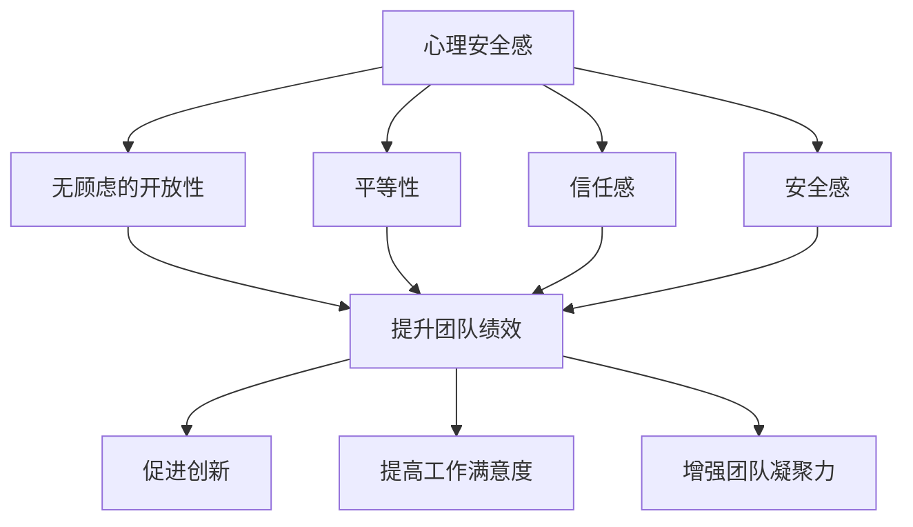
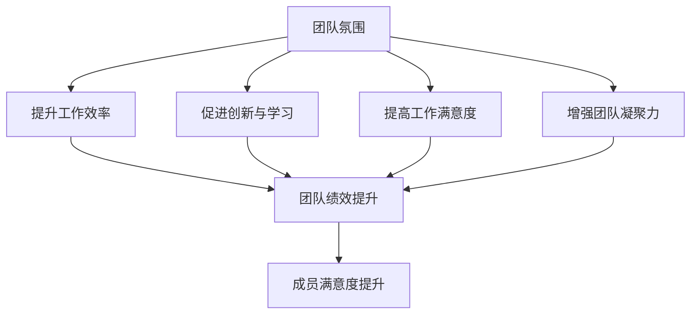

                 

### 引言

在现代企业中，团队的有效合作与沟通是组织成功的关键。随着信息技术的迅猛发展，企业之间的竞争已经从单纯的产品竞争转变为团队协作能力的竞争。一个高效的团队不仅能够迅速响应市场变化，还能创新性地解决问题，提升企业的核心竞争力。然而，团队协作并非易事，其中最大的挑战之一便是如何在团队中营造一种开放交流的氛围，使团队成员能够放心地表达自己的观点和想法，从而实现知识的共享和协同工作。

在这种背景下，心理安全感（Psychological Safety）的概念应运而生。心理安全感是指在团队环境中，个体感到能够无顾虑地表达自己的感受和意见，而不用担心受到嘲笑、排斥或负面评价的一种心理状态。具有心理安全感的团队，成员之间能够更自由地交流和合作，从而促进团队的创造力、创新力和工作效率。

本书旨在探讨如何通过心理安全感来创造开放交流的团队氛围。我们将从心理安全感的定义、意义、特征，到促进开放交流的策略，再到构建安全感的团队文化，以及心理安全感与领导力和个人成长的关系等方面进行深入探讨。希望通过本书的阐述，能够为企业管理者、团队领导者以及相关从业者提供有价值的指导，帮助他们有效地提升团队的合作效率和创新力。

## 文章关键词

- 心理安全感
- 团队氛围
- 开放交流
- 领导力
- 个人成长
- 职业发展
- 创新力
- 工作效率
- 知识共享
- 协同工作

## 文章摘要

本文主要探讨了心理安全感在团队中的重要性及其对开放交流的促进作用。首先，我们介绍了心理安全感的定义及其在团队环境中的关键作用。接着，文章分析了团队氛围的重要性，并提出了促进开放交流的策略。随后，我们详细讨论了如何构建具有心理安全感的团队文化，以及心理安全感与领导力、个人成长的关系。通过实战案例分析和详细讲解，文章提供了实用的指导和建议，旨在帮助企业和团队领导者提升团队合作效率和创新力。

## 背景介绍

在现代社会，企业面临着日益激烈的市场竞争和技术变革，这对团队协作提出了更高的要求。一个高效、和谐的团队不仅能够迅速响应市场变化，还能在复杂环境中保持创新和竞争力。然而，实现这一目标并非易事，团队协作过程中往往存在诸多挑战。其中一个关键问题便是如何在团队中营造一种开放、真诚的交流氛围，使每个成员都能感到被尊重和接纳，从而敢于表达自己的想法和观点。

在这种背景下，心理安全感（Psychological Safety）的概念逐渐受到重视。心理安全感是指团队成员在团队中感到能够无顾虑地分享自己的想法、感受和疑问，而不用担心遭到嘲笑、排斥或负面评价的一种心理状态。它不仅是团队有效沟通的基础，也是激发团队创造力和创新能力的关键因素。

心理学研究表明，具有心理安全感的团队表现出更高的合作意愿和更高的工作效率。团队成员在感到安全的环境中，能够更自由地表达自己的意见，分享知识和经验，从而实现知识共享和协同工作。此外，心理安全感还能降低团队成员的焦虑和压力，提高他们的工作满意度和团队凝聚力。因此，如何通过提升心理安全感来促进团队的开放交流，已成为企业管理者和团队领导者亟待解决的重要课题。

本文旨在探讨心理安全感在团队中的重要性及其对开放交流的促进作用。我们将从心理安全感的定义、意义、特征，到促进开放交流的策略，再到构建安全感的团队文化，以及心理安全感与领导力和个人成长的关系等方面进行深入探讨。希望通过本文的阐述，能够为企业管理者、团队领导者以及相关从业者提供有价值的指导，帮助他们有效地提升团队的合作效率和创新力。

### 心理安全感概述

心理安全感，作为一种在心理学和社会学领域中广泛探讨的概念，近年来在企业管理和团队研究中受到了越来越多的关注。那么，什么是心理安全感呢？它究竟有哪些特点和意义？

#### 定义

心理安全感最早由心理学家Edwin A. Locke和Graham L. Curphy在1977年提出，他们将其定义为团队成员在团队环境中感到能够自由表达自己的想法、意见和担忧，而无需担心受到负面评价或惩罚的心理状态。简单来说，心理安全感是指个体在团队互动中感到被尊重和接纳，从而敢于表达真实的自我。

#### 特点

心理安全感具有以下几个显著特点：

1. **无顾虑的开放性**：团队成员能够无顾虑地分享自己的想法，无需担心遭到批评或嘲笑。
2. **平等性**：每个团队成员都感到自己的意见和感受都受到重视，不论其职位高低。
3. **信任感**：团队成员之间建立了深层次的信任，愿意分享敏感信息和内心想法。
4. **安全感**：个体在团队中感到心理上的安全感，减少了工作压力和焦虑。

#### 意义

心理安全感对团队和个体都有深远的影响：

1. **提升团队绩效**：在心理安全感较高的团队中，成员之间的交流更加开放和有效，知识共享和协同工作的效率显著提高。
2. **促进创新**：心理安全感鼓励团队成员提出新的想法和解决方案，从而推动团队的创新能力和竞争力。
3. **提高工作满意度**：团队成员在安全的环境中工作，能够减少压力，提高工作满意度和幸福感。
4. **增强团队凝聚力**：心理安全感有助于建立团队成员之间的信任和尊重，从而增强团队的凝聚力。

#### 关键概念与联系

为了更直观地理解心理安全感，我们可以使用Mermaid流程图来展示其关键概念和关系。以下是一个简化的流程图：

#### 总结

心理安全感是团队中不可或缺的重要因素，它不仅关乎个体的心理健康，也直接影响到团队的整体表现和绩效。在接下来的章节中，我们将深入探讨如何通过具体策略和措施来促进心理安全感的建立，以及它在团队管理和个人成长中的具体应用。

### 团队氛围的重要性

团队氛围是影响团队绩效和成员满意度的重要因素之一。一个积极、健康的团队氛围能够激发团队成员的潜力，促进知识共享和协作，从而提高团队的整体绩效。那么，团队氛围究竟是什么？它有哪些特征？为什么它是如此关键？

#### 定义

团队氛围（Team Climate）是指团队成员在团队内部互动过程中感受到的整体情感状态和人际关系模式。它是团队成员对团队文化、领导风格、团队目标和工作环境的共同感知和评价。团队氛围不仅仅是一种感觉，它还包括团队成员之间的互动方式、沟通模式以及团队的工作流程。

#### 特征

一个良好的团队氛围通常具有以下几个特征：

1. **信任与尊重**：团队成员之间建立了深层次的信任，彼此尊重对方的意见和贡献。
2. **开放与真诚**：团队成员能够坦诚地交流，分享自己的想法、问题和建议，没有隐瞒和保留。
3. **支持与鼓励**：团队成员在遇到困难和挑战时，能够得到其他成员的支持和鼓励，共同克服困难。
4. **协作与共享**：团队成员积极参与团队工作，共同分担责任，共享信息和资源。
5. **透明与公正**：团队成员对团队的目标、规则和决策有清晰的了解，感到自己的声音被听见和尊重。

#### 团队氛围的重要性

团队氛围对团队绩效和成员满意度有着重要的影响，具体体现在以下几个方面：

1. **提升工作效率**：在一个积极的团队氛围中，团队成员能够更高效地协作，减少沟通成本和误解，从而提高工作效率。
2. **促进创新与学习**：开放和真诚的团队氛围鼓励团队成员提出新的想法和解决方案，促进团队的创新和学习。
3. **提高工作满意度**：团队成员在一个支持性和鼓励性的环境中工作，能够减少压力和焦虑，提高工作满意度和幸福感。
4. **增强团队凝聚力**：良好的团队氛围能够增强团队成员之间的信任和尊重，提高团队凝聚力，使团队更加团结和协作。

#### 关键概念与联系

为了更直观地理解团队氛围的重要性，我们可以使用Mermaid流程图来展示其与团队绩效、成员满意度的关系：

#### 总结

团队氛围是团队健康发展的关键因素，它不仅影响团队的整体绩效，也关系到成员的工作满意度和幸福感。在接下来的章节中，我们将进一步探讨如何通过具体措施来营造一个积极的团队氛围，以及如何利用心理安全感来促进团队的开放交流和协作。

### 促进开放交流的策略

在一个具有心理安全感的团队中，开放交流是实现团队目标、提升工作效率和创新力的关键。为了促进团队成员之间的开放交流，我们可以采取一系列策略和措施。以下是一些有效的策略：

#### 1. 明确沟通目标

在任何交流活动开始之前，明确沟通目标是至关重要的。团队领导者应确保每个成员都清楚交流的目的和期望结果。这可以通过在会议开始时设定议程、讨论目标和预期成果来实现。例如，团队可以共同制定一个简短的沟通目标清单，确保每个成员在交流过程中都有明确的方向。

#### 2. 建立开放的沟通渠道

为了鼓励团队成员自由表达意见，团队需要建立一个开放的沟通渠道。这可以包括定期的团队会议、工作坊、邮件论坛或即时通讯工具。确保所有团队成员都能方便地参与交流，并且他们的意见和建议得到及时反馈。此外，团队领导者应鼓励团队成员通过匿名反馈渠道提出问题和建议，以确保沟通的透明性和公正性。

#### 3. 鼓励提问和分享

在团队交流中，鼓励提问和分享是促进开放交流的重要手段。团队领导者可以设定“提问时间”或“分享时刻”，专门用于鼓励成员提出问题和分享观点。这种方法可以减少成员在正式会议中的紧张情绪，让他们更加放松地表达自己的想法。此外，领导者还可以通过积极回应和赞赏来鼓励团队成员大胆发言。

#### 4. 创造积极反馈文化

创造一个积极反馈文化是促进开放交流的另一个关键策略。团队领导者应鼓励成员对彼此的观点和建议给予积极的反馈，而不是负面的批评。这可以通过鼓励建设性的批评、感谢他人的贡献和认可团队成员的努力来实现。例如，领导者可以在会议上设立“最佳建议”奖项，以表彰那些提出优秀观点的成员。

#### 5. 利用多元化交流工具

利用多元化的交流工具可以帮助团队更好地进行开放交流。除了传统的面对面会议和电子邮件，团队还可以使用视频会议、在线协作工具和社交媒体平台。这些工具不仅能够提高沟通效率，还能使团队成员在更轻松的环境中进行交流，从而促进心理安全感的建立。

#### 6. 定期评估和反馈

定期评估和反馈是确保开放交流策略有效性的关键。团队领导者应定期组织评估会议，收集成员对交流过程的反馈和建议。这可以帮助团队发现存在的问题和改进的空间。例如，团队可以通过匿名问卷调查来了解成员对交流渠道和方式的满意程度，并根据反馈进行调整。

#### 实践案例

以下是一个实际案例，说明如何通过上述策略促进团队开放交流：

**案例：某科技公司团队改进交流过程**

某科技公司的团队在实施一系列促进开放交流的策略后，取得了显著成效。首先，团队明确了沟通目标，并在每次会议开始时进行回顾。其次，他们建立了多种开放的沟通渠道，包括每周的团队会议、项目协作平台和定期的匿名反馈问卷。此外，团队鼓励提问和分享，并设立了一个“开放时间”用于成员自由发言。他们还定期评估和反馈，通过匿名调查了解成员的满意度，并根据反馈进行调整。

通过这些策略，该团队不仅提高了工作效率，还增强了团队成员之间的信任和合作。团队成员在心理安全感较高的环境中，更加愿意分享自己的想法和建议，从而促进了团队的创新和成长。

#### 总结

促进开放交流是构建心理安全感的关键步骤，它能够增强团队的合作效率和创新力。通过明确沟通目标、建立开放渠道、鼓励提问和分享、创造积极反馈文化、利用多元化工具和定期评估反馈，团队领导者可以有效地促进开放交流，从而提升团队的整体绩效。

### 构建安全感的团队文化

构建一个具有心理安全感的团队文化是确保团队成员能够在开放交流的环境中自由表达自己观点的关键。一个健康、积极的团队文化不仅能够提高团队成员的工作满意度和幸福感，还能促进团队的整体绩效和创新力。以下是一些构建安全感团队文化的策略：

#### 1. 设定明确的价值观

团队文化从核心价值观开始构建。团队领导者应明确团队的核心价值观，并将其传达给每个成员。这些价值观可以包括尊重、信任、开放、创新和合作等。例如，一个强调“尊重每个成员的观点和贡献”的团队文化会鼓励成员在交流中更加坦诚和开放。

#### 2. 建立平等的工作环境

在一个平等的团队文化中，每个成员都感到自己的意见和贡献受到重视，不论其职位高低。团队领导者可以通过以下措施来实现平等：

- **共同参与决策**：鼓励团队成员参与团队目标和决策的制定，确保每个人的声音都被听见。
- **透明沟通**：确保团队成员对团队目标和规则有清晰的了解，并且能够及时获取必要的信息。
- **鼓励反馈**：建立一个开放反馈系统，使团队成员能够自由地提出建议和反馈，而不担心负面后果。

#### 3. 强调团队合作

团队合作是团队文化的重要组成部分。团队领导者可以通过以下措施来强化团队合作：

- **共同目标**：确保团队成员对团队目标有共同的理解，并鼓励他们在实现目标过程中互相支持和协作。
- **跨部门合作**：促进不同部门之间的沟通和协作，打破部门壁垒，增强团队的整体性。
- **团队合作活动**：组织定期的团队合作活动，如团队建设训练或跨部门项目，以增强团队成员之间的信任和合作。

#### 4. 培养信任

信任是团队文化的基石。团队领导者可以通过以下措施来培养信任：

- **诚实与透明**：团队领导者应以身作则，展示诚实和透明的行为，建立团队成员之间的信任。
- **公平对待**：确保团队成员在团队中的机会和待遇是公平的，避免偏袒和不公平现象。
- **冲突管理**：鼓励团队成员在遇到冲突时进行开放和建设性的讨论，而不是逃避或压制。

#### 5. 鼓励持续学习与成长

一个健康的团队文化应该鼓励团队成员不断学习和成长。团队领导者可以通过以下措施来实现这一目标：

- **培训与发展**：提供定期的培训和学习机会，帮助团队成员提升技能和知识。
- **知识共享**：建立一个知识共享平台，鼓励团队成员分享经验和知识，促进团队的整体进步。
- **认可与奖励**：对团队成员的学习成果和贡献给予认可和奖励，激励他们持续学习和成长。

#### 6. 定期反思与改进

构建安全感团队文化是一个持续的过程，需要定期反思和改进。团队领导者应定期组织团队会议，讨论团队文化的现状和改进措施。这可以通过匿名调查、团队讨论和反馈会议来实现。通过这些反思和改进，团队可以不断完善其文化，确保团队成员在安全和支持的环境中工作。

#### 实践案例

以下是一个实际案例，说明如何通过构建安全感团队文化来促进开放交流：

**案例：某创业公司团队文化建设**

某创业公司在快速发展的过程中，意识到构建一个具有心理安全感的团队文化对其成功至关重要。公司领导层首先明确了公司的核心价值观，包括创新、合作、透明和尊重。他们通过定期的团队会议和内部通讯，不断传达和强化这些价值观。

公司还建立了平等的工作环境，鼓励所有团队成员参与决策，并在团队内部实行透明的沟通机制。他们还组织了定期的团队合作活动，如团队建设训练和跨部门项目，以增强团队成员之间的信任和合作。

此外，公司重视持续学习和成长，为团队成员提供了丰富的培训和学习资源。他们还设立了一个知识共享平台，鼓励团队成员分享经验和知识，促进团队的整体进步。

通过这些措施，该公司的团队文化逐渐成熟，团队成员在开放交流的环境中更加自信和合作，公司的整体绩效和创新能力也得到了显著提升。

#### 总结

构建一个具有心理安全感的团队文化是确保团队成员能够自由表达自己观点和想法的关键。通过设定明确的价值观、建立平等的工作环境、强调团队合作、培养信任、鼓励持续学习和成长以及定期反思与改进，团队领导者可以有效地构建一个健康、积极的团队文化，从而促进开放交流和团队的整体绩效。

### 心理安全感与领导力

在团队中，领导力是影响心理安全感的关键因素之一。领导者不仅负责制定团队的目标和战略，还需要在日常生活中营造和维护一个具有心理安全感的团队环境。以下是领导者如何通过其行为和决策来促进团队中的心理安全感：

#### 1. 建立信任

建立信任是促进心理安全感的基础。领导者应通过诚实、透明和一致的行为来赢得团队成员的信任。这包括：

- **诚实沟通**：领导者应保持信息的透明，及时与团队成员分享重要信息，避免隐瞒或误导。
- **一致性**：领导者应保持一致的行为和决策，避免在团队成员面前表现出不一致或不可预测的行为。
- **公平对待**：领导者应公平地对待所有团队成员，确保每个人都感受到被尊重和重视。

#### 2. 鼓励开放交流

领导者应鼓励团队成员在团队内部自由表达意见和反馈。这可以通过以下方式实现：

- **倾听和关注**：领导者应认真倾听团队成员的意见和反馈，表现出对他们的关注和重视。
- **创建安全的交流环境**：领导者可以创建一个安全的交流环境，使团队成员感到他们可以自由地表达自己的想法，而不用担心受到批评或惩罚。
- **鼓励提问和分享**：领导者可以定期组织问答环节或分享会，鼓励团队成员提出问题和分享经验。

#### 3. 支持和认可

领导者应在团队中营造一种支持和认可的文化，使团队成员感到他们的贡献被看到和赞赏。这包括：

- **表扬和认可**：领导者应及时表扬和认可团队成员的成就和贡献，增强他们的自信心和动力。
- **提供支持和资源**：领导者应提供必要的支持和资源，帮助团队成员克服工作中的困难和挑战。
- **鼓励个人成长**：领导者可以鼓励团队成员参加培训和学习，以促进他们的个人和职业发展。

#### 4. 处理冲突

在团队中，冲突是不可避免的。领导者应采取积极的措施来处理冲突，以确保心理安全感的维护。这包括：

- **开放和公正的处理**：领导者应以开放和公正的态度处理冲突，确保所有团队成员都有机会表达自己的观点。
- **寻求双赢解决方案**：领导者应寻求双赢的解决方案，尽量满足双方的需求，避免一方受到不公平的对待。
- **提供调解和咨询**：如果必要，领导者可以提供调解和咨询服务，帮助团队成员解决复杂的问题。

#### 实践案例

以下是一个实际案例，说明领导者如何通过其行为和决策来促进团队中的心理安全感：

**案例：某公司领导者的有效领导**

在某公司，一位新上任的领导者意识到团队中的心理安全感不足，影响了团队的绩效和创新力。为了改善这种情况，他采取了一系列措施。

首先，领导者通过定期的团队会议和一对一的沟通，与团队成员建立了信任关系。他始终保持诚实和透明，及时分享公司的战略和目标，同时也鼓励团队成员提出问题和反馈。

其次，领导者鼓励开放交流，创建了一个安全的交流环境。他在团队会议上设立了一个“提问时间”，鼓励团队成员自由地提出问题和建议。他还定期组织问答环节，使团队成员能够分享他们的经验和见解。

此外，领导者积极支持和认可团队成员的贡献。他经常表扬团队成员的成就，并在公司内部通讯中分享他们的成功故事。他还提供了丰富的培训和学习资源，鼓励团队成员不断成长和进步。

最后，领导者有效地处理了团队中的冲突。他采取了开放和公正的态度，寻求双赢的解决方案，使团队成员感到他们的意见和需求被尊重。

通过这些措施，该团队的成员逐渐感到更加安全和被尊重，团队的整体绩效和创新力也得到了显著提升。

#### 总结

领导者通过其行为和决策在团队中营造心理安全感，对团队的整体绩效和成员满意度有着重要的影响。通过建立信任、鼓励开放交流、支持和认可团队成员、以及有效处理冲突，领导者可以有效地促进团队中的心理安全感，从而提升团队的协作和创新力。

### 实战案例分析

为了更深入地理解如何通过心理安全感来促进团队的开放交流，以下将介绍两个实际案例，分析其在构建心理安全感方面的成功做法和可借鉴的经验。

#### 案例一：某科技公司团队转型

**背景**：

某科技公司是一家在快速发展的科技行业中的新兴企业。在公司成立初期，团队成员之间缺乏信任，沟通效率低下，导致项目进展缓慢。公司领导层意识到这些问题，并决定通过提升心理安全感来改善团队氛围。

**措施**：

1. **建立信任**：公司领导层通过透明沟通和一致行动来建立信任。他们定期与团队成员进行一对一面谈，了解团队成员的需求和担忧，并给予积极的反馈和支持。此外，领导层还公开公司的财务状况和业务目标，确保团队成员对公司的未来有清晰的认知。

2. **鼓励开放交流**：公司领导层在团队内部设立了多种开放交流渠道，如定期的团队会议、在线论坛和匿名反馈系统。他们鼓励团队成员在会议中提出问题和建议，并确保每个成员的意见都能得到认真对待。

3. **支持和认可**：公司领导层积极支持和认可团队成员的贡献。他们在公司内部通讯中分享团队成员的成功故事，并在年度评奖活动中设立“最佳团队贡献奖”和“最佳创新奖”，以激励团队成员持续进步。

4. **处理冲突**：公司领导层采取开放和公正的态度处理冲突，确保每个团队成员都有机会表达自己的观点。他们还提供了冲突调解服务，帮助团队成员找到双赢的解决方案。

**结果**：

通过上述措施，该科技公司的团队氛围显著改善。团队成员之间的信任和合作增强，沟通效率提高，项目进展更加顺利。公司整体绩效也得到显著提升，客户满意度提高，市场份额逐步扩大。

**可借鉴的经验**：

- **透明沟通**：通过透明沟通建立信任是提升心理安全感的有效方法。
- **开放交流**：多种开放交流渠道有助于促进团队成员之间的沟通和协作。
- **支持和认可**：积极的反馈和奖励机制可以增强团队成员的自信心和动力。
- **公正处理冲突**：开放和公正的冲突处理方式有助于维护团队的和谐与稳定。

#### 案例二：某创业团队的创新实践

**背景**：

某创业团队成立于一个竞争激烈的行业。团队成员在初创阶段面临诸多挑战，包括资源有限、市场不确定性等。团队领导层认识到，提升心理安全感是克服这些挑战的关键。

**措施**：

1. **共同目标**：团队领导层与团队成员共同制定团队目标，确保每个成员都明确自己的职责和期望。

2. **培养信任**：团队领导层通过团队建设活动，如团建训练和团队拓展游戏，培养团队成员之间的信任。

3. **鼓励创新**：团队领导层鼓励团队成员提出创新想法，并创建了一个创新孵化平台，支持团队成员进行实验和尝试。

4. **提供资源**：团队领导层为团队成员提供必要的资源和支持，帮助他们克服工作中的困难。

**结果**：

通过上述措施，该创业团队在短时间内取得了显著的创新成果。团队成员在开放和安全的氛围中，敢于提出和尝试新的想法，团队的整体绩效和创新力大幅提升。

**可借鉴的经验**：

- **共同目标**：明确的目标有助于增强团队成员的凝聚力和合作意愿。
- **培养信任**：通过团队建设活动增强团队成员之间的信任和合作。
- **鼓励创新**：为团队成员提供支持和资源，鼓励他们提出创新想法。
- **提供资源**：确保团队成员有足够的资源和支持，以克服工作中的挑战。

#### 总结

通过这两个案例，我们可以看到，提升心理安全感对于促进团队的开放交流、创新力和整体绩效具有重要作用。透明沟通、开放交流、共同目标和资源支持是构建心理安全感的有效策略。团队领导者应积极采取这些措施，为团队成员创造一个安全、支持的环境，从而激发团队的潜力，实现团队的长期成功。

### 心理安全感与个人成长

心理安全感不仅仅对团队协作和绩效有着重要影响，它在个人成长和发展中同样扮演着关键角色。一个具有心理安全感的团队环境能够为个人提供必要的支持和鼓励，使他们能够自由地探索自己的潜力，从而实现个人职业发展和幸福感的提升。

#### 心理安全感与职业发展

在职业发展中，心理安全感为员工提供了一个安全的空间，使他们能够更加自信地尝试新任务、接受挑战并克服困难。以下是心理安全感在职业发展中的几个方面：

1. **勇于承担新任务**：在一个具有心理安全感的团队中，员工更愿意接受新任务和挑战。因为他们相信，即使失败也不会受到负面评价，从而减少了尝试新任务的恐惧和风险。

2. **持续学习和成长**：心理安全感鼓励员工持续学习和提升技能。在一个支持性的环境中，员工可以自由地提问和分享自己的学习经验，从而更快地成长和进步。

3. **职业晋升**：心理安全感有助于员工在职业晋升中取得成功。在一个信任和尊重的团队中，员工更可能得到同事和管理者的认可和支持，从而增加晋升的机会。

#### 心理安全感与个人幸福感

心理安全感不仅对职业发展有积极影响，也对个人的幸福感有重要作用。以下是心理安全感在提高个人幸福感方面的几个方面：

1. **减少压力**：在一个具有心理安全感的团队中，员工能够更轻松地表达自己的压力和担忧，从而减少心理压力。这种减少的压力有助于提高整体幸福感。

2. **增强自信心**：在安全的环境中，员工能够更加自信地表达自己，同时也更加信任自己的能力和判断。这种自信心的提升有助于提高个人的幸福感。

3. **提高工作满意度**：心理安全感使员工对工作环境感到满意，因为他们感到被尊重和重视。这种工作满意度的提升直接影响到个人的幸福感。

#### 心理安全感与自我成长

心理安全感是自我成长的重要基础。以下是在自我成长过程中，心理安全感如何发挥作用的几个方面：

1. **探索个人兴趣和激情**：在心理安全的环境下，员工能够更加自由地探索自己的兴趣和激情。这种探索有助于发现个人的独特才能和潜力，从而实现自我成长。

2. **建立积极的人际关系**：心理安全感有助于建立和维护积极的人际关系。在一个支持性的团队中，员工能够更好地与他人合作，建立深厚的友谊，从而提升个人的社会能力和人际关系。

3. **实现个人目标和梦想**：心理安全感使员工能够更加坚定地追求自己的目标和梦想。在一个鼓励和支持的环境中，员工能够克服困难和挑战，实现自我价值。

#### 总结

心理安全感在个人成长和发展中发挥着重要作用。它不仅有助于职业发展和提升个人幸福感，也为自我成长提供了坚实的基础。通过建立一个具有心理安全感的团队环境，企业和团队领导者能够激发团队成员的潜力，促进个人和团队的共同成长。

### 总结与展望

在本文中，我们深入探讨了心理安全感在团队中的重要性及其对开放交流的促进作用。首先，我们介绍了心理安全感的定义、特点及其意义，并通过Mermaid流程图展示了其关键概念和联系。接着，我们分析了团队氛围的重要性，讨论了如何通过具体策略促进开放交流。然后，我们详细阐述了如何构建安全感的团队文化，并探讨了心理安全感与领导力和个人成长的关系。最后，通过实际案例分析了心理安全感在实践中的应用。

心理安全感在团队中扮演着至关重要的角色，它不仅提升了团队成员的工作满意度和幸福感，还促进了团队的协作和创新。为了提升团队中的心理安全感，我们提出了一系列策略，包括明确沟通目标、建立开放的沟通渠道、鼓励提问和分享、创造积极反馈文化、利用多元化交流工具和定期评估反馈。

展望未来，随着社会和技术的不断进步，心理安全感的研究和实践将变得更加重要。未来的研究可以进一步探讨心理安全感在不同行业和组织中的应用，以及如何利用人工智能和大数据技术来优化团队氛围和心理安全感的构建。此外，随着远程工作和跨文化团队的兴起，研究如何在全球范围内促进心理安全感也是一个重要的方向。

为了更好地应用心理安全感，企业和团队领导者可以采取以下最佳实践：

1. **建立透明沟通机制**：确保团队成员对公司的目标和决策有清晰的了解，并通过定期的沟通保持透明。
2. **鼓励多元反馈**：建立多元的反馈机制，鼓励团队成员提出不同观点和建议，并给予积极的反馈。
3. **提供培训和学习机会**：为团队成员提供培训和学习资源，以提升其技能和知识，增强其自信心。
4. **建立团队支持系统**：建立团队支持系统，帮助团队成员在遇到困难时获得帮助和支持。

总之，通过关注和提升心理安全感，企业可以构建一个更加和谐、高效的团队环境，从而在竞争激烈的市场中取得成功。

### 作者信息

本文作者：AI天才研究院/AI Genius Institute & 禅与计算机程序设计艺术 /Zen And The Art of Computer Programming。我们致力于推动人工智能技术的发展，以及探索技术与人性的深度融合。在计算机科学和心理学领域，我们不断创新，为读者提供高质量的知识和见解。希望通过本文，能够帮助企业和团队领导者更好地理解和应用心理安全感，提升团队协作效率和创新能力。如有任何问题或建议，欢迎随时联系我们。

