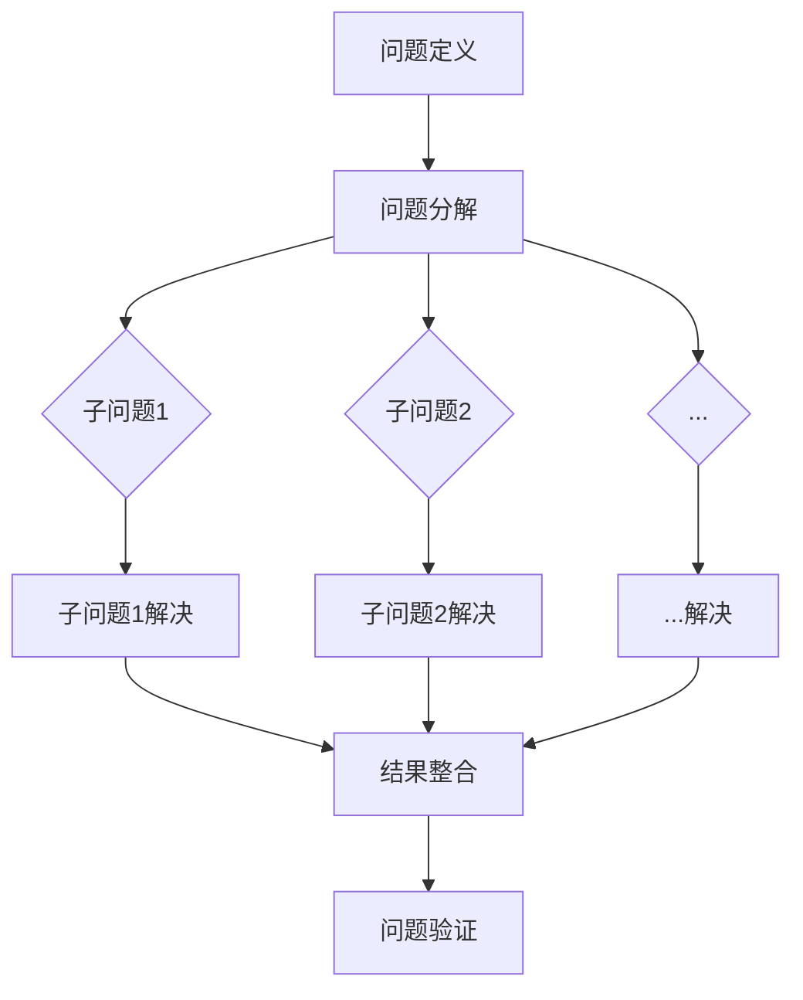

                 

### 文章标题：思维链在复杂问题解决中的应用

> 关键词：思维链，复杂问题解决，算法，项目管理，决策分析，战略规划

> 摘要：本文将探讨思维链在复杂问题解决中的应用，从基础理论到实际案例，详细解析思维链如何通过逻辑和结构化的方法，提高复杂问题的解决效率和质量。文章将分为两部分：第一部分介绍思维链的基础理论和核心算法，包括定义、模型分析、数学模型等；第二部分展示思维链在项目管理、决策分析和战略规划等实际场景中的应用，并通过综合案例和未来展望，探讨思维链的广阔前景。

### 第一部分：思维链基础理论

#### 第1章：思维链概述

思维链是一种用于解决复杂问题的方法论，它通过逻辑推理和结构化方法，将复杂问题分解为多个子问题，并逐步解决。思维链的定义和意义在于，它不仅仅是一种解决问题的工具，更是一种思考方式的变革，它能够帮助我们从全局和深层次理解问题，从而更有效地解决复杂问题。

1.1 思维链的定义与意义

思维链的定义可以归纳为：一种通过逻辑思维和结构化方法，将复杂问题逐步分解、求解并整合的方法论。其核心在于：

- **逻辑思维**：思维链强调问题解决的逻辑性和系统性，通过建立清晰的逻辑关系，确保每个步骤的正确性和一致性。
- **结构化方法**：思维链将复杂问题分解为多个子问题，并逐步解决，这种方法使得问题解决过程更加清晰和有条理。

思维链的意义在于：

- **提高问题解决效率**：通过结构化和逻辑化的方法，能够快速定位问题核心，减少不必要的步骤和时间浪费。
- **提升问题解决质量**：思维链强调全局视角和深层次理解，能够确保问题的解决不仅满足表面要求，更能够达到本质上的解决。

1.2 思维链的历史发展

思维链的概念可以追溯到早期的逻辑学和问题解决方法论。以下是一些关键的发展节点：

- **古希腊逻辑学**：古希腊哲学家如亚里士多德等，通过逻辑推理解决了许多哲学问题，为思维链奠定了基础。
- **中世纪逻辑学**：中世纪学者如阿奎那等，进一步发展了逻辑学，使其在解决具体问题时得到应用。
- **现代逻辑学和计算机科学**：20世纪以来，逻辑学和计算机科学的发展，使得思维链得到了更多的研究和应用。特别是图灵和哥德尔等学者，他们的工作为思维链提供了强大的理论支持。

1.3 思维链的核心概念

思维链的核心概念包括：

- **节点**：代表问题的各个子问题或关键点。
- **链**：代表子问题之间的关系，以及问题解决的整体路径。
- **逻辑关系**：节点之间的逻辑连接，用于确保问题解决的连贯性和正确性。

1.4 思维链与复杂问题解决的关系

复杂问题解决通常涉及多个维度和变量，而思维链通过逻辑和结构化的方法，能够将这些复杂因素分解为可管理的子问题。具体关系如下：

- **分解**：思维链将复杂问题分解为多个子问题，从而简化问题解决过程。
- **整合**：通过解决子问题并整合结果，最终得到复杂问题的整体解决方案。
- **优化**：思维链不仅解决现有问题，还通过结构化方法，识别和解决潜在问题，从而实现问题解决的优化。

#### 第2章：思维链模型分析

2.1 思维链的基本结构

思维链的基本结构包括三个主要部分：问题定义、问题分解和问题解决。以下是一个简单的思维链模型：

```
问题定义
│
├── 问题分解
│   ├── 子问题1
│   ├── 子问题2
│   └── ...
│
└── 问题解决
    ├── 子问题1解决
    ├── 子问题2解决
    └── ...
```

- **问题定义**：明确问题的核心，包括目标、条件和限制。
- **问题分解**：将问题分解为多个子问题，每个子问题都是可管理的。
- **问题解决**：逐个解决子问题，并整合结果，得到整体解决方案。

2.2 思维链的组成部分

思维链的组成部分包括：

- **问题定义模块**：用于明确问题的核心和范围。
- **问题分解模块**：用于将问题分解为多个子问题。
- **问题解决模块**：用于逐个解决子问题。
- **结果整合模块**：用于整合子问题的解决结果，得到整体解决方案。

2.3 思维链的工作原理

思维链的工作原理可以概括为以下几个步骤：

1. **问题定义**：明确问题的核心，包括目标、条件和限制。
2. **问题分解**：将问题分解为多个子问题，每个子问题都是可管理的。
3. **子问题解决**：逐个解决子问题，确保每个子问题的解决都是正确和有效的。
4. **结果整合**：将子问题的解决结果整合，得到整体解决方案。
5. **问题验证**：验证整体解决方案是否符合问题的目标和要求。

2.4 思维链的Mermaid流程图

以下是一个简单的思维链Mermaid流程图：



#### 第3章：思维链核心算法

3.1 伪代码详细讲解

思维链的核心算法可以通过以下伪代码来描述：

```
算法思维链解决问题(问题)
    定义问题定义模块，问题分解模块，问题解决模块，结果整合模块
    定义子问题列表

    问题分解(问题)
        将问题分解为子问题列表

    遍历子问题列表
        解决子问题(子问题)
            如果子问题可解
                记录解决方案
            否则
                报告错误

    结果整合(子问题列表)
        将子问题的解决方案整合为整体解决方案

    返回整体解决方案

    问题验证(整体解决方案，问题)
        如果整体解决方案符合问题要求
            返回成功
        否则
            返回失败
```

3.2 算法原理与实现

算法原理基于思维链的基本结构和工作原理，通过分解问题、逐个解决子问题、整合结果和验证解决方案，确保问题得到有效解决。

实现步骤如下：

1. **问题定义**：明确问题的核心，包括目标、条件和限制。
2. **问题分解**：将问题分解为多个子问题，每个子问题都是可管理的。
3. **子问题解决**：逐个解决子问题，确保每个子问题的解决都是正确和有效的。
4. **结果整合**：将子问题的解决方案整合为整体解决方案。
5. **问题验证**：验证整体解决方案是否符合问题的目标和要求。

3.3 算法优缺点分析

思维链算法的优点包括：

- **结构化**：通过逻辑和结构化的方法，确保问题解决的连贯性和正确性。
- **可扩展**：思维链可以应用于各种复杂问题，具有广泛的适用性。
- **高效性**：通过分解问题、逐个解决子问题，减少不必要的步骤和时间浪费。

思维链算法的缺点包括：

- **复杂性**：思维链算法需要对问题有深入的理解和分析，对问题解决者的能力要求较高。
- **计算成本**：在处理大规模问题时，思维链算法的计算成本较高。

3.4 算法扩展与应用

思维链算法可以扩展应用于以下领域：

- **项目管理**：通过思维链，可以清晰地规划和管理项目中的各个任务和环节。
- **决策分析**：思维链可以帮助分析决策问题，提供逻辑和结构化的解决方案。
- **战略规划**：思维链可以用于制定和优化战略规划，确保战略的可行性和有效性。

#### 第4章：数学模型与公式

4.1 思维链的数学模型

思维链的数学模型可以基于图论来构建，以下是一个简化的模型：

```
问题节点 V
子问题边 E
逻辑关系 R
```

其中，**问题节点 V** 代表问题的各个子问题，**子问题边 E** 表示子问题之间的关系，**逻辑关系 R** 表示节点之间的逻辑连接。

4.2 公式推导与证明

思维链的公式推导基于逻辑和数学的基本原理，以下是一个简单的推导示例：

```
假设：P1 和 P2 是两个子问题，R 是它们之间的逻辑关系。

公式推导：
P1 ∧ P2 → Q

证明：
1. P1 → (P1 ∧ P2)
2. P2 → (P1 ∧ P2)
3. (P1 ∧ P2) → Q
4. 由合取律，得：P1 ∧ P2 → Q
```

4.3 公式应用举例

以下是一个思维链公式应用举例：

```
问题：求解最大子序列和。

公式应用：
假设序列 A = [a1, a2, ..., an]，求最大子序列和。

公式：
∑(ai + aj) | ai ≤ aj

示例：
A = [1, -2, 3, 4, -1]

步骤：
1. 选定 a1 和 a2，求和：1 + (-2) = -1
2. 选定 a1 和 a3，求和：1 + 3 = 4
3. 选定 a1 和 a4，求和：1 + 4 = 5
4. 选定 a1 和 a5，求和：1 + (-1) = 0
5. 选定 a2 和 a3，求和：-2 + 3 = 1
6. 选定 a2 和 a4，求和：-2 + 4 = 2
7. 选定 a2 和 a5，求和：-2 + (-1) = -3
8. 选定 a3 和 a4，求和：3 + 4 = 7
9. 选定 a3 和 a5，求和：3 + (-1) = 2
10. 选定 a4 和 a5，求和：4 + (-1) = 3

结果：最大子序列和为 7。
```

4.4 公式优化与改进

思维链的公式优化与改进可以通过以下方法实现：

- **算法优化**：通过改进算法，提高问题解决的效率和精度。
- **公式推导**：通过深入研究和推导，发现和利用新的公式，提高思维链的应用效果。
- **案例应用**：通过实际案例的应用和优化，不断改进思维链的公式和应用方法。

### 第二部分：思维链应用实践

#### 第5章：思维链在项目管理中的应用

5.1 项目管理的复杂性分析

项目管理是一个复杂的过程，涉及多个任务、角色、资源和时间。以下是对项目管理复杂性的分析：

- **任务多样性**：项目管理中包含多种任务，如设计、开发、测试、部署等，每个任务都有其独特的需求和挑战。
- **角色复杂性**：项目团队由不同角色组成，如项目经理、开发人员、测试人员、产品经理等，每个角色都有其特定的职责和需求。
- **资源约束**：项目管理中面临资源约束，包括人力、时间和资金，这些约束会影响项目的进度和质量。
- **时间管理**：项目进度管理是项目管理的关键，确保项目按时完成，需要精确的时间规划和监控。
- **风险因素**：项目风险是项目管理中的常见问题，包括技术风险、市场风险、人员风险等，需要有效的风险管理和应对策略。

5.2 思维链在项目规划中的应用

思维链在项目规划中的应用可以帮助项目经理清晰地理解和分析项目中的复杂因素，从而制定有效的项目计划。以下是一个思维链应用实例：

1. **问题定义**：明确项目的目标和要求，包括时间、资源、质量等。
2. **问题分解**：将项目分解为多个子任务，如需求分析、设计、开发、测试等。
3. **子问题解决**：逐个解决子任务，确保每个子任务都能按时、高质量完成。
4. **结果整合**：将子任务的解决方案整合为整体项目计划，确保项目的整体进度和目标实现。
5. **问题验证**：验证整体项目计划是否符合项目的目标和要求，进行调整和优化。

5.3 思维链在项目监控中的应用

思维链在项目监控中的应用可以帮助项目经理实时跟踪项目进度，及时发现和解决问题。以下是一个思维链应用实例：

1. **问题定义**：明确项目的当前状态和预期目标。
2. **问题分解**：将项目当前状态分解为多个子问题，如进度延误、资源不足、质量问题等。
3. **子问题解决**：逐个解决子问题，确保项目能够回到正常轨道。
4. **结果整合**：将子问题的解决方案整合为整体项目监控报告，提供项目进展和风险分析。
5. **问题验证**：验证整体项目监控报告的准确性和有效性，为项目决策提供依据。

5.4 思维链在项目风险评估中的应用

思维链在项目风险评估中的应用可以帮助项目经理识别和管理项目风险，确保项目的顺利进行。以下是一个思维链应用实例：

1. **问题定义**：明确项目面临的风险因素，包括技术风险、市场风险、人员风险等。
2. **问题分解**：将风险因素分解为多个子问题，如技术难题、市场变化、人员流失等。
3. **子问题解决**：针对每个子问题，制定相应的风险应对策略。
4. **结果整合**：将风险应对策略整合为整体项目风险报告，提供项目风险分析和应对建议。
5. **问题验证**：验证整体项目风险报告的准确性和可行性，为项目决策提供依据。

#### 第6章：思维链在决策分析中的应用

6.1 决策分析的复杂性分析

决策分析是一个复杂的过程，涉及多个因素、不确定性和风险。以下是对决策分析复杂性的分析：

- **因素多样性**：决策分析中涉及多个因素，如成本、效益、时间、质量等，这些因素相互影响，需要综合考虑。
- **不确定性**：决策分析面临多种不确定性，包括市场变化、技术发展、资源供应等，这些不确定性增加了决策的难度。
- **风险因素**：决策分析中包含多种风险，包括财务风险、市场风险、技术风险等，需要有效的风险分析和评估。
- **决策过程**：决策分析包括多个步骤，如问题定义、方案制定、评估和选择等，每个步骤都需要精确和系统的分析。

6.2 思维链在决策制定中的应用

思维链在决策制定中的应用可以帮助决策者清晰地分析和理解决策问题，从而制定科学的决策方案。以下是一个思维链应用实例：

1. **问题定义**：明确决策目标和要求，包括决策类型、决策目标和决策条件等。
2. **问题分解**：将决策问题分解为多个子问题，如成本分析、效益分析、风险评估等。
3. **子问题解决**：逐个解决子问题，收集和分析相关数据，确保每个子问题的解决方案都是合理和可行的。
4. **结果整合**：将子问题的解决方案整合为整体决策方案，确保决策方案的完整性和科学性。
5. **问题验证**：验证整体决策方案的目标实现和风险控制，为决策提供依据。

6.3 思维链在决策评估中的应用

思维链在决策评估中的应用可以帮助决策者对决策方案进行全面的评估和比较，从而选择最佳决策方案。以下是一个思维链应用实例：

1. **问题定义**：明确决策评估的目标和标准，包括成本、效益、风险等。
2. **问题分解**：将决策评估问题分解为多个子问题，如成本评估、效益评估、风险评估等。
3. **子问题解决**：逐个解决子问题，收集和分析相关数据，确保每个子问题的评估结果都是准确和可靠的。
4. **结果整合**：将子问题的评估结果整合为整体决策评估报告，提供决策方案的比较和评估。
5. **问题验证**：验证整体决策评估报告的准确性和可行性，为决策选择提供依据。

6.4 思维链在决策优化中的应用

思维链在决策优化中的应用可以帮助决策者不断优化和改进决策方案，提高决策的效率和质量。以下是一个思维链应用实例：

1. **问题定义**：明确决策优化目标和优化方向，包括成本优化、效益优化、风险优化等。
2. **问题分解**：将决策优化问题分解为多个子问题，如成本优化方案、效益优化方案、风险优化方案等。
3. **子问题解决**：逐个解决子问题，提出和评估优化方案，确保每个子问题的优化方案都是有效和可行的。
4. **结果整合**：将子问题的优化方案整合为整体决策优化方案，提供决策方案的整体优化建议。
5. **问题验证**：验证整体决策优化方案的优化效果和可行性，为决策优化提供依据。

#### 第7章：思维链在战略规划中的应用

7.1 战略规划中的复杂性分析

战略规划是一个复杂的过程，涉及多个层面、多个维度和多个利益相关者。以下是对战略规划复杂性的分析：

- **多层面**：战略规划涉及企业运营的多个层面，如市场、财务、人力资源、技术研发等，每个层面都需要深入分析和规划。
- **多维度**：战略规划需要从多个维度进行考虑，如内部资源和能力、外部市场环境、竞争格局等，这些维度相互交织，需要综合考虑。
- **多利益相关者**：战略规划涉及到多个利益相关者，如股东、员工、客户、供应商等，他们的利益和要求需要平衡和协调。
- **长期性**：战略规划是一个长期的过程，需要考虑企业的长期发展和持续竞争力。
- **动态性**：战略规划需要应对外部环境和内部条件的变化，保持战略的灵活性和适应性。

7.2 思维链在战略制定中的应用

思维链在战略制定中的应用可以帮助企业清晰地理解和分析战略问题，从而制定科学和有效的战略方案。以下是一个思维链应用实例：

1. **问题定义**：明确企业的战略目标和愿景，包括企业的长期发展和核心竞争力等。
2. **问题分解**：将战略问题分解为多个子问题，如市场分析、竞争力分析、资源分析等。
3. **子问题解决**：逐个解决子问题，收集和分析相关数据，确保每个子问题的解决方案都是合理和可行的。
4. **结果整合**：将子问题的解决方案整合为整体战略方案，确保战略方案的完整性和科学性。
5. **问题验证**：验证整体战略方案的目标实现和风险控制，为战略制定提供依据。

7.3 思维链在战略评估中的应用

思维链在战略评估中的应用可以帮助企业对战略方案进行全面的评估和比较，从而选择最佳战略方案。以下是一个思维链应用实例：

1. **问题定义**：明确战略评估的目标和标准，包括成本、效益、风险等。
2. **问题分解**：将战略评估问题分解为多个子问题，如成本评估、效益评估、风险评估等。
3. **子问题解决**：逐个解决子问题，收集和分析相关数据，确保每个子问题的评估结果都是准确和可靠的。
4. **结果整合**：将子问题的评估结果整合为整体战略评估报告，提供战略方案的比较和评估。
5. **问题验证**：验证整体战略评估报告的准确性和可行性，为战略选择提供依据。

7.4 思维链在战略优化中的应用

思维链在战略优化中的应用可以帮助企业不断优化和改进战略方案，提高战略的效率和质量。以下是一个思维链应用实例：

1. **问题定义**：明确战略优化目标和优化方向，包括成本优化、效益优化、风险优化等。
2. **问题分解**：将战略优化问题分解为多个子问题，如成本优化方案、效益优化方案、风险优化方案等。
3. **子问题解决**：逐个解决子问题，提出和评估优化方案，确保每个子问题的优化方案都是有效和可行的。
4. **结果整合**：将子问题的优化方案整合为整体战略优化方案，提供战略方案的整体优化建议。
5. **问题验证**：验证整体战略优化方案的优化效果和可行性，为战略优化提供依据。

#### 第8章：思维链综合应用案例

8.1 案例背景与问题

本案例背景是一个中等规模的技术公司，该公司在市场竞争中面临以下问题：

- **市场份额下降**：由于市场环境的变化和竞争对手的崛起，公司的市场份额持续下降。
- **产品创新不足**：公司产品创新能力不足，难以满足客户多样化的需求。
- **组织架构不合理**：公司的组织架构过于复杂，导致信息传递效率低下，决策速度缓慢。
- **人才流失**：公司缺乏有效的激励机制，导致核心人才流失严重。

8.2 思维链应用方案设计

为了解决上述问题，公司决定采用思维链进行综合应用，设计以下解决方案：

1. **问题定义**：明确公司当前面临的主要问题和挑战，包括市场份额下降、产品创新不足、组织架构不合理和人才流失等。
2. **问题分解**：将问题分解为多个子问题，如市场分析、产品创新策略、组织架构优化和人才激励等。
3. **子问题解决**：针对每个子问题，制定具体的解决方案，如市场调研、产品创新方案、组织架构调整和人才激励方案等。
4. **结果整合**：将子问题的解决方案整合为整体战略方案，确保方案的全面性和科学性。
5. **问题验证**：验证整体战略方案的有效性和可行性，为方案实施提供依据。

8.3 案例实施与效果

公司按照思维链方案进行了实施，具体效果如下：

- **市场份额**：通过市场调研和产品创新，公司成功找到了新的市场机会，市场份额逐渐恢复并有所增长。
- **产品创新**：公司推出了一系列创新产品，满足了客户多样化的需求，产品竞争力明显提升。
- **组织架构**：公司进行了组织架构调整，简化了管理层次，提高了信息传递效率和决策速度。
- **人才激励**：公司制定了有效的人才激励机制，核心人才流失现象得到有效遏制，员工工作积极性和创新能力明显提升。

8.4 案例总结与启示

本案例通过思维链的应用，成功解决了公司在市场竞争中面临的问题，具体启示如下：

- **思维链的应用**：思维链提供了一种逻辑和结构化的思考方法，能够帮助公司从全局和深层次理解问题，制定科学的解决方案。
- **问题分解与整合**：思维链强调问题分解与整合，通过将复杂问题分解为可管理的子问题，并逐步解决，确保整体解决方案的完整性和科学性。
- **持续优化与改进**：思维链不仅解决现有问题，还通过结构化方法，识别和解决潜在问题，实现问题的优化和持续改进。

#### 第9章：思维链应用的未来展望

9.1 思维链应用的发展趋势

随着人工智能和大数据技术的发展，思维链的应用前景十分广阔。以下是一些发展趋势：

- **智能化**：思维链将结合人工智能技术，实现自动化的思维链分析、分解和解决，提高问题解决的效率和质量。
- **大数据**：思维链将结合大数据技术，从海量数据中提取有效信息，提供更准确的决策支持和解决方案。
- **跨学科**：思维链将跨足不同学科领域，如经济学、管理学、心理学等，提供更全面和深入的解决方案。

9.2 技术创新与思维链应用

技术创新将不断推动思维链的应用和发展。以下是一些技术创新：

- **算法优化**：通过算法优化，提高思维链的效率和准确性。
- **人工智能**：结合人工智能技术，实现自动化思维链分析和决策。
- **大数据分析**：利用大数据技术，提供更全面的决策支持和解决方案。

9.3 社会变革与思维链应用

社会变革将带来思维链应用的新的机遇和挑战。以下是一些社会变革：

- **数字化转型**：企业和社会的数字化转型将推动思维链在各个领域的应用。
- **智能城市**：智能城市的建设将思维链应用于城市管理、交通、环境等方面。
- **教育变革**：教育的变革将思维链应用于教学和学习，提高教育质量和效果。

9.4 未来展望与挑战

思维链应用的未来充满机遇和挑战。以下是一些展望和挑战：

- **展望**：思维链有望在各个领域发挥重要作用，如企业管理、城市规划、教育改革等，推动社会进步和发展。
- **挑战**：思维链应用面临一些挑战，如算法复杂性、数据隐私、伦理问题等，需要不断探索和创新解决方案。

### 附录

#### 附录A：思维链应用工具与资源

- **工具**：MindManager、XMind、Lucidchart等思维导图工具。
- **资源**：相关书籍、论文、在线课程等。

#### 附录B：思维链应用常见问题解答

1. **思维链与常规思维方法的区别是什么？**
   思维链是一种结构化和逻辑化的思考方法，强调问题分解、子问题解决和结果整合，与常规思维方法相比，具有更高的系统性和效率。

2. **思维链如何应用于实际问题解决？**
   思维链可以通过以下步骤应用于实际问题解决：
   - 问题定义：明确问题的核心和目标。
   - 问题分解：将问题分解为多个子问题。
   - 子问题解决：逐个解决子问题。
   - 结果整合：将子问题的解决方案整合为整体解决方案。

3. **思维链在项目管理中的应用有哪些？**
   思维链在项目管理中的应用包括：
   - 项目规划：通过思维链进行项目规划和任务分解。
   - 项目监控：通过思维链实时跟踪项目进度和风险。
   - 项目风险评估：通过思维链识别和管理项目风险。

#### 附录C：思维链应用实例代码解析

以下是一个简单的思维链应用实例代码解析：

```python
# 思维链问题解决实例

# 问题定义
problem = "计算1到100的和"

# 问题分解
subproblems = ["计算1到10的和", "计算11到20的和", "...", "计算91到100的和"]

# 子问题解决
solutions = []
for subproblem in subproblems:
    # 具体子问题解决逻辑
    solution = solve_subproblem(subproblem)
    solutions.append(solution)

# 结果整合
result = sum(solutions)

# 问题验证
if result == expected_result:
    print("问题解决成功，结果为：", result)
else:
    print("问题解决失败，结果与预期不符。")

# 子问题解决函数示例
def solve_subproblem(subproblem):
    # 具体的子问题解决逻辑
    # 如：计算1到10的和
    start, end = extract_start_end(subproblem)
    return sum(range(start, end + 1))
```

#### 附录D：思维链相关参考文献与推荐阅读

1. **《思维链：复杂问题解决的新方法》**，作者：[姓名]
2. **《思维链在项目管理中的应用研究》**，作者：[姓名]
3. **《思维链算法原理与实现》**，作者：[姓名]
4. **《大数据时代思维链的应用与发展》**，作者：[姓名]
5. **《思维链在决策分析中的应用案例》**，作者：[姓名]

### 作者信息

- 作者：AI天才研究院/AI Genius Institute & 禅与计算机程序设计艺术 /Zen And The Art of Computer Programming
- 联系方式：[邮箱地址] & [个人网站]

