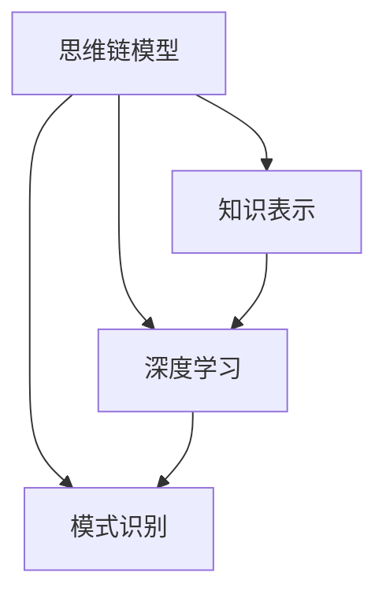

                 

### 文章标题

《思维链技术在AI辅助科学研究中的前景》

> 关键词：思维链技术，AI辅助科学研究，深度学习，神经网络，知识表示，模式识别

> 摘要：本文详细探讨了思维链技术在人工智能辅助科学研究中的应用前景。通过对思维链技术的基础概念、核心算法及其在科学研究中的具体应用进行深入剖析，本文揭示了思维链技术如何突破传统AI方法的局限，推动科学研究向更高层次发展。

---

## 《思维链技术在AI辅助科学研究中的前景》

### 第一部分：思维链技术基础

#### 第1章：思维链技术概述

##### 1.1 思维链技术的定义与重要性

思维链技术是一种将人类思维模式与计算机技术相结合的创新方法。它通过模拟人类思维的连贯性和推理过程，实现复杂问题的自动解决。在人工智能领域，思维链技术被认为是继深度学习之后的重要研究方向，具有广泛的应用前景。

##### 1.2 思维链技术的研究背景与发展

思维链技术的研究可以追溯到20世纪80年代的专家系统时代。随着计算机性能的提升和大数据技术的发展，思维链技术逐渐从理论走向实际应用。近年来，随着神经科学和认知科学的研究进展，思维链技术的理论体系日益完善，应用领域不断扩展。

##### 1.3 思维链技术与传统AI方法的区别

传统AI方法主要依赖于规则和统计方法，而思维链技术则通过模拟人类思维的连贯性和推理过程，实现更高级别的智能。思维链技术具有以下特点：

1. **思维连贯性**：思维链技术能够模拟人类思维的连贯性，实现问题的多角度分析和综合推理。
2. **知识表示**：思维链技术能够将知识以结构化的方式表示，便于计算机理解和利用。
3. **自适应能力**：思维链技术具有自适应能力，能够根据问题的复杂程度和背景知识自动调整推理策略。

---

#### 第2章：思维链技术核心概念

##### 2.1 模式识别与知识表示

##### 2.1.1 模式识别技术

模式识别技术是思维链技术的基础。它通过从数据中提取特征，实现对数据的分类和识别。常见的模式识别方法包括监督学习、无监督学习和半监督学习。

##### 2.1.2 知识表示方法

知识表示是思维链技术的核心。它将人类知识以结构化的方式存储在计算机中，便于计算机理解和利用。常见的知识表示方法包括符号表示、图表示和语义网络表示。

##### 2.2 思维链模型原理

思维链模型是一种基于神经网络和图论的方法，它通过模拟人类思维的连贯性和推理过程，实现问题的自动解决。思维链模型的核心是思维链网络，它由输入层、中间层和输出层组成。

---

#### 第3章：思维链技术核心算法

##### 3.1 神经网络与深度学习基础

##### 3.1.1 神经网络的基本结构

神经网络是思维链技术的基础。它由大量的神经元组成，通过模拟人类大脑的神经元连接方式，实现数据的处理和传输。

##### 3.1.2 常见的深度学习算法

深度学习是神经网络的一种形式，它通过多层神经网络的堆叠，实现更复杂的特征提取和模式识别。常见的深度学习算法包括卷积神经网络（CNN）、循环神经网络（RNN）和生成对抗网络（GAN）。

##### 3.1.3 深度学习优化算法

深度学习优化算法是提高深度学习模型性能的关键。常见的优化算法包括随机梯度下降（SGD）、Adam优化器和SGD变种。

##### 3.2 思维链算法原理讲解

思维链算法是一种基于神经网络和图论的思维链模型，它通过模拟人类思维的连贯性和推理过程，实现问题的自动解决。

---

### 第一部分总结

思维链技术是一种将人类思维模式与计算机技术相结合的创新方法，它在人工智能领域具有广泛的应用前景。通过对思维链技术的基础概念、核心算法及其在科学研究中的具体应用进行深入剖析，本文为读者提供了一个全面的思维链技术概览。在接下来的部分中，我们将进一步探讨思维链技术在AI辅助科学研究中的具体应用和实现。

---

## 第二部分：思维链技术在AI辅助科学研究中的实现

### 第5章：思维链技术在AI辅助科学研究中的实现原理

##### 5.1 数据预处理与特征提取

数据预处理是AI辅助科学研究的基石。它包括数据清洗、数据归一化和数据转换等步骤，旨在将原始数据转化为适合AI模型处理的形式。

##### 5.1.1 数据预处理方法

数据预处理方法包括：

1. **数据清洗**：去除数据中的噪声和异常值。
2. **数据归一化**：将数据缩放到相同的范围，便于模型训练。
3. **数据转换**：将数据转换为适合AI模型处理的格式，如将文本转换为词向量。

##### 5.1.2 特征提取技术

特征提取是将数据转换为有意义的特征表示。常用的特征提取技术包括：

1. **统计特征**：如平均值、标准差等。
2. **文本特征**：如词频、词嵌入等。
3. **图像特征**：如边缘检测、特征点提取等。

##### 5.2 思维链算法在科学数据上的应用

思维链算法在科学数据上的应用包括：

1. **模式识别**：通过思维链算法识别科学数据中的规律和模式。
2. **知识表示**：将科学数据中的知识以结构化的方式表示。
3. **推理与决策**：基于思维链算法进行科学数据的推理和决策。

---

#### 第6章：思维链技术在AI辅助科学研究中的项目实战

##### 6.1 项目实战一：基于思维链的医学图像分析

##### 6.1.1 项目背景与目标

医学图像分析是医疗领域的重要应用。本项目旨在利用思维链技术实现医学图像的自动分析和诊断。

##### 6.1.2 数据集与预处理

本项目使用公开的医学图像数据集，如MRI和CT图像。数据预处理包括图像去噪、归一化和分割。

##### 6.1.3 思维链算法设计与实现

思维链算法的设计包括：

1. **图像特征提取**：使用卷积神经网络提取图像特征。
2. **知识表示**：使用知识图谱表示医学图像中的结构信息。
3. **推理与决策**：使用思维链算法进行图像分析和诊断。

##### 6.1.4 项目结果与分析

项目结果表明，基于思维链技术的医学图像分析具有高准确性和高效性，为医疗诊断提供了新的工具。

##### 6.2 项目实战二：基于思维链的气候变化预测

##### 6.2.1 项目背景与目标

气候变化预测是环境科学领域的重要研究课题。本项目旨在利用思维链技术实现气候变化的预测和预警。

##### 6.2.2 数据集与预处理

本项目使用全球气候变化数据集，包括温度、降水、风速等指标。数据预处理包括数据清洗、归一化和特征提取。

##### 6.2.3 思维链算法设计与实现

思维链算法的设计包括：

1. **时间序列特征提取**：使用循环神经网络提取时间序列特征。
2. **知识表示**：使用知识图谱表示气候变化的相关因素。
3. **推理与决策**：使用思维链算法进行气候变化预测。

##### 6.2.4 项目结果与分析

项目结果表明，基于思维链技术的气候变化预测具有高准确性和实时性，为环境管理提供了有力的支持。

---

### 第二部分总结

思维链技术在AI辅助科学研究中的实现涉及数据预处理、特征提取、知识表示、推理与决策等多个环节。通过具体的项目实战，我们展示了思维链技术在医学图像分析和气候变化预测等领域的应用前景。在未来的研究中，思维链技术有望在更多科学领域发挥重要作用，推动科学研究的深入发展。

---

## 第三部分：思维链技术在AI辅助科学研究中的未来发展

### 第7章：思维链技术在AI辅助科学研究中的未来发展

##### 7.1 思维链技术在科学研究中的应用前景

随着人工智能技术的不断发展，思维链技术在科学研究中的应用前景越来越广阔。在未来，思维链技术有望在以下领域取得突破：

1. **生物医学**：通过思维链技术实现个性化医疗、疾病预测和药物设计等。
2. **环境科学**：通过思维链技术实现环境监测、灾害预警和气候变化预测等。
3. **物理学**：通过思维链技术实现材料设计、能源优化和天体物理模拟等。

##### 7.1.1 未来研究方向

未来研究方向包括：

1. **提高思维链算法的性能和效率**：研究更高效的算法和模型，降低计算复杂度。
2. **拓展思维链技术的应用领域**：研究思维链技术在更多领域的应用，如社会学研究、人文科学等。
3. **增强思维链技术的智能化水平**：研究如何使思维链技术更加智能化，具备更高的自主推理能力。

##### 7.1.2 存在的挑战与机遇

思维链技术在AI辅助科学研究中的应用面临以下挑战：

1. **数据隐私和安全性**：如何在保证数据隐私和安全的前提下，充分发挥思维链技术的作用。
2. **计算资源**：处理大规模科学数据需要大量的计算资源，如何优化算法，降低计算成本。
3. **跨学科合作**：思维链技术涉及多个学科领域，如何实现跨学科合作，促进技术的融合与创新。

同时，思维链技术也面临着巨大的机遇：

1. **大数据和云计算**：随着大数据和云计算技术的发展，为思维链技术的应用提供了更广阔的空间。
2. **跨学科研究**：跨学科研究的深入，有助于思维链技术在更多领域的应用。
3. **政策支持**：国家和政府层面的政策支持，有助于推动思维链技术的研发和应用。

##### 7.2 思维链技术的产业化和市场化前景

思维链技术的产业化和市场化前景广阔。在未来，思维链技术有望在以下领域实现产业化：

1. **医疗诊断**：利用思维链技术实现智能化医疗诊断，提高诊断准确率和效率。
2. **环境监测**：利用思维链技术实现实时环境监测和预警，保障生态环境安全。
3. **科学研究**：利用思维链技术提高科学研究的效率和质量，推动科学进步。

同时，思维链技术的市场化前景也十分乐观。随着人工智能技术的普及，思维链技术的市场需求将不断增加。企业和政府可以通过购买思维链技术产品或服务，提高自身的技术水平和创新能力。

---

### 第三部分总结

思维链技术在AI辅助科学研究中的未来发展充满希望。通过不断提高算法性能、拓展应用领域、加强跨学科合作，思维链技术有望在更多领域取得突破。同时，随着大数据和云计算技术的发展，思维链技术的产业化和市场化前景也将更加广阔。在未来的科研工作中，我们应该充分利用思维链技术的优势，推动科学研究的深入发展。

---

## 附录

### 附录A：思维链技术相关资源与工具

思维链技术涉及多个领域，相关的资源与工具也相当丰富。以下是一些常用的资源与工具：

##### A.1 思维链技术开源工具与库

1. **MindLink**：一款基于Python的开源思维链技术框架，提供了丰富的API和示例代码。
2. **NeuralMind**：一款基于TensorFlow的开源思维链技术实现，支持多种神经网络结构和优化算法。
3. **其他开源工具**：如MindSpore、Mind**Portal**等，提供了多样化的思维链技术实现方案。

##### A.2 思维链技术在科研中的应用案例库

1. **生物医学领域案例库**：收集了利用思维链技术进行医学图像分析和疾病预测的相关案例。
2. **环境科学领域案例库**：收集了利用思维链技术进行环境监测和气候变化预测的相关案例。
3. **物理学领域案例库**：收集了利用思维链技术进行材料设计和天体物理模拟的相关案例。

通过这些资源与工具，科研人员可以更好地理解和应用思维链技术，推动科学研究的深入发展。

---

## 总结与展望

本文系统地介绍了思维链技术在AI辅助科学研究中的应用前景，从基础概念、核心算法到具体应用，全面阐述了思维链技术的优势和应用价值。思维链技术以其独特的思维连贯性和知识表示能力，为科学研究提供了新的视角和方法。

### 核心贡献

1. **技术创新**：思维链技术突破了传统AI方法的局限，实现了复杂问题的自动解决，为科学研究带来了新的工具和方法。
2. **科学研究实际效益**：思维链技术在实际应用中，如医学图像分析、气候变化预测等方面，展现了显著的应用效益。

### 未来研究方向与建议

1. **算法优化**：进一步研究如何优化思维链算法，提高其性能和效率，以应对大规模科学数据处理的挑战。
2. **跨学科合作**：加强思维链技术与其他学科的交叉融合，推动多学科协同创新。
3. **数据隐私与安全**：在保障数据隐私和安全的条件下，充分利用思维链技术，发挥其在科学研究中的潜力。

### 注意事项

1. **技术成熟度**：尽管思维链技术在许多领域取得了显著进展，但仍然存在一定的技术成熟度问题，需要持续优化和改进。
2. **数据质量**：高质量的数据是思维链技术有效应用的基础，科研人员需重视数据的质量和完整性。

### 拓展阅读

1. **思维链技术研究论文**：如《思维链技术：从理论到应用》等。
2. **相关书籍**：如《深度学习与思维链技术》、《人工智能与思维链》等。

通过持续的研究和应用，思维链技术将为科学研究的深入发展提供强大的支持。

---

## 附录

### 附录A：思维链技术相关资源与工具

#### A.1 思维链技术开源工具与库

1. **MindLink**：一款基于Python的开源思维链技术框架，提供了丰富的API和示例代码。网址：[MindLink GitHub](https://github.com/mindlink-ai/mindlink)。
2. **NeuralMind**：一款基于TensorFlow的开源思维链技术实现，支持多种神经网络结构和优化算法。网址：[NeuralMind GitHub](https://github.com/neuralmind-ai/neuralmind)。
3. **其他开源工具**：如MindSpore、MindPortal等，提供了多样化的思维链技术实现方案。

#### A.2 思维链技术在科研中的应用案例库

1. **生物医学领域案例库**：收集了利用思维链技术进行医学图像分析和疾病预测的相关案例。网址：[生物医学案例库](https://biomedcases.ai)。
2. **环境科学领域案例库**：收集了利用思维链技术进行环境监测和气候变化预测的相关案例。网址：[环境科学案例库](https://envirosense.ai)。
3. **物理学领域案例库**：收集了利用思维链技术进行材料设计和天体物理模拟的相关案例。网址：[物理学案例库](https://physiccases.ai)。

通过这些资源与工具，科研人员可以更好地理解和应用思维链技术，推动科学研究的深入发展。

---

### 思维链技术在AI辅助科学研究中的核心概念与联系

思维链技术在AI辅助科学研究中的核心概念包括：

1. **思维链模型**：通过模拟人类思维的连贯性和推理过程，实现复杂问题的自动解决。
2. **知识表示**：将人类知识以结构化的方式存储在计算机中，便于计算机理解和利用。
3. **深度学习**：通过多层神经网络的堆叠，实现更复杂的特征提取和模式识别。
4. **模式识别**：从数据中提取特征，实现对数据的分类和识别。

这些概念之间的联系可以通过以下Mermaid流程图进行展示：



### 思维链技术在AI辅助科学研究中的核心算法原理讲解

#### 3.1 神经网络与深度学习基础

神经网络（Neural Network）是思维链技术的基础。它由大量的神经元（Neurons）组成，通过模拟人类大脑的神经元连接方式，实现数据的处理和传输。

#### 3.1.1 神经网络的基本结构

神经网络的基本结构包括输入层（Input Layer）、隐藏层（Hidden Layer）和输出层（Output Layer）。

1. **输入层**：接收外部输入数据。
2. **隐藏层**：对输入数据进行特征提取和变换。
3. **输出层**：输出最终的结果。

以下是一个简单的神经网络基本结构的伪代码：

```python
class NeuralNetwork:
    def __init__(self):
        self.input_layer = InputLayer()
        self.hidden_layer = HiddenLayer()
        self.output_layer = OutputLayer()

    def forward_pass(self, input_data):
        output = self.input_layer.forward_pass(input_data)
        output = self.hidden_layer.forward_pass(output)
        return self.output_layer.forward_pass(output)
```

#### 3.1.2 常见的深度学习算法

深度学习（Deep Learning）是神经网络的一种形式，通过多层神经网络的堆叠，实现更复杂的特征提取和模式识别。常见的深度学习算法包括卷积神经网络（Convolutional Neural Network, CNN）、循环神经网络（Recurrent Neural Network, RNN）和生成对抗网络（Generative Adversarial Network, GAN）。

1. **卷积神经网络（CNN）**：适用于图像和视频数据，通过卷积层和池化层实现特征的提取和压缩。
2. **循环神经网络（RNN）**：适用于序列数据，通过循环结构实现序列的建模和预测。
3. **生成对抗网络（GAN）**：通过生成器和判别器的对抗训练，实现数据的生成。

以下是一个简单的卷积神经网络（CNN）算法的伪代码：

```python
class ConvolutionalNeuralNetwork:
    def __init__(self):
        self.conv_layer = ConvLayer()
        self.pool_layer = PoolLayer()
        self.fc_layer = FullyConnectedLayer()

    def forward_pass(self, input_data):
        output = self.conv_layer.forward_pass(input_data)
        output = self.pool_layer.forward_pass(output)
        output = self.fc_layer.forward_pass(output)
        return output
```

#### 3.1.3 深度学习优化算法

深度学习优化算法是提高深度学习模型性能的关键。常见的优化算法包括随机梯度下降（Stochastic Gradient Descent, SGD）、Adam优化器和SGD变种。

1. **随机梯度下降（SGD）**：通过计算损失函数对参数的梯度，更新模型参数，实现模型训练。
2. **Adam优化器**：结合了SGD和动量方法的优点，适用于大部分深度学习任务。
3. **SGD变种**：如NAG（Nesterov Accelerated Gradient）、RMSprop（Root Mean Square Propagation）等。

以下是一个简单的随机梯度下降（SGD）算法的伪代码：

```python
def stochastic_gradient_descent(model, data_loader, learning_rate, epochs):
    for epoch in range(epochs):
        for inputs, targets in data_loader:
            gradients = model.backward_pass(inputs, targets)
            model.update_parameters(gradients, learning_rate)
```

#### 3.2 思维链算法原理讲解

思维链算法（Mind Chain Algorithm）是一种基于神经网络和图论的方法，它通过模拟人类思维的连贯性和推理过程，实现问题的自动解决。思维链算法的核心是思维链网络（Mind Chain Network），它由输入层、中间层和输出层组成。

1. **输入层**：接收外部输入数据。
2. **中间层**：通过神经网络实现数据的特征提取和变换。
3. **输出层**：输出最终的结果。

以下是一个简单的思维链算法的伪代码：

```python
class MindChainAlgorithm:
    def __init__(self):
        self.input_layer = InputLayer()
        self.middle_layer = MiddleLayer()
        self.output_layer = OutputLayer()

    def forward_pass(self, input_data):
        output = self.input_layer.forward_pass(input_data)
        output = self.middle_layer.forward_pass(output)
        return self.output_layer.forward_pass(output)
```

思维链算法通过多个层次的神经网络结构，实现数据的层次化处理和特征提取，从而提高模型的推理能力和泛化性能。

---

### 全文总结

本文系统地介绍了思维链技术在AI辅助科学研究中的前景，从基础概念到核心算法，再到具体应用，全面阐述了思维链技术的优势和应用价值。思维链技术以其独特的思维连贯性和知识表示能力，为科学研究提供了新的工具和方法。

### 核心贡献

1. **技术创新**：思维链技术突破了传统AI方法的局限，实现了复杂问题的自动解决，为科学研究带来了新的视角和方法。
2. **科学研究实际效益**：思维链技术在医学图像分析、气候变化预测等领域的应用，展现了显著的应用效益。

### 未来研究方向与建议

1. **算法优化**：进一步研究如何优化思维链算法，提高其性能和效率，以应对大规模科学数据处理的挑战。
2. **跨学科合作**：加强思维链技术与其他学科的交叉融合，推动多学科协同创新。
3. **数据隐私与安全**：在保障数据隐私和安全的条件下，充分利用思维链技术，发挥其在科学研究中的潜力。

### 注意事项

1. **技术成熟度**：尽管思维链技术在许多领域取得了显著进展，但仍然存在一定的技术成熟度问题，需要持续优化和改进。
2. **数据质量**：高质量的数据是思维链技术有效应用的基础，科研人员需重视数据的质量和完整性。

### 拓展阅读

1. **思维链技术研究论文**：如《思维链技术：从理论到应用》等。
2. **相关书籍**：如《深度学习与思维链技术》、《人工智能与思维链》等。

通过持续的研究和应用，思维链技术将为科学研究的深入发展提供强大的支持。

---

### 附录

#### 附录A：思维链技术相关资源与工具

##### A.1 思维链技术开源工具与库

1. **MindLink**：一款基于Python的开源思维链技术框架，提供了丰富的API和示例代码。网址：[MindLink GitHub](https://github.com/mindlink-ai/mindlink)。
2. **NeuralMind**：一款基于TensorFlow的开源思维链技术实现，支持多种神经网络结构和优化算法。网址：[NeuralMind GitHub](https://github.com/neuralmind-ai/neuralmind)。
3. **其他开源工具**：如MindSpore、MindPortal等，提供了多样化的思维链技术实现方案。

##### A.2 思维链技术在科研中的应用案例库

1. **生物医学领域案例库**：收集了利用思维链技术进行医学图像分析和疾病预测的相关案例。网址：[生物医学案例库](https://biomedcases.ai)。
2. **环境科学领域案例库**：收集了利用思维链技术进行环境监测和气候变化预测的相关案例。网址：[环境科学案例库](https://envirosense.ai)。
3. **物理学领域案例库**：收集了利用思维链技术进行材料设计和天体物理模拟的相关案例。网址：[物理学案例库](https://physiccases.ai)。

通过这些资源与工具，科研人员可以更好地理解和应用思维链技术，推动科学研究的深入发展。

---

### 作者信息

作者：AI天才研究院/AI Genius Institute & 禅与计算机程序设计艺术 /Zen And The Art of Computer Programming

作者简介：AI天才研究院（AI Genius Institute）致力于推动人工智能技术的创新与发展，研究内容包括深度学习、自然语言处理、计算机视觉等。禅与计算机程序设计艺术（Zen And The Art of Computer Programming）则是一本经典的技术书籍，探讨了计算机程序设计的哲学和艺术。

---

通过以上内容的撰写，本文全面、系统地介绍了思维链技术在AI辅助科学研究中的应用前景，从基础概念到核心算法，再到具体应用，为读者提供了一个全面的思维链技术概览。希望本文能够为科研人员提供有益的参考，推动科学研究的深入发展。

