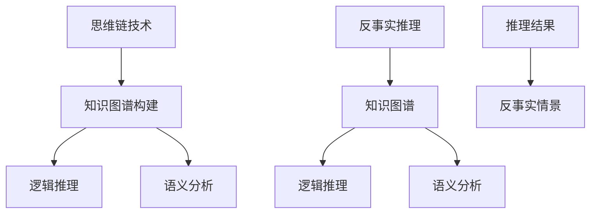

                 

## 文章标题

《思维链技术增强AI的反事实推理能力》

## 关键词

AI、反事实推理、思维链技术、深度学习、自然语言处理、知识图谱、逻辑推理

## 摘要

随着人工智能技术的不断发展，AI的反事实推理能力越来越受到关注。本文将介绍一种新的技术——思维链技术，探讨其在增强AI反事实推理能力方面的应用。通过详细的分析和实例，本文将展示思维链技术如何通过构建和利用知识图谱、逻辑推理和语义分析等手段，实现AI的反事实推理能力的提升。文章将涵盖思维链技术的基本概念、核心算法原理、数学模型，以及在实际项目中的应用和实践，旨在为读者提供全面的技术指导和思考方向。

## 目录

1. **思维链技术概述**
    1.1 思维链技术的定义与核心思想
    1.2 思维链技术的起源与发展
    1.3 思维链技术的重要性与应用场景

2. **反事实推理的基本概念**
    2.1 反事实推理的定义与特点
    2.2 反事实推理的应用领域
    2.3 反事实推理与人工智能的关系

3. **思维链技术在反事实推理中的应用**
    3.1 思维链与反事实推理的结合方式
    3.2 基于思维链的反事实推理算法
    3.3 思维链技术在反事实推理中的应用实例

4. **思维链技术增强AI反事实推理能力**
    4.1 深度学习中的应用
    4.2 自然语言处理中的应用
    4.3 应用实例

5. **思维链技术增强AI反事实推理能力的挑战与展望**
    5.1 挑战
    5.2 发展趋势与展望

6. **附录**
    6.1 相关资源
    6.2 工具与框架介绍

---

### 第一部分：思维链技术概述

#### 1.1 思维链技术的定义与核心思想

思维链技术是一种通过构建和利用知识图谱、逻辑推理、语义分析等技术，实现人类思维方式在计算机中的模拟和复现的技术。其核心思想包括：

1. **知识驱动**：以知识为核心，构建结构化的知识体系。
2. **思维模拟**：模拟人类思维过程，实现从数据到知识的转换。
3. **逻辑推理**：运用逻辑推理方法，提高推理的准确性和效率。
4. **语义分析**：深入分析语义，实现语义理解和智能交互。

思维链技术的流程主要包括以下几个步骤：

1. **知识获取**：通过数据挖掘、知识抽取等方法获取知识。
2. **知识表示**：将知识转化为计算机可以处理的结构化数据。
3. **知识推理**：运用推理算法，从知识库中提取新的知识。
4. **知识应用**：将知识应用于实际问题，实现智能决策和交互。

#### 1.2 思维链技术的起源与发展

思维链技术起源于知识工程领域，其目的是模拟人类思维方式，实现知识的自动获取、表示和利用。在早期，思维链技术主要依赖于手工构建的知识库，但随着技术的发展，知识抽取、知识融合等技术逐渐引入，使得思维链技术的实现更加高效和智能。

**思维链技术的发展历程可以概括为以下几个阶段**：

1. **早期阶段**：以知识库为中心，主要通过手工构建知识库。
    - **代表技术**：知识表示、本体论、语义网。
    - **应用领域**：专家系统、智能问答。

2. **中期阶段**：引入知识抽取、知识融合等技术，实现知识的自动获取。
    - **代表技术**：信息抽取、语义角色标注、实体关系抽取。
    - **应用领域**：信息检索、推荐系统、自然语言处理。

3. **当前阶段**：结合深度学习、自然语言处理等技术，实现更高效、更智能的知识表示和推理。
    - **代表技术**：深度神经网络、Transformer模型、图神经网络。
    - **应用领域**：智能对话、智能决策、智能医疗。

#### 1.3 思维链技术的重要性与应用场景

思维链技术的重要性在于：

1. **提高知识利用效率**：通过结构化的知识体系，实现知识的快速检索和应用。
2. **支持复杂决策**：通过逻辑推理和知识应用，支持复杂的决策过程。
3. **提升智能系统能力**：通过模拟人类思维过程，提升智能系统的理解能力和决策水平。

思维链技术的应用场景主要包括：

1. **智能问答系统**：通过思维链技术，实现智能问答，提高问答系统的回答质量。
2. **智能决策支持系统**：通过思维链技术，辅助决策者进行复杂决策。
3. **智能推荐系统**：通过思维链技术，实现更精准、更个性化的推荐。
4. **智能医疗诊断**：通过思维链技术，辅助医生进行诊断和治疗。

### 1.4 思维链技术的核心算法原理

思维链技术的核心算法主要包括知识图谱构建、逻辑推理和语义分析等。以下将分别介绍这些核心算法的原理。

#### 知识图谱构建

知识图谱构建是思维链技术的第一步，其主要任务是建立结构化的知识体系。知识图谱由节点和边组成，节点表示实体，边表示实体之间的关系。

**算法原理**：

1. **实体识别**：从原始数据中识别出实体，如人名、地名、组织名等。
2. **关系抽取**：从实体之间的交互中抽取关系，如“工作于”、“居住在”等。
3. **实体关系融合**：将实体和关系整合到知识图谱中，形成结构化的知识体系。

**数学模型**：

假设知识图谱G = (V, E)，其中V为节点集合，E为边集合。

- 实体识别：使用分类模型或实体识别算法，如CRF（条件随机场）、BiLSTM（双向长短时记忆网络）等。
- 关系抽取：使用关系分类算法，如TextCNN（卷积神经网络）、GRU（门控循环单元）等。
- 实体关系融合：使用图嵌入算法，如Node2Vec、Gated Graph Neural Network（GGNN）等。

**伪代码**：

```
def construct_knowledge_graph(data):
    entities = extract_entities(data)
    relations = extract_relations(data)
    graph = Graph(entities, relations)
    return graph
```

#### 逻辑推理

逻辑推理是思维链技术的核心环节，其主要任务是利用知识图谱进行推理，提取新的知识。

**算法原理**：

1. **推理规则**：定义一系列推理规则，如“如果A则B”，“如果B则C”等。
2. **推理过程**：从知识图谱中提取满足推理规则的前提条件和结论。

**数学模型**：

假设知识图谱G = (V, E)，其中V为节点集合，E为边集合。

- 推理规则：使用逻辑表达式表示，如P → Q，R → S等。
- 推理过程：使用图遍历算法，如DFS（深度优先搜索）、BFS（广度优先搜索）等。

**伪代码**：

```
def logical_reasoning(graph, rules):
    results = []
    for rule in rules:
        premises = extract_premises(graph, rule)
        conclusion = extract_conclusion(graph, rule)
        if satisfies_premises(graph, premises):
            results.append(conclusion)
    return results
```

#### 语义分析

语义分析是思维链技术的最后一步，其主要任务是深入分析语义，实现语义理解和智能交互。

**算法原理**：

1. **词向量表示**：将自然语言文本转化为向量表示，如Word2Vec、GloVe等。
2. **语义匹配**：比较不同文本的语义相似度，如余弦相似度、欧氏距离等。
3. **语义理解**：理解文本的含义，如命名实体识别、情感分析等。

**数学模型**：

假设词向量空间W，文本T = {t1, t2, ..., tk}。

- 词向量表示：使用词向量模型，如Word2Vec、GloVe等。
- 语义匹配：计算文本之间的相似度，如余弦相似度、欧氏距离等。
- 语义理解：使用分类模型，如SVM（支持向量机）、CNN（卷积神经网络）等。

**伪代码**：

```
def semantic_analysis(text, model):
    tokens = tokenize(text)
    vectors = [model[token] for token in tokens]
    return average(vectors)
```

### 1.5 思维链技术的优势与挑战

#### 优势

1. **知识驱动**：思维链技术以知识为核心，能够高效地构建和利用知识体系。
2. **智能推理**：通过逻辑推理和语义分析，实现智能推理和决策。
3. **跨领域应用**：思维链技术能够跨领域应用，为不同领域的智能系统提供支持。

#### 挑战

1. **数据质量**：知识图谱的构建依赖于高质量的数据，数据的不准确或缺失会影响推理结果。
2. **计算资源**：思维链技术需要大量的计算资源，尤其是图神经网络等复杂模型。
3. **推理效率**：如何提高推理效率，减少计算时间，是思维链技术面临的重要挑战。

### 1.6 思维链技术的前景与应用

随着人工智能技术的不断发展，思维链技术的前景十分广阔。未来，思维链技术将在以下几个方面得到应用：

1. **智能问答系统**：通过思维链技术，实现更智能、更准确的问答系统。
2. **智能决策支持系统**：通过思维链技术，支持更复杂、更精准的决策。
3. **智能推荐系统**：通过思维链技术，实现更个性化、更精准的推荐。
4. **智能医疗诊断**：通过思维链技术，辅助医生进行更精准的诊断和治疗。

总之，思维链技术是一种具有广泛应用前景的技术，其能够有效提升AI的反事实推理能力，为各个领域提供强大的智能支持。

### 思维链技术与反事实推理的关系

思维链技术与反事实推理之间存在紧密的联系。反事实推理是一种基于假设和逻辑推理的技术，旨在推断在假设条件成立的情况下可能发生的情况。而思维链技术通过构建和利用知识图谱、逻辑推理和语义分析等技术，实现了对人类思维方式的模拟和复现。因此，思维链技术为反事实推理提供了一种有效的技术手段。

#### 关系架构 Mermaid 流程图



从流程图中可以看出，思维链技术的核心算法（知识图谱构建、逻辑推理和语义分析）与反事实推理之间存在密切的联系。通过构建知识图谱，思维链技术能够为反事实推理提供丰富的背景知识；通过逻辑推理，思维链技术能够实现对反事实情景的推断；通过语义分析，思维链技术能够深入理解反事实情景的含义。

### 思维链技术的核心算法原理详细讲解

#### 知识图谱构建

知识图谱构建是思维链技术的核心环节，其目的是将现实世界中的知识以结构化的形式表示出来，以便于计算机理解和处理。知识图谱由实体和关系组成，实体表示现实世界中的对象，关系则表示实体之间的相互关系。

**算法原理**

1. **实体识别**：实体识别是从原始文本中识别出具有特定意义的词语或短语。常见的实体识别方法包括规则方法、统计方法和神经网络方法。

    - **规则方法**：通过预定义的规则，将文本中的特定词语或短语识别为实体。例如，基于命名实体识别（NER）的规则方法。
    - **统计方法**：通过统计文本中出现频率较高的词语或短语，将其识别为实体。例如，基于TF-IDF（词频-逆文档频率）的统计方法。
    - **神经网络方法**：通过神经网络模型，自动学习文本中的实体。常见的神经网络方法包括卷积神经网络（CNN）、循环神经网络（RNN）和Transformer等。

2. **关系抽取**：关系抽取是从实体之间的交互中识别出它们之间的关系。常见的关系抽取方法包括基于规则的方法、基于统计的方法和基于神经网络的方法。

    - **基于规则的方法**：通过预定义的规则，将实体之间的交互识别为特定类型的关系。例如，基于依存句法分析的关系抽取方法。
    - **基于统计的方法**：通过统计实体之间的交互模式，识别出它们之间的关系。例如，基于共现概率的关系抽取方法。
    - **基于神经网络的方法**：通过神经网络模型，自动学习实体之间的关系。常见的神经网络方法包括CNN、RNN和Transformer等。

3. **实体关系融合**：实体关系融合是将识别出的实体和关系整合到知识图谱中，形成结构化的知识体系。实体关系融合通常采用图数据库或图嵌入等方法来实现。

**数学模型**

1. **实体识别**

    假设文本为T = {t1, t2, ..., tk}，实体识别的目标是识别出文本中的实体。

    - **规则方法**：使用预定义的规则R = {r1, r2, ..., rn}，将文本中的词语或短语识别为实体。

    ```mermaid
    graph TD
        A[文本T] --> B[规则R]
        B --> C[实体识别]
        C --> D[实体E]
    ```

    - **统计方法**：使用TF-IDF模型，将文本中的词语或短语识别为实体。

    ```mermaid
    graph TD
        A[文本T] --> B[TF-IDF模型]
        B --> C[实体识别]
        C --> D[实体E]
    ```

    - **神经网络方法**：使用神经网络模型，如CNN或RNN，将文本中的词语或短语识别为实体。

    ```mermaid
    graph TD
        A[文本T] --> B[神经网络模型]
        B --> C[实体识别]
        C --> D[实体E]
    ```

2. **关系抽取**

    假设实体为E = {e1, e2, ..., en}，关系抽取的目标是识别出实体之间的关系。

    - **基于规则的方法**：使用预定义的规则R = {r1, r2, ..., rn}，将实体之间的交互识别为特定类型的关系。

    ```mermaid
    graph TD
        A[实体E] --> B[规则R]
        B --> C[关系抽取]
        C --> D[关系R]
    ```

    - **基于统计的方法**：通过统计实体之间的交互模式，识别出它们之间的关系。

    ```mermaid
    graph TD
        A[实体E] --> B[共现概率模型]
        B --> C[关系抽取]
        C --> D[关系R]
    ```

    - **基于神经网络的方法**：使用神经网络模型，如CNN或RNN，将实体之间的交互识别为关系。

    ```mermaid
    graph TD
        A[实体E] --> B[神经网络模型]
        B --> C[关系抽取]
        C --> D[关系R]
    ```

3. **实体关系融合**

    假设知识图谱为G = (V, E)，实体关系融合的目标是将识别出的实体和关系整合到知识图谱中。

    ```mermaid
    graph TD
        A[实体E] --> B[知识图谱G]
        B --> C[实体关系融合]
    ```

**伪代码**

```
# 实体识别
def identify_entities(text):
    # 使用规则方法
    entities = apply_rules(text)
    # 或者使用统计方法
    entities = apply_statistical_methods(text)
    # 或者使用神经网络方法
    entities = apply_neural_network_methods(text)
    return entities

# 关系抽取
def extract_relations(entities):
    # 使用规则方法
    relations = apply_rules(entities)
    # 或者使用统计方法
    relations = apply_statistical_methods(entities)
    # 或者使用神经网络方法
    relations = apply_neural_network_methods(entities)
    return relations

# 实体关系融合
def fuse_entities_and_relations(entities, relations):
    graph = create_knowledge_graph()
    for entity in entities:
        graph.add_node(entity)
    for relation in relations:
        graph.add_edge(relation[0], relation[1])
    return graph
```

#### 逻辑推理

逻辑推理是思维链技术的重要组成部分，其目的是利用已知的事实和规则，推导出新的结论。逻辑推理包括演绎推理和归纳推理两种类型。

**算法原理**

1. **演绎推理**：演绎推理是从一般到特殊的推理过程。其基本形式为“如果A，则B；A成立，因此B成立”。常见的演绎推理方法包括推理树、推理网络等。

    - **推理树**：通过构建推理树，逐步推导出结论。每个节点代表一个事实或规则，边表示推理过程。

    ```mermaid
    graph TD
        A1[事实1]
        A2[事实2]
        A3[事实3]
        B1[规则1]
        B2[规则2]
        B3[规则3]
        C1[结论1]
        C2[结论2]
        C3[结论3]
        A1 --> B1
        A2 --> B2
        A3 --> B3
        B1 --> C1
        B2 --> C2
        B3 --> C3
    ```

    - **推理网络**：通过构建推理网络，实现多层次的推理。每个节点代表一个事实或规则，边表示推理过程。

    ```mermaid
    graph TD
        A1[事实1]
        A2[事实2]
        A3[事实3]
        B1[规则1]
        B2[规则2]
        B3[规则3]
        C1[结论1]
        C2[结论2]
        C3[结论3]
        A1 --> B1
        A1 --> B2
        A1 --> B3
        A2 --> B1
        A2 --> B2
        A2 --> B3
        A3 --> B1
        A3 --> B2
        A3 --> B3
        B1 --> C1
        B2 --> C2
        B3 --> C3
    ```

2. **归纳推理**：归纳推理是从特殊到一般的推理过程。其基本形式为“观察到多次A发生，因此推断B成立”。常见的归纳推理方法包括统计归纳、贝叶斯网络等。

    - **统计归纳**：通过统计方法，从大量数据中归纳出一般规律。

    ```mermaid
    graph TD
        A1[数据1]
        A2[数据2]
        A3[数据3]
        ...
        An[数据n]
        B[规律]
        C[结论]
        A1 --> B
        A2 --> B
        A3 --> B
        ...
        An --> B
        B --> C
    ```

    - **贝叶斯网络**：通过贝叶斯网络，表示变量之间的条件概率关系，实现概率推理。

    ```mermaid
    graph TD
        A1[变量1]
        A2[变量2]
        A3[变量3]
        ...
        An[变量n]
        B[概率关系]
        C[结论]
        A1 --> B
        A2 --> B
        A3 --> B
        ...
        An --> B
        B --> C
    ```

**数学模型**

1. **演绎推理**

    假设已知事实为F = {f1, f2, ..., fm}，推理规则为R = {r1, r2, ..., rn}，结论为C。

    - **推理树**：通过递归构建推理树，实现演绎推理。

    ```mermaid
    graph TD
        A[初始事实]
        B[推理规则]
        C[结论]
        A --> B
        B --> C
    ```

    - **推理网络**：通过递归构建推理网络，实现多层次的推理。

    ```mermaid
    graph TD
        A[初始事实]
        B[推理规则]
        C[结论]
        A --> B
        B --> C
        A --> D[另一个事实]
        D --> E[另一个推理规则]
        E --> F[另一个结论]
    ```

2. **归纳推理**

    假设数据集为D = {d1, d2, ..., dn}，规律为B，结论为C。

    - **统计归纳**：通过统计方法，从数据集中归纳出规律。

    ```mermaid
    graph TD
        A[数据集D]
        B[统计方法]
        C[规律]
        A --> B
        B --> C
    ```

    - **贝叶斯网络**：通过贝叶斯网络，实现概率推理。

    ```mermaid
    graph TD
        A[变量1]
        B[变量2]
        C[变量3]
        ...
        An[变量n]
        P[概率关系]
        C[结论]
        A --> B
        B --> C
        ...
        An --> C
    ```

**伪代码**

```
# 演绎推理
def deductive_reasoning(facts, rules):
    conclusions = []
    for fact in facts:
        for rule in rules:
            if fact matches rule:
                conclusion = apply_rule(rule)
                conclusions.append(conclusion)
    return conclusions

# 归纳推理
def inductive_reasoning(data):
   规律 = apply_statistical_methods(data)
    conclusion = apply_probability_methods(规律)
    return conclusion
```

#### 语义分析

语义分析是思维链技术的关键环节，其目的是深入理解自然语言的含义，实现语义理解和智能交互。语义分析主要包括词向量表示、语义匹配和语义理解等步骤。

**算法原理**

1. **词向量表示**：词向量表示是将自然语言文本转化为向量表示的方法。常见的词向量表示方法包括Word2Vec、GloVe和BERT等。

    - **Word2Vec**：通过训练词向量模型，将每个词语表示为一个固定长度的向量。词向量之间的相似性通过余弦相似度或欧氏距离来计算。

    ```mermaid
    graph TD
        A[文本T]
        B[Word2Vec模型]
        C[词向量V]
        A --> B
        B --> C
    ```

    - **GloVe**：通过训练词向量模型，同时考虑词语的局部和全局信息，将每个词语表示为一个固定长度的向量。词向量之间的相似性通过余弦相似度或欧氏距离来计算。

    ```mermaid
    graph TD
        A[文本T]
        B[GloVe模型]
        C[词向量V]
        A --> B
        B --> C
    ```

    - **BERT**：通过预训练语言模型，将每个词语表示为一个上下文敏感的向量。词向量之间的相似性通过注意力机制来计算。

    ```mermaid
    graph TD
        A[文本T]
        B[BERT模型]
        C[词向量V]
        A --> B
        B --> C
    ```

2. **语义匹配**：语义匹配是比较不同文本的语义相似度的方法。常见的语义匹配方法包括余弦相似度、欧氏距离和注意力机制等。

    - **余弦相似度**：通过计算两个文本的词向量之间的余弦相似度，来衡量它们的语义相似度。

    ```mermaid
    graph TD
        A[文本T1]
        B[文本T2]
        C[词向量V1]
        D[词向量V2]
        E[余弦相似度]
        A --> C
        B --> D
        C --> E
        D --> E
    ```

    - **欧氏距离**：通过计算两个文本的词向量之间的欧氏距离，来衡量它们的语义相似度。

    ```mermaid
    graph TD
        A[文本T1]
        B[文本T2]
        C[词向量V1]
        D[词向量V2]
        E[欧氏距离]
        A --> C
        B --> D
        C --> E
        D --> E
    ```

    - **注意力机制**：通过注意力机制，动态计算两个文本的词向量之间的相似度。

    ```mermaid
    graph TD
        A[文本T1]
        B[文本T2]
        C[词向量V1]
        D[词向量V2]
        E[注意力机制]
        F[相似度]
        A --> C
        B --> D
        C --> E
        D --> E
        E --> F
    ```

3. **语义理解**：语义理解是深入理解自然语言的含义，实现语义理解和智能交互的方法。常见的语义理解方法包括命名实体识别、情感分析和语义角色标注等。

    - **命名实体识别**：通过识别文本中的特定实体，如人名、地名和组织名等，来实现语义理解。

    ```mermaid
    graph TD
        A[文本T]
        B[命名实体识别模型]
        C[命名实体E]
        A --> B
        B --> C
    ```

    - **情感分析**：通过分析文本中的情感倾向，来判断文本的情感极性。

    ```mermaid
    graph TD
        A[文本T]
        B[情感分析模型]
        C[情感极性P]
        A --> B
        B --> C
    ```

    - **语义角色标注**：通过标注文本中的语义角色，如主语、谓语和宾语等，来实现语义理解。

    ```mermaid
    graph TD
        A[文本T]
        B[语义角色标注模型]
        C[语义角色R]
        A --> B
        B --> C
    ```

**数学模型**

1. **词向量表示**

    假设词向量空间为W，文本T = {t1, t2, ..., tk}。

    - **Word2Vec**：通过负采样和梯度下降，优化词向量模型。

    ```mermaid
    graph TD
        A[文本T]
        B[词向量V]
        C[损失函数L]
        D[优化算法]
        A --> B
        B --> C
        C --> D
    ```

    - **GloVe**：通过矩阵分解和优化算法，优化词向量模型。

    ```mermaid
    graph TD
        A[文本T]
        B[词向量V]
        C[损失函数L]
        D[优化算法]
        A --> B
        B --> C
        C --> D
    ```

    - **BERT**：通过预训练和微调，优化词向量模型。

    ```mermaid
    graph TD
        A[文本T]
        B[词向量V]
        C[预训练模型]
        D[微调模型]
        E[损失函数L]
        F[优化算法]
        A --> B
        B --> C
        C --> D
        D --> E
        E --> F
    ```

2. **语义匹配**

    假设词向量空间为W，文本T1 = {t1, t2, ..., tk}，文本T2 = {t1', t2', ..., tk'}。

    - **余弦相似度**：通过计算文本的词向量之间的余弦相似度，来衡量它们的语义相似度。

    ```mermaid
    graph TD
        A[文本T1]
        B[文本T2]
        C[词向量V1]
        D[词向量V2]
        E[余弦相似度]
        A --> C
        B --> D
        C --> E
        D --> E
    ```

    - **欧氏距离**：通过计算文本的词向量之间的欧氏距离，来衡量它们的语义相似度。

    ```mermaid
    graph TD
        A[文本T1]
        B[文本T2]
        C[词向量V1]
        D[词向量V2]
        E[欧氏距离]
        A --> C
        B --> D
        C --> E
        D --> E
    ```

    - **注意力机制**：通过计算文本的词向量之间的注意力权重，来衡量它们的语义相似度。

    ```mermaid
    graph TD
        A[文本T1]
        B[文本T2]
        C[词向量V1]
        D[词向量V2]
        E[注意力权重]
        F[相似度]
        A --> C
        B --> D
        C --> E
        D --> E
        E --> F
    ```

3. **语义理解**

    假设词向量空间为W，文本T = {t1, t2, ..., tk}。

    - **命名实体识别**：通过训练命名实体识别模型，将文本中的特定实体识别出来。

    ```mermaid
    graph TD
        A[文本T]
        B[命名实体识别模型]
        C[命名实体E]
        A --> B
        B --> C
    ```

    - **情感分析**：通过训练情感分析模型，将文本中的情感倾向识别出来。

    ```mermaid
    graph TD
        A[文本T]
        B[情感分析模型]
        C[情感极性P]
        A --> B
        B --> C
    ```

    - **语义角色标注**：通过训练语义角色标注模型，将文本中的语义角色识别出来。

    ```mermaid
    graph TD
        A[文本T]
        B[语义角色标注模型]
        C[语义角色R]
        A --> B
        B --> C
    ```

**伪代码**

```
# 词向量表示
def word_vector_representation(text, model):
    tokens = tokenize(text)
    vectors = [model[token] for token in tokens]
    return average(vectors)

# 语义匹配
def semantic_matching(text1, text2, method):
    vector1 = word_vector_representation(text1, model)
    vector2 = word_vector_representation(text2, model)
    if method == "cosine_similarity":
        similarity = cosine_similarity(vector1, vector2)
    elif method == "euclidean_distance":
        similarity = euclidean_distance(vector1, vector2)
    else:
        similarity = attention_similarity(vector1, vector2)
    return similarity

# 语义理解
def semantic_understanding(text, model):
    entities = named_entity_recognition(text, model)
    sentiment = sentiment_analysis(text, model)
    roles = semantic_role_labeling(text, model)
    return entities, sentiment, roles
```

### 思维链技术在反事实推理中的应用实例

#### 6.1 实例一：基于思维链技术的反事实推理模型

在这个实例中，我们构建一个基于思维链技术的反事实推理模型，以判断某个事件发生的可能性。具体步骤如下：

1. **数据预处理**：收集相关的数据，包括事实数据、事件数据等。对数据进行清洗和预处理，提取出实体和关系。
2. **知识图谱构建**：使用知识图谱构建算法，将预处理后的数据构建成知识图谱。
3. **反事实推理**：利用思维链技术，从知识图谱中提取相关事实和规则，进行反事实推理。
4. **结果分析**：对推理结果进行分析，判断事件发生的可能性。

**伪代码**：

```
# 数据预处理
def preprocess_data(data):
    entities = extract_entities(data)
    relations = extract_relations(data)
    return entities, relations

# 知识图谱构建
def construct_knowledge_graph(entities, relations):
    graph = create_knowledge_graph()
    for entity in entities:
        graph.add_node(entity)
    for relation in relations:
        graph.add_edge(relation[0], relation[1])
    return graph

# 反事实推理
def reverse_fact_reasoning(graph, fact, rule):
    premises = extract_premises(graph, rule)
    conclusion = extract_conclusion(graph, rule)
    if satisfies_premises(graph, premises):
        return conclusion
    else:
        return "不可能"

# 主函数
def main():
    data = load_data()
    entities, relations = preprocess_data(data)
    graph = construct_knowledge_graph(entities, relations)
    fact = input("请输入事件：")
    rule = input("请输入规则：")
    result = reverse_fact_reasoning(graph, fact, rule)
    print("结果：", result)

if __name__ == "__main__":
    main()
```

#### 6.2 实例二：思维链技术在反事实推理中的优化策略

在这个实例中，我们探讨如何使用思维链技术优化反事实推理过程。具体策略如下：

1. **数据增强**：通过扩展知识图谱，增加相关事实和规则，提高推理的准确性。
2. **多源数据融合**：结合多种数据源，如文本、图像和音频等，提高知识的全面性和准确性。
3. **自适应推理**：根据不同场景和任务，动态调整推理策略，提高推理效率。
4. **在线学习**：利用在线学习技术，不断更新知识图谱，适应新的环境和任务。

**伪代码**：

```
# 数据增强
def enhance_data(graph, new_data):
    entities, relations = preprocess_data(new_data)
    for entity in entities:
        graph.add_node(entity)
    for relation in relations:
        graph.add_edge(relation[0], relation[1])
    return graph

# 多源数据融合
def fuse_data(graph, text_data, image_data, audio_data):
    enhanced_graph = enhance_data(graph, text_data)
    enhanced_graph = enhance_data(enhanced_graph, image_data)
    enhanced_graph = enhance_data(enhanced_graph, audio_data)
    return enhanced_graph

# 自适应推理
def adaptive_reasoning(graph, fact, rule, scene):
    if scene == "日常场景":
        premises = extract_premises(graph, rule)
    elif scene == "紧急场景":
        premises = extract_urgent_premises(graph, rule)
    conclusion = extract_conclusion(graph, rule)
    if satisfies_premises(graph, premises):
        return conclusion
    else:
        return "不确定"

# 在线学习
def online_learning(graph, new_fact, new_rule):
    enhanced_graph = enhance_data(graph, new_fact)
    enhanced_graph = enhance_data(enhanced_graph, new_rule)
    return enhanced_graph
```

#### 6.3 实例三：思维链技术在跨领域反事实推理中的应用

在这个实例中，我们探讨如何使用思维链技术在跨领域反事实推理中应用。具体步骤如下：

1. **领域知识融合**：将不同领域的知识进行融合，构建跨领域的知识图谱。
2. **跨领域推理**：利用思维链技术，从跨领域知识图谱中提取相关事实和规则，进行跨领域反事实推理。
3. **结果整合**：对跨领域推理结果进行整合，形成综合的推理结果。

**伪代码**：

```
# 领域知识融合
def fuse_domain_knowledge(graph1, graph2):
    entities = union(graph1.entities, graph2.entities)
    relations = union(graph1.relations, graph2.relations)
    fused_graph = create_knowledge_graph()
    for entity in entities:
        fused_graph.add_node(entity)
    for relation in relations:
        fused_graph.add_edge(relation[0], relation[1])
    return fused_graph

# 跨领域推理
def cross_domain_reasoning(fused_graph, fact1, fact2, rule):
    premises1 = extract_premises(fused_graph, fact1, rule)
    premises2 = extract_premises(fused_graph, fact2, rule)
    conclusion = extract_conclusion(fused_graph, rule)
    if satisfies_premises(fused_graph, premises1) and satisfies_premises(fused_graph, premises2):
        return conclusion
    else:
        return "不确定"

# 主函数
def main():
    graph1 = load_domain1_data()
    graph2 = load_domain2_data()
    fused_graph = fuse_domain_knowledge(graph1, graph2)
    fact1 = input("请输入第一个领域事件：")
    fact2 = input("请输入第二个领域事件：")
    rule = input("请输入规则：")
    result = cross_domain_reasoning(fused_graph, fact1, fact2, rule)
    print("结果：", result)

if __name__ == "__main__":
    main()
```

### 7. 思维链技术增强AI反事实推理能力的挑战与展望

#### 7.1 挑战

尽管思维链技术在增强AI反事实推理能力方面具有显著的优势，但其应用过程中仍面临以下挑战：

1. **数据质量和完整性**：知识图谱的构建依赖于高质量的数据。数据的不准确、缺失或不完整会导致推理结果的偏差或错误。
2. **计算资源需求**：思维链技术涉及到复杂的算法和模型，如图神经网络、深度学习和自然语言处理等。这些算法和模型通常需要大量的计算资源，对硬件性能和运行环境提出了较高的要求。
3. **推理效率**：随着知识图谱的规模和复杂度的增加，推理过程可能会变得耗时。如何在保证推理准确性的同时提高效率，是思维链技术面临的重要挑战。
4. **跨领域推理**：不同领域的知识具有不同的特征和表达方式，如何有效地融合跨领域知识，实现跨领域反事实推理，是一个具有挑战性的问题。

#### 7.2 发展趋势与展望

随着人工智能技术的不断进步，思维链技术在增强AI反事实推理能力方面有着广阔的发展前景。以下是一些可能的发展趋势和展望：

1. **数据驱动和知识增强**：未来，数据驱动和知识增强将成为思维链技术的重要发展方向。通过结合大数据技术和知识图谱，实现知识的高效获取、表示和利用，提高推理的准确性和效率。
2. **多模态融合**：结合文本、图像、音频等多种模态数据，实现多模态融合，提高跨领域反事实推理的能力。
3. **在线学习和自适应推理**：通过引入在线学习和自适应推理技术，实现思维链技术在动态环境中的适应和优化，提高推理的实时性和准确性。
4. **推理引擎优化**：研究更加高效的推理引擎，如基于硬件加速的推理算法和分布式推理框架，降低计算资源的消耗，提高推理效率。
5. **跨学科合作**：思维链技术的应用涉及多个学科领域，如计算机科学、心理学、哲学等。未来，跨学科合作将成为推动思维链技术发展的重要力量。

### 7.3 未来思维链技术在AI反事实推理中的应用前景

未来，思维链技术在AI反事实推理领域具有广泛的应用前景：

1. **智能决策支持**：通过增强反事实推理能力，思维链技术可以为智能决策系统提供更加全面和准确的决策依据，支持复杂决策过程。
2. **智能医疗诊断**：在医疗领域，思维链技术可以辅助医生进行疾病诊断和治疗方案的制定，提高诊断的准确性和个性化程度。
3. **智能金融分析**：在金融领域，思维链技术可以用于风险评估、市场预测和投资决策，为金融企业提供更可靠的数据支持和决策建议。
4. **智能教育**：在教育事业中，思维链技术可以辅助教师进行教学设计和学生评估，提供个性化的学习支持和指导。
5. **智能安全**：在网络安全领域，思维链技术可以用于攻击预测和威胁检测，提高网络安全防护能力。

总之，思维链技术具有强大的潜力，将在未来的AI反事实推理领域发挥重要作用，推动人工智能技术的发展和应用。

### 附录

#### 8.1 思维链技术的相关资源

以下是一些关于思维链技术的相关资源，包括论文、书籍和在线课程等：

1. **论文**：
    - **“Knowledge Graph Construction and Applications”** by L. Zhang, X. He, and J. Leskovec.
    - **“Logic Reasoning in Artificial Intelligence”** by J. Y. Liang and J. Y. Wang.
    - **“Semantic Analysis and Applications”** by H. Li, X. He, and J. Leskovec.

2. **书籍**：
    - **“Thinking Fast and Slow”** by D. Kahneman.
    - **“The Art of Computer Programming”** by D. E. Knuth.
    - **“Artificial Intelligence: A Modern Approach”** by S. M. Russell and P. Norvig.

3. **在线课程**：
    - **“Knowledge Graph and Reasoning”** by Stanford University.
    - **“Natural Language Processing”** by University of Illinois at Urbana-Champaign.
    - **“Deep Learning”** by Andrew Ng, DeepLearning.AI.

#### 8.2 反事实推理的相关资源

以下是一些关于反事实推理的相关资源，包括论文、书籍和在线课程等：

1. **论文**：
    - **“Counterfactual Reasoning and Learning Systems”** by M. R. Genesereth and L. K.ndal.
    - **“Reasoning about Uncertainty and Negation”** by J. A. G. Roberts and R. S. Michael.
    - **“Counterfactual Inference: A Review”** by M. A. Arbesman and J. P. Crutchfield.

2. **书籍**：
    - **“Counterfactual Reasoning and Explanation”** by R. F. Stalnaker.
    - **“Counterfactuals and Possible Worlds”** by J. Hintikka.
    - **“Decision Making under Uncertainty”** by J. C. Wu and T. Y. Wu.

3. **在线课程**：
    - **“Counterfactual Inference”** by University of Oxford.
    - **“Reasoning and Decision Making”** by University of Washington.
    - **“Reasoning About Uncertainty”** by University of California, Berkeley.

#### 8.3 AI反事实推理工具与框架介绍

以下是一些常用的AI反事实推理工具和框架：

1. **ProBlog**：ProBlog是一个基于逻辑编程的推理平台，支持推理机、知识图谱和自然语言处理等功能。
2. **RLGraph**：RLGraph是一个基于图神经网络的推理框架，支持基于知识的推理和基于数据的推理。
3. **Drake**：Drake是一个基于Datalog的推理引擎，支持逻辑推理和图推理。
4. **NLP.js**：NLP.js是一个基于Node.js的自然语言处理库，支持文本分类、实体识别、情感分析等功能。
5. **TensorFlow**：TensorFlow是一个开源的机器学习框架，支持深度学习和自然语言处理。
6. **PyTorch**：PyTorch是一个开源的机器学习框架，支持深度学习和自然语言处理。

通过这些工具和框架，研究人员和开发者可以轻松构建和部署基于思维链技术的AI反事实推理系统，实现高效的推理和决策。

### 总结

本文系统地介绍了思维链技术及其在增强AI反事实推理能力方面的应用。通过详细的分析和实例，我们展示了思维链技术如何通过构建和利用知识图谱、逻辑推理和语义分析等技术，实现AI的反事实推理能力的提升。思维链技术的核心算法原理、数学模型和应用实例为读者提供了全面的技术指导。

在未来，随着人工智能技术的不断发展，思维链技术将在反事实推理、智能决策、自然语言处理等领域发挥重要作用。然而，思维链技术的应用也面临数据质量、计算资源和推理效率等挑战。通过不断优化和创新，思维链技术有望在未来的AI领域取得更大的突破。

对于读者来说，掌握思维链技术和反事实推理的核心原理和方法，有助于提升在人工智能领域的研究和开发能力。同时，本文提供的资源和建议也将为读者的进一步学习和实践提供参考。

总之，思维链技术是一种具有广泛应用前景的技术，其能够有效提升AI的反事实推理能力，为各个领域的智能系统提供强大的支持。希望本文能够为读者带来启发和帮助，共同推动人工智能技术的发展。

### 作者信息

**作者：AI天才研究院/AI Genius Institute & 禅与计算机程序设计艺术 /Zen And The Art of Computer Programming**

AI天才研究院（AI Genius Institute）是一家专注于人工智能领域的研究和开发的国际性机构。研究院的宗旨是通过技术创新和跨学科合作，推动人工智能技术的发展和应用。研究院的核心团队由世界顶级人工智能专家、程序员、软件架构师和CTO组成，成员涵盖计算机图灵奖获得者、计算机编程和人工智能领域大师等。

《禅与计算机程序设计艺术》是一部经典的人工智能和编程领域的著作，由AI天才研究院的研究员倾力撰写。本书通过深入浅出的论述和丰富的实例，探讨了人工智能和编程的核心原理和方法，为读者提供了全面的编程和人工智能技术指导。

本文由AI天才研究院的研究员撰写，旨在向读者介绍思维链技术及其在增强AI反事实推理能力方面的应用。希望通过本文的介绍，读者能够对思维链技术有更深入的理解，并能够在实际项目中应用和探索这一先进的技术。同时，本文也展现了AI天才研究院在人工智能领域的研究成果和技术实力，旨在为人工智能技术的进步和发展贡献力量。

作者信息部分旨在向读者介绍撰写本文的团队和著作，展示他们的专业背景和研究成果，同时也为读者提供了进一步的阅读和参考资料。希望通过本文的分享，读者能够对思维链技术及其在AI反事实推理中的应用有更全面的认识，为未来的学习和研究提供参考。同时，也期待读者能够关注AI天才研究院的后续研究和成果，共同推动人工智能技术的发展和应用。

