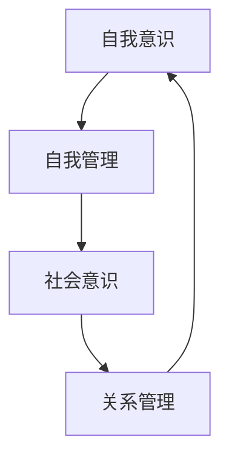

                 

### 文章标题：情商提升：领导者的人际关系管理艺术

> 关键词：情商提升，领导者，人际关系管理，沟通技巧，冲突管理，自我管理，同理心

> 摘要：本文深入探讨情商在领导者人际关系管理中的重要性。通过分析情商的四个基本构成（自我意识、自我管理、社会意识、关系管理），本文揭示了情商如何帮助领导者建立信任、解决冲突和提升团队协作。文章将提供一系列实用技巧和案例，帮助读者提升情商，成为更有效的领导者。

---

### 第1章：情商的概念与重要性

**1.1 情商的定义与历史演变**

情商（Emotional Intelligence，简称EQ）是一种识别、理解、管理和使用情绪的能力。与传统的智商（IQ）不同，EQ关注个体如何处理情绪，以及这些情绪如何影响他们的思维和行为。

情商的概念最早由心理学家约翰·梅耶（John D. Mayer）和彼得·沙洛维（Peter Salovey）在1990年代提出。他们认为，情商包括四个主要领域：

- **自我意识**：认识到自己的情绪状态，理解这些情绪的来源。
- **自我管理**：调节和控制情绪，使其有利于个人目标。
- **社会意识**：理解他人的情绪，识别社会信号。
- **关系管理**：使用情绪和社会知识有效地建立和维护人际关系。

**1.2 情商的重要性**

情商对个人成功和领导者效能至关重要。研究表明，在职场中，情商比智商和技能更能预测一个人的成功。以下是情商的重要性体现：

- **个人成功**：情商高的人更能够应对压力、保持积极心态，从而实现个人目标。
- **领导力**：领导者情商的提升有助于建立信任、激励团队成员和解决冲突，从而提高团队效能。
- **团队合作**：情商高的人更能够理解他人，促进团队合作，提高团队凝聚力。

**1.3 情商的基本构成**

情商的四个构成部分相互关联，共同影响个体的情绪处理能力。以下是一个Mermaid流程图，展示了这些部分之间的联系：



### 第2章：领导者的人际关系管理

**2.1 领导者的人际角色**

领导者扮演多种人际角色，包括导师、参与者、支持者和调解者。每种角色都有其特定的职责和影响力。

- **导师**：提供指导和支持，帮助团队成员发展技能和职业目标。
- **参与者**：与团队成员一起参与工作，共同面对挑战和解决问题。
- **支持者**：鼓励和支持团队成员，确保他们能够在工作中感到安全和满意。
- **调解者**：解决团队内部的冲突，维护和谐的工作环境。

**2.2 人际关系管理的基本原则**

有效的人际关系管理遵循以下基本原则：

- **诚信**：建立透明、正直和可信赖的关系。
- **尊重**：尊重每个人的观点和感受，促进包容和理解。
- **同理心**：站在他人的立场上思考，理解他们的情绪和需求。
- **明确沟通**：清晰、准确地传达信息和意图，避免误解和冲突。

**2.3 人际关系管理的技巧**

人际关系管理的技巧包括倾听、沟通、解决冲突和建立信任。

- **倾听**：全神贯注地听，理解他人的观点和感受。
- **沟通**：使用明确、简洁的语言表达自己的想法和意图。
- **解决冲突**：识别冲突的根本原因，采取适当的策略解决冲突。
- **建立信任**：通过一致性、诚实和透明度建立信任。

### 第3章：自我意识提升

**3.1 自我意识的定义与重要性**

自我意识是指对自己情绪状态的认识和理解。它是情商的基础，对于领导者而言尤为重要。

- **自我意识的概念**：自我意识包括对自己情绪的感知、理解和调节。
- **自我意识对领导力的影响**：自我意识帮助领导者更好地理解自己和他人，从而提高领导效能。

**3.2 自我探索的方法**

提升自我意识的方法包括反思日记、同伴反馈和专业咨询。

- **反思日记**：定期记录自己的想法、情绪和行为，帮助自己更好地理解自己。
- **同伴反馈**：从同事或朋友那里获取反馈，了解自己的盲点和优势。
- **专业咨询**：寻求专业人士的帮助，进行自我探索和情绪调节。

**3.3 自我意识提升的实践**

提升自我意识的实践包括管理情绪、增强自信和明确价值观。

- **管理情绪**：学习情绪调节技巧，保持冷静和专注。
- **增强自信**：通过成就和认可增强自我信心。
- **明确价值观**：了解自己的核心价值观，指导行为和决策。

### 第4章：自我管理技巧

**4.1 情绪管理**

情绪管理是自我管理的重要组成部分。以下是一个情绪管理的伪代码：

```pseudo
function manageEmotion(emotion, context):
    if emotion is negative:
        analyze emotion (source, impact)
        apply coping strategies (distraction, relaxation)
        seek support (friends, professionals)
    else if emotion is positive:
        acknowledge and celebrate emotion
        use emotion to inspire action
    end if
end function
```

**4.2 时间管理**

时间管理是自我管理的另一关键。以下是一个时间管理的伪代码：

```pseudo
function manageTime():
    set goals
    prioritize tasks
    schedule activities
    monitor progress
    adjust plan as needed
end function
```

**4.3 应对压力的策略**

应对压力的策略包括正面思维、放松技巧和寻求支持。

- **正面思维**：培养积极心态，看到问题的解决方案而非问题本身。
- **放松技巧**：练习冥想、深呼吸和运动等放松技巧。
- **寻求支持**：与家人、朋友或专业人士分享压力，寻求帮助。

### 第5章：社会意识与同理心

**5.1 社会意识的重要性**

社会意识是指对他人的情绪、需求和观点的敏感度。它是领导者建立和维护人际关系的关键。

- **社会关系网络**：通过建立广泛的社会关系网络，领导者可以更好地理解不同群体的需求和期望。
- **社会影响**：领导者通过自己的行为和决策影响社会，推动变革和进步。

**5.2 同理心的发展**

同理心是指站在他人的立场上思考，理解他们的情绪和需求。它是社会意识的核心。

- **同理心的定义**：同理心是一种情感和认知能力，帮助领导者理解他人的感受。
- **同理心的层次**：同理心可以分为初级和高级层次，从简单感知到深入理解。

**5.3 同理心在领导中的应用**

同理心在领导中的应用包括激励团队、解决冲突和促进合作。

- **激励团队**：领导者通过同理心了解团队成员的需求，激发他们的潜力。
- **解决冲突**：领导者通过同理心理解冲突各方的立场，找到解决问题的方案。
- **促进合作**：领导者通过同理心建立信任，促进团队成员之间的合作。

### 第6章：关系管理

**6.1 建立信任**

建立信任是关系管理的关键。以下是一个建立信任的步骤：

1. **诚实与透明**：始终保持诚实和透明，避免误导和欺骗。
2. **一致性**：保持一致的行为和决策，建立可信赖的形象。
3. **尊重**：尊重他人的观点和感受，建立互信的关系。

**6.2 沟通技巧**

沟通技巧是关系管理的重要组成部分。以下是一个有效的沟通技巧：

- **倾听**：倾听对方的观点，避免打断和评判。
- **清晰表达**：使用简洁、明确的语言表达自己的想法和意图。
- **反馈**：给予积极的反馈，增强沟通效果。

**6.3 冲突管理**

冲突管理是关系管理的挑战之一。以下是一个冲突管理的策略：

1. **识别冲突**：了解冲突的原因和影响。
2. **倾听各方**：听取各方的观点和感受。
3. **寻找解决方案**：寻找双方都能接受的解决方案。

**6.4 领导者的沟通风格**

领导者的沟通风格对其人际关系管理有重要影响。以下是一个沟通风格的评估：

1. **评估沟通风格**：了解自己的沟通风格和偏好。
2. **适应不同沟通风格**：根据团队成员的沟通风格调整自己的沟通方式。

### 第7章：情商提升的实践案例

**7.1 情商提升的路径**

情商提升的路径包括持续学习、反思与实践和获取反馈。

- **持续学习**：通过阅读、培训和实践不断提升情商。
- **反思与实践**：通过反思自己的行为和决策，不断改进情商。
- **获取反馈**：从同事、朋友和专业人士那里获取反馈，了解自己的进步和不足。

**7.2 情商提升的挑战与解决方案**

情商提升面临以下挑战：

- **情绪调节困难**：学会情绪调节技巧，如深呼吸和冥想。
- **时间管理困难**：优化时间管理策略，确保有足够的时间进行自我提升。

**7.3 情商提升的实践案例**

以下是一个情商提升的实践案例：

- **背景**：一位领导者意识到自己在情绪管理和人际关系管理方面存在不足。
- **解决方案**：他参加了情商培训，学习了情绪调节和沟通技巧，并开始记录反思日记。
- **结果**：通过持续的学习和实践，他的情绪管理能力得到显著提升，人际关系也变得更加和谐。

### 第8章：情商提升的策略与未来展望

**8.1 情商提升的策略**

情商提升的策略包括：

- **组织层面**：组织可以提供情商培训和辅导，帮助员工提升情商。
- **个人层面**：个人可以通过学习、反思和实践不断提升情商。

**8.2 情商提升的未来趋势**

情商提升的未来趋势包括：

- **新技术的应用**：如人工智能和虚拟现实技术，可以帮助个人和团队更好地理解和提升情商。
- **社会变革的影响**：随着社会的不断变化，情商在个人成功和组织发展中的作用将日益凸显。

**8.3 情商提升的意义与价值**

情商提升对个人和组织都有深远的意义和价值：

- **个人成长**：情商提升有助于个人实现职业和个人目标，提高生活满意度。
- **组织发展**：情商提升有助于建立高效、和谐的团队，提高组织绩效。

### 结论

情商提升是领导者不可或缺的能力。通过本文的探讨，我们了解到情商的四个基本构成（自我意识、自我管理、社会意识、关系管理）以及如何在领导实践中应用这些构成。情商提升不仅有助于个人成长，也对组织发展具有深远影响。让我们共同努力，提升情商，成为更有效的领导者。

---

**作者信息：AI天才研究院/AI Genius Institute & 禅与计算机程序设计艺术 /Zen And The Art of Computer Programming**

