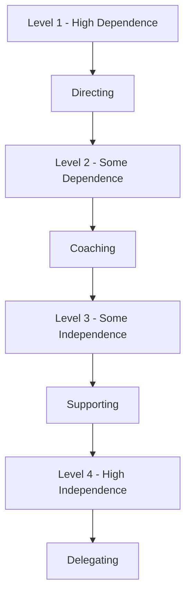

                 

## 1. Introduction to Situational Leadership Theory

Situational Leadership Theory (SLT) is a leadership model that emphasizes the importance of adapting one's leadership style to the specific needs of subordinates and the situational context. Developed by Paul Hersey and Ken Blanchard in the 1960s, this theory proposes that effective leadership is not a one-size-fits-all approach but rather a dynamic process that requires flexibility and adaptability.

### Core Concepts of SLT

The foundation of Situational Leadership Theory is the idea that leadership effectiveness depends on understanding the readiness level of subordinates. Readiness is defined as the willingness and ability of a person to undertake a specific task. SLT identifies four levels of readiness:

1. **Level 1: S1 - High Dependence**: Subordinates are not only unwilling but also unable to perform the required task. They lack both the skills and the motivation.
2. **Level 2: S2 - Some Dependence**: Subordinates are willing but unable to perform the task effectively. They may lack the necessary skills or experience.
3. **Level 3: S3 - Some Independence**: Subordinates are both willing and able to perform the task but may require some guidance or supervision.
4. **Level 4: S4 - High Independence**: Subordinates are fully willing and able to perform the task independently, with minimal guidance or supervision required.

### Leadership Styles in SLT

SLT identifies four primary leadership styles, each tailored to address different levels of readiness:

1. **Directing (S1)**: The leader closely supervises the subordinate, providing specific instructions and monitoring progress. This style is most effective when the subordinate is at Level 1.
2. ** coaching (S2)**: The leader provides guidance and support, helping the subordinate to develop the skills and confidence needed to perform the task. This style is best suited for Level 2 readiness.
3. **Supporting (S3)**: The leader offers encouragement and autonomy, allowing the subordinate to take on more responsibility and make decisions. This style is ideal for Level 3 readiness.
4. **Delegating (S4)**: The leader gives the subordinate full autonomy to perform the task, providing only necessary support. This style is appropriate when the subordinate is at Level 4.

### Importance of Adaptability

One of the key principles of Situational Leadership Theory is that effective leaders must be adaptable and able to shift between different leadership styles as the situation and the readiness of their subordinates change. This adaptability is crucial for building a motivated and high-performing team.

## 2. Core Concepts of Situational Leadership Theory

### Readiness Levels and Their Characteristics

The core of Situational Leadership Theory lies in understanding the readiness levels of subordinates, as it dictates the appropriate leadership style to employ. Each readiness level is characterized by specific traits and requires a tailored approach to maximize effectiveness.

**Level 1: S1 - High Dependence**

At this level, subordinates lack both the willingness and the ability to perform the task. They might be new to the role or completely unfamiliar with the task at hand. Characteristics include:

- Limited or no experience.
- Lack of confidence.
- Need for detailed instructions.

**Level 2: S2 - Some Dependence**

Subordinates at this level are willing but unable to perform the task effectively. They might have some basic knowledge or skills but require additional guidance and support. Key traits include:

- Basic understanding of the task.
- Incomplete skills or knowledge.
- Need for guidance and supervision.

**Level 3: S3 - Some Independence**

At this stage, subordinates are both willing and able to perform the task but might need some guidance or feedback. Characteristics include:

- Competent and confident.
- Requires some direction and support.
- May need periodic check-ins for reassurance.

**Level 4: S4 - High Independence**

Subordinates at this level are fully capable and willing to perform the task independently. They require minimal supervision and are confident in their abilities. Key traits include:

- High level of competence and confidence.
- Able to make independent decisions.
- Requires minimal intervention from the leader.

### Relationship Between Readiness and Leadership Styles

The effectiveness of a leader's approach is highly dependent on the subordinate's readiness level. Here is how the different readiness levels map to the appropriate leadership styles:

- **Directing (S1)**: When subordinates are at Level 1, they need detailed instructions and close supervision. Directing provides this by giving clear, step-by-step guidance.
  
- **Coaching (S2)**: At Level 2, subordinates need help developing their skills. Coaching involves mentoring and providing constructive feedback to improve performance.
  
- **Supporting (S3)**: Subordinates at Level 3 benefit from autonomy and encouragement. Supporting involves providing support while allowing subordinates to take responsibility for their tasks.
  
- **Delegating (S4)**: Level 4 subordinates require minimal supervision. Delegating involves entrusting them with tasks and providing only necessary support.

### Mermaid Flowchart of Readiness Levels and Leadership Styles

The following Mermaid diagram illustrates the relationship between readiness levels and leadership styles, showcasing the adaptability required for effective leadership:

This flowchart visually represents how the readiness level of subordinates determines the appropriate leadership style, emphasizing the need for flexibility in leadership approaches.

## 3. Applications of Situational Leadership Theory in Modern Enterprises

Situational Leadership Theory (SLT) has found broad applicability in modern enterprises due to its focus on adapting leadership styles to the specific needs of individuals and teams. This section explores how SLT can be effectively applied in various business contexts, highlighting its benefits and practical implications.

### Improving Team Performance

One of the primary applications of SLT in modern enterprises is in improving team performance. By understanding the readiness levels of team members, leaders can tailor their management approaches to enhance motivation, collaboration, and productivity. For example:

- **Level 1: High Dependence**: New employees or those in unfamiliar roles may benefit from a directing style initially, where leaders provide clear instructions and close supervision to help them acclimate to their new environment.
- **Level 2: Some Dependence**: As team members gain more experience, a coaching style can be applied to help them develop the skills and confidence needed to perform their tasks more effectively.
- **Level 3: Some Independence**: Experienced team members who require some guidance but can largely work independently are best managed through a supporting style, which allows them to take on more responsibilities and make decisions.
- **Level 4: High Independence**: For high-performing, self-reliant team members, a delegating style can be employed, empowering them to work autonomously and contribute to strategic goals.

### Enhancing Employee Engagement

SLT also plays a crucial role in enhancing employee engagement. When leaders adapt their leadership style to align with the readiness levels of their team members, it fosters a sense of trust, respect, and ownership. This, in turn, leads to higher levels of motivation and job satisfaction. Key applications include:

- **Level 1: High Dependence**: Providing new employees with a supportive environment and clear guidance helps them feel valued and supported, reducing anxiety and increasing their willingness to learn.
- **Level 2: Some Dependence**: Offering constructive feedback and opportunities for growth helps employees at this stage to feel more confident and engaged in their work.
- **Level 3: Some Independence**: Allowing team members to take on more responsibilities and make decisions can enhance their sense of autonomy and contribution to the organization.
- **Level 4: High Independence**: By trusting high-performing employees to work autonomously, leaders can foster a culture of empowerment and innovation, leading to higher levels of engagement and job satisfaction.

### Adapting to Organizational Changes

Modern enterprises often face rapid changes in their operating environments, whether due to technological advancements, market dynamics, or organizational restructuring. Situational Leadership Theory can help leaders navigate these changes by:

- **Level 1: High Dependence**: During times of uncertainty or transition, leaders may need to provide clear direction and support to help employees adjust to new roles or responsibilities.
- **Level 2: Some Dependence**: As employees begin to understand the changes, coaching can be used to help them develop the skills needed to thrive in the new environment.
- **Level 3: Some Independence**: Once employees are more comfortable with the changes, they can take on more responsibilities, and leaders can adopt a supportive role, providing encouragement and feedback.
- **Level 4: High Independence**: As the organization stabilizes, leaders can delegate more authority to their team members, enabling them to contribute to strategic initiatives and drive innovation.

### Specific Applications in Different Business Areas

SLT can be applied in various business areas to address specific challenges and leverage the strengths of different team members. Here are some examples:

- **Customer Service**: Leaders can use SLT to coach customer service teams to handle complex customer issues effectively while providing clear guidance to new team members.
- **Project Management**: Project managers can use SLT to adjust their leadership style based on the project phase and team readiness, ensuring timely delivery and high-quality outcomes.
- **Sales and Marketing**: Leaders can apply SLT to motivate and develop sales teams, providing targeted support and encouragement to meet specific sales targets.

### Conclusion

The application of Situational Leadership Theory in modern enterprises offers a dynamic and adaptable framework for leaders to enhance team performance, improve employee engagement, and navigate organizational changes effectively. By understanding and adapting to the readiness levels of their team members, leaders can create a supportive and empowering work environment that drives success and innovation.

## 4. Case Studies in Situational Leadership

To illustrate the practical application of Situational Leadership Theory (SLT) in real-world scenarios, we will examine several case studies from diverse industries. These cases demonstrate how leaders have effectively utilized SLT to address specific challenges and improve team performance.

### Case Study 1: Tech Company's Onboarding Process

A leading tech company faced the challenge of onboarding a large number of new software developers who had diverse backgrounds and varying levels of experience. The company adopted a phased onboarding approach based on SLT, with the following steps:

1. **Level 1: High Dependence**: New developers were initially placed in a training program where they received comprehensive guidance on company policies, coding standards, and project-specific requirements. They were closely supervised by mentors who provided step-by-step instructions and immediate feedback.
2. **Level 2: Some Dependence**: As developers progressed through the training, they were given more responsibility. They participated in coding exercises and were encouraged to seek help when needed. The coaching style involved regular check-ins with mentors to discuss challenges and provide guidance on improving their skills.
3. **Level 3: Some Independence**: As new developers became more comfortable with their roles, they were given the autonomy to work on smaller projects. Leaders provided support through regular meetings and encouraged developers to take initiative and make decisions.
4. **Level 4: High Independence**: Over time, developers gained sufficient experience and confidence to work on complex projects independently. They were entrusted with critical tasks and given the freedom to innovate and contribute to strategic initiatives.

The result was a highly effective onboarding process that enabled new developers to quickly become productive members of the team, leading to improved project timelines and higher-quality deliverables.

### Case Study 2: Retail Chain's Sales Team

A large retail chain was experiencing inconsistent sales performance across its stores. To address this issue, the company's leadership team adopted SLT to tailor their management approach to the readiness levels of the sales team members. The steps taken were as follows:

1. **Level 1: High Dependence**: New sales associates were given detailed training on customer service protocols, product knowledge, and sales techniques. They were closely supervised and provided with checklists and scripts to ensure they followed company standards.
2. **Level 2: Some Dependence**: As sales associates gained more experience, they were given more autonomy but still required periodic guidance. Leaders used a coaching style to help them improve their sales techniques and address specific challenges they faced.
3. **Level 3: Some Independence**: Experienced sales associates were encouraged to take on additional responsibilities, such as managing specific product categories or leading sales initiatives. They received support through regular feedback and encouragement to explore innovative sales strategies.
4. **Level 4: High Independence**: Top-performing sales associates were given full autonomy to manage their sections and contribute to the company's strategic goals. They were empowered to make decisions and drive sales growth.

The implementation of SLT led to a significant improvement in sales performance across all stores. Sales associates felt more engaged and motivated, resulting in higher customer satisfaction and increased revenue.

### Case Study 3: Non-Profit Organization's Volunteer Management

A non-profit organization faced challenges in managing its large volunteer base, which included individuals with varying levels of experience and commitment. The organization's leadership decided to apply SLT to enhance volunteer engagement and effectiveness. The steps taken were as follows:

1. **Level 1: High Dependence**: New volunteers were welcomed and given a clear overview of the organization's mission and the tasks they would be involved in. They were closely supervised and provided with specific instructions to ensure they understood their roles.
2. **Level 2: Some Dependence**: As volunteers gained more familiarity with the organization's operations, they were given additional responsibilities and encouraged to participate in training sessions to develop their skills.
3. **Level 3: Some Independence**: Experienced volunteers were empowered to take on leadership roles within their teams and were given the freedom to make decisions on how to accomplish their tasks. They received ongoing support and encouragement from leadership.
4. **Level 4: High Independence**: High-performing volunteers were given the opportunity to contribute to strategic planning and decision-making processes. They were recognized for their contributions and given the autonomy to drive initiatives that aligned with the organization's goals.

The application of SLT led to a significant increase in volunteer engagement and retention. Volunteers felt valued and supported, resulting in a more effective and motivated team that contributed to the organization's success.

### Conclusion

These case studies demonstrate the practical benefits of applying Situational Leadership Theory in various contexts. By adapting leadership styles to the readiness levels of team members, organizations can improve performance, engagement, and overall success. The flexibility of SLT allows leaders to create a supportive and empowering environment that fosters growth and innovation.

## 5. Strategies for Implementing Situational Leadership

Implementing Situational Leadership Theory (SLT) in modern enterprises requires a strategic approach that includes comprehensive planning, ongoing training, and continuous feedback. Here are key strategies to effectively integrate SLT into organizational leadership practices:

### 1. Assessing Readiness Levels

The first step in implementing SLT is to accurately assess the readiness levels of employees. This involves conducting individual and team assessments to understand their skills, confidence, and willingness to undertake tasks. Tools such as self-assessment questionnaires, performance evaluations, and 360-degree feedback can be utilized to gather relevant data. The insights gained from these assessments will inform the appropriate leadership styles to adopt for each individual or team.

### 2. Developing a Customized Leadership Development Plan

Based on the readiness level assessments, leaders should develop customized leadership development plans for individuals and teams. These plans should outline specific goals, training requirements, and milestones to help employees progress through the readiness levels. Leaders can use coaching, mentoring, and training programs to address skill gaps and build the confidence of their team members.

### 3. Providing Ongoing Training and Support

Continuous training and support are essential for the successful implementation of SLT. Leaders should provide regular training sessions on leadership skills, communication techniques, and team management strategies. These sessions can be conducted through workshops, webinars, and on-the-job training. Additionally, leaders should be available for one-on-one coaching to provide personalized guidance and support to their team members.

### 4. Adopting a Flexible Leadership Style

Leaders must be willing to adapt their leadership style based on the readiness levels of their team members. This requires a mindset shift from a one-size-fits-all approach to a more dynamic and responsive style. Leaders should regularly evaluate the effectiveness of their current leadership style and be prepared to make adjustments as needed. For example, if a team member moves from Level 2 to Level 3, the leader should transition from a coaching style to a supporting style to provide the right level of autonomy and encouragement.

### 5. Encouraging Open Communication

Effective communication is crucial for implementing SLT. Leaders should create a culture of open communication where team members feel comfortable sharing their thoughts, concerns, and progress. Regular team meetings, feedback sessions, and open forums can facilitate this communication. Leaders should also be attentive listeners and provide constructive feedback to help team members grow and develop.

### 6. Measuring and Monitoring Progress

To ensure the successful implementation of SLT, organizations should establish metrics to measure the effectiveness of the leadership approach. Key performance indicators (KPIs) such as employee engagement scores, productivity rates, and team satisfaction levels can be used to assess the impact of SLT. Regular monitoring and evaluation will help identify areas for improvement and ensure that leaders are adapting their styles effectively.

### 7. Providing Feedback and Recognition

Leaders should provide ongoing feedback and recognition to team members based on their performance and progress. Positive reinforcement can motivate team members to continue improving and reaching their full potential. Recognition can take various forms, including public acknowledgment, rewards, and opportunities for advancement. Regular performance reviews and feedback sessions are important for this purpose.

### 8. Building a Leadership Development Program

To sustain the implementation of SLT, organizations should invest in a comprehensive leadership development program. This program should include leadership training, mentoring, and succession planning to ensure that future leaders are equipped with the skills and knowledge to apply SLT effectively. The program should also encourage leaders to continuously learn and adapt their approaches to changing organizational needs.

### Conclusion

Implementing Situational Leadership Theory in modern enterprises requires a strategic, data-driven approach that focuses on assessing readiness levels, providing ongoing support and training, and fostering a culture of open communication and feedback. By adopting these strategies, organizations can create a dynamic and adaptable leadership environment that drives team performance and employee engagement.

## 6. Challenges and Solutions in Using Situational Leadership

While Situational Leadership Theory (SLT) offers a powerful framework for adapting leadership styles to the specific needs of individuals and teams, its implementation is not without challenges. This section will identify and address some of the common obstacles faced when using SLT, along with practical solutions to overcome them.

### 1. Difficulty in Assessing Readiness Levels

One of the primary challenges in applying SLT is accurately assessing the readiness levels of employees. Misjudging an individual's readiness can lead to ineffective leadership styles, which can hinder performance and engagement. To address this challenge, organizations can:

- **Implement Standardized Assessment Tools**: Utilize standardized assessment tools such as readiness questionnaires, 360-degree feedback, and performance evaluations to gather data on employee readiness. These tools provide a structured approach to assessing readiness levels.
- **Provide Training for Leaders**: Equip leaders with the skills and knowledge needed to conduct effective readiness assessments. Training programs can cover techniques for observing behavior, conducting interviews, and interpreting assessment results.

### 2. Inconsistency in Leadership Styles

Consistency in applying the appropriate leadership style is critical for the success of SLT. However, leaders may struggle to maintain consistency due to varying workloads, emotional states, or personal biases. To ensure consistency, organizations can:

- **Develop Clear Leadership Guidelines**: Create detailed guidelines and checklists that outline the appropriate leadership style for each readiness level. Leaders can refer to these guidelines to ensure consistency in their approach.
- **Implement Regular Leadership Coaching**: Offer regular coaching sessions for leaders to discuss their leadership practices and receive feedback on their consistency. Coaching can help leaders identify and address any biases or challenges they face in maintaining consistency.

### 3. Lack of Trust and Autonomy

Implementing a delegating style at Level 4 requires a high level of trust and autonomy from leaders. However, team members may resist this shift due to a lack of trust in their leaders' decision-making abilities or fear of losing control. To build trust and encourage autonomy:

- **Establish Clear Communication Channels**: Open and transparent communication is crucial for building trust. Leaders should regularly share information about organizational goals, decision-making processes, and the rationale behind their choices.
- **Provide Opportunities for Feedback**: Involve team members in decision-making processes and seek their input. This helps build trust and shows that their opinions are valued. Regular feedback sessions can also help address any concerns or misunderstandings.

### 4. Time Constraints

Implementing SLT requires ongoing assessment, training, and adaptation, which can be time-consuming for busy leaders. To address time constraints:

- **Prioritize Readiness Assessments**: Allocate time in team meetings or individual check-ins to assess readiness levels. Leaders can also leverage technology tools that automate and streamline the assessment process.
- **Leverage Team Collaboration**: Encourage team members to assist in readiness assessments and leadership development efforts. This shared responsibility can help alleviate the burden on individual leaders.

### 5. Cultural Resistance

Organizational culture may resist the shift to a more adaptable and flexible leadership approach. To overcome cultural resistance:

- **Lead by Example**: Leaders should demonstrate the value of SLT through their own leadership practices. When team members see leaders adapting their styles effectively, they are more likely to embrace the change.
- **Engage Employees in the Process**: Involve employees in discussions about the benefits of SLT and how it aligns with organizational goals. This can help build support and reduce resistance.

### Conclusion

Implementing Situational Leadership Theory can present several challenges, but with strategic planning and effective solutions, these obstacles can be overcome. By assessing readiness levels accurately, maintaining consistency, building trust, managing time effectively, and addressing cultural resistance, organizations can create a dynamic and adaptable leadership environment that drives team performance and employee engagement.

## 7. Future Directions and Research Opportunities

Situational Leadership Theory (SLT) has established itself as a valuable framework for adaptive leadership within modern enterprises. However, there are numerous avenues for future research and exploration to further enhance its applicability and effectiveness. This section identifies potential research directions and outlines areas where further investigation can contribute to the evolution of SLT.

### 1. Advancements in Technology for Readiness Assessment

One area for future research is the development of advanced technological tools for assessing employee readiness levels. Current methods, such as surveys and interviews, can be time-consuming and may not always provide accurate insights. Research into artificial intelligence (AI) and machine learning (ML) algorithms that can analyze behavioral data, performance metrics, and other relevant information to predict readiness levels could revolutionize the assessment process. This could lead to more precise and efficient leadership style adjustments.

### 2. Integrating Situational Leadership with Other Theories

Another promising research direction is the integration of Situational Leadership Theory with other established leadership and management frameworks. For instance, combining SLT with emotional intelligence (EQ) theories or servant leadership principles could offer a more holistic approach to leadership development. This integration might reveal new insights and strategies for adapting leadership styles in diverse organizational contexts.

### 3. Global and Cross-Cultural Applications

The applicability of SLT across different cultures and global contexts is another area ripe for research. While SLT has been widely adopted, understanding how cultural differences and global variables influence its effectiveness is crucial. Future studies could explore the nuances of leadership styles in various cultural settings and develop culturally adapted versions of SLT to enhance its global relevance.

### 4. Longitudinal Studies on SLT Impact

Longitudinal studies that track the long-term impact of SLT on employee performance, engagement, and organizational success could provide valuable insights. These studies would involve collecting data over extended periods to understand the sustained effects of SLT and identify best practices for its implementation. Such research could also help identify potential pitfalls and provide guidelines for overcoming them.

### 5. Empirical Validation and Case Studies

Further empirical validation of SLT through rigorous experimental research and comprehensive case studies is essential. Conducting controlled experiments that compare the effectiveness of SLT against other leadership models could provide stronger evidence of its advantages. Additionally, in-depth case studies that document real-world applications of SLT in diverse industries and organizations can offer practical lessons and strategies for successful implementation.

### 6. Personalized Leadership Development

With the rise of personalized learning and development, there is potential to explore personalized leadership development programs based on individual readiness profiles. Research into how to tailor leadership development plans to individual needs could lead to more effective and engaging leadership training programs.

### Conclusion

The future of Situational Leadership Theory lies in continued research and exploration to enhance its applicability, effectiveness, and adaptability in diverse organizational contexts. By pursuing these research directions, scholars and practitioners can further refine SLT and contribute to its evolution as a cornerstone of modern leadership practice.

## Conclusion

In summary, this article has delved into the core principles of Situational Leadership Theory (SLT) and its practical applications in modern enterprises. We began by introducing SLT and explaining its foundational concepts, including the four readiness levels and corresponding leadership styles. We then explored how SLT can be effectively applied in various business contexts, such as improving team performance and enhancing employee engagement, through case studies and strategic implementation plans.

We also addressed the challenges associated with implementing SLT and provided solutions to common obstacles, including difficulties in assessing readiness levels and managing cultural resistance. Furthermore, we discussed future research directions and the potential for integrating SLT with other leadership theories and technologies.

Situational Leadership Theory offers a powerful framework for leaders to adapt their management approaches to the specific needs of their teams, creating a dynamic and empowering work environment. By understanding and applying SLT, leaders can drive performance, engagement, and innovation within their organizations. We encourage readers to explore further resources and case studies to deepen their understanding of this valuable leadership model.

