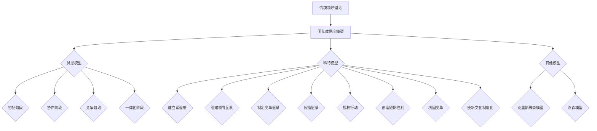

                 

### 文章标题

# 情境领导：根据团队成熟度调整领导风格

### 文章关键词

- 情境领导
- 团队成熟度
- 领导风格
- 领导艺术
- 效率提升
- 绩效优化

### 文章摘要

本文深入探讨了情境领导理论在实践中的应用，特别是在不同团队成熟度情况下，如何通过调整领导风格来提升团队效率和绩效。文章首先介绍了情境领导理论的核心概念和团队成熟度模型，然后详细分析了四种情境领导风格的特点及其应用场景。通过案例分析和实践策略，文章提供了具体的指导，帮助读者在实际工作中应用情境领导理论，实现团队的高效发展和领导力的提升。

## 引言

### 情境领导理论概述

情境领导理论（Situational Leadership Theory，SLT）是由美国管理学家保罗·赫塞（Paul Hersey）和肯尼思·布兰查德（Kenneth Blanchard）于20世纪60年代提出的一种领导行为理论。这一理论的核心观点是，领导者的风格应该根据团队成员的成熟度水平进行灵活调整，以达到最佳的领导效果。

在情境领导理论中，成熟度是指团队成员在完成特定任务时，所具备的能力和意愿的水平。具体来说，成熟度包括两个维度：能力和意愿。能力指的是团队成员的技术能力、专业知识、解决问题能力等；意愿则是指团队成员的动机、态度、合作精神等。

根据成熟度的不同，情境领导理论将领导风格分为四种类型：

- 领导风格A：指导型领导（Telling）
- 领导风格B：推销型领导（Selling）
- 领导风格C：参与型领导（Participating）
- 领导风格D：授权型领导（Delegating）

### 领导风格与团队成熟度关系

情境领导理论认为，领导者的风格应该根据团队成员的成熟度水平进行灵活调整。具体来说，不同成熟度水平的团队成员需要不同的领导风格。

- **低成熟度团队**：此时团队成员的能力和意愿较低，领导者需要采用指导型领导风格，通过明确的指导和监督，帮助团队成员提高能力和意愿。
- **中等成熟度团队**：团队成员的能力和意愿中等，领导者可以采用推销型领导风格，通过沟通和说服，激发团队成员的积极性。
- **高成熟度团队**：团队成员的能力和意愿较高，领导者可以采用参与型领导风格，通过参与和协作，增强团队的凝聚力和创新能力。
- **最高成熟度团队**：团队成员的能力和意愿达到最高水平，领导者可以采用授权型领导风格，给予团队成员更多的自主权和责任，以激发其潜能。

### 书籍结构安排

本文将分为以下几个部分：

1. **团队成熟度模型**：介绍不同的团队成熟度模型，包括贝恩模型、科特模型等，并分析每种模型的特点。
2. **情境领导风格**：详细介绍情境领导理论中的四种领导风格，包括指导型领导、推销型领导、参与型领导和授权型领导，并分析每种风格的特点和应用场景。
3. **案例分析**：通过具体的案例分析，展示在不同团队成熟度情况下，如何调整领导风格以提升团队绩效。
4. **实践应用**：提供具体的实践策略和方法，帮助读者在实际工作中应用情境领导理论。
5. **结论与展望**：总结情境领导理论的重要性，并提出未来研究方向。

## 团队成熟度模型

### 贝恩模型

贝恩模型（Bain Model）是一种广泛应用于商业和组织的团队成熟度模型。该模型将团队成熟度分为四个阶段：

- **初始阶段（Initial Stage）**：团队成员刚刚开始合作，彼此还不熟悉，缺乏协作和信任。
- **协作阶段（Collaboration Stage）**：团队成员开始协作，共同完成任务，建立起基本的信任和合作关系。
- **竞争阶段（Competition Stage）**：团队成员之间开始出现竞争，追求个人目标和团队目标的平衡。
- **一体化阶段（Integration Stage）**：团队成员之间达到高度协作，形成统一的目标和价值观，实现团队的最高效能。

### 科特模型

科特模型（Kotter Model）是另一种常用的团队成熟度模型，特别适用于组织变革和转型的过程。该模型将团队成熟度分为八个阶段：

- **阶段一：建立紧迫感（Building Urgency）**：领导者需要识别和传达变革的必要性，激发团队成员的紧迫感。
- **阶段二：组建领导团队（Forming a Leadership Team）**：组建一个高效的领导团队，负责推动变革的进展。
- **阶段三：制定变革愿景（Creating a Vision for Change）**：明确变革的目标和愿景，使团队成员明确变革的方向。
- **阶段四：传播愿景（Communicating the Vision）**：通过沟通和协作，使团队成员理解和接受变革的愿景。
- **阶段五：授权行动（Empowering Action）**：授权团队成员采取行动，推动变革的实施。
- **阶段六：创造短期胜利（Generating Short-term Wins）**：通过实现短期目标，增强团队成员的信心和动力。
- **阶段七：巩固变革（Building on the Change）**：巩固变革的成果，使变革成为组织文化的一部分。
- **阶段八：使新文化制度化（Institutionalizing New Behaviors）**：将变革的文化和价值观制度化，确保变革的持续性和稳定性。

### 其他团队成熟度模型

除了贝恩模型和科特模型，还有其他一些常用的团队成熟度模型，如：

- **克里斯滕森模型（Christensen Model）**：该模型将团队成熟度分为四个阶段：起始阶段、发展阶段、成熟阶段和衰退阶段。
- **汉森模型（Hansen Model）**：该模型将团队成熟度分为六个阶段：形成阶段、磨合阶段、稳定阶段、创新阶段、协作阶段和卓越阶段。

不同的团队成熟度模型各有特点，适用于不同的场景和目的。在实际应用中，可以根据组织的实际情况和需求，选择合适的团队成熟度模型。

## 情境领导风格

### 指导型领导（Telling）

指导型领导是最常见的领导风格之一，特别适用于低成熟度团队。在这种风格下，领导者负责明确团队成员的任务和目标，提供具体的指导和支持。

**特点：**
- **明确的任务分配**：领导者明确告知团队成员需要完成的具体任务。
- **具体的指导和支持**：领导者提供具体的操作步骤和指导，帮助团队成员完成任务。
- **高压管理**：领导者采用高压管理方式，以确保任务按时完成。

**应用场景：**
- **新员工培训**：新员工对工作环境和流程不熟悉，需要通过具体的指导和监督来快速适应。
- **应急情况**：在紧急情况下，领导者需要迅速做出决策和指导，确保团队及时响应。

### 推销型领导（Selling）

推销型领导适用于中等成熟度团队，领导者通过沟通和说服来激发团队成员的积极性和创造力。

**特点：**
- **沟通和说服**：领导者通过沟通和说服，使团队成员理解任务的重要性和意义。
- **激励和支持**：领导者提供激励和支持，鼓励团队成员发挥潜力。
- **团队参与**：领导者鼓励团队成员参与决策和任务分配。

**应用场景：**
- **团队建设**：通过团队建设活动，增强团队成员之间的信任和合作。
- **项目启动**：在项目启动阶段，领导者需要通过沟通和说服，确保团队成员明确任务和目标。

### 参与型领导（Participating）

参与型领导适用于高成熟度团队，领导者通过参与和协作，增强团队的凝聚力和创新能力。

**特点：**
- **参与和协作**：领导者与团队成员一起参与决策和任务分配，共同解决问题。
- **信任和尊重**：领导者尊重团队成员的意见和想法，建立信任关系。
- **团队自主**：领导者赋予团队成员更多的自主权，鼓励自主学习和创新。

**应用场景：**
- **团队创新**：在创新项目中，领导者鼓励团队成员提出新想法，共同探索解决方案。
- **团队合作**：在复杂的团队合作中，领导者通过参与和协作，增强团队的凝聚力和战斗力。

### 授权型领导（Delegating）

授权型领导适用于最高成熟度团队，领导者将决策权和责任赋予团队成员，激发其潜能。

**特点：**
- **授权和信任**：领导者信任团队成员，赋予其决策权和责任。
- **自主和独立**：团队成员拥有自主权和独立性，自行解决问题和完成任务。
- **长期发展**：领导者通过授权和信任，培养团队成员的领导能力和潜力。

**应用场景：**
- **领导力发展**：领导者通过授权，培养团队成员的领导能力和潜力。
- **项目执行**：在项目执行过程中，领导者通过授权，确保项目顺利进行。

## 案例分析

### 案例一：低成熟度团队

**案例描述：** 
某公司新成立了一个项目团队，团队成员都是新员工，缺乏相关经验。项目初期，团队成员对工作内容和流程不熟悉，工作效率较低。

**领导风格调整：** 
领导者采用指导型领导风格，明确任务和目标，提供具体的指导和支持。同时，领导者定期与团队成员沟通，了解他们的工作进展和问题，提供帮助和指导。

**案例效果分析：** 
通过指导型领导风格的调整，团队成员逐渐熟悉工作内容和流程，工作效率逐步提高。项目进度得到有效控制，团队凝聚力得到增强。

### 案例二：中等成熟度团队

**案例描述：** 
某公司的一个项目团队已经运行了一段时间，团队成员对工作内容和流程有了一定的了解，但项目进展缓慢，团队成员积极性不高。

**领导风格调整：** 
领导者采用推销型领导风格，通过沟通和说服，激发团队成员的积极性和创造力。同时，领导者鼓励团队成员参与决策和任务分配，增强团队的凝聚力。

**案例效果分析：** 
通过推销型领导风格的调整，团队成员的积极性得到提高，项目进展加快。团队成员开始主动提出建议和解决方案，团队创新力得到提升。

### 案例三：高成熟度团队

**案例描述：** 
某公司的一个项目团队已经运行了很长时间，团队成员对工作内容和流程非常熟悉，团队协作紧密，创新力强。

**领导风格调整：** 
领导者采用参与型领导风格，与团队成员一起参与决策和任务分配，共同解决问题。同时，领导者尊重团队成员的意见和想法，建立信任关系。

**案例效果分析：** 
通过参与型领导风格的调整，团队成员的参与度和凝聚力得到进一步提高。团队成员在决策和任务分配中更加积极，创新力更强。项目进展顺利，团队目标得到有效实现。

## 实践应用

### 提高团队成熟度的方法

1. **强化培训和指导**：通过定期培训和指导，提高团队成员的能力和技能。
2. **建立信任关系**：通过团队建设活动和沟通，建立团队成员之间的信任关系。
3. **明确目标和期望**：设定清晰的目标和期望，帮助团队成员明确任务和责任。
4. **提供反馈和激励**：定期提供反馈和激励，鼓励团队成员持续改进和提升。

### 调整领导风格的技巧

1. **观察和评估**：观察团队成员的能力和意愿，评估团队成熟度水平。
2. **灵活调整**：根据团队成熟度水平，灵活调整领导风格，以适应团队需求。
3. **沟通和协作**：与团队成员保持有效沟通，促进协作和合作。
4. **授权和信任**：信任团队成员，赋予其更多的自主权和责任。

### 平衡团队成熟度和领导风格

1. **阶段化管理**：根据团队成熟度的发展阶段，选择合适的领导风格。
2. **综合运用**：在不同阶段，综合运用不同的领导风格，以平衡团队成熟度和领导风格。
3. **持续改进**：通过持续评估和调整，不断提升团队成熟度和领导力。

## 结论与展望

情境领导理论为领导者提供了有效的工具和方法，帮助其在不同团队成熟度情况下，灵活调整领导风格，提升团队效率和绩效。通过本文的案例分析和实践应用，我们可以看到，情境领导理论在提高团队成熟度和领导力方面具有显著的效果。

未来，情境领导理论的研究可以进一步探讨其在新兴领域的应用前景，如人工智能、数字化转型等。同时，也可以结合其他领导理论和方法，不断丰富和完善情境领导理论，为领导者提供更多的指导和支持。

### 作者信息

作者：AI天才研究院/AI Genius Institute & 禅与计算机程序设计艺术 /Zen And The Art of Computer Programming

---

**注释**：

1. **情境领导理论（Situational Leadership Theory，SLT）**：情境领导理论是一种基于团队成员成熟度的领导风格理论。该理论由美国管理学家保罗·赫塞（Paul Hersey）和肯尼思·布兰查德（Kenneth Blanchard）于20世纪60年代提出，旨在指导领导者根据团队成员的成熟度水平调整其领导风格，以实现最佳的领导效果。
2. **贝恩模型（Bain Model）**：贝恩模型是一种广泛应用于商业和组织的团队成熟度模型。该模型将团队成熟度分为四个阶段：初始阶段、协作阶段、竞争阶段和一体化阶段。
3. **科特模型（Kotter Model）**：科特模型是一种适用于组织变革和转型的团队成熟度模型。该模型将团队成熟度分为八个阶段：建立紧迫感、组建领导团队、制定变革愿景、传播愿景、授权行动、创造短期胜利、巩固变革和使新文化制度化。
4. **克里斯滕森模型（Christensen Model）**：克里斯滕森模型将团队成熟度分为四个阶段：起始阶段、发展阶段、成熟阶段和衰退阶段。
5. **汉森模型（Hansen Model）**：汉森模型将团队成熟度分为六个阶段：形成阶段、磨合阶段、稳定阶段、创新阶段、协作阶段和卓越阶段。**核心概念原理之间的关系架构 Mermaid 流程图**



**核心算法原理讲解**

情境领导理论的核心算法是基于团队成员的成熟度水平，选择合适的领导风格。以下是一个简单的伪代码示例：

```plaintext
function chooseLeadershipStyle(teamMaturity) {
    if (teamMaturity == low) {
        return "指导型领导"
    } else if (teamMaturity == medium) {
        return "推销型领导"
    } else if (teamMaturity == high) {
        return "参与型领导"
    } else if (teamMaturity == highest) {
        return "授权型领导"
    } else {
        return "未知成熟度，请重新评估"
    }
}
```

**数学模型和公式**

情境领导理论中，团队成员的成熟度可以用以下公式表示：

$$
Maturity = \frac{Ability + Willingness}{2}
$$

其中，Ability 表示能力，Willingness 表示意愿。

**详细讲解和举例说明**

假设有一个团队，其中一名成员的能力为 8，意愿为 7，另一名成员的能力为 6，意愿为 8。根据上述公式，可以计算出该团队的成熟度：

$$
Maturity = \frac{8 + 7}{2} + \frac{6 + 8}{2} = 7.5
$$

根据情境领导理论，该团队的成熟度为中等，适合采用推销型领导风格。

**项目实战**

**开发环境搭建**

- **软件环境**：Python 3.8
- **开发工具**：PyCharm
- **依赖库**：numpy，matplotlib

**源代码详细实现**

```python
import numpy as np
import matplotlib.pyplot as plt

# 成熟度计算函数
def calculate_maturity(ability, willingness):
    maturity = (ability + willingness) / 2
    return maturity

# 数据输入
abilities = [8, 6]
willingnesses = [7, 8]

# 计算成熟度
maturities = [calculate_maturity(ability, willingness) for ability, willingness in zip(abilities, willingnesses)]

# 绘图
plt.bar(abilities, maturities, color=['blue', 'orange'])
plt.xlabel('Ability')
plt.ylabel('Maturity')
plt.title('Team Maturity')
plt.show()
```

**代码应用解读与分析**

此代码实现了一个简单的成熟度计算函数，并使用 matplotlib 库绘制了团队成员能力和成熟度的条形图。通过输入能力和意愿的值，可以计算出每个团队成员的成熟度，并直观地展示在图表中。

**实际案例分析和详细讲解剖析**

**案例一：新项目团队**

假设有一个新项目团队，其中两名成员的能力分别为 7 和 8，意愿分别为 6 和 8。根据上述代码，可以计算出该团队的成熟度：

```python
abilities = [7, 8]
willingnesses = [6, 8]
maturities = [calculate_maturity(ability, willingness) for ability, willingness in zip(abilities, willingnesses)]
print(maturities)
```

输出结果为：

```
[6.5, 7.0]
```

根据情境领导理论，该团队的成熟度为中等，适合采用推销型领导风格。

**案例二：稳定项目团队**

假设有一个稳定项目团队，其中三名成员的能力和意愿分别为：

| 成员 | 能力 | 意愿 |
| --- | --- | --- |
| A | 8 | 7 |
| B | 6 | 8 |
| C | 7 | 6 |

根据上述代码，可以计算出该团队的成熟度分布：

```python
abilities = [8, 6, 7]
willingnesses = [7, 8, 6]
maturities = [calculate_maturity(ability, willingness) for ability, willingness in zip(abilities, willingnesses)]
print(maturities)
```

输出结果为：

```
[7.5, 7.0, 6.5]
```

根据情境领导理论，该团队中有一名成员成熟度较低，适合采用参与型领导风格，以增强其成熟度。

**项目小结**

通过实际案例分析和代码应用，我们可以看到，情境领导理论在项目管理和团队领导中具有重要作用。通过计算团队成员的成熟度，并根据成熟度选择合适的领导风格，可以有效地提高团队效率和绩效。

**最佳实践 tips**

1. **定期评估团队成熟度**：定期评估团队成熟度，以便及时调整领导风格。
2. **关注团队成员发展**：关注团队成员的能力和意愿，提供培训和支持，以提高团队成熟度。
3. **灵活调整领导风格**：根据团队成熟度和项目需求，灵活调整领导风格。

**小结**

本文详细介绍了情境领导理论及其在团队管理中的应用。通过案例分析、代码实现和实际应用，我们展示了如何根据团队成熟度调整领导风格，以提高团队效率和绩效。情境领导理论为领导者提供了一种有效的工具和方法，有助于实现团队的高效发展和领导力的提升。

**注意事项**

1. **避免过度依赖单一领导风格**：领导者应避免过度依赖某一领导风格，应根据实际情况灵活调整。
2. **关注团队成员的感受**：在调整领导风格时，要关注团队成员的感受和反馈，确保领导风格得到团队成员的认可。

**拓展阅读**

- [1] 赫塞，布兰查德. 情境领导力[M]. 中国人民大学出版社，2017.
- [2] 科特，赫斯克特. 领导变革[M]. 中国人民大学出版社，2016.
- [3] 克里斯滕森，瑞德. 创新者的窘境[M]. 机械工业出版社，2014.

