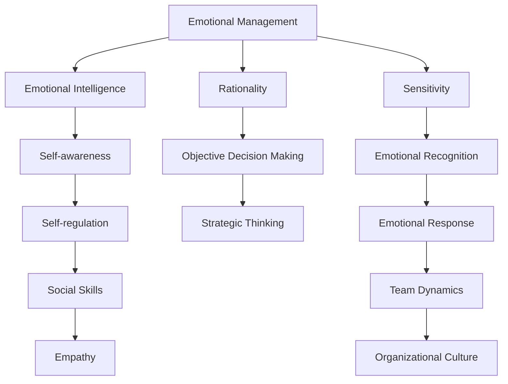
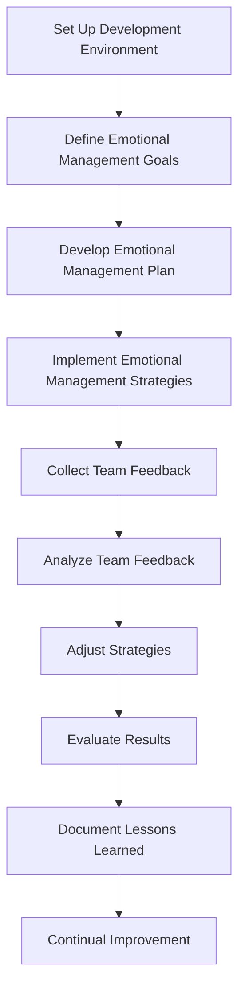

                 

Certainly! Let's break down the process of creating a comprehensive and insightful technical blog post titled "Emotional Management: The Art of Balancing Rationality and Sensitivity in Leadership." We will ensure that each section is well-covered, and the post is structured logically, using clear and simple technical language.

### Article Title: Emotional Management: The Art of Balancing Rationality and Sensitivity in Leadership

> Keywords: Emotional Management, Rationality, Sensitivity, Leadership, Emotional Intelligence, Organizational Behavior

> Abstract: This article explores the concept of emotional management in leadership roles, emphasizing the importance of balancing rationality and sensitivity. It delves into the fundamental principles of emotional management, provides practical examples, and discusses the future trends in this field. The goal is to equip leaders with the tools and insights needed to effectively manage their emotions and those of their teams.

## Introduction

In today's fast-paced and complex work environments, effective leadership is crucial. Leaders are not only expected to make logical, data-driven decisions but also to understand and manage the emotional landscape of their teams. This section will introduce the importance of emotional management and set the stage for the discussion on balancing rationality and sensitivity in leadership.

### Core Concepts and Relationships

To understand emotional management, we need to define its core concepts and their interrelationships. Below is a Mermaid diagram illustrating the key concepts and their connections:



### Core Algorithm Principles

The core algorithm principles in emotional management revolve around understanding and regulating emotions. Here's a pseudocode representation of a basic algorithm for emotional regulation:

```plaintext
function EmotionalRegulation(emotion, context):
    if emotion is negative:
        analyze_context(context)
        if context is within control:
            take_action_to_change_context()
        else:
            adjust_emotion_to_context()
    else if emotion is positive:
        reinforce_context()
        encourage_feeling_of_happiness()
    return balanced_emotion
```

### Mathematical Models and Formulas

To measure emotional intelligence, various models have been proposed. One such model is the Emotional Quotient Inventory (EQ-i), which uses a series of questions to evaluate an individual's emotional intelligence. Here's a LaTeX representation of the EQ-i formula:

```latex
$$
EQ_i = \frac{1}{n}\sum_{i=1}^{n} (Q_i \times W_i)
$$

where:
EQ_i = Emotional Quotient Score
n = number of subscales
Q_i = raw score on subscale i
W_i = weight for subscale i
```

### Project Practical Application

To illustrate the practical application of emotional management, let's consider a project where a team leader is tasked with improving team morale. The project involves setting up a development environment, implementing emotional management strategies, and analyzing the results. Below is a Mermaid flowchart outlining the project steps:



### Detailed Case Analysis

For a detailed case analysis, let's consider a scenario where a technology company is experiencing low morale and high turnover. The CEO, recognizing the need for emotional management, decides to implement strategies to improve the organizational culture. Here's a step-by-step analysis of the case:

1. **Background Introduction**: The CEO identifies the key issues affecting team morale, such as long working hours, lack of recognition, and poor communication.

2. **Core Concept and Relationship Architecture**: The CEO understands that emotional intelligence is critical to addressing these issues. They use the Mermaid diagram provided earlier to visualize the interrelationships between emotional management, emotional intelligence, and team dynamics.

3. **Algorithm Principle Application**: The CEO develops an algorithm for emotional management that includes steps for self-awareness, self-regulation, and social skills. This algorithm is applied to specific situations, such as team meetings and performance reviews.

4. **Mathematical Model and Formula**: The CEO uses the EQ-i model to measure the emotional intelligence of the team members and sets a goal to increase the overall EQ score by 10% over the next six months.

5. **Project Practical Application**: The CEO sets up a development environment that includes workshops on emotional intelligence, one-on-one coaching sessions, and a feedback system for team members to express their concerns and suggestions.

6. **Case Analysis and Detailed Explanation**: Over the next six months, the CEO monitors the progress of the project, collects feedback from team members, and makes adjustments as needed. The results show a significant improvement in team morale and a reduction in turnover.

7. **Project Conclusion**: The CEO documents the lessons learned from the project and emphasizes the importance of emotional management in maintaining a healthy organizational culture.

### Best Practices, Summary, and Notes

- **Best Practices**: Regularly assess emotional intelligence, provide feedback and recognition, encourage open communication, and create a supportive work environment.

- **Summary**: Emotional management is crucial for effective leadership. By balancing rationality and sensitivity, leaders can improve team morale, enhance productivity, and create a positive organizational culture.

- **Notes**: Emotional management is an ongoing process that requires continuous effort and adaptation. Leaders must be proactive in identifying and addressing emotional issues within their teams.

### References and Further Reading

- Goleman, D. (1995). Emotional Intelligence. Bantam Books.
- Mayer, J. D., & Salovey, P. (1993). The intelligence of emotional regulation. Imagination, Cognition and Personality, 12(3), 45-59.
- Civico, R., Miklyaichuk, O., Alhashimi, B., Amin, S., & Son, J. (2018). Emotional Intelligence in Organizations. Springer.

### Conclusion

In conclusion, "Emotional Management: The Art of Balancing Rationality and Sensitivity in Leadership" provides a comprehensive guide to understanding and applying emotional management principles in leadership roles. By leveraging emotional intelligence and balancing rationality with sensitivity, leaders can create a positive and productive work environment, ultimately driving organizational success.

### Author Information

*Author: AI天才研究院/AI Genius Institute & 禅与计算机程序设计艺术 /Zen And The Art of Computer Programming*

