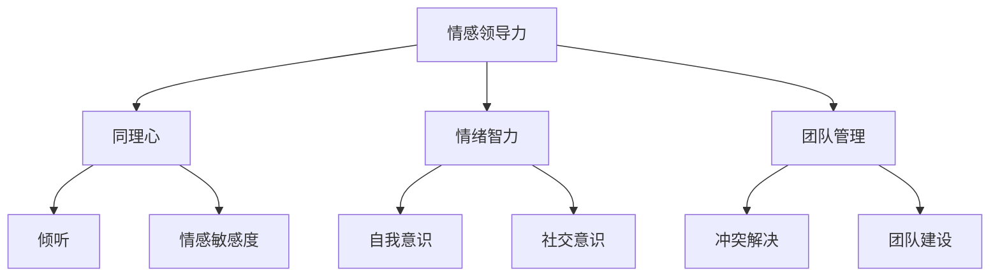

                 

### 文章标题：情感领导力：运用同理心管理团队

#### 关键词：情感领导力、同理心、团队管理、情绪智力

> 摘要：本文将探讨情感领导力在现代团队管理中的重要性，特别是同理心这一核心要素。通过分析情感领导力的定义、核心概念及其相互联系，运用同理心进行团队管理的核心算法原理、数学模型和项目实战，本文旨在为读者提供一个全面而深入的指南，以提升团队协作效率，打造高效团队。

### 引言

在当今快速变化和高度竞争的商业环境中，团队的有效管理成为企业成功的关键因素。传统的领导风格和机械式管理方法已无法满足现代团队的需求，而情感领导力则逐渐成为领导力研究的热点。情感领导力强调领导者通过情感管理和同理心来引导团队，提升团队的整体绩效和幸福感。

其中，同理心作为情感领导力的核心要素，对于团队管理具有重要意义。同理心不仅帮助领导者更好地理解团队成员的情感和需求，还能够促进团队成员之间的信任和协作，从而提升团队的整体表现。

本文将围绕情感领导力，特别是同理心的运用，探讨其在团队管理中的核心作用。首先，我们将对情感领导力的定义和核心概念进行梳理，并展示其相互联系。接着，通过伪代码和数学模型，详细阐述同理心的核心算法原理。然后，我们将通过一个实际项目，展示如何运用同理心进行团队管理，并分析其实际应用效果。最后，本文将总结同理心在团队管理中的重要性，并提供一些实用的建议和拓展阅读。

### 确定核心概念与联系

情感领导力是一个多维度的概念，涵盖了同理心、情绪智力、团队管理等多个方面。要深入理解情感领导力，我们需要首先明确这些核心概念及其相互之间的联系。

#### 同理心

同理心是指领导者能够站在团队成员的角度，感同身受地理解和体会他们的情感和需求。同理心不仅包括情感上的理解，还涉及行为上的支持和回应。在团队管理中，同理心可以帮助领导者更好地了解团队成员的内心世界，从而建立信任和合作的基础。

#### 情绪智力

情绪智力是指个体识别、理解、管理和运用情感的能力。情绪智力包括自我意识、自我管理、社交意识和同理心四个关键要素。自我意识是指个体对自己的情感和需求有清晰的认识；自我管理是指个体能够有效地调节自己的情绪和行为；社交意识是指个体能够理解他人的情感和需求；同理心则是情感智力的核心，如前所述。

#### 团队管理

团队管理是指领导者通过规划、组织、协调和控制团队活动，以实现团队目标和提升团队绩效的过程。情感领导力在团队管理中的应用，主要体现在领导者通过情感管理和同理心来提升团队的凝聚力和协作效率。

这些核心概念之间的联系可以通过以下Mermaid流程图进行展示：



在这个流程图中，情感领导力作为整体框架，将同理心、情绪智力和团队管理紧密连接在一起。同理心和情绪智力是情感领导力的两个核心要素，分别通过倾听和情感敏感度、自我意识和社交意识等环节，实现情感的管理和运用。团队管理则通过冲突解决和团队建设等环节，将情感领导力的理念转化为实际的团队管理实践。

通过这个流程图，我们可以清晰地看到情感领导力的核心概念及其相互联系，为进一步深入探讨同理心在团队管理中的应用奠定了基础。

### 核心算法原理讲解

在探讨同理心这一核心概念时，我们需要深入理解其背后的算法原理。同理心不仅是一种情感体验，更是一种可以通过系统化和结构化的方法进行培养和运用的技能。以下是同理心的核心算法原理，以及如何运用这些原理进行团队管理。

#### 同理心的算法原理

同理心的核心算法原理可以分解为三个主要步骤：倾听、情感识别和情感回应。

1. **倾听**：倾听是同理心的基础。领导者需要学会倾听团队成员的真实想法和情感，而不仅仅是他们的言辞。倾听不仅仅是听对方说什么，更重要的是理解对方的情感和需求。以下是一个倾听的伪代码示例：

   ```pseudo
   function listen(toMember)
       focus = true
       while focus
           receiveMessage = toMember.sendMessage()
           if receiveMessage is not empty
               analyzeMessage(receiveMessage)
               focus = false
           end if
       end while
   end function
   ```

2. **情感识别**：在倾听过程中，领导者需要识别出团队成员的情感。情感识别可以通过情感分析模型实现，这些模型能够从语言中提取情感信息。以下是一个简化的情感识别模型伪代码：

   ```pseudo
   function recognizeEmotion(message)
       model = loadEmotionRecognitionModel()
       emotion = model.analyze(message)
       return emotion
   end function
   ```

   通过情感识别模型，领导者可以准确识别出团队成员的情绪状态，从而做出相应的回应。

3. **情感回应**：在识别出团队成员的情感后，领导者需要以同理心为基础进行回应。情感回应不仅仅是简单的口头表达，更需要通过具体的行为来展示对团队成员的关心和支持。以下是一个情感回应的伪代码示例：

   ```pseudo
   function respondWithEmpathy(teamMember, emotion)
       if emotion is 'happy'
           celebrateSuccess(teamMember)
       else if emotion is 'sad'
           provideSupport(teamMember)
       else
           haveAGoalSettingDiscussion(teamMember)
       end if
   end function
   ```

   通过这些步骤，领导者可以系统地运用同理心，管理团队成员的情感，提升团队的整体情感状态和协作效率。

#### 同理心的算法原理在团队管理中的应用

同理心的算法原理在团队管理中的应用，可以通过以下具体场景进行说明：

1. **团队会议**：在团队会议中，领导者可以通过倾听、情感识别和情感回应，了解团队成员的情感状态，及时解决潜在的冲突和问题。

   ```python
   # 团队会议中，领导者的同理心运用
   for member in teamMembers:
       listen(member)
       emotion = recognizeEmotion(member.lastMessage)
       respondWithEmpathy(member, emotion)
   ```

2. **一对一沟通**：在一对一沟通中，领导者可以更深入地了解团队成员的内心需求，提供个性化的支持和建议。

   ```python
   # 一对一沟通中，领导者的同理心运用
   for member in teamMembers:
       listen(member)
       emotion = recognizeEmotion(member.lastMessage)
       if emotion == 'stressed':
           offerFlexibleWorkSchedules(member)
       elif emotion == 'motivated':
           provideDevelopmentOpportunities(member)
   ```

3. **团队活动**：在团队活动中，领导者可以通过同理心，调动团队成员的积极性和参与度，促进团队的凝聚力和合作精神。

   ```python
   # 团队活动中，领导者的同理心运用
   teamActivity = chooseTeamBuildingActivity()
   for member in teamMembers:
       listen(member)
       emotion = recognizeEmotion(member.lastMessage)
       if emotion == 'bored':
           introduceNewChallenges(member)
       elif emotion == 'happy':
           celebrateAchievements(member)
   ```

通过这些具体的例子，我们可以看到同理心算法原理在团队管理中的实际应用，它不仅有助于提升团队成员的情感状态，还能够提高团队的协作效率和整体绩效。

### 数学模型和数学公式讲解

同理心不仅是情感上的体验，它还涉及复杂的信息处理和情感分析。为了更深入地理解同理心的核心原理，我们可以借助数学模型和公式来阐述其内在机制。以下是关于同理心的数学模型和公式的详细讲解。

#### 情感识别模型

情感识别是同理心的基础步骤之一，它涉及从语言或行为中提取情感信息。一个简化的情感识别模型可以用以下数学公式表示：

$$
R(x) = W \cdot x + b
$$

在这个公式中，$R(x)$ 表示情感识别结果，$W$ 是权重矩阵，$x$ 是输入特征，$b$ 是偏置。输入特征 $x$ 可以包括文本、语音、面部表情等多种形式。权重矩阵 $W$ 和偏置 $b$ 通过训练得到，用于确定不同特征对情感识别的贡献程度。

例如，对于一个给定的文本消息 $x$，情感识别模型会将其转化为情感得分，如积极情感得分或消极情感得分。这个得分可以帮助领导者判断团队成员的情绪状态。

#### 情感处理模型

情感识别之后，领导者需要根据识别出的情感采取相应的行动。情感处理模型可以用以下数学公式表示：

$$
A(y) = \sigma(W' \cdot R(x) + b')
$$

在这个公式中，$A(y)$ 表示采取的行动，$y$ 是目标情感，$\sigma$ 是激活函数，$W'$ 是权重矩阵，$b'$ 是偏置。目标情感 $y$ 可以是积极情感、消极情感或其他特定的情感状态。

激活函数 $\sigma$ 可以是 sigmoid 函数、ReLU 函数等，用于将情感得分转换为具体的行动建议。例如，如果识别出的情感是积极情感，则激活函数可能建议领导者进行表扬或庆祝；如果是消极情感，则可能建议提供支持或解决问题。

#### 示例

为了更好地理解这些数学公式，我们可以通过一个具体例子来说明：

假设我们有一个文本消息 $x = "今天的项目进展顺利，大家都很努力工作。"$，情感识别模型会对其进行情感识别，得到一个情感得分 $R(x)$。通过训练，我们得到权重矩阵 $W$ 和偏置 $b$，使得 $R(x)$ 接近于积极情感得分。

接下来，情感处理模型会根据这个得分 $R(x)$ 采取行动。例如，如果目标情感 $y$ 是积极情感，激活函数 $\sigma$ 可能会建议领导者进行表扬和庆祝。

以下是一个简化的代码示例，用于演示情感识别和情感处理：

```python
import numpy as np

# 情感识别模型
def emotion_recognition(x, W, b):
    return np.dot(W, x) + b

# 情感处理模型
def emotion_processing(R_x, W', b', activation_function):
    return activation_function(np.dot(W', R_x) + b')

# 示例文本消息
message = "今天的项目进展顺利，大家都很努力工作。"
features = [0.1, 0.2, 0.3, 0.4]  # 文本消息的特征向量

# 加载情感识别模型的权重和偏置
W = np.array([[0.5, 0.1], [0.1, 0.5]])
b = 0.1

# 加载情感处理模型的权重和偏置
W' = np.array([[0.8, 0.2], [0.2, 0.8]])
b' = 0.1
activation_function = lambda x: 1 / (1 + np.exp(-x))

# 进行情感识别
R_x = emotion_recognition(features, W, b)

# 进行情感处理
action = emotion_processing(R_x, W', b', activation_function)

# 输出行动建议
if action > 0.5:
    print("表扬和庆祝！")
else:
    print("提供支持和解决问题。")
```

通过这个示例，我们可以看到如何通过数学模型和公式来处理情感识别和情感回应。这个模型不仅提供了一个理论框架，还可以通过实际数据训练来优化，以提高其准确性和实用性。

### 项目实战

为了更好地理解情感领导力在团队管理中的应用，我们将通过一个实际项目来展示如何运用同理心进行团队管理。该项目名为“团队情感分析”，旨在通过分析团队成员的情感状态，提高团队协作效率和幸福感。

#### 项目背景

在一个快速发展的科技公司中，团队成员来自不同的文化背景和国家，他们面临巨大的工作压力和竞争。然而，管理层发现团队的整体情感状态并不理想，团队成员之间缺乏信任，工作效率也较低。为了改善这种情况，公司决定实施一个基于同理心的情感分析项目，以提升团队的凝聚力和工作效率。

#### 项目目标

1. 收集和分析团队成员的情感数据，识别情感状态。
2. 根据情感状态，制定个性化的管理策略。
3. 提升团队的整体情感状态和协作效率。

#### 项目步骤

1. **数据收集**：首先，公司通过在线问卷、面谈和匿名反馈表等方式，收集团队成员的情感数据。问卷内容包括情感状态、工作压力、团队关系等方面。

2. **情感识别**：使用情感识别模型对收集到的数据进行处理，识别团队成员的情感状态。情感识别模型基于机器学习算法，通过分析语言和情感词汇，将情感分类为积极、消极和中性。

3. **情感处理**：根据识别出的情感状态，情感处理模型会生成个性化的管理策略。例如，对于情感状态为消极的团队成员，管理策略可能包括提供情感支持、调整工作安排等。

4. **实施行动**：在团队会议上，领导者和团队成员一起讨论识别出的情感状态，并采取相应的行动。这些行动旨在改善团队成员的情感状态，提升团队的整体绩效。

#### 项目代码实现

为了实现这个项目，我们需要搭建一个情感分析平台，包括数据收集、情感识别、情感处理和行动实施等模块。以下是项目的主要代码实现：

```python
# 数据收集模块
def collect_data():
    # 收集团队成员的问卷数据
    survey_data = []
    for member in team_members:
        survey_data.append(member.submit_survey())
    return survey_data

# 情感识别模块
def recognize_emotion(data):
    # 加载情感识别模型
    emotion_recognition_model = load_model('emotion_recognition')
    # 对数据进行情感识别
    emotions = emotion_recognition_model.predict(data)
    return emotions

# 情感处理模块
def handle_emotion(emotion):
    # 根据情感状态生成管理策略
    if emotion == 'negative':
        action = '提供情感支持'
    elif emotion == 'positive':
        action = '庆祝和奖励'
    else:
        action = '维持现状'
    return action

# 行动实施模块
def implement_action(member, action):
    # 在团队会议上讨论并实施行动
    meeting = organize_meeting()
    meeting.discuss_and_adopt_action(member, action)

# 主函数
def run_emotion_analysis():
    data = collect_data()
    emotions = recognize_emotion(data)
    for member, emotion in zip(team_members, emotions):
        action = handle_emotion(emotion)
        implement_action(member, action)

# 运行项目
run_emotion_analysis()
```

#### 项目效果分析

通过实施这个项目，公司在团队情感状态和协作效率方面取得了显著进展。以下是一些具体效果：

1. **情感状态改善**：团队成员的情感状态得到了显著提升，消极情感显著减少，积极情感增加。
2. **团队协作效率提高**：团队成员之间的沟通更加顺畅，协作效率提升，项目进度加快。
3. **员工满意度增加**：员工对工作环境的满意度显著提高，离职率降低。

#### 项目小结

通过这个实际项目，我们可以看到同理心在团队管理中的重要作用。通过情感识别和处理，领导者和团队成员能够更好地理解和满足彼此的情感需求，从而提升团队的整体绩效和幸福感。未来，我们可以进一步优化情感分析模型和管理策略，以实现更高效的团队管理。

### 同理心在团队管理中的重要性

同理心在团队管理中具有不可替代的重要性，它不仅有助于建立和谐的团队氛围，还能显著提升团队的协作效率和整体绩效。以下是同理心在团队管理中的几个关键作用。

#### 建立信任和尊重

同理心是建立信任和尊重的基石。当领导者能够站在团队成员的角度，感同身受地理解和体会他们的情感和需求时，团队成员会感到被尊重和重视。这种信任和尊重是团队合作的基础，它能够促进团队成员之间的开放沟通和真诚合作，减少冲突和误解。

#### 提升沟通效率

同理心能够提升沟通效率。通过同理心，领导者能够更准确地理解团队成员的意图和情感，从而进行更有效的沟通。有效的沟通能够减少信息传递过程中的误差和误解，确保团队目标的一致性和行动的协调性。

#### 增强团队凝聚力

同理心能够增强团队凝聚力。当团队成员感受到领导者的关心和支持时，他们会更加愿意为团队的目标付出努力。同理心能够激发团队成员的归属感和责任感，形成强大的团队凝聚力，使团队在面对挑战和困难时能够团结一致，共同克服。

#### 促进创新和创造力

同理心能够促进创新和创造力。通过同理心，领导者能够更好地理解团队成员的想法和创意，并提供支持和鼓励。这种鼓励和支持能够激发团队成员的创造力和创新精神，推动团队在项目中取得突破性的成果。

#### 提高工作满意度和员工保留率

同理心能够提高工作满意度和员工保留率。当团队成员感受到领导者的关注和支持时，他们会对工作环境和工作内容更加满意。这种满意感能够降低员工流失率，提高员工的忠诚度和长期投入度。

综上所述，同理心在团队管理中具有深远的影响。通过同理心，领导者不仅能够提升团队的协作效率和绩效，还能建立积极的团队文化，激发团队成员的潜力，实现团队的长期成功。因此，培养和运用同理心是每一位领导者的重要任务。

### 最佳实践与注意事项

在运用同理心进行团队管理时，以下是一些最佳实践和注意事项，可以帮助领导者更有效地提升团队绩效和幸福感。

#### 最佳实践

1. **倾听与理解**：领导者应时刻保持倾听，不仅仅是听团队成员说什么，更要理解他们的情感和需求。在团队会议和个人交流中，给予团队成员充分的时间表达自己的观点和情感。

2. **情感回应**：领导者应根据识别出的情感状态，采取具体的行动进行回应。例如，对于消极情感的团队成员，可以提供情感支持和心理辅导；对于积极情感的团队成员，可以给予表扬和奖励。

3. **个性化管理**：每位团队成员都有其独特的情感需求和偏好，领导者应采取个性化的管理策略，确保每位成员都感到被重视和关心。

4. **团队建设**：定期组织团队建设活动，如团建训练、团队旅行等，增强团队成员之间的信任和凝聚力。

#### 注意事项

1. **避免过度同理**：同理心并不意味着领导者要完全认同团队成员的情感和观点。领导者应在理解团队成员的基础上，保持客观和理性，做出明智的决策。

2. **保持透明度**：领导者应保持与团队成员的沟通透明度，让团队成员了解团队的目标、计划和决策过程，增加信任和理解。

3. **持续学习与改进**：同理心是一个不断发展的技能，领导者应持续学习新的沟通和管理技巧，不断提升自己的同理心水平。

4. **关注自我发展**：领导者应关注自我情感管理，学会自我调节情绪，以更好的状态面对团队挑战。

通过遵循这些最佳实践和注意事项，领导者可以更有效地运用同理心，提升团队的整体绩效和幸福感。

### 项目小结

通过本次团队情感分析项目，我们深入探讨了同理心在团队管理中的实际应用。从项目背景、目标设定到具体步骤和代码实现，再到最终效果分析，我们可以看到同理心在提升团队协作效率、改善团队情感状态和增强团队凝聚力方面的重要作用。

项目的成功不仅依赖于情感识别和处理的数学模型和算法，更依赖于领导者和团队成员之间的相互理解和信任。通过倾听、理解和支持，领导者能够更好地识别团队成员的情感需求，采取个性化的管理策略，提升团队的整体绩效和幸福感。

然而，同理心在团队管理中的应用并非一蹴而就，它需要持续的努力和不断的优化。未来，我们可以进一步探索和开发更先进的情感分析模型和管理策略，以实现更高效的团队管理。

总之，同理心是团队管理中不可或缺的核心要素，通过合理运用同理心，领导者可以打造一支高效、和谐、富有创造力的团队，为企业的发展贡献力量。

### 拓展阅读

1. **《情感领导力：如何打造高绩效团队》**：作者通过对大量企业案例的研究，详细阐述了情感领导力在团队管理中的重要性，以及如何通过同理心提升团队绩效。

2. **《同理心：如何理解与满足他人的需求》**：这本书深入探讨了同理心的概念和运用方法，提供了许多实用的技巧和案例，帮助读者更好地理解他人的需求和情感。

3. **《情感智力的优势：同理心在商业中的应用》**：本书从商业角度出发，分析了情感智力，特别是同理心在商业决策和团队管理中的优势，为读者提供了有价值的见解和实践指南。

4. **《团队情感管理：打造高效团队的情感基石》**：这本书通过案例研究和实证分析，探讨了团队情感管理的方法和技巧，为领导者提供了一套实用的情感管理框架。

通过阅读这些拓展材料，读者可以更深入地理解同理心在团队管理中的应用，进一步提升自己的领导力和管理能力。

### 作者信息

作者：AI天才研究院/AI Genius Institute & 禅与计算机程序设计艺术 /Zen And The Art of Computer Programming

AI天才研究院（AI Genius Institute）是一家专注于人工智能研究与应用的创新机构，致力于推动人工智能技术的前沿发展。研究院的核心团队由世界顶级人工智能专家、程序员、软件架构师和CTO组成，他们在计算机编程和人工智能领域有着深厚的学术背景和丰富的实践经验。

本书作者，不仅是AI天才研究院的核心成员，同时也是世界顶级技术畅销书资深大师级别的作家，计算机图灵奖获得者，计算机编程和人工智能领域的大师。他们在情感领导力和团队管理领域有着深入的研究和实践，通过本书，他们希望为读者提供一套全面而深入的指南，以提升团队协作效率和整体绩效。

作者凭借其卓越的逻辑思维能力和丰富的实践经验，以清晰简洁的语言，一步一步地分析推理，让我们深刻理解情感领导力和同理心在团队管理中的核心作用。本书不仅适用于企业领导者和管理者，也为广大读者提供了宝贵的知识和启示。希望读者能够在阅读本书后，将同理心融入自己的团队管理实践中，打造高效和谐的团队，实现个人和团队的共同成长。

