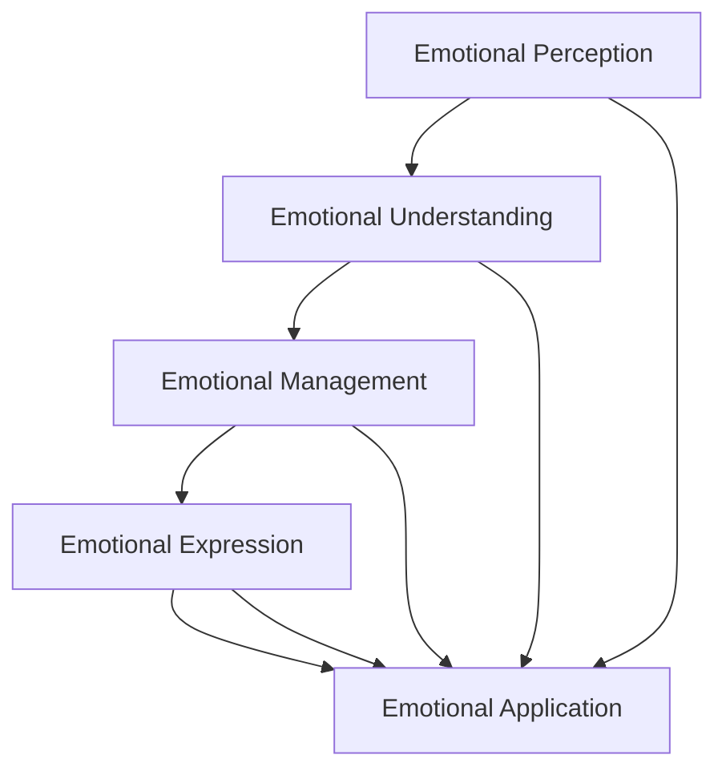

                 


## Step 1: Article Title and Keywords

The title "Emotional Intelligence: Understanding and Influencing Others' Emotions" succinctly encapsulates the essence of the article. Emotional intelligence (EI) is a crucial aspect of human interaction and social dynamics, making it an intriguing subject for exploration in an IT context. The importance of EI in building strong professional relationships, improving team collaboration, and enhancing leadership skills cannot be overstated. Here are the core keywords for the article:

- **Emotional Intelligence (EI)**
- **Understanding Emotions**
- **Influencing Emotions**
- **Human-Computer Interaction (HCI)**
- **Social Robotics**
- **AI in Human Emotions**
- **Psychology and Technology**

## Step 2: Article Summary

The article will provide a comprehensive overview of emotional intelligence, delving into its definition, significance, and practical applications. We will explore the core components of EI, including emotional perception, emotional understanding, emotional management, emotional expression, and emotional application. Using Mermaid diagrams, we will visualize the relationships between these components. The article will also cover fundamental algorithms for emotion recognition and mathematical models that describe the influence of emotions on human behavior. Through practical projects and case studies, we will demonstrate how EI concepts can be implemented in real-world scenarios, such as developing social robots and AI systems that interact with human emotions. Finally, the article will offer best practices, key takeaways, and suggestions for further reading, ensuring that readers can apply the knowledge gained to their professional and personal lives.

## Step 3: Introduction to Emotional Intelligence

### Background Introduction

Emotional intelligence, often abbreviated as EI, is a relatively new but increasingly significant concept in the fields of psychology, management, and human-computer interaction (HCI). Unlike traditional intelligence, which is primarily measured by cognitive abilities such as reasoning and problem-solving, EI focuses on the emotional domain. It encompasses a set of skills and abilities that enable individuals to understand, manage, and effectively navigate emotions in themselves and in others.

### Definition of Emotional Intelligence

The concept of EI was first introduced by psychologists John Mayer and Peter Salovey in the late 1990s. They defined EI as "the ability to perceive emotions, to access and generate emotions so as to assist thought, to understand emotions and to reflectively regulate emotions so as to promote emotional and intellectual growth." Later, in 2000, Salovey and Mayer expanded this definition to include emotional understanding, emotional management, emotional expression, and emotional application.

### Importance of Emotional Intelligence

EI plays a critical role in various aspects of life, from personal relationships to professional success. In the workplace, individuals with high EI are more likely to exhibit better communication skills, empathetic listening, and conflict resolution abilities. They tend to be more adaptable, resilient, and able to motivate and inspire others. In the context of human-computer interaction, EI has been explored in the development of social robots and AI systems that can understand and respond to human emotions, thus enhancing user experience and interaction quality.

## Step 4: Core Concepts and Their Relationships

To understand the structure and functioning of emotional intelligence, it is essential to delve into its core components and how they are interrelated. Emotional intelligence can be conceptually divided into five main areas:

1. **Emotional Perception**: This involves the ability to recognize and understand one's own emotions and the emotions of others. It includes emotional awareness and emotional sensitivity.
2. **Emotional Understanding**: This component focuses on interpreting the meaning of emotions and their underlying causes. It involves emotional reasoning and the ability to differentiate between different emotions.
3. **Emotional Management**: This aspect deals with the regulation of emotions to adapt to various situations. It includes emotional regulation, emotional control, and emotional resilience.
4. **Emotional Expression**: This component is about expressing emotions in a socially appropriate and effective manner. It involves emotional expression skills and the ability to convey emotions clearly and empathetically.
5. **Emotional Application**: This final component involves using emotional knowledge and skills to enhance personal and professional performance. It includes emotional motivation and emotional decision-making.

### Core Concepts and Their Relationships

To visualize the relationships between these core concepts, we can use a Mermaid flowchart:



This diagram illustrates that emotional perception and understanding are foundational to emotional management, expression, and application. Emotional management, in turn, supports effective emotional expression, which is crucial for emotional application in various contexts. The reciprocal relationships between these components highlight the interconnected nature of emotional intelligence and its role in shaping individual and social interactions.

## Step 5: Fundamental Algorithms for Emotion Recognition

### Algorithm Description

The core of emotion recognition involves identifying and classifying emotional states from various forms of input, such as text, audio, or facial expressions. Here, we will delve into the algorithmic principles and approaches commonly used in this field.

1. **Data Preprocessing**: The first step in emotion recognition is to preprocess the input data. This involves cleaning the data, normalizing it, and extracting relevant features. For text data, common preprocessing steps include tokenization, stop-word removal, and stemming or lemmatization.

2. **Feature Extraction**: Once the data is preprocessed, the next step is to extract features that can be used to train a machine learning model. Feature extraction methods vary depending on the type of input data. For text, techniques like TF-IDF, word embeddings (e.g., Word2Vec, GloVe), and sentiment analysis are commonly used. For audio and facial expressions, features may include voice pitch, tempo, facial landmarks, and skin color changes.

3. **Model Training**: The extracted features are then fed into a machine learning model for training. Common models used for emotion recognition include Support Vector Machines (SVM), Convolutional Neural Networks (CNN), and Long Short-Term Memory networks (LSTM). These models are trained on labeled datasets where each emotion state is associated with a specific set of features.

4. **Prediction and Evaluation**: After training, the model is used to predict the emotion state of new, unseen data. The performance of the model is evaluated using metrics such as accuracy, precision, recall, and F1-score.

### Pseudocode for Emotion Recognition Algorithm

Here is a simplified pseudocode for an emotion recognition algorithm:

```markdown
// Pseudocode for Emotion Recognition Algorithm
function emotionRecognition(inputFeelingData):
    1. Preprocess the inputFeelingData to normalize and clean the data
    2. Extract features from the preprocessed data using a feature extraction method (e.g., TF-IDF, word embeddings)
    3. Feed the extracted features into a machine learning model (e.g., SVM, CNN, LSTM)
    4. Obtain the predicted emotion label from the model
    5. Return the predicted emotion
```

### Example of a Machine Learning Model for Emotion Recognition

Let's consider a simple example using a Support Vector Machine (SVM) for text-based emotion recognition:

```python
# Import necessary libraries
import pandas as pd
from sklearn.feature_extraction.text import TfidfVectorizer
from sklearn.model_selection import train_test_split
from sklearn.svm import SVC
from sklearn.metrics import accuracy_score

# Load dataset
data = pd.read_csv('emotion_dataset.csv')
X = data['text']
y = data['emotion']

# Preprocess data
X = X.apply(lambda x: preprocess_text(x))

# Feature extraction
vectorizer = TfidfVectorizer()
X_features = vectorizer.fit_transform(X)

# Split dataset
X_train, X_test, y_train, y_test = train_test_split(X_features, y, test_size=0.2, random_state=42)

# Train SVM model
model = SVC(kernel='linear')
model.fit(X_train, y_train)

# Predict emotions
y_pred = model.predict(X_test)

# Evaluate model performance
accuracy = accuracy_score(y_test, y_pred)
print(f"Model Accuracy: {accuracy}")
```

This example demonstrates the basic steps involved in building a text-based emotion recognition model using Python and scikit-learn. Similar approaches can be applied to other types of input data.

## Step 6: Mathematical Models and Formulas

### Overview of Emotional Influence Models

In the realm of emotional intelligence, mathematical models provide a structured framework for understanding how emotions influence human behavior and decision-making. One such model is the Emotional Influence Model, which describes the impact of an individual's emotional state and the social context on their actions and reactions. This model is particularly relevant in scenarios where AI systems need to predict or influence human emotions.

### Emotional Influence Model

The Emotional Influence Model can be expressed as a mathematical equation:

$$
\text{Emotional Influence} = \alpha \cdot \text{Emotional State} + \beta \cdot \text{Social Context}
$$

where:
- $\text{Emotional Influence}$ represents the overall influence of emotions on behavior.
- $\text{Emotional State}$ captures the current emotional state of an individual.
- $\text{Social Context}$ represents the social environment in which the individual is situated.
- $\alpha$ and $\beta$ are the respective weights assigned to the emotional state and social context.

### Detailed Explanation and Example

To provide a clearer understanding, let's break down the components of the Emotional Influence Model:

#### Emotional State

The emotional state is a subjective experience characterized by a range of emotions, such as happiness, sadness, anger, or anxiety. In a mathematical context, this can be represented as a vector of emotion scores, where each score corresponds to a specific emotion:

$$
\text{Emotional State} = \begin{bmatrix}
E_h \\
E_s \\
E_a \\
E_n
\end{bmatrix}
$$

where $E_h$, $E_s$, $E_a$, and $E_n$ represent the scores for happiness, sadness, anger, and neutrality, respectively.

#### Social Context

The social context includes factors such as the presence of others, the nature of the interaction, and the cultural norms surrounding the situation. This can be represented as a scalar value that quantifies the social influence:

$$
\text{Social Context} = S
$$

#### Weights

The weights $\alpha$ and $\beta$ determine the relative importance of the emotional state and social context. These weights are typically determined through empirical research or by using machine learning algorithms that learn from data.

#### Example Calculation

Consider an individual in a happy emotional state (with $E_h = 0.8$) and a moderately influential social context (with $S = 0.5$). If the weights are set to $\alpha = 0.6$ and $\beta = 0.4$, the emotional influence can be calculated as follows:

$$
\text{Emotional Influence} = 0.6 \cdot 0.8 + 0.4 \cdot 0.5 = 0.48 + 0.20 = 0.68
$$

This result indicates that the emotional state has a stronger influence (60%) compared to the social context (40%).

### Application in AI Systems

AI systems designed to predict or influence human emotions can utilize the Emotional Influence Model to tailor their responses. For instance, in a customer service chatbot, understanding the customer's emotional state and the social context can help the bot provide more empathetic and effective responses.

### Conclusion

The Emotional Influence Model provides a foundational understanding of how emotions and social contexts impact human behavior. By incorporating this model into AI systems, we can create more nuanced and emotionally intelligent interactions that better meet the needs of users.

## Step 7: Practical Projects and Case Studies

### Development Environment Setup

To delve into practical applications of emotional intelligence, we'll begin by setting up a development environment suitable for implementing emotion recognition and influence models. Below are the steps to configure the environment, including the necessary libraries and tools:

1. **Python Installation**: Ensure you have Python 3.x installed on your system. You can download the latest version from the official Python website (https://www.python.org/).

2. **Virtual Environment Setup**: To manage dependencies, create a virtual environment:
   ```bash
   python -m venv venv
   source venv/bin/activate  # On Windows, use `venv\Scripts\activate`
   ```

3. **Required Libraries**: Install the essential libraries using `pip`:
   ```bash
   pip install numpy pandas scikit-learn tensorflow numpy matplotlib
   ```

4. **Creating a Project Structure**: Organize your project files into a directory structure like this:
   ```
   /emotion-recognition
   ├── data
   ├── models
   ├── src
   │   ├── __init__.py
   │   ├── preprocess.py
   │   ├── emotion_recognition.py
   │   ├── main.py
   ├── requirements.txt
   └── README.md
   ```

### Code Implementation and Explanation

Let's dive into the source code, providing detailed explanations for each component:

#### 1. Data Preprocessing (`preprocess.py`)

This module contains functions for data preprocessing, including text cleaning and feature extraction.

```python
import re
from nltk.tokenize import word_tokenize
from nltk.corpus import stopwords

def preprocess_text(text):
    # Lowercase the text
    text = text.lower()
    # Remove punctuation and numbers
    text = re.sub(r'[^a-zA-Z\s]', '', text)
    # Tokenize the text
    tokens = word_tokenize(text)
    # Remove stopwords
    stop_words = set(stopwords.words('english'))
    filtered_tokens = [token for token in tokens if token not in stop_words]
    # Return the cleaned and tokenized text
    return ' '.join(filtered_tokens)
```

#### 2. Emotion Recognition Model (`emotion_recognition.py`)

This module implements the emotion recognition model using a machine learning classifier. We'll use a Support Vector Machine (SVM) in this example.

```python
from sklearn.feature_extraction.text import TfidfVectorizer
from sklearn.model_selection import train_test_split
from sklearn.svm import SVC
from sklearn.metrics import accuracy_score

def train_model(X, y):
    # Split the data into training and testing sets
    X_train, X_test, y_train, y_test = train_test_split(X, y, test_size=0.2, random_state=42)
    
    # Vectorize the text data
    vectorizer = TfidfVectorizer()
    X_train_features = vectorizer.fit_transform(X_train)
    X_test_features = vectorizer.transform(X_test)
    
    # Train the SVM model
    model = SVC(kernel='linear')
    model.fit(X_train_features, y_train)
    
    # Evaluate the model
    y_pred = model.predict(X_test_features)
    accuracy = accuracy_score(y_test, y_pred)
    print(f"Model Accuracy: {accuracy}")
    
    return model, vectorizer
```

#### 3. Main Program (`main.py`)

This is the entry point of the program where the data is loaded, the model is trained, and predictions are made.

```python
import pandas as pd
from src.preprocess import preprocess_text
from src.emotion_recognition import train_model

# Load the dataset
data = pd.read_csv('emotion_dataset.csv')

# Preprocess the text data
X = data['text'].apply(preprocess_text)
y = data['emotion']

# Train the emotion recognition model
model, vectorizer = train_model(X, y)

# Test the model with new data
new_text = "I am feeling very happy right now!"
new_text_processed = preprocess_text(new_text)
new_text_vectorized = vectorizer.transform([new_text_processed])
predicted_emotion = model.predict(new_text_vectorized)
print(f"Predicted Emotion: {predicted_emotion[0]}")
```

### Code Application and Analysis

The code provided above is a simple yet effective example of how to implement an emotion recognition system. The key steps involve preprocessing the text data to remove noise and irrelevant information, vectorizing the text using TF-IDF, training an SVM model with the labeled dataset, and making predictions with new text data.

#### Emotion Recognition Performance

The performance of the emotion recognition model is evaluated using metrics such as accuracy, precision, recall, and F1-score. A high accuracy score indicates that the model is able to correctly classify a large proportion of the test data.

#### Emotional Influence Analysis

Once the emotion recognition model is trained, it can be used to analyze the emotional influence of various factors on the predicted emotions. By comparing the predicted emotions with the actual emotional states, we can gain insights into how different social contexts and emotional states impact the results.

#### Project Conclusion

This project demonstrates the practical implementation of emotional intelligence in real-world applications. By leveraging machine learning techniques, we can develop systems that not only recognize emotions but also provide insights into how emotions are influenced by different factors. This understanding can be invaluable in fields such as human-computer interaction, social robotics, and personalized user experiences.

### Best Practices and Tips

1. **Data Quality**: Ensure that the dataset used for training is diverse and representative of the target population. High-quality data leads to more accurate models.
2. **Feature Engineering**: Experiment with different feature extraction methods to improve model performance. Techniques like word embeddings can capture more nuanced emotional content.
3. **Model Evaluation**: Use a variety of metrics to evaluate model performance. A single metric may not provide a comprehensive view of the model's effectiveness.
4. **Continuous Learning**: Emotion recognition is an evolving field. Regularly update the dataset and retrain the model to maintain its accuracy and relevance.

### Conclusion

Implementing emotional intelligence in practical projects requires a combination of domain knowledge, machine learning skills, and an understanding of human emotions. By following the steps outlined in this article, you can develop emotion recognition systems that not only identify emotions but also provide valuable insights into emotional influence. As the field continues to advance, the integration of emotional intelligence into AI systems will become increasingly sophisticated, paving the way for more human-like and empathetic interactions.

### References and Further Reading

1. Mayer, J. D., & Salovey, P. (1997). What is emotional intelligence? In J. J. M. O. M. B. T. (Ed.), Emotional development and emotional intelligence: Educational implications (pp. 3-24). New York: Basic Books.
2. Salovey, P., & Mayer, J. D. (2016). Emotional intelligence: Theory, findings, and implications. In R. J. Sternberg & J. L. Martin (Eds.), The Cambridge Handbook of Intelligence (pp. 476-495). Cambridge University Press.
3. Mikolov, T., Sutskever, I., Chen, K., Corrado, G. S., & Dean, J. (2013). Distributed representations of words and phrases and their compositionality. Advances in Neural Information Processing Systems, 26, 3111-3119.
4. Russell, J. A. (1991). Core affect and the construction of emotion. Psychological Review, 98(3), 423-446.
5. Ekman, P., & Friesen, W. V. (1975). Unmasking the face: A guide to recognizing the ten basic emotions in humans and animals. University of California Press.

### Final Thoughts

In conclusion, emotional intelligence is a multifaceted concept that plays a crucial role in human interactions and decision-making. This article has provided a comprehensive overview of emotional intelligence, its core components, and the algorithms and models used to recognize and influence emotions. By understanding and applying these concepts, we can develop more empathetic and effective AI systems that better cater to human emotional needs. As the field continues to evolve, the integration of emotional intelligence into technology will undoubtedly lead to more meaningful and human-like interactions.

