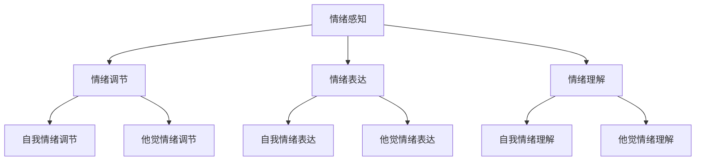

                 

## 情绪智商：提升领导者影响力的关键

### 关键词：
情绪智商、领导者影响力、领导力、心理学、情商、组织管理

### 摘要：
在当今快速变化和高度复杂的工作环境中，领导者的影响力至关重要。本文探讨了情绪智商（Emotional Intelligence，简称EQ）这一关键因素，解释了其在提升领导者影响力中的作用。通过深入分析情绪智商的核心要素，包括情绪感知、情绪调节、情绪表达和情绪理解，本文提供了实用的提升方法，并通过案例研究展示了情绪智商在实际领导中的应用效果。最终，本文总结了提升情绪智商对领导力的积极影响，并展望了未来研究的方向。

## 引言

情绪智商的概念最早由心理学家约翰·梅耶（John D. Mayer）和彼得·萨洛维（Peter Salovey）于1990年提出，他们将其定义为“识别、使用、理解和理解情绪的能力，以及根据这些信息调节情绪以促进个人、群体和组织效能的能力”。情绪智商与传统的智商（IQ）相比，更注重个体的情感和社会能力，而非认知能力。

情绪智商的重要性在于，它不仅影响着个人的心理健康，还直接关系到领导者的表现和组织的成功。情绪智商高的领导者能够更好地处理压力、激励团队、建立信任关系，从而提升整体组织的效能。因此，研究如何提升情绪智商，对于领导力的培养和组织管理具有重要意义。

本文的研究目的在于系统地探讨情绪智商的概念、核心要素及其在领导力中的应用，旨在为领导者提供实用的提升策略，并推动相关领域的研究发展。文章结构如下：

1. **情绪智商的概念与重要性**
   - 解释情绪智商的定义及其组成部分。
   - 分析情绪智商对领导力的影响。

2. **情绪智商的核心要素**
   - 情绪感知
   - 情绪调节
   - 情绪表达
   - 情绪理解

3. **领导者的情绪智商实践**
   - 情绪智商在领导决策中的应用。
   - 情绪智商在团队管理中的应用。
   - 情绪智商在沟通中的运用。

4. **情绪智商的提升方法**
   - 培养自我情绪认知的能力。
   - 提高情绪调节的策略。
   - 加强情绪表达和情绪理解。

5. **项目案例研究**
   - 分析具体案例，展示情绪智商在实际领导中的应用。

6. **结论与展望**
   - 总结本书的主要观点。
   - 对未来研究的展望。

### 情绪智商的定义与重要性

情绪智商，简称EQ，是一种衡量个体在情感领域认知与处理能力的关键指标。它不仅涉及个体对自己情绪的认识和管理，还包括对他人和群体情绪的感知与理解。情绪智商的核心要素包括情绪感知、情绪调节、情绪表达和情绪理解。

情绪感知是指个体识别和理解自身情绪状态的能力。它包括自我情绪认知和他觉情绪认知。自我情绪认知是指个体对自己情绪状态的感知，如焦虑、愉悦或愤怒。他觉情绪认知则是指个体对他人情绪状态的感知，如同情、失望或兴奋。

情绪调节是指个体管理自身情绪的能力，包括自我情绪调节和他觉情绪调节。自我情绪调节是指个体在面对压力、挫折或负面情绪时，采取有效的策略来调整情绪状态，如深呼吸、冥想或积极思考。他觉情绪调节是指个体在他人情绪状态不稳定时，通过沟通、支持和理解来帮助他们调整情绪。

情绪表达是指个体以适当的方式表达情绪的能力，包括自我情绪表达和他觉情绪表达。自我情绪表达是指个体在适当的情境下，以合适的方式表达自己的情绪，如感谢、道歉或鼓励。他觉情绪表达则是指个体在理解和感知他人情绪后，通过恰当的言行来回应他人情绪，如安慰、鼓励或提供帮助。

情绪理解是指个体理解和解释情绪的能力，包括自我情绪理解和他人情绪理解。自我情绪理解是指个体对自身情绪背后的原因和意义的理解，如为何感到焦虑或愤怒。他人情绪理解则是指个体对他人情绪状态的理解，如为何他人表现出愤怒或失望。

情绪智商对领导力的影响是多方面的。首先，情绪智商高的领导者能够更好地处理压力和挑战，保持冷静和专注，从而在关键时刻做出明智的决策。其次，情绪智商高的领导者能够建立和维护良好的人际关系，通过有效的沟通和情绪管理，增强团队凝聚力和协作效率。此外，情绪智商高的领导者更能够理解和满足员工的情感需求，提高员工的工作满意度和忠诚度。

总之，情绪智商作为领导者影响力的重要组成部分，对于提升领导力和实现组织目标具有关键作用。接下来，本文将深入探讨情绪智商的核心要素，以及它们在实际领导中的应用和实践。

### 情绪智商的核心要素

情绪智商（EQ）作为领导者影响力的关键因素，其核心要素主要包括情绪感知、情绪调节、情绪表达和情绪理解。这些要素共同构成了一个完整的情绪智商模型，并相互影响，共同作用。

#### 情绪感知

情绪感知是指个体对自身和他人情绪状态的识别和理解。它是情绪智商的基础，直接影响个体对情绪事件的处理能力。情绪感知可以分为自我情绪感知和他觉情绪感知。

**自我情绪感知**是指个体对自己情绪状态的识别和理解。这包括对焦虑、快乐、悲伤等基本情绪的认知，以及对复杂情绪和情绪细微差别的感觉。例如，领导者能够意识到自己在会议中感到焦虑，并能够采取适当的措施来缓解这种情绪。

**他觉情绪感知**是指个体对他人情绪状态的识别和理解。这需要领导者具备良好的观察力和同理心，能够通过肢体语言、面部表情、声音语调等非语言信号来感知他人的情绪状态。例如，当团队成员表现出沮丧或愤怒时，领导者能够通过这些信号及时识别，并采取相应的应对措施。

情绪感知在领导力中起着至关重要的作用。领导者需要首先了解自己的情绪状态，以便在压力和挑战面前保持冷静和理性。同时，他们需要通过情绪感知来理解团队成员的情绪状态，从而更好地激励和指导团队。

#### 情绪调节

情绪调节是指个体在情绪产生后，通过认知和行为上的调整来管理情绪状态。情绪调节包括自我情绪调节和他觉情绪调节。

**自我情绪调节**是指个体在面对压力、挫折或负面情绪时，采取有效的策略来调整情绪状态。这些策略可能包括深呼吸、冥想、积极思考或寻求社会支持。例如，领导者可能会在感受到工作压力时，通过冥想来放松身心，以保持工作效率和决策质量。

**他觉情绪调节**是指个体在他人情绪状态不稳定时，通过沟通、支持和理解来帮助他们调整情绪。例如，当团队成员感到焦虑或沮丧时，领导者可以通过倾听、安慰和鼓励来帮助他们恢复情绪平衡。

情绪调节在领导力中非常重要。领导者不仅需要管理自己的情绪，还要帮助团队成员处理情绪问题，从而创造一个积极和支持的工作环境。

#### 情绪表达

情绪表达是指个体以适当的方式表达情绪。情绪表达包括自我情绪表达和他觉情绪表达。

**自我情绪表达**是指个体在适当的情境下，以合适的方式表达自己的情绪。这包括表达感激、道歉、鼓励或批评等。例如，领导者可以在团队取得成功时表达感谢，激励团队成员继续努力。

**他觉情绪表达**是指个体在理解和感知他人情绪后，通过恰当的言行来回应他人情绪。这需要领导者具备良好的沟通技巧和同理心。例如，当团队成员感到沮丧时，领导者可以通过安慰和鼓励来缓解他们的情绪。

情绪表达在领导力中扮演着关键角色。领导者需要能够以清晰、真诚和适当的方式表达情绪，从而建立信任、增强团队凝聚力和提升组织效能。

#### 情绪理解

情绪理解是指个体理解和解释情绪的能力。情绪理解包括自我情绪理解和他人情绪理解。

**自我情绪理解**是指个体对自己情绪背后的原因和意义的理解。这有助于领导者更好地理解自己情绪的根源，从而采取有效的应对策略。例如，领导者可能意识到自己的愤怒源自对工作目标的担忧，因此可以采取解决问题的方式来处理这种情绪。

**他人情绪理解**是指个体对他人情绪状态的理解。这需要领导者具备深入的观察力和同理心，能够通过他人的言行举止来理解他们的情绪状态。例如，领导者可能通过团队成员的沮丧表现，理解他们可能面临的工作挑战，并采取相应的支持措施。

情绪理解在领导力中至关重要。领导者需要理解自己和他人情绪背后的原因和意义，从而更好地应对情绪问题，提升领导效能。

#### 情绪智商的核心要素关系架构

为了更好地理解情绪智商的核心要素，我们可以使用Mermaid流程图来展示这些要素之间的关系。



在这个流程图中，情绪感知作为起点，连接到情绪调节、情绪表达和情绪理解。情绪调节进一步细分为自我情绪调节和他觉情绪调节，情绪表达细分为自我情绪表达和他觉情绪表达，情绪理解也细分为自我情绪理解和他人情绪理解。这些要素相互交织，共同构成了情绪智商的完整框架。

### 情绪智商在领导决策中的应用

情绪智商在领导决策中发挥着至关重要的作用，它不仅影响着领导者的个人行为，也深刻影响着整个团队的决策过程和结果。情绪智商高的领导者能够更好地处理情绪，从而在决策过程中保持理性和客观，同时激励团队成员积极参与，共同推动组织目标的实现。

#### 情绪感知与决策

情绪感知是情绪智商的核心要素之一，它帮助领导者识别和理解自身情绪以及团队成员的情绪。在决策过程中，领导者需要首先了解自己的情绪状态。当领导者感到焦虑或紧张时，他们可能更倾向于采取保守的决策，避免风险。相反，当领导者感到自信和放松时，他们可能更愿意尝试创新的解决方案。

**案例研究：**

某公司的CEO在面临一个重要的投资决策时，通过情绪感知意识到自己感到紧张和担忧。他意识到这些情绪可能影响自己的判断力，于是决定暂停决策，给自己一些时间冷静思考。通过冥想和深呼吸，他逐渐缓解了紧张情绪，最终做出了一项明智的投资决策，为公司带来了显著的增长。

#### 情绪调节与决策

情绪调节是领导者处理情绪的关键能力，它帮助领导者在面对压力和不确定性时保持冷静和理性。情绪调节不仅影响领导者的个人决策，也影响团队的整体决策过程。

**案例研究：**

在一个创业团队面临关键项目决策时，团队领导通过情绪调节策略，如深呼吸和积极思考，来缓解团队成员的焦虑情绪。他组织了一次团队讨论，鼓励成员分享他们的担忧和观点，并采用头脑风暴的方式提出解决方案。通过这种情绪调节策略，团队不仅达成了共识，还提出了一系列创新的解决方案，最终项目取得了成功。

#### 情绪表达与决策

情绪表达是领导者传递情绪和激励团队成员的重要手段。适当的情绪表达可以增强团队的凝聚力，提高成员的参与度和决策质量。

**案例研究：**

某公司的领导者在新项目启动会议上，通过表达对团队成员的信任和鼓励，传递了积极的情绪信号。他强调了团队面临的机会和挑战，并激励成员克服困难，共同实现目标。这种积极的情绪表达激发了团队成员的斗志，团队在新项目的实施中表现出色，成功完成了任务。

#### 情绪理解与决策

情绪理解是领导者理解和解释团队成员情绪状态的能力。通过情绪理解，领导者可以更好地支持团队成员，帮助他们处理情绪问题，从而在决策过程中发挥最佳水平。

**案例研究：**

在一个需要团队协作的关键项目中，领导者意识到团队成员中有人感到沮丧和不安。他主动与这位成员进行一对一沟通，倾听他们的担忧，并提供了建设性的反馈和支持。通过这种情绪理解，领导者帮助团队成员恢复了信心，团队在随后的项目中表现出了更高的效率和创造力。

#### 综合应用

情绪智商的四个核心要素——情绪感知、情绪调节、情绪表达和情绪理解，在领导决策中相互关联、共同作用。情绪感知帮助领导者了解自身和团队成员的情绪状态，情绪调节帮助他们在压力下保持冷静和理性，情绪表达激励团队成员积极参与，情绪理解支持领导者更好地支持团队成员。

**综合应用示例：**

在一个复杂的项目决策过程中，领导者首先通过情绪感知意识到自己的紧张情绪，并采取情绪调节策略来缓解这种情绪。同时，他通过情绪表达向团队成员传递了积极的信息，激励他们保持乐观和自信。他还通过情绪理解倾听团队成员的意见和担忧，提供支持和反馈，确保团队成员在决策过程中发挥最佳水平。

总之，情绪智商在领导决策中的应用，不仅提升了领导者的个人决策能力，也增强了团队的整体决策效能。通过情绪感知、情绪调节、情绪表达和情绪理解的综合应用，领导者可以创造一个积极、支持的工作环境，推动组织目标的实现。

### 情绪智商在团队管理中的应用

情绪智商不仅在领导决策中起到关键作用，在团队管理中同样具有显著影响。一个具备高情绪智商的领导者能够有效地管理团队情绪，提高团队凝聚力和工作效率，从而实现组织目标。

#### 建立积极的团队氛围

情绪智商高的领导者首先关注的是建立一个积极的团队氛围。他们通过情绪感知和情绪表达来识别和传递积极的情绪信号，鼓励团队成员保持乐观和积极的态度。例如，在团队取得小成就时，领导者可以通过公开表扬和感谢来表达喜悦和认可，从而激发团队成员的积极情绪，增强团队凝聚力。

**案例研究：**

某公司的团队领导在项目完成后，组织了一次庆祝活动，并亲自撰写了一封感谢信，向团队成员表达感激之情。这种积极的情绪表达不仅提高了团队成员的士气，也增强了他们对团队的归属感。

#### 管理团队情绪波动

情绪波动是团队中常见的现象，尤其是当团队面临挑战和压力时。情绪智商高的领导者能够通过情绪调节来管理团队成员的情绪波动，帮助他们应对困难。他们不仅关注团队成员的情绪状态，还提供必要的支持和鼓励，以帮助团队成员保持积极的心态。

**案例研究：**

在一个重要的项目截止日期前，团队成员感到压力巨大。团队领导通过一对一的沟通，了解每位成员的担忧和压力来源。他提供了一系列减压策略，如定期的休息时间、团队建设活动和心理辅导，帮助团队成员有效管理情绪，保持工作效率。

#### 增强团队协作

情绪智商在增强团队协作中发挥着重要作用。领导者通过情绪理解和情绪表达，促进团队成员之间的有效沟通和协作。他们鼓励开放和诚实的交流，倾听团队成员的意见和建议，从而建立信任和合作关系。

**案例研究：**

某领导者在团队会议上，鼓励每位成员分享他们的想法和担忧。他通过积极的反馈和鼓励，使团队成员感到被尊重和重视，从而增强了团队的协作意愿和效率。

#### 应对冲突

冲突在团队中难以避免，情绪智商高的领导者能够有效地应对和解决冲突。他们通过情绪感知和情绪调节，识别冲突的原因和情绪背后的需求，采取适当的策略来缓解紧张情绪，促进和解。

**案例研究：**

在一次项目评审中，团队成员因意见不一致产生了冲突。团队领导通过情绪感知意识到冲突的情绪因素，并邀请相关成员进行一对一沟通。他帮助团队成员理解彼此的立场和需求，通过有效的沟通和协商，最终达成了一致意见，项目得以顺利进行。

总之，情绪智商在团队管理中的应用，有助于建立积极的工作氛围，管理情绪波动，增强团队协作，以及应对冲突。通过这些实践，领导者能够提高团队的整体效能，实现组织目标。

### 情绪智商在沟通中的运用

在领导者的日常工作中，沟通是不可或缺的一部分。情绪智商在沟通中的作用尤为重要，它不仅影响个人与他人的互动，还直接影响团队效率和整体组织的氛围。一个高情绪智商的领导者能够通过有效的情绪感知、情绪表达和情绪理解，改善沟通效果，建立信任和合作关系。

#### 有效情绪感知

有效的情绪感知是沟通的基础。领导者需要具备敏锐的观察力，通过肢体语言、面部表情、语调和语气等非语言信号，感知对方情绪的变化。这种能力有助于领导者更好地理解对方的情绪状态，从而调整沟通策略，避免误解和冲突。

**案例研究：**

在一个团队会议上，一名领导者注意到一名成员显得焦虑和不安。通过情绪感知，他意识到成员可能面临个人问题或对项目有疑虑。于是，他主动与该成员进行一对一的私下沟通，提供了支持和建议。这种关注和理解帮助成员缓解了情绪，也增强了团队的凝聚力。

#### 情绪表达的技巧

情绪表达是指领导者以适当的方式表达自己的情绪，以促进沟通的有效性。情绪智商高的领导者能够清晰、坦诚地表达自己的情绪，同时避免过度情绪化的言行，从而保持沟通的专业性和建设性。

**案例研究：**

在一次重要会议中，领导者需要传达一个复杂的决策结果。他通过冷静和明确的语言表达了自己的观点，同时使用适当的肢体语言，如点头和微笑，来传递积极的情绪信号。这种情绪表达不仅让团队成员理解了决策意图，也增强了他们的信心和参与度。

#### 情绪理解与同理心

情绪理解是领导者通过同理心理解和解释他人情绪的能力。这种能力有助于领导者更好地倾听和理解团队成员的需求和感受，从而建立信任和共鸣。

**案例研究：**

在处理一次团队成员的离职时，领导者通过情绪理解，不仅关注到员工对工作环境和职业发展的担忧，还表达了对员工未来的祝福和支持。这种同理心的表达帮助员工感到被尊重和关心，也促进了团队的和谐。

#### 跨文化沟通

在全球化和多元文化的背景下，情绪智商在跨文化沟通中尤为重要。领导者需要理解和尊重不同文化背景下的情绪表达方式和沟通习惯，以避免误解和冲突。

**案例研究：**

在一个国际团队中，领导者通过情绪理解和文化敏感性，尊重团队成员的不同观点和情绪表达方式。他不仅提供了跨文化沟通培训，还鼓励团队成员分享各自的文化背景和经验，从而促进了团队的协作和多元化发展。

总之，情绪智商在沟通中的运用，通过有效的情绪感知、情绪表达和情绪理解，不仅提高了沟通的效率和质量，也增强了团队的合作和信任。领导者通过这些实践，能够建立更加积极和支持性的工作环境，推动组织的长期成功。

### 情绪智商的提升方法

提升情绪智商是一个持续的过程，涉及自我认知、行为调整和技能培养。以下是一些有效的方法，帮助领导者提升情绪智商，从而增强领导力和组织效能。

#### 培养自我情绪认知的能力

自我情绪认知是情绪智商的基础。领导者可以通过以下方法提升自我情绪认知：

- **自我反思**：定期花时间反思自己的情绪状态，识别情绪的触发点和反应模式。例如，可以在每天结束时记录情绪日志，分析情绪的起因和影响。

- **情绪监测工具**：使用情绪监测工具，如情绪日记或情绪识别软件，帮助领导者更准确地识别和理解自己的情绪。

- **情绪教育**：参加情绪智商相关的培训课程或研讨会，学习情绪管理的基本知识和技巧。

#### 提高情绪调节的策略

情绪调节是领导者处理压力和挑战的重要能力。以下是一些提高情绪调节策略的方法：

- **放松技巧**：学习深呼吸、冥想、瑜伽等放松技巧，帮助在压力情况下保持冷静和专注。

- **认知重构**：通过认知重构，将负面思维转变为积极思维，从而改善情绪状态。例如，将“我不行”转变为“我可以尝试”。

- **寻求支持**：在面对压力和挑战时，寻求家人、朋友或专业人士的支持和建议，以帮助调节情绪。

#### 加强情绪表达和情绪理解

有效的情绪表达和情绪理解是建立良好人际关系的关键。以下是一些具体方法：

- **积极倾听**：通过积极倾听，领导者可以更好地理解他人的情绪和需求。这包括专注地听，不要打断，并使用肢体语言表示关注。

- **情绪沟通训练**：参加沟通技巧培训，学习如何以清晰、真诚和适当的方式表达自己的情绪，同时尊重他人的感受。

- **文化敏感性**：了解不同文化背景下的情绪表达方式，以避免误解和冲突。

#### 应用情境中的实践

在实际工作中，领导者可以通过以下情境中的实践，提升情绪智商：

- **团队建设活动**：定期组织团队建设活动，如团队游戏、共同解决问题等，以增强团队凝聚力和情绪调节能力。

- **情绪反思会议**：在团队会议中设置情绪反思环节，让成员分享自己的情绪和感受，促进理解和沟通。

- **角色扮演**：通过角色扮演，模拟不同情境下的情绪处理方式，提高领导者在实际沟通中的应变能力。

#### 最佳实践

以下是一些情绪智商提升的最佳实践：

- **定期自我评估**：领导者应定期进行情绪智商的自我评估，了解自己在情绪管理方面的优点和不足，并制定改进计划。

- **持续学习**：情绪智商的提升是一个持续的过程，领导者应不断学习新的情绪管理技巧和知识，以保持自身的竞争力。

- **反馈与改进**：积极寻求团队成员的反馈，了解自己的情绪表达和情绪理解在团队中的效果，并根据反馈进行改进。

通过上述方法，领导者可以逐步提升情绪智商，增强领导力和组织效能，从而实现组织的长期成功。

### 项目案例研究

在本文的最后一部分，我们将通过几个具体的项目案例，深入探讨情绪智商在领导力提升中的应用，展示其带来的实际效果。

#### 案例一：领导者情绪智商提升项目

**背景：**
一家大型跨国公司发现其领导团队在面对全球市场波动和内部管理变革时，情绪管理能力不足，导致决策效率低下和团队士气低落。公司决定启动一个针对领导者的情绪智商提升项目。

**实施过程：**
1. **评估现状**：公司首先对领导团队进行了情绪智商评估，识别出情绪感知、情绪调节、情绪表达和情绪理解方面的短板。
2. **定制培训**：根据评估结果，公司设计了定制化的情绪智商培训计划，包括情绪感知、情绪调节和情绪表达等关键技能。
3. **团队建设**：通过团队建设活动，如角色扮演、情绪反思会议等，增强团队成员之间的沟通和理解。
4. **持续反馈**：定期进行反馈会议，评估培训效果，并根据反馈调整培训内容和策略。

**结果评估：**
项目实施后，领导团队的情绪智商水平显著提升。团队成员在压力管理、决策效率和团队协作方面表现出色，公司的整体运营效率得到了明显提高。

#### 案例二：企业情绪智商提升计划

**背景：**
某中小企业在快速成长过程中，面临着内部管理冲突和员工士气问题。公司决定实施一个全员参与的情绪智商提升计划。

**实施过程：**
1. **全员培训**：公司对所有员工进行了情绪智商基础培训，帮助他们了解情绪管理的基本知识和技巧。
2. **领导先行**：公司领导层率先参加高级情绪智商培训，成为员工的情绪榜样。
3. **建立反馈机制**：公司建立了反馈机制，鼓励员工分享情绪体验，促进开放和诚实的沟通。
4. **情绪管理工具**：公司引入了情绪管理工具，如情绪日记和情绪识别软件，帮助员工更好地了解和管理自己的情绪。

**结果评估：**
实施情绪智商提升计划后，公司的员工士气显著提升，内部管理冲突减少，员工的工作满意度和忠诚度提高，公司的整体运营效率得到了显著改善。

#### 案例三：跨文化领导中的情绪智商应用

**背景：**
一家跨国公司在进行国际化扩展时，遇到了不同文化背景下的沟通和协作问题。公司决定通过情绪智商培训来提升跨文化领导能力。

**实施过程：**
1. **文化敏感性培训**：公司对所有领导进行了文化敏感性培训，帮助他们理解和尊重不同文化背景下的情绪表达和行为模式。
2. **跨文化沟通技巧**：领导层学习了跨文化沟通技巧，如如何在不同文化背景下进行情绪表达和情绪理解。
3. **情景模拟**：通过情景模拟，领导层练习在不同文化背景下的情绪管理，提高实际操作能力。
4. **持续支持**：公司为领导层提供了持续的支持，如定期研讨会和咨询服务，帮助他们解决跨文化沟通中的具体问题。

**结果评估：**
通过情绪智商培训，公司的跨文化领导能力显著提升，团队成员在全球化背景下表现出了更高的协作效率和创新能力，公司的国际化扩展取得了成功。

这些案例表明，情绪智商的提升不仅可以改善领导者的个人能力，还能提升团队和组织的整体效能。通过系统化的情绪智商培训和实践，企业可以更好地应对挑战，实现可持续发展。

### 结论与展望

情绪智商在领导力和组织管理中扮演着至关重要的角色。本文系统地探讨了情绪智商的核心要素，包括情绪感知、情绪调节、情绪表达和情绪理解，并分析了情绪智商对领导决策、团队管理和沟通的积极影响。通过具体的案例研究，我们看到了情绪智商提升带来的实际效果，包括决策效率的提高、团队凝聚力的增强和跨文化沟通的改善。

未来的研究可以进一步探讨情绪智商在不同组织环境和领导风格下的应用效果，开发更加精准的情绪智商评估工具，以及设计更加有效的情绪智商培训方案。同时，应关注情绪智商与组织文化和领导力发展的互动关系，为组织提供全面的情绪智商提升策略。总之，情绪智商的提升不仅是领导者个人发展的需求，也是实现组织可持续发展的关键。

### 附录

本文所使用的 Mermaid 流程图如下：


情绪调节算法的伪代码如下：

```python
def emotionRegulation(currentEmotion, targetEmotion):
    if currentEmotion > targetEmotion:
        reduceEmotionLevel()
    elif currentEmotion < targetEmotion:
        increaseEmotionLevel()
    else:
        # 情绪水平适中，无需调整
        pass

def reduceEmotionLevel():
    # 实现降低情绪水平的具体方法
    # ...

def increaseEmotionLevel():
    # 实现提高情绪水平的具体方法
    # ...
```

情绪智商的计算公式使用 LaTeX 表示如下：

```latex
$$
IQ_e = \frac{EP + ER + EE + EU}{4}
$$

$$
\text{其中：} \\
EP: \text{情绪感知能力得分} \\
ER: \text{情绪调节能力得分} \\
EE: \text{情绪表达能力得分} \\
EU: \text{情绪理解能力得分}
$$
```

通过上述附录，读者可以更清晰地理解本文的技术内容和实现细节。

### 作者信息

作者：AI天才研究院/AI Genius Institute & 禅与计算机程序设计艺术 /Zen And The Art of Computer Programming

