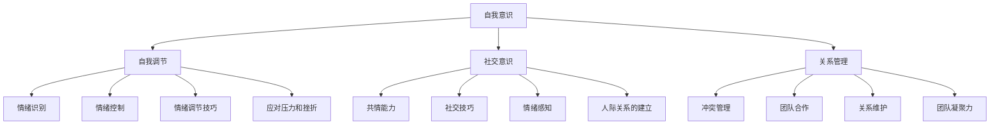
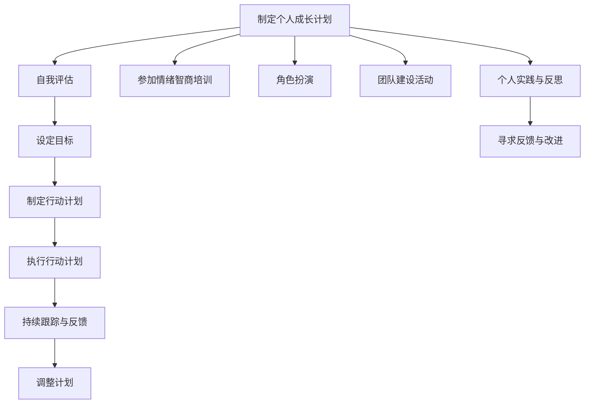
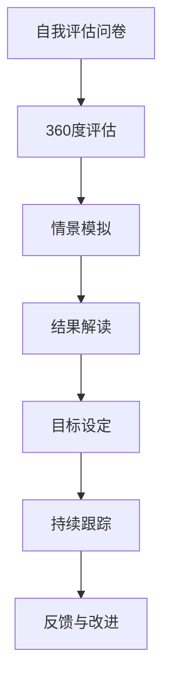
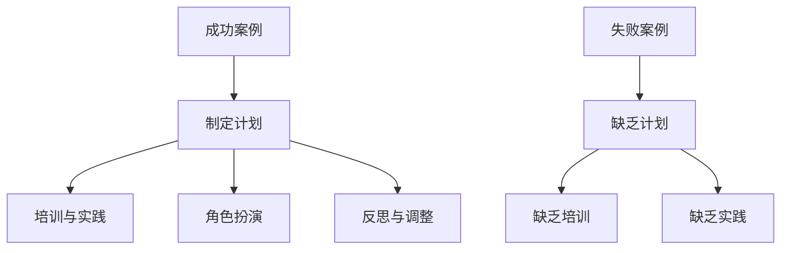

                 

## 《情绪智商：提升领导者影响力的关键》

### 关键词：情绪智商、领导力、影响力、自我意识、人际关系、团队管理

> 摘要：本文深入探讨情绪智商在领导者提升影响力中的关键作用。通过分析情绪智商的核心理论，以及其在自我意识、人际关系、团队管理和决策制定中的具体应用，本文揭示了领导者如何通过提升情绪智商，增强个人魅力和团队凝聚力，最终实现影响力的提升。文章结构清晰，深入浅出，旨在为领导者提供实用的策略和方法。

## 第1章 引言

### 1.1 书籍背景

情绪智商（Emotional Intelligence，简称EQ）最早由心理学家约翰·梅耶（John Mayer）和彼得·萨洛维（Peter Salovey）在1990年代提出。作为一种重要的非智力因素，情绪智商涵盖了个体对自身情绪的理解、自我调节、对他人的情绪感知及共情能力，以及运用这些能力促进个人和社会行为的综合能力。

随着对情绪智商研究的不断深入，其重要性逐渐受到广泛关注。特别是在领导领域，情绪智商被认为比智商（IQ）更能预测领导者的成功。领导者需要具备较高的情绪智商，以便更好地应对复杂多变的工作环境，管理团队，做出理性而富有远见的决策。

本书旨在探讨情绪智商在提升领导者影响力中的关键作用，帮助领导者通过提升情绪智商，增强个人魅力和团队凝聚力，从而在激烈的竞争中脱颖而出。本书将详细分析情绪智商的核心理论，以及其在实际领导工作中的应用策略，旨在为领导者提供实用的指导。

### 1.2 情绪智商的重要性

情绪智商的重要性主要体现在以下几个方面：

1. **个人成长**：情绪智商高的人能够更好地理解和管理自己的情绪，从而在面对压力和挫折时保持冷静和积极。他们能够更好地调节情绪，避免情绪失控，从而提高工作效率和生活质量。

2. **人际关系**：情绪智商高的人具有较强的共情能力和人际沟通技巧。他们能够理解他人的情绪，建立良好的人际关系，这对于领导者在团队管理和员工激励中尤为重要。

3. **领导力**：情绪智商是领导力的重要组成部分。情绪智商高的领导者能够更好地感知团队的士气，识别并解决团队问题，提高团队的凝聚力和执行力。

4. **决策制定**：情绪智商高的领导者能够更好地平衡理性和情感，做出更为明智和具有前瞻性的决策。他们能够从多角度分析问题，减少决策风险，提高决策质量。

### 1.3 领导者影响力与情绪智商的关系

领导者的影响力主要来源于以下几个方面：

1. **个人魅力**：领导者通过自身的品格、能力和魅力，吸引和激励团队成员。

2. **团队凝聚力**：领导者通过建立和谐的团队关系，提高团队的凝聚力和协作效率。

3. **决策能力**：领导者通过科学的决策，引导团队朝着正确的方向前进。

情绪智商与领导者的影响力密切相关。情绪智商高的领导者能够更好地处理自身情绪，建立和谐的人际关系，增强团队的凝聚力，从而提升自身的影响力。同时，情绪智商高的领导者能够更好地理解团队的情绪和需求，做出更为合理的决策，进一步提高团队执行力。

综上所述，情绪智商在提升领导者影响力中扮演着至关重要的角色。本书将深入探讨情绪智商的核心理论，以及其在实际领导工作中的应用，帮助领导者更好地发挥情绪智商的作用，提升个人魅力和团队凝聚力，实现影响力的提升。

## 第2章 情绪智商的基础理论

### 2.1 什么是情绪智商

情绪智商，又称情商，是指个体识别、理解、管理自己和他人情绪的能力。它是一个多维度的综合能力，涵盖了以下几个方面：

1. **自我意识**：个体对自己情绪的认识和了解。这包括情绪的识别、理解和表达。
   
2. **自我调节**：个体在面对情绪波动时，能够有效调节和平衡情绪的能力。这包括情绪的控制、情绪的转化和情绪的管理。

3. **社交意识**：个体对他人情绪的理解和感知。这包括共情能力、社交技巧和人际关系的建立。

4. **关系管理**：个体在处理人际关系和解决社交冲突时的能力。这包括冲突解决、团队合作和领导力。

### 2.2 情绪智商的四个维度

情绪智商通常被划分为四个主要维度，即自我意识、自我调节、社交意识和关系管理。这些维度相互关联，共同构成了情绪智商的整体结构。

1. **自我意识**：
   - **定义**：个体对自己情绪的认识和了解。这包括情绪的识别、理解和表达。
   - **核心概念**：情绪觉察、自我反思、情绪识别。
   - **联系**：自我意识是个体情绪智商的基础，只有了解自己的情绪，才能有效地调节和管理情绪。

2. **自我调节**：
   - **定义**：个体在面对情绪波动时，能够有效调节和平衡情绪的能力。这包括情绪的控制、情绪的转化和情绪的管理。
   - **核心概念**：情绪调控、情绪稳定、情绪管理。
   - **联系**：自我调节是情绪智商的核心，它决定了个体在面对压力和挑战时的情绪反应和行为表现。

3. **社交意识**：
   - **定义**：个体对他人情绪的理解和感知。这包括共情能力、社交技巧和人际关系的建立。
   - **核心概念**：情绪感知、共情、社交技巧。
   - **联系**：社交意识是情绪智商的重要组成部分，它决定了个体在人际交往中的情绪理解能力和关系维护能力。

4. **关系管理**：
   - **定义**：个体在处理人际关系和解决社交冲突时的能力。这包括冲突解决、团队合作和领导力。
   - **核心概念**：关系维护、冲突管理、团队合作。
   - **联系**：关系管理是情绪智商的最高层次，它需要综合运用自我意识和自我调节的能力，以建立和维护健康的人际关系。

### 2.3 情绪智商的理论基础

情绪智商的理论基础主要涵盖以下几个方面：

1. **生理因素**：
   - **核心概念**：大脑结构和神经传递物质。
   - **联系**：生理因素决定了个体情绪感知和调节的基础，如大脑中的前额叶和边缘系统在情绪处理中的作用。

2. **心理因素**：
   - **核心概念**：认知发展和情绪认知。
   - **联系**：心理因素决定了个体如何理解和处理情绪，如认知行为疗法的应用。

3. **社会因素**：
   - **核心概念**：社会学习和文化背景。
   - **联系**：社会因素影响了个体情绪智商的发展，如家庭教育和文化环境。

通过理解情绪智商的四个维度及其理论基础，领导者可以更深入地认识情绪智商的重要性，并学会如何在实际工作中提升自己的情绪智商。

## 第3章 领导者如何培养情绪智商

### 3.1 自我意识

自我意识是情绪智商的基础，它涉及到领导者对自己情绪的认识和了解。提升自我意识对于领导者来说至关重要，因为它能够帮助领导者更好地控制自己的情绪，从而在面对各种挑战时保持冷静和理性。

#### 3.1.1 了解自己的情绪

了解自己的情绪是提升自我意识的第一步。领导者需要学会识别自己情绪的触发点，并理解这些情绪背后的原因。以下是一些具体的方法：

1. **情绪日记**：领导者可以每天记录自己的情绪变化，包括情绪的类型、发生的时间和情境。通过持续的记录和分析，领导者可以逐渐识别出自己情绪的触发点和规律。

2. **情绪觉察练习**：领导者可以通过冥想、深呼吸等方式，培养对情绪的觉察能力。这种方法可以帮助领导者更好地了解自己的情绪，并学会在面对情绪波动时保持冷静。

3. **自我反思**：领导者可以在遇到重要决策或挑战时，花时间进行自我反思。通过思考自己的情绪反应和决策过程，领导者可以更深入地理解自己的情绪和行为。

#### 3.1.2 建立自我意识

建立自我意识是一个持续的过程，需要领导者不断地进行自我探索和反思。以下是一些具体的方法：

1. **设定个人目标**：领导者可以设定短期和长期的个人目标，并定期评估自己的情绪状态。这种方法可以帮助领导者更好地了解自己的情绪变化，并调整自己的行为。

2. **寻求反馈**：领导者可以定期向同事、下属或导师寻求反馈。通过他人的观察和反馈，领导者可以更客观地了解自己的情绪和行为，并找到改进的方法。

3. **参加培训课程**：领导者可以参加情绪智商相关的培训课程，学习专业的情绪管理技巧和方法。这些课程可以帮助领导者更系统地提升自我意识，并掌握有效的情绪管理策略。

### 3.2 自我调节

自我调节是情绪智商的核心，它涉及到领导者如何在面对情绪波动时保持冷静和理性。提升自我调节能力对于领导者来说至关重要，因为它能够帮助领导者更好地应对压力和挫折，保持高效的工作状态。

#### 3.2.1 掌握情绪调节技巧

掌握情绪调节技巧是提升自我调节能力的关键。以下是一些具体的方法：

1. **认知重构**：认知重构是一种通过改变负面思维模式来调节情绪的方法。领导者可以通过质疑自己的不合理信念，并建立更积极、合理的信念体系，从而减轻负面情绪的影响。

2. **情绪释放**：情绪释放是一种通过表达和释放情绪来调节情绪的方法。领导者可以通过写日记、做运动、与朋友交流等方式，释放自己的负面情绪，从而保持情绪平衡。

3. **正念冥想**：正念冥想是一种通过专注当下、接受当下情绪来调节情绪的方法。领导者可以通过冥想练习，培养对情绪的觉察和接纳，从而更好地调节情绪。

#### 3.2.2 应对压力和挫折

应对压力和挫折是提升自我调节能力的重要方面。以下是一些具体的方法：

1. **制定应对策略**：领导者可以提前制定应对压力和挫折的策略。例如，当面对重要的会议或项目时，领导者可以提前准备，减少不确定性和焦虑。

2. **积极心态**：领导者可以培养积极的心态，看待挑战和失败。通过将挑战视为成长和学习的机会，领导者可以减少负面情绪的影响，提高应对能力。

3. **健康生活**：领导者可以通过保持健康的生活习惯，如规律作息、合理饮食和适量运动，来减轻压力和焦虑，提高自我调节能力。

### 3.3 社会意识

社会意识是情绪智商的重要组成部分，它涉及到领导者对他人和团队情绪的理解和感知。提升社会意识对于领导者来说至关重要，因为它能够帮助领导者更好地建立和维护良好的人际关系，提高团队凝聚力和执行力。

#### 3.3.1 情绪的共情能力

情绪的共情能力是提升社会意识的关键。以下是一些具体的方法：

1. **倾听**：领导者可以通过倾听他人的意见和感受，了解他人的情绪状态。倾听不仅是一种技巧，更是一种尊重和关心他人的表现。

2. **换位思考**：领导者可以通过换位思考，站在他人的角度理解他们的情绪和需求。这种方法可以帮助领导者更好地理解和回应他人的情绪。

3. **情绪识别**：领导者可以通过观察他人的行为和表情，识别他人的情绪状态。这种方法需要领导者具备敏锐的观察力和人际沟通技巧。

#### 3.3.2 建立良好的人际关系

建立良好的人际关系是提升社会意识的重要方面。以下是一些具体的方法：

1. **合作与支持**：领导者可以通过合作和支持他人，建立积极的人际关系。在团队中，领导者可以鼓励成员之间的合作，共同解决面临的问题。

2. **沟通与反馈**：领导者可以通过积极的沟通和及时反馈，维护良好的人际关系。有效的沟通可以帮助领导者更好地了解团队的需求和期望，及时解决问题。

3. **信任与尊重**：领导者可以通过信任和尊重他人，建立稳定的人际关系。在团队中，领导者可以鼓励成员表达自己的意见和想法，并给予尊重和认可。

### 3.4 创造力

创造力是情绪智商的重要组成部分，它涉及到领导者如何在情绪环境中进行创新和变革。提升创造力对于领导者来说至关重要，因为它能够帮助领导者更好地应对变化和挑战，推动团队持续发展。

#### 3.4.1 创新思维的培养

创新思维的培养是提升创造力的重要方面。以下是一些具体的方法：

1. **思维拓展**：领导者可以通过学习新的知识和技能，拓展自己的思维边界。通过不断学习，领导者可以拓宽自己的视野，激发创新思维。

2. **头脑风暴**：领导者可以通过头脑风暴的方法，激发团队成员的创新思维。头脑风暴可以鼓励成员自由表达自己的想法，从而产生新的创意。

3. **跨学科学习**：领导者可以通过跨学科学习，将不同领域的知识和思维方式相结合，从而激发创新思维。跨学科学习可以帮助领导者从不同角度看待问题，找到新的解决方案。

#### 3.4.2 情绪智商与领导力创新

情绪智商与领导力创新密切相关。以下是一些具体的方法：

1. **情绪激励**：领导者可以通过激发员工的情绪，提高他们的工作积极性和创造力。例如，领导者可以通过鼓励和认可，激发员工的成就感和自豪感，从而提高他们的创造力。

2. **情绪调节**：领导者可以通过调节自己的情绪，创造积极的工作氛围，促进创新思维。例如，领导者可以通过保持乐观和积极的态度，激发团队成员的积极情绪，从而提高团队的创造力。

3. **情绪共情**：领导者可以通过共情能力，理解员工的情绪和需求，从而更好地激励他们的创造力。例如，领导者可以通过倾听和理解员工的意见和想法，激发他们的创造潜能。

通过提升自我意识、自我调节、社会意识和创造力，领导者可以全面提高情绪智商，从而在领导工作中取得更好的成果。情绪智商不仅是一种个人能力，更是一种领导艺术，它需要领导者不断地学习和实践，才能真正发挥其作用。

## 第4章 情绪智商在领导实践中的应用

### 4.1 情绪智商与团队管理

情绪智商在团队管理中扮演着至关重要的角色。一个情绪智商高的领导者能够更好地理解团队成员的情绪，建立和谐的工作氛围，提高团队的凝聚力和执行力。

#### 4.1.1 情绪智商在团队组建中的作用

在团队组建过程中，情绪智商高的领导者能够更好地识别和选择合适的团队成员。以下是一些具体的方法：

1. **情绪感知**：领导者可以通过观察和交流，了解潜在团队成员的情绪状态。这有助于领导者选择那些情绪稳定、积极向上的成员，以确保团队的和谐和稳定。

2. **个性匹配**：领导者可以根据团队成员的个性特点，进行合理的角色分配。通过个性匹配，领导者可以最大限度地发挥团队成员的特长，提高团队的整体绩效。

3. **情绪共情**：领导者可以通过共情能力，理解团队成员的情绪和需求，从而更好地引导和激励他们。这种理解能够帮助领导者建立信任和尊重，增强团队的凝聚力。

#### 4.1.2 情绪智商在团队冲突解决中的应用

在团队管理中，冲突是不可避免的。情绪智商高的领导者能够有效地处理团队冲突，以下是一些具体的方法：

1. **情绪识别**：领导者需要学会识别和区分不同类型的情绪冲突。通过准确识别情绪冲突，领导者可以采取更有针对性的解决策略。

2. **情绪调节**：领导者需要学会在冲突中保持冷静和理性，避免情绪化。通过情绪调节，领导者可以更好地控制冲突的发展，避免事态恶化。

3. **沟通与反馈**：领导者需要通过积极的沟通和及时的反馈，解决团队冲突。通过沟通，领导者可以理解双方的情绪和立场，找到冲突的根本原因，并制定解决方案。

### 4.2 情绪智商与领导风格

情绪智商不仅影响团队管理，也影响领导风格。一个情绪智商高的领导者能够根据不同情境，灵活调整自己的领导风格，以提高团队绩效。

#### 4.2.1 情绪智商与领导风格的关系

情绪智商与领导风格密切相关。以下是一些具体的关系：

1. **情境适应**：情绪智商高的领导者能够根据不同情境，灵活调整自己的领导风格。例如，在紧张的工作环境中，领导者可能需要采取更加直接和果断的领导风格；而在团队成员情绪低落时，领导者可能需要采取更加支持和鼓励的领导风格。

2. **情绪影响**：情绪智商高的领导者能够更好地理解和影响团队成员的情绪。通过积极的情绪影响，领导者可以激发团队成员的工作热情和创造力，提高团队的整体绩效。

3. **情绪管理**：情绪智商高的领导者能够有效地管理自己的情绪，避免负面情绪对工作的影响。通过情绪管理，领导者可以保持冷静和理性，做出更为明智和具有前瞻性的决策。

#### 4.2.2 适应不同情境的领导风格

适应不同情境的领导风格是情绪智商在领导实践中的重要应用。以下是一些具体的方法：

1. **授权型领导**：在团队成员积极性高、任务明确的情况下，领导者可以采取授权型领导风格，给予团队成员更多的自主权和责任。这种方法可以激发团队成员的创造力，提高团队绩效。

2. **支持型领导**：在团队成员情绪低落、面临挑战的情况下，领导者可以采取支持型领导风格，提供情感支持和资源保障。这种方法可以增强团队成员的信心，提高团队凝聚力。

3. **变革型领导**：在团队面临重大变革和挑战时，领导者可以采取变革型领导风格，带领团队迎接变革。这种方法可以激发团队成员的变革意识和积极性，推动团队实现目标。

### 4.3 情绪智商与决策制定

情绪智商在决策制定过程中起着关键作用。一个情绪智商高的领导者能够更好地平衡理性和情感，做出更为明智和有效的决策。

#### 4.3.1 情绪智商在决策中的影响

情绪智商对决策的影响主要体现在以下几个方面：

1. **情绪识别**：领导者需要能够准确识别和理解自己和他人的情绪。这有助于领导者更好地评估情绪对决策的影响，并做出更为合理的决策。

2. **情绪调节**：领导者需要学会在决策过程中调节自己的情绪，避免情绪化。通过情绪调节，领导者可以保持冷静和理性，做出更为明智的决策。

3. **情感分析**：领导者可以通过情感分析，了解团队成员的情感状态。这有助于领导者更好地了解团队的情绪氛围，从而做出更为符合团队需求的决策。

#### 4.3.2 情绪智商与理性决策的结合

情绪智商与理性决策的结合是决策制定中的关键。以下是一些具体的方法：

1. **情绪理性化**：领导者可以通过情绪理性化，将情绪因素转化为理性因素，从而更好地评估决策的风险和收益。

2. **情感模型**：领导者可以利用情感模型，对决策进行情感分析。通过情感模型，领导者可以更全面地评估决策的影响，并做出更为合理的决策。

3. **情感反馈**：领导者可以通过情感反馈，了解团队成员对决策的情感反应。这有助于领导者调整决策方案，更好地满足团队成员的情感需求。

通过情绪智商在团队管理、领导风格和决策制定中的应用，领导者可以更好地发挥情绪智商的作用，提升团队绩效和决策质量，从而实现组织的目标。

## 第5章 情绪智商提升策略

### 5.1 情绪智商提升的方法

提升情绪智商是一个长期而系统的过程，需要领导者采取多种策略和方法。以下是一些具体的方法：

#### 5.1.1 个人成长计划

个人成长计划是提升情绪智商的重要策略。领导者可以通过以下步骤制定个人成长计划：

1. **自我评估**：领导者首先需要对自己的情绪智商进行评估。可以通过情绪智商测评工具，了解自己在自我意识、自我调节、社交意识和关系管理等方面的表现。

2. **设定目标**：根据自我评估的结果，领导者可以设定具体的提升目标。这些目标可以是短期的，如提高情绪识别能力，也可以是长期的，如提升人际关系管理能力。

3. **制定行动计划**：为了实现提升目标，领导者需要制定详细的行动计划。这包括具体的行动步骤、时间表和资源分配。

4. **持续跟踪与反馈**：领导者需要定期跟踪自己的进展，并根据实际情况调整计划。同时，领导者可以通过向导师、同事或下属寻求反馈，了解自己在提升过程中的表现和改进方向。

#### 5.1.2 团队培训与建设

团队培训与建设是提升情绪智商的重要手段。领导者可以通过以下方式组织团队培训与建设：

1. **情绪智商培训**：领导者可以组织情绪智商培训课程，帮助团队成员了解情绪智商的基本概念和提升方法。培训内容可以包括情绪识别、情绪调节、社交意识等。

2. **角色扮演**：通过角色扮演，团队成员可以模拟真实的情绪情境，练习情绪管理和人际关系技巧。这种方法有助于提高团队成员的实际操作能力。

3. **团队建设活动**：领导者可以组织团队建设活动，如团队拓展训练、团队讨论等。这些活动可以增强团队成员之间的沟通与合作，提高团队凝聚力。

#### 5.1.3 个人实践与反思

个人实践与反思是提升情绪智商的关键环节。领导者可以通过以下方式加强个人实践与反思：

1. **日常实践**：领导者需要在日常工作中，有意识地应用情绪智商的技巧和方法。例如，在与团队成员沟通时，领导者可以尝试使用积极的语言和非语言表达，以增强沟通效果。

2. **反思日记**：领导者可以记录自己的情绪反应和决策过程，定期进行反思。通过反思，领导者可以总结经验教训，发现提升情绪智商的方法。

3. **反馈与调整**：领导者需要定期向导师、同事或下属寻求反馈，了解自己的情绪管理和领导风格。根据反馈，领导者可以及时调整自己的行为和策略，不断提高情绪智商。

### 5.2 情绪智商评估工具

情绪智商评估工具是衡量领导者情绪智商水平的重要工具。以下是一些常用的情绪智商评估工具：

#### 5.2.1 情绪智商测评方法

1. **自我评估问卷**：自我评估问卷是一种常见的情绪智商测评方法。通过一系列问题，领导者可以评估自己在情绪识别、情绪调节、社交意识和关系管理等方面的表现。

2. **360度评估**：360度评估是一种通过多角度收集反馈的方法。除了自我评估，领导者的同事、下属和上级也可以参与评估，提供更全面的反馈。

3. **情景模拟**：情景模拟是一种通过模拟真实情境，评估领导者情绪管理和决策能力的方法。这种方法可以更直观地展示领导者的情绪智商水平。

#### 5.2.2 测评结果分析与应用

测评结果分析是情绪智商提升的重要环节。以下是一些具体的方法：

1. **结果解读**：领导者需要对测评结果进行详细解读，了解自己在情绪智商方面的优势和不足。

2. **目标设定**：根据测评结果，领导者可以设定具体的提升目标，并制定相应的行动计划。

3. **持续跟踪**：领导者需要定期跟踪自己的提升进度，并根据实际情况调整计划和策略。

4. **反馈与改进**：领导者需要定期向导师、同事或下属寻求反馈，了解自己的情绪管理和领导风格。根据反馈，领导者可以及时调整自己的行为和策略，不断提高情绪智商。

### 5.3 情绪智商提升的案例分析

#### 5.3.1 成功案例分析

以下是一个成功的情绪智商提升案例：

**案例背景**：某公司的一名中层管理者在情绪智商测评中表现出色，但在实际工作中，经常因为情绪波动而影响工作表现。他意识到自己需要提升情绪智商，以更好地应对工作中的挑战。

**解决措施**：
1. **个人成长计划**：他制定了详细的个人成长计划，包括情绪识别、情绪调节和社交意识等方面的目标。

2. **情绪调节训练**：他参加了情绪调节训练课程，学习了情绪管理技巧和方法。

3. **角色扮演**：他在团队内部组织了角色扮演活动，通过模拟真实的情绪情境，提高自己的情绪管理和决策能力。

4. **反思日记**：他每天记录自己的情绪反应和决策过程，定期进行反思，总结经验教训。

**结果**：经过一段时间的努力，他的情绪智商水平显著提升。他在工作中的情绪波动明显减少，工作效率和决策质量也得到了提高。

#### 5.3.2 失败案例分析

以下是一个情绪智商提升失败的案例：

**案例背景**：某公司的一名高层管理者在情绪智商测评中表现不佳，但公司高层认为他具备其他领导素质，未对其情绪智商提升给予足够的重视。

**解决措施**：
1. **缺乏个人成长计划**：该管理者没有制定具体的个人成长计划，对情绪智商提升没有明确的目标和行动步骤。

2. **缺乏系统培训**：公司未提供相关的情绪智商培训，管理者没有系统学习情绪管理技巧和方法。

3. **缺乏实践机会**：管理者在工作中缺乏情绪管理的实践机会，无法将学到的情绪管理技巧应用到实际工作中。

**结果**：由于缺乏有效的提升措施，该管理者的情绪智商水平没有显著提升，反而因为情绪波动而影响工作表现，最终被迫离职。

通过成功和失败的案例分析，我们可以看到情绪智商提升的重要性。成功的案例表明，通过系统的培训和实践，领导者可以有效提升情绪智商，提高工作表现；而失败的案例则提醒我们，情绪智商提升需要得到组织和管理层的重视和支持。

### 5.4 情绪智商提升策略总结

提升情绪智商是领导者提升领导力的关键步骤。以下是一些关键的提升策略：

1. **制定个人成长计划**：领导者需要根据自己的情绪智商测评结果，制定详细的个人成长计划，明确提升目标和行动步骤。

2. **参加情绪智商培训**：领导者可以通过参加情绪智商培训，学习专业的情绪管理技巧和方法，提升自己的情绪智商水平。

3. **加强实践和应用**：领导者需要在实际工作中，有意识地应用情绪智商的技巧和方法，通过实践来提高自己的情绪管理能力。

4. **定期反思和调整**：领导者需要定期反思自己的情绪反应和决策过程，根据实际情况调整自己的情绪管理策略。

5. **寻求反馈和指导**：领导者需要向导师、同事或下属寻求反馈，了解自己在情绪智商提升过程中的表现，并获取改进建议。

通过以上策略，领导者可以有效地提升情绪智商，提高领导力，为组织的成功贡献力量。

## 第6章 情绪智商的未来发展趋势

### 6.1 情绪智商研究的最新进展

随着对情绪智商研究的不断深入，学术界和产业界在情绪智商的测量、培养和应用方面取得了显著进展。

#### 6.1.1 科学研究动态

1. **情绪智商的测量**：近年来，心理学家们开发出了多种情绪智商测量工具，如梅耶-萨洛维-卡尔霍恩情绪智商测验（MSCEIT）、情绪智商问卷（EQ-I 2.0）等。这些工具具有较高的信度和效度，能够更准确地评估个体的情绪智商水平。

2. **情绪智商的培养**：研究表明，情绪智商可以通过训练和练习得到显著提升。例如，认知行为疗法、正念冥想和情绪调节训练等方法，已被证明有助于提高个体的情绪智商。

3. **情绪智商与心理健康**：越来越多的研究关注情绪智商对心理健康的影响。例如，情绪智商与抑郁、焦虑等心理问题之间的关系，以及情绪智商如何影响个体的生活质量和工作表现。

#### 6.1.2 情绪智商与神经科学的联系

神经科学的发展为情绪智商的研究提供了新的视角。以下是一些关键的研究发现：

1. **大脑结构与情绪智商**：神经影像学研究揭示了情绪智商与大脑特定区域之间的联系。例如，前额叶和边缘系统在情绪处理中发挥着重要作用，这些区域的活跃程度与情绪智商水平密切相关。

2. **神经传递物质**：神经科学家发现，神经传递物质如多巴胺、去甲肾上腺素和血清素等，在情绪调节和情绪智商中扮演关键角色。这些神经传递物质的失衡可能导致情绪问题，影响情绪智商的表现。

3. **脑-机接口技术**：脑-机接口技术（Brain-Computer Interface，BCI）的发展为情绪智商的研究提供了新的可能性。通过BCI技术，研究者可以直接读取大脑信号，探索情绪处理机制，并开发基于脑信号的情绪调节技术。

### 6.2 情绪智商在组织管理中的应用前景

情绪智商在组织管理中的应用前景广阔，以下是一些重要的应用方向：

#### 6.2.1 人工智能与情绪智商的结合

人工智能（AI）技术的发展为情绪智商在组织管理中的应用带来了新的机遇。以下是一些具体的应用场景：

1. **员工情绪监测与分析**：通过AI技术，组织可以实时监测员工的情绪状态，分析情绪变化的原因，并制定相应的干预措施。例如，利用自然语言处理技术分析员工在工作沟通中的情绪表达，及时发现潜在的员工情绪问题。

2. **个性化领导力培养**：基于员工的情绪智商测评结果，AI系统可以提供个性化的领导力培养方案。这些方案包括情绪管理技巧、人际沟通技巧和自我调节策略等，帮助领导者提升情绪智商。

3. **情感化客户服务**：在客户服务领域，AI技术可以模拟人类的情绪表达，提供更加个性化的客户服务。通过分析客户的行为和情绪，AI系统可以自动调整服务策略，提高客户满意度。

#### 6.2.2 情绪智商与组织发展

情绪智商不仅对领导者个人发展有重要影响，也对企业整体发展产生深远影响。以下是一些关键点：

1. **团队凝聚力和协作效率**：通过提升团队中每个成员的情绪智商，可以增强团队的凝聚力和协作效率。情绪智商高的团队成员能够更好地理解和支持他人，减少冲突，提高团队绩效。

2. **组织文化**：情绪智商的普及有助于建立积极向上的组织文化。组织可以通过推广情绪智商的理念和方法，培养员工的情感智慧，促进组织内部的和谐与发展。

3. **组织变革与适应能力**：在快速变化的市场环境中，情绪智商高的领导者能够更好地应对变革，带领组织适应新的挑战。他们能够更好地管理团队成员的情绪，激发创新思维，推动组织持续发展。

### 6.3 情绪智商提升的未来展望

情绪智商的提升不仅是个人发展的需要，也是组织和社会发展的需要。以下是一些对未来发展的展望：

1. **教育体系**：情绪智商的培养应从儿童和青少年时期开始。教育体系应将情绪智商教育纳入课程，培养学生的情感智慧和人际沟通能力。

2. **企业培训**：企业应将情绪智商培训纳入员工发展计划，提高员工的整体情绪智商水平。通过系统性的培训，员工可以更好地应对工作挑战，提高工作效率。

3. **社会服务**：政府和非营利组织可以开展情绪智商推广活动，提高公众对情绪智商的认识，促进社会的和谐发展。

总之，情绪智商的提升是一个长期而系统的过程，需要个人、组织和社会共同努力。通过不断学习和实践，领导者可以提升情绪智商，为个人和组织的发展贡献力量。

## 第7章 结论

### 7.1 情绪智商的重要性总结

情绪智商在领导者和组织成功中扮演着至关重要的角色。通过本章的分析，我们可以总结出以下几点关键点：

1. **个人成长**：情绪智商有助于领导者更好地理解和管理自己的情绪，提高自我意识和自我调节能力，从而实现个人成长和职业发展。

2. **人际关系**：情绪智商高的领导者能够更好地建立和维护良好的人际关系，通过共情能力和社交技巧增强团队的凝聚力和执行力。

3. **领导力**：情绪智商是领导力的核心组成部分，它帮助领导者更好地感知团队的士气和情绪，做出理性而富有远见的决策，提升领导影响力。

4. **决策制定**：情绪智商有助于领导者平衡理性和情感，提高决策的质量和效率，减少决策风险。

### 7.2 领导者如何实践情绪智商

领导者提升情绪智商的实践策略包括：

1. **自我意识**：领导者需要通过自我反思和情绪日记，提高对自身情绪的认识和理解。

2. **自我调节**：领导者可以通过认知重构和情绪调节技巧，学会在压力和挑战面前保持冷静和理性。

3. **社会意识**：领导者需要通过倾听、换位思考和情绪识别，提高对他人和团队情绪的理解和感知。

4. **关系管理**：领导者需要通过合作与支持、沟通与反馈、信任与尊重，建立和维护健康的人际关系。

5. **创新能力**：领导者需要通过思维拓展、头脑风暴和跨学科学习，培养创新思维，推动组织变革和发展。

### 7.3 情绪智商的未来展望

情绪智商的未来发展前景广阔：

1. **科学研究**：随着神经科学和人工智能的发展，情绪智商的测量、培养和应用将更加精确和高效。

2. **教育培训**：情绪智商教育应从儿童和青少年时期开始，培养下一代的情感智慧和人际沟通能力。

3. **企业实践**：企业应将情绪智商培训纳入员工发展计划，提高员工的整体情绪智商水平。

4. **社会推广**：政府和非营利组织应开展情绪智商推广活动，提高公众对情绪智商的认识，促进社会的和谐发展。

总之，情绪智商的提升不仅是领导者个人发展的需要，也是组织和社会发展的需要。通过不断学习和实践，领导者可以提升情绪智商，为个人和组织的发展贡献力量。

### 参考文献

1. Mayer, J. D., Salovey, P., & Caruso, D. R. (1999). "Emotional intelligence: Theory, findings, and implications". In R. J. Sternberg (Ed.), "The psychology of wisdom: Perspectives on intelligence, creativity, and life" (pp. 195-225). Cambridge University Press.
2. Goleman, D. (1995). "Emotional intelligence". Bantam Books.
3. Mayer, J. D., & Salovey, P. (1997). "What is emotional intelligence?". Imagination, Cognition and Personality, 17(3), 237-258.
4. Bar-On, R. (1997). "The ABCs of Emotional Intelligence". Lutomierz Publishing House.
5.正念冥想研究中心（Center for Mindfulness）.（n.d.）. "Mindfulness-Based Stress Reduction (MBSR) Program". 正念冥想研究中心. Retrieved from [https://www.umassmed.edu/cfm/](https://www.umassmed.edu/cfm/)

### 附录：情绪智商核心概念关系架构 Mermaid 流程图

### 附录：情绪智商提升方法流程图

### 附录：情绪智商评估工具流程图

### 附录：情绪智商提升案例流程图

## 作者信息

**作者：AI天才研究院/AI Genius Institute & 禅与计算机程序设计艺术 /Zen And The Art of Computer Programming**

本文由AI天才研究院和禅与计算机程序设计艺术联合撰写。AI天才研究院致力于推动人工智能技术的发展和应用，研究涵盖机器学习、自然语言处理、计算机视觉等多个领域。禅与计算机程序设计艺术则专注于探索计算机编程中的哲学思想，将东方哲学智慧与计算机科学相结合，为程序员提供深度思考和灵感来源。我们希望通过本文，为领导者提供实用的情绪智商提升策略，助力他们在职业发展中取得更大成就。

