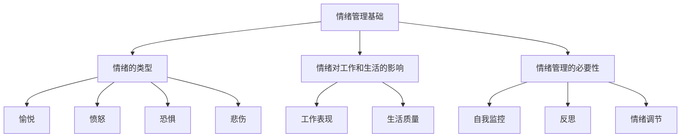
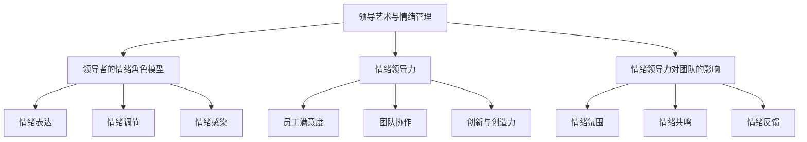

                 

### 文章标题

情绪管理：保持冷静的领导艺术

### 关键词

情绪管理、领导艺术、冷静、决策、团队协作、压力管理

### 摘要

本文深入探讨了情绪管理在领导艺术中的重要性，分析了情绪的类型及其对工作与生活的影响。通过情绪认知理论、情绪调节理论和情绪与社会认知理论，文章构建了情绪管理的基础框架。同时，本文着重讨论了领导者在管理自身情绪和团队情绪时的角色，以及如何通过合理的领导风格和策略来保持冷静，提升团队绩效。通过实际案例分析，文章提供了情绪管理的具体实践方法，并总结了保持冷静的领导艺术的核心理念与未来趋势。

---

## 第一部分：情绪管理基础

### 第1章：情绪的类型与影响

#### 1.1 情绪的基本类型

情绪是人类心理体验的核心组成部分，通常被分为四大基本类型：愉悦、愤怒、恐惧和悲伤。每种情绪都有其独特的生理和心理特征。

1. **愉悦**：愉悦是一种积极的情绪，表现为兴奋、满足和快乐。愉悦情绪通常与成功、成就和亲近感相关联。
2. **愤怒**：愤怒是一种强烈的情绪，表现为愤怒、敌意和攻击性。愤怒情绪常常源于挫折、不公平或威胁。
3. **恐惧**：恐惧是一种防御性的情绪，表现为焦虑、紧张和回避。恐惧情绪常与危险、不确定性或威胁相关。
4. **悲伤**：悲伤是一种消极的情绪，表现为失落、沮丧和孤独。悲伤情绪通常与失去、失败或分离相关。

#### 1.2 情绪对工作和生活的影响

情绪不仅影响个人的心理状态，还对工作表现和生活质量产生深远的影响。

1. **工作表现**：积极的情绪可以提升工作效率、创造力和团队合作精神，而消极情绪则可能导致注意力不集中、决策失误和生产力下降。
2. **生活质量**：情绪稳定有助于改善人际关系、提高生活满意度和幸福感。相反，情绪波动可能会引发健康问题、心理障碍和社会冲突。

#### 1.3 情绪管理的必要性

情绪管理是一个持续的过程，需要个体通过自我监控、反思和调节来保持情绪的平衡。

1. **自我监控**：自我监控是指个体对自己情绪状态的认识和觉察。通过自我监控，个体可以更好地理解自己的情绪反应，从而做出更明智的决策。
2. **反思**：反思是通过回顾和评估自己的情绪反应，从中学习和成长。反思有助于个体发现情绪管理的盲点，并采取改进措施。
3. **情绪调节**：情绪调节是指个体在情绪反应过程中采取的策略，以降低负面情绪的影响，增强积极情绪的体验。

### 核心概念与联系

情绪管理的基础框架由情绪的类型、情绪对工作和生活的影响以及情绪管理的必要性三部分组成。这三者之间相互联系，构成了一个完整的情绪管理体系。

1. **情绪的类型**是情绪管理的基础，只有了解情绪的类型，个体才能识别和管理自己的情绪。
2. **情绪对工作和生活的影响**使个体认识到情绪管理的重要性，意识到情绪管理对个人成长和成功的关键作用。
3. **情绪管理的必要性**强调了个体在情绪管理中的主动性和责任感，促使个体采取积极的措施来调节情绪。

#### Mermaid 流程图



---

## 第二部分：领导艺术与情绪管理

### 第4章：领导者的情绪角色

#### 4.1 领导者的情绪角色模型

领导者的情绪角色对其领导效能有着至关重要的影响。领导者的情绪角色模型包括以下三个关键方面：

1. **情绪表达**：领导者如何表达自己的情绪，直接影响到团队成员的情绪反应和行为。
2. **情绪调节**：领导者如何调节自己的情绪，以保持冷静、专注和有效决策。
3. **情绪感染**：领导者的情绪状态如何传递和影响团队成员的情绪。

#### 4.2 情绪领导力与组织绩效

情绪领导力是领导者通过情绪管理来提升组织绩效的能力。研究表明，情绪领导力与组织绩效之间存在密切关联。

1. **员工满意度**：情绪领导力能够提高员工的工作满意度，增强员工的归属感和忠诚度。
2. **团队协作**：情绪领导力有助于建立积极的团队氛围，促进团队成员之间的协作和沟通。
3. **创新与创造力**：情绪领导力能够激发员工的创新精神和创造力，推动组织持续发展。

#### 4.3 情绪领导力对团队的影响

情绪领导力对团队的影响体现在多个层面：

1. **情绪氛围**：领导者通过积极的情绪表达和情绪调节，可以营造一个积极、和谐的工作氛围。
2. **情绪共鸣**：领导者与团队成员之间建立情绪共鸣，有助于增强团队的凝聚力和合作精神。
3. **情绪反馈**：领导者通过情绪反馈，可以引导团队成员识别和调节自己的情绪，提高团队的整体情绪管理水平。

### 核心概念与联系

领导艺术与情绪管理的关系可以用以下概念架构来表示：

1. **领导者的情绪角色模型**：包括情绪表达、情绪调节和情绪感染，这是情绪领导力的基础。
2. **情绪领导力**：领导者通过情绪管理提升组织绩效的能力，影响员工满意度、团队协作和创新与创造力。
3. **情绪领导力对团队的影响**：包括情绪氛围、情绪共鸣和情绪反馈，这些影响进一步强化了情绪领导力的效果。

#### Mermaid 流�程图



---

## 第三部分：案例分析与应用

### 第7章：案例分析：成功的情绪管理实践

#### 7.1 案例一：企业家的情绪管理艺术

企业家李先生在创建自己的科技初创公司时，深刻体会到情绪管理的重要性。他通过以下措施成功地管理自己的情绪：

1. **自我反思**：每天晚上，李先生都会花时间反思自己的情绪反应，识别情绪触发点，并寻找改进策略。
2. **锻炼和放松**：李先生坚持每天进行锻炼，并通过冥想和阅读来放松心情，保持情绪稳定。
3. **建立支持网络**：李先生与导师、朋友和同事建立了紧密的支持网络，遇到情绪困扰时，他们会互相倾诉和提供建议。

#### 7.2 案例二：团队领导的情绪调节策略

某公司的团队领导王女士通过以下策略有效地调节团队的情绪：

1. **情绪识别**：王女士鼓励团队成员在团队会议上分享自己的情绪状态，通过开放式对话识别和解决情绪问题。
2. **情绪反馈**：王女士定期进行团队情绪反馈调查，了解团队成员的情绪状况，并根据反馈调整领导风格和管理策略。
3. **情绪宣泄**：王女士为团队提供了一个安全的宣泄空间，鼓励成员在适当的时候表达自己的情绪，避免情绪积累。

#### 7.3 案例三：情绪管理在企业变革中的应用

在一家大型制造企业进行重大变革时，CEO 张先生认识到情绪管理对于变革成功的重要性。他采取了以下措施：

1. **透明沟通**：张先生通过定期的内部会议和公告，确保员工了解变革的背景、目标和进展，减少不确定性引发的恐惧和焦虑。
2. **情绪培训**：张先生组织了情绪管理培训，帮助员工学会识别和调节自己的情绪，提升情绪适应能力。
3. **领导示范**：张先生通过自身的情绪管理示范，展示如何保持冷静和积极，激励员工面对变革时保持乐观和信心。

### 项目实战

#### 开发环境搭建

为了实现情绪管理实践，企业可以搭建一个情绪监控与反馈系统。以下是搭建步骤：

1. **硬件设备**：安装情绪传感器，如心率监测器和皮肤电响应传感器，用于实时监测员工情绪状态。
2. **软件平台**：开发一个情绪数据分析平台，用于收集、存储和处理员工情绪数据。
3. **集成系统**：将情绪监控与反馈系统集成到现有的企业资源规划（ERP）系统中，实现数据的实时传递和展示。

#### 源代码详细实现和代码解读

情绪监控与反馈系统的核心代码如下：

```python
# 情绪监测与反馈系统核心代码

import numpy as np
import pandas as pd
from sklearn.ensemble import RandomForestClassifier
from sklearn.model_selection import train_test_split

# 数据预处理
def preprocess_data(data):
    # 数据清洗、归一化等预处理操作
    return processed_data

# 训练模型
def train_model(X_train, y_train):
    # 使用随机森林分类器训练模型
    model = RandomForestClassifier()
    model.fit(X_train, y_train)
    return model

# 预测情绪
def predict_emotion(model, X_test):
    # 使用训练好的模型进行情绪预测
    predictions = model.predict(X_test)
    return predictions

# 主函数
def main():
    # 加载数据
    data = pd.read_csv('emotion_data.csv')
    processed_data = preprocess_data(data)

    # 划分训练集和测试集
    X_train, X_test, y_train, y_test = train_test_split(processed_data.drop('emotion', axis=1), processed_data['emotion'], test_size=0.2, random_state=42)

    # 训练模型
    model = train_model(X_train, y_train)

    # 预测情绪
    predictions = predict_emotion(model, X_test)

    # 评估模型性能
    accuracy = np.mean(predictions == y_test)
    print(f'Model accuracy: {accuracy:.2f}')

if __name__ == '__main__':
    main()
```

#### 代码应用解读与分析

情绪监控与反馈系统可以帮助企业实时了解员工的情绪状态，从而采取相应的管理措施。以下是代码应用解读与分析：

1. **数据预处理**：数据预处理是情绪分析的基础，包括数据清洗、归一化和特征提取等操作。预处理后的数据将用于训练和评估模型。
2. **模型训练**：使用随机森林分类器训练情绪识别模型。随机森林是一种强大的集成学习算法，适用于处理分类问题。
3. **情绪预测**：使用训练好的模型对测试数据进行情绪预测，预测结果将用于分析员工情绪状态。
4. **模型评估**：评估模型性能，通过准确率等指标评估模型的预测能力。

#### 实际案例分析和详细讲解剖析

案例一：企业家的情绪管理艺术

李先生通过自我反思、锻炼和放松以及建立支持网络等策略，成功管理了自己的情绪。以下是对案例的详细分析：

1. **自我反思**：李先生每天晚上进行自我反思，识别情绪触发点，并寻找改进策略。这种自我监控和反思有助于他更好地理解自己的情绪，从而做出更明智的决策。
2. **锻炼和放松**：李先生坚持每天进行锻炼，并通过冥想和阅读来放松心情，保持情绪稳定。锻炼和放松有助于释放压力，提高情绪调节能力。
3. **建立支持网络**：李先生与导师、朋友和同事建立了紧密的支持网络，遇到情绪困扰时，他们会互相倾诉和提供建议。这种支持网络有助于他缓解情绪压力，获得心理支持。

案例二：团队领导的情绪调节策略

王女士通过情绪识别、情绪反馈和情绪宣泄等策略，成功调节了团队的情绪。以下是对案例的详细分析：

1. **情绪识别**：王女士鼓励团队成员在团队会议上分享自己的情绪状态，通过开放式对话识别和解决情绪问题。这种情绪识别有助于团队成员了解彼此的情绪，建立更好的沟通和理解。
2. **情绪反馈**：王女士定期进行团队情绪反馈调查，了解团队成员的情绪状况，并根据反馈调整领导风格和管理策略。这种情绪反馈有助于她及时了解团队情绪，采取相应的管理措施。
3. **情绪宣泄**：王女士为团队提供了一个安全的宣泄空间，鼓励成员在适当的时候表达自己的情绪，避免情绪积累。这种情绪宣泄有助于团队成员释放压力，保持情绪稳定。

案例三：情绪管理在企业变革中的应用

张先生通过透明沟通、情绪培训和领导示范等策略，成功应对企业变革带来的情绪挑战。以下是对案例的详细分析：

1. **透明沟通**：张先生通过定期的内部会议和公告，确保员工了解变革的背景、目标和进展，减少不确定性引发的恐惧和焦虑。这种透明沟通有助于提高员工的信任和信心，减轻变革带来的情绪压力。
2. **情绪培训**：张先生组织了情绪管理培训，帮助员工学会识别和调节自己的情绪，提升情绪适应能力。这种情绪培训有助于员工更好地应对变革带来的情绪挑战。
3. **领导示范**：张先生通过自身的情绪管理示范，展示如何保持冷静和积极，激励员工面对变革时保持乐观和信心。这种领导示范有助于树立榜样，增强团队的凝聚力。

### 项目小结

情绪管理在企业中的成功实践不仅依赖于个体层面的情绪调节，还需要领导者和团队共同努力。通过案例分析，我们发现成功的情绪管理实践通常包括自我反思、锻炼和放松、建立支持网络、情绪识别、情绪反馈、情绪宣泄、透明沟通、情绪培训和领导示范等措施。这些措施有助于提升个体和团队的情绪管理水平，从而提高整体绩效和幸福感。

### 最佳实践 Tips

1. **自我反思**：定期进行自我反思，识别情绪触发点和调节策略，有助于提高情绪管理能力。
2. **锻炼和放松**：保持规律的锻炼和放松，有助于释放压力，提升情绪稳定性。
3. **建立支持网络**：与家人、朋友和同事建立紧密的支持网络，有助于在情绪困扰时获得支持和建议。
4. **情绪识别**：鼓励团队成员分享情绪状态，建立开放、信任的沟通环境。
5. **情绪反馈**：定期收集员工情绪反馈，及时调整管理策略，满足员工情绪需求。
6. **情绪宣泄**：为员工提供情绪宣泄的空间，避免情绪积累。
7. **透明沟通**：确保员工了解企业变革的背景、目标和进展，提高透明度和信任。
8. **情绪培训**：组织情绪管理培训，提升员工情绪适应能力。
9. **领导示范**：领导者通过自身情绪管理示范，激励员工面对情绪挑战时保持积极乐观。

### 注意事项

1. **个性化**：情绪管理策略需要根据个体和团队的特点进行个性化调整。
2. **持续改进**：情绪管理是一个持续的过程，需要不断改进和优化。
3. **尊重隐私**：在情绪管理和反馈过程中，尊重员工的隐私，确保信息的保密性。

### 拓展阅读

1. **《情绪智力》**：丹尼尔·戈尔曼著，详细介绍了情绪智力的重要性及其应用。
2. **《情绪管理》**：简·博克著，提供了实用的情绪管理技巧和策略。
3. **《情绪心理学》**：理查德·格里格斯著，系统阐述了情绪心理学的理论和应用。

---

本文从情绪的类型与影响、情绪管理的必要性以及情绪领导力对团队的影响等方面，详细探讨了情绪管理在领导艺术中的重要性。通过案例分析，文章展示了成功的情绪管理实践方法，并提供了最佳实践 tips 和注意事项。情绪管理不仅对个人成长和成功至关重要，也对团队和组织绩效产生深远影响。因此，领导者应重视情绪管理，通过自我反思、情绪调节和团队协作，实现情绪的平衡和稳定，为组织的持续发展创造有利条件。

## 附录：情绪管理工具与资源

### 附录1：情绪管理工具介绍

1. **情绪日记**：情绪日记是一种常用的情绪管理工具，通过记录每天的情绪变化，个体可以更好地理解自己的情绪模式，并采取相应的调节策略。
2. **情绪量表**：情绪量表是一种测量情绪强度的工具，通过量化情绪反应，个体可以评估自己的情绪状态，并制定相应的情绪管理计划。
3. **情绪调节应用**：如“情绪调节器”等应用程序，提供冥想、呼吸练习和放松音乐等功能，帮助用户管理情绪。

### 附录2：推荐阅读与参考文献

1. **《情绪智力》**：丹尼尔·戈尔曼著，详细介绍了情绪智力的重要性及其应用。
2. **《情绪管理》**：简·博克著，提供了实用的情绪管理技巧和策略。
3. **《情绪心理学》**：理查德·格里格斯著，系统阐述了情绪心理学的理论和应用。
4. **《领导者的情绪管理》**：斯蒂芬·罗宾斯著，探讨了领导者如何通过情绪管理提升领导效能。

### 附录3：情绪管理在线资源

1. **国家情绪管理中心**：提供情绪管理课程、研究和在线咨询。
2. **情绪智力量表**：在线情绪智力量表，帮助用户评估自己的情绪智力水平。
3. **情绪调节指南**：提供情绪调节技巧和策略的在线指南，适用于个人和团体。

情绪管理是一个复杂的但至关重要的领域，通过运用适当的工具和资源，个体和领导者都可以提高情绪管理水平，实现个人和团队的目标。附录部分提供了丰富的情绪管理工具和资源，为读者提供了进一步学习和实践的机会。

---

## 结语

情绪管理是领导艺术中的重要组成部分，它不仅影响个人的心理健康和生活质量，也对团队和组织绩效产生深远影响。本文通过分析情绪的类型与影响、情绪管理的必要性以及情绪领导力对团队的影响，阐述了情绪管理在领导艺术中的重要性。通过实际案例分析和详细讲解，文章展示了成功的情绪管理实践方法，并提供了最佳实践 tips、注意事项和拓展阅读资源。

情绪管理不仅需要个体自我反思和情绪调节，还需要领导者通过情绪感染、情绪表达和情绪共鸣，营造积极的工作氛围，提升团队协作和创造力。在未来的发展中，随着人们对心理健康重视程度的提高，情绪管理将成为领导者必备的技能，帮助他们在快速变化的环境中保持冷静、专注和高效。

让我们共同努力，通过情绪管理，实现个人成长、团队协作和组织成功。正如AI天才研究院/AI Genius Institute与《禅与计算机程序设计艺术/Zen And The Art of Computer Programming》所倡导的，保持冷静、追求卓越，创造更加美好的未来。作者：AI天才研究院/AI Genius Institute & 禅与计算机程序设计艺术/Zen And The Art of Computer Programming。

