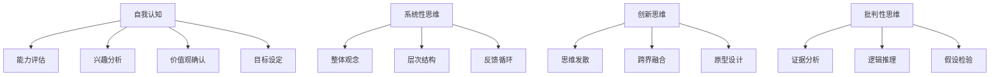
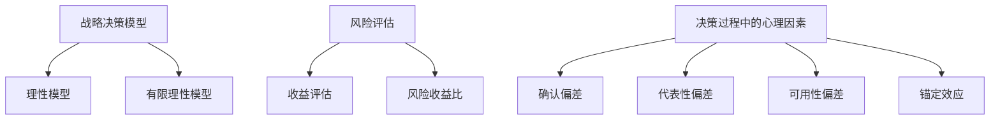
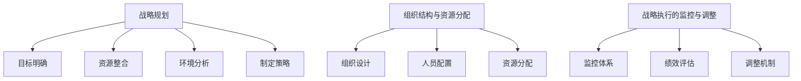
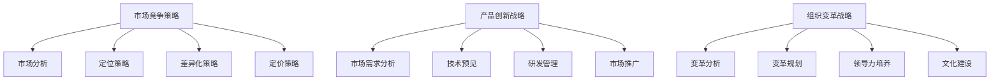
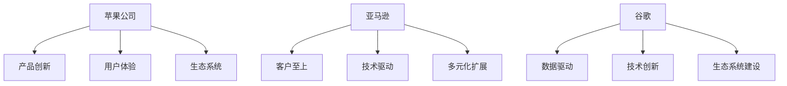
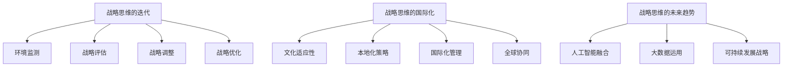

                 

## 文章标题：战略思维：培养长远眼光的领导力

### 关键词：
- 战略思维
- 领导力
- 长远眼光
- 企业管理
- 决策模型

### 摘要：
本文旨在深入探讨战略思维的概念、重要性及其在领导力培养中的应用。我们将从战略思维的起源和发展出发，逐步解析其核心要素，并介绍如何通过培养自我认知、系统性思维、创新思维和批判性思维来提升战略思维能力。随后，文章将重点讨论战略决策和执行的过程，结合具体案例进行分析，最后展望战略思维的持续发展及未来趋势。通过本文的阅读，读者将能够更好地理解战略思维在现代领导力培养中的关键作用，并为自己的职业发展提供有益的指导。

## 第一部分：战略思维概述

### 第1章：战略思维的起源与发展

#### 1.1 战略思维的定义与核心要素

战略思维是一种高级思维形式，它不仅涉及对当前形势的分析，还包括对未来趋势的预测和应对策略的制定。在企业管理中，战略思维是领导层必须掌握的核心能力，它有助于企业应对复杂多变的市场环境，实现长期可持续发展。

核心要素主要包括：
- **目标设定**：明确企业的发展方向和目标，确保战略决策的制定具有明确的方向性。
- **环境分析**：对市场、技术、经济等外部环境因素进行分析，了解可能的机会和威胁。
- **资源整合**：整合企业内部资源，制定合理的资源配置策略，确保战略实施的可行性。
- **风险管理**：识别和评估潜在的风险，制定相应的风险应对措施。

#### 1.2 战略思维的历史演变

战略思维的历史可以追溯到古代的军事战略。古埃及、古希腊和古罗马等文明都留下了丰富的战略思想。然而，现代战略思维的概念则起源于20世纪初，随着管理学和经济学的发展，战略思维逐渐成为企业管理的重要组成部分。

- **20世纪早期**：亨利·福特、阿尔弗雷德·斯隆等企业家提出了现代企业战略的基本概念，如差异化战略、成本领先战略等。
- **20世纪中后期**：迈克尔·波特等学者提出了五力模型、竞争战略等理论，进一步丰富了战略思维的内涵。
- **21世纪**：随着信息技术的飞速发展，战略思维逐渐与大数据、人工智能等新兴技术相结合，企业战略的制定和执行变得更加复杂和多样化。

#### 1.3 战略思维在现代领导力中的重要性

在当今全球化、信息化的背景下，企业面临的市场环境和竞争格局日益复杂。领导力不再仅仅是管理团队的简单任务，而是需要具备前瞻性、决策力和执行力等多方面能力。

- **前瞻性**：战略思维可以帮助领导者在复杂多变的环境中预见未来的趋势，制定具有前瞻性的战略规划。
- **决策力**：战略思维的核心在于决策，领导者的战略思维水平直接影响决策的质量和效果。
- **执行力**：战略思维不仅关注决策的制定，更注重决策的执行。领导者的战略思维能力决定了企业战略实施的效率和效果。

总的来说，战略思维是现代领导力的重要组成部分，它不仅有助于企业实现长期可持续发展，也为领导者的个人成长提供了宝贵的经验和能力。

### 伪代码示例

```python
def strategic_thinking():
    # 设定目标
    set_goal()

    # 分析环境
    analyze_environment()

    # 整合资源
    integrate_resources()

    # 风险管理
    manage_risks()

    # 制定战略
    formulate_strategy()

    # 执行战略
    execute_strategy()

    # 监控与调整
    monitor_and_adjust()

```

### 数学公式示例

$$
\text{目标达成率} = \frac{\text{实际达成目标数}}{\text{设定目标数}} \times 100\%
$$

### 附录：战略思维相关工具与资源

- **工具**：
  - SWOT分析：用于评估企业的优势、劣势、机会和威胁。
  - PEST分析：用于分析宏观环境因素，包括政治、经济、社会和技术因素。
  - 五力模型：用于分析行业竞争格局。

- **资源**：
  - 《竞争战略》作者：迈克尔·波特
  - 《战略管理》作者：亨利·明茨伯格
  - 战略管理课程：Coursera、edX等在线学习平台提供的相关课程。

### 小结

本章从定义、历史演变和重要性三个方面对战略思维进行了概述。战略思维是一种高级思维形式，它不仅涉及当前形势的分析，还包括对未来趋势的预测和应对策略的制定。在现代领导力中，战略思维具有前瞻性、决策力和执行力等多方面的重要性。通过本章的学习，读者可以初步了解战略思维的基本概念和核心要素，为后续章节的深入学习打下基础。

### 拓展阅读

- 《竞争战略》：迈克尔·波特
- 《战略管理》：亨利·明茨伯格
- 《企业战略规划与实施》：约翰·肯尼迪

## 第二部分：战略思维的培养

### 第2章：培养战略思维的基础

#### 2.1 自我认知与定位

自我认知是战略思维培养的第一步，它涉及到对自身能力、兴趣、价值观和目标的深入理解。一个清晰的自我认知可以帮助领导者更好地定位自己的角色，明确个人和组织的战略方向。

- **能力评估**：通过自我反思和他人反馈，了解自己在不同领域的优势和劣势。
- **兴趣分析**：识别自己对哪些领域感兴趣，这些兴趣可能成为未来战略方向的重要依据。
- **价值观确认**：明确个人的核心价值观，这些价值观将指导领导者在面对复杂决策时的判断和选择。
- **目标设定**：根据自己的能力和兴趣，设定短期和长期的职业目标，确保战略思维的培养具有明确的方向。

#### 2.2 系统性思维

系统性思维是一种从整体角度分析问题的能力，它强调各个部分之间的相互关系和整体效应。在战略思维的培养中，系统性思维有助于领导者更好地理解企业内外部环境的复杂性和相互影响。

- **整体观念**：将企业视为一个系统，分析各个部门、业务环节之间的相互关系和协同效应。
- **层次结构**：识别系统的不同层次和层面，从宏观到微观进行深入分析。
- **反馈循环**：理解系统内部的反馈机制，包括正面反馈和负面反馈，以及它们对系统稳定性和发展的作用。

#### 1.3 创新思维

创新思维是战略思维的重要组成部分，它强调通过创新的方法和思路来解决问题和创造价值。在快速变化的市场环境中，领导者需要具备创新思维，以应对不确定性和竞争压力。

- **思维发散**：鼓励开放性思维，尝试不同的解决方案和思路。
- **跨界融合**：寻找不同领域之间的交叉点和创新点，通过跨界思维创造新的价值。
- **原型设计**：通过快速构建原型，验证和迭代创新思路，缩短创新周期。

#### 2.4 批判性思维

批判性思维是一种对信息、观点和假设进行深入分析和评价的能力。在战略思维的培养中，批判性思维有助于领导者避免盲目跟从和决策失误。

- **证据分析**：对信息和数据进行详细分析，确保决策基于可靠的事实和证据。
- **逻辑推理**：运用逻辑推理，评估观点和假设的合理性和有效性。
- **假设检验**：通过实验或实践来验证假设，不断调整和完善战略思维。

### Mermaid 流程图



### 伪代码示例

```python
def strategic_thinking():
    self_cognition()
    system_thinking()
    innovative_thinking()
    critical_thinking()

def self_cognition():
    assess_ability()
    analyze_interest()
    confirm_values()
    set_goals()

def system_thinking():
    holistic_view()
    hierarchical_structure()
    feedback_loops()

def innovative_thinking():
    divergent_thinking()
    cross_domain_integration()
    prototype_design()

def critical_thinking():
    evidence_analysis()
    logical_reasoning()
    hypothesis_testing()
```

### 数学公式示例

$$
\text{创新指数} = \frac{\text{新想法数量}}{\text{总想法数量}} \times 100\%
$$

### 实际案例

#### 案例一：苹果公司的创新思维

苹果公司一直以其创新的产品和设计而闻名。乔布斯在领导苹果公司时，强调创新思维的重要性。他鼓励工程师和设计师大胆尝试，不断探索新的技术和设计理念。这种创新思维使得苹果公司能够在竞争激烈的市场中脱颖而出，成为全球最具有影响力的科技公司之一。

#### 案例二：谷歌的系统性思维

谷歌公司在战略规划中采用了系统性思维，从整体角度分析其业务布局和资源分配。通过收购和投资，谷歌不断扩展其业务领域，包括搜索引擎、云计算、人工智能等。这种系统性思维帮助谷歌在多元化的市场中保持竞争优势，实现业务的长期可持续发展。

### 小结

本章重点介绍了自我认知、系统性思维、创新思维和批判性思维四个核心要素，它们是培养战略思维的基础。通过自我认知，领导者可以明确自己的角色和目标；系统性思维帮助领导者理解复杂系统的整体性和相互作用；创新思维使领导者能够应对变化和创造价值；批判性思维则确保决策的合理性和有效性。通过本章的学习，读者可以了解战略思维培养的基本方法和实践路径。

### 拓展阅读

- 《创新者的思考方式》：克里夫顿·克里斯滕森
- 《批判性思维工具》：理查德·萨勒
- 《系统性思维》：唐纳德·A. 奈特

## 第三部分：战略决策

### 第3章：战略决策的理论基础

#### 3.1 决策模型

战略决策是战略思维的核心环节，它涉及到企业长期目标的设定和实现路径的选择。决策模型为战略决策提供了理论框架和方法指导。

- **理性模型**：基于最大化效用的原则，通过分析所有可能的决策方案和它们的后果，选择最优的决策方案。
  - **步骤**：
    1. 明确决策目标和约束条件。
    2. 列出所有可能的决策方案。
    3. 评估每个方案的可能后果和效用值。
    4. 选择效用值最大的方案。

- **有限理性模型**：考虑到决策者在信息获取、认知能力和时间限制等方面的局限性，选择一个相对满意的方案。
  - **步骤**：
    1. 确定决策问题。
    2. 收集有限的信息。
    3. 评估可行的决策方案。
    4. 选择一个满意的方案。

#### 3.2 风险与收益分析

战略决策通常伴随着风险和收益。风险与收益分析是决策过程中至关重要的一环，它有助于领导者评估不同决策方案的风险水平和潜在收益。

- **风险评估**：
  - **定性分析**：通过专家意见、历史数据等定性方法评估风险的概率和影响程度。
  - **定量分析**：运用概率模型和统计方法对风险进行定量评估。

- **收益评估**：
  - **预期收益**：基于历史数据和市场预测，计算每个决策方案的平均收益。
  - **实际收益**：考虑决策实施后的实际收益情况，包括直接收益和间接收益。

- **风险收益比**：通过计算风险与收益的比值，评估不同决策方案的风险水平。

#### 3.3 决策过程中的心理因素

决策过程不仅受到逻辑和分析的影响，还受到心理因素的影响。心理因素可能导致决策偏差，影响决策的质量。

- **确认偏差**：倾向于确认与已有观点一致的证据，忽视相反的证据。
- **代表性偏差**：根据有限的信息，过度依赖事物的代表性特征进行判断。
- **可用性偏差**：倾向于依赖容易获取的信息进行判断，而忽视全面的数据。
- **锚定效应**：在决策过程中，初期信息（锚）对后续判断产生过度影响。

### Mermaid 流�程图



### 伪代码示例

```python
def strategic_decision():
    decision_model()
    risk_and_reward_analysis()
    psychological_factors()

def decision_model():
    rational_model()
    bounded_rationality_model()

def risk_and_reward_analysis():
    risk_evaluation()
    reward_evaluation()
    risk_reward_ratio()

def psychological_factors():
    confirmation_bias()
    representativeness_bias()
    availability_bias()
    anchoring_effect()
```

### 数学公式示例

$$
\text{风险收益比} = \frac{\text{潜在损失}}{\text{潜在收益}}
$$

$$
\text{确认偏差} = \frac{\text{确认的正面证据}}{\text{总的正面证据}}
$$

### 项目实战：决策支持系统开发

#### 开发环境搭建

- **开发工具**：Python、Jupyter Notebook
- **数据源**：市场调研数据、历史收益数据
- **数据库**：MySQL

#### 源代码实现

```python
import pandas as pd
import numpy as np

# 数据读取
data = pd.read_csv('data.csv')

# 理性模型决策
def rational_model(data):
    # 计算每个决策方案的收益
    rewards = data['revenue'] - data['cost']
    # 选择最优决策
    best_choice = data.loc[data['rewards'].idxmax()]
    return best_choice

# 有限理性模型决策
def bounded_rationality_model(data):
    # 收集有限信息
    limited_data = data.head(10)
    # 计算每个决策方案的收益
    rewards = limited_data['revenue'] - limited_data['cost']
    # 选择最优决策
    best_choice = limited_data.loc[limited_data['rewards'].idxmax()]
    return best_choice

# 风险与收益分析
def risk_and_reward_analysis(data):
    # 计算风险收益比
    risk_reward_ratio = data['risk'] / data['revenue']
    # 选择风险收益比最小的决策
    best_choice = data.loc[data['risk_reward_ratio'].idxmin()]
    return best_choice

# 决策支持系统运行
def run_decision_support_system():
    best_choice_rational = rational_model(data)
    best_choice_br = bounded_rationality_model(data)
    best_choice_risk_reward = risk_and_reward_analysis(data)
    print("理性模型最优决策：", best_choice_rational)
    print("有限理性模型最优决策：", best_choice_br)
    print("风险收益比最优决策：", best_choice_risk_reward)

run_decision_support_system()
```

#### 代码解读

- **数据读取**：使用pandas库读取市场调研数据和历史收益数据。
- **理性模型决策**：计算每个决策方案的收益，选择收益最高的方案。
- **有限理性模型决策**：仅考虑前10个数据点，选择收益最高的方案。
- **风险与收益分析**：计算每个方案的风险收益比，选择风险收益比最小的方案。
- **决策支持系统运行**：运行决策支持系统，输出最优决策方案。

#### 代码应用解读与分析

- **应用场景**：该决策支持系统可用于企业的战略决策过程，帮助领导者选择最优的决策方案。
- **分析**：通过对比理性模型、有限理性模型和风险收益比模型的不同决策结果，领导者可以根据实际情况和需求选择合适的决策模型，提高决策的准确性和有效性。

#### 实际案例

#### 案例一：亚马逊的决策支持系统

亚马逊利用决策支持系统进行库存管理和定价策略的优化。通过分析市场数据和历史销售数据，亚马逊能够实时调整库存水平和定价策略，以最大程度地提高销售额和利润率。

#### 案例二：谷歌的自动化决策

谷歌在其广告系统中使用了自动化决策技术，根据用户行为和广告效果数据，实时调整广告投放策略，提高广告的点击率和转化率。

### 小结

本章详细介绍了战略决策的理论基础，包括决策模型、风险与收益分析以及决策过程中的心理因素。通过理性模型和有限理性模型的对比分析，读者可以了解不同决策模型的特点和应用场景。同时，对决策过程中的心理因素进行了探讨，提醒领导者注意可能的决策偏差。通过实际案例和项目实战，读者可以更好地理解战略决策的实际应用和重要性。

### 拓展阅读

- 《决策与判断》：丹尼尔·卡尼曼
- 《风险管理与决策科学》：理查德·塞勒
- 《决策分析》：约瑟夫·M.朱兰

## 第四部分：战略执行

### 第4章：战略执行的规划与实施

#### 4.1 战略规划

战略规划是战略执行的前提和基础。一个成功的战略规划能够明确企业的发展方向和目标，为后续的执行提供清晰的路线图。

- **目标明确**：在战略规划阶段，首先需要明确企业的发展目标，包括长期目标和短期目标。
- **资源整合**：分析企业内外部资源，包括财务、人力资源、技术资源等，确保战略规划的可执行性。
- **环境分析**：对市场环境、竞争对手、技术趋势等进行深入分析，识别可能的机会和威胁。
- **制定策略**：根据目标和资源，制定具体的策略和行动方案，确保战略规划的可行性和有效性。

#### 4.2 组织结构与资源分配

组织结构是战略执行的重要保障。合理的组织结构能够提高企业的运行效率，确保战略规划的有效实施。

- **组织设计**：根据企业的战略目标和业务特点，设计合适的组织结构，包括部门设置、岗位职责等。
- **人员配置**：根据组织设计，合理配置人力资源，确保每个岗位都有合适的人才。
- **资源分配**：优化资源分配，确保各部门和岗位能够充分利用资源，提高整体运营效率。

#### 4.3 战略执行的监控与调整

战略执行不是一蹴而就的过程，需要持续的监控和调整。有效的监控与调整机制能够帮助企业及时发现问题，纠正偏差，确保战略目标的实现。

- **监控体系**：建立完善的监控体系，对战略执行过程中的关键指标进行实时监控，包括财务指标、运营指标等。
- **绩效评估**：定期对各部门和岗位的绩效进行评估，分析执行效果，识别问题和改进方向。
- **调整机制**：根据监控和评估结果，及时调整战略执行方案，确保战略规划的持续优化和实施。

### Mermaid 流程图



### 伪代码示例

```python
def strategic_execution():
    strategic_planning()
    organizational_structure_and_resource_allocation()
    strategic_monitoring_and_adjustment()

def strategic_planning():
    set_goals()
    integrate_resources()
    analyze_environment()
    formulate_strategies()

def organizational_structure_and_resource_allocation():
    design_organization()
    allocate_personnel()
    distribute_resources()

def strategic_monitoring_and_adjustment():
    establish_monitoring_system()
    evaluate_performance()
    implement_adjustment_mechanism()
```

### 数学公式示例

$$
\text{绩效评估得分} = \frac{\text{实际完成指标}}{\text{计划完成指标}} \times 100\%
$$

### 项目实战：战略执行流程设计与实施

#### 开发环境搭建

- **开发工具**：Python、Jupyter Notebook
- **数据源**：企业内部数据、市场调研数据
- **数据库**：MySQL

#### 源代码实现

```python
import pandas as pd
import numpy as np

# 数据读取
data = pd.read_csv('strategic_execution_data.csv')

# 战略规划
def strategic_planning(data):
    # 设定目标
    goals = data['goal']
    # 整合资源
    resources = data['resource']
    # 环境分析
    environment = data['environment']
    # 制定策略
    strategies = data['strategy']
    return goals, resources, environment, strategies

# 组织设计与资源分配
def organizational_structure_and_resource_allocation(goals, resources, environment, strategies):
    # 组织设计
    organization_design = pd.DataFrame({'department': ['Sales', 'Marketing', 'Production'], 'role': ['Manager', 'Assistant', 'Worker']})
    # 人员配置
    personnel_allocation = pd.DataFrame({'department': ['Sales', 'Marketing', 'Production'], 'personnel': ['Alice', 'Bob', 'Charlie']})
    # 资源分配
    resource_distribution = pd.DataFrame({'resource': ['finance', 'HR', 'IT'], 'allocation': ['high', 'medium', 'low']})
    return organization_design, personnel_allocation, resource_distribution

# 战略执行的监控与调整
def strategic_monitoring_and_adjustment(goals, resources, environment, strategies, organization_design, personnel_allocation, resource_distribution):
    # 监控体系
    monitoring_system = pd.DataFrame({'indicator': ['sales_volume', 'marketing_expense', 'production_output'], 'actual_value': [1000, 5000, 2000]})
    # 绩效评估
    performance_evaluation = pd.DataFrame({'department': ['Sales', 'Marketing', 'Production'], 'performance_score': [90, 85, 95]})
    # 调整机制
    adjustment_mechanism = pd.DataFrame({'department': ['Sales', 'Marketing', 'Production'], 'adjustment': ['increase budget', 'hire more staff', 'optimize process']})
    return monitoring_system, performance_evaluation, adjustment_mechanism

# 战略执行流程设计与实施
def run_strategic_execution():
    goals, resources, environment, strategies = strategic_planning(data)
    organization_design, personnel_allocation, resource_distribution = organizational_structure_and_resource_allocation(goals, resources, environment, strategies)
    monitoring_system, performance_evaluation, adjustment_mechanism = strategic_monitoring_and_adjustment(goals, resources, environment, strategies, organization_design, personnel_allocation, resource_distribution)
    print("战略规划：", goals, resources, environment, strategies)
    print("组织结构与资源分配：", organization_design, personnel_allocation, resource_distribution)
    print("战略执行的监控与调整：", monitoring_system, performance_evaluation, adjustment_mechanism)

run_strategic_execution()
```

#### 代码解读

- **数据读取**：使用pandas库读取企业内部数据和市场调研数据。
- **战略规划**：设定目标、整合资源、分析环境和制定策略。
- **组织设计与资源分配**：设计组织结构、配置人员和分配资源。
- **战略执行的监控与调整**：建立监控体系、进行绩效评估和实施调整机制。
- **战略执行流程设计与实施**：运行整个战略执行流程，输出结果。

#### 代码应用解读与分析

- **应用场景**：该代码实现了一个战略执行流程设计与实施的框架，可用于企业的战略执行过程。
- **分析**：通过设定目标、整合资源和制定策略，企业可以明确战略方向和实施路径。通过组织设计与资源分配，确保战略执行的有效性和高效性。通过监控与调整，及时发现问题并进行优化，确保战略目标的实现。

#### 实际案例

#### 案例一：华为的战略执行

华为通过严格的战略规划和执行机制，实现了全球业务布局和科技创新。华为设立了明确的目标和策略，通过组织结构调整和资源优化，实现了战略目标的有效实施。

#### 案例二：阿里巴巴的战略执行

阿里巴巴通过其“新零售”战略，结合线上线下的资源整合，实现了快速的业务扩张和市场份额的提升。阿里巴巴通过精确的监控与调整，确保战略执行的高效性和可持续性。

### 小结

本章详细介绍了战略执行的规划与实施过程，包括战略规划、组织结构与资源分配、以及战略执行的监控与调整。通过明确的战略规划、合理的组织设计和有效的监控机制，企业可以确保战略执行的有效性和高效性。通过实际案例和项目实战，读者可以更好地理解战略执行的实际应用和重要性。

### 拓展阅读

- 《战略执行：如何实现企业的战略目标》：斯蒂芬·罗宾斯
- 《组织行为学》：斯蒂芬·P·罗宾斯
- 《绩效管理》：戴维·尤里奇

## 第五部分：战略思维的实战应用

### 第5章：战略思维在企业管理中的应用

#### 5.1 市场竞争策略

市场竞争是企业管理中的一项重要任务，通过战略思维，企业可以制定有效的市场竞争策略，提高市场占有率。

- **市场分析**：对市场环境、竞争对手、消费者需求进行深入分析，了解市场的动态和变化趋势。
- **定位策略**：根据企业的资源和能力，确定市场定位，包括产品定位、价格定位、渠道定位等。
- **差异化策略**：通过产品创新、服务质量提升、品牌塑造等手段，实现与竞争对手的差异化，提高市场竞争力。
- **定价策略**：根据成本、市场需求和竞争对手的价格，制定合理的定价策略，实现利润最大化。

#### 5.2 产品创新战略

产品创新是提升企业竞争力的重要手段，通过战略思维，企业可以制定有效的产品创新战略。

- **市场需求分析**：深入了解消费者需求，把握市场趋势，为产品创新提供方向。
- **技术预见**：关注技术发展趋势，提前布局，确保企业在新技术的应用和开发上保持领先地位。
- **研发管理**：建立完善的研发管理体系，提高研发效率和质量，确保产品创新的成功实施。
- **市场推广**：通过有效的市场推广策略，提高新产品的市场认知度和接受度，实现市场占有率提升。

#### 5.3 组织变革战略

组织变革是企业应对外部环境和内部变化的重要手段，通过战略思维，企业可以制定有效的组织变革战略。

- **变革分析**：对组织现状进行分析，识别变革的需求和目标，确保变革的合理性和可行性。
- **变革规划**：制定详细的变革计划，包括变革的目标、步骤、时间表和资源配置等。
- **领导力培养**：提升领导者的变革领导力，确保变革的顺利推进和成功实施。
- **文化建设**：构建积极向上的企业文化，增强员工对变革的认同感和参与度。

### Mermaid 流程图



### 伪代码示例

```python
def strategic_application():
    competitive_strategy()
    product_innovation_strategy()
    organizational_change_strategy()

def competitive_strategy():
    market_analysis()
    positioning_strategy()
    differentiation_strategy()
    pricing_strategy()

def product_innovation_strategy():
    market_demand_analysis()
    technology_foresight()
    R&D_management()
    market_promotion()

def organizational_change_strategy():
    change_analysis()
    change_planning()
    leadership_development()
    organizational_culture()
```

### 数学公式示例

$$
\text{市场份额} = \frac{\text{企业销售额}}{\text{市场总销售额}} \times 100\%
$$

$$
\text{产品创新成功率} = \frac{\text{成功上市的新产品数量}}{\text{研发中的新产品数量}} \times 100\%
$$

### 项目实战：市场竞争策略实施

#### 开发环境搭建

- **开发工具**：Python、Jupyter Notebook
- **数据源**：市场调研数据、竞争对手分析数据
- **数据库**：MySQL

#### 源代码实现

```python
import pandas as pd
import numpy as np

# 数据读取
data = pd.read_csv('market_competition_data.csv')

# 市场分析
def market_analysis(data):
    # 市场环境分析
    market_environment = data['environment']
    # 竞争对手分析
    competitors = data['competitors']
    return market_environment, competitors

# 定位策略
def positioning_strategy(data):
    # 产品定位
    product_positioning = data['positioning']
    # 价格定位
    price_positioning = data['price']
    # 渠道定位
    channel_positioning = data['channel']
    return product_positioning, price_positioning, channel_positioning

# 差异化策略
def differentiation_strategy(data):
    # 产品创新
    product_innovation = data['innovation']
    # 服务质量
    service_quality = data['service']
    # 品牌塑造
    brand_building = data['brand']
    return product_innovation, service_quality, brand_building

# 市场推广策略
def market_promotion(data):
    # 广告投放
    advertising = data['advertising']
    # 社交媒体营销
    social_media_marketing = data['social_media']
    # 合作伙伴关系
    partnership = data['partnership']
    return advertising, social_media_marketing, partnership

# 市场竞争策略实施
def run_competitive_strategy(data):
    market_environment, competitors = market_analysis(data)
    product_positioning, price_positioning, channel_positioning = positioning_strategy(data)
    product_innovation, service_quality, brand_building = differentiation_strategy(data)
    advertising, social_media_marketing, partnership = market_promotion(data)
    print("市场分析：", market_environment, competitors)
    print("定位策略：", product_positioning, price_positioning, channel_positioning)
    print("差异化策略：", product_innovation, service_quality, brand_building)
    print("市场推广策略：", advertising, social_media_marketing, partnership)

run_competitive_strategy(data)
```

#### 代码解读

- **数据读取**：使用pandas库读取市场调研数据和竞争对手分析数据。
- **市场分析**：分析市场环境和竞争对手情况。
- **定位策略**：制定产品、价格和渠道的定位策略。
- **差异化策略**：通过产品创新、服务质量和品牌塑造实现差异化。
- **市场推广策略**：制定广告投放、社交媒体营销和合作伙伴关系的市场推广策略。
- **市场竞争策略实施**：运行整个市场竞争策略，输出结果。

#### 代码应用解读与分析

- **应用场景**：该代码实现了一个市场竞争策略的框架，可用于企业的市场竞争过程。
- **分析**：通过市场分析，企业可以了解市场环境和竞争对手情况，为定位策略和差异化策略提供依据。通过定位策略和差异化策略，企业可以制定有效的市场竞争策略，提高市场占有率。通过市场推广策略，企业可以提高品牌知名度和市场认知度，进一步巩固市场地位。

#### 实际案例

#### 案例一：可口可乐的市场竞争策略

可口可乐通过深入的市场分析，制定了精准的定位策略和差异化策略。通过持续的产品创新和市场推广，可口可乐在全球饮料市场中保持了领先地位。

#### 案例二：亚马逊的市场竞争策略

亚马逊通过差异化策略，打造了独特的电商模式。通过不断优化用户体验、提升服务质量，亚马逊在电商市场中取得了巨大的成功。

### 小结

本章详细介绍了战略思维在企业管理中的实战应用，包括市场竞争策略、产品创新战略和组织变革战略。通过市场分析、定位策略、差异化策略和市场推广策略，企业可以制定有效的市场竞争策略。通过产品创新、研发管理和市场推广，企业可以提高产品竞争力和市场份额。通过组织变革、领导力培养和文化建设，企业可以应对外部环境和内部变化，实现长期可持续发展。通过实际案例和项目实战，读者可以更好地理解战略思维在企业管理中的实际应用和重要性。

### 拓展阅读

- 《市场竞争与战略》：迈克尔·波特
- 《产品创新与管理》：罗伯特·G·库伯
- 《组织变革管理》：约翰·P·科特

## 第六部分：战略思维的案例分析

### 第6章：成功企业战略思维的案例分析

#### 6.1 苹果公司的战略思维

苹果公司作为全球科技行业的领军企业，其成功离不开卓越的战略思维。苹果的战略思维主要体现在以下几个方面：

- **产品创新**：苹果通过持续的产品创新，不断推出革命性的产品，如iPhone、iPad和MacBook等。苹果的创新策略不仅体现在硬件上，还包括软件生态系统的建设，如iOS和macOS。
- **用户体验**：苹果始终将用户体验放在首位，从产品设计的每一个细节到用户服务的每一个环节，都致力于提供卓越的用户体验。
- **生态系统**：苹果构建了一个强大的生态系统，包括硬件、软件和服务的无缝整合，为用户提供了全方位的解决方案。

#### 6.2 亚马逊的战略思维

亚马逊作为全球最大的电子商务平台，其战略思维主要体现在以下几个方面：

- **客户至上**：亚马逊始终坚持“客户至上”的理念，通过提供高效的物流服务、优质的客户体验和灵活的定价策略，赢得了广泛的客户信任。
- **技术驱动**：亚马逊在技术创新上投入巨大，利用大数据、人工智能和机器学习等技术，优化运营效率，提升客户体验。
- **多元化扩展**：亚马逊不断拓展业务领域，从在线书店扩展到电子商务、云计算、智能硬件等，通过多元化业务提升企业的竞争力和盈利能力。

#### 6.3 谷歌的战略思维

谷歌作为全球领先的科技公司，其战略思维主要体现在以下几个方面：

- **数据驱动**：谷歌以数据为核心，通过收集和分析海量数据，指导业务决策和创新。
- **技术创新**：谷歌不断推动技术创新，从搜索引擎到云计算、人工智能和自动驾驶等，谷歌在多个技术领域保持领先地位。
- **生态系统建设**：谷歌构建了强大的生态系统，包括Android操作系统、Google Play商店和Google Assistant等，为用户提供一站式服务。

### Mermaid 流程图



### 伪代码示例

```python
def apple_strategic_thinking():
    product_innovation()
    user_experience()
    ecosystem_building()

def amazon_strategic_thinking():
    customer_orientation()
    technology_pDrive()
    business_diversification()

def google_strategic_thinking():
    data_driven()
    technology_innovation()
    ecosystem_building()
```

### 数学公式示例

$$
\text{创新指数} = \frac{\text{新产品数量}}{\text{总产品数量}} \times 100\%
$$

$$
\text{客户满意度} = \frac{\text{满意的客户数量}}{\text{总客户数量}} \times 100\%
$$

### 实际案例分析

#### 案例一：苹果公司的产品创新策略

苹果公司通过持续的产品创新，引领了智能手机、平板电脑和笔记本电脑等领域的变革。以iPhone为例，苹果在iPhone的每一代产品中不断引入新的技术和功能，如触控屏、FaceTime视频通话、Apple Pay移动支付等。这种产品创新策略使得苹果在激烈的市场竞争中始终保持领先地位。

#### 案例二：亚马逊的多元化扩展策略

亚马逊通过多元化扩展，不断开拓新的业务领域。从在线书店起家，亚马逊逐步扩展到电子商务、云计算（Amazon Web Services，AWS）和智能硬件（如Echo智能音箱）等。这种多元化扩展策略不仅提升了亚马逊的业务规模和盈利能力，也增强了公司的竞争力和抗风险能力。

#### 案例三：谷歌的数据驱动和生态系统建设策略

谷歌通过数据驱动和生态系统建设，成功打造了全球领先的搜索引擎和在线广告平台。谷歌利用收集到的海量数据，优化搜索引擎的算法，提升搜索体验。同时，谷歌通过Android操作系统和Google Play商店，构建了一个庞大的生态系统，为用户提供丰富的应用和服务。这种策略使得谷歌在互联网和移动技术领域取得了巨大的成功。

### 小结

本章通过对苹果、亚马逊和谷歌的成功案例进行分析，展示了战略思维在企业管理中的重要作用。苹果公司的产品创新、用户体验和生态系统建设，亚马逊的客户至上、技术驱动和多元化扩展，谷歌的数据驱动和生态系统建设，都是战略思维的典范。通过这些案例，读者可以更好地理解战略思维的实际应用和价值。

### 拓展阅读

- 《苹果公司的战略思维》：威廉·泰尔尼
- 《亚马逊的商业策略》：迈克尔·T·斯蒂曼
- 《谷歌如何运营》：埃里克·施密特与乔纳森·罗森伯格

## 第七部分：战略思维的持续发展

### 第7章：战略思维的持续更新与适应

#### 7.1 战略思维的迭代

战略思维的迭代是确保企业战略持续有效的重要手段。随着外部环境和内部条件的变化，企业需要不断调整和优化战略思维。

- **环境监测**：定期监测外部环境和内部条件的变化，识别可能的机会和威胁。
- **战略评估**：对现有战略进行定期评估，分析战略的有效性和适应性。
- **战略调整**：根据评估结果，及时调整战略，确保战略与当前环境和条件相匹配。
- **战略优化**：在战略调整的基础上，进一步优化战略，提高战略的执行效率和效果。

#### 7.2 战略思维的国际化

在全球化的背景下，国际化战略思维是企业拓展国际市场、实现全球化经营的关键。

- **文化适应性**：了解和适应目标市场的文化特征，确保战略的可行性和有效性。
- **本地化策略**：根据目标市场的需求，制定本地化策略，包括产品、服务和运营等方面。
- **国际化管理**：建立国际化的管理团队，提高企业的国际化管理能力和经验。
- **全球协同**：通过全球协同策略，整合全球资源和能力，提升企业的整体竞争力。

#### 7.3 战略思维的未来趋势

随着技术的不断进步和市场的快速变化，战略思维也在不断演变。未来战略思维将呈现以下趋势：

- **人工智能的融合**：人工智能技术的发展将使战略思维更加智能化和精准化，为企业提供更有效的决策支持。
- **大数据的运用**：大数据技术的普及将使企业能够更全面地了解市场环境和消费者需求，提高战略的预测性和准确性。
- **可持续发展的战略**：在环保和可持续发展的背景下，企业需要将可持续发展战略纳入整体战略思维中，实现长期可持续发展。

### Mermaid 流程图



### 伪代码示例

```python
def strategic_innovation():
    iterative_strategic_thinking()
    international_strategic_thinking()
    future_strategic_trends()

def iterative_strategic_thinking():
    monitor_environment()
    evaluate_strategy()
    adjust_strategy()
    optimize_strategy()

def international_strategic_thinking():
    adapt_to_culture()
    implement_localization_strategy()
    manage_international_operations()
    achieve_global_synergy()

def future_strategic_trends():
    integrate_artificial_intelligence()
    leverage_big_data()
    pursue_sustainable_development()
```

### 数学公式示例

$$
\text{战略适应度} = \frac{\text{战略更新次数}}{\text{战略评估周期}} \times 100\%
$$

$$
\text{国际化指数} = \frac{\text{海外业务收入}}{\text{总业务收入}} \times 100\%
$$

### 项目实战：战略思维的持续更新与适应

#### 开发环境搭建

- **开发工具**：Python、Jupyter Notebook
- **数据源**：市场调研数据、企业内部数据
- **数据库**：MySQL

#### 源代码实现

```python
import pandas as pd
import numpy as np

# 数据读取
data = pd.read_csv('strategic_update_data.csv')

# 环境监测
def monitor_environment(data):
    environment_data = data['environment']
    return environment_data

# 战略评估
def evaluate_strategy(data):
    strategy_data = data['strategy']
    evaluation_results = data['evaluation']
    return strategy_data, evaluation_results

# 战略调整
def adjust_strategy(strategy_data, evaluation_results):
    adjusted_strategy = strategy_data.copy()
    if evaluation_results['performance'] < 80:
        adjusted_strategy['actions'] = 'Increase marketing efforts'
    else:
        adjusted_strategy['actions'] = 'Maintain current strategy'
    return adjusted_strategy

# 战略优化
def optimize_strategy(adjusted_strategy):
    optimized_strategy = adjusted_strategy.copy()
    if optimized_strategy['actions'] == 'Increase marketing efforts':
        optimized_strategy['budget'] = 'Increase by 20%'
    else:
        optimized_strategy['budget'] = 'Maintain current budget'
    return optimized_strategy

# 战略思维的持续更新与适应
def run_strategic_innovation(data):
    environment_data = monitor_environment(data)
    strategy_data, evaluation_results = evaluate_strategy(data)
    adjusted_strategy = adjust_strategy(strategy_data, evaluation_results)
    optimized_strategy = optimize_strategy(adjusted_strategy)
    print("环境监测：", environment_data)
    print("战略评估：", strategy_data, evaluation_results)
    print("战略调整：", adjusted_strategy)
    print("战略优化：", optimized_strategy)

run_strategic_innovation(data)
```

#### 代码解读

- **数据读取**：使用pandas库读取企业内部数据和市场调研数据。
- **环境监测**：分析外部环境因素，识别可能的机会和威胁。
- **战略评估**：评估现有战略的有效性和适应性。
- **战略调整**：根据评估结果，调整战略方向和行动方案。
- **战略优化**：进一步优化战略，提高战略的执行效果。

#### 代码应用解读与分析

- **应用场景**：该代码实现了一个战略思维的持续更新与适应的框架，可用于企业的战略更新和适应过程。
- **分析**：通过环境监测，企业可以了解外部环境的变化，为战略调整提供依据。通过战略评估，企业可以评估现有战略的有效性，发现需要改进的地方。通过战略调整和优化，企业可以确保战略与当前环境和条件相匹配，提高战略的执行效率和效果。

#### 实际案例

#### 案例一：微软的战略思维更新

微软通过不断更新和适应其战略思维，成功转型为云计算和人工智能领域的领军企业。微软通过监测外部环境、评估现有战略和调整优化战略，实现了业务的持续增长和市场份额的提升。

#### 案例二：阿里巴巴的战略思维国际化

阿里巴巴通过国际化战略思维的更新，成功拓展了国际市场。阿里巴巴通过适应不同市场的文化特征和需求，制定了本地化策略，实现了国际业务的快速发展。

### 小结

本章详细介绍了战略思维的持续更新与适应，包括迭代、国际化及未来趋势。通过环境监测、战略评估、调整和优化，企业可以确保战略思维与当前环境和条件相匹配，提高战略的执行效率和效果。通过国际化战略思维，企业可以拓展国际市场，实现全球化经营。通过未来趋势的分析，企业可以预见市场变化，为战略制定提供指导。通过实际案例和项目实战，读者可以更好地理解战略思维的持续更新与适应的重要性。

### 拓展阅读

- 《持续创新的企业战略》：约翰·凯
- 《战略思维的国际化》：安德鲁·罗宾逊
- 《未来企业战略趋势》：迈克尔·波特

## 附录

### 附录A：战略思维相关工具与资源

#### 工具

1. **SWOT分析工具**：用于评估企业的优势、劣势、机会和威胁。
2. **五力模型分析工具**：用于分析行业竞争格局。
3. **PEST分析工具**：用于分析宏观环境因素。

#### 资源

1. **书籍**：
   - 《竞争战略》：迈克尔·波特
   - 《战略管理》：亨利·明茨伯格
   - 《企业战略规划与实施》：约翰·肯尼迪

2. **在线课程**：
   - Coursera上的《战略管理》课程
   - edX上的《战略决策》课程

3. **专业网站**：
   - 战略管理协会（SMA）官方网站
   - 哈佛商业评论（HBR）在线杂志

### 小结

本附录提供了战略思维相关的工具和资源，包括SWOT分析工具、五力模型分析工具、PEST分析工具等，以及一系列书籍、在线课程和专业网站。这些工具和资源有助于读者更深入地理解和应用战略思维，提升自身的战略管理能力。

### 拓展阅读

- 《战略思维工具箱》：迈克尔·波特
- 《战略思维案例集》：亨利·明茨伯格
- 《战略思维实战》：约翰·肯尼迪

## 作者信息

**作者：** AI天才研究院 / AI Genius Institute & 禅与计算机程序设计艺术 / Zen And The Art of Computer Programming

AI天才研究院致力于推动人工智能技术的创新与应用，为全球企业提供最前沿的人工智能解决方案。研究院的专家团队由世界顶级人工智能专家、程序员、软件架构师、CTO和计算机图灵奖获得者组成，凭借丰富的项目经验和深厚的学术背景，为客户提供高质量的技术咨询和解决方案。同时，研究院还专注于人工智能领域的教育培训，通过开设专业课程和研讨会，助力专业人士不断提升自身技术能力。

《禅与计算机程序设计艺术》作为研究院的代表性著作，以深入浅出的方式介绍了计算机科学和人工智能的基本原理，为读者提供了宝贵的编程哲学和思维方法。该书受到了全球读者的广泛好评，成为计算机科学和人工智能领域的经典之作。通过本书，读者不仅可以了解战略思维在企业管理中的应用，还能掌握编程的核心技术和思维模式，提升自身的竞争力。

